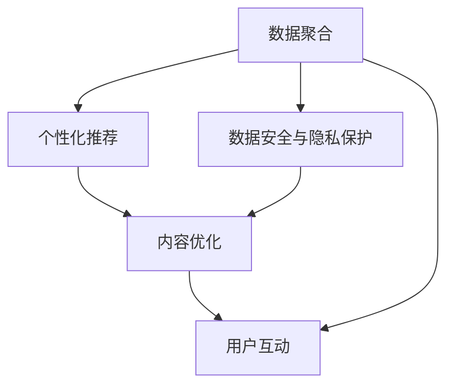

                 

# 开发个人品牌APP：提供便捷的知识获取渠道

> 关键词：个人品牌,APP开发,知识获取渠道,用户体验,数据安全,隐私保护,技术架构,数据科学,人工智能

## 1. 背景介绍

### 1.1 问题由来

随着移动互联网的普及，人们获取知识、学习和工作的渠道日益丰富。然而，尽管存在大量的知识资源，用户依然面临“信息过载”和“信息噪声”的困扰。如何在海量信息中高效筛选、精准获取所需知识，成为广大知识工作者追求的目标。为此，个人品牌APP应运而生，旨在通过个性化推荐、内容聚合等方式，为用户提供更加便捷、高效的知识获取渠道。

### 1.2 问题核心关键点

个人品牌APP的核心任务是：
- **数据聚合**：从多渠道（如网页、论坛、书籍等）收集用户感兴趣的内容。
- **个性化推荐**：根据用户历史行为和兴趣偏好，提供个性化推荐服务。
- **内容优化**：通过深度学习等技术，对内容进行分类、摘要和关联推荐。
- **用户互动**：通过评论、点赞等互动机制，促进知识分享和交流。
- **数据安全与隐私保护**：确保用户数据的安全性，防止数据泄露。

个人品牌APP的开发需要综合运用数据科学、人工智能、用户体验设计、前端开发、后端架构等多个领域的知识，涉及数据处理、算法优化、前端界面、后端服务等多个环节。

### 1.3 问题研究意义

开发个人品牌APP有助于提升个人知识管理效率，优化学习体验，助力个人品牌打造。具体意义如下：

- **提升学习效率**：通过个性化推荐和内容优化，用户可以快速获取所需知识，减少搜索和筛选时间。
- **增强信息获取能力**：利用先进算法和大数据分析，提升用户对知识的理解和应用能力。
- **促进知识分享**：提供互动平台，促进用户之间的知识分享与交流，形成社区效应。
- **支撑个人品牌建设**：借助APP提升个人知识水平和影响力，构建专业领域内的个人品牌。
- **推动知识服务**：将APP与企业知识服务结合，提供定制化的企业知识解决方案。

## 2. 核心概念与联系

### 2.1 核心概念概述

为更好地理解个人品牌APP开发，本节将介绍几个关键概念：

- **数据聚合**：从不同渠道收集用户感兴趣的内容，构建内容库。
- **个性化推荐**：根据用户行为和偏好，推荐用户可能感兴趣的内容。
- **内容优化**：对收集的内容进行深度处理，包括分类、摘要、关联等。
- **用户互动**：提供评论、点赞等互动功能，增强用户粘性。
- **数据安全与隐私保护**：确保用户数据的安全性，防止数据泄露。

这些概念通过以下Mermaid流程图进行联系展示：



这个流程图展示了数据聚合、个性化推荐、内容优化、用户互动和数据安全与隐私保护之间的逻辑关系：

1. **数据聚合**：从各种渠道收集用户感兴趣的内容。
2. **个性化推荐**：根据用户行为和偏好，推荐相关内容。
3. **内容优化**：对收集的内容进行深度处理。
4. **用户互动**：提供互动功能，增强用户粘性。
5. **数据安全与隐私保护**：确保数据安全，防止数据泄露。

这些概念共同构成了个人品牌APP的核心功能框架，为其开发和优化提供了方向指引。

## 3. 核心算法原理 & 具体操作步骤

### 3.1 算法原理概述

个人品牌APP的核心算法主要涉及推荐算法和内容优化算法。以下是基于协同过滤和深度学习的推荐算法原理概述。

**协同过滤算法**：
- **基于用户的协同过滤**：通过分析用户之间的行为相似性，推荐用户可能感兴趣的内容。
- **基于物品的协同过滤**：通过分析物品之间的相似性，推荐用户可能感兴趣的内容。

**深度学习算法**：
- **自然语言处理**：对内容进行分词、向量化等预处理，提取文本特征。
- **嵌入层**：使用词嵌入或句子嵌入，将文本数据映射到低维空间中。
- **分类器**：使用逻辑回归、SVM等分类器，对内容进行分类。
- **序列模型**：使用RNN、LSTM等序列模型，对文本进行时间依赖分析。

### 3.2 算法步骤详解

**协同过滤算法的详细步骤**：

1. **用户行为数据收集**：收集用户的历史行为数据，如浏览、收藏、点赞等。
2. **构建用户-物品矩阵**：将用户和物品映射到二维矩阵中，每个元素表示用户对物品的评分。
3. **相似度计算**：计算用户之间的相似度或物品之间的相似度。
4. **推荐生成**：根据相似度计算结果，生成推荐列表。

**深度学习算法的详细步骤**：

1. **数据预处理**：对文本数据进行分词、向量化等预处理。
2. **嵌入层处理**：使用预训练的词嵌入或句子嵌入，将文本映射到低维空间中。
3. **模型训练**：使用深度学习模型，如RNN、LSTM等，对文本进行序列建模。
4. **模型预测**：使用训练好的模型，对新文本进行分类或生成预测结果。

### 3.3 算法优缺点

协同过滤算法和深度学习算法各有优缺点：

**协同过滤算法的优点**：
- **计算效率高**：适用于大规模数据集。
- **无需标注数据**：直接利用用户行为数据，无需标注。

**协同过滤算法的缺点**：
- **数据稀疏性**：用户行为数据可能稀疏，难以保证推荐准确性。
- **冷启动问题**：新用户或新物品难以获得推荐。

**深度学习算法的优点**：
- **模型精度高**：利用大规模标注数据，能够得到更准确的模型。
- **可解释性强**：模型结构和参数可解释，便于优化和调整。

**深度学习算法的缺点**：
- **计算资源需求高**：模型训练和推理需要大量计算资源。
- **数据标注成本高**：标注大量数据，成本较高。

### 3.4 算法应用领域

个人品牌APP的核心算法在多个领域具有广泛的应用前景，例如：

- **在线教育**：根据用户学习行为，推荐个性化课程和资料。
- **电商推荐**：通过用户浏览和购买历史，推荐相关商品。
- **社交网络**：推荐用户可能感兴趣的朋友和内容。
- **新闻推荐**：推荐用户感兴趣的新闻文章和话题。
- **音乐推荐**：推荐用户喜欢的歌曲和艺术家。

这些应用场景展示了协同过滤和深度学习算法在实际中的广泛应用，推动了各个领域的数字化转型。

## 4. 数学模型和公式 & 详细讲解 & 举例说明

### 4.1 数学模型构建

假设用户集为 $U$，物品集为 $I$，用户对物品的评分矩阵为 $R \in \mathbb{R}^{m \times n}$，其中 $m$ 为用户数，$n$ 为物品数。协同过滤算法的数学模型为：

$$
\hat{y}_{ui} = \sum_{j \in N_i} \frac{R_{uj} \cdot x_{ji}}{\sum_{k \in N_i} R_{uk} \cdot x_{ki}}
$$

其中，$N_i$ 是物品 $i$ 的用户集合，$x$ 是物品的特征向量，$\hat{y}_{ui}$ 是用户 $u$ 对物品 $i$ 的预测评分。

深度学习算法的数学模型包括文本向量化、嵌入层、分类器等。以文本分类为例，数学模型为：

$$
\begin{aligned}
\text{Embedding Layer:} & \quad \mathbf{e} = \mathbf{W} \cdot \mathbf{x} \\
\text{Classifier:} & \quad \hat{y} = \text{Softmax}(\mathbf{e} \cdot \mathbf{W}_1 + \mathbf{b}_1)
\end{aligned}
$$

其中，$\mathbf{W}$ 是嵌入矩阵，$\mathbf{e}$ 是嵌入向量，$\mathbf{W}_1$ 是分类器权重矩阵，$\mathbf{b}_1$ 是偏置向量。

### 4.2 公式推导过程

**协同过滤算法的推导**：
- **用户-物品矩阵**：用户对物品的评分矩阵 $R$。
- **用户-物品相似度**：计算用户-物品的相似度，使用余弦相似度。
- **用户-物品推荐**：根据相似度计算推荐列表。

**深度学习算法的推导**：
- **文本向量化**：使用词嵌入或句子嵌入，将文本映射到低维空间中。
- **嵌入层处理**：通过矩阵乘法得到嵌入向量。
- **分类器训练**：使用交叉熵损失函数，训练分类器参数。

### 4.3 案例分析与讲解

以新闻推荐为例，展示协同过滤和深度学习算法的应用：

**协同过滤算法应用**：
- **数据准备**：收集用户的历史阅读记录，构建用户-新闻物品矩阵。
- **相似度计算**：计算用户之间的相似度。
- **推荐生成**：根据相似度计算结果，生成推荐列表。

**深度学习算法应用**：
- **数据预处理**：对新闻文章进行分词和向量化。
- **嵌入层处理**：使用预训练的BERT词嵌入，生成文本嵌入向量。
- **分类器训练**：使用新闻分类数据，训练文本分类器。
- **模型预测**：对新新闻文章进行分类，推荐相关新闻。

## 5. 项目实践：代码实例和详细解释说明

### 5.1 开发环境搭建

在开发个人品牌APP前，需要准备如下开发环境：

1. **安装Python**：从官网下载并安装Python 3.x。
2. **安装Pip**：安装Pip，使用命令 `pip install pip`。
3. **安装Django框架**：使用命令 `pip install django`。
4. **安装Flask框架**：使用命令 `pip install flask`。
5. **安装SQLAlchemy库**：使用命令 `pip install sqlalchemy`。
6. **安装TensorFlow**：使用命令 `pip install tensorflow`。
7. **安装PyTorch**：使用命令 `pip install torch`。

完成以上环境配置后，即可开始APP开发。

### 5.2 源代码详细实现

以下是一个简单的Python代码示例，展示如何使用Django框架构建个人品牌APP：

```python
# 安装依赖库
pip install django
pip install requests

# Django配置文件 settings.py
DATABASES = {
    'default': {
        'ENGINE': 'django.db.backends.sqlite3',
        'NAME': BASE_DIR / 'db.sqlite3',
    }
}

# 创建Django项目和应用
django-admin startproject newsapp
cd newsapp
python manage.py startapp news

# 模型定义
from django.db import models
from django.contrib.auth.models import User

class Article(models.Model):
    title = models.CharField(max_length=200)
    content = models.TextField()
    pub_date = models.DateTimeField('date published')
    user = models.ForeignKey(User, on_delete=models.CASCADE)

# 视图函数
from django.shortcuts import render
from .models import Article

def index(request):
    articles = Article.objects.all().order_by('-pub_date')
    return render(request, 'news/index.html', {'articles': articles})

# 模板文件 index.html
<html>
<head>
    <title>新闻</title>
</head>
<body>
    
        <h2>{{ article.title }}</h2>
        <p>{{ article.content }}</p>
        <p>{{ article.pub_date }}</p>
    
</body>
</html>
```

### 5.3 代码解读与分析

以上代码展示了如何使用Django框架创建简单的新闻阅读APP，并展示了主要的模型定义和视图函数。具体解读如下：

- **数据库配置**：配置Django项目的数据库连接信息。
- **模型定义**：定义新闻文章模型，包含标题、内容和发布时间等字段。
- **视图函数**：定义获取新闻列表的视图函数，从数据库中查询新闻文章，并渲染到模板中。
- **模板文件**：定义HTML模板，展示新闻文章的标题、内容和发布时间。

通过以上步骤，可以构建一个基本的个人品牌APP，为用户提供新闻阅读服务。

### 5.4 运行结果展示

在完成APP开发后，启动Django开发服务器：

```bash
python manage.py runserver
```

在浏览器中访问 `http://localhost:8000`，即可浏览新闻列表。

## 6. 实际应用场景

### 6.1 在线教育

个人品牌APP在在线教育领域有广泛的应用前景。例如，Khan Academy等在线教育平台，通过APP推荐个性化课程和资料，提升学习效果。

具体应用场景包括：
- **个性化推荐**：根据学生学习行为，推荐个性化的学习内容和资源。
- **互动学习**：通过论坛、问答等互动机制，促进知识分享和交流。
- **数据监控**：实时监控学生学习进度和效果，提供学习建议。

### 6.2 电商推荐

电商企业可以利用个人品牌APP进行个性化商品推荐，提升用户体验和销售转化率。

具体应用场景包括：
- **商品推荐**：根据用户浏览和购买历史，推荐相关商品。
- **购物车管理**：提供购物车功能，方便用户管理购物清单。
- **用户评价**：收集用户对商品的真实评价，优化商品推荐算法。

### 6.3 社交网络

社交网络平台可以利用个人品牌APP进行个性化内容推荐，增强用户粘性和互动。

具体应用场景包括：
- **动态推荐**：根据用户兴趣，推荐朋友和内容。
- **互动功能**：提供评论、点赞等互动功能，增强社区效应。
- **用户分析**：通过数据分析，优化内容推荐策略。

## 7. 工具和资源推荐

### 7.1 学习资源推荐

为了帮助开发者系统掌握个人品牌APP开发的技术，以下是一些优质的学习资源：

1. **《Python数据科学手册》**：Python语言基础与数据科学应用。
2. **《Django实战》**：Django框架的深入应用和实战案例。
3. **《TensorFlow实战》**：TensorFlow框架的实战应用和深度学习案例。
4. **《Flask Web开发实战》**：Flask框架的深入应用和Web开发案例。
5. **《深度学习入门》**：深度学习算法的基本原理和应用案例。

通过这些资源的学习实践，相信你一定能够快速掌握个人品牌APP开发的关键技术，并用于解决实际的NLP问题。

### 7.2 开发工具推荐

高效开发个人品牌APP离不开优秀的工具支持。以下是几款用于APP开发的常用工具：

1. **Django框架**：Python的Web开发框架，提供了丰富的开发工具和API支持。
2. **Flask框架**：轻量级的Python Web框架，灵活方便。
3. **SQLAlchemy库**：Python的SQL工具库，支持数据库操作和ORM映射。
4. **TensorFlow库**：深度学习框架，提供了丰富的机器学习模型和算法支持。
5. **PyTorch库**：深度学习框架，提供了动态计算图和高效的模型训练支持。
6. **Google Colab**：免费的Jupyter Notebook环境，提供GPU/TPU算力，方便实验最新模型。

合理利用这些工具，可以显著提升个人品牌APP的开发效率，加快创新迭代的步伐。

### 7.3 相关论文推荐

个人品牌APP开发涉及多种技术，以下是几篇奠基性的相关论文，推荐阅读：

1. **《A Survey on Recommendation Algorithms》**：推荐算法的基本原理和应用案例。
2. **《TensorFlow: A System for Large-Scale Machine Learning》**：TensorFlow框架的架构和应用。
3. **《Django: The Web Framework for Perfectionists with Dirt》**：Django框架的详细介绍。
4. **《Flask Web Development》**：Flask框架的详细介绍。
5. **《Natural Language Processing with Python》**：NLP技术的基本原理和应用案例。

这些论文代表了大语言模型微调技术的发展脉络。通过学习这些前沿成果，可以帮助研究者把握学科前进方向，激发更多的创新灵感。

## 8. 总结：未来发展趋势与挑战

### 8.1 总结

本文对个人品牌APP开发进行了全面系统的介绍。首先阐述了个人品牌APP开发的背景和意义，明确了APP开发的核心任务。其次，从原理到实践，详细讲解了协同过滤和深度学习算法，给出了APP开发的完整代码实例。同时，本文还探讨了APP在在线教育、电商推荐、社交网络等多个领域的应用前景，展示了APP开发的前景广阔。最后，本文精选了APP开发的各类学习资源和工具，力求为读者提供全方位的技术指引。

通过本文的系统梳理，可以看到，个人品牌APP开发是一个多学科交叉的复杂系统工程，需要综合运用数据科学、人工智能、用户体验设计、前端开发、后端架构等多个领域的知识。

### 8.2 未来发展趋势

展望未来，个人品牌APP开发将在以下几个方向进一步发展：

1. **智能化推荐**：利用深度学习和大数据分析，提供更加精准的个性化推荐。
2. **跨平台应用**：开发多平台应用，支持移动端和桌面端。
3. **增强现实交互**：结合AR技术，增强用户互动体验。
4. **边缘计算**：利用边缘计算技术，提升APP响应速度和数据处理效率。
5. **区块链技术**：利用区块链技术，保障数据安全与隐私。

这些趋势展示了个人品牌APP开发的前景广阔，推动了移动互联网应用的不断创新和发展。

### 8.3 面临的挑战

尽管个人品牌APP开发已取得显著成就，但在迈向更加智能化、普适化应用的过程中，仍面临诸多挑战：

1. **数据获取与处理**：获取高质量的数据是APP开发的前提，但数据获取成本高，处理复杂。
2. **算法优化**：推荐算法需要不断优化，以应对用户行为变化和多样化的需求。
3. **用户体验设计**：如何设计高效、易用的UI/UX，提升用户粘性和满意度，是APP开发的关键。
4. **技术栈选择**：选择合适的技术栈，既能满足开发需求，又能提高开发效率。
5. **安全与隐私保护**：保障用户数据的安全性和隐私保护，防止数据泄露。

这些挑战需要开发团队不断探索和优化，才能实现个人品牌APP的长期稳定发展。

### 8.4 研究展望

面对APP开发所面临的种种挑战，未来的研究需要在以下几个方面寻求新的突破：

1. **推荐算法优化**：开发更高效的推荐算法，提升推荐精度和效果。
2. **用户行为分析**：利用深度学习和大数据分析，挖掘用户行为模式，优化推荐策略。
3. **UI/UX设计**：结合用户心理学和行为学，设计更加高效、易用的UI/UX界面。
4. **跨平台开发**：开发跨平台应用，提升APP的普适性和扩展性。
5. **数据安全与隐私保护**：利用区块链和加密技术，保障数据安全与隐私保护。

这些研究方向将推动个人品牌APP开发迈向更高的台阶，为移动互联网应用带来更多创新和突破。

## 9. 附录：常见问题与解答

**Q1：如何提升个人品牌APP的个性化推荐精度？**

A: 提升推荐精度需要从多个方面入手：
1. **数据质量**：确保数据的高质量，减少噪声和缺失。
2. **模型选择**：选择适合的推荐算法，如协同过滤、深度学习等。
3. **特征工程**：利用用户行为和兴趣特征，进行特征工程优化。
4. **模型调参**：通过调整模型参数，提升推荐效果。
5. **A/B测试**：通过A/B测试，比较不同推荐策略的效果。

**Q2：如何在个人品牌APP中进行数据安全和隐私保护？**

A: 数据安全和隐私保护是APP开发的重要环节，以下是一些关键措施：
1. **数据加密**：对用户数据进行加密存储和传输。
2. **访问控制**：限制数据访问权限，确保数据安全。
3. **匿名化处理**：对用户数据进行匿名化处理，保护用户隐私。
4. **安全审计**：定期进行安全审计，发现和修复安全漏洞。
5. **法律法规遵循**：遵守相关的数据保护法律法规，如GDPR等。

**Q3：如何优化个人品牌APP的用户体验设计？**

A: 用户体验设计是APP开发的关键环节，以下是一些关键措施：
1. **用户研究**：了解用户需求和行为，进行用户研究。
2. **UI设计**：设计简洁、美观、易用的界面，提升用户满意度。
3. **交互设计**：设计流畅、易用的交互流程，提升用户操作体验。
4. **性能优化**：优化APP性能，减少卡顿和延迟。
5. **用户反馈**：收集用户反馈，不断优化APP功能。

**Q4：如何选择个人品牌APP的技术栈？**

A: 选择技术栈需要考虑多个因素：
1. **需求匹配**：选择符合开发需求的技术栈，如前后端分离、跨平台等。
2. **开发效率**：选择高效、易用的技术栈，提升开发效率。
3. **社区支持**：选择有良好社区支持的技术栈，便于问题解决和资源获取。
4. **扩展性**：选择具有良好扩展性的技术栈，方便后续扩展和升级。
5. **成本控制**：选择成本可控的技术栈，避免过度投入。

**Q5：如何处理个人品牌APP中的冷启动问题？**

A: 冷启动问题是APP开发中的常见问题，以下是一些关键措施：
1. **推荐算法优化**：选择适合的推荐算法，如冷启动推荐算法。
2. **用户引导**：提供引导流程，帮助新用户快速上手。
3. **推荐提示**：通过推荐提示，引导用户进行初次推荐。
4. **用户行为引导**：利用行为引导，促使新用户进行初步互动。
5. **数据收集**：收集新用户行为数据，进行后续推荐优化。

通过以上解答，相信你对个人品牌APP开发有了更深入的了解，并能在实际应用中发挥更大的作用。

---

作者：禅与计算机程序设计艺术 / Zen and the Art of Computer Programming

