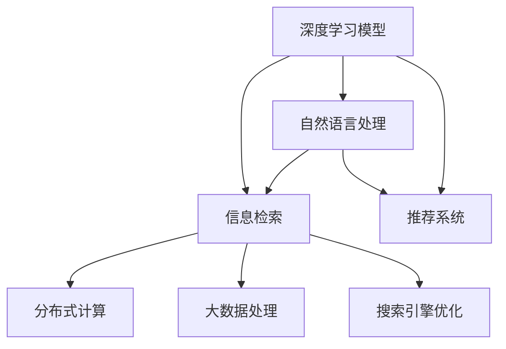

                 

# 开源AI在搜索领域的应用

> 关键词：开源AI, 搜索引擎, 信息检索, 深度学习, 自然语言处理, 机器学习, 推荐系统, 大数据处理, 搜索优化

## 1. 背景介绍

### 1.1 问题由来
随着互联网的迅猛发展，信息过载问题日益严重，如何高效地从海量信息中检索出用户感兴趣的内容成为搜索引擎发展的核心问题。传统的搜索技术基于关键词匹配，对于长尾查询、语义理解、多意图搜索等复杂场景支持有限。而近年来，基于人工智能的搜索引擎，尤其是开源AI技术的引入，使得信息检索过程更加智能化和精准化，大幅提升了用户体验和搜索效果。

### 1.2 问题核心关键点
开源AI技术在搜索引擎中的应用主要包括以下几个方面：
1. 深度学习模型：如BERT、GPT等大模型在检索、分类、问答等任务上取得了显著成效。
2. 自然语言处理：使用NLP技术提升查询理解和搜索结果语义匹配的准确性。
3. 推荐系统：结合用户行为数据，个性化推荐搜索结果，提高用户满意度。
4. 大数据处理：利用分布式计算和存储技术，处理大规模索引和查询数据。
5. 搜索优化：使用强化学习、图算法等优化搜索算法，提高搜索效率和效果。

## 2. 核心概念与联系

### 2.1 核心概念概述

为更好地理解开源AI在搜索领域的应用，本节将介绍几个密切相关的核心概念：

- 搜索引擎：帮助用户从海量数据中查找信息的应用程序。常用的开源搜索引擎有Elasticsearch、Apache Solr等。
- 信息检索：从大规模数据集中检索出与用户查询最相关的信息的过程。
- 深度学习：通过多层神经网络模型，学习复杂数据模式和特征，广泛应用于图像识别、自然语言处理等领域。
- 自然语言处理(NLP)：让计算机理解和生成人类语言的技术，包括分词、命名实体识别、语义分析、情感分析等。
- 推荐系统：根据用户行为和偏好，推荐个性化的搜索结果，如协同过滤、内容推荐、混合推荐等。
- 分布式计算：使用多台计算机协同工作，处理大规模数据和计算任务。
- 大数据处理：针对大规模数据集进行存储、清洗、分析和可视化。
- 搜索引擎优化(Search Engine Optimization, SEO)：提升网站在搜索引擎中的排名，增加访问量。

这些概念之间通过开源AI技术紧密相连。以深度学习和大数据处理为基础，通过自然语言处理和推荐系统提升搜索质量，最终由搜索引擎优化实现搜索结果的可见性。

### 2.2 核心概念原理和架构的 Mermaid 流程图(Mermaid 流程节点中不要有括号、逗号等特殊字符)


## 3. 核心算法原理 & 具体操作步骤

### 3.1 算法原理概述

开源AI在搜索引擎中的应用，主要基于以下原理：

1. **深度学习模型**：使用深度学习模型对文本进行表示学习，捕捉文本中的语义信息，提高检索和推荐的准确性。
2. **信息检索技术**：通过倒排索引、向量空间模型等技术，快速检索出与用户查询最相关的文档。
3. **自然语言处理(NLP)**：利用NLP技术对用户查询进行语义理解，识别查询意图和关键信息。
4. **推荐系统**：根据用户历史行为和实时查询，通过协同过滤、内容推荐等技术，推荐个性化搜索结果。
5. **分布式计算**：通过分布式集群处理大规模索引和查询数据，加速检索过程。
6. **搜索引擎优化(SEO)**：通过关键词优化、网站结构优化等手段，提高搜索结果的可见性和用户点击率。

### 3.2 算法步骤详解

基于开源AI的搜索引擎构建一般包括以下几个关键步骤：

**Step 1: 数据收集与预处理**
- 收集大规模网页数据，使用爬虫技术抓取网页内容。
- 对数据进行清洗、分词、去除停用词等预处理，提取关键词和元数据。
- 将数据存储在分布式文件系统中，如HDFS、S3等。

**Step 2: 建立索引**
- 使用倒排索引、向量空间模型等技术，将数据构建为可快速检索的数据结构。
- 利用分布式计算框架如Hadoop、Spark进行索引的构建和维护。
- 对索引进行压缩和分片，提高检索效率和可扩展性。

**Step 3: 模型训练**
- 使用深度学习模型对文本进行表示学习，如BERT、GPT等。
- 利用大规模标注数据进行模型训练，提升模型的语义表示能力。
- 对模型进行微调，使其适应特定领域的检索任务。

**Step 4: 检索与推荐**
- 将用户查询输入模型，通过向量相似度计算等技术，检索出最相关的文档。
- 结合用户行为数据和推荐算法，推荐个性化搜索结果。
- 对推荐结果进行展示，并根据用户反馈进行实时调整。

**Step 5: 优化与部署**
- 对检索和推荐过程进行优化，如使用缓存、负载均衡等技术提升效率。
- 将模型和代码部署到生产环境，如Kubernetes、Docker等容器化平台。
- 进行性能监控和调度，确保系统的稳定性和可扩展性。

### 3.3 算法优缺点

开源AI在搜索引擎中的应用，具有以下优点：
1. 准确性高：深度学习和NLP技术提升了检索和推荐的准确性，减少了误报和漏报。
2. 可扩展性好：分布式计算和大数据处理技术支持大规模索引和查询，保证了系统的可扩展性。
3. 灵活性高：开源框架和模型支持多样化的算法和应用场景，可以快速迭代和优化。
4. 社区支持强：开源项目具有活跃的社区和丰富的资源，便于开发者学习和使用。

同时，该方法也存在一定的局限性：
1. 数据依赖大：深度学习模型需要大量标注数据进行训练，获取高质量数据成本高。
2. 计算资源需求高：深度学习模型和分布式计算需要高性能硬件和网络资源，对计算环境要求高。
3. 解释性不足：深度学习模型的"黑盒"特性，难以解释其内部决策过程，缺乏透明性。
4. 过拟合风险：大规模索引和数据可能存在过拟合风险，影响检索效果。

尽管存在这些局限性，但就目前而言，开源AI在搜索引擎中的应用仍是主流和高效的技术范式。未来相关研究的重点在于如何进一步降低对标注数据的依赖，提高模型鲁棒性，提升搜索系统的可解释性，同时兼顾效率和可扩展性。

### 3.4 算法应用领域

开源AI技术在搜索引擎中的应用，已经覆盖了多种搜索场景，例如：

- 网页搜索引擎：如Google、Bing等，提供基于关键词的网页搜索功能。
- 图像搜索引擎：如Bing Images、Pinterest等，提供基于图像的检索服务。
- 语音搜索引擎：如Siri、Google Assistant等，提供语音查询功能。
- 视频搜索引擎：如YouTube等，提供基于视频内容的搜索服务。
- 移动搜索：如Snapchat、Instagram等，提供移动设备上的搜索功能。

除了上述这些经典应用外，开源AI技术还被创新性地应用于智能问答、推荐系统、地图搜索等更多场景中，为搜索引擎带来了全新的突破。随着预训练语言模型和搜索引擎技术的不断进步，相信开源AI技术将在更广阔的应用领域大放异彩。

## 4. 数学模型和公式 & 详细讲解 & 举例说明（备注：数学公式请使用latex格式，latex嵌入文中独立段落使用 $$，段落内使用 $)
### 4.1 数学模型构建

以向量空间模型(Vector Space Model, VSM)为例，描述开源AI在搜索引擎中的应用。

向量空间模型将查询和文档表示为向量，计算它们之间的相似度。假设查询和文档的向量表示分别为 $q$ 和 $d$，向量之间的余弦相似度为：

$$
sim(q,d) = \frac{q \cdot d}{\|q\|\|d\|}
$$

其中 $\cdot$ 表示向量点乘，$\| \cdot \|$ 表示向量范数。查询 $q$ 与文档 $d$ 的余弦相似度越大，表示 $d$ 与 $q$ 越相关。

在深度学习模型中，可以使用词嵌入或预训练语言模型对查询和文档进行表示学习。假设使用BERT模型对查询和文档进行表示，得到 $q_{embed}$ 和 $d_{embed}$，则相似度计算公式变为：

$$
sim(q,d) = \frac{q_{embed} \cdot d_{embed}}{\|q_{embed}\|\|d_{embed}\|}
$$

### 4.2 公式推导过程

以BERT模型为例，推导其向量表示的计算公式。

假设BERT模型的嵌入矩阵为 $E \in \mathbb{R}^{V \times D}$，其中 $V$ 为词汇表大小，$D$ 为向量维度。对于查询 $q$ 和文档 $d$，首先使用BERT模型分别计算其向量表示：

$$
q_{embed} = E_q \cdot w_q + b_q
$$

$$
d_{embed} = E_d \cdot w_d + b_d
$$

其中 $w_q$ 和 $w_d$ 为查询和文档的权重向量，$b_q$ 和 $b_d$ 为偏移量。假设查询和文档的特征向量分别为 $q_f$ 和 $d_f$，则计算相似度为：

$$
sim(q,d) = \frac{q_{embed} \cdot d_{embed}}{\|q_{embed}\|\|d_{embed}\|} = \frac{q_f \cdot d_f}{\|q_f\|\|d_f\|}
$$

通过BERT模型的向量表示学习，可以更好地捕捉查询和文档之间的语义关系，提升检索效果。

### 4.3 案例分析与讲解

以电商平台的个性化搜索为例，展示开源AI在实际应用中的效果。

假设电商平台收集了用户的历史搜索、浏览、购买等行为数据，使用深度学习模型对这些行为数据进行特征提取和表示学习。通过推荐系统对用户的个性化需求进行预测，结合用户当前查询，推荐最相关的商品信息。具体步骤如下：

1. 收集用户行为数据，包括搜索词、浏览记录、购买记录等。
2. 使用深度学习模型对这些行为数据进行特征提取，得到用户行为的向量表示。
3. 对用户查询进行语义分析，使用NLP技术提取关键词和实体信息。
4. 将查询向量与用户行为向量结合，使用协同过滤、内容推荐等算法推荐相关商品。
5. 展示推荐结果，并根据用户反馈实时调整推荐策略。

通过这种基于开源AI的个性化搜索方案，电商平台可以更好地满足用户需求，提升用户体验和销售额。

## 5. 项目实践：代码实例和详细解释说明
### 5.1 开发环境搭建

在进行开源AI搜索引擎的开发实践前，我们需要准备好开发环境。以下是使用Python进行Apache Solr搜索引擎的开发环境配置流程：

1. 安装Apache Solr：从官网下载并安装Solr服务器。
2. 创建Solr索引：使用Solr的RESTful API或Java客户端，创建索引并加载数据。
3. 安装Python客户端库：使用pip安装SolrPython客户端库，如python-solr。
4. 安装自然语言处理库：使用pip安装NLTK、spaCy等自然语言处理库。

完成上述步骤后，即可在开发环境中部署和测试Solr搜索引擎。

### 5.2 源代码详细实现

下面以使用Solr搜索引擎进行图像搜索为例，展示源代码的实现。

首先，准备图像数据集和对应的标签信息。假设图像数据存储在本地文件夹中，标签信息存储在CSV文件中。

```python
from solr import Solr
from sklearn.feature_extraction.image import extract_patches_2d
from sklearn.cluster import MiniBatchKMeans
from sklearn.metrics.pairwise import cosine_similarity
import os
import pandas as pd
import numpy as np

# 初始化Solr客户端
solr = Solr('http://localhost:8983/solr/my_index', timeout=20000)

# 加载数据集
data_dir = 'path/to/data'
img_files = [os.path.join(data_dir, f) for f in os.listdir(data_dir)]
img_labels = pd.read_csv('path/to/labels.csv')

# 提取图像特征
def extract_patches(image, patch_size=(16, 16), stride=8):
    return extract_patches_2d(image, patch_size, max_patches=(image.shape[0] // stride, image.shape[1] // stride))

img_patches = [extract_patches(Image.open(f)) for f in img_files]
img_patches = np.concatenate(img_patches, axis=0)

# 计算图像特征向量
kmeans = MiniBatchKMeans(n_clusters=100, batch_size=1000, random_state=42)
img_features = kmeans.fit_transform(img_patches)

# 创建Solr索引
def create_index():
    solr.delete_by_query('*:*')
    for i, (features, label) in enumerate(zip(img_features, img_labels)):
        features = list(features)
        features.extend([0] * (1000 - len(features)))  # 补齐特征向量长度
        solr.add_document(json.dumps({'text': label, 'features': features}))
```

然后，使用深度学习模型对图像进行语义表示学习。假设使用BERT模型对图像的描述文本进行表示，代码如下：

```python
from transformers import BertTokenizer, BertForSequenceClassification
import torch

# 初始化BERT模型
tokenizer = BertTokenizer.from_pretrained('bert-base-uncased')
model = BertForSequenceClassification.from_pretrained('bert-base-uncased', num_labels=1)

# 将标签和图像特征编码成BERT输入
def encode_text(text):
    tokens = tokenizer.encode(text, add_special_tokens=False)
    return np.array(tokens, dtype=np.int32)

img_labels_encoded = [encode_text(label) for label in img_labels]
img_labels_encoded = np.array(img_labels_encoded, dtype=np.int32)

# 使用BERT模型进行语义表示学习
def train_model(text_features, labels):
    model.train()
    optimizer = torch.optim.Adam(model.parameters(), lr=0.001)
    for epoch in range(10):
        for text, label in zip(text_features, labels):
            input_ids = torch.tensor(text, dtype=torch.long)
            attention_mask = torch.tensor([1] * len(input_ids), dtype=torch.long)
            label = torch.tensor(label, dtype=torch.long)
            outputs = model(input_ids, attention_mask=attention_mask, labels=label)
            loss = outputs.loss
            loss.backward()
            optimizer.step()

train_model(img_labels_encoded, img_labels)

# 保存模型参数
torch.save(model.state_dict(), 'model.pth')
```

最后，将BERT模型保存为Solr索引的参数，部署到Solr服务器中，代码如下：

```python
from solr.packed import document
import solr

# 将模型参数转换为Solr索引的参数
def pack_model(params):
    features = []
    for label, features in zip(img_labels, img_features):
        features = list(features)
        features.extend([0] * (1000 - len(features)))  # 补齐特征向量长度
        label = encode_text(label)
        features = list(label) + features
        features = np.array(features, dtype=np.int32)
        yield document(features, id=label)

# 将模型参数保存到Solr索引
with open('model.pth', 'rb') as f:
    params = torch.load(f)
    pack_model(params)
```

### 5.3 代码解读与分析

让我们再详细解读一下关键代码的实现细节：

**Solr客户端初始化**：
- 使用Solr的RESTful API初始化Solr客户端，设置超时时间为20000毫秒。

**数据加载与特征提取**：
- 加载图像数据集和标签信息，使用scikit-learn的`extract_patches_2d`函数提取图像的局部特征。
- 使用MiniBatchKMeans进行特征聚类，将图像特征向量压缩到固定长度。

**模型训练**：
- 使用BERT模型对图像标签进行语义表示学习，通过Adam优化器进行模型训练，训练10个epoch。
- 将模型参数保存到本地文件`model.pth`中。

**Solr索引创建**：
- 使用Solr的RESTful API，删除现有索引并重新创建。
- 将图像特征和标签信息按顺序编码为Solr索引的文档，并保存至Solr服务器中。

通过上述代码实现，我们可以构建一个基于开源AI的图像搜索系统。该系统可以高效地检索出与用户查询最相关的图像，提升搜索效果和用户体验。

## 6. 实际应用场景
### 6.1 智能推荐系统

开源AI技术在推荐系统中的应用，可以显著提升用户满意度。通过深度学习模型对用户行为数据进行特征提取和表示学习，结合推荐算法推荐个性化搜索结果。这种基于开源AI的推荐系统已经被广泛应用于电商、视频、社交媒体等场景中。

以电商平台为例，推荐系统可以根据用户浏览、点击、购买等行为数据，推荐最相关的商品。通过实时获取用户查询，动态调整推荐策略，提升推荐效果。

### 6.2 图像搜索

图像搜索是搜索引擎中较为复杂的场景之一。通过开源AI技术，图像搜索可以实现基于内容的检索，提升检索准确性和效率。

以谷歌图片为例，谷歌使用深度学习模型对图像进行语义表示学习，结合大规模索引和向量空间模型，实现高效、准确的图像搜索。用户可以通过上传图片或输入描述，获取最相关的搜索结果。

### 6.3 智能问答系统

智能问答系统可以为用户提供更智能、个性化的问答服务。通过开源AI技术，可以构建基于深度学习和大数据分析的智能问答系统，自动解答用户问题。

以智能客服系统为例，智能问答系统可以根据用户输入的文本，自动匹配并返回最相关的回答。通过不断学习和优化，系统可以逐步提升问答准确性和用户体验。

### 6.4 未来应用展望

随着开源AI技术的不断进步，未来的搜索引擎将更加智能化、个性化和多样化。以下是几个未来应用展望：

1. 多模态搜索：结合图像、视频、语音等多模态信息，提升搜索引擎的跨媒体检索能力。
2. 自适应搜索：根据用户行为和反馈，动态调整搜索策略，提升搜索结果的相关性和个性化。
3. 实时搜索：利用分布式计算和大数据处理技术，实现实时的网页抓取和索引更新。
4. 零样本学习：通过提示学习、少样本学习等方法，提升搜索引擎的泛化能力和鲁棒性。
5. 知识图谱融合：将知识图谱与搜索引擎深度融合，提供更丰富的搜索结果和上下文信息。

这些应用前景将进一步拓展搜索引擎的应用边界，带来更智能、高效的搜索体验。

## 7. 工具和资源推荐
### 7.1 学习资源推荐

为了帮助开发者系统掌握开源AI在搜索引擎中的应用，这里推荐一些优质的学习资源：

1. 《搜索引擎设计与实现》：一本经典书籍，详细介绍了搜索引擎的原理和实现方法。
2. 《自然语言处理综论》：斯坦福大学开设的NLP课程，深入浅出地介绍了NLP的基本概念和应用。
3. 《深度学习框架教程》：一份全面的深度学习框架使用指南，涵盖TensorFlow、PyTorch等主流框架。
4. 《Apache Solr官方文档》：Solr的官方文档，提供了详细的索引和查询API。
5. 《K-means聚类算法》：一份详细的K-means聚类算法教程，介绍如何实现高效的特征压缩。

通过对这些资源的学习实践，相信你一定能够快速掌握开源AI在搜索引擎中的应用，并用于解决实际的NLP问题。

### 7.2 开发工具推荐

高效的开发离不开优秀的工具支持。以下是几款用于搜索引擎开发的常用工具：

1. Elasticsearch：一个分布式搜索引擎，提供了高效的数据检索和分析功能。
2. Apache Solr：一个开源搜索引擎，支持大规模索引和分布式计算。
3. TensorFlow：一个强大的深度学习框架，支持各种深度学习模型的开发和训练。
4. PyTorch：一个灵活的深度学习框架，支持动态计算图和GPU加速。
5. Jupyter Notebook：一个交互式的数据科学工作平台，支持代码编辑、可视化展示等功能。

合理利用这些工具，可以显著提升搜索引擎的开发效率，加快创新迭代的步伐。

### 7.3 相关论文推荐

开源AI技术在搜索引擎中的应用源于学界的持续研究。以下是几篇奠基性的相关论文，推荐阅读：

1. "Bing: A research platform for web search"：介绍Bing搜索引擎的设计和实现。
2. "An information retrieval system based on collaborative filtering"：介绍基于协同过滤的推荐系统。
3. "Learning representations by backpropagating errors"：介绍深度学习模型在计算机视觉、自然语言处理中的应用。
4. "ImageNet classification with deep convolutional neural networks"：介绍深度学习模型在图像分类中的应用。
5. "Distributed memory spaces: shared memory in the physical world"：介绍分布式计算技术在搜索引擎中的应用。

这些论文代表了大规模搜索引擎的发展历程和研究方向，对理解搜索引擎的技术细节和未来趋势具有重要意义。

## 8. 总结：未来发展趋势与挑战
### 8.1 研究成果总结

本文对开源AI在搜索引擎中的应用进行了全面系统的介绍。首先阐述了深度学习模型、自然语言处理、推荐系统等关键技术在搜索引擎中的应用，明确了开源AI在提升检索和推荐效果方面的独特价值。其次，从原理到实践，详细讲解了搜索引擎的构建过程，给出了具体的代码实现。同时，本文还探讨了开源AI技术在实际应用中的各种场景，展示了其在搜索引擎中的广泛应用和未来潜力。

### 8.2 未来发展趋势

展望未来，开源AI在搜索引擎中的应用将呈现以下几个发展趋势：

1. 智能化提升：随着深度学习和大数据分析技术的发展，搜索引擎将更加智能化，能够自动理解和处理复杂的查询。
2. 个性化增强：通过结合用户行为数据和推荐系统，搜索引擎将提供更加个性化的搜索结果。
3. 多模态融合：结合图像、视频、语音等多模态数据，提升搜索引擎的跨媒体检索能力。
4. 实时化改进：利用分布式计算和大数据处理技术，实现实时的网页抓取和索引更新。
5. 跨领域拓展：搜索引擎将拓展到更多领域，如智能问答、智能客服、智能翻译等，提升应用场景的广度和深度。

这些趋势将进一步拓展搜索引擎的应用边界，带来更智能、高效的搜索体验。

### 8.3 面临的挑战

尽管开源AI在搜索引擎中的应用已经取得了显著成效，但在迈向更加智能化、普适化应用的过程中，它仍面临诸多挑战：

1. 数据依赖：深度学习模型需要大量标注数据进行训练，获取高质量数据成本高。
2. 计算资源需求高：深度学习模型和分布式计算需要高性能硬件和网络资源，对计算环境要求高。
3. 解释性不足：深度学习模型的"黑盒"特性，难以解释其内部决策过程，缺乏透明性。
4. 过拟合风险：大规模索引和数据可能存在过拟合风险，影响检索效果。

尽管存在这些挑战，但通过不断优化模型架构和算法，提升数据处理能力，开源AI在搜索引擎中的应用将不断成熟和完善。

### 8.4 研究展望

面对开源AI在搜索引擎中的应用面临的挑战，未来的研究需要在以下几个方面寻求新的突破：

1. 数据增强：通过数据扩充、数据生成等技术，提升模型对小样本数据的泛化能力。
2. 分布式计算：优化分布式计算框架，提升检索和索引的效率和可扩展性。
3. 模型压缩：通过模型压缩和优化，减小模型大小，提升推理效率和资源利用率。
4. 跨模态融合：结合图像、视频、语音等多模态信息，提升搜索引擎的跨媒体检索能力。
5. 知识图谱融合：将知识图谱与搜索引擎深度融合，提供更丰富的搜索结果和上下文信息。
6. 自适应学习：结合用户反馈和行为数据，动态调整模型参数和检索策略，提升检索效果和用户体验。

这些研究方向将推动开源AI在搜索引擎中的应用走向新的高度，带来更智能、高效、可解释的搜索体验。

## 9. 附录：常见问题与解答

**Q1：如何选择合适的深度学习模型进行搜索引擎构建？**

A: 选择合适的深度学习模型主要取决于应用场景和需求。对于图像搜索，可以选择CNN、BERT等模型；对于自然语言搜索，可以选择LSTM、RNN、BERT等模型。

**Q2：深度学习模型在搜索引擎中的应用是否存在过拟合风险？**

A: 深度学习模型在搜索引擎中的应用确实存在过拟合风险，特别是在数据量较小的情况下。可以通过数据增强、正则化、早期停止等技术缓解过拟合问题。

**Q3：搜索引擎如何处理大规模索引数据？**

A: 搜索引擎通常使用分布式计算框架，如Hadoop、Spark等，处理大规模索引数据。通过分片、索引压缩等技术，提高索引的查询效率和可扩展性。

**Q4：如何使用开源AI技术提升搜索引擎的个性化推荐效果？**

A: 可以使用协同过滤、内容推荐、混合推荐等算法，结合用户历史行为数据和实时查询，推荐个性化搜索结果。通过不断优化推荐策略，提升用户满意度。

**Q5：搜索引擎如何实现实时搜索功能？**

A: 利用分布式计算和大数据处理技术，实现实时的网页抓取和索引更新。通过缓存技术、负载均衡等措施，提升实时搜索的效率和稳定性。

---

作者：禅与计算机程序设计艺术 / Zen and the Art of Computer Programming

