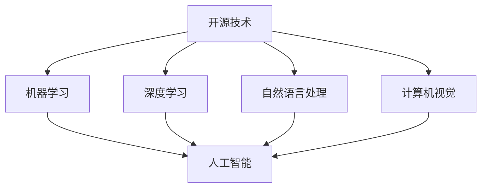

                 

## 1. 背景介绍

随着人工智能(AI)技术的飞速发展，开源技术已成为推动AI进步的重要引擎。从早期基于开源框架构建的机器学习模型，到如今基于开源技术生态快速迭代部署的复杂AI应用，开源社区在算法创新、工具开发、数据共享等方面发挥了无可替代的作用。本文将深入探讨开源技术在AI领域的具体应用，分析其对AI发展的重要影响，并展望未来发展趋势。

## 2. 核心概念与联系

### 2.1 核心概念概述

- **开源技术**：指公开可用的软件和技术资源，包括源代码、文档、库、框架等，任何开发者都可以自由使用、修改和分发。

- **人工智能**：涵盖机器学习、深度学习、自然语言处理、计算机视觉、机器人学等多个子领域，目标是构建智能系统，使其能模拟人类智能行为。

- **机器学习**：通过算法和统计模型，使计算机系统具有学习能力，自动改善性能。

- **深度学习**：机器学习的一个分支，使用多层神经网络进行复杂数据表示学习。

- **自然语言处理**：研究计算机如何理解和生成人类语言。

- **计算机视觉**：使计算机能够理解和分析图像和视频数据。

- **开源社区**：由开发者共同构建的协作平台，提供资源共享、知识交流和合作开发的环境。

这些概念之间的逻辑关系通过以下Mermaid流程图展示：



该流程图展示了开源技术如何通过提供机器学习、深度学习、自然语言处理和计算机视觉等领域的基础设施和工具，推动人工智能技术的整体发展。

## 3. 核心算法原理 & 具体操作步骤

### 3.1 算法原理概述

开源技术在推动AI进步中，关键在于其提供的算法和框架，这些算法和框架使得AI研究者和开发者能够快速构建、训练和部署模型。以下是几个核心算法原理的概述：

- **TensorFlow和PyTorch**：两种主流的深度学习框架，提供了高效的计算图机制、自动微分、分布式训练等特性，极大地简化了模型的构建和训练。

- **Keras**：一个高层API，建立在TensorFlow和Theano等框架之上，使得模型构建更加直观和方便。

- **OpenCV和Scikit-Image**：开源计算机视觉库，提供了丰富的图像处理和分析功能，支持图像分割、特征提取、对象检测等任务。

- **NLTK和SpaCy**：自然语言处理库，提供了分词、命名实体识别、情感分析等功能，支持多种语言的文本处理。

- **TensorFlow Hub**：预训练模型的库，包含了各种领域的预训练模型，如BERT、GPT等，加速模型的微调和部署。

### 3.2 算法步骤详解

#### 3.2.1 TensorFlow框架搭建

- **环境安装**：安装TensorFlow、Keras、NumPy等依赖包。
```bash
pip install tensorflow==2.5.0
pip install keras
pip install numpy
```
- **数据预处理**：加载和预处理数据，转换为模型可接受的格式。
- **模型构建**：使用Keras API构建模型结构，如卷积神经网络、循环神经网络、Transformer等。
- **模型训练**：使用TensorFlow的`tf.data` API构建数据集，使用`fit()`方法进行模型训练。
- **模型评估和部署**：使用`evaluate()`方法评估模型性能，使用`save()`方法保存模型，以便后续使用。

#### 3.2.2 PyTorch框架搭建

- **环境安装**：安装PyTorch、Torchvision等依赖包。
```bash
pip install torch torchvision
```
- **数据预处理**：加载和预处理数据，转换为模型可接受的格式。
- **模型构建**：定义模型结构，如卷积神经网络、递归神经网络、Transformer等。
- **模型训练**：使用`DataLoader`构建数据集，使用`torch.utils.data.DataLoader`进行数据迭代，使用`torch.optim`库进行优化器设置，使用`torch.nn`库进行损失函数和评估指标设置。
- **模型评估和部署**：使用`evaluate()`方法评估模型性能，使用`torch.save()`方法保存模型，以便后续使用。

### 3.3 算法优缺点

#### 3.3.1 优点

- **自由度高**：开源技术提供源代码和文档，用户可以自由修改和扩展，适应特定需求。
- **社区支持**：开源社区庞大，有丰富的文档、教程、论坛资源，用户可以获取大量帮助和支持。
- **快速迭代**：开源技术通常采用快速迭代开发模式，更新速度快，用户可以快速使用最新功能。
- **成本低**：开源技术通常免费使用，大大降低了开发成本。

#### 3.3.2 缺点

- **质量参差不齐**：开源项目质量不一，有些项目可能未经过充分测试，存在潜在问题。
- **维护成本高**：用户需要自己维护和更新项目，特别是复杂项目，维护成本较高。
- **依赖关系复杂**：开源技术依赖关系复杂，可能导致版本不兼容或依赖冲突。

### 3.4 算法应用领域

开源技术在多个AI应用领域都有广泛应用，以下是几个典型领域：

- **计算机视觉**：开源项目如OpenCV、Pillow、Scikit-Image等，提供了丰富的图像处理和分析功能。
- **自然语言处理**：开源项目如NLTK、SpaCy、Gensim等，提供了分词、命名实体识别、情感分析等功能。
- **机器学习**：开源项目如Scikit-learn、XGBoost、TensorFlow Hub等，提供了多种机器学习算法和模型。
- **深度学习**：开源项目如TensorFlow、PyTorch、Caffe等，提供了高效的深度学习框架和工具。
- **自动化和机器人**：开源项目如ROS（Robot Operating System）、OpenAI Gym等，提供了机器人学习和控制框架。

## 4. 数学模型和公式 & 详细讲解 & 举例说明

### 4.1 数学模型构建

以卷积神经网络（Convolutional Neural Network, CNN）为例，展示如何使用TensorFlow和Keras搭建和训练CNN模型。

- **输入层**：
```python
from tensorflow.keras import layers

model.add(layers.Input(shape=(28, 28, 1)))
```

- **卷积层**：
```python
model.add(layers.Conv2D(32, kernel_size=(3, 3), activation='relu', padding='same'))
```

- **池化层**：
```python
model.add(layers.MaxPooling2D(pool_size=(2, 2)))
```

- **全连接层**：
```python
model.add(layers.Flatten())
model.add(layers.Dense(10, activation='softmax'))
```

### 4.2 公式推导过程

假设有一个简单的分类问题，输入特征为 $x$，输出标签为 $y$。设模型的参数为 $\theta$，则分类问题的目标是最小化交叉熵损失：
$$
L(y, \hat{y}) = -\sum_{i=1}^n y_i\log(\hat{y}_i) + (1-y_i)\log(1-\hat{y}_i)
$$

在训练过程中，模型的参数 $\theta$ 通过梯度下降等优化算法更新，使损失函数最小化。

### 4.3 案例分析与讲解

以TensorFlow搭建的图像分类模型为例，展示模型的训练和评估过程。

- **数据准备**：加载MNIST数据集，预处理数据。
```python
from tensorflow.keras.datasets import mnist

(x_train, y_train), (x_test, y_test) = mnist.load_data()
x_train = x_train.reshape(-1, 28, 28, 1)
x_test = x_test.reshape(-1, 28, 28, 1)
x_train = x_train / 255.0
x_test = x_test / 255.0
```

- **模型构建**：
```python
model = tf.keras.Sequential([
    tf.keras.layers.Conv2D(32, kernel_size=(3, 3), activation='relu', padding='same', input_shape=(28, 28, 1)),
    tf.keras.layers.MaxPooling2D(pool_size=(2, 2)),
    tf.keras.layers.Flatten(),
    tf.keras.layers.Dense(10, activation='softmax')
])
```

- **模型训练**：
```python
model.compile(optimizer='adam', loss='sparse_categorical_crossentropy', metrics=['accuracy'])
model.fit(x_train, y_train, epochs=5, validation_data=(x_test, y_test))
```

- **模型评估**：
```python
loss, accuracy = model.evaluate(x_test, y_test)
print(f'Test loss: {loss}, Test accuracy: {accuracy}')
```

## 5. 项目实践：代码实例和详细解释说明

### 5.1 开发环境搭建

1. **安装Anaconda**：
```bash
wget https://repo.anaconda.com/miniconda/Miniconda3-latest-Linux-x86_64.sh
bash Miniconda3-latest-Linux-x86_64.sh
```

2. **创建虚拟环境**：
```bash
conda create -n pytorch-env python=3.8
conda activate pytorch-env
```

3. **安装依赖包**：
```bash
conda install torch torchvision torchaudio
```

### 5.2 源代码详细实现

以TensorFlow实现的手写数字识别模型为例，展示从数据预处理到模型训练的完整流程。

```python
import tensorflow as tf
from tensorflow.keras import datasets, layers, models

# 加载数据集
(x_train, y_train), (x_test, y_test) = datasets.mnist.load_data()

# 数据预处理
x_train = x_train.reshape(-1, 28, 28, 1)
x_test = x_test.reshape(-1, 28, 28, 1)
x_train = x_train / 255.0
x_test = x_test / 255.0

# 构建模型
model = models.Sequential([
    layers.Conv2D(32, kernel_size=(3, 3), activation='relu', padding='same', input_shape=(28, 28, 1)),
    layers.MaxPooling2D(pool_size=(2, 2)),
    layers.Flatten(),
    layers.Dense(10, activation='softmax')
])

# 编译模型
model.compile(optimizer='adam', loss='sparse_categorical_crossentropy', metrics=['accuracy'])

# 训练模型
model.fit(x_train, y_train, epochs=5, validation_data=(x_test, y_test))

# 评估模型
loss, accuracy = model.evaluate(x_test, y_test)
print(f'Test loss: {loss}, Test accuracy: {accuracy}')
```

### 5.3 代码解读与分析

- **数据准备**：使用`mnist.load_data()`方法加载MNIST数据集，将数据重塑为模型可接受的维度，并对数据进行归一化处理。

- **模型构建**：使用`Sequential` API定义模型结构，包括卷积层、池化层、全连接层。

- **模型编译**：使用`compile`方法设置优化器、损失函数和评估指标。

- **模型训练**：使用`fit`方法进行模型训练，设置训练轮数和验证集。

- **模型评估**：使用`evaluate`方法评估模型在测试集上的性能，输出损失和准确率。

## 6. 实际应用场景

开源技术在实际应用场景中具有广泛应用，以下是几个典型场景：

### 6.1 图像识别与处理

- **面部识别**：开源项目如OpenCV、FaceNet等，提供面部特征提取和识别功能。
- **图像分类**：开源项目如TensorFlow、PyTorch等，提供图像分类算法和工具。
- **图像分割**：开源项目如Pillow、Scikit-Image等，提供图像分割和对象检测功能。

### 6.2 自然语言处理

- **文本分类**：开源项目如NLTK、SpaCy等，提供文本分类和情感分析功能。
- **机器翻译**：开源项目如TensorFlow、OpenNMT等，提供机器翻译算法和工具。
- **对话系统**：开源项目如Rasa、Dialogflow等，提供对话系统构建工具和模型。

### 6.3 自动驾驶

- **传感器数据处理**：开源项目如ROS、OpenCV等，提供传感器数据处理和分析功能。
- **路径规划**：开源项目如Google Autonomous Vehicles、MIT MapReduce等，提供路径规划和优化算法。
- **自动驾驶模拟**：开源项目如Gazebo、CARLA等，提供自动驾驶模拟环境和测试工具。

### 6.4 未来应用展望

未来，开源技术将继续推动AI的发展，主要方向包括：

- **联邦学习**：分布式协作学习模式，多台设备共享模型，保护数据隐私。
- **边缘计算**：在本地设备上处理和分析数据，减少云服务依赖，提高计算效率。
- **区块链技术**：提供数据透明和安全共享的机制，促进跨机构协作。
- **量子计算**：利用量子计算机处理大规模数据，加速模型训练和优化。

## 7. 工具和资源推荐

### 7.1 学习资源推荐

- **TensorFlow官方文档**：[https://www.tensorflow.org/](https://www.tensorflow.org/)
- **PyTorch官方文档**：[https://pytorch.org/docs/stable/index.html](https://pytorch.org/docs/stable/index.html)
- **Scikit-learn官方文档**：[https://scikit-learn.org/stable/documentation.html](https://scikit-learn.org/stable/documentation.html)
- **OpenCV官方文档**：[https://docs.opencv.org/](https://docs.opencv.org/)
- **NLTK官方文档**：[https://www.nltk.org/](https://www.nltk.org/)

### 7.2 开发工具推荐

- **Jupyter Notebook**：支持代码和数据共享，方便协作开发。
- **GitHub**：版本控制和代码托管平台，提供丰富的开源项目和社区支持。
- **Docker**：容器化工具，方便部署和管理开源项目。
- **Anaconda**：Python发行版，提供依赖管理、包管理等工具。
- **TensorBoard**：可视化工具，展示模型训练和推理过程。

### 7.3 相关论文推荐

- **深度学习**：[《Deep Learning》by Ian Goodfellow, Yoshua Bengio, Aaron Courville](https://www.deeplearningbook.org/)
- **计算机视觉**：[《Learning from Images》by Tony Janjet, Michael J. Wojtan](https://people.csail.mit.edu/tonyw/joshua/NIPS2009_5148.pdf)
- **自然语言处理**：[《Speech and Language Processing》by Dan Jurafsky, James H. Martin](https://web.stanford.edu/~jurafsky/slp3/)

## 8. 总结：未来发展趋势与挑战

### 8.1 总结

开源技术在AI领域已经取得了显著的成果，推动了算法的创新、模型的构建和应用的部署。通过开源社区的努力，AI研究人员和开发者可以共享资源、交流知识和协同开发，极大地加速了AI技术的进步。

### 8.2 未来发展趋势

未来，开源技术将继续引领AI的发展，主要趋势包括：

- **自动代码生成**：利用机器学习和自然语言处理技术，自动生成代码，提高开发效率。
- **跨领域融合**：将开源技术应用于更多领域，如医疗、教育、金融等，推动跨领域应用创新。
- **AI伦理与安全**：开源社区将更加关注AI伦理和安全问题，推动AI技术的可持续发展。

### 8.3 面临的挑战

尽管开源技术在AI领域取得了显著进展，但仍然面临一些挑战：

- **数据隐私和安全**：开源项目的数据共享机制可能带来隐私和安全风险。
- **算力需求高**：大规模AI模型训练和推理需要高性能计算资源，成本较高。
- **知识壁垒高**：开源项目的学习曲线较陡，需要较高的技术水平和经验。

### 8.4 研究展望

未来，开源技术在AI领域的研究方向包括：

- **跨模态学习**：将视觉、语音、文本等多模态数据融合，提升AI系统的感知能力。
- **自监督学习**：利用未标注数据进行学习，减少对标注数据的依赖。
- **分布式训练**：利用分布式计算资源，提高模型训练和推理的效率。

## 9. 附录：常见问题与解答

**Q1: 如何选择合适的开源技术框架？**

A: 根据项目需求和团队技术栈选择。如果是机器学习项目，TensorFlow和PyTorch是常用的选择；如果是图像处理项目，OpenCV和Pillow是不错的选择；如果是自然语言处理项目，NLTK和SpaCy是常用工具。

**Q2: 开源技术是否会影响模型性能？**

A: 开源技术提供了很多优秀的算法和工具，能够帮助提高模型性能。但需要根据具体需求进行调参和优化。

**Q3: 开源技术是否会影响模型安全性？**

A: 开源技术的安全性取决于项目实现和数据处理。使用开源技术时，需要遵循最佳实践，加强数据隐私保护和模型安全性。

**Q4: 开源技术的学习成本高吗？**

A: 开源技术的学习曲线较陡，需要较高的技术水平和经验。但社区有丰富的资源和文档，可以快速入门。

**Q5: 开源技术是否有版权问题？**

A: 开源技术通常是免费的，但需要遵守许可协议，如GPL、Apache等。在使用开源技术时，需要了解和遵守相关协议。

---

作者：禅与计算机程序设计艺术 / Zen and the Art of Computer Programming

