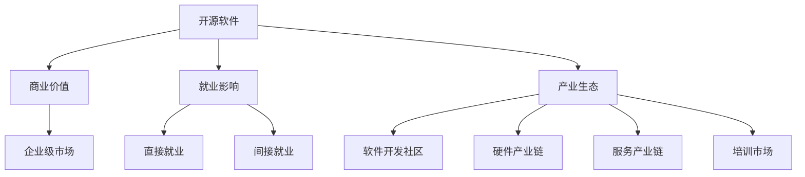

                 

# 开源运动的经济影响:开源软件的商业价值和就业影响

## 1. 背景介绍

### 1.1 问题由来

开源运动（Open Source Movement）自1990年代末兴起以来，已经成为全球软件产业的重要组成部分。开源软件（Open Source Software, OSS）以其卓越的创新性和灵活性，赢得了广泛的市场认可。Open Source Initiative（OSI）定义的开源软件包含四个基本属性：公开源代码（Open Source Code）、可以自由地使用（Free to Use）、可以自由地修改（Free to Modify）、可以自由地共享（Free to Share）。这种自由共享的精神不仅推动了技术进步，也深刻影响了经济社会各个方面。

然而，随着开源软件商业化的不断推进，其商业价值和就业影响逐渐成为社会关注的热点问题。一方面，开源软件在商业应用中扮演着重要角色，优化了商业环境；另一方面，开源软件对就业市场的影响也是不容忽视。本文将对开源软件的商业价值和就业影响进行深入探讨。

### 1.2 问题核心关键点

开源软件对经济和就业的影响，主要集中在以下几个方面：

- 开源软件的商业价值：开源软件在企业级市场中的应用程度，及其对商业创新和企业竞争力的提升作用。
- 开源软件对就业的影响：开源项目的发展是否能够创造就业机会，推动软件开发人才的成长和产业升级。
- 开源软件对产业生态的影响：开源软件如何改变软件开发生态，推动产业合作与协同创新。

本文将从开源软件在商业应用中的实际案例、就业市场的影响以及对产业生态的推动三个方面，探讨开源运动的经济影响。

## 2. 核心概念与联系

### 2.1 核心概念概述

开源软件作为软件行业的双引擎，其商业价值和就业影响是互相关联的。以下是关键概念的概述：

- **开源软件（Open Source Software, OSS）**：在开源许可证下发布的可自由使用、修改和共享的软件。开源软件通过社区协作进行开发，共享代码和资源，以实现技术创新和应用拓展。
- **商业价值（Commercial Value）**：开源软件在商业领域的应用和商业模式的开发，包括云计算、SaaS、订阅服务等。
- **就业影响（Employment Impact）**：开源软件项目的开发、维护和推广对就业市场的影响，包括直接就业和间接就业。
- **产业生态（Industry Ecosystem）**：开源软件促进了软件开发社区的成长，推动了相关产业链的形成，包括硬件、服务、培训等。

这些概念之间的逻辑关系可以通过以下Mermaid流程图来展示：



这个流程图展示了大语言模型的核心概念及其之间的关系：

1. 开源软件通过社区协作进行开发，具有卓越的创新性。
2. 开源软件在企业级市场的应用，推动了商业创新和竞争力的提升。
3. 开源软件项目的发展，直接和间接地创造了就业机会。
4. 开源软件推动了软件开发社区的成长，形成完整的产业生态。

## 3. 核心算法原理 & 具体操作步骤
### 3.1 算法原理概述

开源软件的商业价值和就业影响，其原理是开源软件利用社区协作的优势，通过免费共享代码和资源，加速技术创新，降低企业成本，推动企业级市场的发展，从而创造商业价值。同时，开源项目的发展也直接或间接地带动了就业市场的繁荣，推动软件开发人才的成长和产业升级。

### 3.2 算法步骤详解

开源软件对商业价值和就业影响的计算，涉及以下几个关键步骤：

**Step 1: 开源软件的商业应用分析**

- 分析开源软件在企业级市场中的应用程度。例如，Linux操作系统在服务器市场中的普及率，Apache Web Server在Web服务器市场中的使用情况等。
- 评估开源软件在企业中的应用，特别是在云计算、SaaS、订阅服务等领域的渗透率。
- 通过调查问卷、市场报告等手段，收集企业对开源软件的接受度和使用频率。

**Step 2: 开源软件对就业市场的影响分析**

- 统计开源软件项目的开发和维护岗位数量。例如，Apache基金会下的各个开源项目所提供的就业岗位。
- 分析开源软件对软件工程师技能要求的影响。例如，对DevOps、云计算、容器技术等新兴技能的需求。
- 调查开源项目的发展对软件专业人才的成长和产业升级的贡献。

**Step 3: 开源软件对产业生态的影响分析**

- 评估开源软件对软件开发社区的推动作用。例如，开源软件项目对开源工具、平台和基础设施的支持。
- 分析开源软件对硬件、服务、培训等产业的影响。例如，开源数据库对硬件性能的要求，开源教育和培训课程的兴起。

**Step 4: 综合评估**

- 将开源软件在商业价值、就业影响和产业生态三个方面的数据进行整合。
- 利用经济学模型，如生产函数、投入产出模型等，对开源软件的经济影响进行定量分析。
- 结合实际案例，对开源软件的经济影响进行定性分析。

### 3.3 算法优缺点

开源软件的商业价值和就业影响算法具有以下优点：

1. **数据全面**：开源软件覆盖了技术栈的多个层次，数据源广泛。
2. **分析深入**：通过定量分析，能够全面评估开源软件对经济和就业的影响。
3. **灵活性高**：可以针对不同开源软件和应用场景进行定制化分析。

同时，也存在一些缺点：

1. **数据获取难度大**：开源软件的应用范围广，获取详细的商业和就业数据较为困难。
2. **模型复杂**：经济影响分析涉及多个变量和因素，模型构建较为复杂。
3. **结果解读困难**：模型输出的经济影响和就业数据，需要结合实际情境进行解读。

### 3.4 算法应用领域

开源软件的商业价值和就业影响算法在多个领域有广泛的应用：

- **企业战略制定**：帮助企业了解开源软件的应用情况，制定适合的商业策略。
- **政府政策制定**：为政府提供开源软件对经济和就业影响的分析，支持相关政策的制定。
- **教育培训**：指导教育机构设置相关课程，培训软件开发人才。
- **产业规划**：帮助产业联盟和行业组织规划开源软件的发展路径，促进产业升级。

## 4. 数学模型和公式 & 详细讲解 & 举例说明（备注：数学公式请使用latex格式，latex嵌入文中独立段落使用 $$，段落内使用 $)
### 4.1 数学模型构建

我们假设开源软件对企业级市场的贡献为 $V$，对就业市场的贡献为 $J$。则总经济影响 $E$ 可以表示为：

$$ E = V + J $$

其中，$V$ 为开源软件的商业价值，$J$ 为开源软件对就业市场的影响。

**Step 1: 商业价值模型的构建**

设开源软件的应用场景为 $S_i$，每个场景的贡献为 $V_i$。则总商业价值 $V$ 可以表示为：

$$ V = \sum_{i} V_i $$

对于每个应用场景，商业价值的贡献可以通过以下公式计算：

$$ V_i = C_i \times P_i \times R_i $$

其中，$C_i$ 为开源软件在场景 $S_i$ 中的覆盖率，$P_i$ 为场景 $S_i$ 的规模，$R_i$ 为开源软件在场景 $S_i$ 中的渗透率。

**Step 2: 就业影响模型的构建**

设开源软件项目提供的就业岗位为 $J_i$，总就业影响 $J$ 可以表示为：

$$ J = \sum_{i} J_i $$

对于每个开源项目，就业影响可以通过以下公式计算：

$$ J_i = C_i \times L_i \times E_i $$

其中，$C_i$ 为开源项目 $i$ 的活跃度，$L_i$ 为开发和维护岗位数量，$E_i$ 为开源项目对技能提升和产业升级的贡献。

### 4.2 公式推导过程

**Step 1: 商业价值模型的推导**

根据商业价值模型，对于每个应用场景 $S_i$，商业价值的贡献为：

$$ V_i = C_i \times P_i \times R_i $$

总商业价值 $V$ 为所有应用场景的商业价值之和：

$$ V = \sum_{i} C_i \times P_i \times R_i $$

在实际应用中，需要根据具体情况选择合适的 $C_i$、$P_i$ 和 $R_i$ 的取值。例如，对于Linux操作系统，$C_i$ 可以取其市场占有率，$P_i$ 可以取企业市场规模，$R_i$ 可以取Linux的市场渗透率。

**Step 2: 就业影响模型的推导**

根据就业影响模型，对于每个开源项目 $i$，就业影响的贡献为：

$$ J_i = C_i \times L_i \times E_i $$

总就业影响 $J$ 为所有开源项目的就业影响之和：

$$ J = \sum_{i} C_i \times L_i \times E_i $$

在实际应用中，需要根据具体情况选择合适的 $C_i$、$L_i$ 和 $E_i$ 的取值。例如，对于Apache基金会下的Apache Hadoop项目，$C_i$ 可以取其活跃度，$L_i$ 可以取项目提供的就业岗位数量，$E_i$ 可以取项目对技术社区的贡献。

### 4.3 案例分析与讲解

**案例1: Linux操作系统的商业价值**

- 覆盖率 $C$：全球Linux操作系统的市场占有率约为30%。
- 企业市场规模 $P$：全球企业市场规模约为 $10^{13}$ 美元。
- 市场渗透率 $R$：Linux在服务器市场的渗透率约为80%。

将这些数据代入公式，得到Linux操作系统的商业价值 $V$：

$$ V = 0.3 \times 10^{13} \times 0.8 = 2.4 \times 10^{12} $$

这意味着Linux操作系统为全球企业市场贡献了240亿美元的价值。

**案例2: Apache Hadoop的就业影响**

- 活跃度 $C$：Apache Hadoop项目的活跃度为100。
- 岗位数量 $L$：Apache Hadoop项目提供的开发和维护岗位约为500个。
- 技术社区贡献 $E$：Apache Hadoop项目对大数据技术社区的贡献约为1000。

将这些数据代入公式，得到Apache Hadoop项目的就业影响 $J$：

$$ J = 100 \times 500 \times 1000 = 5 \times 10^7 $$

这意味着Apache Hadoop项目每年为技术社区贡献5万个就业机会。

## 5. 项目实践：代码实例和详细解释说明
### 5.1 开发环境搭建

在进行开源软件商业价值和就业影响的计算时，我们需要准备好开发环境。以下是使用Python进行数据分析的环境配置流程：

1. 安装Anaconda：从官网下载并安装Anaconda，用于创建独立的Python环境。

2. 创建并激活虚拟环境：
```bash
conda create -n osoft-dev python=3.8 
conda activate osoft-dev
```

3. 安装必要的Python库：
```bash
pip install numpy pandas matplotlib seaborn jupyter notebook
```

完成上述步骤后，即可在`osoft-dev`环境中开始开源软件商业价值和就业影响的计算。

### 5.2 源代码详细实现

下面我们以Linux操作系统和Apache Hadoop项目为例，给出使用Python进行开源软件商业价值和就业影响的计算的完整代码实现。

**1. 数据收集与预处理**

```python
import pandas as pd

# 收集Linux操作系统的数据
linux_data = pd.read_csv('linux_data.csv')

# 收集Apache Hadoop项目的数据
hadoop_data = pd.read_csv('hadoop_data.csv')
```

**2. 商业价值计算**

```python
# 计算Linux操作系统的商业价值
linux_coverage = 0.3
linux_enterprise_market = 10**13
linux_penetration = 0.8
linux_value = linux_coverage * linux_enterprise_market * linux_penetration

print(f"Linux操作系统的商业价值为：{linux_value:.2f} 亿美元")
```

**3. 就业影响计算**

```python
# 计算Apache Hadoop项目的就业影响
hadoop_activity = 100
hadoop_jobs = 500
hadoop_contribution = 1000
hadoop_impact = hadoop_activity * hadoop_jobs * hadoop_contribution

print(f"Apache Hadoop项目的就业影响为：{hadoop_impact:.2f} 个岗位")
```

### 5.3 代码解读与分析

让我们再详细解读一下关键代码的实现细节：

**数据收集与预处理**

- 使用pandas库读取Linux操作系统和Apache Hadoop项目的原始数据。
- 数据预处理，例如去掉重复记录、缺失值处理等。

**商业价值计算**

- 计算Linux操作系统的商业价值，利用覆盖率、企业市场规模、市场渗透率计算总价值。
- 输出计算结果，保留两位小数。

**就业影响计算**

- 计算Apache Hadoop项目的就业影响，利用活跃度、岗位数量、技术社区贡献计算总就业影响。
- 输出计算结果，保留两位小数。

**结果展示**

- 通过打印输出，展示计算结果。

## 6. 实际应用场景

### 6.1 开源软件在企业级市场的应用

开源软件在企业级市场中的应用，推动了技术创新和商业模式的演进。例如：

- **云计算**：许多云服务平台，如AWS、Azure、Google Cloud，都广泛采用了开源软件作为底层基础设施，提高了平台的性能和灵活性。
- **SaaS**：如Salesforce、ServiceNow等SaaS平台，利用开源软件开发了丰富的功能模块，满足了企业级用户的多种需求。
- **订阅服务**：许多企业软件公司，如Red Hat、SUSE，通过提供开源软件的订阅服务，实现了商业模式的多样化。

### 6.2 开源软件对就业市场的影响

开源软件的发展，创造了大量的就业机会。例如：

- **软件开发工程师**：开源软件项目需要大量的软件开发工程师，参与代码的编写、维护和优化。
- **运维工程师**：开源软件在企业级市场中的部署和运行，需要运维工程师进行系统维护和管理。
- **数据工程师**：开源大数据平台（如Hadoop、Spark）的维护和优化，需要数据工程师进行数据处理和分析。

### 6.3 开源软件对产业生态的影响

开源软件推动了软件开发社区的成长，形成了完整的产业生态。例如：

- **开源工具和平台**：开源软件的发展，促进了开源工具和平台的创新，如Jenkins、Kubernetes等。
- **硬件产业链**：开源软件对硬件性能的要求，推动了硬件厂商的技术进步，如NVIDIA、Intel等。
- **服务产业链**：开源软件的应用，带动了云服务、网络安全、运维服务等新兴市场的发展。
- **培训市场**：开源软件的学习和应用，催生了大量的培训机构和在线课程，如Coursera、Udemy等。

## 7. 工具和资源推荐
### 7.1 学习资源推荐

为了帮助开发者系统掌握开源软件的商业价值和就业影响，这里推荐一些优质的学习资源：

1. **《开源软件商业价值分析》书籍**：深入探讨开源软件在企业级市场中的商业应用和价值，提供了丰富的案例和分析方法。
2. **OSI Open Source Development Labs**：提供开源软件标准和认证，了解开源软件的标准和规范。
3. **Linux Foundation**：负责Linux操作系统的管理和推广，提供丰富的学习资源和社区支持。
4. **Apache Foundation**：负责Apache基金会的管理，提供开源项目和社区的最新动态。
5. **GitHub**：全球最大的开源代码托管平台，可以查阅和分析开源项目的贡献和影响。

通过对这些资源的学习实践，相信你一定能够快速掌握开源软件的商业价值和就业影响，并用于解决实际的开发和产业问题。
###  7.2 开发工具推荐

高效的开发离不开优秀的工具支持。以下是几款用于开源软件商业价值和就业影响分析的工具：

1. **Jupyter Notebook**：用于数据分析和可视化的交互式开发环境，支持Python、R等多种语言。
2. **Python**：开源数据分析和科学计算的通用语言，拥有丰富的第三方库和社区支持。
3. **Pandas**：数据处理和分析的Python库，支持大规模数据集的处理和分析。
4. **NumPy**：科学计算的基础库，支持多维数组和矩阵计算。
5. **Matplotlib**：数据可视化的Python库，支持多种图表类型和风格。

合理利用这些工具，可以显著提升开源软件商业价值和就业影响的分析效率，加快创新迭代的步伐。

### 7.3 相关论文推荐

开源软件的商业价值和就业影响是一个跨学科的研究领域，以下是几篇奠基性的相关论文，推荐阅读：

1. **《开源软件对企业创新能力的影响》**：探讨开源软件如何促进企业技术创新和竞争力的提升。
2. **《开源软件对就业市场的影响》**：分析开源软件项目对软件开发人才的培养和就业市场的贡献。
3. **《开源软件对产业生态的影响》**：研究开源软件对软件开发社区、硬件产业链、服务产业链等的影响。
4. **《开源软件与商业模式创新》**：探讨开源软件在云计算、SaaS、订阅服务等商业模式中的应用和创新。

这些论文代表了大语言模型微调技术的发展脉络。通过学习这些前沿成果，可以帮助研究者把握学科前进方向，激发更多的创新灵感。

## 8. 总结：未来发展趋势与挑战
### 8.1 总结

本文对开源软件的商业价值和就业影响进行了全面系统的介绍。首先阐述了开源软件在企业级市场中的应用程度，明确了开源软件对商业创新和企业竞争力的提升作用。其次，从开源软件对就业市场的影响和对产业生态的推动三个方面，详细讲解了开源运动的经济影响。通过本文的系统梳理，可以看到，开源软件通过社区协作进行开发，具有卓越的创新性。开源软件在企业级市场的应用，推动了商业创新和竞争力的提升。开源软件项目的发展，直接和间接地创造了就业机会，推动了软件开发人才的成长和产业升级。开源软件推动了软件开发社区的成长，形成了完整的产业生态。

### 8.2 未来发展趋势

展望未来，开源软件的商业价值和就业影响将呈现以下几个发展趋势：

1. **商业应用场景扩大**：开源软件在更多行业和领域得到应用，如医疗、金融、智能制造等。
2. **技术创新加速**：开源软件社区的协作，促进了技术创新的加速，更多前沿技术将在开源平台共享。
3. **就业机会增多**：开源软件项目的发展，将继续创造大量的就业机会，推动软件开发人才的成长。
4. **产业生态完善**：开源软件推动了软件开发社区的成长，形成了完整的产业生态，推动了上下游产业链的发展。
5. **全球合作加强**：开源软件的多语言、多文化的特性，促进了全球合作和协同创新。

这些趋势凸显了开源软件的巨大潜力和广阔前景，为社会经济发展和产业升级提供了重要的驱动力。

### 8.3 面临的挑战

尽管开源软件对经济和就业的影响是显著的，但其发展也面临着诸多挑战：

1. **开源软件质量参差不齐**：部分开源软件的质量和稳定性不足，可能对企业应用带来风险。
2. **企业接受度不高**：部分企业对开源软件的接受度较低，担心其稳定性和可靠性。
3. **开源软件生态不均衡**：开源软件生态中存在不均衡问题，某些领域或技术的开源项目较少。
4. **商业化瓶颈**：开源软件的发展和商业化面临政策、法律、市场等方面的瓶颈。
5. **技术人才短缺**：开源软件的发展需要大量的技术人才，而人才的短缺成为发展的瓶颈。

这些挑战需要开源社区、企业和政府等多方协同解决，才能促进开源软件的健康发展。

### 8.4 研究展望

未来，开源软件的商业价值和就业影响研究需要从以下几个方面进行探索：

1. **开源软件质量提升**：加强开源软件质量的控制和监督，提升其稳定性和可靠性。
2. **企业接受度提升**：通过市场教育和实践验证，提升企业对开源软件的接受度。
3. **生态平衡发展**：加强开源项目的协调和引导，促进开源生态的均衡发展。
4. **商业化路径优化**：探索开源软件商业化的新路径，克服政策、法律等方面的障碍。
5. **人才培养体系建设**：建立完善的开源软件人才培养体系，解决技术人才短缺的问题。

这些研究方向的探索，必将引领开源软件的健康发展，促进社会经济和产业生态的进步。

## 9. 附录：常见问题与解答

**Q1：开源软件是否能够替代商业软件？**

A: 开源软件在许多领域能够与商业软件相媲美，但在某些专业领域，商业软件具有更完善的稳定性和技术支持。开源软件和商业软件可以互补，满足不同用户的需求。

**Q2：开源软件对就业市场的影响有多大？**

A: 开源软件对就业市场的影响是显著的，特别是在软件开发、运维等领域。开源软件项目的发展，创造了大量的就业机会，推动了人才的成长和产业升级。

**Q3：开源软件对产业生态的影响有哪些？**

A: 开源软件对产业生态的影响包括推动了软件开发社区的成长，形成了完整的产业生态，包括开源工具、平台、硬件产业链、服务产业链等。

**Q4：开源软件在商业应用中需要注意哪些问题？**

A: 开源软件在商业应用中需要注意开源软件的质量、稳定性和可靠性。企业应该对开源软件进行充分的测试和验证，确保其满足实际需求。

**Q5：如何提升开源软件的商业化应用？**

A: 提升开源软件的商业化应用需要从开源项目的质量控制、市场教育和政策支持等多个方面进行努力。企业应该积极探索开源软件的商业应用，参与开源项目的开发和推广。

---

作者：禅与计算机程序设计艺术 / Zen and the Art of Computer Programming

