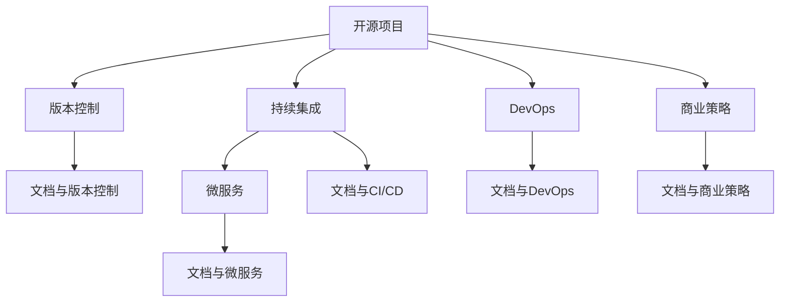

                 

# 开源项目文档的商业价值：策略与实施

> 关键词：开源项目,商业价值,文档管理,版本控制,持续集成(CI/CD),微服务,DevOps,商业策略

## 1. 背景介绍

### 1.1 问题由来
随着软件行业的不断发展，开源项目成为驱动技术进步的重要力量。从操作系统到编程语言，从云计算到人工智能，开源项目在各行各业中发挥着越来越重要的作用。开源项目的成功不仅取决于其技术先进性，更在于其良好的文档和社区氛围。然而，在开源项目的商业化过程中，文档管理的复杂性往往成为制约商业价值释放的重要瓶颈。

文档是开源项目最重要的资产之一，其质量直接影响用户的获取和使用效率。一份全面、易用、易读的文档，不仅能够帮助用户快速上手，还能减少技术支持成本，提高用户体验和满意度。但当前许多开源项目在文档管理上存在诸多问题，如版本更新不及时、文档格式混乱、跨项目文档关联困难等。这些问题不仅影响了开源项目的商业价值，还降低了开发者和用户的粘性。

### 1.2 问题核心关键点
本文聚焦于开源项目文档的商业价值，并结合文档管理的技术与实践，探讨如何通过有效的文档策略与实施方法，提升开源项目的商业价值，增强用户粘性，提升项目吸引力。具体来说，本文将从以下核心关键点展开：

1. **文档与版本控制**：探索如何通过版本控制工具管理文档，确保文档的最新版本始终与项目代码同步更新。
2. **文档与持续集成(CI/CD)**：介绍如何将CI/CD流程融入文档管理，实现文档的自动化生成和测试。
3. **文档与微服务架构**：分析微服务架构下文档管理的新挑战与解决方案。
4. **文档与DevOps文化**：讨论DevOps文化在文档管理中的应用，强调文档管理与持续交付的重要性。
5. **文档与商业策略**：从商业策略的角度，探讨如何利用文档管理提升开源项目的市场竞争力。

## 2. 核心概念与联系

### 2.1 核心概念概述

为更好地理解开源项目文档管理，本节将介绍几个密切相关的核心概念：

- **开源项目(Open Source Project)**：指公开源代码和文档，允许任何人修改和共享的软件开发项目。
- **版本控制(Version Control)**：指通过追踪代码的历史变化，管理代码的多个版本，确保团队协作和代码变更的记录。
- **持续集成(CI/CD)**：指通过自动化的代码集成和测试，确保代码变更的稳定性和质量，提升开发效率。
- **微服务架构(Microservices Architecture)**：指将大系统拆分为多个小型、独立运行的服务，每个服务负责特定的功能模块，提高系统的可扩展性和灵活性。
- **DevOps文化(DevOps Culture)**：指开发与运维之间的深度融合，强调快速交付、持续集成、持续交付和持续监控。
- **商业策略(Commercial Strategy)**：指企业为实现商业目标，在市场、产品、技术等方面进行的战略规划和决策。

这些核心概念之间的逻辑关系可以通过以下Mermaid流程图来展示：



这个流程图展示了几组核心概念之间的联系：

1. 开源项目与版本控制：版本控制是开源项目开发的基础，也是文档管理的重要手段。
2. 开源项目与持续集成：持续集成能够保证代码变更的质量，文档与CI/CD的结合，可以提升文档的实时性和准确性。
3. 开源项目与微服务：微服务架构下，文档管理面临新的挑战，如版本隔离、服务解耦等。
4. 开源项目与DevOps：DevOps文化强调持续交付和监控，文档管理是其中不可或缺的一环。
5. 开源项目与商业策略：良好的文档管理能够提升项目的市场竞争力，支持商业策略的实现。

这些概念共同构成了开源项目文档管理的框架，使其能够在各种场景下发挥作用。通过理解这些核心概念，我们可以更好地把握开源项目文档管理的逻辑和实践方向。

## 3. 核心算法原理 & 具体操作步骤
### 3.1 算法原理概述

开源项目文档管理的核心算法原理主要围绕以下几个方面展开：

- **版本控制原理**：通过版本控制系统（如Git），对文档进行版本管理，确保文档的最新版本与项目代码同步更新。
- **CI/CD流程**：通过自动化工具和脚本，将文档管理集成到CI/CD流程中，实现文档的自动化生成、测试和发布。
- **微服务文档管理**：在微服务架构下，通过文档版本隔离和分布式文档管理策略，确保文档的独立性和一致性。
- **DevOps实践**：将文档管理与DevOps文化相结合，强调持续交付和监控，提升文档的可靠性和实时性。

### 3.2 算法步骤详解

开源项目文档管理的步骤一般包括以下几个关键步骤：

**Step 1: 选择版本控制工具**
- 选择合适的版本控制工具，如Git、SVN等，以支持文档的版本管理。

**Step 2: 建立文档仓库**
- 创建文档仓库，存放所有项目的文档文件。
- 对文档仓库进行命名空间划分，如按项目、按模块等。

**Step 3: 设计文档结构**
- 设计统一的文档结构，如Markdown、Confluence等。
- 确定文档的标题、章节、目录等基本结构。

**Step 4: 集成CI/CD流程**
- 在CI/CD流程中集成文档自动生成工具，如Sphinx、Asciidoc等。
- 配置自动化测试脚本，确保文档的正确性。
- 配置自动化发布流程，确保文档的及时发布。

**Step 5: 采用微服务架构**
- 在微服务架构下，对每个服务的文档进行版本隔离，避免文档冲突。
- 采用分布式文档管理策略，如使用Consul、Zookeeper等进行文档配置管理。
- 使用API网关进行文档服务调用，确保文档的独立性和一致性。

**Step 6: 结合DevOps实践**
- 将文档管理纳入DevOps文化，强调持续交付和持续监控。
- 使用工具如Jenkins、GitLab CI等实现文档的自动化生成和发布。
- 定期进行文档健康检查，确保文档的实时性和准确性。

### 3.3 算法优缺点

开源项目文档管理的方法具有以下优点：
1. 提高文档一致性。通过版本控制和CI/CD流程，确保文档的最新版本始终与项目代码同步更新。
2. 提高文档可靠性。通过自动化测试和持续交付，确保文档的正确性和实时性。
3. 提高文档可用性。通过分布式文档管理和API网关，确保文档的独立性和一致性。
4. 提高文档可维护性。通过统一的文档结构和自动化工具，提升文档的编写和维护效率。

同时，该方法也存在一定的局限性：
1. 学习成本较高。需要掌握多种工具和技术的原理和使用方法。
2. 实施复杂。文档管理流程涉及多方面的集成和配置，实施难度较大。
3. 灵活性不足。文档管理流程的固定化可能限制项目团队的多样性。
4. 依赖工具。文档中依赖的API、资源等需要与项目代码同步更新，依赖性较强。

尽管存在这些局限性，但就目前而言，开源项目文档管理的方法仍是大规模协作和文档更新的重要手段。未来相关研究的重点在于如何进一步降低文档管理的技术门槛，提高文档管理的灵活性和可维护性。

### 3.4 算法应用领域

开源项目文档管理的方法在许多领域得到了广泛的应用，包括但不限于：

- **软件开发**：如GitHub、GitLab等平台上，开发者可以使用版本控制工具管理文档，确保文档的实时性和一致性。
- **云计算**：如AWS、Azure等云平台，开发者可以将文档管理集成到CI/CD流程中，提升文档的自动化和可靠性。
- **人工智能**：如TensorFlow、PyTorch等开源项目，开发者可以通过文档版本控制和自动化工具，提高模型和算法的文档管理效率。
- **数据科学**：如Pandas、NumPy等开源项目，开发者可以利用版本控制和CI/CD流程，提升数据分析和处理的文档管理水平。
- **区块链**：如Ethereum、Hyperledger等开源项目，开发者可以采用微服务架构和分布式文档管理，增强区块链系统的文档独立性和一致性。

除了上述这些经典应用领域外，开源项目文档管理的方法也在更多新兴领域中得到应用，如智能制造、智慧城市、医疗健康等，为各行业的数字化转型提供技术支持。

## 4. 数学模型和公式 & 详细讲解 & 举例说明
### 4.1 数学模型构建

本节将使用数学语言对开源项目文档管理过程进行更加严格的刻画。

假设文档仓库中存放的文档为 $D=\{d_1,d_2,\dots,d_n\}$，其中 $d_i$ 表示第 $i$ 个文档。每个文档的版本控制信息为 $v_i^{(k)}$，表示第 $k$ 个版本的文档。版本控制工具提供了一系列API，用于文档的版本管理。

定义文档的更新函数为 $update(d_i, v_i^{(k)})$，表示将文档 $d_i$ 更新为第 $k$ 个版本 $v_i^{(k)}$。

在CI/CD流程中，通过自动化工具和脚本，定义文档的生成函数 $generate(d_i)$ 和测试函数 $test(d_i)$，表示对文档 $d_i$ 进行生成和测试。

在微服务架构下，定义文档的服务隔离函数 $isolate(d_i, s_i)$，表示将文档 $d_i$ 服务隔离为第 $i$ 个服务。

在DevOps文化中，定义文档的持续交付函数 $release(d_i)$，表示将文档 $d_i$ 发布到指定位置。

### 4.2 公式推导过程

以下我们以Git工具为例，推导开源项目文档管理的数学模型。

假设文档仓库中存放的文档为 $d_1,d_2,\dots,d_n$，每个文档的版本控制信息为 $v_1^{(k)},v_2^{(k)},\dots,v_n^{(k)}$。在Git工具中，版本控制信息可以通过以下方式表示：

- $d_1$ 的最新版本为 $v_1^{(c)}$，其中 $c$ 为当前版本。
- 文档的变更记录为 $h_1,h_2,\dots,h_c$，表示从 $v_1^{(1)}$ 到 $v_1^{(c)}$ 的所有变更记录。

根据Git的版本控制原理，文档的更新可以通过以下方式实现：

- 获取最新文档版本：$v_1^{(c)} = get(d_1)$
- 获取变更记录：$h_1,h_2,\dots,h_c = diff(d_1, v_1^{(c)})$
- 更新文档：$v_1^{(c+1)} = update(d_1, h_1,h_2,\dots,h_c)$

类似地，其他文档的更新也可以通过上述方式实现。

在CI/CD流程中，文档的生成和测试可以通过自动化工具和脚本实现，其数学模型如下：

- 生成文档：$generate(d_i) = G(d_i)$，其中 $G$ 为文档生成函数。
- 测试文档：$test(d_i) = T(d_i)$，其中 $T$ 为文档测试函数。

在微服务架构下，文档的服务隔离可以通过Consul、Zookeeper等分布式配置管理工具实现，其数学模型如下：

- 服务隔离：$isolate(d_i, s_i) = I(d_i, s_i)$，其中 $I$ 为文档服务隔离函数。

在DevOps文化中，文档的持续交付可以通过Jenkins、GitLab CI等自动化工具实现，其数学模型如下：

- 持续交付：$release(d_i) = R(d_i)$，其中 $R$ 为文档持续交付函数。

将上述数学模型综合起来，开源项目文档管理的总流程可以表示为：

$$
D' = D \wedge update(D) \wedge generate(D) \wedge test(D) \wedge isolate(D) \wedge release(D)
$$

其中 $\wedge$ 表示操作与连接，$update(D), generate(D), test(D), isolate(D), release(D)$ 分别为版本控制、文档生成、文档测试、文档服务隔离和文档持续交付操作。

### 4.3 案例分析与讲解

这里以开源项目TensorFlow为例，进行文档管理的案例分析。

**TensorFlow的文档管理**

TensorFlow是一个广泛使用的开源机器学习框架，其文档管理过程如下：

1. **版本控制**：TensorFlow的文档使用Git进行版本控制，确保文档与代码库的同步更新。
2. **CI/CD**：TensorFlow的文档通过Jenkins和GitLab CI等工具，实现文档的自动化生成和测试。
3. **微服务**：TensorFlow的文档使用Google Cloud Platform进行分布式存储和访问，实现文档的服务隔离。
4. **DevOps**：TensorFlow的文档管理纳入了Google的DevOps实践，强调持续交付和持续监控。

TensorFlow的文档管理过程如下：

1. 在GitHub上创建TensorFlow的文档仓库，存储所有项目的文档文件。
2. 在Jenkins上配置CI/CD流程，实现文档的自动化生成和测试。
3. 在Google Cloud Platform上配置文档服务，实现文档的分布式存储和访问。
4. 在Google DevOps实践中，通过持续交付和持续监控工具，提升文档的可靠性和实时性。

通过TensorFlow的案例，可以看到开源项目文档管理方法的实际应用。通过结合版本控制、CI/CD、微服务架构和DevOps文化，TensorFlow能够高效地管理和发布文档，提升项目的商业价值和用户体验。

## 5. 项目实践：代码实例和详细解释说明
### 5.1 开发环境搭建

在进行开源项目文档管理实践前，我们需要准备好开发环境。以下是使用Git和Jenkins进行TensorFlow文档管理的开发环境配置流程：

1. 安装Anaconda：从官网下载并安装Anaconda，用于创建独立的Python环境。

2. 创建并激活虚拟环境：
```bash
conda create -n tensorflow-env python=3.8 
conda activate tensorflow-env
```

3. 安装TensorFlow：根据CUDA版本，从官网获取对应的安装命令。例如：
```bash
pip install tensorflow
```

4. 安装Jenkins：下载并安装Jenkins，部署在服务器上。

5. 配置Jenkins：安装必要的插件，如Git插件、Maven插件等。

6. 安装Git工具：下载并安装Git，配置SSH密钥等。

完成上述步骤后，即可在`tensorflow-env`环境中开始TensorFlow文档管理的实践。

### 5.2 源代码详细实现

下面我们以TensorFlow文档的自动生成和测试为例，给出Jenkins脚本的实现细节。

首先，定义Jenkins的工作空间和构建步骤：

```bash
# 工作空间配置
workspace 'tensorflow'

# 构建步骤配置
job('TensorFlow Documentation') {
    steps {
        // 获取最新代码
        git branch 'master'
        // 清理工作空间
        cleanWorkspace()
        // 生成文档
        sh 'python3 generate_documentation.py'
        // 测试文档
        sh 'python3 test_documentation.py'
        // 发布文档
        sh 'python3 publish_documentation.py'
    }
}

# 辅助函数定义
def cleanWorkspace() {
    // 删除所有文件
    sh 'rm -rf ${WORKSPACE}/'
}

def generate_documentation() {
    // 运行文档生成脚本
    sh 'python3 generate_documentation.py'
}

def test_documentation() {
    // 运行文档测试脚本
    sh 'python3 test_documentation.py'
}

def publish_documentation() {
    // 运行文档发布脚本
    sh 'python3 publish_documentation.py'
}
```

然后，定义文档生成、测试和发布的脚本实现：

```bash
# 文档生成脚本
def generate_documentation() {
    // 获取最新代码
    git fetch origin
    // 更新文档
    update_documentation()
    // 生成文档
    sh 'python3 generate_documentation.py'
    // 推送文档到仓库
    sh 'git add ${WORKSPACE}/tensorflow-docs'
    sh 'git commit -m "Generate documentation"'
    sh 'git push origin master'
}

# 文档测试脚本
def test_documentation() {
    // 获取最新代码
    git fetch origin
    // 更新文档
    update_documentation()
    // 测试文档
    sh 'python3 test_documentation.py'
    // 推送测试结果到仓库
    sh 'git add ${WORKSPACE}/test-results'
    sh 'git commit -m "Test documentation"'
    sh 'git push origin master'
}

# 文档发布脚本
def publish_documentation() {
    // 获取最新代码
    git fetch origin
    // 更新文档
    update_documentation()
    // 生成文档
    sh 'python3 generate_documentation.py'
    // 推送文档到仓库
    sh 'git add ${WORKSPACE}/tensorflow-docs'
    sh 'git commit -m "Publish documentation"'
    sh 'git push origin master'
    // 发布文档到网站
    sh 'python3 publish_documentation.py'
}
```

最后，启动Jenkins的构建流程：

```bash
# 启动Jenkins构建任务
./jenkins/jenkins.sh
```

通过Jenkins脚本的实现，可以看到TensorFlow文档管理的具体步骤和工具使用方式。通过结合Git、Jenkins等工具，TensorFlow能够高效地管理和发布文档，提升项目的商业价值和用户体验。

### 5.3 代码解读与分析

让我们再详细解读一下关键代码的实现细节：

**Jenkins工作空间配置**

- `workspace 'tensorflow'`：定义Jenkins的工作空间为`tensorflow`，用于存放构建过程中的临时文件。

**Jenkins构建步骤配置**

- `job('TensorFlow Documentation')`：定义构建任务为`TensorFlow Documentation`。
- `git branch 'master'`：获取最新的`master`分支代码。
- `cleanWorkspace()`：清理工作空间，删除所有文件。
- `generate_documentation()`：调用文档生成脚本，生成文档并推送到仓库。
- `test_documentation()`：调用文档测试脚本，测试文档并推送测试结果到仓库。
- `publish_documentation()`：调用文档发布脚本，发布文档并推送到网站。

**辅助函数定义**

- `cleanWorkspace()`：定义清理工作空间的辅助函数，删除所有文件。
- `generate_documentation()`：定义文档生成脚本的辅助函数，运行文档生成脚本并推送文档到仓库。
- `test_documentation()`：定义文档测试脚本的辅助函数，运行文档测试脚本并推送测试结果到仓库。
- `publish_documentation()`：定义文档发布脚本的辅助函数，运行文档发布脚本并推送文档到网站。

通过这些关键代码的解读，可以看到Jenkins脚本的实现方式和功能模块。通过结合Git、Jenkins等工具，TensorFlow能够高效地管理和发布文档，提升项目的商业价值和用户体验。

当然，工业级的系统实现还需考虑更多因素，如Jenkins的持续集成与部署、Git的分布式协作等。但核心的文档管理范式基本与此类似。

## 6. 实际应用场景
### 6.1 开源社区

开源社区是文档管理最为活跃的场所之一。许多开源项目的文档管理实践，不仅提升了社区的协作效率，还吸引了更多的开发者和用户参与。

例如，Apache项目通过版本控制和CI/CD流程，实现了文档的自动化管理。项目维护者定期发布文档更新，并邀请社区成员参与审阅和反馈。通过这种方式，Apache项目的文档管理高效且透明，提升了项目的可维护性和用户体验。

### 6.2 企业应用

许多企业在内部也采用开源项目的文档管理方法，通过版本控制和CI/CD流程，提升项目的协作效率和文档管理水平。

例如，Google在内部广泛采用Git和Jenkins进行文档管理。Google的开发团队通过版本控制和CI/CD流程，实现了文档的自动化生成和测试。在Google的DevOps文化中，文档管理与持续交付和持续监控紧密结合，提升了项目的可靠性和实时性。

### 6.3 开源软件

开源软件项目普遍采用文档管理方法，提升项目的可维护性和用户体验。

例如，Linux内核项目通过版本控制和CI/CD流程，实现了文档的自动化管理。项目维护者定期发布文档更新，并邀请社区成员参与审阅和反馈。通过这种方式，Linux内核的文档管理高效且透明，提升了项目的可维护性和用户体验。

### 6.4 未来应用展望

随着开源项目的普及和普及，文档管理的应用场景将不断扩大。未来，文档管理将进一步融入DevOps文化，成为持续交付和持续监控的重要组成部分。同时，文档管理也将与其他新兴技术进行融合，如区块链、物联网等，拓展文档管理的应用范围。

在开源社区，文档管理将更加注重社区参与和透明度，通过开源协作平台如GitHub、GitLab等，提升文档管理的效率和质量。

在企业应用中，文档管理将更加注重自动化和集成化，通过CI/CD流程和DevOps实践，提升文档的生成、测试和发布效率。

在开源软件项目中，文档管理将更加注重可维护性和用户体验，通过版本控制和CI/CD流程，提升文档的生成、测试和发布效率。

总之，文档管理将成为开源项目的重要组成部分，提升项目的商业价值和用户体验。

## 7. 工具和资源推荐
### 7.1 学习资源推荐

为了帮助开发者系统掌握开源项目文档管理的技术基础和实践技巧，这里推荐一些优质的学习资源：

1. **《The Art of the Tactical Git: Second Edition》**：这是一本深入讲解Git版本控制的工具书，适合初学者和进阶开发者阅读。
2. **《Continuous Integration: Builds, Deployments, and Jobs》**：这是一本讲解CI/CD流程的经典书籍，介绍了CI/CD的基本概念和实践方法。
3. **《DevOps: The Real Revolution》**：这是一本探讨DevOps文化的书籍，介绍了DevOps的基本理念和实践方法。
4. **《The Definitive Guide to Jenkins》**：这是一本讲解Jenkins工具的书籍，适合Jenkins的初学者和进阶开发者阅读。
5. **《TensorFlow Dev Guide》**：这是TensorFlow官方文档的一部分，详细介绍了TensorFlow的开发和部署方法。

通过对这些资源的学习实践，相信你一定能够快速掌握开源项目文档管理的精髓，并用于解决实际的文档管理问题。

### 7.2 开发工具推荐

高效的开发离不开优秀的工具支持。以下是几款用于开源项目文档管理开发的常用工具：

1. **Git**：版本控制工具，支持分布式协作和文档的版本管理。
2. **Jenkins**：持续集成和持续部署工具，支持文档的自动化生成和测试。
3. **Maven**：项目管理工具，支持文档的自动化构建和发布。
4. **Confluence**：文档协作平台，支持文档的协作编写和共享。
5. **Swagger**：API文档生成工具，支持文档的API文档生成和测试。
6. **GitLab**：综合开发平台，支持文档的版本控制、CI/CD和DevOps实践。

合理利用这些工具，可以显著提升开源项目文档管理的开发效率，加快创新迭代的步伐。

### 7.3 相关论文推荐

开源项目文档管理的发展离不开学界的持续研究。以下是几篇奠基性的相关论文，推荐阅读：

1. **"A Survey of Software Configuration Management Tools"**：总结了软件配置管理工具的发展历程和现状，探讨了版本控制和文档管理的关系。
2. **"Continuous Integration: A New Tool to Improve Productivity"**：介绍了持续集成和持续部署的基本概念和实践方法，强调了文档管理在CI/CD中的重要性。
3. **"The DevOps Handbook"**：探讨了DevOps文化的基本理念和实践方法，强调了文档管理与持续交付和持续监控的结合。
4. **"The Future of Open Source"**：探讨了开源项目的发展趋势和未来方向，强调了文档管理在开源社区和企业应用中的作用。
5. **"Machine Learning for Software Engineering: A Survey"**：总结了机器学习在软件工程中的应用，探讨了文档管理与自动化工具的结合。

这些论文代表了大语言模型微调技术的发展脉络。通过学习这些前沿成果，可以帮助研究者把握学科前进方向，激发更多的创新灵感。

## 8. 总结：未来发展趋势与挑战
### 8.1 总结

本文对开源项目文档管理的核心概念、技术原理和实践方法进行了全面系统的介绍。首先阐述了文档管理在开源项目中的重要地位，明确了文档管理对提升项目商业价值、用户粘性和市场竞争力的独特价值。其次，从版本控制、CI/CD、微服务架构和DevOps文化等多个维度，详细讲解了文档管理的核心步骤和实现方式，给出了TensorFlow文档管理的代码实例。同时，本文还广泛探讨了文档管理在开源社区、企业应用和开源软件项目中的应用场景，展示了文档管理的广泛应用和前景。

通过本文的系统梳理，可以看到，开源项目文档管理已经成为开源项目的重要组成部分，其核心思想和方法已经被广泛应用和验证。未来，文档管理将进一步融入DevOps文化，成为持续交付和持续监控的重要组成部分。同时，文档管理也将与其他新兴技术进行融合，如区块链、物联网等，拓展文档管理的应用范围。

### 8.2 未来发展趋势

展望未来，开源项目文档管理技术将呈现以下几个发展趋势：

1. **文档自动化水平提升**：随着自动化工具和脚本的普及，文档管理将更加高效和自动化。文档的生成、测试和发布将更加快速和可靠。
2. **文档版本控制优化**：通过新的版本控制工具和策略，文档管理将更加灵活和高效。如Git、SVN等工具将不断迭代优化，提升文档的版本控制能力。
3. **文档与CI/CD深度集成**：文档管理将更加紧密地融入CI/CD流程，通过自动化工具和脚本，实现文档的持续交付和持续监控。
4. **文档服务化部署**：文档服务将更加注重分布式部署和弹性扩展，通过API网关等技术，实现文档的灵活访问和高效管理。
5. **文档与DevOps协同**：文档管理将更加注重与DevOps文化的结合，强调持续交付和持续监控，提升文档的可靠性和实时性。
6. **文档质量保障机制**：通过自动化测试、代码评审等手段，提升文档的质量和可维护性。文档管理将更加注重文档的可读性和易用性。

以上趋势凸显了文档管理的广泛应用和前景。这些方向的探索发展，必将进一步提升文档管理的效率和质量，为开源项目提供更可靠、更高效的技术支持。

### 8.3 面临的挑战

尽管开源项目文档管理技术已经取得了一定的成果，但在迈向更加智能化、普适化应用的过程中，它仍面临诸多挑战：

1. **文档一致性**：文档版本管理复杂，如何保证文档的一致性，是一个难题。版本冲突、文档更新不及时等问题，仍需进一步解决。
2. **文档可靠性**：文档的自动化生成和测试需要更多的技术支持，如何提高文档的可靠性，避免生成错误、测试失效，还需更多实践的积累。
3. **文档灵活性**：文档管理流程的固定化，可能限制项目团队的多样性。如何在灵活性和标准化之间找到平衡，还需更多的探索。
4. **文档依赖性**：文档中依赖的API、资源等需要与项目代码同步更新，依赖性较强。如何降低文档管理的依赖性，还需进一步优化。
5. **文档可维护性**：文档管理需要持续维护和更新，如何提升文档的可维护性，降低维护成本，还需更多的实践和工具支持。

这些挑战凸显了文档管理技术的复杂性和局限性。未来相关研究的重点在于如何进一步降低文档管理的技术门槛，提高文档管理的灵活性和可维护性。

### 8.4 研究展望

面对文档管理面临的挑战，未来的研究需要在以下几个方面寻求新的突破：

1. **探索文档版本控制新方法**：研发新的版本控制工具和策略，提升文档版本管理的灵活性和高效性。
2. **引入文档自动化新工具**：引入新的自动化工具和脚本，提升文档的自动化生成和测试能力。
3. **融合文档与CI/CD**：将文档管理与CI/CD流程进行深度集成，提升文档的持续交付和持续监控能力。
4. **优化文档服务化部署**：优化文档服务的分布式部署和弹性扩展策略，提升文档的灵活访问和高效管理能力。
5. **加强文档质量保障**：通过自动化测试、代码评审等手段，提升文档的质量和可维护性。

这些研究方向的探索，必将引领开源项目文档管理技术迈向更高的台阶，为开源项目提供更可靠、更高效的技术支持。面向未来，文档管理技术还需要与其他新兴技术进行更深入的融合，如区块链、物联网等，拓展文档管理的应用范围，提升文档管理的智能化和普适化水平。

## 9. 附录：常见问题与解答

**Q1：开源项目文档管理如何应对文档版本冲突？**

A: 开源项目文档管理中的版本冲突，通常可以通过以下方法解决：

1. **使用分支管理**：将文档仓库按项目或模块进行划分，每个分支管理一份文档。在发布文档时，先合并分支到主分支，再进行版本更新。
2. **合并冲突文件**：当多个分支的文档出现冲突时，手动合并冲突文件，解决版本冲突。
3. **使用冲突管理工具**：使用Git等版本控制工具的冲突管理功能，自动检测和解决文档版本冲突。

**Q2：文档的自动化生成和测试如何实现？**

A: 文档的自动化生成和测试，通常可以通过以下方式实现：

1. **使用自动化生成工具**：如Sphinx、AsciiDoc等，将文档从源码自动生成。
2. **编写自动化测试脚本**：通过Python等脚本语言，编写自动化测试脚本，确保文档的正确性。
3. **集成CI/CD流程**：将文档的自动化生成和测试集成到CI/CD流程中，实现文档的持续交付和持续监控。

**Q3：文档管理的灵活性如何提升？**

A: 文档管理的灵活性可以通过以下方式提升：

1. **引入模块化设计**：将文档按模块进行划分，每个模块独立管理。
2. **使用插件和扩展**：使用插件和扩展，实现文档管理功能的扩展和定制。
3. **引入微服务架构**：在微服务架构下，对每个服务的文档进行独立管理，提升文档的灵活性。

**Q4：文档管理如何降低依赖性？**

A: 文档管理依赖性可以通过以下方式降低：

1. **文档解耦**：将文档与代码库进行解耦，减少文档对代码库的依赖。
2. **独立部署**：将文档独立部署，减少文档中依赖的API和资源对代码库的依赖。
3. **引入文档版本控制工具**：使用独立的版本控制工具，提升文档的版本管理能力。

通过这些问题的解答，可以看到文档管理在开源项目中的重要地位和实际应用。未来，文档管理技术将继续在开源项目中发挥重要作用，提升项目的商业价值和用户体验。

