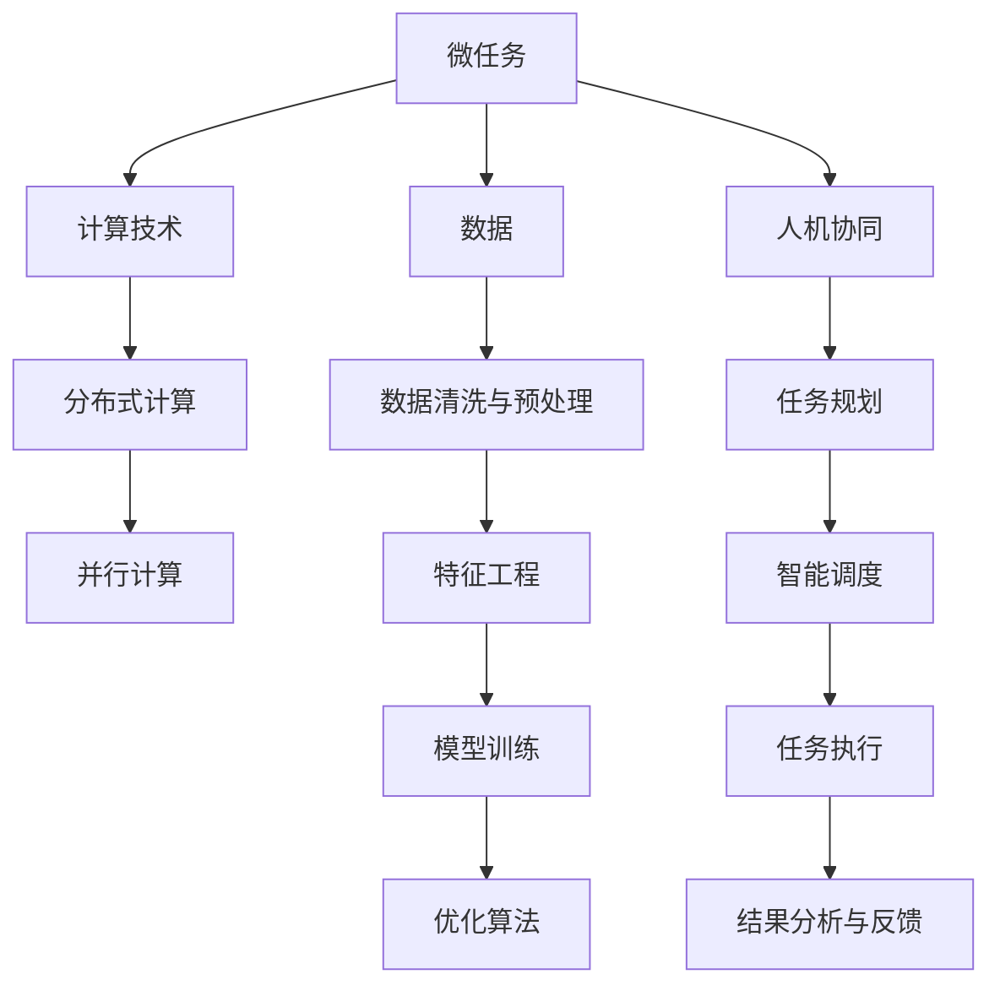

                 

# 微任务，大能量：人类计算的价值释放

## 1. 背景介绍

### 1.1 问题由来

在人类历史的长河中，计算能力的提升一直是推动社会进步和科技创新的关键因素。随着计算机技术的不断发展，人类计算能力得到了空前提升，极大地拓展了人类知识与智慧的应用场景。然而，伴随着计算能力的提升，人类计算的边界也日益模糊，其价值所在引发了广泛探讨。

从早期的计算尺、机械计算器，到后来的电子计算机、大型计算机，再到今天的超级计算机、量子计算机，每一步技术进步都极大地改变了人类计算的形态。在数字化、网络化的今天，计算的复杂性和多样性进一步增加，如何有效释放人类计算的潜力，成为了当前技术领域的一个重要议题。

### 1.2 问题核心关键点

针对当前人类计算面临的挑战和机遇，本文将深入探讨微任务的价值，并结合现代计算技术的发展，提出一系列提升人类计算效率和效能的策略。我们将在如下几个核心方面进行探讨：

1. **微任务与宏观任务**：阐明微任务在宏观任务中的重要性。
2. **计算技术与微任务**：分析不同计算技术在微任务中的应用。
3. **数据与微任务**：探讨数据在微任务中的作用和优化策略。
4. **人机协同**：研究人机协同在微任务中的实现方式。
5. **未来趋势与挑战**：展望微任务技术的发展方向和面临的挑战。

通过全面理解这些核心问题，我们有望为人类计算能力的进一步提升和价值释放提供新的思路和方法。

## 2. 核心概念与联系

### 2.1 核心概念概述

为了更好地理解微任务在人类计算中的价值，我们需要先了解一些核心概念：

- **微任务**：在现代计算范式下，将复杂任务分解为一系列可独立执行、规模较小的任务单元，通过并行计算和分布式计算等技术，高效完成。

- **计算技术**：包括硬件计算、软件计算、算法优化、分布式计算等技术，旨在提高计算效率和性能。

- **数据**：在微任务中，数据是任务执行的输入和输出，其质量、规模和处理方式对任务性能有重要影响。

- **人机协同**：结合人类智能和计算技术，通过智能化的任务规划和执行，优化计算资源的使用，提升任务完成效率。

- **未来趋势**：包括计算范式的演进、计算技术的突破、数据处理能力的提升等，是未来计算领域发展的重要方向。

这些概念之间相互关联，共同构成了微任务技术的基本框架。

### 2.2 核心概念原理和架构的 Mermaid 流程图



这个流程图展示了微任务技术的基本流程：

1. 微任务将复杂任务分解为多个小任务，并通过分布式计算和并行计算等技术进行高效执行。
2. 计算技术支持微任务的执行，包括分布式计算、并行计算等。
3. 数据是微任务执行的关键，需要进行清洗、预处理和特征工程等步骤。
4. 人机协同优化任务规划和执行，提升计算资源利用率。
5. 任务执行结果需要进行分析与反馈，以优化后续任务。

## 3. 核心算法原理 & 具体操作步骤

### 3.1 算法原理概述

微任务的计算原理基于任务分解和并行计算的基本思想，通过将复杂任务分解为多个小任务，在多个计算节点上并行执行，从而大大提升计算效率和性能。其核心在于任务的可分解性和计算节点的分布式协同。

### 3.2 算法步骤详解

1. **任务分解**：将宏观任务分解为多个独立可执行的微任务，每个微任务规模较小，执行时间较短，适合并行计算。

2. **任务调度与分配**：根据任务的资源需求和计算节点的可用资源，通过智能调度算法，将微任务分配到合适的计算节点上。

3. **并行计算与分布式计算**：在分布式计算环境中，多个计算节点并行执行微任务，提升计算效率。

4. **数据处理与优化**：对输入数据进行清洗、预处理和特征工程，提升数据质量，优化计算过程。

5. **结果收集与分析**：将各个计算节点上执行的结果收集并汇总，进行分析与反馈，优化后续任务的执行。

### 3.3 算法优缺点

微任务技术的优点包括：

- **高效性**：通过并行计算和分布式计算，大大提升计算效率。
- **灵活性**：任务可分解为多个小任务，适应性强，适合复杂任务的执行。
- **扩展性**：计算节点可动态扩展，适应计算需求的变化。

缺点主要包括：

- **通信开销**：分布式计算环境中，节点间的通信开销较大，影响整体效率。
- **任务分解难度**：复杂任务的分解难度较大，需要较高的技术门槛。
- **资源管理**：任务调度与资源分配需要智能算法，存在一定的复杂性。

### 3.4 算法应用领域

微任务技术在多个领域中得到了广泛应用，包括但不限于：

- **大数据处理**：通过微任务处理大规模数据集，提升数据处理速度和效率。
- **科学计算**：在高性能计算环境中，通过微任务执行复杂的科学计算任务。
- **智能制造**：在工业互联网中，通过微任务实现生产过程的智能化和自动化。
- **金融计算**：在金融市场模拟、风险管理等领域，通过微任务提升计算效率。
- **生物计算**：在基因组学、蛋白质结构预测等领域，通过微任务加速计算过程。

## 4. 数学模型和公式 & 详细讲解 & 举例说明

### 4.1 数学模型构建

为了更好地理解微任务技术的数学基础，我们将构建一个简单的数学模型。设任务$T$包含$N$个子任务$T_1, T_2, ..., T_N$，每个子任务计算时间为$t_i$，执行顺序为$S_1, S_2, ..., S_N$。设计算节点数量为$M$，每个节点的计算能力为$C_i$，节点$j$执行$T_k$的概率为$p_{jk}$。

### 4.2 公式推导过程

假设所有子任务在所有节点上的执行概率分布均匀，则节点$j$执行子任务$T_k$的时间期望为：

$$
E(T_{k,j}) = \sum_{i=1}^{N} p_{ik} \cdot t_i
$$

假设所有子任务在所有节点上执行的概率分布不均匀，则节点$j$执行子任务$T_k$的时间期望为：

$$
E(T_{k,j}) = \sum_{i=1}^{N} p_{ik} \cdot t_i
$$

### 4.3 案例分析与讲解

假设有一个大规模的机器学习训练任务，包含$10000$个样本，每个样本需要$1$分钟训练时间，分布在$10$个计算节点上。所有节点的计算能力相同，每个节点可以同时处理$100$个样本。

首先，我们将任务分解为$10000$个微任务，每个微任务为训练一个样本。由于节点能力相同，每个节点可以同时处理$100$个样本，因此任务分解为$100$个子任务，每个子任务由$10$个节点并行计算。

假设每个子任务在所有节点上的执行概率分布均匀，则每个节点执行一个子任务的时间期望为：

$$
E(T_{k,j}) = \frac{10000}{M} = \frac{10000}{10} = 1000\ \text{分钟}
$$

因此，整个任务的执行时间为$1000$分钟。如果每个子任务在所有节点上的执行概率不均匀，则需要进一步分析和优化。

## 5. 项目实践：代码实例和详细解释说明

### 5.1 开发环境搭建

微任务技术的实现依赖于现代计算基础设施，包括高性能计算环境、分布式计算框架等。以下是一些常用的开发环境搭建步骤：

1. **选择合适的计算环境**：如Amazon EC2、Google Cloud Platform、Microsoft Azure等云平台。
2. **安装计算框架**：如Hadoop、Spark、TensorFlow等。
3. **配置任务调度工具**：如Apache YARN、Kubernetes等。

### 5.2 源代码详细实现

以下是一个简单的微任务实现示例，使用Python和Spark进行数据处理和计算：

```python
from pyspark import SparkContext, SparkConf

# 初始化Spark上下文
conf = SparkConf().setAppName("Microtask Example")
sc = SparkContext(conf=conf)

# 定义数据处理函数
def process_data(data):
    # 数据清洗与预处理
    # ...
    return processed_data

# 定义任务执行函数
def execute_task(data):
    # 特征工程与模型训练
    # ...
    return result

# 定义微任务分解与调度函数
def microtask_processing():
    # 任务分解为多个微任务
    data = sc.parallelize(data_list)
    processed_data = data.map(process_data)
    result = processed_data.map(execute_task)
    return result.collect()

# 主函数
if __name__ == "__main__":
    # 读取数据
    data = sc.textFile("input_data")
    # 执行微任务处理
    result = microtask_processing()
    # 结果输出
    for r in result:
        print(r)
```

### 5.3 代码解读与分析

- **数据处理**：使用Spark的parallelize方法将数据分发到各个节点，通过map方法进行数据清洗与预处理。
- **任务执行**：通过map方法进行特征工程和模型训练，得到最终结果。
- **任务分解与调度**：使用Spark的map和collect方法，将任务分解为多个微任务，并进行智能调度。

## 6. 实际应用场景

### 6.1 大数据处理

在大数据处理场景中，微任务技术可以显著提升数据处理的效率和性能。例如，在Hadoop和Spark环境中，通过微任务处理大规模数据集，可以大幅缩短数据处理时间。

### 6.2 科学计算

在科学计算领域，微任务技术可以应用于复杂科学问题的计算，如分子动力学模拟、气候模型计算等。通过分布式计算和并行计算，可以加速科学计算任务的执行。

### 6.3 智能制造

在智能制造领域，微任务技术可以应用于生产线的智能化和自动化，提升生产效率和质量。例如，通过微任务进行机器视觉检测、质量控制等任务。

### 6.4 金融计算

在金融计算领域，微任务技术可以应用于市场模拟、风险管理等任务，通过并行计算提升计算效率。

### 6.5 生物计算

在生物计算领域，微任务技术可以应用于基因组学、蛋白质结构预测等任务，通过分布式计算加速计算过程。

## 7. 工具和资源推荐

### 7.1 学习资源推荐

为了帮助开发者系统掌握微任务技术的理论基础和实践技巧，以下是一些优质的学习资源：

1. **《分布式计算与大数据技术》**：详细介绍了分布式计算和微任务处理的基本原理和应用场景。
2. **《深度学习与人工智能》**：介绍了深度学习和大数据技术在微任务处理中的应用。
3. **《Apache Spark官方文档》**：提供了Spark的详细使用文档和示例代码，是学习Spark的好资料。
4. **《TensorFlow官方文档》**：提供了TensorFlow的详细使用文档和示例代码，是学习TensorFlow的好资料。
5. **《Kubernetes官方文档》**：提供了Kubernetes的详细使用文档和示例代码，是学习Kubernetes的好资料。

通过这些学习资源，开发者可以快速掌握微任务技术的核心知识，并将其应用于实际开发中。

### 7.2 开发工具推荐

为了提升微任务技术的开发效率，以下是一些常用的开发工具：

1. **Hadoop**：提供了分布式计算和数据处理的基础设施，适合大规模数据处理任务。
2. **Spark**：提供了高效的分布式计算框架，适合大规模数据处理和科学计算任务。
3. **TensorFlow**：提供了高效的数据处理和模型训练框架，适合深度学习和科学计算任务。
4. **Kubernetes**：提供了高效的容器编排和管理工具，适合分布式计算环境的部署和管理。

合理利用这些工具，可以显著提升微任务技术的开发效率，加快创新迭代的步伐。

### 7.3 相关论文推荐

微任务技术的发展源于学界的持续研究。以下是几篇奠基性的相关论文，推荐阅读：

1. **"MapReduce: Simplified Data Processing on Large Clusters"**：提出了MapReduce分布式计算模型，是分布式计算的经典之作。
2. **"Apache Spark: Cluster Computing with Fault Tolerance"**：介绍了Spark的分布式计算框架，是Spark的经典之作。
3. **"TensorFlow: A System for Large-Scale Machine Learning"**：介绍了TensorFlow的深度学习框架，是TensorFlow的经典之作。
4. **"Kubernetes: Container Orchestration"**：介绍了Kubernetes的容器编排和管理工具，是Kubernetes的经典之作。

这些论文代表了大数据和微任务技术的发展脉络。通过学习这些前沿成果，可以帮助研究者把握学科前进方向，激发更多的创新灵感。

## 8. 总结：未来发展趋势与挑战

### 8.1 总结

本文对微任务技术进行了全面系统的介绍。首先阐述了微任务在现代计算中的重要性，明确了微任务在提升计算效率和效能方面的独特价值。其次，从原理到实践，详细讲解了微任务计算的数学模型和关键步骤，给出了微任务任务处理的完整代码实例。同时，本文还广泛探讨了微任务技术在多个领域的应用前景，展示了微任务技术的巨大潜力。此外，本文精选了微任务技术的各类学习资源，力求为读者提供全方位的技术指引。

通过本文的系统梳理，可以看到，微任务技术正在成为现代计算的重要范式，极大地拓展了计算资源的利用效率，为各类复杂任务的执行提供了新的解决方案。未来，伴随计算技术的不断演进，微任务技术将在更多领域得到应用，为人类认知智能的进化带来深远影响。

### 8.2 未来发展趋势

展望未来，微任务技术将呈现以下几个发展趋势：

1. **计算范式的演进**：随着计算技术的发展，微任务技术将进一步演进，从分布式计算向异构计算、量子计算等方向发展。
2. **计算技术的突破**：新一代计算技术的突破将为微任务技术带来新的机遇，如云计算、边缘计算等。
3. **数据处理能力的提升**：数据处理技术的进步将进一步提升微任务技术的效率和性能。
4. **人机协同的增强**：智能化的任务规划和执行将进一步提升微任务技术的灵活性和适应性。

以上趋势凸显了微任务技术的广阔前景。这些方向的探索发展，必将进一步提升微任务技术的性能和应用范围，为计算领域的进步带来新的动力。

### 8.3 面临的挑战

尽管微任务技术已经取得了显著成就，但在迈向更加智能化、普适化应用的过程中，它仍面临着诸多挑战：

1. **资源管理**：分布式计算环境中，资源管理复杂，需要高效的调度和优化算法。
2. **通信开销**：节点间的通信开销较大，影响整体效率。
3. **任务分解难度**：复杂任务的分解难度较大，需要较高的技术门槛。
4. **计算模型优化**：需要优化计算模型，减少资源消耗，提升计算效率。
5. **人机协同的实现**：需要高效的智能规划和执行算法，提升人机协同的效率。

这些挑战需要通过技术创新和优化，逐步克服。只有从数据、算法、工程、业务等多个维度协同发力，才能真正实现微任务技术的价值释放。

### 8.4 研究展望

未来，微任务技术的研究方向将在以下几个方面进行深入探索：

1. **任务自动分解**：开发更智能的任务分解算法，自动识别复杂任务的分解点。
2. **分布式计算优化**：进一步优化分布式计算框架，提升计算效率和性能。
3. **智能调度与优化**：开发更高效的智能调度算法，提升资源利用率和计算效率。
4. **人机协同的实现**：结合人工智能技术，提升人机协同的智能化水平。

这些研究方向将进一步提升微任务技术的性能和应用范围，为计算领域的进步带来新的动力。

## 9. 附录：常见问题与解答

**Q1：微任务技术是否适用于所有计算任务？**

A: 微任务技术在大多数计算任务中都具有应用价值，尤其是数据密集型和计算密集型任务。但对于某些特殊类型的任务，如实时计算任务，微任务技术可能存在通信开销较大的问题，需要进一步优化。

**Q2：微任务技术如何处理数据质量问题？**

A: 微任务技术在数据处理过程中，需要进行数据清洗和预处理，以提升数据质量。对于数据质量较差的任务，可以通过特征工程等技术进行优化，提升数据处理效果。

**Q3：微任务技术在实际应用中面临哪些挑战？**

A: 微任务技术在实际应用中面临的主要挑战包括：资源管理复杂、通信开销较大、任务分解难度高等问题。需要通过技术创新和优化，逐步克服这些挑战。

**Q4：微任务技术未来有哪些发展方向？**

A: 微任务技术未来的发展方向包括计算范式的演进、计算技术的突破、数据处理能力的提升等。需要通过技术创新和优化，逐步提升微任务技术的性能和应用范围。

**Q5：微任务技术如何与AI技术结合？**

A: 微任务技术可以与AI技术进行深度结合，通过智能化的任务规划和执行，提升计算资源的使用效率。例如，可以使用AI技术进行任务分解和调度，提升微任务技术的灵活性和适应性。

通过深入探索微任务技术的潜力，我们有望进一步提升人类计算的能力和效率，为各类复杂任务的执行提供新的解决方案。

