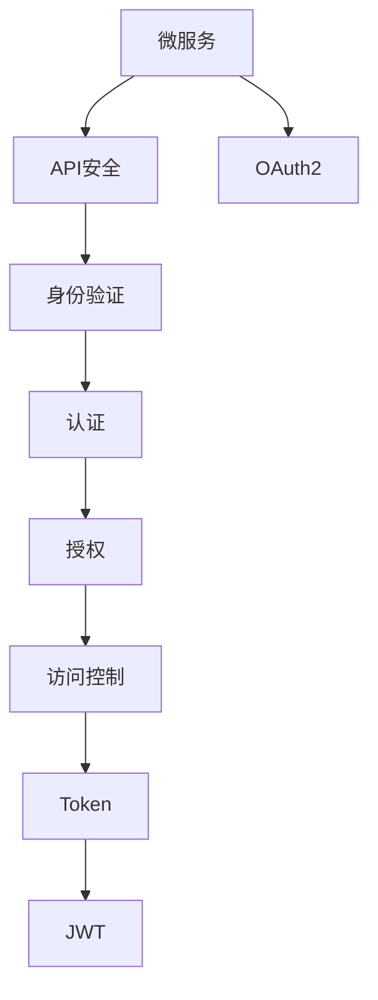

                 

# 微服务安全：OAuth2和JWT的实践

> 关键词：微服务,OAuth2,JWT,安全,API,身份验证,认证,授权,Token,访问控制

## 1. 背景介绍

随着微服务架构在现代应用中的普及，越来越多的企业开始采用微服务来构建分布式应用。微服务架构提高了应用的灵活性和可扩展性，但同时也带来了新的安全挑战。如何保护微服务架构的安全，成为企业IT团队需要重点关注的问题。

OAuth2和JWT是近年来兴起的两种常用的认证和授权技术，它们通过将认证和授权逻辑分离，为微服务架构提供了有效的安全解决方案。本文将详细介绍OAuth2和JWT的工作原理、实现方法及其在微服务架构中的应用实践。

## 2. 核心概念与联系

### 2.1 核心概念概述

为更好地理解OAuth2和JWT在微服务安全中的实践，本节将介绍几个密切相关的核心概念：

- **微服务架构(Microservices Architecture)**：一种分布式应用架构，由一组相互独立的、可独立部署的服务组成。每个微服务通过RESTful API提供服务，服务之间通过网络通信进行交互。

- **OAuth2(开放授权框架2)**：一种开放标准，用于在互联网上安全地提供授权机制。OAuth2通过授权服务器和资源服务器之间的交互，控制用户访问资源的方式。

- **JWT(JSON Web Token)**：一种轻量级的开放标准，用于在网络上传输安全的声明。JWT包含了用户信息、密钥和签名等信息，便于在不同系统之间传递用户身份信息。

- **API安全**：在微服务架构中，API是服务之间通信的重要手段，保护API安全是保护微服务架构安全的关键。

- **身份验证**：验证用户身份，确认用户的合法性。

- **认证**：验证用户凭据，确认用户的有效性。

- **授权**：根据用户身份和权限，控制用户对资源的访问。

- **Token**：一种用于证明用户身份和权限的令牌。

- **访问控制**：根据用户身份和权限，控制用户对资源的访问。

这些核心概念之间的逻辑关系可以通过以下Mermaid流程图来展示：



这个流程图展示了几大核心概念及其之间的关系：

1. 微服务通过API进行通信，API安全是微服务安全的基础。
2. 身份验证确认用户的合法性，认证确认用户的有效性。
3. 授权根据用户身份和权限，控制对资源的访问。
4. Token用于证明用户身份和权限，JWT是一种常用的Token格式。
5. 访问控制根据用户身份和权限，控制对资源的访问。

## 3. 核心算法原理 & 具体操作步骤

### 3.1 算法原理概述

OAuth2和JWT的核心原理分别概述如下：

- **OAuth2原理**：OAuth2通过授权服务器和资源服务器之间的交互，控制用户访问资源的方式。具体过程包括客户端请求授权，授权服务器颁发授权令牌，客户端使用授权令牌访问资源服务器，资源服务器验证授权令牌，并根据用户权限返回资源。

- **JWT原理**：JWT是一种轻量级的开放标准，用于在网络上传输安全的声明。JWT包含了用户信息、密钥和签名等信息，便于在不同系统之间传递用户身份信息。

- **微服务架构中的实践**：在微服务架构中，OAuth2和JWT通常用于跨服务调用时进行身份验证和授权，保护API接口的安全。

### 3.2 算法步骤详解

#### OAuth2实践步骤

1. **客户端请求授权**：客户端向授权服务器请求授权，授权服务器要求用户进行身份验证。

2. **用户授权**：用户通过授权服务器进行身份验证，并授权客户端访问其资源。

3. **授权服务器颁发授权令牌**：授权服务器颁发授权令牌，并将令牌返回给客户端。

4. **客户端访问资源**：客户端携带授权令牌访问资源服务器，资源服务器验证授权令牌，并根据用户权限返回资源。

#### JWT实践步骤

1. **客户端请求授权**：客户端向授权服务器请求授权，授权服务器要求用户进行身份验证。

2. **用户授权**：用户通过授权服务器进行身份验证，并授权客户端访问其资源。

3. **授权服务器颁发JWT令牌**：授权服务器颁发JWT令牌，并将令牌返回给客户端。

4. **客户端访问资源**：客户端携带JWT令牌访问资源服务器，资源服务器验证JWT令牌，并根据用户权限返回资源。

### 3.3 算法优缺点

**OAuth2优点**：
- 基于标准的开放授权框架，易于实现和维护。
- 支持多种认证方式，包括密码模式、客户端模式、授权码模式、隐式模式等。
- 灵活的授权模式，适用于不同应用场景。

**OAuth2缺点**：
- 授权流程相对复杂，增加了系统实现的复杂度。
- 需要维护多个令牌，增加了系统的存储和管理成本。

**JWT优点**：
- 轻量级、简洁易用，易于实现和维护。
- 支持多种编程语言和框架，易于集成到现有系统中。
- 安全性高，支持HMAC、RSA、ECDSA等多种签名算法。

**JWT缺点**：
- 令牌长度有限，难以存储大量的用户信息。
- 令牌携带的用户信息有限，需要配合其他机制进行身份验证。

### 3.4 算法应用领域

OAuth2和JWT广泛应用于Web应用、移动应用、微服务架构、IoT等领域，具体应用场景包括：

- 跨服务API调用：微服务架构中，不同服务之间通过API进行通信，OAuth2和JWT用于跨服务调用时的身份验证和授权。

- 单点登录：通过OAuth2和JWT，实现多个系统之间的单点登录，用户只需登录一次，即可访问多个系统。

- 移动应用：移动应用通过OAuth2和JWT，实现对用户身份和权限的验证和授权。

- Web应用：Web应用通过OAuth2和JWT，实现对用户身份和权限的验证和授权。

- IoT设备：物联网设备通过OAuth2和JWT，实现对设备身份和权限的验证和授权。

## 4. 数学模型和公式 & 详细讲解 & 举例说明

### 4.1 数学模型构建

在OAuth2和JWT中，主要涉及数学模型的构建和计算。这里以OAuth2的授权码模式为例，详细讲解其数学模型的构建。

假设用户U请求访问资源R，授权服务器AS和资源服务器RS之间的交互过程如下：

1. **用户U请求访问资源R**：
   - 用户U向授权服务器AS发送请求，请求访问资源R。
   - 授权服务器AS要求用户U进行身份验证。

2. **用户U进行身份验证**：
   - 用户U通过授权服务器AS进行身份验证，并提供用户名和密码。
   - 授权服务器AS验证用户U的凭据，并向用户U颁发授权令牌。

3. **客户端C请求授权**：
   - 客户端C向授权服务器AS请求授权，请求访问资源R。
   - 授权服务器AS要求用户U进行授权。

4. **用户U进行授权**：
   - 用户U通过授权服务器AS进行授权，授权客户端C访问资源R。
   - 授权服务器AS颁发授权令牌，并将令牌返回给客户端C。

5. **客户端C访问资源R**：
   - 客户端C携带授权令牌，向资源服务器RS请求访问资源R。
   - 资源服务器RS验证授权令牌，并根据用户U的权限返回资源R。

### 4.2 公式推导过程

假设授权服务器AS和资源服务器RS之间的交互过程，可以用以下数学模型表示：

$$
\begin{aligned}
&\text{用户U请求访问资源R} \\
&AS: \text{验证用户U的凭据} \\
&\text{授权服务器AS颁发授权令牌} \\
&\text{授权服务器AS颁发授权令牌} \\
&RS: \text{验证授权令牌} \\
&RS: \text{返回资源R}
\end{aligned}
$$

其中，授权服务器AS和资源服务器RS之间的交互过程可以表示为：

$$
\begin{aligned}
&AS \rightarrow \text{客户端C} \quad \text{(请求授权)} \\
&AS \leftarrow \text{客户端C} \quad \text{(请求授权)} \\
&AS \rightarrow \text{用户U} \quad \text{(要求授权)} \\
&AS \leftarrow \text{用户U} \quad \text{(授权)} \\
&AS \rightarrow \text{客户端C} \quad \text{(颁发授权令牌)} \\
&RS \rightarrow \text{客户端C} \quad \text{(请求访问资源)} \\
&RS \leftarrow \text{客户端C} \quad \text{(提供授权令牌)} \\
&RS \rightarrow \text{资源R} \quad \text{(返回资源)}
\end{aligned}
$$

通过以上数学模型，可以清晰地理解OAuth2的授权流程。

### 4.3 案例分析与讲解

假设一个银行应用，要求用户通过OAuth2和JWT进行身份验证和授权。具体实现步骤如下：

1. **用户登录**：用户通过银行应用的登录页面，输入用户名和密码，提交登录请求。

2. **授权服务器验证**：授权服务器验证用户输入的用户名和密码，如果验证通过，则向用户颁发JWT令牌。

3. **客户端获取JWT令牌**：客户端通过API请求授权服务器，获取JWT令牌。

4. **客户端请求资源**：客户端通过API请求访问银行应用的某个资源。

5. **资源服务器验证JWT令牌**：资源服务器验证客户端提供的JWT令牌，如果验证通过，则返回资源。

6. **客户端接收资源**：客户端接收资源服务器返回的资源，完成请求。

通过以上步骤，用户可以安全地访问银行应用的资源，而无需输入用户名和密码。

## 5. 项目实践：代码实例和详细解释说明

### 5.1 开发环境搭建

在进行OAuth2和JWT实践时，需要搭建相应的开发环境。以下是使用Python进行Flask框架实现的基本步骤：

1. **安装Flask和Flask-JWT-Extended**：
   ```bash
   pip install Flask Flask-JWT-Extended
   ```

2. **安装JWT库**：
   ```bash
   pip install pyjwt
   ```

3. **安装Flask-OAuthlib**：
   ```bash
   pip install Flask-OAuthlib
   ```

完成上述步骤后，即可在Flask框架下实现OAuth2和JWT的实践。

### 5.2 源代码详细实现

下面以Flask框架为例，给出OAuth2和JWT的实现代码：

```python
from flask import Flask, request, jsonify
from flask_jwt_extended import JWTManager, jwt_required, create_access_token
from flask_oauthlib.provider import OAuth2Provider
from pyjwt import JWTError, jwt

app = Flask(__name__)
app.config['JWT_SECRET_KEY'] = 'super-secret-key'

# 初始化JWT
jwt = JWTManager(app)

# 初始化OAuth2Provider
oauth = OAuth2Provider(app)

# 创建OAuth2客户端
@app.route('/oauth/clients')
def clients():
    clients = oauth.credentials['clients']
    return jsonify(clients)

# 创建OAuth2授权令牌
@app.route('/oauth/authorize')
def authorize():
    client_id = request.args.get('client_id')
    redirect_uri = request.args.get('redirect_uri')
    scope = request.args.get('scope')
    state = request.args.get('state')
    code_challenge_method = request.args.get('code_challenge_method')
    code_verifier = request.args.get('code_verifier')
    code_challenge = request.args.get('code_challenge')

    # 发起授权流程，获取授权令牌
    token = oauth.authorize(token, client_id, redirect_uri, scope, state, code_challenge_method, code_verifier, code_challenge)
    return jsonify(token)

# 验证JWT令牌
@app.route('/protected')
@jwt_required
def protected():
    current_user = get_current_user()
    return jsonify(current_user)

# 创建JWT令牌
@app.route('/token')
def token():
    username = request.args.get('username')
    password = request.args.get('password')
    user = User.query.filter_by(username=username, password=password).first()
    if not user:
        return jsonify({'error': 'Invalid username or password'}), 401

    access_token = create_access_token(identity=user)
    return jsonify({'access_token': access_token})

if __name__ == '__main__':
    app.run(debug=True)
```

### 5.3 代码解读与分析

让我们再详细解读一下关键代码的实现细节：

- **Flask-JWT-Extended**：用于实现JWT令牌的生成和验证，提供了便捷的API接口。
- **Flask-OAuthlib**：用于实现OAuth2认证流程，提供了多种认证模式和授权方式。
- **JWT令牌生成**：在`/token`路由中，通过用户名和密码进行用户验证，如果验证通过，则生成JWT令牌并返回。
- **JWT令牌验证**：在`/protected`路由中，使用`@jwt_required`装饰器验证JWT令牌，验证通过后返回当前用户的身份信息。
- **OAuth2授权流程**：在`/oauth/authorize`路由中，使用OAuth2Provider库发起授权流程，获取授权令牌并返回。

以上代码实现了OAuth2和JWT的基本功能，开发者可以根据实际需求进一步扩展。

### 5.4 运行结果展示

运行上述代码，即可在本地启动Flask应用，并访问相应的API接口。

- `/oauth/clients`：获取所有OAuth2客户端信息。
- `/oauth/authorize`：发起授权流程，获取授权令牌。
- `/protected`：验证JWT令牌，返回当前用户的身份信息。
- `/token`：通过用户名和密码进行用户验证，生成JWT令牌。

## 6. 实际应用场景

### 6.1 银行应用

银行应用通过OAuth2和JWT实现对用户的身份验证和授权，保护用户的隐私和财产安全。具体应用场景包括：

- 用户登录：用户通过银行应用的登录页面，输入用户名和密码，提交登录请求。

- 授权服务器验证：授权服务器验证用户输入的用户名和密码，如果验证通过，则向用户颁发JWT令牌。

- 客户端获取JWT令牌：客户端通过API请求授权服务器，获取JWT令牌。

- 客户端请求资源：客户端通过API请求访问银行应用的某个资源。

- 资源服务器验证JWT令牌：资源服务器验证客户端提供的JWT令牌，如果验证通过，则返回资源。

- 客户端接收资源：客户端接收资源服务器返回的资源，完成请求。

通过OAuth2和JWT，银行应用能够保护用户账户信息的安全，防止未授权的访问和攻击。

### 6.2 电商应用

电商应用通过OAuth2和JWT实现对用户的身份验证和授权，保护用户的交易安全。具体应用场景包括：

- 用户登录：用户通过电商应用的登录页面，输入用户名和密码，提交登录请求。

- 授权服务器验证：授权服务器验证用户输入的用户名和密码，如果验证通过，则向用户颁发JWT令牌。

- 客户端获取JWT令牌：客户端通过API请求授权服务器，获取JWT令牌。

- 客户端请求资源：客户端通过API请求访问电商应用的某个资源。

- 资源服务器验证JWT令牌：资源服务器验证客户端提供的JWT令牌，如果验证通过，则返回资源。

- 客户端接收资源：客户端接收资源服务器返回的资源，完成请求。

通过OAuth2和JWT，电商应用能够保护用户交易信息的安全，防止未授权的访问和攻击。

### 6.3 企业应用

企业应用通过OAuth2和JWT实现对员工的身份验证和授权，保护企业的机密信息。具体应用场景包括：

- 员工登录：员工通过企业应用的登录页面，输入用户名和密码，提交登录请求。

- 授权服务器验证：授权服务器验证员工输入的用户名和密码，如果验证通过，则向员工颁发JWT令牌。

- 客户端获取JWT令牌：客户端通过API请求授权服务器，获取JWT令牌。

- 客户端请求资源：客户端通过API请求访问企业应用的某个资源。

- 资源服务器验证JWT令牌：资源服务器验证客户端提供的JWT令牌，如果验证通过，则返回资源。

- 客户端接收资源：客户端接收资源服务器返回的资源，完成请求。

通过OAuth2和JWT，企业应用能够保护机密信息的安全，防止未授权的访问和攻击。

### 6.4 未来应用展望

随着OAuth2和JWT技术的不断成熟，其在微服务架构中的应用将更加广泛，为各种应用提供更加安全的身份验证和授权机制。未来，OAuth2和JWT将在以下领域得到进一步应用：

- 医疗应用：通过OAuth2和JWT，实现对患者身份的验证和授权，保护患者隐私和医疗数据安全。

- 教育应用：通过OAuth2和JWT，实现对学生身份的验证和授权，保护学生隐私和学习数据安全。

- 金融应用：通过OAuth2和JWT，实现对客户身份的验证和授权，保护客户隐私和金融数据安全。

- 物流应用：通过OAuth2和JWT，实现对司机身份的验证和授权，保护物流数据和车辆安全。

- 工业应用：通过OAuth2和JWT，实现对员工身份的验证和授权，保护工业数据和设备安全。

## 7. 工具和资源推荐

### 7.1 学习资源推荐

为了帮助开发者系统掌握OAuth2和JWT的理论基础和实践技巧，这里推荐一些优质的学习资源：

1. **OAuth2官方文档**：OAuth2规范文档，详细介绍了OAuth2的工作原理和实现方法，是OAuth2学习的必备资源。

2. **JWT官方文档**：JWT规范文档，详细介绍了JWT的工作原理和实现方法，是JWT学习的必备资源。

3. **Flask-JWT-Extended文档**：Flask-JWT-Extended库的官方文档，详细介绍了JWT在Flask框架下的实现方法和API接口。

4. **Flask-OAuthlib文档**：Flask-OAuthlib库的官方文档，详细介绍了OAuth2在Flask框架下的实现方法和API接口。

5. **OAuth2和JWT的实战视频教程**：Udemy、Coursera等平台提供的实战视频教程，通过实例演示OAuth2和JWT的实现方法。

6. **OAuth2和JWT的电子书**：《OAuth2权威指南》、《JWT实战》等电子书，通过理论讲解和代码实现，系统介绍OAuth2和JWT的技术细节。

通过这些资源的学习实践，相信你一定能够快速掌握OAuth2和JWT的核心原理和实践技巧，并用于解决实际的API安全问题。

### 7.2 开发工具推荐

OAuth2和JWT的实现离不开优秀的工具支持。以下是几款常用的开发工具：

1. **Flask**：基于Python的Web框架，支持RESTful API开发，简单易用，适合快速开发API接口。

2. **JWT库**：用于实现JWT令牌的生成和验证，支持多种签名算法和编码方式，适合在不同系统中传递用户身份信息。

3. **OAuth2Provider库**：用于实现OAuth2认证流程，支持多种认证模式和授权方式，适合在不同应用场景中实现身份验证和授权。

4. **Flask-JWT-Extended库**：用于实现JWT令牌的生成和验证，支持多种签名算法和编码方式，适合在不同系统中传递用户身份信息。

5. **OAuth2认证工具**：如Auth0、Google OAuth2、Github OAuth2等，提供便捷的OAuth2认证流程，适合快速集成OAuth2认证。

6. **JWT认证工具**：如JWT.io、jwt.io等，提供便捷的JWT验证服务，适合快速验证JWT令牌。

合理利用这些工具，可以显著提升OAuth2和JWT的开发效率，加快创新迭代的步伐。

### 7.3 相关论文推荐

OAuth2和JWT的发展源于学界的持续研究。以下是几篇奠基性的相关论文，推荐阅读：

1. **OAuth 2.0 Authorization Framework**：OAuth2规范文档，详细介绍了OAuth2的工作原理和实现方法，是OAuth2学习的必备资源。

2. **JSON Web Tokens**：JWT规范文档，详细介绍了JWT的工作原理和实现方法，是JWT学习的必备资源。

3. **OAuth2.0 and OpenID Connect Protocols**：OAuth2和OpenID Connect规范文档，详细介绍了OAuth2和OpenID Connect的工作原理和实现方法，是OAuth2学习的必备资源。

4. **Using JWT for Authentication**：JWT在Web应用中的实践案例，详细介绍了JWT在Web应用中的实现方法和应用场景。

5. **OAuth2.0 Client-Based Flows**：OAuth2认证模式的研究论文，详细介绍了OAuth2的多种认证模式和授权方式，适合深入了解OAuth2的实现细节。

这些论文代表了大语言模型微调技术的发展脉络。通过学习这些前沿成果，可以帮助研究者把握学科前进方向，激发更多的创新灵感。

## 8. 总结：未来发展趋势与挑战

### 8.1 总结

本文对OAuth2和JWT在微服务安全中的应用进行了全面系统的介绍。首先阐述了OAuth2和JWT的背景和意义，明确了OAuth2和JWT在微服务安全中的独特价值。其次，从原理到实践，详细讲解了OAuth2和JWT的数学原理和关键步骤，给出了OAuth2和JWT的完整代码实现。同时，本文还广泛探讨了OAuth2和JWT在多个行业领域的应用前景，展示了OAuth2和JWT技术的巨大潜力。

通过本文的系统梳理，可以看到，OAuth2和JWT在微服务架构中的应用已经成为了API安全的重要手段。OAuth2和JWT以其灵活、易用、安全的特点，被广泛应用于Web应用、移动应用、微服务架构等多个领域，为各种应用提供了有效的身份验证和授权机制。未来，伴随OAuth2和JWT技术的不断成熟，其在微服务架构中的应用将更加广泛，为各种应用提供更加安全的身份验证和授权机制。

### 8.2 未来发展趋势

展望未来，OAuth2和JWT技术将呈现以下几个发展趋势：

1. **安全性不断提升**：随着对OAuth2和JWT的研究不断深入，其在安全性和抗攻击能力方面的表现将持续提升，为微服务架构提供更加安全的身份验证和授权机制。

2. **跨平台和跨框架支持**：OAuth2和JWT将支持更多的编程语言和框架，提供跨平台、跨框架的身份验证和授权机制，适应更多的应用场景。

3. **支持更多的身份认证方式**：OAuth2和JWT将支持更多的身份认证方式，如OAuth2的隐式模式、OAuth2的密码模式、JWT的HMAC签名等，满足不同应用场景的需求。

4. **与区块链技术结合**：OAuth2和JWT将与区块链技术结合，实现去中心化的身份验证和授权机制，提高系统的安全性和可靠性。

5. **支持更多的授权模式**：OAuth2和JWT将支持更多的授权模式，如OAuth2的授权码模式、OAuth2的隐式模式、JWT的访问控制列表(ACL)等，满足不同应用场景的需求。

6. **支持更多的签名算法**：OAuth2和JWT将支持更多的签名算法，如JWT的HMAC签名、JWT的RSA签名等，提高系统的安全性。

以上趋势凸显了OAuth2和JWT技术的广阔前景。这些方向的探索发展，必将进一步提升微服务架构的安全性，为各种应用提供更加安全的身份验证和授权机制。

### 8.3 面临的挑战

尽管OAuth2和JWT技术已经取得了一定的进展，但在实现和应用过程中仍面临一些挑战：

1. **认证和授权的复杂性**：OAuth2和JWT的认证和授权流程相对复杂，增加了系统实现的复杂度。如何在保证安全性的同时，简化认证和授权流程，是一个重要的挑战。

2. **跨服务调用的性能问题**：OAuth2和JWT在跨服务调用时需要进行额外的认证和授权，增加了系统调用的性能开销。如何优化认证和授权流程，提高系统的性能，是一个重要的挑战。

3. **身份验证和授权的易用性**：OAuth2和JWT需要开发者编写额外的代码实现身份验证和授权，增加了开发和维护的难度。如何简化身份验证和授权的实现，提高系统的易用性，是一个重要的挑战。

4. **系统的可扩展性**：OAuth2和JWT需要与不同的应用场景和系统进行集成，系统的可扩展性是一个重要的挑战。如何设计灵活、可扩展的身份验证和授权机制，适应不同的应用场景和系统，是一个重要的挑战。

5. **系统的安全性**：OAuth2和JWT需要保证系统的安全性，防止未授权的访问和攻击。如何设计安全、可靠的身份验证和授权机制，是一个重要的挑战。

6. **系统的兼容性**：OAuth2和JWT需要与不同的应用系统和框架进行兼容，系统的兼容性是一个重要的挑战。如何设计兼容性好、易集成的身份验证和授权机制，是一个重要的挑战。

7. **系统的可维护性**：OAuth2和JWT需要保证系统的可维护性，便于开发和维护。如何设计易维护、易扩展的身份验证和授权机制，是一个重要的挑战。

8. **系统的可升级性**：OAuth2和JWT需要保证系统的可升级性，便于系统更新和升级。如何设计可升级、易维护的身份验证和授权机制，是一个重要的挑战。

这些挑战需要开发者和研究者共同应对，不断优化OAuth2和JWT的实现和应用，提高系统的安全性和性能，提升系统的易用性和可扩展性。

### 8.4 研究展望

面对OAuth2和JWT面临的挑战，未来的研究需要在以下几个方面寻求新的突破：

1. **简化认证和授权流程**：通过优化认证和授权流程，简化系统实现的复杂度，提高系统的易用性和可维护性。

2. **优化跨服务调用性能**：通过优化认证和授权流程，提高系统的性能，降低跨服务调用的开销。

3. **支持更多的身份认证方式**：通过支持更多的身份认证方式，满足不同应用场景的需求。

4. **与区块链技术结合**：通过与区块链技术结合，实现去中心化的身份验证和授权机制，提高系统的安全性和可靠性。

5. **支持更多的授权模式**：通过支持更多的授权模式，满足不同应用场景的需求。

6. **支持更多的签名算法**：通过支持更多的签名算法，提高系统的安全性。

7. **设计灵活、可扩展的身份验证和授权机制**：通过设计灵活、可扩展的身份验证和授权机制，适应不同的应用场景和系统。

8. **设计安全、可靠的身份验证和授权机制**：通过设计安全、可靠的身份验证和授权机制，防止未授权的访问和攻击。

9. **设计兼容性好、易集成的身份验证和授权机制**：通过设计兼容性好、易集成的身份验证和授权机制，便于系统集成和维护。

10. **设计可升级、易维护的身份验证和授权机制**：通过设计可升级、易维护的身份验证和授权机制，便于系统更新和升级。

这些研究方向的探索，必将引领OAuth2和JWT技术迈向更高的台阶，为构建安全、可靠、易用的微服务架构提供新的技术路径。面向未来，OAuth2和JWT技术还需要与其他人工智能技术进行更深入的融合，如知识表示、因果推理、强化学习等，多路径协同发力，共同推动微服务架构的进步。只有勇于创新、敢于突破，才能不断拓展OAuth2和JWT技术的边界，让智能技术更好地造福人类社会。

## 9. 附录：常见问题与解答

**Q1：OAuth2和JWT有什么区别？**

A: OAuth2是一种授权框架，用于在互联网上安全地提供授权机制；JWT是一种轻量级的开放标准，用于在网络上传输安全的声明。OAuth2和JWT通常配合使用，OAuth2用于授权流程，JWT用于身份验证和授权。

**Q2：OAuth2和JWT如何保护微服务架构的安全？**

A: OAuth2和JWT通过将认证和授权逻辑分离，为微服务架构提供了有效的安全解决方案。OAuth2用于授权流程，JWT用于身份验证和授权。通过OAuth2和JWT，微服务架构能够实现安全的身份验证和授权机制，防止未授权的访问和攻击。

**Q3：OAuth2和JWT在微服务架构中的应用场景有哪些？**

A: OAuth2和JWT广泛应用于Web应用、移动应用、微服务架构、IoT等领域，具体应用场景包括：

- 跨服务API调用：微服务架构中，不同服务之间通过API进行通信，OAuth2和JWT用于跨服务调用时的身份验证和授权。

- 单点登录：通过OAuth2和JWT，实现多个系统之间的单点登录，用户只需登录一次，即可访问多个系统。

- 移动应用：移动应用通过OAuth2和JWT，实现对用户身份和权限的验证和授权。

- Web应用：Web应用通过OAuth2和JWT，实现对用户身份和权限的验证和授权。

- IoT设备：物联网设备通过OAuth2和JWT，实现对设备身份和权限的验证和授权。

**Q4：如何优化OAuth2和JWT的性能？**

A: 优化OAuth2和JWT的性能可以通过以下方法实现：

- 减少认证和授权的开销：通过简化认证和授权流程，减少系统调用的开销。

- 优化跨服务调用：通过优化跨服务调用的认证和授权流程，提高系统的性能。

- 使用缓存机制：通过使用缓存机制，减少认证和授权的重复计算，提高系统的效率。

- 使用异步认证和授权：通过使用异步认证和授权，提高系统的并发处理能力，提高系统的性能。

- 使用CDN缓存：通过使用CDN缓存，减少认证和授权的重复计算，提高系统的效率。

**Q5：如何保证OAuth2和JWT的安全性？**

A: 保证OAuth2和JWT的安全性可以通过以下方法实现：

- 使用HTTPS协议：通过使用HTTPS协议，保证传输过程中的数据安全性。

- 使用安全的认证和授权流程：通过使用安全的认证和授权流程，防止未授权的访问和攻击。

- 使用安全的签名算法：通过使用安全的签名算法，防止中间人攻击和重放攻击。

- 使用安全的密钥管理：通过使用安全的密钥管理机制，防止密钥泄露和滥用。

- 使用安全的身份验证和授权机制：通过使用安全的身份验证和授权机制，防止未授权的访问和攻击。

以上是微服务安全中的OAuth2和JWT实践的详细分析，希望对你有所帮助。

---

作者：禅与计算机程序设计艺术 / Zen and the Art of Computer Programming

