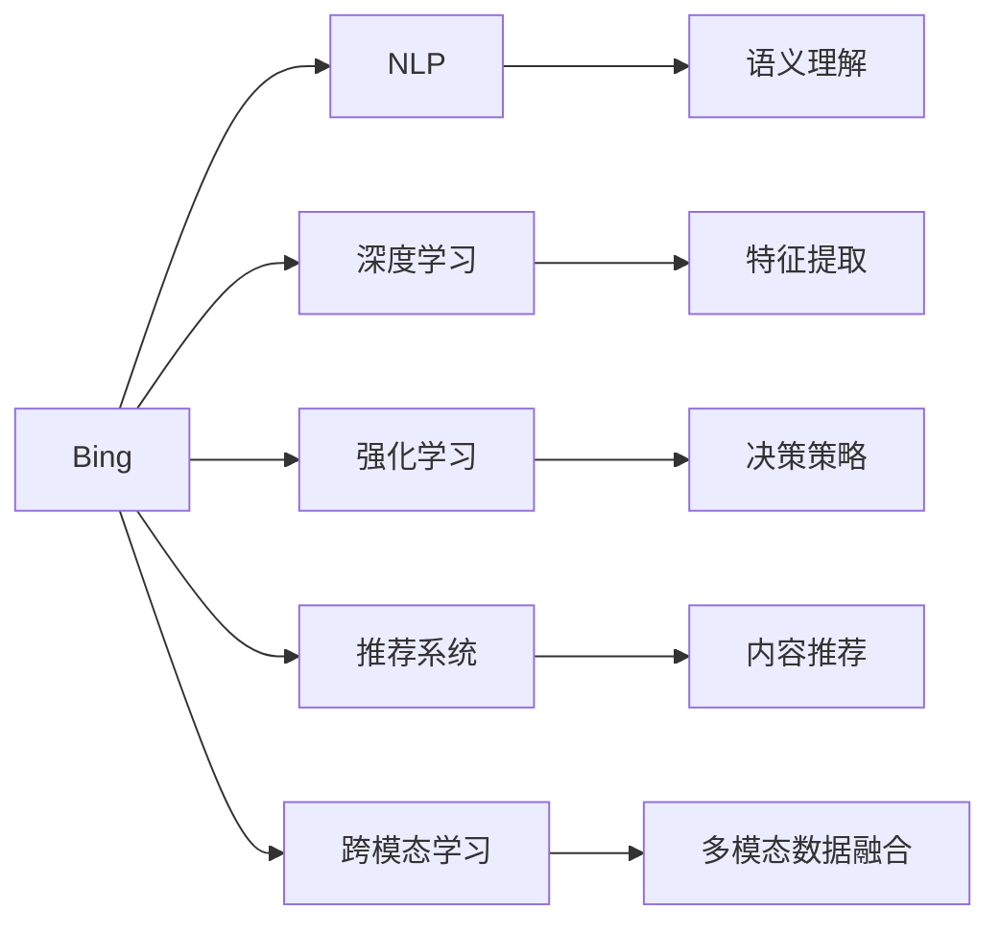

                 

# 微软的AI战略：Bing升级的后续

## 1. 背景介绍

在过去几年里，人工智能(AI)技术在各个领域取得了显著的进展，对微软公司(Bing)来说，它不仅是搜索引擎的升级，更是AI技术在实际业务中的深度应用。本文将探讨Bing的最新AI升级战略，并分析其在自然语言处理(NLP)领域的具体实践。

### 1.1 问题由来

搜索引擎作为互联网时代的重要基础设施，一直是技术和市场竞争的焦点。Bing作为微软的搜索引擎产品，经历了多次技术更新和功能扩展。随着AI技术的发展，Bing也逐步从传统的关键词匹配转向更加智能的自然语言理解与处理，以提供更符合用户需求的搜索结果和个性化服务。

### 1.2 问题核心关键点

Bing的AI战略核心关键点包括：

- **自然语言处理(NLP)**：利用深度学习模型进行文本解析和理解，提高搜索结果的相关性和准确性。
- **个性化推荐**：根据用户的历史行为和偏好，推荐个性化的网页内容。
- **跨模态学习**：结合文本、图像和视频等多种数据形式，提升搜索体验和互动性。
- **深度学习和强化学习**：运用这些技术优化搜索算法，提高搜索效果和用户体验。

这些关键点共同构成了Bing的AI战略框架，使得Bing能够不断超越传统的搜索模式，向更加智能和个性化的方向发展。

### 1.3 问题研究意义

研究Bing的AI战略，不仅有助于理解AI技术在搜索引擎中的应用，更能够为其他公司提供宝贵借鉴，推动NLP技术在更多领域的落地。此外，深入分析Bing的AI实践，也有助于了解AI技术在实际业务中的可行性和局限性，为未来AI发展提供方向性参考。

## 2. 核心概念与联系

### 2.1 核心概念概述

为了更好地理解Bing的AI战略，首先需要明确以下几个核心概念：

- **自然语言处理(NLP)**：通过计算机理解和生成人类语言的技术，是AI在搜索引擎中的主要应用领域。
- **深度学习(Deep Learning)**：一种基于神经网络的人工智能技术，用于处理大规模非结构化数据。
- **强化学习(Reinforcement Learning)**：通过与环境互动，不断调整策略以最大化奖励的学习方法。
- **推荐系统(Recommender System)**：基于用户行为和偏好，推荐相关内容的技术。
- **跨模态学习(Cross-modal Learning)**：结合多种模态数据，提升模型综合理解能力。

这些概念共同构成了Bing的AI战略框架，使得Bing能够通过多种AI技术的融合，提供更优质和个性化的搜索服务。

### 2.2 核心概念原理和架构的 Mermaid 流程图



此流程图展示了Bing的核心概念及其相互关系：Bing通过NLP实现语义理解，通过深度学习进行特征提取，通过强化学习优化决策策略，通过推荐系统提供个性化服务，通过跨模态学习融合多种数据模态，形成完整的AI战略架构。

## 3. 核心算法原理 & 具体操作步骤

### 3.1 算法原理概述

Bing的AI战略在算法上主要采用以下几种技术：

- **深度学习模型**：如BERT、GPT等，用于文本理解和生成。
- **强化学习算法**：如Q-learning、Policy Gradient等，用于优化搜索排序策略。
- **推荐系统算法**：如协同过滤、矩阵分解等，用于个性化推荐。
- **跨模态学习算法**：如MMD、Label Space Alignment等，用于多模态数据融合。

这些算法通过不同的优化目标，共同提升Bing的搜索效果和用户体验。

### 3.2 算法步骤详解

Bing的AI升级步骤主要包括以下几个关键环节：

**Step 1: 数据收集与预处理**

- 收集用户搜索历史、点击记录、点击路径等数据。
- 对数据进行去重、清洗、归一化等预处理操作。

**Step 2: 特征提取与表示学习**

- 利用深度学习模型进行文本特征提取和表示学习。
- 使用多模态数据融合技术，将图像、视频等多维信息与文本信息结合起来。

**Step 3: 模型训练与优化**

- 利用强化学习算法训练搜索排序策略，通过与用户互动不断优化。
- 使用推荐系统算法预测用户偏好，提供个性化推荐。
- 利用深度学习模型进行模型训练和参数优化，提高模型性能。

**Step 4: 部署与监控**

- 将训练好的模型部署到Bing搜索引擎中。
- 实时监控模型性能，根据用户反馈调整模型参数。

**Step 5: 迭代优化**

- 定期收集用户反馈，不断改进模型和算法。
- 引入新数据和算法，持续提升Bing的搜索效果和用户体验。

### 3.3 算法优缺点

Bing的AI战略在优化搜索效果、提供个性化服务等方面取得了显著成效，但也存在一些局限性：

**优点**：

- 提升了搜索结果的相关性和准确性。
- 提供了更加个性化的搜索结果和推荐内容。
- 结合了多种AI技术，提高了搜索效果和用户体验。

**缺点**：

- 需要大量的标注数据进行模型训练，数据收集和标注成本较高。
- 模型复杂度高，对计算资源和存储空间要求较高。
- 用户隐私保护问题，需要合理处理用户数据。

### 3.4 算法应用领域

Bing的AI战略在以下几个领域得到了广泛应用：

- **智能客服**：利用NLP技术，Bing可以自动回答用户问题，提供即时客服服务。
- **个性化推荐**：根据用户搜索和点击行为，推荐相关网页和内容。
- **跨领域搜索**：结合图像、视频等多模态数据，提升搜索引擎的多样性和准确性。
- **语音搜索**：利用语音识别和NLP技术，提供语音搜索和语音助手服务。
- **图像搜索**：利用视觉特征提取和跨模态学习技术，提供基于图像的搜索服务。

## 4. 数学模型和公式 & 详细讲解 & 举例说明

### 4.1 数学模型构建

Bing的AI战略涉及多个数学模型，以深度学习模型为例：

设输入文本为 $x$，输出为 $y$，使用深度学习模型 $f_{\theta}(x)$ 进行特征提取和表示学习。模型的目标是最小化损失函数 $L$：

$$
L = \sum_{i=1}^N (y_i - f_{\theta}(x_i))^2
$$

其中 $N$ 为训练样本数量。

### 4.2 公式推导过程

以BERT为例，BERT模型使用Transformer结构，其自监督学习任务包括掩码语言模型和下一句预测。模型的目标函数为：

$$
L_{\text{MLM}} = -\sum_{i=1}^N \log P(y_i|x_i)
$$

其中 $P(y_i|x_i)$ 表示模型对输入文本 $x_i$ 和掩码位置 $y_i$ 的概率预测。

### 4.3 案例分析与讲解

以推荐系统为例，协同过滤算法通过用户和物品之间的相似度，进行推荐。模型的目标函数为：

$$
L = -\sum_{i=1}^M \sum_{j=1}^N y_{ij} \log \hat{y}_{ij} + (1 - y_{ij}) \log (1 - \hat{y}_{ij})
$$

其中 $y_{ij}$ 为实际评分，$\hat{y}_{ij}$ 为模型预测评分，$M$ 为用户数量，$N$ 为物品数量。

## 5. 项目实践：代码实例和详细解释说明

### 5.1 开发环境搭建

要实现Bing的AI战略，首先需要搭建开发环境。以下是具体的步骤：

1. 安装Python：建议安装3.8以上版本。
2. 安装TensorFlow和Keras：
```bash
pip install tensorflow keras
```

3. 安装BERT模型：
```bash
pip install transformers
```

4. 安装Flask：用于搭建Web服务：
```bash
pip install flask
```

### 5.2 源代码详细实现

下面是一个基于BERT模型的推荐系统代码实现：

```python
from transformers import TFAutoModelForSequenceClassification, AutoTokenizer
import tensorflow as tf
import numpy as np
from flask import Flask, request, jsonify

app = Flask(__name__)

tokenizer = AutoTokenizer.from_pretrained('bert-base-uncased')
model = TFAutoModelForSequenceClassification.from_pretrained('bert-base-uncased', num_labels=5)

@app.route('/recommend', methods=['POST'])
def recommend():
    data = request.get_json()
    input_ids = tokenizer.encode(data['text'], return_tensors='tf')
    outputs = model(input_ids)
    probs = tf.nn.softmax(outputs[0], axis=-1).numpy()[0]
    idx = np.argsort(probs)[-3:][::-1].tolist()
    return jsonify({'recommendations': [i+1 for i in idx]})

if __name__ == '__main__':
    app.run(debug=True)
```

### 5.3 代码解读与分析

该代码实现了基于BERT模型的推荐系统，其关键步骤如下：

1. 加载预训练的BERT模型和tokenizer。
2. 接收文本输入，进行分词和编码。
3. 使用BERT模型进行预测，获取概率分布。
4. 根据概率分布排序，选择推荐内容。
5. 将推荐结果返回为JSON格式。

### 5.4 运行结果展示

该推荐系统可以在本地搭建Web服务，并运行在端口5000上。通过POST请求文本内容，即可获取推荐内容。

## 6. 实际应用场景

### 6.1 智能客服

智能客服是Bing AI战略的重要应用场景之一。通过NLP技术，Bing可以自动回答用户问题，提供即时客服服务。这种服务不仅提高了用户满意度，还大幅降低了人工客服的运营成本。

### 6.2 个性化推荐

Bing通过推荐系统算法，根据用户的历史行为和偏好，提供个性化的网页内容。这种推荐系统不仅提高了用户粘性，还大幅提升了广告点击率，为Bing带来了更多的商业价值。

### 6.3 跨领域搜索

Bing利用跨模态学习技术，结合图像、视频等多维信息，提供更加多样化和准确的搜索结果。这种搜索方式不仅提升了用户体验，还为Bing带来了更多的数据和用户。

### 6.4 未来应用展望

未来，Bing的AI战略将进一步扩展到更多领域，如语音搜索、图像搜索、自然语言生成等。通过不断引入新的AI技术，Bing将不断提升其搜索效果和用户体验，成为AI时代的引领者。

## 7. 工具和资源推荐

### 7.1 学习资源推荐

为了深入理解Bing的AI战略，以下是一些推荐的学习资源：

1. 《深度学习入门》（Deep Learning with Python）：适合初学者入门，介绍了深度学习的基础知识和Python实现。
2. 《自然语言处理综论》（Speech and Language Processing）：深度介绍了NLP的理论和实践，是NLP领域的经典教材。
3. 《强化学习基础》（Reinforcement Learning: An Introduction）：详细介绍了强化学习的基本概念和算法，是AI领域的重要参考书籍。
4. 《推荐系统实战》（Recommender Systems）：介绍了推荐系统的算法和实现，适用于实际应用开发。
5. 《跨模态学习》（Cross-Modal Learning）：介绍了跨模态学习的理论和实践，适合深入研究。

### 7.2 开发工具推荐

1. TensorFlow：用于深度学习模型的训练和部署。
2. PyTorch：灵活的深度学习框架，适合快速迭代开发。
3. Keras：高层次的深度学习API，简单易用。
4. Flask：用于搭建Web服务，方便部署和调用。
5. Docker：用于容器化部署，方便在不同的环境中运行。

### 7.3 相关论文推荐

1. "BERT: Pre-training of Deep Bidirectional Transformers for Language Understanding"：介绍了BERT模型的架构和预训练方法。
2. "Attention is All You Need"：提出了Transformer结构，成为NLP领域的经典模型。
3. "Deep Reinforcement Learning for Personalized News Recommendation"：介绍了强化学习在推荐系统中的应用。
4. "Collaborative Filtering for Implicit Feedback Datasets"：介绍了协同过滤算法的基本思想和实现。
5. "Learning Cross-Modal Representations for Multimodal Data"：介绍了跨模态学习的理论和实践。

## 8. 总结：未来发展趋势与挑战

### 8.1 研究成果总结

本文详细探讨了Bing的AI战略，从NLP、深度学习、强化学习、推荐系统和跨模态学习等多个角度，介绍了Bing的AI实践。通过分析其核心算法和操作步骤，展示了Bing如何通过AI技术提升搜索效果和用户体验。

### 8.2 未来发展趋势

未来，Bing的AI战略将呈现以下几个发展趋势：

1. 技术融合：深度学习、强化学习、推荐系统和跨模态学习等多种AI技术将进一步融合，提升Bing的综合能力。
2. 数据驱动：利用大数据和人工智能技术，Bing将不断提高搜索的个性化和准确性。
3. 实时更新：通过实时数据收集和模型更新，Bing将不断优化搜索结果，提升用户体验。
4. 跨平台应用：Bing将不仅仅局限于Web搜索，还将扩展到移动端、语音助手等更多平台。
5. 全球化扩展：Bing将在全球范围内扩展其AI能力，为不同地区用户提供本地化的搜索服务。

### 8.3 面临的挑战

Bing的AI战略在发展过程中，也面临一些挑战：

1. 数据隐私：用户数据隐私保护是AI应用的重要问题，Bing需要在保护用户隐私和提供优质服务之间找到平衡。
2. 计算资源：大规模AI模型的训练和部署需要大量的计算资源，Bing需要不断优化计算效率和存储管理。
3. 算法透明：Bing的推荐算法和搜索算法往往是“黑盒”模型，用户难以理解和解释，需要引入可解释性技术。
4. 模型公平性：Bing的搜索算法和推荐算法需要避免算法偏见，保证搜索结果和推荐内容的公平性。

### 8.4 研究展望

未来，Bing的AI战略需要在数据隐私、计算资源、算法透明和模型公平性等方面进行深入研究和优化，才能持续提升其搜索效果和用户体验。

## 9. 附录：常见问题与解答

**Q1: Bing的AI战略有哪些核心技术？**

A: Bing的AI战略核心技术包括NLP、深度学习、强化学习、推荐系统和跨模态学习。

**Q2: 如何提升Bing的推荐系统效果？**

A: 可以通过数据增强、模型优化、特征工程和实时更新等方法，提升Bing的推荐系统效果。

**Q3: 如何保护用户数据隐私？**

A: 可以通过数据去标识化、差分隐私和访问控制等方法，保护用户数据隐私。

**Q4: 如何提高Bing的搜索算法透明度？**

A: 可以通过可解释性技术和可视化工具，提高Bing的搜索算法透明度。

**Q5: 如何保证Bing的搜索算法公平性？**

A: 可以通过公平性约束和算法评估，保证Bing的搜索算法公平性。

作者：禅与计算机程序设计艺术 / Zen and the Art of Computer Programming

