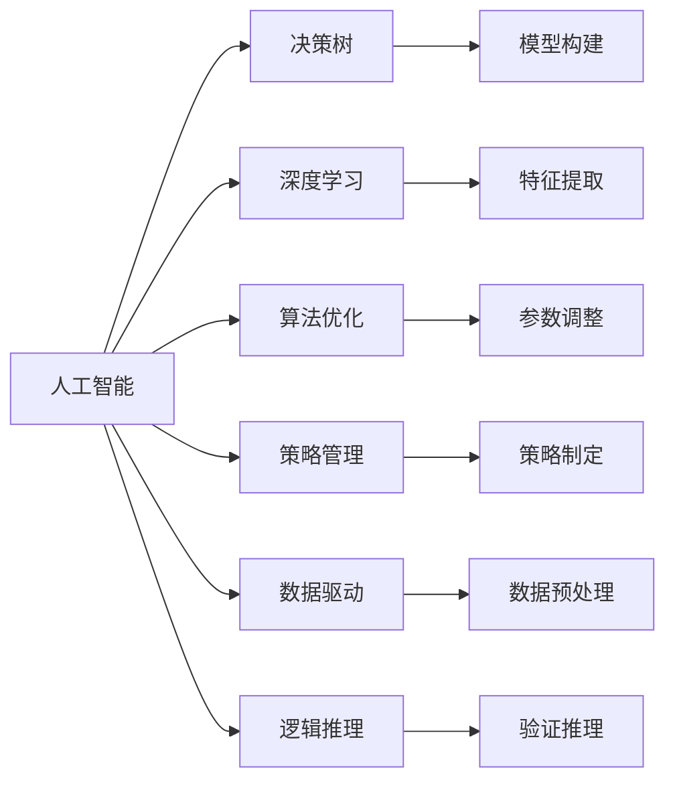

                 

# 思维体系:决策高度的基石

> 关键词：人工智能(AI), 决策树(Decision Tree), 深度学习(Deep Learning), 算法优化(Algorithm Optimization), 策略管理(Strategy Management), 数据驱动(Data-Driven), 逻辑推理(Logical Reasoning)

## 1. 背景介绍

在现代信息社会的快速迭代中，决策能力成为了个人和组织竞争力的核心要素。人工智能(AI)技术的发展，不仅极大地提升了数据分析和处理的速度和质量，也为决策提供了新的工具和方法。本文旨在探讨如何在决策过程中高效、准确地应用AI技术，构建思维体系，以实现决策的高度化。

### 1.1 问题由来

随着大数据和AI技术的普及，决策的复杂度和难度显著提升。传统的数据分析和决策方法逐渐被新型的AI决策模型取代。然而，这些模型的应用也需要大量专业的知识和技术支持，普通用户和组织难以掌握。如何构建易于理解和使用的AI决策体系，成为当前研究和应用的一个热点。

### 1.2 问题核心关键点

本文关注的核心问题是：如何将AI技术高效、准确地应用于决策过程，构建决策支持系统，并为用户提供清晰、易于理解和操作的决策指导。

### 1.3 问题研究意义

构建易于理解和操作的AI决策体系，将极大提升决策的效率和准确性，帮助企业和个人在复杂的决策环境中做出更优选择。这对于提升组织竞争力，优化资源配置，提高用户体验，具有重要意义。

## 2. 核心概念与联系

### 2.1 核心概念概述

本文涉及的核心概念包括：

- **人工智能(AI)**：通过计算机算法和模型，使机器具备智能推理、自主学习等能力，以辅助或替代人类进行决策。

- **决策树(Decision Tree)**：一种基于树形结构的分类和回归模型，通过对数据特征的分割，构建决策路径，实现预测和分类。

- **深度学习(Deep Learning)**：一类模拟人脑神经网络的机器学习技术，通过多层非线性变换，实现复杂数据表示和模式识别。

- **算法优化(Algorithm Optimization)**：通过对模型和算法的优化，提升决策模型的准确性和效率，如参数调整、结构优化等。

- **策略管理(Strategy Management)**：在AI决策中，制定和实施有效的策略，以实现目标最优或策略平衡。

- **数据驱动(Data-Driven)**：依赖大量数据进行模型训练和验证，以提升决策模型的泛化能力和鲁棒性。

- **逻辑推理(Logical Reasoning)**：在决策过程中，通过逻辑推理和验证，确保模型输出符合预期的合理性。

这些核心概念相互联系，共同构成了现代AI决策的基础框架。通过理解这些概念，我们可以更好地把握AI决策的本质和方法。

### 2.2 核心概念原理和架构的 Mermaid 流程图



### 2.3 核心概念的逻辑联系

以上各个概念之间的逻辑联系如图示，其中：

- 人工智能(AI)是决策树(Decision Tree)、深度学习(Deep Learning)、算法优化(Algorithm Optimization)、策略管理(Strategy Management)、数据驱动(Data-Driven)和逻辑推理(Logical Reasoning)的基础。
- 决策树(Decision Tree)和深度学习(Deep Learning)是AI中的重要模型，用于处理和预测数据。
- 算法优化(Algorithm Optimization)和策略管理(Strategy Management)是提升模型性能和效果的关键手段。
- 数据驱动(Data-Driven)和逻辑推理(Logical Reasoning)是确保模型鲁棒性和合理性的重要保障。

## 3. 核心算法原理 & 具体操作步骤
### 3.1 算法原理概述

AI决策的核心算法原理主要包括决策树(Decision Tree)、深度学习(Deep Learning)和逻辑推理(Logical Reasoning)。

- **决策树(Decision Tree)**：通过对数据特征的递归分割，构建树形结构，实现分类和回归。决策树的构建过程包括特征选择、树形生长和剪枝等步骤。

- **深度学习(Deep Learning)**：通过多层神经网络结构，实现数据的多层非线性变换，捕捉数据中的复杂模式。常见的深度学习模型包括卷积神经网络(CNN)、循环神经网络(RNN)、变压器(Transformer)等。

- **逻辑推理(Logical Reasoning)**：在决策过程中，通过逻辑推理和验证，确保模型输出符合预期的合理性。常见的逻辑推理方法包括因果推理、贝叶斯推理、逻辑回归等。

### 3.2 算法步骤详解

以下详细介绍AI决策的详细步骤：

**Step 1: 数据收集与预处理**
- 收集与决策目标相关的数据，如用户行为、市场数据、财务报表等。
- 对数据进行清洗、去重、归一化等预处理操作。

**Step 2: 特征提取与选择**
- 利用特征工程方法，提取与决策相关的特征，如用户画像、市场趋势等。
- 通过特征选择算法，去除冗余特征，保留对决策有重要影响的特征。

**Step 3: 模型训练与优化**
- 利用决策树(Decision Tree)或深度学习(Deep Learning)模型进行训练。
- 通过交叉验证、参数调整等手段，优化模型性能，避免过拟合。

**Step 4: 策略制定与执行**
- 根据决策目标，制定和实施决策策略，如市场进入策略、风险管理策略等。
- 将模型输出作为策略执行的依据，实现自动化决策。

**Step 5: 结果验证与反馈**
- 对决策结果进行验证，确保符合预期。
- 根据验证结果，反馈调整模型和策略，不断优化决策过程。

### 3.3 算法优缺点

**优点**
- 自动化决策：AI模型能够处理大量数据，快速进行分析和决策，提升决策效率。
- 精度高：AI模型通过大量数据训练，能够捕捉复杂模式，提升决策精度。
- 可扩展性：AI决策模型可以轻松扩展到多个决策场景，提升决策灵活性。

**缺点**
- 数据依赖：AI决策模型依赖大量数据进行训练，数据不足或质量不高将影响模型性能。
- 黑盒问题：AI模型决策过程复杂，难以解释，缺乏透明度。
- 算法复杂：AI决策模型需要复杂的算法和模型，对技术要求高。

### 3.4 算法应用领域

AI决策技术在多个领域中得到了广泛应用，包括但不限于：

- **金融行业**：通过AI决策模型进行投资组合优化、风险评估、信用评分等。
- **医疗行业**：利用AI模型进行疾病诊断、治疗方案推荐、健康管理等。
- **零售行业**：通过AI模型进行销售预测、库存管理、顾客行为分析等。
- **制造业**：通过AI模型进行生产调度、设备维护、质量控制等。
- **物流行业**：利用AI模型进行路线优化、配送规划、需求预测等。

## 4. 数学模型和公式 & 详细讲解 & 举例说明

### 4.1 数学模型构建

以下以决策树(Decision Tree)模型为例，介绍其数学模型构建过程：

决策树的构建过程可以概括为以下三个步骤：

1. **选择最佳特征**：通过信息增益、基尼指数等指标，选择最佳特征进行分割。

2. **生成子节点**：根据最佳特征，生成新的子节点，并继续递归分割。

3. **剪枝优化**：对生成的树进行剪枝，避免过拟合。

### 4.2 公式推导过程

决策树模型的信息增益公式如下：

$$
Gain(D, A) = \sum_{i=1}^{n} \frac{|D_i|}{|D|} \cdot Ent(D_i)
$$

其中，$D$ 为数据集，$A$ 为特征，$n$ 为数据集中的样本数，$|D_i|$ 为特征 $A$ 取值为 $i$ 的样本数，$|D|$ 为数据集总样本数，$Ent(D_i)$ 为特征 $A$ 取值为 $i$ 的样本的熵。

### 4.3 案例分析与讲解

以金融行业中的信用评分为例，分析决策树模型的应用。假设我们有一个包含客户基本信息、信用历史、财务状况等特征的数据集，目的是根据这些特征预测客户的信用评分。

1. **数据收集与预处理**：收集客户基本信息、信用历史、财务状况等数据，并进行清洗和归一化处理。

2. **特征选择与提取**：选择对信用评分影响较大的特征，如收入、信用历史等。

3. **模型训练与优化**：利用决策树模型进行训练，通过交叉验证等手段优化模型性能。

4. **策略制定与执行**：根据模型的输出结果，制定信用评分策略，如高风险客户拒绝、低风险客户放贷等。

5. **结果验证与反馈**：对模型的输出结果进行验证，根据验证结果调整模型和策略。

## 5. 项目实践：代码实例和详细解释说明

### 5.1 开发环境搭建

以下是在Python中进行决策树模型训练的开发环境搭建步骤：

1. 安装Python环境：使用Anaconda或Miniconda，搭建Python 3.7或以上版本环境。

2. 安装相关库：
```bash
pip install numpy pandas sklearn matplotlib seaborn
```

3. 准备数据集：
- 导入数据集：`import pandas as pd`
- 数据清洗：`data_cleaned = data.dropna().drop_duplicates()`
- 数据归一化：`from sklearn.preprocessing import StandardScaler`
```python
scaler = StandardScaler()
scaled_data = scaler.fit_transform(data_cleaned)
```

4. 划分数据集：
```python
from sklearn.model_selection import train_test_split
X_train, X_test, y_train, y_test = train_test_split(X, y, test_size=0.3, random_state=42)
```

### 5.2 源代码详细实现

以下是利用决策树模型进行信用评分预测的Python代码实现：

```python
from sklearn.tree import DecisionTreeClassifier
from sklearn.metrics import accuracy_score

# 数据准备
X = ...
y = ...

# 模型训练
clf = DecisionTreeClassifier()
clf.fit(X_train, y_train)

# 模型预测
y_pred = clf.predict(X_test)

# 模型评估
print("Accuracy:", accuracy_score(y_test, y_pred))
```

### 5.3 代码解读与分析

代码中的关键步骤包括：

- **数据准备**：导入数据集并进行清洗和归一化处理。
- **模型训练**：创建决策树分类器并进行训练。
- **模型预测**：使用训练好的模型进行预测。
- **模型评估**：计算模型预测准确率。

通过这些步骤，我们成功实现了决策树模型的训练和应用，为后续的业务决策提供了有力的支持。

### 5.4 运行结果展示

运行上述代码后，输出结果为模型的预测准确率。具体数值会根据数据集和模型参数的不同而有所变化。

## 6. 实际应用场景

### 6.1 金融行业

在金融行业，决策树和深度学习模型被广泛应用于信用评分、投资组合优化、风险管理等领域。例如，通过决策树模型分析客户的信用历史、财务状况等特征，可以预测客户的信用评分，为贷款决策提供依据。

### 6.2 医疗行业

在医疗行业，AI决策模型被用于疾病诊断、治疗方案推荐、健康管理等。例如，通过深度学习模型分析患者的医疗记录和基因数据，可以预测患者的疾病风险，为医生提供个性化的治疗方案。

### 6.3 零售行业

在零售行业，AI决策模型被用于销售预测、库存管理、顾客行为分析等。例如，通过决策树模型分析顾客的购买历史和行为数据，可以预测顾客的购买意向，为商家制定精准的营销策略。

### 6.4 未来应用展望

未来，AI决策技术将在更多领域得到应用，如制造业、物流行业、智慧城市等。随着算力的提升和数据的积累，AI决策模型的性能将不断提升，应用场景将更加广泛。

## 7. 工具和资源推荐

### 7.1 学习资源推荐

为了帮助读者系统掌握AI决策技术，以下是一些推荐的资源：

- **《Python数据科学手册》**：深入浅出地介绍了Python在数据科学中的应用，包括数据预处理、模型训练等。

- **《机器学习实战》**：通过实际案例，介绍了机器学习的基本概念和应用方法，适合初学者学习。

- **《深度学习》**：介绍深度学习的原理、算法和应用，适合有一定数学基础的读者。

- **《动手学深度学习》**：由深度学习领域专家编写，通过动手实验，介绍了深度学习的基础知识和实践技巧。

### 7.2 开发工具推荐

以下是一些常用的AI决策开发工具：

- **Python**：简单易学，生态丰富，适用于数据科学和机器学习领域。

- **TensorFlow**：谷歌开发的深度学习框架，支持GPU加速，适合大规模深度学习模型的开发。

- **Keras**：基于TensorFlow的高级API，支持快速构建和训练深度学习模型。

- **Scikit-learn**：简单易用的机器学习库，提供丰富的数据预处理和模型训练工具。

### 7.3 相关论文推荐

以下是一些经典的AI决策论文，推荐阅读：

- **《决策树与随机森林》**：介绍决策树模型的基本原理和应用方法。

- **《深度学习》**：介绍深度学习的原理和应用，适合深入理解深度学习模型。

- **《基于因果推理的决策模型》**：通过因果推理提升决策模型的可信度和鲁棒性。

## 8. 总结：未来发展趋势与挑战

### 8.1 研究成果总结

本文系统介绍了AI决策技术的基本原理和应用方法，包括决策树、深度学习、逻辑推理等核心概念，并提供了具体的代码实例和案例分析。通过深入讲解，读者可以更好地理解AI决策的实现过程和应用场景，为未来的研究和实践打下坚实基础。

### 8.2 未来发展趋势

未来，AI决策技术将呈现以下几个发展趋势：

1. **自动化决策**：随着算法和技术的进步，AI决策模型的自动化水平将进一步提升，决策效率和精度将显著提高。

2. **跨领域应用**：AI决策模型将在更多领域得到应用，如医疗、金融、制造业等，为各行业的决策提供有力支持。

3. **智能推荐系统**：利用AI决策模型，开发智能推荐系统，为用户提供个性化的产品和服务。

4. **因果推理**：引入因果推理方法，提升决策模型的可信度和鲁棒性。

5. **数据驱动**：利用大数据和人工智能技术，实现数据驱动的决策过程。

### 8.3 面临的挑战

尽管AI决策技术取得了一定的进展，但仍面临一些挑战：

1. **数据隐私和安全**：AI决策模型依赖大量数据，如何保护用户隐私和数据安全是一大挑战。

2. **算法透明度和可解释性**：AI决策模型的黑盒性质，导致其缺乏透明度和可解释性，难以满足监管要求。

3. **算法偏见**：AI决策模型容易学习到数据中的偏见和歧视，导致决策不公。

4. **模型鲁棒性**：AI决策模型在面对复杂和未知数据时，鲁棒性不足，容易产生错误决策。

5. **计算资源需求**：AI决策模型的训练和推理需要大量的计算资源，成本较高。

### 8.4 研究展望

未来，AI决策技术的研究方向包括：

1. **数据隐私保护**：开发隐私保护技术，确保数据使用过程中的隐私安全。

2. **模型可解释性**：通过技术手段提升AI决策模型的可解释性，增强模型的透明度和可信度。

3. **算法公平性**：研究算法公平性问题，减少模型的偏见和歧视，提升决策的公正性。

4. **模型鲁棒性**：开发鲁棒性更强、适应性更广的AI决策模型，提升模型的泛化能力和抗干扰能力。

5. **跨模态融合**：研究跨模态融合方法，将不同模态的信息整合到AI决策模型中，提升决策的全面性和准确性。

## 9. 附录：常见问题与解答

### Q1: AI决策模型是否适用于所有决策场景？

A: AI决策模型适用于多种决策场景，但其效果和适用性取决于数据的丰富度和模型的复杂度。对于数据量较少或数据质量较差的场景，AI决策模型的表现可能不如传统方法。

### Q2: 如何评估AI决策模型的效果？

A: 评估AI决策模型的效果主要通过以下指标：
- 准确率：预测正确的样本数与总样本数之比。
- 召回率：预测正确的正样本数与实际正样本数之比。
- F1分数：综合考虑准确率和召回率的指标。

### Q3: 在AI决策过程中，如何处理数据偏见问题？

A: 处理数据偏见问题主要通过以下方法：
- 数据预处理：通过数据清洗和归一化，去除异常数据和噪声。
- 特征选择：选择对决策影响较大的特征，避免选择含有偏见的特征。
- 模型优化：通过算法优化，减少模型的偏见和歧视。

### Q4: 如何提升AI决策模型的鲁棒性？

A: 提升AI决策模型的鲁棒性主要通过以下方法：
- 数据增强：通过生成对抗样本，提升模型的鲁棒性。
- 正则化：通过L1、L2正则化，减少模型的过拟合。
- 交叉验证：通过交叉验证，评估模型的泛化能力和鲁棒性。

### Q5: 在AI决策中，如何平衡模型复杂度和效果？

A: 在AI决策中，需要平衡模型复杂度和效果，主要通过以下方法：
- 模型选择：根据数据特点选择合适的模型，避免选择过于复杂的模型。
- 参数调整：通过调整模型的参数，优化模型性能，提升效果。
- 交叉验证：通过交叉验证，评估模型的效果，避免过拟合。

通过本文的系统梳理，可以看到，AI决策技术正在成为决策支持系统的重要工具，为各行业决策提供有力支持。未来，随着算力提升和数据积累，AI决策技术将不断进步，在更多领域发挥重要作用。相信通过持续的研究和优化，AI决策技术将为人类社会的决策带来革命性变化。

---

作者：禅与计算机程序设计艺术 / Zen and the Art of Computer Programming

