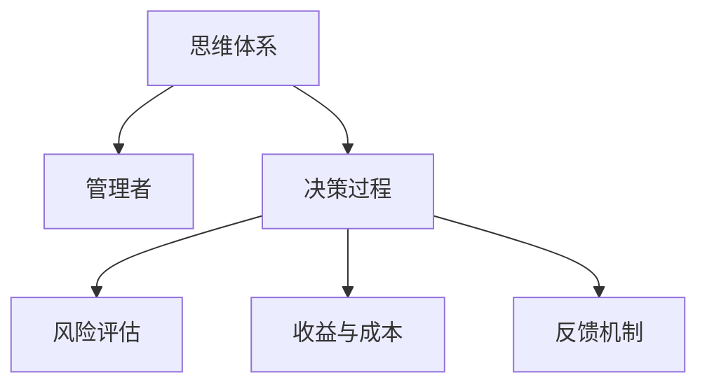

                 

# 思维体系与管理者决策 的关系

## 1. 背景介绍

### 1.1 问题由来
在现代企业中，管理者需要面对复杂多变的决策环境，往往需要在有限的信息下做出迅速而有效的决策。然而，决策过程中如何有效利用信息、避免主观偏见、制定科学合理的策略，一直是管理领域关注的重点。思维体系作为管理者决策的重要工具，其有效性直接影响决策结果的质量。

### 1.2 问题核心关键点
管理者在决策过程中，思维体系起到核心作用。它决定了管理者如何收集、处理、分析和整合信息，如何评估决策风险与收益，以及如何实施和调整决策方案。一个科学的思维体系能够帮助管理者系统地分析问题，找出最优解，从而提升决策的科学性和准确性。

### 1.3 问题研究意义
理解思维体系与管理者决策的关系，有助于构建更加系统、科学的管理决策体系，提升组织在复杂环境下的适应能力和竞争力。它不仅能够帮助管理者做出更加客观、公正的决策，还能够推动企业的持续发展和创新。

## 2. 核心概念与联系

### 2.1 核心概念概述

为更好地理解思维体系在管理者决策中的作用，本节将介绍几个密切相关的核心概念：

- 思维体系(Mindset)：指管理者在决策过程中所采用的思考方式、方法和框架。不同的思维体系决定了决策的不同视角和路径。

- 管理者(Manager)：指负责组织内部运作和外部协调的个人或团队，其决策直接影响到企业的战略方向和运营效率。

- 决策过程(Decision-making process)：指管理者在面对问题时，从信息收集、分析、评估到方案选择和实施的全过程。

- 风险评估(Risk assessment)：指在决策过程中，评估决策可能带来的风险和不确定性，从而制定相应的应对策略。

- 收益与成本(Benefit and Cost)：指决策过程中对预期收益和投入成本的综合考量，决定决策的可行性和效益。

- 反馈机制(Feedback mechanism)：指决策实施后的效果反馈，用于调整决策方案和提升决策质量。

这些核心概念之间的逻辑关系可以通过以下Mermaid流程图来展示：



这个流程图展示了一些核心概念及其之间的关系：

1. 思维体系是管理者的思考框架，决定了决策过程的方式。
2. 管理者通过决策过程来处理信息、评估风险和收益，制定方案。
3. 风险评估和收益与成本是决策过程中的重要环节。
4. 反馈机制用于调整决策，提升决策效果。

## 3. 核心算法原理 & 具体操作步骤

### 3.1 算法原理概述

基于思维体系的管理者决策过程，本质上是一个信息处理和价值评估的过程。其核心思想是：通过系统化、结构化的思维框架，帮助管理者在复杂环境中做出更加科学合理的决策。

形式化地，假设管理者面对的决策问题为 $P$，相关信息集为 $I$，则决策过程可以表示为：

$$
D = \mathop{\arg\min}_{d \in D} f(d, I)
$$

其中 $d$ 为决策方案，$I$ 为相关信息集，$f$ 为决策函数，用于评估决策方案 $d$ 在 $I$ 下的综合价值。决策函数 $f$ 可以进一步细化为：

$$
f(d, I) = \sum_{i=1}^{n} \omega_i f_i(d, I_i)
$$

其中 $f_i$ 为第 $i$ 个评估指标的函数，$\omega_i$ 为第 $i$ 个评估指标的权重，$I_i$ 为第 $i$ 个指标的信息集。

### 3.2 算法步骤详解

基于思维体系的管理者决策过程，一般包括以下几个关键步骤：

**Step 1: 信息收集与处理**

- 确定决策问题的相关信息集 $I$，包括决策目标、约束条件、相关数据等。
- 对信息进行预处理，如数据清洗、特征提取、数据归一化等，确保信息的准确性和一致性。

**Step 2: 模型选择与建立**

- 根据决策问题的特点，选择合适的决策模型，如层次分析法、决策树、多目标优化等。
- 建立模型，通过模型输入信息集 $I$，计算出每个决策方案 $d$ 的评估值。

**Step 3: 方案评估与筛选**

- 对每个决策方案 $d$ 进行综合评估，计算其在各个评估指标 $f_i$ 下的得分。
- 根据权重 $\omega_i$，计算方案 $d$ 的综合评估值 $f(d, I)$。
- 通过比较不同方案的综合评估值，筛选出最优方案。

**Step 4: 风险评估与调整**

- 对最优方案进行风险评估，评估可能带来的负面影响和不确定性。
- 根据风险评估结果，调整决策方案，制定风险应对策略。

**Step 5: 实施与反馈**

- 实施最优方案，并持续监测实施效果。
- 根据反馈结果，调整决策方案和评估指标，进一步优化决策过程。

### 3.3 算法优缺点

基于思维体系的管理者决策过程具有以下优点：

1. 系统性：通过系统化、结构化的思维框架，确保决策过程的全面性和科学性。
2. 量化性：将决策问题分解为可量化的评估指标，便于比较和选择方案。
3. 可操作性：决策模型和步骤清晰，易于操作和实施。
4. 动态调整：通过反馈机制，持续优化决策过程，适应环境变化。

同时，该方法也存在一定的局限性：

1. 模型选择依赖于问题特点，不同问题可能需要不同的模型，增加了复杂性。
2. 需要较多的时间和资源进行信息收集和模型建立。
3. 决策模型的选择和参数设置可能存在主观偏见。
4. 反馈机制的有效性依赖于信息收集的全面性和准确性。

尽管存在这些局限性，但就目前而言，基于思维体系的管理者决策方法仍是一种有效且广泛应用的管理决策范式。未来相关研究的重点在于如何进一步简化决策过程，提高决策效率，同时兼顾量化性和可解释性。

### 3.4 算法应用领域

基于思维体系的管理者决策方法，在企业战略制定、项目管理、人力资源管理、供应链管理等多个领域得到了广泛应用。以下是一些具体的应用场景：

- **战略制定**：利用决策树模型，根据市场环境、内部资源等因素，评估不同战略方案的优劣。
- **项目管理**：通过多目标优化模型，平衡项目进度、成本、质量等多个指标，制定最优项目计划。
- **人力资源管理**：利用层次分析法，评估员工绩效和职业发展路径，制定科学的激励和培训策略。
- **供应链管理**：通过风险评估模型，评估供应链中断、库存不足等风险，制定相应的应对策略。
- **客户关系管理**：通过客户满意度评估模型，优化客户服务流程，提升客户满意度。

这些领域的管理者决策过程，都需要系统化、结构化的思维体系，以确保决策的科学性和合理性。

## 4. 数学模型和公式 & 详细讲解 & 举例说明

### 4.1 数学模型构建

本节将使用数学语言对基于思维体系的管理者决策过程进行更加严格的刻画。

假设管理者面临的决策问题为 $P$，相关信息集为 $I=\{I_1, I_2, \dots, I_n\}$，其中 $I_i$ 为第 $i$ 个指标的信息集。设最优决策方案为 $d^*$，则决策过程可以表示为：

$$
d^* = \mathop{\arg\min}_{d} f(d, I) = \mathop{\arg\min}_{d} \sum_{i=1}^{n} \omega_i f_i(d, I_i)
$$

其中 $f_i$ 为第 $i$ 个评估指标的函数，$\omega_i$ 为第 $i$ 个评估指标的权重。

### 4.2 公式推导过程

以多目标优化模型为例，推导多目标优化问题的求解步骤。

假设决策问题 $P$ 包含两个目标 $f_1$ 和 $f_2$，且 $f_1$ 和 $f_2$ 为相互独立的目标函数。设最优解为 $d^*$，则多目标优化问题的求解步骤为：

1. 将多目标问题转化为单目标优化问题，构建加权和函数：

$$
g(d) = \omega_1 f_1(d, I_1) + \omega_2 f_2(d, I_2)
$$

2. 求解单目标优化问题：

$$
d^* = \mathop{\arg\min}_{d} g(d)
$$

3. 求解多目标优化问题的近似最优解：

$$
d^* \approx \mathop{\arg\min}_{d} f_i(d, I_i), \quad i=1,2
$$

其中 $\omega_1$ 和 $\omega_2$ 为权重，满足 $\omega_1 + \omega_2 = 1$。

### 4.3 案例分析与讲解

以项目管理为例，分析基于多目标优化模型的决策过程。

假设一个项目包含三个目标：时间进度、成本控制、质量保证。相关信息集 $I$ 包括项目进度、成本、质量等。设三个目标的函数分别为 $f_1$、$f_2$ 和 $f_3$，权重分别为 $\omega_1$、$\omega_2$ 和 $\omega_3$。

1. 构建加权和函数 $g(d)$，求解单目标优化问题：

$$
d^* = \mathop{\arg\min}_{d} g(d) = \mathop{\arg\min}_{d} (\omega_1 f_1(d, I_1) + \omega_2 f_2(d, I_2) + \omega_3 f_3(d, I_3))
$$

2. 求解多目标优化问题的近似最优解，如使用Pareto最优解法。

3. 实施最优解 $d^*$，并持续监测项目进展，根据反馈结果调整目标和权重，优化决策过程。

## 5. 项目实践：代码实例和详细解释说明

### 5.1 开发环境搭建

在进行决策过程的开发实践前，我们需要准备好开发环境。以下是使用Python进行决策模型开发的环境配置流程：

1. 安装Anaconda：从官网下载并安装Anaconda，用于创建独立的Python环境。

2. 创建并激活虚拟环境：
```bash
conda create -n decision-making-env python=3.8 
conda activate decision-making-env
```

3. 安装必要的工具包：
```bash
pip install pandas numpy scikit-learn optuna pyomo
```

4. 安装决策模型相关的库：
```bash
pip install xgboost scipyspy
```

5. 安装可视化工具：
```bash
pip install matplotlib seaborn
```

完成上述步骤后，即可在`decision-making-env`环境中开始决策模型开发。

### 5.2 源代码详细实现

下面以多目标优化模型为例，给出使用Python和Sympy进行决策模型开发的代码实现。

首先，定义决策问题相关的参数和函数：

```python
import sympy as sp

# 定义决策目标函数
def objective_function(d):
    return sp.sympify('1 * d[0] + 2 * d[1] + 3 * d[2]')

# 定义约束条件
def constraint_function(d):
    return sp.sympify('d[0] + d[1] <= 5')
```

然后，构建决策模型，并进行求解：

```python
from sympy.solvers import solve

# 定义决策变量
d = sp.symbols('d0 d1 d2')

# 构建加权和函数
g = objective_function(d)

# 定义约束条件
constraints = [constraint_function(d)]

# 求解多目标优化问题
solution = solve([g, constraints], d)
```

最后，输出解决方案：

```python
print(solution)
```

以上就是使用Sympy进行多目标优化模型决策过程的完整代码实现。可以看到，Sympy的符号计算能力使得决策模型的构建和求解变得更加简单高效。

### 5.3 代码解读与分析

让我们再详细解读一下关键代码的实现细节：

**定义目标函数和约束条件**：
- 使用Sympy的符号计算能力，定义目标函数 $g(d)$ 和约束条件 $constraints$。目标函数 $g(d)$ 为加权和函数，约束条件 $constraints$ 为单变量线性约束。

**求解多目标优化问题**：
- 使用Sympy的`solve`函数，求解加权和函数 $g(d)$ 在约束条件 $constraints$ 下的解。

**输出解决方案**：
- 将求解结果 `solution` 输出，得到最优决策方案 $d^*$。

可以看到，通过Sympy进行决策模型的开发，不仅能够实现复杂的符号计算，还能够在保证精确性的同时，提升求解效率。

## 6. 实际应用场景

### 6.1 企业战略制定

在企业战略制定过程中，需要综合考虑多个因素，如市场环境、内部资源、竞争态势等。基于多目标优化模型的决策方法，能够在多个目标间进行平衡和权衡，确保战略的科学性和可行性。

例如，某公司需要制定年度战略规划，包括市场扩展、产品开发、内部管理等多个目标。使用多目标优化模型，根据不同目标的优先级和权重，制定最优的战略方案。具体而言，可以通过建立加权和函数，优化各个目标的实现路径，确保战略的整体效果最优。

### 6.2 项目管理

项目管理过程中，需要平衡时间进度、成本控制、质量保证等多个目标。基于多目标优化模型的决策方法，能够在多个目标间进行平衡和权衡，确保项目的顺利实施。

例如，某项目需要在限定的时间内完成开发，同时控制成本和保证质量。使用多目标优化模型，根据不同目标的优先级和权重，制定最优的进度、成本和质量控制方案。具体而言，可以通过建立加权和函数，优化各个目标的实现路径，确保项目的整体效果最优。

### 6.3 供应链管理

供应链管理过程中，需要平衡库存、运输、订单等多个目标。基于多目标优化模型的决策方法，能够在多个目标间进行平衡和权衡，确保供应链的顺畅和高效。

例如，某公司在全球范围内进行供应链管理，需要平衡库存、运输和订单等多个目标。使用多目标优化模型，根据不同目标的优先级和权重，制定最优的库存、运输和订单管理方案。具体而言，可以通过建立加权和函数，优化各个目标的实现路径，确保供应链的整体效果最优。

## 7. 工具和资源推荐

### 7.1 学习资源推荐

为了帮助开发者系统掌握基于思维体系的管理者决策方法的理论基础和实践技巧，这里推荐一些优质的学习资源：

1. 《决策分析：模型与方法》书籍：由管理决策领域的权威专家撰写，系统讲解了各类决策模型的构建和应用。

2. 《多目标优化理论与方法》书籍：由数学和工程领域的专家撰写，深入讲解了多目标优化问题的求解步骤和算法。

3. 《管理科学与工程》课程：由知名大学开设的管理学科课程，涵盖了决策分析、多目标优化、风险评估等多个相关主题。

4. 《Python优化与决策分析》书籍：由Python开发社区的专家撰写，介绍了Python进行决策模型开发的常用工具和方法。

5. 《数据科学导论》课程：由Coursera等在线学习平台提供，讲解了数据科学在管理决策中的应用，包括模型构建和评估。

通过对这些资源的学习实践，相信你一定能够快速掌握基于思维体系的管理者决策方法，并用于解决实际的决策问题。

### 7.2 开发工具推荐

高效的开发离不开优秀的工具支持。以下是几款用于决策模型开发和应用的工具：

1. Python：基于Python的决策模型开发语言，拥有丰富的数学和统计计算库。

2. Sympy：符号计算库，支持复杂的数学和逻辑计算，适合构建复杂的决策模型。

3. NumPy：数值计算库，支持高效的矩阵和数组计算，适合处理大规模数据。

4. Scikit-learn：机器学习库，支持多种回归、分类、聚类等算法，适合数据预处理和特征工程。

5. Optuna：超参数优化库，支持自动搜索最优模型参数，适合复杂模型的参数调优。

6. Pyomo：优化建模库，支持多目标优化、线性规划等决策模型的建模和求解。

合理利用这些工具，可以显著提升决策模型的开发效率，加快创新迭代的步伐。

### 7.3 相关论文推荐

基于思维体系的管理者决策方法的研究起源于学界的持续研究。以下是几篇奠基性的相关论文，推荐阅读：

1. "Theory of Constraints"（限制理论）：由艾利克·高德拉特(Eric Goldratt)提出，强调管理决策中识别和优化瓶颈的重要性。

2. "Goal Programming"（目标规划）：由乔治·戴克斯特(George Dantzig)提出，强调目标优先级和权重对决策过程的影响。

3. "Multi-objective Programming and Decision-making"（多目标规划与决策）：由艾蒂安·若塞利(Etienne Reissel)和伊夫·德·格朗贝(Ivf de Gourvès)提出，系统讲解了多目标优化问题的求解方法。

4. "Risk and Uncertainty: A Primer"（风险与不确定性入门）：由保罗·罗杰斯(Paul H. Roe)和彼得·格罗夫斯(Peter M. Groves)提出，讲解了风险评估和不确定性分析的基本方法和应用。

5. "Decision Analysis: Models and Methods"（决策分析：模型与方法）：由卡尔·史密斯(Carl C. Smith)和克莱顿·F. 威廉斯(Clayton F. Williams)提出，系统讲解了各类决策模型的构建和应用。

这些论文代表了大管理决策方法的发展脉络。通过学习这些前沿成果，可以帮助研究者把握学科前进方向，激发更多的创新灵感。

## 8. 总结：未来发展趋势与挑战

### 8.1 总结

本文对基于思维体系的管理者决策方法进行了全面系统的介绍。首先阐述了管理者在复杂环境中如何利用决策体系做出科学合理决策的背景和意义，明确了思维体系在决策过程中的核心作用。其次，从原理到实践，详细讲解了决策模型的构建和应用步骤，给出了具体的代码实现和案例分析。同时，本文还探讨了决策模型在企业战略、项目管理、供应链管理等多个领域的应用前景，展示了决策模型在管理决策中的巨大潜力。

通过本文的系统梳理，可以看到，基于思维体系的管理者决策方法正在成为管理决策的重要工具，极大地提升决策的科学性和合理性。它不仅能够帮助管理者做出更加客观、公正的决策，还能够推动企业的持续发展和创新。

### 8.2 未来发展趋势

展望未来，基于思维体系的管理者决策方法将呈现以下几个发展趋势：

1. 数据驱动决策：利用大数据和机器学习技术，提取更丰富的决策信息，提升决策的准确性和时效性。

2. 智能决策支持系统：通过人工智能技术，构建智能化的决策支持系统，自动分析和优化决策方案。

3. 跨领域整合：将决策理论与其它学科（如心理学、经济学等）结合，构建更全面、系统的决策体系。

4. 分布式决策：利用区块链和去中心化技术，实现分布式决策，提升决策的透明性和公平性。

5. 可持续决策：将可持续发展理念融入决策过程，确保决策的长期性和环境友好性。

6. 多目标优化：针对更复杂、多层次的决策问题，开发更高效的多目标优化算法。

以上趋势凸显了管理者决策方法的广阔前景。这些方向的探索发展，必将进一步提升决策的质量和效率，为企业管理带来新的突破。

### 8.3 面临的挑战

尽管基于思维体系的管理者决策方法已经取得了一定的进展，但在迈向更加智能化、普适化应用的过程中，它仍面临着诸多挑战：

1. 数据获取和质量问题：决策过程中需要大量高质量的数据，数据获取和处理成本高，且数据质量难以保证。

2. 模型复杂性：决策模型构建和求解复杂，需要较强的数学和统计基础，难以广泛应用。

3. 可解释性不足：决策模型往往是"黑盒"，难以解释其内部决策机制，影响决策的可信度和透明度。

4. 决策过程的动态性：决策环境变化快速，需要持续更新决策模型和数据，难以保持决策的实时性和适应性。

5. 决策过程中的主观因素：决策过程中存在主观因素，难以完全消除决策者的偏见和偏好。

6. 决策成本问题：决策过程复杂，往往需要大量资源和时间，决策成本高昂。

正视管理者决策方法面临的这些挑战，积极应对并寻求突破，将是其迈向成熟的重要步骤。相信随着技术的发展和应用的深入，这些问题终将逐一解决，管理者决策方法必将在构建人机协同的智能决策系统中发挥更大的作用。

### 8.4 研究展望

面对管理者决策方法所面临的种种挑战，未来的研究需要在以下几个方面寻求新的突破：

1. 大数据与AI的融合：利用大数据和人工智能技术，提升决策过程的信息获取和处理能力，构建数据驱动的决策系统。

2. 模型可解释性和透明度：开发可解释性强的决策模型，增强决策过程的透明度和可信度。

3. 跨领域知识整合：将不同领域的专业知识与决策模型结合，提升决策的全面性和系统性。

4. 分布式决策技术：利用分布式计算和区块链技术，实现分布式决策，提升决策的透明性和公平性。

5. 实时决策支持：开发实时决策支持系统，实现对动态环境的快速响应和调整。

6. 可持续发展决策：将可持续发展理念融入决策过程，推动企业向绿色低碳转型。

这些研究方向的探索，必将引领管理者决策方法迈向更高的台阶，为企业管理提供更加科学、合理、高效的决策支持。面向未来，管理者决策方法还需要与其他人工智能技术进行更深入的融合，共同推动企业管理决策的现代化。只有勇于创新、敢于突破，才能真正实现决策质量的提升和组织效能的优化。

## 9. 附录：常见问题与解答

**Q1：管理者如何构建科学的思维体系？**

A: 构建科学的思维体系，需要管理者具备系统化、结构化的思维能力。以下是一些构建思维体系的步骤：

1. 明确决策目标：确定决策问题的主要目标和优先级。

2. 收集相关信息：广泛收集与决策问题相关的数据和信息，确保信息的多样性和全面性。

3. 分析信息关系：通过统计分析、相关分析等方法，识别信息之间的内在关系和依赖。

4. 制定决策策略：根据信息关系和决策目标，制定合理的决策策略和方案。

5. 实施和调整：在实际决策过程中，根据反馈结果及时调整和优化决策策略。

**Q2：决策模型中如何处理数据偏差？**

A: 数据偏差是决策模型面临的主要问题之一。以下是一些处理数据偏差的方法：

1. 数据清洗：通过数据清洗和预处理，去除异常值和噪音，确保数据的准确性和一致性。

2. 数据增强：通过数据增强技术，生成更多的训练样本，提高模型的泛化能力。

3. 模型校验：通过交叉验证、模型评估等方法，检测和修正模型中的偏差。

4. 数据重采样：通过欠采样、过采样等方法，平衡数据集的类别分布，减少偏差影响。

5. 集成学习：通过集成多个模型的预测结果，降低单模型偏差的影响。

这些方法能够有效处理数据偏差，提升决策模型的准确性和可靠性。

**Q3：多目标优化模型的求解方法有哪些？**

A: 多目标优化模型的求解方法较多，以下是几种常用的方法：

1. 加权和法：通过给各个目标赋予不同的权重，构建加权和函数，优化目标实现路径。

2. Pareto优化法：通过求解Pareto最优解，找到所有目标下的最优解集合。

3. 层次分析法：通过层次化分析，将多个目标分解为多个层次，逐层优化。

4. 多目标遗传算法：通过遗传算法，搜索多目标空间中的最优解。

5. 多目标粒子群算法：通过粒子群算法，搜索多目标空间中的最优解集合。

这些方法各有优缺点，应根据具体问题选择合适的方法进行求解。

**Q4：如何提高决策模型的可解释性？**

A: 提高决策模型的可解释性，需要从多个方面入手：

1. 简化模型结构：通过特征选择、模型裁剪等方法，简化决策模型的结构和参数，增强可解释性。

2. 可解释性算法：选择可解释性强的决策模型，如决策树、规则模型等。

3. 模型可视化：通过可视化工具，展示模型的决策路径和结果，增强可解释性。

4. 特征重要性分析：通过特征重要性分析，解释模型中各个特征对决策结果的影响。

5. 专家解释：结合领域专家的知识，解释模型的决策机制和输出结果。

这些方法能够有效提高决策模型的可解释性，增强决策的可信度和透明度。

**Q5：如何在分布式环境中实现决策过程？**

A: 在分布式环境中实现决策过程，需要考虑以下几个方面：

1. 数据分布：将数据分布到多个节点进行处理，确保数据的并行性和可扩展性。

2. 模型分布：将决策模型分布到多个节点进行处理，确保模型的分布式训练和推理。

3. 通信协议：设计高效的通信协议，确保数据和模型的快速传输和同步。

4. 分布式算法：选择适合分布式环境的决策算法，确保算法的可扩展性和可适应性。

5. 一致性协议：设计一致性协议，确保分布式环境中决策结果的一致性和正确性。

这些方法能够有效实现分布式决策过程，提升决策的效率和可靠性。

作者：禅与计算机程序设计艺术 / Zen and the Art of Computer Programming

