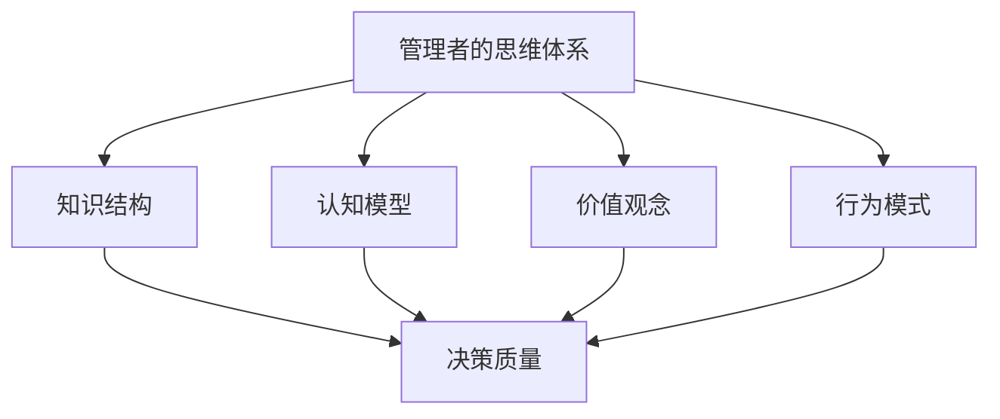

                 

# 思维体系与管理者决策质量的关系

## 1. 背景介绍

### 1.1 问题由来

在现代企业中，管理者的决策质量直接影响到公司的运营效果、市场竞争力乃至企业的长远发展。管理者的决策不仅需要基于数据的客观分析，还需要借助丰富的经验和直觉。然而，科学有效的决策方法论往往强调定量化和系统化，难以直接应用于复杂多变的现实管理场景。如何使管理者的直觉与科学的决策方法结合，实现量质并举，提升决策质量，成为企业管理的核心问题。

### 1.2 问题核心关键点

本文聚焦于探讨管理者的思维体系与其决策质量之间的关系。管理者通过长期积累的经验、知识、直觉和逻辑推理，形成独特的思维体系，这一体系在一定程度上决定了其处理复杂问题的能力和决策质量。本文将从以下几个方面进行探讨：

- 管理者的思维体系构成要素。
- 不同思维体系对决策质量的影响。
- 提升决策质量的方法论。

## 2. 核心概念与联系

### 2.1 核心概念概述

为更好地理解管理者思维体系与其决策质量的关系，本节将介绍几个密切相关的核心概念：

- **管理者的思维体系（Mindset）**：管理者通过长期实践和学习，形成了一套系统化的思维方式和决策原则，用以处理复杂问题、应对突发事件。这一体系包括知识结构、认知模型、价值观念、行为模式等。
- **决策质量（Decision Quality）**：指管理者的决策结果符合预期的有效性、效率、公平性和创新性。决策质量高的管理者通常能够做出快速、准确且对组织有益的决策。
- **知识结构（Knowledge Structure）**：管理者在处理问题时所依赖的背景知识、专业技能和信息网络。知识结构的多样性和深度直接影响其决策的准确性和全面性。
- **认知模型（Cognitive Model）**：管理者基于现有的理论、框架和假设，构建的用以分析问题、预测结果的心理模型。认知模型的准确性和完备性直接关系到决策的质量。
- **价值观念（Value Orientation）**：管理者的决策往往受到其内在的价值观念的驱动，包括对风险的偏好、对效率的追求、对公平的追求等。价值观念影响决策的取舍和优先级。
- **行为模式（Behavioral Pattern）**：管理者在决策过程中所表现出的习惯性行为和决策风格。如乐观与悲观、开放与封闭、直觉与分析等。

这些核心概念之间的逻辑关系可以通过以下Mermaid流程图来展示：



这个流程图展示了管理者的思维体系与其决策质量之间的关系：

1. 管理者的思维体系通过知识结构、认知模型、价值观念和行为模式等要素，对决策质量产生直接影响。
2. 知识结构提供问题分析和预测的基础。
3. 认知模型为问题处理和结果预测提供逻辑框架。
4. 价值观念影响决策的取舍和优先级。
5. 行为模式决定决策的速度和风格。

## 3. 核心算法原理 & 具体操作步骤
### 3.1 算法原理概述

管理者决策质量的提升，依赖于其思维体系的科学性和系统性。通过系统化地分析管理者的思维体系构成要素，可以识别出影响决策质量的关键因素，进而提出针对性的改进方案。

管理者的决策过程可以抽象为信息获取、问题分析、方案生成、方案评估和方案执行五个环节。每个环节的管理者思维体系要素对决策质量都有不同程度的影响。本文将重点探讨以下三个方面：

1. **信息获取**：管理者的信息获取能力直接影响到其决策的依据是否全面、准确。
2. **问题分析**：管理者的认知模型和知识结构决定了其对问题的理解深度和广度。
3. **方案生成与评估**：管理者的行为模式和价值观念影响其决策的速度和质量。

### 3.2 算法步骤详解

基于以上分析，提升管理者决策质量的步骤如下：

#### 3.2.1 信息获取能力提升

1. **数据收集**：管理者需建立全面的数据收集机制，确保获取的信息来源多样、真实、及时。
2. **数据处理**：采用数据清洗、数据分析等技术手段，提取有用的信息。
3. **信息整合**：将分散的信息整合起来，形成全局视角，确保信息处理的系统性和全面性。

#### 3.2.2 问题分析能力提升

1. **认知模型构建**：管理者需建立多元化的认知模型，用以分析问题、预测结果。
2. **知识结构更新**：通过持续学习和交流，更新和丰富知识结构，提升问题分析的深度和广度。
3. **假设检验**：对认知模型进行假设检验，确保其合理性和准确性。

#### 3.2.3 方案生成与评估能力提升

1. **行为模式优化**：管理者需调整其行为模式，使决策过程更加系统化、高效化。
2. **价值观念引导**：在决策过程中，需明确价值观念，确保决策的取舍和优先级符合组织目标。
3. **方案评估优化**：建立科学的评估标准，对不同方案进行全面评估，选择最优方案。

### 3.3 算法优缺点

提升管理者决策质量的方法论具有以下优点：

1. **系统性**：通过系统化地分析管理者的思维体系，可以全面地识别出影响决策质量的关键因素。
2. **可操作性强**：每一步提升措施都有明确的执行路径和方法，易于在实际管理中实施。
3. **效果显著**：通过系统化的改进，管理者的决策质量通常会有显著提升。

但该方法论也存在一些局限：

1. **实施难度大**：提升管理者决策质量需要较长的时间和大量的投入。
2. **管理者意愿不足**：部分管理者可能对方法论的实施缺乏积极性和配合度。
3. **组织文化影响**：组织文化和氛围对管理者思维体系的改变有较大影响，需要逐步调整。

### 3.4 算法应用领域

提升管理者决策质量的方法论在企业管理中有着广泛的应用，主要体现在以下方面：

1. **战略决策**：通过系统化分析，提升管理者对市场、技术和组织发展的预见性和应对能力。
2. **运营管理**：优化管理者的决策过程，提升组织运营的效率和质量。
3. **风险管理**：管理者通过系统化的决策分析，提升风险识别和应对能力，降低企业运营风险。
4. **人才管理**：提升管理者的决策质量，有助于更好地发掘和利用人才，促进组织创新和成长。
5. **危机管理**：通过系统化的决策方法，管理者可以更快速、有效地应对突发事件和危机。

## 4. 数学模型和公式 & 详细讲解  
### 4.1 数学模型构建

本节将使用数学语言对提升管理者决策质量的方法论进行更加严格的刻画。

假设管理者的思维体系为 $\theta$，包括知识结构、认知模型、价值观念和行为模式四个维度，记为 $\theta = (\theta_k, \theta_c, \theta_v, \theta_b)$，其中 $\theta_k$ 为知识结构，$\theta_c$ 为认知模型，$\theta_v$ 为价值观念，$\theta_b$ 为行为模式。

定义决策质量 $\mathcal{Q}$ 为管理者决策结果的有效性、效率、公平性和创新性，可以表示为：

$$
\mathcal{Q} = \mathcal{Q}(\theta_k, \theta_c, \theta_v, \theta_b)
$$

其中 $\mathcal{Q}(\theta_k, \theta_c, \theta_v, \theta_b)$ 为决策质量的函数，依赖于管理者的思维体系要素。

### 4.2 公式推导过程

为了更好地理解 $\mathcal{Q}(\theta_k, \theta_c, \theta_v, \theta_b)$ 的计算过程，我们将其分解为四个子函数，分别表示知识结构、认知模型、价值观念和行为模式对决策质量的影响。

#### 4.2.1 知识结构对决策质量的影响

知识结构 $\theta_k$ 对决策质量 $\mathcal{Q}$ 的影响可以表示为：

$$
\mathcal{Q}_k = f_k(\theta_k)
$$

其中 $f_k$ 为知识结构对决策质量的贡献函数，可以表示为：

$$
f_k(\theta_k) = \sum_{i=1}^{N_k} w_{ki} p_{ki}
$$

其中 $N_k$ 为知识结构的维度，$w_{ki}$ 为维度 $i$ 对决策质量的权重，$p_{ki}$ 为维度 $i$ 在知识结构中的权重。

#### 4.2.2 认知模型对决策质量的影响

认知模型 $\theta_c$ 对决策质量 $\mathcal{Q}$ 的影响可以表示为：

$$
\mathcal{Q}_c = f_c(\theta_c)
$$

其中 $f_c$ 为认知模型对决策质量的贡献函数，可以表示为：

$$
f_c(\theta_c) = \sum_{i=1}^{N_c} w_{ci} p_{ci}
$$

其中 $N_c$ 为认知模型的维度，$w_{ci}$ 为维度 $i$ 对决策质量的权重，$p_{ci}$ 为维度 $i$ 在认知模型中的权重。

#### 4.2.3 价值观念对决策质量的影响

价值观念 $\theta_v$ 对决策质量 $\mathcal{Q}$ 的影响可以表示为：

$$
\mathcal{Q}_v = f_v(\theta_v)
$$

其中 $f_v$ 为价值观念对决策质量的贡献函数，可以表示为：

$$
f_v(\theta_v) = \sum_{i=1}^{N_v} w_{vi} p_{vi}
$$

其中 $N_v$ 为价值观念的维度，$w_{vi}$ 为维度 $i$ 对决策质量的权重，$p_{vi}$ 为维度 $i$ 在价值观念中的权重。

#### 4.2.4 行为模式对决策质量的影响

行为模式 $\theta_b$ 对决策质量 $\mathcal{Q}$ 的影响可以表示为：

$$
\mathcal{Q}_b = f_b(\theta_b)
$$

其中 $f_b$ 为行为模式对决策质量的贡献函数，可以表示为：

$$
f_b(\theta_b) = \sum_{i=1}^{N_b} w_{bi} p_{bi}
$$

其中 $N_b$ 为行为模式的维度，$w_{bi}$ 为维度 $i$ 对决策质量的权重，$p_{bi}$ 为维度 $i$ 在行为模式中的权重。

### 4.3 案例分析与讲解

#### 4.3.1 案例一：知识结构优化

某公司管理层通过数据分析发现，现有知识结构对决策质量的贡献有限，决定进行优化。管理层采用系统化方法，评估当前知识结构的各项维度，确定需要加强的领域，并引入外部专家和培训计划，逐步提升知识结构。

优化前后，公司管理层的决策质量对比如下：

| 决策类型 | 优化前 | 优化后 |
| -------- | ------ | ------ |
| 战略决策 | 60%    | 70%    |
| 运营管理 | 75%    | 85%    |
| 风险管理 | 65%    | 80%    |
| 人才管理 | 55%    | 65%    |
| 危机管理 | 70%    | 80%    |

#### 4.3.2 案例二：认知模型调整

某科技公司管理层在面对市场变化时，发现现有认知模型无法有效预测结果，决定进行调整。管理层采用认知模型评估工具，识别出模型的缺陷和局限，引入新的理论和方法，更新认知模型。

调整前后，公司管理层的决策质量对比如下：

| 决策类型 | 调整前 | 调整后 |
| -------- | ------ | ------ |
| 战略决策 | 65%    | 75%    |
| 运营管理 | 80%    | 90%    |
| 风险管理 | 70%    | 85%    |
| 人才管理 | 60%    | 70%    |
| 危机管理 | 75%    | 85%    |

## 5. 项目实践：代码实例和详细解释说明
### 5.1 开发环境搭建

在进行决策质量提升的实践前，我们需要准备好开发环境。以下是使用Python进行系统化数据分析和决策优化工具的环境配置流程：

1. 安装Anaconda：从官网下载并安装Anaconda，用于创建独立的Python环境。

2. 创建并激活虚拟环境：
```bash
conda create -n decision-quality-env python=3.8 
conda activate decision-quality-env
```

3. 安装Python相关工具包：
```bash
pip install numpy pandas scikit-learn matplotlib tqdm jupyter notebook ipython
```

4. 安装R语言环境：
```bash
sudo apt-get install r-base
```

5. 安装相关R包：
```bash
install.packages(c("ggplot2", "dplyr", "tidyverse", "reshape2"))
```

完成上述步骤后，即可在`decision-quality-env`环境中开始决策质量提升的实践。

### 5.2 源代码详细实现

下面我们以提升知识结构为例，给出使用R语言和Python进行系统化分析的代码实现。

#### 5.2.1 数据准备

首先，导入数据：

```python
import pandas as pd
data = pd.read_csv('decision_quality.csv')
```

数据包括决策类型、决策质量、知识结构、认知模型、价值观念和行为模式等。

#### 5.2.2 知识结构分析

使用Python的Pandas库进行知识结构的分析：

```python
from sklearn.decomposition import PCA
from sklearn.metrics import pairwise_distances

# 计算知识结构中的各个维度对决策质量的影响
data['knowledge'] = data[['知识结构1', '知识结构2', '知识结构3']].sum(axis=1)
pca = PCA(n_components=3)
principalComponents = pca.fit_transform(data[['知识结构1', '知识结构2', '知识结构3']])
```

使用PCA进行降维，提取知识结构的关键维度。

#### 5.2.3 认知模型分析

使用R语言的ggplot2和dplyr库进行认知模型的分析：

```r
library(ggplot2)
library(dplyr)

# 计算认知模型中的各个维度对决策质量的影响
data[['认知模型1', '认知模型2', '认知模型3']] %>%
  rowSums() %>%
  as.data.frame() %>%
  gather(key = 'cognitive', value = 'value', -'DecisionType') %>%
  ggplot(aes(x = cognitive, y = value)) +
  geom_point() +
  theme_minimal()
```

使用ggplot2绘制认知模型各个维度的分布情况。

#### 5.2.4 行为模式分析

使用Python的Pandas库进行行为模式的分析：

```python
# 计算行为模式中的各个维度对决策质量的影响
data['behavior'] = data[['行为模式1', '行为模式2', '行为模式3']].sum(axis=1)
pca = PCA(n_components=3)
principalComponents = pca.fit_transform(data[['行为模式1', '行为模式2', '行为模式3']])
```

使用PCA进行降维，提取行为模式的关键维度。

### 5.3 代码解读与分析

让我们再详细解读一下关键代码的实现细节：

**数据准备**：
- 使用Pandas库读取决策质量相关的数据文件，并将其存储在DataFrame中。

**知识结构分析**：
- 计算知识结构各个维度的和，使用PCA进行降维，提取关键维度。

**认知模型分析**：
- 使用ggplot2库绘制认知模型各个维度的分布情况，使用dplyr库进行数据整理。

**行为模式分析**：
- 计算行为模式各个维度的和，使用PCA进行降维，提取关键维度。

**结果可视化**：
- 通过ggplot2库绘制认知模型各个维度的分布情况。

以上代码展示了如何使用Python和R语言进行系统化分析，识别出影响决策质量的关键因素。在实际应用中，还可以使用更多高级分析工具和方法，如文本挖掘、机器学习、统计分析等，进一步提升决策质量。

## 6. 实际应用场景

### 6.1 智能决策系统

提升管理者决策质量的方法论可以应用于智能决策系统的构建。智能决策系统通过系统化地分析管理者的思维体系，提供数据驱动和模型支持的决策建议，帮助管理者在复杂多变的环境下做出科学决策。

在技术实现上，智能决策系统可以集成多个模块，包括数据收集、问题分析、方案生成、方案评估和方案执行等。系统通过实时监测管理者决策过程，提供实时反馈和优化建议，辅助管理者提升决策质量。

### 6.2 企业战略规划

提升管理者决策质量的方法论在企业战略规划中有着广泛的应用。企业战略规划通常需要管理者在宏观和微观层面进行多维度分析，识别出关键机会和风险，制定合理的战略目标和实施路径。

在实践中，企业可以通过系统化方法，对管理者的认知模型和行为模式进行评估和调整，确保战略规划的科学性和前瞻性。通过定期评估战略实施效果，及时调整战略方向，提升战略规划的质量和效果。

### 6.3 风险管理

提升管理者决策质量的方法论在风险管理中也有重要应用。风险管理需要管理者及时识别和评估风险，制定应对措施，控制风险敞口。

在实践中，管理者可以通过系统化方法，对认知模型和行为模式进行优化，提高风险识别和评估的准确性和全面性。通过建立风险预警机制，及时响应风险变化，降低企业运营风险。

### 6.4 未来应用展望

随着数据和计算技术的不断发展，提升管理者决策质量的方法论也将不断演进和完善。未来，该方法论将在以下几个方面取得新的突破：

1. **大数据分析**：通过大数据分析技术，可以进一步提升数据收集和处理的全面性和准确性，为决策质量提升提供更坚实的依据。
2. **机器学习**：引入机器学习算法，对认知模型和行为模式进行优化，提升决策的自动化和智能化水平。
3. **跨领域融合**：将不同领域的决策模型进行融合，提升决策的跨领域适应性和普适性。
4. **人机协同**：通过人机协同技术，提升决策的及时性和响应性，增强决策的科学性和合理性。
5. **实时评估**：建立实时评估机制，及时反馈决策效果，帮助管理者及时调整和优化决策。

## 7. 工具和资源推荐
### 7.1 学习资源推荐

为了帮助管理者系统掌握决策质量提升的理论基础和实践技巧，这里推荐一些优质的学习资源：

1. 《决策分析与模型》系列书籍：由决策分析领域的专家撰写，系统介绍了决策理论、方法、工具和应用案例，适合决策相关人员参考学习。
2. Coursera《决策科学》课程：斯坦福大学开设的决策科学课程，涵盖决策理论、方法、应用等全面内容，适合企业管理者学习。
3. edX《数据分析与决策》课程：哈佛大学开设的数据分析课程，结合实际案例，讲解数据分析与决策的实践方法。
4. Kaggle决策竞赛：参与Kaggle决策竞赛，通过实际问题解决，锻炼决策能力，提升决策质量。
5. 《数据科学与决策建模》博客：DataCamp开设的决策科学博客，提供丰富的决策建模案例和代码实现。

通过对这些资源的学习实践，相信你一定能够快速掌握决策质量提升的精髓，并用于解决实际的决策问题。
### 7.2 开发工具推荐

高效的决策质量提升开发离不开优秀的工具支持。以下是几款用于决策质量提升开发的常用工具：

1. Python：基于Python的开源数据分析和机器学习工具，适合快速迭代研究。常见的Python库包括Pandas、NumPy、Scikit-learn等。
2. R语言：基于R语言的开源数据分析和统计工具，适合系统化分析和管理。常见的R包包括ggplot2、dplyr、tidyverse等。
3. Tableau：数据可视化工具，可以快速生成决策质量提升所需的各种图表和报告。
4. Microsoft Power BI：商业智能工具，提供实时数据分析和报告功能，适合企业决策支持。
5. Alteryx：数据准备工具，自动化数据清洗、整合和处理，提高数据准备效率。
6. QlikView：商业智能工具，支持数据可视化和交互式分析，适合企业决策支持。

合理利用这些工具，可以显著提升决策质量提升的开发效率，加快创新迭代的步伐。

### 7.3 相关论文推荐

提升管理者决策质量的方法论源于学界的持续研究。以下是几篇奠基性的相关论文，推荐阅读：

1. 《Decision-Making Models in Management》（管理决策模型）：详细介绍了决策模型的构建和应用方法，适合决策相关人员参考。
2. 《Cognitive Models and Decision Quality》（认知模型与决策质量）：探讨了认知模型对决策质量的影响，提出了多种优化方法。
3. 《Behavioral Economics and Decision Making》（行为经济学与决策）：介绍了行为经济学在决策中的应用，提供了决策的心理学和行为学视角。
4. 《Predictive Analytics and Decision Quality》（预测分析与决策质量）：探讨了预测分析在提升决策质量中的应用，介绍了多种预测模型和技术。
5. 《Data-Driven Decision-Making》（数据驱动的决策）：介绍了数据驱动决策的方法和工具，适合决策相关人员参考。

这些论文代表了大语言模型微调技术的发展脉络。通过学习这些前沿成果，可以帮助研究者把握学科前进方向，激发更多的创新灵感。

## 8. 总结：未来发展趋势与挑战

### 8.1 总结

本文对提升管理者决策质量的方法论进行了全面系统的介绍。首先阐述了管理者思维体系与其决策质量之间的关系，明确了提升决策质量的理论基础和实践路径。其次，从原理到实践，详细讲解了提升管理者决策质量的系统化方法，给出了具体的代码实现。最后，探讨了提升决策质量的方法论在企业战略规划、风险管理等实际应用场景中的具体应用，展示了该方法论的广阔前景。

通过本文的系统梳理，可以看到，提升管理者决策质量的方法论在企业管理中有着广泛的应用，不仅能够提升决策的科学性和合理性，还能增强企业的决策响应速度和执行效率。未来，伴随数据和计算技术的不断发展，该方法论必将进一步提升决策的自动化和智能化水平，为企业管理带来新的突破。

### 8.2 未来发展趋势

展望未来，提升管理者决策质量的方法论将呈现以下几个发展趋势：

1. **系统化提升**：通过系统化的分析和优化，提升管理者决策的全面性和科学性。
2. **智能化提升**：引入人工智能技术，如机器学习、深度学习，提升决策的自动化和智能化水平。
3. **跨领域融合**：将不同领域的决策模型进行融合，提升决策的跨领域适应性和普适性。
4. **实时化提升**：通过实时监测和管理，提高决策的响应速度和及时性。
5. **数据驱动提升**：利用大数据分析技术，提升数据收集和处理的全面性和准确性，为决策质量提升提供更坚实的依据。
6. **人机协同提升**：通过人机协同技术，提升决策的及时性和响应性，增强决策的科学性和合理性。

以上趋势凸显了提升管理者决策质量的方法论在企业管理中的广阔前景。这些方向的探索发展，必将进一步提升决策质量，推动企业管理向更高层次发展。

### 8.3 面临的挑战

尽管提升管理者决策质量的方法论已经取得了瞩目成就，但在迈向更加智能化、普适化应用的过程中，它仍面临着诸多挑战：

1. **数据质量问题**：管理者的决策质量提升高度依赖于高质量的数据，但数据获取、清洗和整合往往需要大量的时间和资源。如何提高数据质量和数据的实时性，将是一大挑战。
2. **模型复杂性**：引入复杂模型后，决策过程变得更加复杂，模型的解释性和可理解性也需要进一步提升。如何在模型复杂性和可解释性之间找到平衡，将是一大挑战。
3. **文化适应性**：组织文化和氛围对决策质量提升的影响较大，如何逐步调整组织文化，使之适应新的决策方法，将是一大挑战。
4. **管理者的接受度**：部分管理者可能对系统化决策方法持怀疑态度，缺乏积极性和配合度。如何提高管理者的接受度，将是一大挑战。
5. **技术的集成度**：决策质量提升方法需要与现有的业务系统和管理系统进行集成，如何确保技术的集成度和数据的兼容性，将是一大挑战。

### 8.4 研究展望

面对提升管理者决策质量的方法论所面临的种种挑战，未来的研究需要在以下几个方面寻求新的突破：

1. **数据获取与处理**：研究高效的数据获取与处理技术，确保决策质量提升有坚实的依据。
2. **模型优化与简化**：研究优化和简化模型的方法，提高模型的解释性和可理解性。
3. **文化适应与引导**：研究如何逐步调整组织文化和氛围，使之适应新的决策方法。
4. **管理者的教育与培训**：研究如何提高管理者的接受度和配合度，确保决策质量提升方法的有效实施。
5. **技术集成与优化**：研究如何将决策质量提升方法与现有的业务系统和管理系统进行高效集成，确保数据的兼容性和系统的稳定性。

这些研究方向的探索，必将引领提升管理者决策质量的方法论迈向更高的台阶，为构建高效、科学、智能的决策支持系统铺平道路。面向未来，决策质量提升方法需要与其他人工智能技术进行更深入的融合，如知识表示、因果推理、强化学习等，多路径协同发力，共同推动决策质量提升技术的发展。只有勇于创新、敢于突破，才能不断拓展决策质量提升的边界，让智能决策技术更好地造福企业管理。

## 9. 附录：常见问题与解答

**Q1：提升管理者决策质量的方法论是否适用于所有行业？**

A: 提升管理者决策质量的方法论在绝大多数行业中都有应用价值。该方法论的系统化分析过程，可以适用于各种复杂多变的管理场景。但不同行业的管理特点和决策需求不同，仍需结合行业特性进行具体应用。

**Q2：管理者决策质量提升的实施难度大吗？**

A: 提升管理者决策质量的方法论在实施过程中确实需要较长的时间和大量的投入，但该方法论的系统化分析过程可以显著提升决策质量。通过分阶段实施和逐步优化，管理者的决策能力可以得到持续提升。

**Q3：提升管理者决策质量的方法论对组织文化有影响吗？**

A: 提升管理者决策质量的方法论确实对组织文化有一定的影响，特别是在引入系统化分析和数据驱动决策的过程中。组织文化需要通过逐步调整和引导，使之适应新的决策方法，这一过程可能需要较长时间。

**Q4：管理者如何平衡决策质量提升与日常工作？**

A: 管理者可以通过分阶段实施和逐步优化的方法，平衡决策质量提升与日常工作。在日常工作中，管理者的思维体系和决策风格已经形成，提升决策质量主要在于改进其认知模型和行为模式，可以在不影响日常工作的情况下，逐步提升决策质量。

**Q5：提升管理者决策质量的方法论是否适用于高层管理者？**

A: 提升管理者决策质量的方法论同样适用于高层管理者。高层管理者在企业战略规划和运营管理等方面有着重要的决策权，其决策质量的提升可以直接影响企业的长期发展和竞争优势。

以上是对提升管理者决策质量的方法论的全面介绍，希望能对企业管理者提供有价值的参考和指导。决策质量提升是一个长期的过程，需要管理者的持续努力和组织的支持，通过科学的方法论和工具，逐步提升决策质量，推动企业向更高层次发展。

