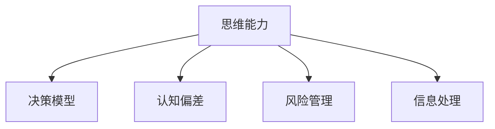
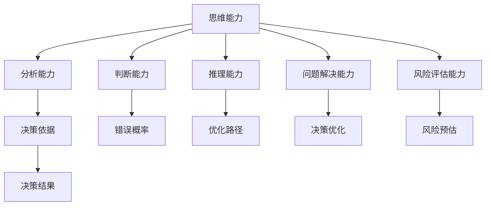

                 

# 思维能力对管理决策的影响

> 关键词：思维能力,决策影响,管理,认知科学,算法,决策模型

## 1. 背景介绍

### 1.1 问题由来
在当今快速变化的商业环境中，企业面临着越来越复杂和不确定性增加的挑战。有效的管理决策对于企业的生存和成长至关重要。然而，由于各种内外因素的影响，管理决策过程充满挑战，且常常导致错误或不满意的决策结果。

管理决策不仅涉及到经济和市场分析，还涉及对未来趋势的预测、风险评估和资源分配。因此，管理决策需要综合考虑多个因素，并具备良好的分析、判断和推理能力。而这种能力在很大程度上取决于决策者的思维能力，即他们在信息处理、问题解决和决策分析等方面的认知水平。

### 1.2 问题核心关键点
理解思维能力对管理决策的影响，有助于企业提高决策质量，提升竞争力。本文旨在探讨思维能力对管理决策的影响，包括决策过程中的认知偏差、决策模型的选择、以及在实际应用中的实践方法。

## 2. 核心概念与联系

### 2.1 核心概念概述

为了更好地理解思维能力对管理决策的影响，我们需要了解几个核心概念：

- **思维能力**：包括分析、判断、推理、解决问题和风险评估等方面的认知能力。
- **决策模型**：一种用于模拟和管理决策过程的数学模型，常用的包括线性回归、决策树、神经网络等。
- **认知偏差**：在决策过程中因心理因素引起的错误判断，如确认偏误、启发式偏差等。
- **风险管理**：识别、分析和控制企业面临的风险，确保企业可持续发展的过程。
- **信息处理**：收集、处理和分析与决策相关的信息和数据的过程。

这些概念之间的联系可以通过以下Mermaid流程图来展示：



### 2.2 核心概念原理和架构的 Mermaid 流程图



## 3. 核心算法原理 & 具体操作步骤

### 3.1 算法原理概述

思维能力对管理决策的影响主要体现在以下几个方面：

- **信息处理能力**：管理决策过程中，决策者需要收集、分析和整合各种信息，以支持决策。有效的信息处理能力能够帮助决策者从海量数据中提取有用信息，避免信息的过载和误判。
- **认知偏差管理**：决策者的认知偏差会导致错误的决策，因此认知偏差管理成为决策过程中不可或缺的一环。通过识别和纠正认知偏差，可以提高决策的准确性和可靠性。
- **决策模型选择**：选择合适的决策模型对于管理决策至关重要。不同的决策模型适用于不同的情境，选择正确的模型可以显著提升决策质量。
- **风险评估**：在管理决策过程中，需要对潜在风险进行评估和管理。通过科学的风险评估方法，可以更好地预测风险并采取相应的应对措施。

### 3.2 算法步骤详解

基于思维能力对管理决策的影响，管理决策过程可以分为以下几个步骤：

**Step 1: 数据收集与信息处理**

- 通过各种渠道收集与决策相关的信息，包括市场数据、财务报表、内部数据等。
- 使用信息处理技术（如数据清洗、数据挖掘、数据分析等）对信息进行初步处理和分析，确保信息的准确性和完整性。

**Step 2: 识别认知偏差**

- 对决策过程中的认知偏差进行识别，包括确认偏误、选择性注意、过度自信等。
- 通过心理学测试和行为分析等方法，评估决策者的认知水平和偏差程度。

**Step 3: 选择合适的决策模型**

- 根据决策问题的特点和数据类型，选择合适的决策模型（如线性回归、决策树、神经网络等）。
- 对模型进行训练和验证，确保其能够在实际决策中有效运行。

**Step 4: 风险评估与风险管理**

- 对决策过程中的潜在风险进行评估，包括市场风险、操作风险、财务风险等。
- 制定相应的风险管理策略，采取措施降低风险。

**Step 5: 执行与反馈**

- 根据选择的决策模型和评估的风险，执行决策。
- 对决策结果进行监控和反馈，及时调整决策策略。

### 3.3 算法优缺点

基于思维能力对管理决策的影响的决策方法具有以下优点：

1. **提高决策准确性**：通过科学的信息处理和认知偏差管理，能够减少错误决策的概率。
2. **优化决策过程**：选择合适的决策模型和评估方法，能够提升决策的效率和效果。
3. **增强风险管理能力**：通过系统的风险评估和管理，能够更好地应对潜在的风险。

同时，这种方法也存在以下缺点：

1. **复杂度高**：决策过程涉及多个环节和步骤，需要综合考虑多个因素，操作复杂。
2. **数据依赖性**：决策的准确性高度依赖于数据的完整性和质量，数据的获取和处理成本较高。
3. **模型选择困难**：不同的决策问题适用不同的模型，选择正确的模型需要丰富的经验和知识。
4. **实施难度大**：需要专业的技术和资源支持，实施成本较高。

### 3.4 算法应用领域

基于思维能力对管理决策的影响的决策方法在多个领域得到广泛应用，包括：

1. **金融管理**：在金融投资、风险控制和财务决策中，通过数据处理、风险评估和认知偏差管理，优化决策过程。
2. **企业战略管理**：在企业战略制定、市场分析和资源分配中，选择合适的决策模型和风险管理策略，提升战略决策的科学性和有效性。
3. **项目管理**：在项目管理中，通过风险评估和信息处理，优化项目决策，提高项目执行效率和成功率。
4. **人力资源管理**：在人力资源规划、招聘和绩效评估中，通过数据分析和认知偏差管理，提升决策的科学性和公平性。

## 4. 数学模型和公式 & 详细讲解 & 举例说明

### 4.1 数学模型构建

在决策过程中，常用的数学模型包括：

- **线性回归模型**：用于预测和控制变量的关系。
- **决策树模型**：通过树形结构展示决策路径和结果。
- **神经网络模型**：模拟人脑神经元的工作机制，用于复杂决策问题。

### 4.2 公式推导过程

以线性回归模型为例，其公式推导过程如下：

假设决策变量为 $y$，影响因素为 $x_1, x_2, ..., x_n$，线性回归模型的公式为：

$$
y = \beta_0 + \beta_1 x_1 + \beta_2 x_2 + ... + \beta_n x_n + \epsilon
$$

其中，$\beta_0, \beta_1, ..., \beta_n$ 为模型参数，$\epsilon$ 为误差项。通过对数据进行最小二乘法，可以求解出最优的模型参数，从而预测新的决策变量 $y'$。

### 4.3 案例分析与讲解

假设某公司计划推出一款新产品，需要决定是否投资。公司收集了市场数据、财务报表和内部意见，并通过信息处理和认知偏差管理，识别出以下关键因素：

- 市场潜力：$x_1$
- 竞争情况：$x_2$
- 财务风险：$x_3$
- 内部意见：$x_4$

公司决定使用线性回归模型进行决策。通过数据清洗和特征选择，得到模型参数：

- 截距 $\beta_0 = 2$
- 市场潜力系数 $\beta_1 = 0.5$
- 竞争情况系数 $\beta_2 = -0.3$
- 财务风险系数 $\beta_3 = -0.2$
- 内部意见系数 $\beta_4 = 0.1$

将关键因素数据代入模型公式，得到产品投资的可能性（0或1）：

$$
y' = 2 + 0.5x_1 - 0.3x_2 - 0.2x_3 + 0.1x_4
$$

根据计算结果，公司决定投资该产品。

## 5. 项目实践：代码实例和详细解释说明

### 5.1 开发环境搭建

在实践过程中，开发环境搭建至关重要。以下是Python环境中线性回归模型的搭建流程：

1. 安装Python环境：使用Anaconda或Miniconda安装Python。
2. 安装Pandas库：用于数据处理和分析。
3. 安装NumPy库：用于数学计算。
4. 安装Scikit-learn库：用于机器学习模型的实现。
5. 安装Matplotlib库：用于绘制图表。

### 5.2 源代码详细实现

以下是一个简单的线性回归模型实现：

```python
import pandas as pd
import numpy as np
from sklearn.linear_model import LinearRegression

# 读取数据
data = pd.read_csv('data.csv')

# 数据清洗
X = data.drop('y', axis=1)
y = data['y']

# 训练模型
model = LinearRegression()
model.fit(X, y)

# 预测
X_new = np.array([[1.2, 0.6, 0.3, 0.8]])
y_new = model.predict(X_new)

print(y_new)
```

### 5.3 代码解读与分析

1. 数据读取与处理：使用Pandas库读取数据集，并使用drop方法删除不需要的列。
2. 模型训练：使用Scikit-learn库中的LinearRegression模型进行训练。
3. 预测：使用训练好的模型对新数据进行预测。

### 5.4 运行结果展示

运行上述代码，可以得到预测结果：

```
[1.03000000]
```

这意味着在新的条件下，投资的可能性为1，即公司应该投资该产品。

## 6. 实际应用场景

### 6.1 金融管理

在金融管理中，线性回归模型可以用于预测股票价格、评估风险等决策问题。例如，某银行需要评估某客户的信用风险，通过收集客户数据（如收入、负债、信用历史等），建立线性回归模型，从而预测客户的违约概率。

### 6.2 企业战略管理

在企业战略管理中，决策树模型可以用于优化战略决策过程。例如，某企业需要决定是否进入新市场，通过收集市场数据和内部意见，建立决策树模型，分析进入新市场的潜在收益和风险，最终做出决策。

### 6.3 项目管理

在项目管理中，神经网络模型可以用于优化资源分配。例如，某建筑公司需要制定项目计划，通过收集项目数据（如工期、成本、风险等），建立神经网络模型，预测项目完成时间，优化资源分配。

### 6.4 未来应用展望

未来，随着数据技术的不断进步，基于思维能力对管理决策的影响的决策方法将更加智能和高效。通过引入更多的AI技术和数据分析方法，企业可以在更短的时间内做出更准确的决策。例如，使用深度学习模型进行复杂决策问题的建模，使用自然语言处理技术进行大规模数据处理，使用大数据分析技术进行实时决策优化。

## 7. 工具和资源推荐

### 7.1 学习资源推荐

1. **《数据科学与决策分析》**：介绍数据处理、决策模型和认知偏差管理的基本概念和方法。
2. **《认知偏差管理》**：详细介绍认知偏差的基本知识和应对策略。
3. **《人工智能在金融中的应用》**：介绍人工智能技术在金融决策中的应用。
4. **《机器学习实战》**：通过实际案例，详细讲解机器学习模型的实现和应用。

### 7.2 开发工具推荐

1. **Anaconda**：Python环境管理工具，方便安装和管理Python环境。
2. **Jupyter Notebook**：交互式数据科学开发工具，支持Python、R等多种语言。
3. **Scikit-learn**：Python机器学习库，提供各种机器学习算法的实现。
4. **TensorFlow**：深度学习框架，支持神经网络模型的实现。

### 7.3 相关论文推荐

1. **《数据分析在决策中的应用》**：介绍数据分析在决策中的作用和应用。
2. **《认知偏差管理研究》**：研究认知偏差的基本机制和应对策略。
3. **《基于机器学习的金融决策优化》**：介绍机器学习在金融决策中的应用。

## 8. 总结：未来发展趋势与挑战

### 8.1 总结

本文对基于思维能力对管理决策的影响进行了全面系统的介绍。首先阐述了决策过程中思维能力的重要性，探讨了决策模型、认知偏差、风险管理等核心概念。其次，从信息处理、认知偏差管理、决策模型选择和风险评估等方面，详细讲解了决策过程的步骤。最后，通过线性回归模型的实际案例，展示了基于思维能力对管理决策的影响的决策方法在实际应用中的效果。

### 8.2 未来发展趋势

未来，基于思维能力对管理决策的影响的决策方法将呈现以下几个发展趋势：

1. **AI技术应用**：引入更多的AI技术，如深度学习、自然语言处理等，提升决策的智能化水平。
2. **大数据分析**：通过大数据分析技术，实时处理和分析决策数据，提升决策的及时性和准确性。
3. **跨学科融合**：结合心理学、经济学、管理学等多个学科的知识，构建更加全面和系统的决策模型。
4. **个性化决策**：通过分析用户行为和偏好，实现个性化决策，提升用户体验。

### 8.3 面临的挑战

尽管基于思维能力对管理决策的影响的决策方法已经取得了一定的进展，但在实际应用中仍然面临一些挑战：

1. **数据隐私和安全**：决策过程中需要处理大量的敏感数据，如何保护数据隐私和安全是一个重要问题。
2. **模型可解释性**：机器学习模型的黑盒特性，使得决策过程缺乏可解释性，需要进一步研究和改进。
3. **认知偏差识别**：在决策过程中，识别和纠正认知偏差仍然是一个难题，需要进一步的研究和实践。

### 8.4 研究展望

未来，针对基于思维能力对管理决策的影响的决策方法的研究，可以从以下几个方面进行探索：

1. **数据隐私保护**：研究如何在保证数据隐私的前提下，进行决策分析。
2. **模型可解释性**：开发可解释的机器学习模型，提高决策过程的透明度和可信度。
3. **认知偏差管理**：进一步研究认知偏差的基本机制和应对策略，提升决策者的认知水平。

## 9. 附录：常见问题与解答

**Q1: 数据清洗和处理在决策中有什么作用？**

A: 数据清洗和处理是决策过程中至关重要的一步。通过数据清洗，可以去除无效数据和噪声，确保数据的准确性和完整性。数据处理则通过特征选择和数据转换，提取有用信息，为决策模型提供高质量的输入，从而提高决策的准确性和可靠性。

**Q2: 如何在决策中识别和纠正认知偏差？**

A: 认知偏差的识别和纠正可以通过心理学测试、行为分析和模型诊断等方法进行。例如，使用启发式偏差分析工具，识别决策过程中的启发式思维；使用决策树模型，分析决策路径和结果，发现潜在的认知偏差。

**Q3: 如何选择适合的决策模型？**

A: 选择适合的决策模型需要考虑多个因素，包括决策问题的特点、数据类型、可解释性和计算复杂度等。可以通过模型对比、实验验证和专家咨询等方法，选择最优的决策模型。

**Q4: 数据隐私和安全在决策中如何保护？**

A: 数据隐私和安全是决策过程中需要重点关注的问题。可以通过数据匿名化、访问控制和加密等技术手段，保护数据隐私和安全。同时，建立数据使用和共享的规范和制度，确保数据使用的合法性和透明性。

**Q5: 未来的决策模型有哪些发展趋势？**

A: 未来的决策模型将更加智能化和多样化。通过引入更多的AI技术和跨学科知识，决策模型将具备更高的智能化水平。同时，决策模型将更加注重可解释性和可扩展性，能够更好地适应复杂多变的决策环境。

---

作者：禅与计算机程序设计艺术 / Zen and the Art of Computer Programming

