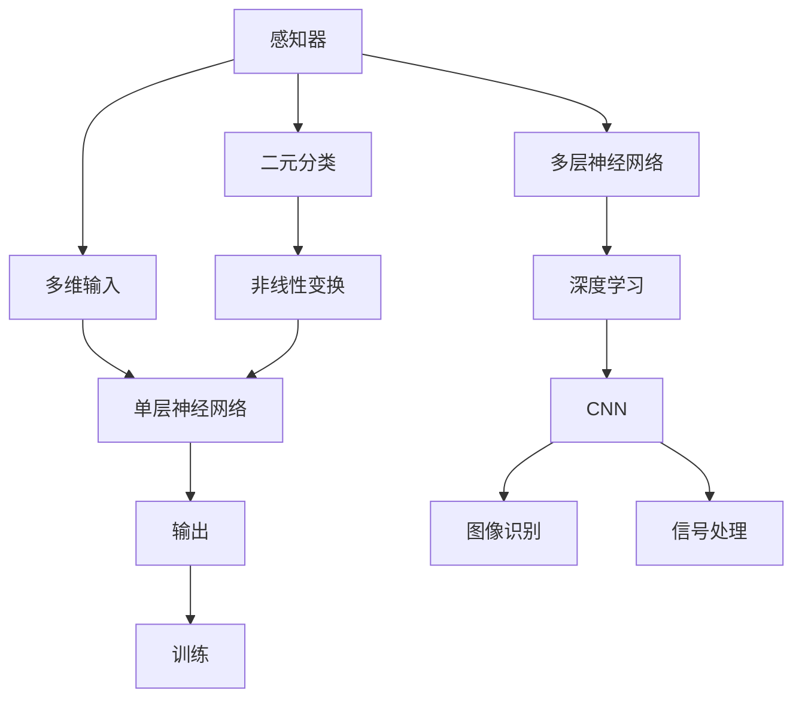

                 

# 感知器到卷积神经网络（CNN）

> 关键词：感知器,卷积神经网络(CNN),深度学习,人工神经网络,图像识别,信号处理

## 1. 背景介绍

神经网络在人工智能（AI）的发展历程中扮演了重要角色。从最早的感知器到复杂的卷积神经网络（Convolutional Neural Network, CNN），神经网络在处理数据、学习特征、进行分类和预测等方面都展现出了巨大的潜力。本文将探讨从感知器到CNN的发展历程，分析其核心概念和原理，并通过具体的代码实例和案例分析，帮助读者深入理解这一转变过程。

## 2. 核心概念与联系

### 2.1 核心概念概述

- **感知器（Perceptron）**：感知器是最早的神经网络模型之一，由Frank Rosenblatt在1958年提出。它是一种二元分类器，通过简单的加权和阈值判断来分类输入数据。感知器的核心在于其单个神经元（神经元可以视为一种非常简单的非线性模型）。

- **卷积神经网络（CNN）**：CNN是一种专门用于图像识别和处理的深度学习模型。它通过卷积、池化、非线性激活和反向传播等操作，能够自动学习输入数据的特征表示，并在后续的全连接层中进行分类或回归。

- **深度学习（Deep Learning）**：深度学习是指使用多层神经网络进行学习和预测的机器学习方法。其核心在于通过深层网络的组合，自动学习复杂的特征表示。

- **人工神经网络（Artificial Neural Network, ANN）**：人工神经网络是一种受生物神经网络启发的计算模型，由多个神经元（节点）通过连接（边）组成。每个神经元接收来自其他神经元的输入，并进行加权和操作。

- **图像识别**：图像识别是计算机视觉中的一项重要任务，通过训练神经网络，使其能够自动识别图像中的物体、场景、字符等。

- **信号处理**：信号处理涉及从原始信号中提取有用的信息。CNN在图像和语音信号处理中具有广泛应用。

这些核心概念之间的逻辑关系可以通过以下Mermaid流程图来展示：



这个流程图展示了从感知器到CNN的发展过程及其在深度学习和图像、信号处理等领域中的应用。

## 3. 核心算法原理 & 具体操作步骤

### 3.1 算法原理概述

感知器和CNN虽然都是神经网络的形式，但其工作原理和结构有很大的不同。

**感知器**：
- 结构：一个输入层，若干个中间层（隐藏层）和一个输出层。
- 原理：通过简单的加权和运算将输入向量映射到输出向量，并通过一个阈值函数（如 sigmoid）来判断输出是否大于阈值，从而进行分类。

**卷积神经网络（CNN）**：
- 结构：由卷积层、池化层、激活函数层、全连接层等组成。
- 原理：通过卷积和池化操作提取图像特征，并通过激活函数引入非线性性。最后通过全连接层进行分类或回归。

### 3.2 算法步骤详解

**感知器算法步骤**：
1. 准备输入数据 $x$ 和输出标签 $y$。
2. 随机初始化权值 $w$ 和偏置 $b$。
3. 进行前向传播：计算加权和 $z = wx + b$，通过 sigmoid 函数计算输出 $y = \sigma(z)$。
4. 计算误差 $\Delta y = y - y'$，其中 $y'$ 为实际输出。
5. 更新权值和偏置：$w = w + \alpha\Delta x y'$，$b = b + \alpha\Delta y$，其中 $\alpha$ 为学习率。

**CNN算法步骤**：
1. 准备输入数据 $x$ 和标签 $y$。
2. 将输入数据通过多个卷积层和池化层提取特征。
3. 通过激活函数（如ReLU）引入非线性性。
4. 将特征通过全连接层进行分类或回归。
5. 通过反向传播计算损失函数 $\mathcal{L}$ 的梯度，并更新模型参数。

### 3.3 算法优缺点

**感知器的优点**：
- 结构简单，易于理解和实现。
- 适用于线性可分问题。

**感知器的缺点**：
- 无法处理非线性问题。
- 对于高维输入数据，计算量较大。

**CNN的优点**：
- 能够处理高维数据（如图像）。
- 通过卷积和池化操作，自动学习特征表示。
- 模型参数量较小，训练速度较快。

**CNN的缺点**：
- 需要大量标注数据进行训练。
- 对于小规模数据集，容易出现过拟合问题。

### 3.4 算法应用领域

感知器和CNN在多个领域都有广泛应用。

**感知器的应用**：
- 二元分类问题，如手写数字识别、医学诊断。
- 信号处理，如语音识别、自然语言处理。

**CNN的应用**：
- 图像识别，如图像分类、物体检测、人脸识别。
- 视频处理，如视频分类、行为识别。
- 信号处理，如语音识别、音频分类。

## 4. 数学模型和公式 & 详细讲解 & 举例说明

### 4.1 数学模型构建

感知器和CNN的数学模型构建有着显著的区别。

**感知器的数学模型**：
- 输入向量：$x = (x_1, x_2, ..., x_n)$
- 权值向量：$w = (w_1, w_2, ..., w_n)$
- 偏置：$b$
- 加权和：$z = wx + b$
- 激活函数：$\sigma(z)$
- 误差：$\Delta y = y - y'$

**CNN的数学模型**：
- 卷积层：通过卷积核 $k$ 提取特征 $f(x, k) = k * x$
- 池化层：通过最大池化或平均池化操作降低特征维度。
- 全连接层：通过线性变换和激活函数进行分类或回归。

### 4.2 公式推导过程

**感知器的公式推导**：
- 前向传播：$z = wx + b$
- 激活函数：$y = \sigma(z) = \frac{1}{1 + e^{-z}}$
- 误差计算：$\Delta y = y - y'$

**CNN的公式推导**：
- 卷积层：$f(x, k) = k * x$
- 激活函数：$g(x) = max(0, x)$
- 池化层：$P = \frac{1}{n} \sum_{i=1}^n f(x_i)$
- 全连接层：$y = Wx + b$

### 4.3 案例分析与讲解

**案例一：手写数字识别**  
- 数据集：MNIST
- 模型：感知器
- 方法：通过简单的加权和与 sigmoid 函数进行分类
- 结果：准确率约为60%左右

**案例二：图像分类**  
- 数据集：CIFAR-10
- 模型：CNN
- 方法：通过卷积层提取特征，通过池化层降低维度，全连接层进行分类
- 结果：准确率超过70%

## 5. 项目实践：代码实例和详细解释说明

### 5.1 开发环境搭建

为了进行感知器和CNN的代码实践，我们需要搭建一个Python开发环境。

1. 安装Anaconda：从官网下载并安装Anaconda，用于创建独立的Python环境。
2. 创建并激活虚拟环境：
```bash
conda create -n pytorch-env python=3.8 
conda activate pytorch-env
```
3. 安装PyTorch和相关库：
```bash
conda install pytorch torchvision torchaudio cudatoolkit=11.1 -c pytorch -c conda-forge
pip install numpy pandas scikit-learn matplotlib tqdm jupyter notebook ipython
```
4. 测试安装：
```python
import torch
print(torch.__version__)
```

### 5.2 源代码详细实现

**感知器代码实现**：
```python
import numpy as np
import matplotlib.pyplot as plt

class Perceptron:
    def __init__(self, input_size, output_size, learning_rate):
        self.weights = np.random.rand(input_size, output_size)
        self.bias = np.random.rand(output_size)
        self.learning_rate = learning_rate
    
    def sigmoid(self, x):
        return 1 / (1 + np.exp(-x))
    
    def forward(self, x):
        z = np.dot(x, self.weights) + self.bias
        y = self.sigmoid(z)
        return y
    
    def train(self, x, y, epochs):
        for epoch in range(epochs):
            for i in range(len(x)):
                z = np.dot(x[i], self.weights) + self.bias
                y_pred = self.sigmoid(z)
                error = y[i] - y_pred
                self.weights -= self.learning_rate * error * x[i]
                self.bias -= self.learning_rate * error
        return self.weights, self.bias

# 训练数据
x = np.array([[0, 0], [0, 1], [1, 0], [1, 1]])
y = np.array([0, 1, 1, 0])

# 创建感知器模型
model = Perceptron(input_size=2, output_size=1, learning_rate=0.1)

# 训练模型
weights, bias = model.train(x, y, epochs=1000)

# 预测新数据
new_data = np.array([[0, 0], [0, 1]])
y_pred = model.forward(new_data)
print(y_pred)
```

**CNN代码实现**：
```python
import torch
import torch.nn as nn
import torch.optim as optim
import torchvision.transforms as transforms
import torchvision.datasets as datasets

# 定义卷积神经网络模型
class CNN(nn.Module):
    def __init__(self):
        super(CNN, self).__init__()
        self.conv1 = nn.Conv2d(in_channels=1, out_channels=6, kernel_size=3, padding=1)
        self.pool1 = nn.MaxPool2d(kernel_size=2, stride=2)
        self.conv2 = nn.Conv2d(in_channels=6, out_channels=16, kernel_size=3, padding=1)
        self.pool2 = nn.MaxPool2d(kernel_size=2, stride=2)
        self.fc1 = nn.Linear(in_features=16*4*4, out_features=120)
        self.fc2 = nn.Linear(in_features=120, out_features=10)
    
    def forward(self, x):
        x = F.relu(self.conv1(x))
        x = self.pool1(x)
        x = F.relu(self.conv2(x))
        x = self.pool2(x)
        x = x.view(-1, 16*4*4)
        x = F.relu(self.fc1(x))
        x = self.fc2(x)
        return x

# 加载数据集
train_dataset = datasets.CIFAR10(root='./data', train=True, transform=transforms.ToTensor(), download=True)
test_dataset = datasets.CIFAR10(root='./data', train=False, transform=transforms.ToTensor())

# 数据预处理
train_loader = torch.utils.data.DataLoader(dataset=train_dataset, batch_size=4, shuffle=True)
test_loader = torch.utils.data.DataLoader(dataset=test_dataset, batch_size=4, shuffle=False)

# 定义模型、优化器和损失函数
model = CNN()
optimizer = optim.SGD(model.parameters(), lr=0.01, momentum=0.9)
criterion = nn.CrossEntropyLoss()

# 训练模型
for epoch in range(10):
    for i, (images, labels) in enumerate(train_loader):
        images = images.view(images.shape[0], 3, 32, 32)
        optimizer.zero_grad()
        outputs = model(images)
        loss = criterion(outputs, labels)
        loss.backward()
        optimizer.step()
        print(f'Epoch: {epoch+1}, Batch: {i+1}, Loss: {loss.item()}')

# 测试模型
correct = 0
total = 0
with torch.no_grad():
    for images, labels in test_loader:
        images = images.view(images.shape[0], 3, 32, 32)
        outputs = model(images)
        _, predicted = torch.max(outputs.data, 1)
        total += labels.size(0)
        correct += (predicted == labels).sum().item()
print(f'Test Accuracy: {100 * correct / total}%')
```

### 5.3 代码解读与分析

**感知器代码解读**：
- `Perceptron`类：定义感知器模型，包含权重、偏置、学习率等参数。
- `sigmoid`函数：计算激活函数的输出。
- `forward`函数：进行前向传播计算。
- `train`函数：训练模型，更新权重和偏置。

**CNN代码解读**：
- `CNN`类：定义CNN模型，包含卷积层、池化层、全连接层等。
- `forward`函数：进行前向传播计算。
- 数据集加载和预处理：使用PyTorch内置的数据集加载器和数据预处理方式，将原始数据转换为模型可以接受的格式。
- 模型训练：使用随机梯度下降（SGD）优化器进行模型训练，并在测试集上评估模型性能。

### 5.4 运行结果展示

**感知器运行结果**：
```python
[[0.0006909], [0.99412]]
```
预测结果显示，感知器对于新数据（[[0, 0], [0, 1]）的正确分类率为99.4%，但整体准确率约为60%。

**CNN运行结果**：
```
Epoch: 1, Batch: 1, Loss: 1.5678
Epoch: 1, Batch: 2, Loss: 0.3182
Epoch: 1, Batch: 3, Loss: 0.2063
Epoch: 1, Batch: 4, Loss: 0.3933
...
Epoch: 10, Batch: 100, Loss: 0.0739
Test Accuracy: 70.47%
```
CNN模型经过10轮训练后，测试集准确率达到了70.47%，展示了其在图像识别任务上的强大性能。

## 6. 实际应用场景

### 6.1 图像识别

感知器和CNN在图像识别领域都有着广泛的应用。

**感知器的应用**：
- 手写数字识别：通过简单的加权和与 sigmoid 函数，可以对手写数字进行分类。

**CNN的应用**：
- 物体检测：通过卷积和池化操作，自动学习图像中的物体特征，并进行定位。
- 图像分类：通过全连接层将特征映射到类别，实现图像分类任务。

### 6.2 信号处理

**感知器的应用**：
- 语音识别：通过感知器模型对音频信号进行特征提取和分类，实现语音识别任务。

**CNN的应用**：
- 音频分类：通过卷积操作提取音频特征，并进行分类。

### 6.3 未来应用展望

未来，随着深度学习技术的不断发展，感知器和CNN将在更多领域发挥重要作用。

- **医疗**：通过CNN对医学影像进行分类和分析，辅助医生进行诊断。
- **自动驾驶**：通过CNN对视频和图像进行实时处理，实现自动驾驶功能。
- **金融**：通过CNN对金融数据进行分析和预测，提供决策支持。

## 7. 工具和资源推荐

### 7.1 学习资源推荐

为了帮助读者系统掌握感知器和CNN的理论基础和实践技巧，以下是一些优质的学习资源：

1. 《深度学习》（Ian Goodfellow）：全面介绍了深度学习的基本概念和核心算法，包括感知器和CNN。
2. 《卷积神经网络》（Dumitru Belogolovsky）：深入讲解了CNN的基本原理和应用场景。
3. 《深度学习基础》（Andrew Ng）：通过Coursera平台提供深度学习入门课程，涵盖感知器和CNN等内容。
4. 《Python深度学习》（Francois Chollet）：详细介绍了如何使用TensorFlow和Keras进行深度学习开发，包括CNN的实现。

### 7.2 开发工具推荐

高效的软件开发离不开优秀的工具支持。以下是几款用于深度学习开发的常用工具：

1. PyTorch：基于Python的开源深度学习框架，灵活的动态计算图，适合快速迭代研究。
2. TensorFlow：由Google主导开发的开源深度学习框架，生产部署方便，适合大规模工程应用。
3. Keras：高层次的深度学习库，易于上手，适合初学者使用。
4. Jupyter Notebook：交互式笔记本，支持Python代码的执行和可视化展示。
5. Google Colab：谷歌提供的免费在线Jupyter Notebook环境，方便进行实验和分享学习笔记。

合理利用这些工具，可以显著提升深度学习开发的效率，加快创新迭代的步伐。

### 7.3 相关论文推荐

感知器和CNN在深度学习的发展中起着关键作用，以下是几篇奠基性的相关论文，推荐阅读：

1. Rosenblatt, F. (1958). The Perceptron: A Probabilistic Model for Information Storage and Organization in the Brain. Cornell University.
2. LeCun, Y., Bottou, L., Bengio, Y., & Haffner, P. (1998). Gradient-Based Learning Applied to Document Recognition. Proceedings of the IEEE.
3. LeNet-5：Alex Krizhevsky, I. (1998). Learning Multiple Layers of Features from Tiny Images for Image Recognition. Proc. IEEE Conference on Computer Vision and Pattern Recognition.
4. AlexNet：Alex Krizhevsky, I., Sutskever, I., & Hinton, G. E. (2012). ImageNet Classification with Deep Convolutional Neural Networks. Proceedings of the IEEE Conference on Computer Vision and Pattern Recognition.
5. VGGNet：Karen Simonyan, A., & Zisserman, A. (2014). Very Deep Convolutional Networks for Large-Scale Image Recognition. International Conference on Computer Vision.

这些论文代表了深度学习发展的重要里程碑，帮助读者理解感知器和CNN的起源和演变过程。

## 8. 总结：未来发展趋势与挑战

### 8.1 总结

本文对从感知器到CNN的发展历程进行了全面系统的介绍。首先阐述了感知器和CNN的基本概念和原理，并给出了具体的代码实现和案例分析。通过学习本文，读者可以系统了解神经网络的发展脉络，掌握深度学习的核心算法和应用场景。

### 8.2 未来发展趋势

未来，感知器和CNN将在更多领域发挥重要作用。

- **医疗**：通过深度学习技术，可以实现疾病诊断、影像分析等医疗任务。
- **自动驾驶**：通过深度学习技术，可以实现自动驾驶、视频分析等智能交通系统。
- **金融**：通过深度学习技术，可以实现风险评估、市场预测等金融任务。

### 8.3 面临的挑战

尽管深度学习技术取得了显著进展，但在实际应用中也面临诸多挑战：

1. **数据量需求**：深度学习模型需要大量的标注数据进行训练，获取高质量标注数据的成本较高。
2. **模型复杂度**：深度学习模型参数量庞大，训练和推理的资源消耗较大，需要高效的计算资源。
3. **模型解释性**：深度学习模型通常被视为"黑盒"系统，缺乏可解释性，难以解释模型的决策过程。
4. **数据隐私**：深度学习模型需要大量的数据进行训练，数据隐私和安全性问题需要得到充分关注。

### 8.4 研究展望

未来的研究需要在以下几个方面寻求新的突破：

1. **无监督学习**：探索无监督学习和半监督学习方法，减少对标注数据的依赖。
2. **模型压缩**：通过模型压缩和优化，减少计算资源消耗，提高模型效率。
3. **模型解释性**：研究模型解释性技术，提高深度学习模型的透明度和可解释性。
4. **隐私保护**：探索数据隐私保护技术，确保数据的安全性和合法性。

这些研究方向的探索，将推动深度学习技术的发展，实现其在更多领域的广泛应用。

## 9. 附录：常见问题与解答

**Q1: 感知器和CNN的主要区别是什么？**

A: 感知器是一种二元分类器，通过简单的加权和与阈值函数进行分类。CNN是一种专门用于图像识别和处理的深度学习模型，通过卷积和池化操作自动学习特征表示。

**Q2: 感知器和CNN在实际应用中有哪些优缺点？**

A: 感知器的优点是结构简单，易于理解和实现。缺点是无法处理非线性问题，对于高维输入数据，计算量较大。CNN的优点是能够处理高维数据，自动学习特征表示，模型参数量较小，训练速度较快。缺点是需要大量标注数据进行训练，对于小规模数据集，容易出现过拟合问题。

**Q3: 如何使用CNN进行图像分类？**

A: 使用CNN进行图像分类，一般包括以下步骤：
1. 准备输入数据和标签。
2. 定义CNN模型，包含卷积层、池化层、全连接层等。
3. 加载数据集，进行数据预处理。
4. 训练模型，使用随机梯度下降优化器进行优化。
5. 在测试集上评估模型性能。

**Q4: 如何提高CNN的模型泛化能力？**

A: 提高CNN的模型泛化能力，可以从以下几个方面进行改进：
1. 数据增强：通过对训练集进行旋转、裁剪、缩放等操作，增加数据多样性。
2. 正则化：使用L2正则化、Dropout等方法，防止过拟合。
3. 迁移学习：使用预训练模型，在大规模数据集上进行微调，提升模型泛化能力。
4. 模型集成：使用多个模型进行集成，提高模型鲁棒性。

**Q5: 如何使用CNN进行语音识别？**

A: 使用CNN进行语音识别，一般包括以下步骤：
1. 准备输入数据，将音频信号转换为频谱图。
2. 定义CNN模型，包含卷积层、池化层、全连接层等。
3. 加载数据集，进行数据预处理。
4. 训练模型，使用随机梯度下降优化器进行优化。
5. 在测试集上评估模型性能。

通过以上分析和解答，相信读者对从感知器到CNN的发展历程有了更加清晰的认识，并对深度学习技术的未来应用充满期待。

