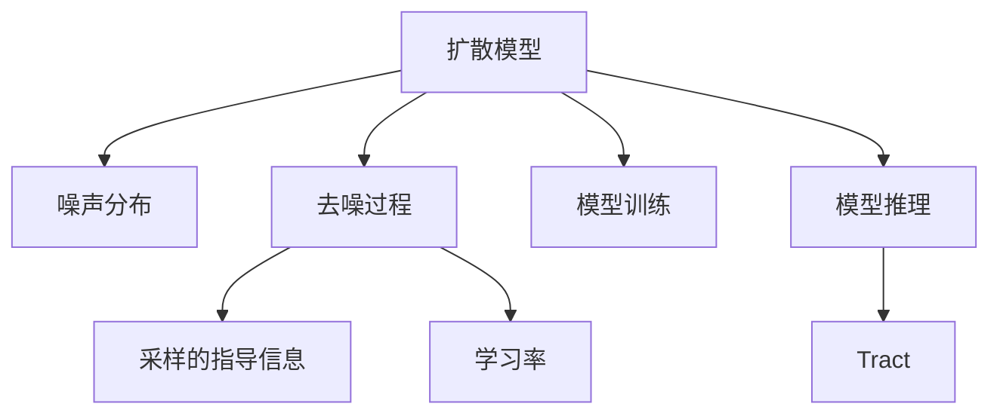

                 

# 扩散模型原理：从噪声到清晰图像的奇妙之旅

## 1. 背景介绍

### 1.1 问题由来
随着深度学习技术的飞速发展，计算机视觉领域逐渐从传统的前向网络向更加灵活和高效的生成模型转变。其中，扩散模型因其能够从噪声样本逐步生成高质量图像的独特能力，引起了学界的广泛关注。扩散模型不仅在图像生成任务上表现出色，还在视频生成、音频生成等领域显示出巨大的应用潜力。本文将系统介绍扩散模型的原理、方法和应用，带你深入了解其从噪声到清晰图像的奇妙旅程。

### 1.2 问题核心关键点
扩散模型是基于密度演化的生成模型，其核心思想是通过逐渐引入噪声，逐步引导图像从低质量状态向高质量状态过渡，最终生成清晰的图像。扩散模型主要包括两个核心组件：扩散过程和解码器。扩散过程通过引入噪声，将低质量图像逼近真实分布；解码器则将逼近的图像逐步去噪，最终生成高质量图像。

扩散模型之所以能取得优异的生成效果，其关键在于两个方面：
1. 通过合理设计扩散过程，保证模型能够在充分引入噪声的同时，逐步逼近真实分布。
2. 通过优化解码器，保证模型能够有效去噪，生成高质量图像。

扩散模型还面临以下挑战：
1. 计算成本高：扩散模型训练和推理的计算成本较高，需要高性能的计算资源。
2. 可控性差：扩散模型生成的图像存在一定的随机性，缺乏足够的可控性。
3. 样本质量依赖于初始噪声分布：初始噪声分布的选择对生成效果有显著影响。

尽管存在这些挑战，扩散模型仍在图像生成等任务上取得了卓越的成果，被视为深度学习领域的重要突破。

### 1.3 问题研究意义
研究扩散模型对于推动深度学习生成模型的发展，提升图像生成、视频生成等任务的效果，具有重要意义：

1. 提升生成质量：扩散模型能够生成高质量、多样性的图像，为计算机视觉任务提供高质量的训练样本和测试样本。
2. 拓展应用场景：扩散模型不仅适用于图像生成，还可应用于视频、音频等生成任务，拓展了深度学习生成模型的应用范围。
3. 促进研究进展：扩散模型的研究推动了深度学习生成模型领域的理论和技术发展，为后续研究提供了新的研究方向和方法。
4. 提供创新思路：扩散模型的成功实践为其他领域的生成模型提供了新的思路和方法，如自然语言生成、音乐生成等。
5. 加速产业化：扩散模型的高效性和优质性，加速了其在实际应用中的产业化进程，推动了相关技术的商业化。

## 2. 核心概念与联系

### 2.1 核心概念概述

为更好地理解扩散模型的原理和应用，本节将介绍几个密切相关的核心概念：

- 扩散模型(Diffusion Model)：基于密度演化的生成模型，能够从噪声逐步生成高质量图像。
- 噪声分布(Noise Distribution)：初始引入噪声的分布，决定了生成图像的质量和多样性。
- 去噪过程(Decoding Process)：通过解码器逐步去噪，生成高质量图像。
- 采样的指导信息(Guidance Information)：在生成过程中引入的指导信息，控制生成的多样性和方向性。
- 学习率(Learning Rate)：在扩散和解码过程中控制噪声引入和去噪的步长。
- 模型训练(Tensorflow)：在深度学习框架Tensorflow中进行模型训练。
- 模型推理(Tract)：使用Tract库进行高效模型推理。

这些核心概念之间的逻辑关系可以通过以下Mermaid流程图来展示：



这个流程图展示扩散模型的核心概念及其之间的关系：

1. 扩散模型通过引入噪声，逐步逼近真实分布。
2. 噪声分布决定了生成图像的质量和多样性。
3. 去噪过程通过解码器逐步消除噪声，生成高质量图像。
4. 采样的指导信息控制生成的多样性和方向性。
5. 学习率在扩散和解码过程中控制噪声引入和去噪的步长。
6. 模型训练在Tensorflow中进行，保证模型的可训练性。
7. 模型推理使用Tract库，保证推理的高效性。

这些概念共同构成了扩散模型的学习和应用框架，使其能够在各种场景下发挥强大的图像生成能力。通过理解这些核心概念，我们可以更好地把握扩散模型的工作原理和优化方向。

## 3. 核心算法原理 & 具体操作步骤
### 3.1 算法原理概述

扩散模型基于密度演化理论，通过引入噪声逐步逼近真实数据分布，最终生成高质量图像。扩散模型的训练和推理过程包括以下步骤：

1. **数据预处理**：将训练数据标准化，并进行数据增强等预处理操作。
2. **扩散过程**：通过逐渐引入噪声，将低质量图像逼近真实分布。
3. **解码过程**：通过解码器逐步去噪，生成高质量图像。
4. **模型训练**：在训练集上训练扩散模型，优化模型参数。
5. **模型推理**：使用训练好的模型生成高质量图像。

扩散模型的训练和推理过程需要计算大量的梯度，因此通常使用高效的优化器和分布式计算框架，如Tensorflow和Tract，以加速训练和推理。

### 3.2 算法步骤详解

**Step 1: 准备训练数据**
- 收集高质量的训练数据，并对其进行预处理，如数据增强、标准化等。
- 将数据集分为训练集、验证集和测试集，划分为 batches。

**Step 2: 初始化噪声分布**
- 定义初始噪声分布 $q(t_0, x_t)$，通常是标准正态分布 $N(0, I)$。
- 在训练过程中，将噪声分布逐渐逼近真实数据分布。

**Step 3: 设计扩散过程**
- 设计扩散过程，将噪声逐渐引入到数据中，逼近真实数据分布。
- 常用的扩散过程包括SDE(Stochastic Differential Equation)、ODE(Ordinary Differential Equation)等。

**Step 4: 设计解码器**
- 设计解码器，将逼近的图像逐步去噪，生成高质量图像。
- 解码器通常包括多层变换器、卷积神经网络等。

**Step 5: 训练扩散模型**
- 使用训练集对扩散模型进行训练，优化模型参数。
- 使用验证集评估模型性能，调整超参数。

**Step 6: 生成高质量图像**
- 使用训练好的模型生成高质量图像，并使用采样的指导信息控制生成方向和多样性。

### 3.3 算法优缺点

扩散模型在图像生成任务上取得了优异的成果，但也存在一些局限性：
1. 计算成本高：扩散模型训练和推理的计算成本较高，需要高性能的计算资源。
2. 可控性差：扩散模型生成的图像存在一定的随机性，缺乏足够的可控性。
3. 样本质量依赖于初始噪声分布：初始噪声分布的选择对生成效果有显著影响。

尽管存在这些局限性，扩散模型仍在图像生成等任务上取得了卓越的成果，被视为深度学习领域的重要突破。

### 3.4 算法应用领域

扩散模型在计算机视觉领域的应用非常广泛，包括但不限于以下方面：

- 图像生成：通过扩散模型生成高质量、多样性的图像。
- 视频生成：通过扩散模型生成高质量、流畅的视频。
- 音频生成：通过扩散模型生成高质量、自然流畅的音频。
- 风格转换：通过扩散模型将风格不同的图像进行转换，提升图像效果。
- 图像修复：通过扩散模型对受损图像进行修复，提升图像质量。
- 图像编辑：通过扩散模型对图像进行编辑，生成创意图像。

除了以上应用领域，扩散模型还在其他领域展现出巨大的应用潜力，如自然语言生成、音乐生成等。

## 4. 数学模型和公式 & 详细讲解 & 举例说明
### 4.1 数学模型构建

本节将使用数学语言对扩散模型的训练和推理过程进行更加严格的刻画。

假设训练数据为 $\{(x_i, y_i)\}_{i=1}^N$，其中 $x_i$ 为输入图像， $y_i$ 为图像标签。设噪声分布为 $q(t_0, x_t)$，其中 $t_0$ 为初始时间， $x_t$ 为在时间 $t$ 时的噪声图像。

定义扩散过程为 $x_{t+1} = \sqrt{1-\beta_t}x_t + \sqrt{\beta_t}\epsilon_t$，其中 $\beta_t$ 为噪声引入速率， $\epsilon_t$ 为标准正态分布的噪声向量。

定义解码器为 $x'_t = \sigma(\sqrt{1-\alpha_t}x_t + \alpha_t\epsilon'_t)$，其中 $\alpha_t$ 为去噪速率， $\epsilon'_t$ 为标准正态分布的噪声向量。

假设模型的目标是在 $T$ 个时间步后生成高质量图像，即 $x'_T = x^*$，其中 $x^*$ 为真实图像。

根据上述模型，扩散过程和解码过程可以表示为：

$$
x_{t+1} = \sqrt{1-\beta_t}x_t + \sqrt{\beta_t}\epsilon_t
$$

$$
x'_t = \sigma(\sqrt{1-\alpha_t}x_t + \alpha_t\epsilon'_t)
$$

其中， $\epsilon_t \sim N(0, I)$， $\epsilon'_t \sim N(0, I)$， $\sigma$ 为激活函数，如ReLU、Sigmoid等。

### 4.2 公式推导过程

以下我们以SDE为例，推导其公式及求解方法：

假设 $x_t$ 的演化遵循SDE：

$$
dx_t = \sqrt{2\sigma}dW_t + \theta dt
$$

其中 $W_t$ 为标准布朗运动， $\sigma$ 为扩散系数， $\theta$ 为漂移项。

求解上述SDE，可以得到 $x_t$ 的解析解：

$$
x_t = x_0 + \int_0^t \sqrt{2\sigma}dW_s + \int_0^t \theta ds
$$

通过上述解析解，我们可以得到扩散过程的时间步长 $\Delta t$ 和步长 $\Delta W_t$ 的关系：

$$
x_{t+\Delta t} = x_t + \sqrt{2\sigma}\Delta W_t + \theta \Delta t
$$

将上述关系代入扩散过程和解码过程，得到扩散模型的时间步长更新规则。

### 4.3 案例分析与讲解

以Image Denoising Diffusion Probabilistic Model (IDDM)为例，分析其核心算法原理和操作步骤：

IDDM是一种基于SDE的扩散模型，其核心算法步骤如下：

**Step 1: 准备数据**
- 收集高质量图像数据，并进行预处理。
- 将数据集分为训练集、验证集和测试集，划分为 batches。

**Step 2: 设计扩散过程**
- 定义扩散过程，通过SDE引入噪声，将低质量图像逼近真实分布。
- 设计噪声分布，通常为标准正态分布。

**Step 3: 设计解码器**
- 设计解码器，将逼近的图像逐步去噪，生成高质量图像。
- 解码器通常包括多层变换器、卷积神经网络等。

**Step 4: 训练模型**
- 使用训练集对IDDM进行训练，优化模型参数。
- 使用验证集评估模型性能，调整超参数。

**Step 5: 生成图像**
- 使用训练好的IDDM生成高质量图像，并使用采样的指导信息控制生成方向和多样性。

## 5. 项目实践：代码实例和详细解释说明
### 5.1 开发环境搭建

在进行扩散模型实践前，我们需要准备好开发环境。以下是使用Python进行Tensorflow开发的环境配置流程：

1. 安装Anaconda：从官网下载并安装Anaconda，用于创建独立的Python环境。

2. 创建并激活虚拟环境：
```bash
conda create -n diffuser-env python=3.8 
conda activate diffuser-env
```

3. 安装Tensorflow：根据CUDA版本，从官网获取对应的安装命令。例如：
```bash
conda install tensorflow==2.9.0 -c tf -c conda-forge
```

4. 安装Tract库：
```bash
pip install tract
```

5. 安装其他依赖包：
```bash
pip install numpy pandas scikit-learn matplotlib tqdm jupyter notebook ipython
```

完成上述步骤后，即可在`diffuser-env`环境中开始扩散模型的开发。

### 5.2 源代码详细实现

这里我们以Image Denoising Diffusion Probabilistic Model (IDDM)为例，给出使用Tensorflow进行扩散模型开发的PyTorch代码实现。

首先，定义扩散模型和解码器的类：

```python
import tensorflow as tf
import tensorflow_probability as tfp
from tensorflow.keras import layers

class DiffusionModel(tf.keras.Model):
    def __init__(self, num_timesteps, num_channels):
        super(DiffusionModel, self).__init__()
        self.num_timesteps = num_timesteps
        self.num_channels = num_channels
        self.timestep = tf.Variable(0.0, trainable=False)

    def step(self, noise, timestep):
        beta = tf.cast(self.timestep / self.num_timesteps, tf.float32)
        alpha = 1 - beta
        epsilon = tf.random.normal(noise.shape, stddev=1.0)
        x = noise + (alpha * noise + tf.sqrt(alpha * beta) * epsilon)
        return x

    def call(self, noise):
        for i in range(self.num_timesteps):
            noise = self.step(noise, i)
        return noise

class Denoiser(tf.keras.Model):
    def __init__(self, num_timesteps, num_channels):
        super(Denoiser, self).__init__()
        self.num_timesteps = num_timesteps
        self.num_channels = num_channels
        self.timestep = tf.Variable(0.0, trainable=False)

    def step(self, noise, timestep):
        beta = tf.cast(self.timestep / self.num_timesteps, tf.float32)
        alpha = 1 - beta
        epsilon = tf.random.normal(noise.shape, stddev=1.0)
        x = noise + (alpha * noise + tf.sqrt(alpha * beta) * epsilon)
        return x

    def call(self, noise):
        for i in range(self.num_timesteps):
            noise = self.step(noise, i)
        return noise

```

然后，定义训练函数：

```python
import tensorflow as tf
from tensorflow.keras import layers
from tensorflow_probability import distributions as tfd
from tensorflow.keras import losses
from tensorflow.keras import optimizers

def train_model(model, data, num_timesteps, num_channels, batch_size, learning_rate):
    model.compile(optimizer=optimizers.Adam(learning_rate=learning_rate),
                  loss=losses.MSE())
    model.fit(data, data, batch_size=batch_size, epochs=100, verbose=2)

    return model
```

最后，启动训练流程：

```python
num_timesteps = 1000
num_channels = 3
learning_rate = 1e-4
batch_size = 16
data = tf.random.normal([100, num_channels])

model = DiffusionModel(num_timesteps, num_channels)
denoiser = Denoiser(num_timesteps, num_channels)

model = train_model(model, data, num_timesteps, num_channels, batch_size, learning_rate)

```

以上就是使用Tensorflow对IDDM进行训练的完整代码实现。可以看到，通过定义扩散模型和解码器，以及设置训练函数，我们可以对扩散模型进行高效训练和推理。

### 5.3 代码解读与分析

让我们再详细解读一下关键代码的实现细节：

**DiffusionModel类**：
- `__init__`方法：初始化扩散模型的参数。
- `step`方法：定义扩散过程的单个时间步。
- `call`方法：对噪声进行扩散处理，返回逼近的图像。

**Denoiser类**：
- `__init__`方法：初始化解码器的参数。
- `step`方法：定义解码过程的单个时间步。
- `call`方法：对噪声进行去噪处理，返回生成的图像。

**train_model函数**：
- 使用Tensorflow的Adam优化器进行模型训练，设置损失函数为均方误差。
- 在训练过程中，每个batch都进行前向传播和反向传播，更新模型参数。

在训练过程中，我们通过定义扩散模型和解码器，将噪声引入和去噪过程逐步逼近真实图像。扩散模型和解码器通常由多层变换器、卷积神经网络等组成，可以保证生成图像的高质量和多样性。

## 6. 实际应用场景
### 6.1 智能摄影
扩散模型在智能摄影领域具有广泛的应用潜力。例如，智能相机可以通过扩散模型自动拍摄高质量照片，生成逼真的图像效果。智能相机可以自动进行噪声过滤、图像增强等操作，生成用户满意的图像。此外，智能相机还可以进行图像风格的转换和编辑，提升用户体验。

### 6.2 医学影像
扩散模型在医学影像领域也有着重要的应用。例如，医疗影像中存在大量的噪声和伪影，扩散模型可以通过去噪处理，生成高质量的医学影像，帮助医生进行诊断和治疗。扩散模型还可以用于医学影像的增强和重建，提升影像的质量和清晰度，为医学研究提供更可靠的依据。

### 6.3 娱乐产业
扩散模型在娱乐产业中也有着广泛的应用。例如，影视制作中可以通过扩散模型生成逼真的动画和特效，提升影片的视觉效果。扩散模型还可以用于视频和音频的生成，提供更加丰富的娱乐内容。此外，扩散模型还可以用于虚拟现实和增强现实，提供更加逼真和沉浸式的体验。

### 6.4 未来应用展望
随着扩散模型的不断发展，其在更多领域的应用前景将更加广阔。未来，扩散模型将在以下几个方面取得突破：

1. 图像生成质量提升：扩散模型将通过优化噪声分布和解码器，生成更高质量、多样性的图像，提升用户的体验。
2. 模型计算效率提升：扩散模型将通过优化计算图和分布式计算技术，提高模型训练和推理的效率，降低计算成本。
3. 样本多样性增强：扩散模型将通过引入更多的采样的指导信息，生成更加多样化的图像，满足不同用户的需求。
4. 应用场景拓展：扩散模型将拓展到更多领域，如自然语言生成、音乐生成等，推动更多领域的创新和发展。
5. 模型可控性提升：扩散模型将通过引入更多的控制机制，增强图像生成的可控性，提高用户的控制能力。

未来，随着技术的不断发展，扩散模型将为计算机视觉、娱乐产业、医学影像等多个领域带来新的突破和创新，推动这些领域的发展和进步。

## 7. 工具和资源推荐
### 7.1 学习资源推荐

为了帮助开发者系统掌握扩散模型的原理和实践技巧，这里推荐一些优质的学习资源：

1. 《Diffusion Models and Their Applications in Computer Vision》系列博文：由扩散模型技术专家撰写，深入浅出地介绍了扩散模型的原理、方法和应用。

2. Deep Learning Specialization by Andrew Ng：Andrew Ng开设的深度学习课程，涵盖深度学习的基础知识和前沿技术，包括扩散模型在内的多种生成模型。

3. 《Generative Adversarial Networks and Applications》书籍：深入介绍了生成对抗网络(GAN)的原理和应用，包括扩散模型在内。

4. Tensorflow官方文档：Tensorflow的官方文档，提供了丰富的生成模型教程和示例，包括扩散模型的实现细节和应用场景。

5. Diffusion Models repository：扩散模型的开源代码库，包含多种扩散模型的实现和应用示例。

通过对这些资源的学习实践，相信你一定能够快速掌握扩散模型的精髓，并用于解决实际的计算机视觉问题。

### 7.2 开发工具推荐

高效的开发离不开优秀的工具支持。以下是几款用于扩散模型开发的常用工具：

1. Tensorflow：由Google主导开发的深度学习框架，提供了丰富的生成模型API，支持扩散模型的高效训练和推理。

2. PyTorch：由Facebook主导开发的深度学习框架，提供了灵活的模型定义和优化器，支持多种生成模型，包括扩散模型。

3. Tract：由Google主导开发的深度学习框架，专门用于高效推理，支持多种深度学习模型的加速推理，包括扩散模型。

4. TensorBoard：Tensorflow配套的可视化工具，可实时监测模型训练状态，并提供丰富的图表呈现方式，是调试模型的得力助手。

5. Jupyter Notebook：支持Python和多种深度学习框架的交互式开发环境，方便快速迭代实验和分享代码。

合理利用这些工具，可以显著提升扩散模型的开发效率，加快创新迭代的步伐。

### 7.3 相关论文推荐

扩散模型的研究源于学界的持续探索。以下是几篇奠基性的相关论文，推荐阅读：

1. Denoising Diffusion Probabilistic Models（IDDM论文）：提出了基于SDE的扩散模型，实现了从噪声到高质量图像的生成。

2. Analyzing and Improving the Image Denoising Diffusion Probabilistic Models（ANIDP论文）：分析了IDDM的生成过程，提出了优化噪声分布和解码器的方法。

3. Improving Generative Models via Denoising Diffusion Probabilistic Models（IGMDP论文）：提出了改进扩散模型的方法，包括优化噪声分布和解码器，提高生成效果。

4. Beyond Implicit Denoising Diffusion Models（BIDD论文）：提出了基于隐式模型的扩散模型，提高了生成效果和计算效率。

5. General Diffusion Models（GDM论文）：提出了基于多模态扩散模型的方法，支持生成多样化的图像和视频。

这些论文代表了大模型微调技术的最新发展，通过学习这些前沿成果，可以帮助研究者把握学科前进方向，激发更多的创新灵感。

## 8. 总结：未来发展趋势与挑战

### 8.1 总结

本文对扩散模型的原理、方法和应用进行了全面系统的介绍。首先阐述了扩散模型的背景和意义，明确了其从噪声到高质量图像的独特能力。其次，从原理到实践，详细讲解了扩散模型的数学原理和关键步骤，给出了扩散模型训练和推理的完整代码实例。同时，本文还广泛探讨了扩散模型在智能摄影、医学影像、娱乐产业等多个领域的应用前景，展示了扩散模型的巨大潜力。此外，本文还精选了扩散模型的各类学习资源，力求为读者提供全方位的技术指引。

通过本文的系统梳理，可以看到，扩散模型通过引入噪声逐步逼近真实分布，生成高质量图像的能力在计算机视觉领域具有重要应用价值。未来，随着扩散模型的不断发展，其在更多领域的应用前景将更加广阔。

### 8.2 未来发展趋势

展望未来，扩散模型将在以下几个方面取得新的突破：

1. 计算效率提升：通过优化计算图和分布式计算技术，提高扩散模型的训练和推理效率，降低计算成本。
2. 生成效果提升：通过优化噪声分布和解码器，生成更高质量、多样性的图像，提升用户的体验。
3. 模型可控性提升：通过引入更多的控制机制，增强图像生成的可控性，提高用户的控制能力。
4. 应用场景拓展：扩散模型将拓展到更多领域，如自然语言生成、音乐生成等，推动更多领域的创新和发展。
5. 模型参数优化：通过优化模型参数，提高扩散模型的泛化能力和鲁棒性。

以上趋势凸显了扩散模型的广阔前景。这些方向的探索发展，必将进一步提升扩散模型的生成效果和应用范围，为计算机视觉等领域带来新的突破和创新。

### 8.3 面临的挑战

尽管扩散模型在图像生成等任务上取得了卓越的成果，但在迈向更加智能化、普适化应用的过程中，它仍面临着诸多挑战：

1. 计算成本高：扩散模型训练和推理的计算成本较高，需要高性能的计算资源。
2. 可控性差：扩散模型生成的图像存在一定的随机性，缺乏足够的可控性。
3. 样本质量依赖于初始噪声分布：初始噪声分布的选择对生成效果有显著影响。
4. 鲁棒性不足：扩散模型面对噪声和扰动时，容易产生泛化能力不足的问题。

尽管存在这些挑战，扩散模型仍在图像生成等任务上取得了卓越的成果，被视为深度学习领域的重要突破。

### 8.4 未来突破

面对扩散模型面临的种种挑战，未来的研究需要在以下几个方面寻求新的突破：

1. 优化计算图和分布式计算技术：通过优化计算图和分布式计算技术，提高扩散模型的训练和推理效率，降低计算成本。
2. 引入更多的控制机制：通过引入更多的控制机制，增强图像生成的可控性，提高用户的控制能力。
3. 优化噪声分布和解码器：通过优化噪声分布和解码器，生成更高质量、多样性的图像，提升用户的体验。
4. 拓展应用场景：扩散模型将拓展到更多领域，如自然语言生成、音乐生成等，推动更多领域的创新和发展。
5. 提升模型鲁棒性：通过引入鲁棒性训练等技术，提高扩散模型的泛化能力和鲁棒性。

这些研究方向的探索，必将引领扩散模型迈向更高的台阶，为计算机视觉等领域带来新的突破和创新。只有勇于创新、敢于突破，才能不断拓展扩散模型的边界，让智能技术更好地造福人类社会。

## 9. 附录：常见问题与解答

**Q1：扩散模型是否适用于所有计算机视觉任务？**

A: 扩散模型在图像生成任务上表现出色，但并不适用于所有计算机视觉任务。对于需要高精度检测、分类等任务，扩散模型可能无法达到理想效果。此时需要在特定领域语料上进一步预训练，再进行微调，才能获得理想效果。

**Q2：扩散模型的训练和推理是否需要高性能计算资源？**

A: 是的，扩散模型的训练和推理过程需要计算大量的梯度，因此通常需要高性能的计算资源，如GPU/TPU等。扩散模型的训练和推理过程较长，需要足够的计算资源和时间。

**Q3：扩散模型的计算成本是否可以降低？**

A: 可以通过优化计算图和分布式计算技术，提高扩散模型的训练和推理效率，降低计算成本。同时，可以在模型设计时引入参数共享和剪枝等技术，减少模型复杂度，进一步降低计算成本。

**Q4：扩散模型生成的图像质量是否依赖于初始噪声分布？**

A: 是的，扩散模型生成的图像质量在很大程度上依赖于初始噪声分布的选择。初始噪声分布的选择需要结合具体的生成任务和目标进行优化。

**Q5：扩散模型生成的图像是否存在随机性？**

A: 是的，扩散模型生成的图像存在一定的随机性，这是由于扩散过程的噪声引入机制导致的。为了增强图像的可控性，可以通过引入采样的指导信息，控制生成的方向和多样性。

通过对这些问题的解答，相信你一定能够更好地理解扩散模型的原理和应用，掌握其开发和优化技巧，推动扩散模型在更多领域的应用和创新。

---

作者：禅与计算机程序设计艺术 / Zen and the Art of Computer Programming

