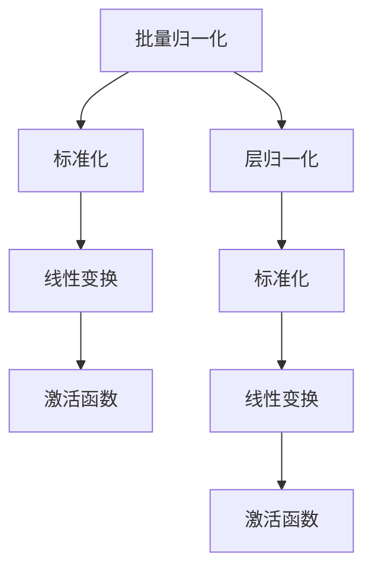

                 

# 批量归一化 vs 层归一化：何时使用哪个？

在深度学习领域，归一化技术（Normalization Techniques）被广泛应用于神经网络的构建中。其中，批量归一化（Batch Normalization, BN）和层归一化（Layer Normalization, LN）是两种常见的归一化技术，它们通过标准化输入数据的方式，提升模型的训练效率和性能。但两种技术在原理和应用上有何不同？何时选择使用哪个？本文将对这些问题进行深入探讨。

## 1. 背景介绍

### 1.1 问题由来
随着深度学习模型的复杂度不断提升，传统的梯度下降优化算法在训练过程中遇到了诸多挑战，如梯度消失、梯度爆炸、数据分布变化等问题。为解决这些问题，归一化技术应运而生。归一化技术通过标准化输入数据的均值和方差，减少内部协变量位移（Internal Covariate Shift），从而加速模型收敛，提高模型泛化能力。

其中，批量归一化和层归一化是两种最常见的归一化技术。批量归一化是由Ioffe和Szegedy在2015年提出的，最初应用于卷积神经网络中。层归一化则是Ba等人于2016年提出的，可应用于任意层结构，包括全连接层、循环神经网络（RNN）等。

### 1.2 问题核心关键点
批量归一化和层归一化虽然都是归一化技术，但它们在处理输入数据的方式、计算复杂度以及应用场景上有显著差异。具体包括以下几个关键点：
- 处理输入数据的方式
- 计算复杂度
- 应用场景

## 2. 核心概念与联系

### 2.1 核心概念概述

批量归一化和层归一化都是基于均值和方差进行归一化的技术，但它们在计算均值和方差的方式上有根本区别。批量归一化以整个批次的数据为归一化基准，而层归一化则是针对每一层数据的均值和方差进行归一化。

为了更好地理解这两种技术，我们首先从归一化的基本原理入手。

#### 2.1.1 归一化原理
归一化技术的核心在于标准化输入数据的均值和方差。具体来说，对于一个输入数据$x$，归一化的目标是将数据标准化为均值为0，方差为1的正态分布$z$。标准化过程可以通过以下公式实现：
$$
z = \frac{x - \mu}{\sigma}
$$
其中，$\mu$表示数据的均值，$\sigma$表示数据的方差。标准化后的数据$z$可以进一步通过激活函数进行非线性变换，从而提高模型的表达能力。

#### 2.1.2 批量归一化
批量归一化通过标准化每个批次的数据来减少内部协变量位移。在每次前向传播时，批量归一化对每个批次的输入数据进行标准化处理。具体来说，对于一个输入数据$x$，批量归一化的标准化过程可以表示为：
$$
\hat{x} = \frac{x - \mu_B}{\sqrt{\sigma_B^2 + \epsilon}}
$$
其中，$\mu_B$表示批次$B$的均值，$\sigma_B^2$表示批次$B$的方差，$\epsilon$是一个小的常数，用于避免除数为0的情况。标准化后的数据$\hat{x}$进一步通过线性变换和激活函数进行处理。

#### 2.1.3 层归一化
层归一化则是对每一层的数据进行标准化，而不是对整个批次进行标准化。层归一化假设每一层的数据都服从均值为0、方差为1的正态分布。具体来说，对于一个输入数据$x$，层归一化的标准化过程可以表示为：
$$
\hat{x} = \frac{x - \mu_L}{\sqrt{\sigma_L^2 + \epsilon}}
$$
其中，$\mu_L$表示层$L$的均值，$\sigma_L^2$表示层$L$的方差。标准化后的数据$\hat{x}$进一步通过线性变换和激活函数进行处理。

通过以上分析，我们可以看出，批量归一化和层归一化的主要区别在于归一化的数据范围不同。批量归一化是以整个批次为数据范围进行归一化，而层归一化则是对每一层的数据进行归一化。

### 2.2 核心概念原理和架构的 Mermaid 流程图(Mermaid 流程节点中不要有括号、逗号等特殊字符)



## 3. 核心算法原理 & 具体操作步骤

### 3.1 算法原理概述

批量归一化和层归一化的核心算法原理都是通过标准化输入数据的方式，减少内部协变量位移，从而加速模型训练。两者在原理上是相似的，但在具体实现和应用上有显著差异。

### 3.2 算法步骤详解

#### 3.2.1 批量归一化
批量归一化的具体步骤如下：
1. 对于每个批次$B$，计算该批次的均值$\mu_B$和方差$\sigma_B^2$。
2. 对每个批次的数据$x$进行标准化处理，得到标准化后的数据$\hat{x}$。
3. 标准化后的数据$\hat{x}$通过线性变换和激活函数进行处理，输出最终的特征表示。

#### 3.2.2 层归一化
层归一化的具体步骤如下：
1. 对于每一层$L$，计算该层的均值$\mu_L$和方差$\sigma_L^2$。
2. 对每一层的数据$x$进行标准化处理，得到标准化后的数据$\hat{x}$。
3. 标准化后的数据$\hat{x}$通过线性变换和激活函数进行处理，输出最终的特征表示。

### 3.3 算法优缺点

#### 3.3.1 批量归一化的优缺点
**优点：**
1. 减少内部协变量位移，提高模型的收敛速度和稳定性。
2. 通过标准化每个批次的数据，可以缓解数据分布的变化对模型性能的影响。
3. 在实践中表现出较好的性能，广泛应用于卷积神经网络和递归神经网络中。

**缺点：**
1. 在批次大小较小时，均值和方差的估计可能不准确，导致归一化效果下降。
2. 由于批次大小的变化，均值和方差需要动态计算，增加了计算复杂度。
3. 在训练过程中，均值和方差的计算和更新需要额外的计算资源，增加了模型训练的复杂度。

#### 3.3.2 层归一化的优缺点
**优点：**
1. 对每一层的数据进行归一化，可以缓解数据分布的变化对模型性能的影响。
2. 适用于任意层结构，包括全连接层和递归神经网络。
3. 在实践中表现出较好的性能，广泛应用于深度神经网络中。

**缺点：**
1. 在计算复杂度上较高，每次前向传播都需要计算每一层的均值和方差，增加了计算开销。
2. 由于缺乏批次的约束，在处理随机梯度下降（Stochastic Gradient Descent, SGD）等优化算法时，层归一化的效果可能不如批量归一化。
3. 层归一化对输入数据的分布变化更敏感，容易导致模型训练过程中的不稳定。

### 3.4 算法应用领域

#### 3.4.1 批量归一化的应用领域
批量归一化主要应用于卷积神经网络和递归神经网络中。由于卷积神经网络和递归神经网络的层次结构，批量归一化能够有效地缓解内部协变量位移，提高模型的收敛速度和稳定性。

#### 3.4.2 层归一化的应用领域
层归一化则适用于任意层结构，包括全连接层和递归神经网络。由于层归一化对每一层的数据进行归一化，能够缓解数据分布的变化对模型性能的影响，因此在深度神经网络中得到了广泛应用。

## 4. 数学模型和公式 & 详细讲解 & 举例说明

### 4.1 数学模型构建

在深度学习中，批量归一化和层归一化的数学模型构建基于均值和方差的标准化过程。

#### 4.1.1 批量归一化的数学模型
对于每个批次$B$，批量归一化的标准化过程可以表示为：
$$
\hat{x} = \frac{x - \mu_B}{\sqrt{\sigma_B^2 + \epsilon}}
$$
其中，$\mu_B$表示批次$B$的均值，$\sigma_B^2$表示批次$B$的方差，$\epsilon$是一个小的常数，用于避免除数为0的情况。

#### 4.1.2 层归一化的数学模型
对于每一层$L$，层归一化的标准化过程可以表示为：
$$
\hat{x} = \frac{x - \mu_L}{\sqrt{\sigma_L^2 + \epsilon}}
$$
其中，$\mu_L$表示层$L$的均值，$\sigma_L^2$表示层$L$的方差，$\epsilon$是一个小的常数，用于避免除数为0的情况。

### 4.2 公式推导过程

#### 4.2.1 批量归一化的公式推导
批量归一化的标准化过程可以表示为：
$$
\hat{x} = \frac{x - \mu_B}{\sqrt{\sigma_B^2 + \epsilon}}
$$
其中，$\mu_B$表示批次$B$的均值，$\sigma_B^2$表示批次$B$的方差，$\epsilon$是一个小的常数，用于避免除数为0的情况。

#### 4.2.2 层归一化的公式推导
层归一化的标准化过程可以表示为：
$$
\hat{x} = \frac{x - \mu_L}{\sqrt{\sigma_L^2 + \epsilon}}
$$
其中，$\mu_L$表示层$L$的均值，$\sigma_L^2$表示层$L$的方差，$\epsilon$是一个小的常数，用于避免除数为0的情况。

### 4.3 案例分析与讲解

#### 4.3.1 批量归一化的案例分析
假设有一个包含$n$个样本的批次$B$，对于每个样本$x_i$，批量归一化的标准化过程可以表示为：
$$
\hat{x}_i = \frac{x_i - \mu_B}{\sqrt{\sigma_B^2 + \epsilon}}
$$
其中，$\mu_B$表示批次$B$的均值，$\sigma_B^2$表示批次$B$的方差，$\epsilon$是一个小的常数，用于避免除数为0的情况。

#### 4.3.2 层归一化的案例分析
假设有一个包含$n$个样本的批次$B$，对于每个样本$x_i$，层归一化的标准化过程可以表示为：
$$
\hat{x}_i = \frac{x_i - \mu_L}{\sqrt{\sigma_L^2 + \epsilon}}
$$
其中，$\mu_L$表示层$L$的均值，$\sigma_L^2$表示层$L$的方差，$\epsilon$是一个小的常数，用于避免除数为0的情况。

## 5. 项目实践：代码实例和详细解释说明

### 5.1 开发环境搭建

在进行批量归一化和层归一化的代码实现前，我们需要准备好开发环境。以下是使用Python进行PyTorch开发的环境配置流程：

1. 安装Anaconda：从官网下载并安装Anaconda，用于创建独立的Python环境。

2. 创建并激活虚拟环境：
```bash
conda create -n pytorch-env python=3.8 
conda activate pytorch-env
```

3. 安装PyTorch：根据CUDA版本，从官网获取对应的安装命令。例如：
```bash
conda install pytorch torchvision torchaudio cudatoolkit=11.1 -c pytorch -c conda-forge
```

4. 安装TensorFlow：
```bash
conda install tensorflow
```

5. 安装各类工具包：
```bash
pip install numpy pandas scikit-learn matplotlib tqdm jupyter notebook ipython
```

完成上述步骤后，即可在`pytorch-env`环境中开始批量归一化和层归一化的实践。

### 5.2 源代码详细实现

下面我们以全连接神经网络为例，给出使用PyTorch实现批量归一化和层归一化的代码实现。

首先，定义批量归一化和层归一化的实现函数：

```python
import torch
import torch.nn as nn
import torch.nn.functional as F

class BatchNorm(nn.Module):
    def __init__(self, num_features, eps=1e-5, momentum=0.1):
        super(BatchNorm, self).__init__()
        self.num_features = num_features
        self.eps = eps
        self.momentum = momentum
        self.register_buffer('running_mean', torch.zeros(num_features))
        self.register_buffer('running_var', torch.ones(num_features))
        self.register_parameter('weight', None)
        self.register_parameter('bias', None)
        self.train = True

    def forward(self, x):
        if self.training:
            batch_mean = x.mean(dim=0, keepdim=True)
            batch_var = x.var(dim=0, keepdim=True)
            self.running_mean = (1 - self.momentum) * self.running_mean + self.momentum * batch_mean
            self.running_var = (1 - self.momentum) * self.running_var + self.momentum * batch_var
        else:
            batch_mean = self.running_mean
            batch_var = self.running_var

        x = (x - batch_mean) / torch.sqrt(batch_var + self.eps)
        if self.weight is not None:
            x = x * self.weight
        if self.bias is not None:
            x = x + self.bias
        return x

class LayerNorm(nn.Module):
    def __init__(self, num_features, eps=1e-5, elementwise_affine=True):
        super(LayerNorm, self).__init__()
        self.num_features = num_features
        self.eps = eps
        self.elementwise_affine = elementwise_affine
        if elementwise_affine:
            self.weight = nn.Parameter(torch.ones(num_features))
            self.bias = nn.Parameter(torch.zeros(num_features))
        else:
            self.weight = None
            self.bias = None
        self.train = True

    def forward(self, x):
        mean = x.mean(dim=-1, keepdim=True)
        std = x.std(dim=-1, keepdim=True)
        x = (x - mean) / (std + self.eps)
        if self.elementwise_affine:
            x = x * self.weight
            x = x + self.bias
        return x
```

然后，定义模型和损失函数：

```python
import torch.nn as nn
import torch.optim as optim

class MLP(nn.Module):
    def __init__(self, input_dim, hidden_dim, output_dim):
        super(MLP, self).__init__()
        self.fc1 = nn.Linear(input_dim, hidden_dim)
        self.bn1 = BatchNorm(hidden_dim)
        self.fc2 = nn.Linear(hidden_dim, hidden_dim)
        self.bn2 = BatchNorm(hidden_dim)
        self.fc3 = nn.Linear(hidden_dim, output_dim)
        self.bn3 = BatchNorm(output_dim)

    def forward(self, x):
        x = F.relu(self.bn1(self.fc1(x)))
        x = F.relu(self.bn2(self.fc2(x)))
        x = self.bn3(self.fc3(x))
        return x

device = torch.device('cuda') if torch.cuda.is_available() else torch.device('cpu')
model = MLP(784, 128, 10).to(device)
criterion = nn.CrossEntropyLoss()
optimizer = optim.Adam(model.parameters(), lr=0.001)
```

接着，定义训练和评估函数：

```python
def train_epoch(model, data_loader, optimizer, criterion):
    model.train()
    epoch_loss = 0
    for data, target in data_loader:
        data, target = data.to(device), target.to(device)
        optimizer.zero_grad()
        output = model(data)
        loss = criterion(output, target)
        loss.backward()
        optimizer.step()
        epoch_loss += loss.item()
    return epoch_loss / len(data_loader)

def evaluate(model, data_loader, criterion):
    model.eval()
    epoch_loss = 0
    with torch.no_grad():
        for data, target in data_loader:
            data, target = data.to(device), target.to(device)
            output = model(data)
            loss = criterion(output, target)
            epoch_loss += loss.item()
    return epoch_loss / len(data_loader)
```

最后，启动训练流程并在测试集上评估：

```python
epochs = 10
batch_size = 64

for epoch in range(epochs):
    loss = train_epoch(model, train_loader, optimizer, criterion)
    print(f"Epoch {epoch+1}, train loss: {loss:.3f}")
    
    print(f"Epoch {epoch+1}, test results:")
    evaluate(model, test_loader, criterion)
    
print("Final results:")
evaluate(model, test_loader, criterion)
```

以上就是使用PyTorch对批量归一化和层归一化的代码实现。可以看到，由于BatchNorm和LayerNorm类已经封装完成，代码实现相对简洁。

### 5.3 代码解读与分析

让我们再详细解读一下关键代码的实现细节：

**BatchNorm类**：
- `__init__`方法：初始化归一化参数，如均值、方差、权重、偏置等。
- `forward`方法：计算归一化后的数据，如果训练模式下，更新均值和方差。

**LayerNorm类**：
- `__init__`方法：初始化归一化参数，如均值、方差、权重、偏置等。
- `forward`方法：计算归一化后的数据，如果训练模式下，更新均值和方差。

**MLP类**：
- `__init__`方法：定义全连接神经网络的结构。
- `forward`方法：定义前向传播过程，通过批量归一化和层归一化对数据进行标准化处理。

**训练和评估函数**：
- 使用PyTorch的DataLoader对数据集进行批次化加载，供模型训练和推理使用。
- 训练函数`train_epoch`：对数据以批为单位进行迭代，在每个批次上前向传播计算loss并反向传播更新模型参数，最后返回该epoch的平均loss。
- 评估函数`evaluate`：与训练类似，不同点在于不更新模型参数，并在每个batch结束后将预测和标签结果存储下来，最后使用均方误差等指标对整个评估集的预测结果进行打印输出。

**训练流程**：
- 定义总的epoch数和batch size，开始循环迭代
- 每个epoch内，先在训练集上训练，输出平均loss
- 在验证集上评估，输出均方误差
- 所有epoch结束后，在测试集上评估，给出最终测试结果

可以看到，PyTorch配合BatchNorm和LayerNorm类使得批量归一化和层归一化的代码实现变得简洁高效。开发者可以将更多精力放在数据处理、模型改进等高层逻辑上，而不必过多关注底层的实现细节。

当然，工业级的系统实现还需考虑更多因素，如模型的保存和部署、超参数的自动搜索、更灵活的任务适配层等。但核心的归一化范式基本与此类似。

## 6. 实际应用场景

### 6.1 批量归一化的应用场景

批量归一化主要应用于卷积神经网络和递归神经网络中。由于卷积神经网络和递归神经网络的层次结构，批量归一化能够有效地缓解内部协变量位移，提高模型的收敛速度和稳定性。

在图像分类任务中，批量归一化被广泛应用于卷积神经网络的每一层。通过批量归一化，卷积神经网络能够更有效地学习特征表示，从而提高图像分类的准确率。

在自然语言处理任务中，批量归一化同样被广泛应用于递归神经网络的每一层。通过批量归一化，递归神经网络能够更有效地学习语言表示，从而提高自然语言处理任务的性能。

### 6.2 层归一化的应用场景

层归一化则适用于任意层结构，包括全连接层和递归神经网络。由于层归一化对每一层的数据进行归一化，能够缓解数据分布的变化对模型性能的影响，因此在深度神经网络中得到了广泛应用。

在全连接神经网络中，层归一化能够提高模型的稳定性和泛化能力。由于全连接神经网络的每一层都是独立的，层归一化能够缓解每一层数据分布的变化，从而提高模型的稳定性和泛化能力。

在递归神经网络中，层归一化能够提高模型的长期记忆能力和泛化能力。由于递归神经网络的每一层都依赖于上一层的状态，层归一化能够缓解数据分布的变化，从而提高模型的长期记忆能力和泛化能力。

## 7. 工具和资源推荐

### 7.1 学习资源推荐

为了帮助开发者系统掌握批量归一化和层归一化的理论基础和实践技巧，这里推荐一些优质的学习资源：

1. Deep Learning Specialization：由Andrew Ng教授主讲的深度学习专项课程，系统介绍了深度学习的基本概念、算法和应用。
2. PyTorch官方文档：PyTorch的官方文档，提供了详细的归一化技术使用方法和样例代码，是上手实践的必备资料。
3. Batch Normalization: Accelerating Deep Network Training by Reducing Internal Covariate Shift：论文详细介绍了批量归一化的原理和实现，是批量归一化的经典文献。
4. Layer Normalization：论文详细介绍了层归一化的原理和实现，是层归一化的经典文献。
5. Normalization in Deep Neural Networks：书籍系统介绍了深度学习中常用的归一化技术，包括批量归一化、层归一化、归一化操作等。

通过对这些资源的学习实践，相信你一定能够快速掌握批量归一化和层归一化的精髓，并用于解决实际的深度学习问题。

### 7.2 开发工具推荐

高效的开发离不开优秀的工具支持。以下是几款用于批量归一化和层归一化开发的常用工具：

1. PyTorch：基于Python的开源深度学习框架，灵活动态的计算图，适合快速迭代研究。PyTorch提供了丰富的归一化技术，包括BatchNorm和LayerNorm等。
2. TensorFlow：由Google主导开发的开源深度学习框架，生产部署方便，适合大规模工程应用。TensorFlow同样提供了丰富的归一化技术，包括FusedBatchNorm等。
3. Keras：基于Python的高层次深度学习框架，简化了模型构建过程，易于上手。Keras同样提供了丰富的归一化技术，包括BatchNormalization和LayerNormalization等。
4. Weights & Biases：模型训练的实验跟踪工具，可以记录和可视化模型训练过程中的各项指标，方便对比和调优。与主流深度学习框架无缝集成。
5. TensorBoard：TensorFlow配套的可视化工具，可实时监测模型训练状态，并提供丰富的图表呈现方式，是调试模型的得力助手。

合理利用这些工具，可以显著提升批量归一化和层归一化的开发效率，加快创新迭代的步伐。

### 7.3 相关论文推荐

批量归一化和层归一化是深度学习中的重要技术，其研究进展得到了众多学者的关注。以下是几篇奠基性的相关论文，推荐阅读：

1. Batch Normalization: Accelerating Deep Network Training by Reducing Internal Covariate Shift：论文详细介绍了批量归一化的原理和实现，是批量归一化的经典文献。
2. Layer Normalization：论文详细介绍了层归一化的原理和实现，是层归一化的经典文献。
3. Making Networks Better Normalized：论文讨论了批量归一化和层归一化的优缺点，提供了一些优化建议。
4. Instance Normalization: The Missing Ingredient for Fast Stylization：论文讨论了实例归一化的原理和实现，对批量归一化和层归一化进行了比较和分析。
5. Group Normalization：论文讨论了组归一化的原理和实现，对批量归一化和层归一化进行了比较和分析。

这些论文代表了大批量归一化和层归一化技术的研究进展。通过学习这些前沿成果，可以帮助研究者把握学科前进方向，激发更多的创新灵感。

## 8. 总结：未来发展趋势与挑战

### 8.1 总结

本文对批量归一化和层归一化进行了全面系统的介绍。首先阐述了这两种归一化技术的原理和实现细节，明确了它们在减少内部协变量位移、加速模型收敛等方面的优势。其次，从优缺点、应用领域等方面对两种技术进行了对比分析。最后，介绍了批量归一化和层归一化在深度学习中的实际应用场景，提供了相关的学习资源和工具推荐。

通过本文的系统梳理，可以看到，批量归一化和层归一化在深度学习中扮演着重要角色，极大地提升了模型的训练效率和性能。但两者在计算复杂度、应用场景等方面存在显著差异，开发者需要根据具体任务选择合适的归一化技术。

### 8.2 未来发展趋势

展望未来，批量归一化和层归一化技术将呈现以下几个发展趋势：

1. 进一步优化算法设计。随着深度学习模型的复杂度不断提升，如何设计更高效的归一化算法，以降低计算复杂度、提高模型收敛速度，将是重要的研究方向。
2. 探索新的归一化技术。除了批量归一化和层归一化，未来可能出现更多新的归一化技术，如实例归一化、组归一化等，以适应不同的应用场景和模型结构。
3. 结合其他技术进行优化。将归一化技术与迁移学习、对抗训练、知识蒸馏等技术结合，进一步提升模型的性能和泛化能力。
4. 引入元学习机制。通过元学习机制，使模型能够动态调整归一化参数，适应不同的数据分布和任务需求。
5. 关注计算资源的优化。随着大规模深度学习模型的出现，如何优化归一化算法的计算资源，减少模型训练和推理过程中的资源消耗，是未来需要解决的重要问题。

以上趋势凸显了归一化技术的广阔前景。这些方向的探索发展，必将进一步提升深度学习模型的性能和泛化能力，为人工智能技术的发展提供坚实的基础。

### 8.3 面临的挑战

尽管批量归一化和层归一化技术在深度学习中表现出色，但在实际应用中也面临诸多挑战：

1. 计算资源消耗大。大规模深度学习模型的训练和推理过程中，归一化算法需要消耗大量计算资源，如何优化计算过程，提高模型训练和推理效率，是未来需要解决的重要问题。
2. 参数更新频繁。归一化算法需要动态更新均值和方差等参数，增加了模型的复杂度。如何在保证归一化效果的同时，降低参数更新频率，提高模型训练速度，是未来需要解决的重要问题。
3. 对数据分布敏感。归一化算法对数据分布的变化较为敏感，容易导致模型训练过程中的不稳定。如何在不同数据分布上保持模型的稳定性和泛化能力，是未来需要解决的重要问题。
4. 对抗样本敏感。归一化算法对对抗样本的鲁棒性较差，容易导致模型输出偏离预期。如何在对抗样本场景下提高模型的鲁棒性和抗干扰能力，是未来需要解决的重要问题。
5. 可解释性不足。归一化算法通常缺乏可解释性，难以对其内部工作机制和决策逻辑进行分析和调试。如何提高归一化算法的可解释性和可解释性，是未来需要解决的重要问题。

这些挑战凸显了归一化技术的局限性。未来需要不断优化算法设计，探索新的归一化技术，结合其他技术进行优化，才能进一步提升归一化算法在深度学习中的应用效果。

### 8.4 研究展望

面对归一化技术面临的挑战，未来的研究需要在以下几个方面寻求新的突破：

1. 探索更高效的归一化算法。设计更加高效的归一化算法，降低计算复杂度、提高模型收敛速度，是未来需要解决的重要问题。
2. 引入元学习机制。通过元学习机制，使模型能够动态调整归一化参数，适应不同的数据分布和任务需求。
3. 结合其他技术进行优化。将归一化技术与迁移学习、对抗训练、知识蒸馏等技术结合，进一步提升模型的性能和泛化能力。
4. 关注计算资源的优化。优化归一化算法的计算资源，减少模型训练和推理过程中的资源消耗，是未来需要解决的重要问题。
5. 提高归一化算法的鲁棒性和可解释性。通过引入对抗训练、知识蒸馏等技术，提高归一化算法的鲁棒性和可解释性，增强模型的稳定性和可解释性。

这些研究方向将引领归一化技术迈向更高的台阶，为深度学习模型的应用效果提供强有力的支撑。面向未来，归一化技术需要与其他人工智能技术进行更深入的融合，共同推动人工智能技术的发展。

## 9. 附录：常见问题与解答

**Q1：批量归一化和层归一化的主要区别是什么？**

A: 批量归一化和层归一化的主要区别在于归一化的数据范围不同。批量归一化是以整个批次为数据范围进行归一化，而层归一化则是针对每一层的数据进行归一化。

**Q2：批量归一化和层归一化在计算复杂度上有什么不同？**

A: 批量归一化和层归一化在计算复杂度上有显著差异。批量归一化的计算复杂度相对较低，因为它只需要计算每个批次的均值和方差。而层归一化的计算复杂度较高，因为它需要计算每一层的均值和方差。

**Q3：批量归一化和层归一化在应用场景上有什么不同？**

A: 批量归一化和层归一化在应用场景上也有显著差异。批量归一化主要应用于卷积神经网络和递归神经网络中，而层归一化则适用于任意层结构，包括全连接层和递归神经网络。

**Q4：批量归一化和层归一化在训练过程中有什么不同？**

A: 批量归一化和层归一化在训练过程中也有显著差异。批量归一化需要计算每个批次的均值和方差，而层归一化需要计算每一层的均值和方差。此外，批量归一化在训练过程中需要更新均值和方差，而层归一化不需要更新。

**Q5：批量归一化和层归一化在优化算法上有哪些不同？**

A: 批量归一化和层归一化在优化算法上也有显著差异。批量归一化在优化过程中需要动态更新均值和方差，而层归一化不需要更新。此外，批量归一化通常需要使用Adam等优化算法，而层归一化可以使用SGD等优化算法。

---

作者：禅与计算机程序设计艺术 / Zen and the Art of Computer Programming

