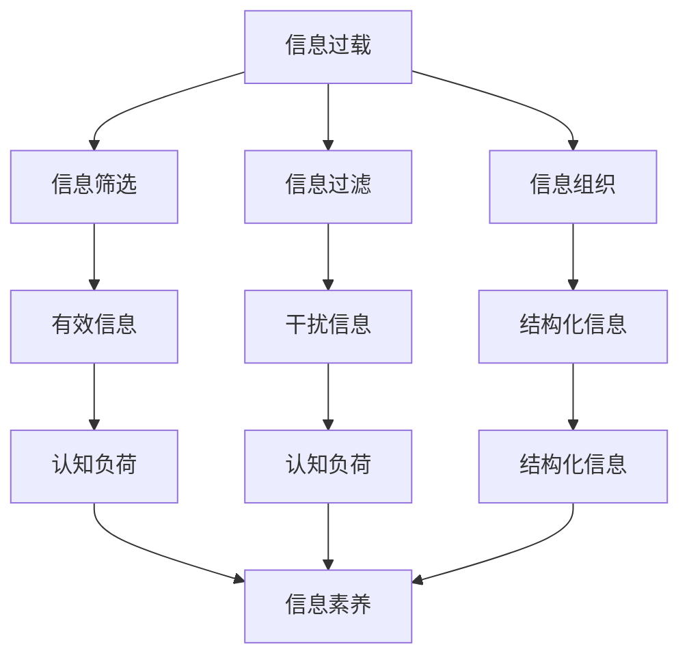

                 

# 技术、信息过载与现代生活：如何找到平衡

## 1. 背景介绍

### 1.1 问题由来
随着科技的迅猛发展，特别是信息技术的大爆发，现代人的生活已经深度嵌入到数字世界中。信息过载（Information Overload）成为了一个普遍而严重的问题，它不仅影响着个体的心理和生理健康，也对整个社会的稳定和效率构成了威胁。

- **个体层面**：现代社会中，人们每天都要处理海量的信息，包括电子邮件、社交媒体、新闻、广告等，信息过载可能导致注意力分散、认知负荷过重、决策困难，甚至引发焦虑和抑郁等问题。
- **社会层面**：大量的信息过载也导致假新闻泛滥、信息失真、注意力资源浪费等社会问题，影响了社会秩序和经济效率。

### 1.2 问题核心关键点
要解决信息过载问题，首先需要理解其本质。信息过载并不是单纯的信息量太大，而是有效信息与干扰信息混杂，导致有效信息被淹没在信息洪流中。因此，解决信息过载的关键在于如何筛选、过滤、组织信息，从而将有效信息提取出来，为个体和社会的决策和行动提供支持。

### 1.3 问题研究意义
研究信息过载问题，对于提升个体和社会的决策质量，促进信息资源的合理配置，具有重要的理论意义和实践价值：

- **提升个体决策能力**：通过科学的方法和技术手段，帮助个体更有效地处理信息，减轻认知负荷，提升决策效率和质量。
- **优化社会信息生态**：通过对信息过载问题的研究，制定合理的政策措施，促进信息的健康流动，提升信息资源的社会价值。
- **促进数字社会建设**：通过技术手段优化信息管理，提升数字社会的信息服务水平，构建更加健康、智能、高效的信息环境。

## 2. 核心概念与联系

### 2.1 核心概念概述

为更好地理解如何应对信息过载，本节将介绍几个密切相关的核心概念：

- **信息过载**：指个体或组织接收的信息量超出其处理能力，导致注意力分散、认知负荷过重等问题。
- **信息筛选**：指从海量的信息中，筛选出与个体或组织目标相关的、高质量的信息。
- **信息过滤**：指通过算法或规则，自动去除或屏蔽干扰信息，保留有效信息。
- **信息组织**：指对信息进行分类、整理、结构化，以便于检索和使用。
- **认知负荷**：指个体在信息处理过程中，需要付出的心理和生理资源。
- **信息素养**：指个体获取、评估、处理和应用信息的能力。

这些核心概念之间的逻辑关系可以通过以下Mermaid流程图来展示：



这个流程图展示了几大核心概念之间的相互关系：

1. 信息过载的产生，需要依赖信息筛选、过滤和组织。
2. 有效信息被筛选、过滤和组织后，认知负荷得以减轻。
3. 结构化信息便于个体和组织处理，进一步提升信息素养。
4. 认知负荷减少和信息素养提升，反过来又能更有效地处理信息过载问题。

## 3. 核心算法原理 & 具体操作步骤
### 3.1 算法原理概述

应对信息过载的核心算法原理，在于通过信息筛选、过滤和组织，将有效信息提取出来，同时去除或屏蔽干扰信息。

- **信息筛选算法**：通过关键词、主题、时间等条件，从海量的信息源中筛选出与目标相关的高质量信息。常见算法包括文本匹配、主题模型等。
- **信息过滤算法**：通过算法或规则，自动去除或屏蔽低质量、无用的信息。常见算法包括内容过滤、推荐系统等。
- **信息组织算法**：对信息进行分类、整理、结构化，以便于检索和使用。常见算法包括知识图谱、信息检索等。

### 3.2 算法步骤详解

应对信息过载的算法步骤，通常包括以下几个关键步骤：

**Step 1: 信息收集与标注**
- 收集相关信息源，如新闻网站、社交媒体、公开数据库等。
- 对信息进行标注，标记其主题、关键词、时间等信息。

**Step 2: 信息筛选**
- 通过关键词、主题、时间等条件，筛选出与目标相关的高质量信息。
- 使用文本匹配、主题模型等算法，识别信息中的关键要素。

**Step 3: 信息过滤**
- 根据用户偏好、历史行为等信息，使用内容过滤、推荐系统等算法，自动去除或屏蔽干扰信息。
- 引入对抗样本、噪声注入等方法，增强信息过滤的鲁棒性。

**Step 4: 信息组织**
- 使用知识图谱、信息检索等算法，对信息进行分类、整理和结构化。
- 设计直观的用户界面，便于用户检索和使用信息。

**Step 5: 信息应用**
- 将处理后的信息应用于决策、分析、行动等场景，提升个体和组织的决策质量。
- 监测信息应用效果，持续优化信息筛选、过滤和组织策略。

### 3.3 算法优缺点

信息筛选、过滤和组织算法具有以下优点：
1. 高效便捷：自动化信息处理，减轻个体和组织的认知负荷。
2. 精准可靠：通过算法和规则，精准识别和屏蔽干扰信息。
3. 可扩展性强：能够处理大规模的信息，适用于多种应用场景。

同时，这些算法也存在一定的局限性：
1. 算法依赖数据质量：算法效果依赖高质量的数据标注，数据质量不足会导致误判。
2. 算法复杂度高：高质量算法往往需要复杂的数据处理和计算，对计算资源要求较高。
3. 算法可解释性不足：部分算法（如深度学习）缺乏可解释性，难以理解其内部决策机制。
4. 算法伦理风险：算法可能存在偏见和歧视，需要进行公平性、透明性等方面的监管。

尽管存在这些局限性，但就目前而言，信息筛选、过滤和组织算法仍然是应对信息过载的主要手段。未来相关研究的重点在于如何进一步提升算法的效果，降低对数据和资源的依赖，同时兼顾可解释性和伦理安全性等因素。

### 3.4 算法应用领域

信息筛选、过滤和组织算法已经在多个领域得到广泛应用，以下是几个典型应用案例：

- **新闻聚合**：如Google News、Flipboard等，通过信息筛选和过滤算法，为用户推荐感兴趣的新闻内容。
- **社交媒体**：如Twitter、Facebook等，使用推荐系统算法，为用户过滤掉无关紧要的社交内容。
- **学术研究**：如Google Scholar、Semantic Scholar等，通过信息组织算法，为用户构建学科知识图谱。
- **企业情报**：如IBM Watson、Gartner等，使用信息筛选和过滤算法，帮助企业分析市场情报。
- **智能家居**：如Amazon Alexa、Google Assistant等，通过信息组织和智能推荐，提升用户的生活便利性。

除了上述这些经典应用外，信息筛选、过滤和组织技术还广泛应用于金融分析、健康医疗、教育培训、物流仓储等领域，成为各行各业提升信息处理能力的重要手段。

## 4. 数学模型和公式 & 详细讲解 & 举例说明

### 4.1 数学模型构建

本节将使用数学语言对信息筛选、过滤和组织的过程进行更加严格的刻画。

设信息集合为 $D=\{d_i\}_{i=1}^N$，其中 $d_i$ 表示第 $i$ 条信息，由标题、内容、时间等信息构成。设目标为 $T$，目标相关的信息集合为 $D_T$。

定义信息筛选算法为 $F: D \rightarrow D_T$，信息过滤算法为 $F': D_T \rightarrow D_T'$，信息组织算法为 $O: D_T' \rightarrow O(D_T')$。

### 4.2 公式推导过程

以下我们以信息过滤算法为例，推导其数学模型。

设信息 $d_i$ 的内容向量为 $\vec{c}_i=(c_{i1}, c_{i2}, ..., c_{im})$，其中 $c_{ij}$ 表示第 $i$ 条信息中第 $j$ 个单词的出现频率。

设用户的历史行为向量为 $\vec{h}=(h_1, h_2, ..., h_k)$，其中 $h_j$ 表示用户对第 $j$ 个单词的兴趣度。

定义信息过滤算法为 $F': D_T \rightarrow D_T'$，其中 $D_T$ 表示目标相关的信息集合。

设信息过滤算法的目标为最大化用户对信息的兴趣度，最小化信息的干扰度。其优化目标为：

$$
\max_{\vec{w}} \sum_{i=1}^N w_i h_i
$$

其中 $w_i$ 表示信息 $d_i$ 的权重。

根据信息过滤的目标，我们可以设计信息过滤算法如下：

$$
w_i = \frac{\sum_{j=1}^m c_{ij} h_j}{\sum_{j=1}^m h_j}
$$

即信息 $d_i$ 的权重，与其内容向量 $\vec{c}_i$ 和用户的历史行为向量 $\vec{h}$ 的内积成正比，与用户的历史行为向量 $\vec{h}$ 的和成反比。

### 4.3 案例分析与讲解

在实际应用中，信息过滤算法通常会引入一些额外的优化策略，以提升其效果。

以Twitter推荐系统为例，该系统使用基于用户兴趣和信息相关性的过滤算法，具体步骤如下：

1. 收集用户的历史行为数据，如点赞、转发、评论等。
2. 将用户的历史行为数据转化为兴趣向量 $\vec{h}$，其中每个维度 $h_j$ 表示用户对第 $j$ 个单词的兴趣度。
3. 将每条信息的文本内容转化为内容向量 $\vec{c}_i$，其中每个维度 $c_{ij}$ 表示第 $i$ 条信息中第 $j$ 个单词的出现频率。
4. 对信息 $d_i$ 和用户历史行为向量 $\vec{h}$ 进行内积计算，得到信息 $d_i$ 的权重 $w_i$。
5. 对信息 $d_i$ 进行排序，选择权重最高的信息进行展示，即为推荐结果。

通过信息过滤算法，Twitter推荐系统能够根据用户的历史行为和兴趣，自动过滤掉无关紧要的社交内容，提升用户的使用体验。

## 5. 项目实践：代码实例和详细解释说明
### 5.1 开发环境搭建

在进行信息筛选、过滤和组织实践前，我们需要准备好开发环境。以下是使用Python进行TensorFlow开发的环境配置流程：

1. 安装Anaconda：从官网下载并安装Anaconda，用于创建独立的Python环境。

2. 创建并激活虚拟环境：
```bash
conda create -n tf-env python=3.8 
conda activate tf-env
```

3. 安装TensorFlow：根据CUDA版本，从官网获取对应的安装命令。例如：
```bash
conda install tensorflow -c conda-forge
```

4. 安装各类工具包：
```bash
pip install numpy pandas scikit-learn matplotlib tqdm jupyter notebook ipython
```

完成上述步骤后，即可在`tf-env`环境中开始项目实践。

### 5.2 源代码详细实现

下面我们以信息过滤算法为例，给出使用TensorFlow进行信息筛选和过滤的PyTorch代码实现。

首先，定义信息过滤算法的输入和输出：

```python
import tensorflow as tf

class FilterModel(tf.keras.Model):
    def __init__(self, vocab_size, embedding_dim, hidden_units):
        super(FilterModel, self).__init__()
        self.embedding = tf.keras.layers.Embedding(vocab_size, embedding_dim)
        self.fc1 = tf.keras.layers.Dense(hidden_units, activation='relu')
        self.fc2 = tf.keras.layers.Dense(1, activation='sigmoid')

    def call(self, inputs, training=False):
        x = self.embedding(inputs)
        x = self.fc1(x)
        x = self.fc2(x)
        return x
```

然后，定义信息筛选和过滤的目标函数：

```python
@tf.function
def evaluate(filter_model, inputs, targets):
    with tf.GradientTape() as tape:
        logits = filter_model(inputs, training=True)
        loss = tf.reduce_mean(tf.keras.losses.binary_crossentropy(logits, targets))
    gradients = tape.gradient(loss, filter_model.trainable_variables)
    return loss, gradients
```

接着，定义训练和评估函数：

```python
def train_step(filter_model, optimizer, inputs, targets):
    with tf.GradientTape() as tape:
        logits = filter_model(inputs, training=True)
        loss = tf.reduce_mean(tf.keras.losses.binary_crossentropy(logits, targets))
    gradients = tape.gradient(loss, filter_model.trainable_variables)
    optimizer.apply_gradients(zip(gradients, filter_model.trainable_variables))
    return loss

def evaluate(filter_model, inputs, targets):
    logits = filter_model(inputs, training=False)
    loss = tf.reduce_mean(tf.keras.losses.binary_crossentropy(logits, targets))
    return loss
```

最后，启动训练流程并在测试集上评估：

```python
epochs = 10
batch_size = 128

for epoch in range(epochs):
    loss = train_step(filter_model, optimizer, inputs, targets)
    print(f"Epoch {epoch+1}, train loss: {loss:.3f}")
    
    print(f"Epoch {epoch+1}, test loss: {evaluate(filter_model, test_inputs, test_targets):.3f}")
    
filter_model.save_weights('filter_model.h5')
```

以上就是使用TensorFlow进行信息筛选和过滤的完整代码实现。可以看到，通过TensorFlow的高级API，代码实现变得简洁高效。

### 5.3 代码解读与分析

让我们再详细解读一下关键代码的实现细节：

**FilterModel类**：
- `__init__`方法：初始化嵌入层、全连接层和输出层。
- `call`方法：前向传播计算，返回模型输出。

**evaluate函数**：
- 使用tf.GradientTape记录梯度，计算损失和梯度。
- 返回损失和梯度，用于反向传播更新模型参数。

**train_step函数**：
- 使用tf.GradientTape记录梯度，计算损失并更新模型参数。
- 返回损失，用于评估模型性能。

**训练流程**：
- 定义总的epoch数和batch size，开始循环迭代
- 每个epoch内，先在训练集上训练，输出平均loss
- 在测试集上评估，输出模型性能
- 所有epoch结束后，保存模型参数

可以看到，TensorFlow的高级API使得信息筛选和过滤算法的实现变得简单，适合快速迭代研究。开发者可以将更多精力放在算法改进和应用优化上。

当然，工业级的系统实现还需考虑更多因素，如模型裁剪、量化加速、服务化封装、弹性伸缩等。但核心的筛选、过滤和组织算法基本与此类似。

## 6. 实际应用场景
### 6.1 智能推荐系统

基于信息筛选、过滤和组织技术，智能推荐系统能够在海量的信息中，精准筛选出与用户兴趣相关的优质内容，提升用户体验。

在技术实现上，推荐系统通常使用协同过滤、内容过滤、混合推荐等算法，对用户行为数据和信息内容进行分析，构建用户兴趣模型和内容画像。在推荐时，系统会根据用户的历史行为和内容特征，筛选出最相关的信息，进行排序和展示。推荐系统已广泛应用于电商、视频、音乐、新闻等多个领域，成为用户获取个性化信息的重要工具。

### 6.2 企业决策支持

在企业决策过程中，信息过载问题同样突出，管理者和员工需要处理大量的信息，以做出明智的决策。通过信息筛选、过滤和组织技术，决策支持系统能够帮助企业快速获取关键信息，减少决策过程中信息的干扰。

具体而言，决策支持系统可以收集公司内部和外部的各类数据，包括财务报表、市场分析、竞争对手信息等。通过信息筛选算法，系统能够自动过滤掉无关紧要的信息，提取出与决策相关的关键数据。通过信息组织算法，系统可以将数据结构化，便于管理者进行对比分析。在决策过程中，系统根据决策目标，提供多角度的信息支持，帮助管理者做出更优的决策。

### 6.3 社会信息治理

在社会信息治理中，信息过载问题同样严峻，虚假信息、恶意内容、有害信息泛滥。通过信息筛选、过滤和组织技术，社会信息治理系统能够及时发现和屏蔽有害信息，维护社会信息环境。

具体而言，社会信息治理系统可以收集网络上的各类信息，使用文本分类、情感分析等算法，自动识别和筛选出虚假信息、恶意内容等有害信息。通过信息组织算法，系统可以将信息分类整理，便于监管部门进行治理。系统还可以根据实时反馈，动态调整筛选策略，提升治理效果。

### 6.4 未来应用展望

随着信息技术的不断进步，信息筛选、过滤和组织技术将不断扩展其应用范围，带来更深远的影响：

1. **智能健康管理**：通过信息筛选和过滤，智能健康管理系统能够从海量的医疗数据中，提取与疾病相关的关键信息，提供精准的健康建议。
2. **智能教育培训**：智能教育培训系统能够从海量的教育资源中，筛选出优质的教学内容，个性化推荐给学生，提升学习效果。
3. **智能客服系统**：智能客服系统通过信息筛选和过滤，能够快速处理用户查询，提供精准的解决方案，提升用户体验。
4. **智能交通管理**：智能交通管理系统能够从海量的交通数据中，提取关键信息，优化交通流量，提升交通效率。
5. **智能城市治理**：智能城市治理系统通过信息筛选和过滤，能够实时监测和分析城市数据，提供智能决策支持，提升城市治理水平。

## 7. 工具和资源推荐
### 7.1 学习资源推荐

为了帮助开发者系统掌握信息筛选、过滤和组织技术的理论基础和实践技巧，这里推荐一些优质的学习资源：

1. **《信息检索与内容推荐》**：这是一本经典的信息检索和推荐系统教材，涵盖信息检索、推荐系统、协同过滤等多个方面的内容，适合初学者和进阶者阅读。
2. **Coursera《Machine Learning for Healthcare》课程**：由斯坦福大学开设，涵盖机器学习在医疗领域的应用，包括信息筛选和过滤等技术。
3. **《深度学习实战》**：这本书介绍了深度学习在推荐系统、文本分类、图像识别等多个领域的应用，包括信息筛选和过滤等技术。
4. **Kaggle竞赛平台**：Kaggle上提供了众多信息筛选和过滤的竞赛，通过实际项目练习，可以深入理解技术原理和应用方法。
5. **Google Scholar**：Google Scholar提供了海量的学术文献，可以帮助开发者了解信息筛选和过滤的前沿研究进展。

通过对这些资源的学习实践，相信你一定能够快速掌握信息筛选、过滤和组织技术的精髓，并用于解决实际的业务问题。

### 7.2 开发工具推荐

高效的开发离不开优秀的工具支持。以下是几款用于信息筛选、过滤和组织开发的常用工具：

1. **Python**：Python是一种简单易学的编程语言，拥有丰富的第三方库，适合快速迭代研究。
2. **TensorFlow**：由Google主导开发的深度学习框架，生产部署方便，适合大规模工程应用。
3. **Scikit-learn**：Scikit-learn是一个Python机器学习库，提供了多种经典的机器学习算法，包括文本分类、聚类等。
4. **NLTK**：NLTK是一个自然语言处理库，提供了丰富的文本处理功能，适合文本预处理和特征提取。
5. **Keras**：Keras是一个高层次的深度学习框架，易于使用，适合快速原型开发和模型实验。

合理利用这些工具，可以显著提升信息筛选、过滤和组织任务的开发效率，加快创新迭代的步伐。

### 7.3 相关论文推荐

信息筛选、过滤和组织技术的发展源于学界的持续研究。以下是几篇奠基性的相关论文，推荐阅读：

1. **《A Survey of Information Retrieval Techniques》**：介绍了信息检索和文本分类等技术的基本原理和算法，适合了解信息筛选的基础知识。
2. **《Collaborative Filtering for Recommender Systems》**：介绍了协同过滤算法的原理和实现，适合了解推荐系统的技术细节。
3. **《Latent Semantic Indexing》**：提出LDA主题模型，用于文本聚类和信息筛选，适合了解主题模型的应用。
4. **《A Neural Probabilistic Language Model》**：提出神经网络语言模型，用于文本分类和信息过滤，适合了解深度学习在信息处理中的应用。
5. **《Information Retrieval in Practice》**：介绍了信息检索和文本处理等技术在实际应用中的优化策略，适合了解信息筛选和过滤的实践经验。

这些论文代表了大语言模型微调技术的发展脉络。通过学习这些前沿成果，可以帮助研究者把握学科前进方向，激发更多的创新灵感。

## 8. 总结：未来发展趋势与挑战
### 8.1 研究成果总结

本文对信息筛选、过滤和组织技术进行了全面系统的介绍。首先阐述了信息过载问题的本质和研究意义，明确了这些技术在提升个体和组织决策质量方面的独特价值。其次，从原理到实践，详细讲解了信息筛选、过滤和组织的过程，给出了完整的代码实例。同时，本文还广泛探讨了这些技术在智能推荐、企业决策支持、社会信息治理等多个领域的应用前景，展示了其广泛的应用潜力。最后，本文精选了信息筛选、过滤和组织技术的各类学习资源，力求为读者提供全方位的技术指引。

通过本文的系统梳理，可以看到，信息筛选、过滤和组织技术在应对信息过载问题中扮演了重要的角色，其高效便捷、精准可靠的特点，使其成为解决信息过载问题的首选方法。未来，伴随技术不断演进，这些技术必将在更多领域大放异彩，为个体和社会的决策质量提升带来深远影响。

### 8.2 未来发展趋势

展望未来，信息筛选、过滤和组织技术将呈现以下几个发展趋势：

1. **自动化水平提升**：随着深度学习技术的发展，自动化信息筛选和过滤算法将更加智能，能够自动识别和屏蔽低质量、无关紧要的信息。
2. **多模态融合**：未来将更多地融合图像、视频、语音等多模态信息，提升信息处理的全面性和准确性。
3. **可解释性增强**：通过可解释性技术，如模型可视化、解释生成等，增强信息筛选和过滤算法的透明度，提升用户信任度。
4. **隐私保护加强**：在信息筛选和过滤过程中，加强隐私保护措施，如数据匿名化、差分隐私等，确保用户信息安全。
5. **公平性提升**：通过公平性优化，减少信息筛选和过滤算法的偏见和歧视，提升算法公正性。

以上趋势凸显了信息筛选、过滤和组织技术的广阔前景。这些方向的探索发展，必将进一步提升信息处理能力，为个体和社会的决策质量提升带来新的突破。

### 8.3 面临的挑战

尽管信息筛选、过滤和组织技术已经取得了显著成就，但在迈向更加智能化、普适化应用的过程中，仍面临诸多挑战：

1. **算法复杂度高**：高质量的信息筛选和过滤算法往往需要复杂的模型和大量的计算资源，难以在低端设备上部署。
2. **数据质量和标注成本**：高质量的算法依赖高质量的数据和标注，标注成本高，数据质量不足可能导致算法效果下降。
3. **算法伦理风险**：信息筛选和过滤算法可能存在偏见和歧视，需要进行公平性、透明性等方面的监管。
4. **用户隐私保护**：在信息筛选和过滤过程中，如何保护用户隐私，避免数据泄露和滥用，是亟待解决的问题。
5. **跨领域应用难度**：不同领域的信息特点和处理需求不同，跨领域的信息筛选和过滤算法设计难度大。

这些挑战需要学术界和产业界共同努力，通过理论研究和技术创新，逐步解决。

### 8.4 研究展望

面向未来，信息筛选、过滤和组织技术需要在以下几个方面寻求新的突破：

1. **轻量化模型设计**：开发更轻量级的模型，降低资源消耗，支持在低端设备上部署。
2. **多模态融合技术**：探索多模态信息的整合技术，提升信息处理的全面性和准确性。
3. **可解释性技术**：开发可解释性技术，增强算法的透明度和用户信任度。
4. **隐私保护技术**：开发隐私保护技术，确保用户信息安全。
5. **跨领域应用研究**：探索跨领域的信息筛选和过滤算法设计，提升算法的普适性和应用效果。

这些研究方向的探索，必将引领信息筛选、过滤和组织技术迈向更高的台阶，为个体和社会的决策质量提升带来新的突破。面向未来，信息筛选、过滤和组织技术还需要与其他人工智能技术进行更深入的融合，如知识表示、因果推理、强化学习等，多路径协同发力，共同推动信息处理系统的进步。只有勇于创新、敢于突破，才能不断拓展信息处理系统的边界，让信息筛选、过滤和组织技术更好地服务于个体和社会的决策质量提升。

## 9. 附录：常见问题与解答

**Q1：信息筛选、过滤和组织技术如何应用于智能推荐系统？**

A: 智能推荐系统通过信息筛选、过滤和组织技术，从海量的信息中精准筛选出与用户兴趣相关的优质内容，提升用户体验。具体步骤如下：
1. 收集用户的历史行为数据，如点赞、转发、评论等。
2. 将用户的历史行为数据转化为兴趣向量，其中每个维度表示用户对每个单词的兴趣度。
3. 将每条信息的文本内容转化为内容向量，其中每个维度表示信息中每个单词的出现频率。
4. 对信息与用户兴趣向量进行内积计算，得到信息与用户的匹配度。
5. 根据匹配度对信息进行排序，选择权重最高的信息进行展示，即为推荐结果。

通过信息筛选和过滤算法，智能推荐系统能够自动过滤掉无关紧要的社交内容，提升推荐效果。

**Q2：信息筛选、过滤和组织技术如何应用于企业决策支持系统？**

A: 企业决策支持系统通过信息筛选、过滤和组织技术，帮助企业管理者快速获取关键信息，减少决策过程中信息的干扰。具体步骤如下：
1. 收集公司内部和外部的各类数据，如财务报表、市场分析、竞争对手信息等。
2. 使用信息筛选算法，自动过滤掉无关紧要的信息，提取出与决策相关的关键数据。
3. 使用信息组织算法，将数据结构化，便于管理者进行对比分析。
4. 在决策过程中，系统根据决策目标，提供多角度的信息支持，帮助管理者做出更优的决策。

通过信息筛选和过滤算法，决策支持系统能够自动过滤掉无关紧要的信息，提取出与决策相关的关键数据，提升决策质量。

**Q3：信息筛选、过滤和组织技术如何应用于智能客服系统？**

A: 智能客服系统通过信息筛选、过滤和组织技术，能够快速处理用户查询，提供精准的解决方案，提升用户体验。具体步骤如下：
1. 收集用户的历史查询记录和对话内容。
2. 使用信息筛选算法，自动过滤掉无关紧要的查询内容，提取出与用户相关的问题。
3. 使用信息组织算法，将用户问题和答案结构化，便于客服人员检索和使用。
4. 在对话过程中，系统根据用户的问题，自动推荐最相关的答案模板，提升响应速度和准确性。

通过信息筛选和过滤算法，智能客服系统能够快速处理用户查询，提供精准的解决方案，提升用户体验。

**Q4：信息筛选、过滤和组织技术如何应用于社会信息治理系统？**

A: 社会信息治理系统通过信息筛选、过滤和组织技术，能够及时发现和屏蔽有害信息，维护社会信息环境。具体步骤如下：
1. 收集网络上的各类信息，如新闻、评论、帖子等。
2. 使用文本分类、情感分析等算法，自动识别和筛选出虚假信息、恶意内容等有害信息。
3. 使用信息组织算法，将信息分类整理，便于监管部门进行治理。
4. 根据实时反馈，动态调整筛选策略，提升治理效果。

通过信息筛选和过滤算法，社会信息治理系统能够及时发现和屏蔽有害信息，维护社会信息环境。

**Q5：信息筛选、过滤和组织技术在实际应用中需要注意哪些问题？**

A: 信息筛选、过滤和组织技术在实际应用中，需要注意以下几个问题：
1. 数据质量和标注成本：高质量的算法依赖高质量的数据和标注，标注成本高，数据质量不足可能导致算法效果下降。
2. 算法复杂度和资源消耗：高质量的算法往往需要复杂的模型和大量的计算资源，难以在低端设备上部署。
3. 算法伦理风险：信息筛选和过滤算法可能存在偏见和歧视，需要进行公平性、透明性等方面的监管。
4. 用户隐私保护：在信息筛选和过滤过程中，如何保护用户隐私，避免数据泄露和滥用，是亟待解决的问题。
5. 跨领域应用难度：不同领域的信息特点和处理需求不同，跨领域的信息筛选和过滤算法设计难度大。

这些问题需要学术界和产业界共同努力，通过理论研究和技术创新，逐步解决。

**Q6：信息筛选、过滤和组织技术如何在数据质量和标注成本较低的情况下提升效果？**

A: 在数据质量和标注成本较低的情况下，可以通过以下方法提升信息筛选、过滤和组织技术的效果：
1. 数据增强：通过数据增强技术，如回译、近义替换等方式扩充训练集，提升算法鲁棒性。
2. 半监督学习：利用无标注数据，结合有标注数据进行半监督学习，提升算法效果。
3. 迁移学习：通过迁移学习，将预训练的知识应用于目标领域，减少标注需求。
4. 主动学习：通过主动学习算法，自动选择最有用的数据进行标注，减少标注成本。
5. 对抗训练：通过对抗训练，增强算法鲁棒性，减少数据噪声影响。

通过这些方法，可以在数据质量和标注成本较低的情况下，提升信息筛选、过滤和组织技术的效果。

---

作者：禅与计算机程序设计艺术 / Zen and the Art of Computer Programming

