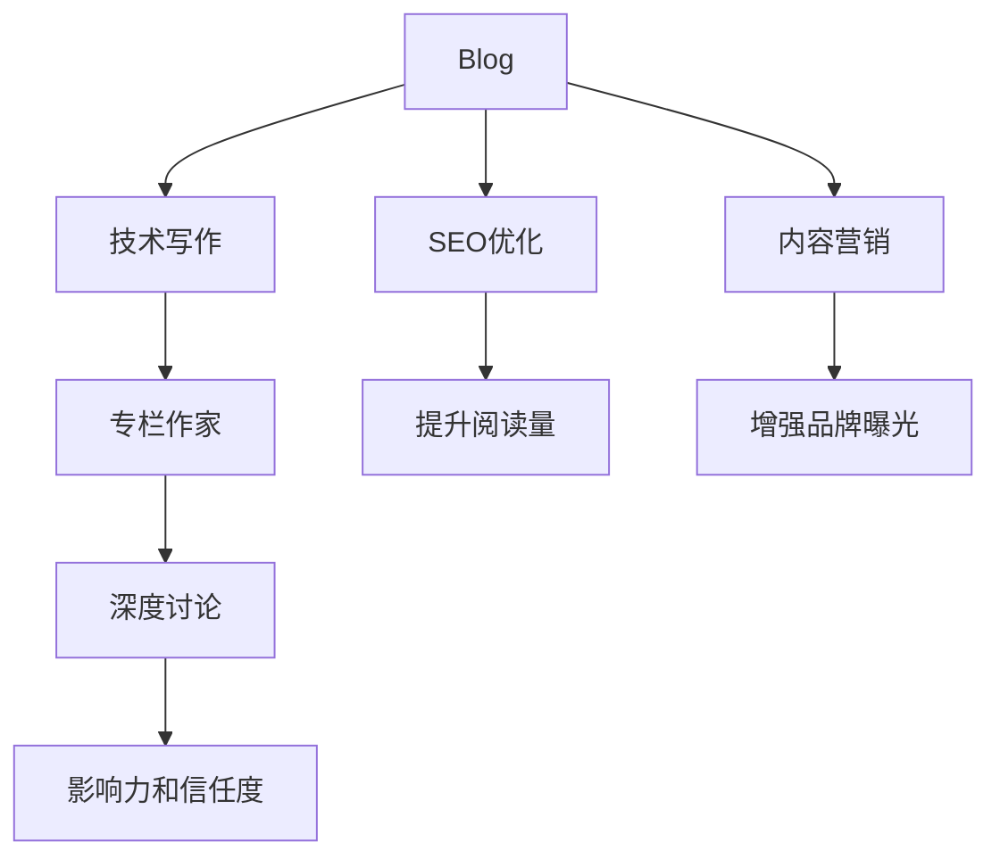

                 

# 技术写作：从博客到专栏作家之路

> 关键词：技术写作,博客,专栏作家,写作技巧,自媒体

## 1. 背景介绍

### 1.1 问题由来

在互联网时代，技术写作已经成为了一种极其重要的技能。无论是企业内部的技术文档、开源项目的文档，还是博客、专栏等自媒体内容，都离不开优秀的技术写作。但如何从零开始，逐步提升技术写作能力，并最终成为一名优秀的技术写作人，却是一个需要认真探讨的问题。本文将围绕技术写作的核心要素，从博客到专栏作家之路，为你提供一个全面且系统的指南。

### 1.2 问题核心关键点

技术写作的核心关键点在于以下三点：

1. **写作基础**：掌握基本写作原则和技巧，如结构组织、用词准确、逻辑清晰等。
2. **专业深度**：对特定领域有深入的理解和知识储备，能够准确、全面地阐述技术问题。
3. **表达能力**：能够将复杂技术问题以通俗易懂的方式呈现给读者，引起共鸣和兴趣。

这三个关键点相互交织，共同决定了技术写作的质量和影响力。本文将详细探讨如何在这三个方面不断提升，从博客起步，逐步成长为一名专栏作家。

## 2. 核心概念与联系

### 2.1 核心概念概述

技术写作涉及多个核心概念，理解这些概念及其相互联系是提升技术写作能力的基础。以下是几个关键概念：

- **博客(Blog)**：个人或组织通过互联网发布的技术文章，用以记录、分享技术心得和经验。
- **专栏作家(Columnist)**：在知名媒体或平台上定期撰写专栏，深度探讨特定领域的技术问题，具有较大影响力。
- **自媒体(Self-Media)**：通过社交媒体、个人网站等渠道，自主发布内容，扩大读者基础。
- **技术写作(Technical Writing)**：将技术知识以易于理解的方式表达出来，帮助读者掌握技术细节和应用方法。
- **SEO优化(Search Engine Optimization)**：通过优化博客内容，提高搜索引擎排名，吸引更多读者。
- **内容营销(Content Marketing)**：通过高质量的内容吸引用户关注和参与，提升品牌影响力。

这些概念之间的联系可以通过以下Mermaid流程图来展示：



这个流程图展示了博客与技术写作的关系，以及通过SEO优化和内容营销提升博客影响力的路径，最终帮助博客作者成长为专栏作家。

## 3. 核心算法原理 & 具体操作步骤

### 3.1 算法原理概述

技术写作的本质是通过逻辑清晰、结构合理的文字，将复杂的技术知识传递给读者。其核心在于：

- 确定主题：明确文章的主题和核心观点。
- 结构设计：使用清晰有序的结构组织内容，便于读者理解。
- 语言表达：使用准确、通俗的语言，减少误解和混淆。
- 案例分析：通过具体案例分析，帮助读者更好地理解技术原理和应用。

### 3.2 算法步骤详解

技术写作的具体步骤可以分为以下几个阶段：

**Step 1: 选题与调研**
- 确定写作主题：选择感兴趣且有一定研究基础的领域，如最新技术趋势、常见技术问题等。
- 进行背景调研：查阅相关文献、技术博客、专家访谈等，充分了解该主题的背景和现状。

**Step 2: 结构设计**
- 定义文章结构：包括引言、主体和结论三部分，主体部分可以进一步细分为多个子部分，每部分聚焦于一个关键点。
- 使用标题和列表：清晰标示每个部分的主题和内容，提高可读性。

**Step 3: 内容撰写**
- 撰写引言：简要介绍文章背景、目的和结构，吸引读者兴趣。
- 深入主体：详细阐述技术原理、应用场景、案例分析等内容，确保准确性。
- 总结结论：归纳主要观点，提出建议或展望，强化文章影响力。

**Step 4: 修改与优化**
- 自我校对：检查语法错误、逻辑漏洞，确保文章通顺连贯。
- 他人评审：请同事或专家审阅文章，提供修改建议。
- 反复迭代：根据反馈意见，多次修改完善文章。

**Step 5: 发布与推广**
- 选择合适的平台：根据受众群体选择博客、社区、社交媒体等发布渠道。
- 利用SEO优化：使用关键词优化文章标题和内容，提高搜索引擎排名。
- 互动交流：通过评论区、社交媒体等方式，与读者互动，增强文章影响。

### 3.3 算法优缺点

技术写作的优势在于其深入浅出的表达方式，能够有效传递复杂的技术信息，提高读者理解和应用的能力。缺点在于需要较长时间的积累和研究，对写作技巧的掌握也有较高要求。

### 3.4 算法应用领域

技术写作广泛应用于软件开发、人工智能、网络安全、数据分析等技术领域，帮助技术专家和从业者通过文字形式记录、分享和推广技术知识。无论是技术博客、技术专栏，还是企业内部文档、开源项目文档，技术写作都是不可或缺的重要部分。

## 4. 数学模型和公式 & 详细讲解 & 举例说明

### 4.1 数学模型构建

技术写作的数学模型主要涉及信息传递和内容优化。假设一篇技术文章为 $M$，其内容质量为 $Q$，可读性为 $R$，读者的理解度为 $U$，文章的影响力为 $I$。则数学模型可表示为：

$$
I = f(Q, R, U)
$$

其中 $f$ 为影响函数，表示内容质量、可读性和理解度共同作用于文章影响力的关系。

### 4.2 公式推导过程

为简化问题，假设 $f$ 为线性函数，则有：

$$
I = aQ + bR + cU
$$

其中 $a, b, c$ 为常数，表示不同因素对影响力的贡献度。

### 4.3 案例分析与讲解

以一篇关于深度学习技术的博客为例，分析其影响因素：

- **内容质量 $Q$**：涵盖深度学习的基本概念、当前研究趋势、应用案例等，内容深度和广度决定了读者对该文章的评价。
- **可读性 $R$**：使用简明扼要的描述、清晰的图表、实用的代码示例等，提升文章的可读性和实用性。
- **理解度 $U$**：通过案例分析、技术细节的讲解，帮助读者更好地理解深度学习技术，促进技术传播和应用。

通过以上案例，可以看出内容质量、可读性和理解度是影响文章影响力的关键因素。

## 5. 项目实践：代码实例和详细解释说明

### 5.1 开发环境搭建

开发技术写作的博客，需要一个良好的开发环境。以下是使用Python和Django框架搭建博客网站的示例：

1. 安装Python和Django：
```
pip install python
pip install django
```

2. 创建Django项目：
```
django-admin startproject myblog
cd myblog
```

3. 创建Django应用：
```
python manage.py startapp blog
```

4. 配置数据库：
```
nano blog/settings.py
```

```python
DATABASES = {
    'default': {
        'ENGINE': 'django.db.backends.sqlite3',
        'NAME': BASE_DIR / 'db.sqlite3',
    }
}
```

5. 创建博客模型：
```python
python manage.py makemigrations
python manage.py migrate
```

### 5.2 源代码详细实现

以下是一个简化的博客模型，包括文章标题、正文和发布时间：

```python
from django.db import models

class BlogPost(models.Model):
    title = models.CharField(max_length=200)
    content = models.TextField()
    pub_date = models.DateTimeField('date published')
```

### 5.3 代码解读与分析

- **Django框架**：Django是一个强大的Web框架，提供了丰富的功能，如数据库操作、路由管理、模板渲染等。
- **模型设计**：博客模型包含三个字段：标题、内容和发布时间，设计简单明了。
- **数据库操作**：使用Django提供的ORM（对象关系映射），方便进行数据库操作。
- **模板渲染**：Django的模板系统使得页面布局和样式设计变得简单，可以快速实现前后端分离。

### 5.4 运行结果展示

运行以下命令启动开发服务器：

```
python manage.py runserver
```

在浏览器中访问 `http://127.0.0.1:8000`，即可看到博客页面。

## 6. 实际应用场景

### 6.1 企业技术博客

企业内部的技术博客可以用于记录技术开发过程、分享经验教训、推广新技术等。通过博客分享，企业内部的技术团队可以更好地协作，同时也能展示企业技术实力，吸引外部人才。

### 6.2 开源项目文档

开源项目通常会维护一个技术博客或文档，用于记录项目进展、提供API文档、分享开发心得等。优秀的技术文档可以提高项目的可维护性和用户满意度，吸引更多开发者贡献代码。

### 6.3 技术培训与教育

在技术培训和教育中，技术写作扮演着重要角色。通过撰写博客和专栏，专家可以传授知识和经验，帮助初学者掌握新技术。同时，技术写作也是技术社区和教育平台的重要内容来源。

### 6.4 未来应用展望

未来的技术写作将更加注重互动和社区建设，通过社交媒体、技术论坛、知识图谱等渠道，加强技术知识和经验分享。同时，随着AI和大数据技术的发展，技术写作也将更加智能化，如通过AI辅助生成文章、分析受众反馈等。

## 7. 工具和资源推荐

### 7.1 学习资源推荐

为了提升技术写作能力，以下是一些推荐的学习资源：

1. **《修辞学》**：修辞学是写作的基础，了解如何使用修辞手法，提升文章的可读性和影响力。
2. **《写作训练营》**：许多在线平台提供写作训练营，帮助初学者掌握写作技巧，逐步提升写作水平。
3. **《技术写作指南》**：详细介绍了技术写作的各个环节，包括选题、结构设计、内容撰写等，是技术写作的重要参考书。
4. **Grammarly和Hemingway**：这两款工具可以帮助作者检查语法错误和提高文章可读性。
5. **Medium和TechCrunch**：这些平台聚集了大量的技术博客和专栏作家，可以从中学习写作技巧和获得灵感。

### 7.2 开发工具推荐

开发技术写作博客，离不开一些实用的工具：

1. **Django框架**：功能丰富，易于上手，适合快速开发博客网站。
2. **GitHub**：提供代码托管和版本控制，方便团队协作。
3. **LaTeX**：专业的排版工具，适用于撰写学术论文和技术手册。
4. **Grammarly和Hemingway**：写作辅助工具，帮助优化文章质量和可读性。
5. **Canva和Adobe Illustrator**：设计工具，用于制作图表、插图等，提升文章视觉吸引力。

### 7.3 相关论文推荐

技术写作的研究涉及多个领域，以下是几篇经典论文：

1. **《网络空间中的技术写作》**：探讨技术写作在网络空间中的角色和意义。
2. **《技术博客对开发者社区的影响》**：研究技术博客对开发者社区的影响，包括技术传播、知识共享等。
3. **《技术写作的未来趋势》**：探讨技术写作的未来发展方向，包括内容多样性、交互性、数据驱动等。

## 8. 总结：未来发展趋势与挑战

### 8.1 总结

本文详细介绍了从博客到专栏作家之路的技术写作指南。通过理解技术写作的核心要素，掌握博客和专栏的写作技巧，可以帮助读者逐步提升写作能力，最终成长为一名优秀的技术写作人。从博客起步，通过不断学习和实践，逐步掌握技术写作的艺术，将是每个技术人成长为专栏作家的必经之路。

### 8.2 未来发展趋势

未来的技术写作将呈现以下趋势：

1. **内容多样化**：博客和专栏将更加多样化，涵盖更多的技术领域和应用场景。
2. **互动增强**：通过评论区、社交媒体等渠道，加强与读者的互动，提升内容价值。
3. **技术驱动**：借助AI和大数据技术，优化写作流程，提高写作效率和质量。
4. **跨界融合**：技术写作与其他内容形式（如视频、播客）的融合，拓展技术传播的边界。

### 8.3 面临的挑战

尽管技术写作有着广阔的前景，但也面临一些挑战：

1. **时间和精力投入**：技术写作需要大量时间和精力的投入，对作者的专业能力和写作技巧要求较高。
2. **受众定位**：如何精准定位受众群体，撰写符合其需求和兴趣的内容，是技术写作的重要课题。
3. **内容原创性**：避免抄袭和剽窃，保持内容的原创性和独立性，是技术写作的底线。
4. **平台选择**：选择合适的发布平台，提升文章曝光和影响力，是技术写作的关键步骤。

### 8.4 研究展望

未来的技术写作研究需要在以下方面进行深入探索：

1. **自动化技术**：借助自然语言处理和机器学习技术，自动化生成技术写作内容。
2. **个性化推荐**：通过大数据分析，推荐适合用户的技术文章，提升用户阅读体验。
3. **多模态技术**：结合视觉、听觉等多种模态，提升技术文章的互动性和用户体验。
4. **伦理和隐私**：在技术写作中，如何保护作者和读者的隐私，避免技术传播中的伦理问题。

总之，技术写作是一门需要不断探索和创新的艺术。只有持续学习、勇于实践，才能在技术写作的道路上不断突破，成长为一名优秀的技术写作人。

## 9. 附录：常见问题与解答

**Q1: 如何提升写作能力？**

A: 提升写作能力需要不断学习和实践。可以通过阅读经典写作书籍、参加写作训练营、多写多练等方式提升写作技巧。

**Q2: 如何选择发布平台？**

A: 选择发布平台需要考虑受众群体、平台特性和自身定位。可以选择技术博客、社交媒体、专业论坛等平台，提升文章曝光和影响力。

**Q3: 如何保持文章原创性？**

A: 保持文章原创性需要具备扎实的基础知识和独立思考能力。可以通过多角度、多层次分析问题，避免抄袭和剽窃。

**Q4: 如何提升文章可读性？**

A: 提升文章可读性可以通过使用清晰简明的语言、恰当的排版和图表、互动性强的内容等方式实现。

**Q5: 如何优化SEO效果？**

A: 优化SEO效果需要选择合适的关键词、合理使用标题和标签、增加外部链接等方式，提升文章在搜索引擎中的排名。

通过不断学习和实践，相信每个人都能在技术写作的道路上不断成长，成为一名优秀的技术写作人。

