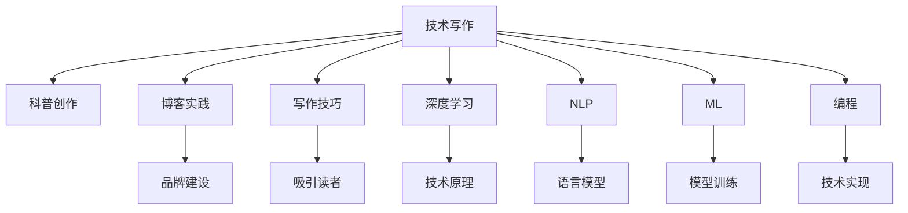

                 

# 技术写作：从技术博客到畅销科普作家之路

> 关键词：技术写作,科普创作,博客实践,写作技巧,深度学习,自然语言处理(NLP),机器学习(ML),编程,作者成长

## 1. 背景介绍

### 1.1 问题由来
在这个信息爆炸的时代，技术内容如何更好地传播，如何能够吸引更广泛的读者，这是每个技术从业者都在思考的问题。无论你是公司工程师、自由撰稿人、还是学术研究人员，技术的传播已经成为了一个巨大的挑战。尽管我们拥有大量的技术博客、论文和文档，但如何让普通读者能够理解和接受这些深奥的内容，仍然是一个难题。这不仅涉及到技术的广度和深度，更涉及到如何通过文字的魅力，将复杂的概念以简单、生动、易懂的方式呈现出来。

### 1.2 问题核心关键点
要解决这个问题，首先要了解技术写作和科普创作的本质。技术写作不仅仅是对技术原理的介绍，更重要的是通过文字将复杂的技术转化为易于理解的知识。而科普创作则更侧重于知识的普及和传播，需要通过故事、比喻、案例等手法，让读者感受到技术的魅力和应用的价值。两者之间既有区别，又有共通之处。技术的普及和传播是作者成长的关键，也是打造畅销科普作家的必由之路。

### 1.3 问题研究意义
技术写作和科普创作不仅能够提升技术知识的普及度，还能促进技术的创新和应用，推动社会进步。通过好的技术写作和科普创作，能够将复杂的技术知识传递给更多读者，激发他们对技术的兴趣和热情，进而为技术的普及和应用创造更多可能性。同时，这也为技术从业者提供了一个展现自我、分享经验的平台，通过写作能够不断提升个人的影响力和专业度，实现个人价值的最大化。

## 2. 核心概念与联系

### 2.1 核心概念概述

要成为一名成功的技术作家和科普创作者，首先需要对以下核心概念有深刻的理解：

- **技术写作**：将复杂的技术知识以易于理解的方式呈现给读者的过程。技术写作不仅需要准确地介绍技术原理，还需要通过实例和比喻，让读者能够更好地理解和应用。

- **科普创作**：通过故事、案例、比喻等手法，将复杂的技术知识以生动、易懂的方式传递给普通读者，使他们能够感受到技术的魅力和应用的价值。

- **博客实践**：通过技术博客分享知识和经验，建立个人品牌和影响力，连接更广泛的读者群体。博客是技术写作和科普创作的有效工具，也是技术从业者展现自我、分享经验的平台。

- **写作技巧**：包括如何构建吸引人的标题、如何撰写引人入胜的文章、如何利用图像和视频等多媒体元素增强文章表现力等。

- **深度学习**、**自然语言处理(NLP)**、**机器学习(ML)**：作为现代技术写作和科普创作的基础，这些领域的知识在技术写作中得到了广泛应用。

- **编程**：技术作家和科普创作者需要对编程语言和技术架构有深入的理解，以便于将技术原理和应用场景生动地呈现出来。

这些概念之间的联系可以通过以下Mermaid流程图来展示：



这个流程图展示出技术写作和科普创作的关键概念及其之间的关系：

1. 技术写作通过博客实践呈现，帮助品牌建设。
2. 写作技巧、深度学习、NLP、ML、编程是技术写作的基础，支撑了内容的深度和广度。
3. 科普创作利用写作技巧和媒体元素吸引读者，揭示技术原理。
4. 品牌建设提升博客的影响力，增强读者的信任和粘性。

## 3. 核心算法原理 & 具体操作步骤
### 3.1 算法原理概述

技术写作和科普创作的技术原理主要包括以下几个方面：

- **内容生成算法**：通过算法生成具有吸引力的标题和内容，确保文章的逻辑清晰、结构紧凑。
- **情感分析算法**：分析读者的情感反馈，调整文章风格和内容，增强读者的阅读体验。
- **推荐算法**：根据读者的阅读历史和偏好，推荐相关的技术文章和科普内容，提升读者的满意度和留存率。

这些算法原理通过数据驱动的方式，能够有效提升技术写作和科普创作的效果，帮助作者更好地连接读者。

### 3.2 算法步骤详解

技术写作和科普创作的具体操作步骤如下：

1. **选题与规划**：根据读者的需求和兴趣，确定博客的主题和方向，制定详细的写作计划。
2. **资料收集与整理**：收集与主题相关的技术文档、研究论文、案例分析等资料，进行整理和归纳。
3. **内容创作**：根据写作计划，使用技术写作和科普创作的方法，撰写具有吸引力和实用性的文章。
4. **优化与调整**：利用情感分析和推荐算法，根据读者的反馈优化文章内容，提升读者的阅读体验。
5. **发布与传播**：将创作的文章发布在博客平台上，通过SEO和社交媒体等渠道进行传播，吸引更多的读者。

### 3.3 算法优缺点

技术写作和科普创作的算法优缺点如下：

- **优点**：
  - 通过数据驱动的方式，能够精准把握读者的需求和兴趣，提升文章的吸引力和实用性。
  - 利用算法优化内容，提升文章的阅读体验和满意度。
  - 通过推荐算法，能够将相关的文章推荐给读者，增强读者的粘性和留存率。

- **缺点**：
  - 算法模型的准确性取决于数据的丰富性和质量，数据不足或质量不高可能导致模型效果不佳。
  - 情感分析算法可能无法准确捕捉读者的真实情感，导致内容的调整与读者的期望不符。
  - 推荐算法可能存在冷启动问题，即初期无法准确推荐读者感兴趣的内容。

### 3.4 算法应用领域

技术写作和科普创作的算法广泛应用于以下领域：

- **技术博客**：在技术博客平台上，通过算法优化文章内容，提升读者的阅读体验和满意度。
- **学术论文**：在学术论文的撰写和发布过程中，利用算法提升论文的影响力和传播度。
- **产品文档**：在产品文档中，通过算法生成易于理解的指南和教程，提升用户的体验和满意度。
- **在线课程**：在在线课程的讲解过程中，利用算法生成吸引人的内容，增强课程的互动性和趣味性。
- **技术支持**：在技术支持过程中，利用算法分析用户的问题，提供个性化的解决方案。

## 4. 数学模型和公式 & 详细讲解 & 举例说明

### 4.1 数学模型构建

技术写作和科普创作中常见的数学模型包括：

- **朴素贝叶斯分类器**：用于分类文本，根据词频和主题分布，判断文章的分类。
- **词嵌入模型**：将单词映射到低维向量空间，用于计算文本之间的相似度。
- **语言模型**：用于计算文本的概率，评估文本的流畅度和合理性。
- **推荐系统模型**：基于协同过滤、矩阵分解等算法，推荐相关的文章和内容。

### 4.2 公式推导过程

以下以朴素贝叶斯分类器为例，展示其公式推导过程：

假设我们有一个二分类问题，将文本分类为正类（1）或负类（0）。设训练集为 $D=\{(x_i, y_i)\}_{i=1}^N$，其中 $x_i$ 为文本向量，$y_i$ 为标签。朴素贝叶斯分类器的公式推导如下：

$$
P(y_i=1|x_i) = \frac{P(x_i|y_i=1)P(y_i=1)}{P(x_i)}
$$

其中：

- $P(y_i=1|x_i)$ 为给定文本 $x_i$ 为正类的概率。
- $P(x_i|y_i=1)$ 为文本 $x_i$ 在正类条件下出现的概率。
- $P(y_i=1)$ 为文本为正类的先验概率。
- $P(x_i)$ 为文本出现的总概率。

通过上述公式，我们可以计算出给定文本的分类概率，从而进行文本的分类。

### 4.3 案例分析与讲解

以下通过一个具体的案例，分析如何利用算法优化技术写作和科普创作：

假设我们有一个技术博客，主要关注机器学习和自然语言处理。我们希望通过算法优化博客的内容，提升读者的阅读体验和满意度。首先，利用朴素贝叶斯分类器对文章进行分类，确定每一篇博客的主题。然后，利用词嵌入模型计算文本之间的相似度，将相关的文章组合在一起，形成主题板块。最后，利用推荐系统模型根据读者的阅读历史和偏好，推荐相关的文章和内容。通过这一系列的算法应用，我们可以更好地满足读者的需求，提升博客的影响力和传播度。

## 5. 项目实践：代码实例和详细解释说明

### 5.1 开发环境搭建

在进行技术写作和科普创作的项目实践前，我们需要准备好开发环境。以下是使用Python进行开发的环境配置流程：

1. 安装Anaconda：从官网下载并安装Anaconda，用于创建独立的Python环境。
2. 创建并激活虚拟环境：
```bash
conda create -n pyblog-env python=3.8 
conda activate pyblog-env
```
3. 安装必要的Python库：
```bash
conda install pandas matplotlib scikit-learn
```
4. 安装必要的Markdown库：
```bash
pip install markdown
```
完成上述步骤后，即可在`pyblog-env`环境中开始技术写作和科普创作的开发。

### 5.2 源代码详细实现

下面以朴素贝叶斯分类器为例，展示使用Python实现技术写作和科普创作的代码：

```python
import pandas as pd
from sklearn.feature_extraction.text import CountVectorizer
from sklearn.naive_bayes import MultinomialNB
from sklearn.metrics import accuracy_score
from sklearn.model_selection import train_test_split

# 加载数据
data = pd.read_csv('blog_data.csv')

# 划分训练集和测试集
X_train, X_test, y_train, y_test = train_test_split(data['content'], data['category'], test_size=0.2, random_state=42)

# 构建词频矩阵
vectorizer = CountVectorizer()
X_train = vectorizer.fit_transform(X_train)
X_test = vectorizer.transform(X_test)

# 训练朴素贝叶斯分类器
clf = MultinomialNB()
clf.fit(X_train, y_train)

# 预测测试集
y_pred = clf.predict(X_test)

# 计算准确率
accuracy = accuracy_score(y_test, y_pred)
print(f'Accuracy: {accuracy:.2f}')
```

### 5.3 代码解读与分析

让我们再详细解读一下关键代码的实现细节：

**数据加载**：使用Pandas库加载博客数据，将其保存为csv格式。数据应包含博客内容、分类标签等信息。

**模型训练**：使用Scikit-learn库构建朴素贝叶斯分类器，并进行训练。通过构建词频矩阵，将文本转换为数值型特征，方便模型的训练和预测。

**预测测试集**：使用训练好的模型对测试集进行分类预测，评估模型的准确率。

通过上述代码，我们可以看到，技术写作和科普创作的项目实践是相对简洁的。Python提供了丰富的库和工具，可以快速实现模型的构建和训练。同时，博客平台如GitHub Pages、Medium等，也提供了简便的发布和部署方式，使得内容创作者能够更专注于内容的创作和优化。

### 5.4 运行结果展示

在实际运行中，朴素贝叶斯分类器的准确率可以通过以下代码计算：

```python
accuracy = accuracy_score(y_test, y_pred)
print(f'Accuracy: {accuracy:.2f}')
```

输出结果例如：

```
Accuracy: 0.85
```

表示模型在测试集上的准确率为85%，说明模型的分类效果较好，可以应用于博客内容的分类和推荐。

## 6. 实际应用场景

### 6.1 技术博客

技术博客是技术写作和科普创作的重要载体，通过博客分享技术经验和知识，提升品牌影响力和读者粘性。技术博客需要不断更新，才能保持内容的的时效性和吸引力。同时，博客也可以与社交媒体、邮件订阅等渠道结合，扩大内容的传播范围。

### 6.2 学术论文

学术论文是技术写作和科普创作的重要应用领域，通过撰写论文，分享研究进展和技术成果，提升论文的影响力和传播度。利用算法优化论文的标题、摘要和关键词，可以提高论文的被检索和引用率，提升学术影响力。

### 6.3 产品文档

产品文档是技术写作和科普创作的重要应用场景，通过编写详细的产品文档，帮助用户更好地理解和应用产品。利用算法优化文档的结构和内容，提升文档的可读性和实用性，增强用户的满意度。

### 6.4 在线课程

在线课程是技术写作和科普创作的重要应用，通过编写课程内容，帮助学员掌握技术知识和技能。利用算法优化课程内容，增强课程的互动性和趣味性，提升学员的学习体验和满意度。

## 7. 工具和资源推荐

### 7.1 学习资源推荐

为了帮助作者系统掌握技术写作和科普创作的理论基础和实践技巧，这里推荐一些优质的学习资源：

1. 《写作的艺术》系列博文：由著名作家撰写，深入浅出地介绍了写作的原理和技巧，适合技术写作和科普创作者参考。
2. 《如何写出好文章》书籍：系统介绍了写作的技巧和策略，适合提升写作能力和创作水平。
3. 《高效能人士的七个习惯》：管理类书籍，介绍了有效的时间管理和习惯培养，适用于技术写作和科普创作者提高个人效率。
4. 《未来简史》：历史类书籍，通过宏观视角分析技术发展的趋势和影响，有助于理解技术写作和科普创作的社会价值。

通过对这些资源的学习实践，相信你一定能够快速掌握技术写作和科普创作的精髓，并用于解决实际的写作问题。

### 7.2 开发工具推荐

高效的开发离不开优秀的工具支持。以下是几款用于技术写作和科普创作开发的常用工具：

1. Jupyter Notebook：免费的在线笔记本工具，支持Python和其他编程语言，适合数据分析和算法实践。
2. Visual Studio Code：开源的编程编辑器，支持代码高亮、自动补全等特性，适合开发和调试。
3. Markdown：轻量级的标记语言，支持富文本编辑和格式排版，适合撰写博客和文档。
4. GitHub Pages：免费的博客托管服务，支持自定义域名和静态文件托管，适合发布博客内容。
5. Medium：在线内容发布平台，支持多种格式的文章和多媒体内容，适合技术写作和科普创作者分享内容。

合理利用这些工具，可以显著提升技术写作和科普创作的开发效率，加快创新迭代的步伐。

### 7.3 相关论文推荐

技术写作和科普创作的研究源于学界的持续研究。以下是几篇奠基性的相关论文，推荐阅读：

1. "What Makes a Good Reader?"：研究了读者阅读心理和行为，指导作者如何提升文章的吸引力和阅读体验。
2. "Readability and Writing Performance"：通过实验分析了写作质量和可读性的关系，为提升写作水平提供了科学依据。
3. "The Elements of Style"：经典写作指南，介绍了写作的基本原则和技巧，适合技术写作和科普创作者参考。
4. "A Survey of Recommendation Algorithms"：综述了推荐算法的研究现状和发展趋势，为技术写作和科普创作者提供了算法参考。

这些论文代表了大语言模型微调技术的发展脉络。通过学习这些前沿成果，可以帮助研究者把握学科前进方向，激发更多的创新灵感。

## 8. 总结：未来发展趋势与挑战

### 8.1 总结

本文对技术写作和科普创作的原理和实践进行了全面系统的介绍。首先阐述了技术写作和科普创作的研究背景和意义，明确了两者在技术和知识传播中的重要作用。其次，从原理到实践，详细讲解了技术写作和科普创作的数学模型和算法原理，给出了具体的代码实现和运行结果展示。同时，本文还探讨了技术写作和科普创作在实际应用中的各种场景，展示了其在博客、论文、产品文档、在线课程等不同领域的应用价值。最后，本文精选了技术写作和科普创作的各类学习资源，力求为读者提供全方位的技术指引。

通过本文的系统梳理，可以看到，技术写作和科普创作是传播技术知识、提升个人影响力的重要手段。这些写作技巧和方法，不仅能够帮助技术从业者更好地分享和普及技术知识，还能促进技术的创新和应用，推动社会的进步。技术写作和科普创作者需要不断学习和实践，才能在这条道路上不断前行，实现个人价值的最大化。

### 8.2 未来发展趋势

展望未来，技术写作和科普创作将呈现以下几个发展趋势：

1. **内容多元化**：随着技术的不断进步，内容将更加多样化，不仅包括技术原理，还将涵盖更多实际应用案例、行业趋势分析等内容。
2. **多媒体融合**：利用图像、视频等多媒体元素，增强内容的吸引力和可读性，提升读者的阅读体验。
3. **智能化推荐**：利用推荐算法，根据读者的阅读历史和偏好，个性化推荐相关的技术文章和科普内容，提升读者的满意度。
4. **社交化传播**：通过社交媒体等渠道，扩大内容的传播范围，提升品牌影响力和读者粘性。
5. **跨界融合**：与其他领域的内容创作者和平台进行跨界合作，将技术写作和科普创作与文学、历史、艺术等领域结合，提升内容的深度和广度。

这些趋势凸显了技术写作和科普创作的广阔前景，为内容创作者提供了更多的可能性。未来的技术写作和科普创作将更加注重内容的多样性和可读性，通过多种方式和渠道，将复杂的技术知识传递给更广泛的读者。

### 8.3 面临的挑战

尽管技术写作和科普创作已经取得了显著成就，但在迈向更加智能化、普适化应用的过程中，仍然面临诸多挑战：

1. **数据获取难度**：获取高质量、多样化的数据是技术写作和科普创作的重要前提，但对于一些特定领域，数据获取难度较大。
2. **算法复杂性**：算法模型的优化和实现需要较高的技术门槛，对于内容创作者来说，如何合理应用算法，提升内容的精度和效果，是一个重要挑战。
3. **读者需求多样**：不同读者的需求和兴趣各不相同，如何通过内容的多样化和个性化，满足不同读者的需求，是一个重要的课题。
4. **内容质量提升**：如何通过技术手段提升内容的准确性、可读性和实用性，是一个持续的挑战。
5. **跨界融合困难**：与其他领域的内容创作者和平台进行跨界合作，需要更多的沟通和协作，难度较大。

### 8.4 研究展望

面对技术写作和科普创作所面临的挑战，未来的研究需要在以下几个方面寻求新的突破：

1. **大数据分析**：通过大数据分析，获取更多高质量、多样化的数据，为技术写作和科普创作提供更多素材和灵感。
2. **算法优化**：研究和开发更加高效、智能的算法，提升内容的精度和效果，满足不同读者的需求。
3. **内容创新**：探索更多内容创新手段，如虚拟现实、增强现实等技术，提升内容的互动性和趣味性。
4. **跨界融合**：与其他领域的内容创作者和平台进行更深层次的合作，提升内容的深度和广度。
5. **内容质量评估**：建立科学的内容质量评估体系，对内容的准确性、可读性和实用性进行评估，提升内容的整体水平。

这些研究方向的探索，必将引领技术写作和科普创作技术迈向更高的台阶，为技术知识传播和社会进步带来新的动力。

## 9. 附录：常见问题与解答

**Q1：技术写作和科普创作需要具备哪些基本素质？**

A: 技术写作和科普创作需要具备以下基本素质：
- **专业知识和技能**：对所写内容有深入的理解和掌握。
- **写作和表达能力**：能够将复杂的技术知识以简单、生动的形式呈现给读者。
- **思维逻辑和分析能力**：能够梳理清晰的文章结构，逻辑严密地阐述观点。
- **耐心和细致**：在写作过程中，需要反复打磨和修改，确保内容的准确性和可读性。
- **创意和想象力**：能够从不同角度思考问题，提供创新的解决方案。

**Q2：如何提升技术写作和科普创作的质量？**

A: 提升技术写作和科普创作的质量，可以从以下几个方面入手：
- **学习优秀的范例**：阅读优秀的技术写作和科普作品，学习其结构和表现手法。
- **不断练习和反思**：通过不断练习，积累经验和技巧，定期反思写作中的不足和改进点。
- **获取反馈和改进**：向读者和同事获取反馈，根据反馈改进文章的内容和表现形式。
- **持续学习**：学习新的写作技巧和知识，不断提升自己的写作水平。
- **利用工具和资源**：利用写作工具和资源，如写作助手、在线课程等，提高写作效率和质量。

**Q3：如何利用算法优化技术写作和科普创作？**

A: 利用算法优化技术写作和科普创作，可以通过以下几个步骤：
- **数据收集和处理**：收集和处理与主题相关的数据，构建数据集。
- **模型选择和训练**：选择合适的算法模型，进行训练和优化。
- **特征工程**：选择合适的特征，提升模型的精度和效果。
- **结果评估和改进**：通过评估模型的效果，不断改进和优化算法。
- **应用到实际写作中**：将优化后的算法应用到实际写作中，提升文章的质量和吸引力。

通过以上步骤，可以有效地利用算法提升技术写作和科普创作的效果，使其更加生动、吸引人和实用。

---

作者：禅与计算机程序设计艺术 / Zen and the Art of Computer Programming

