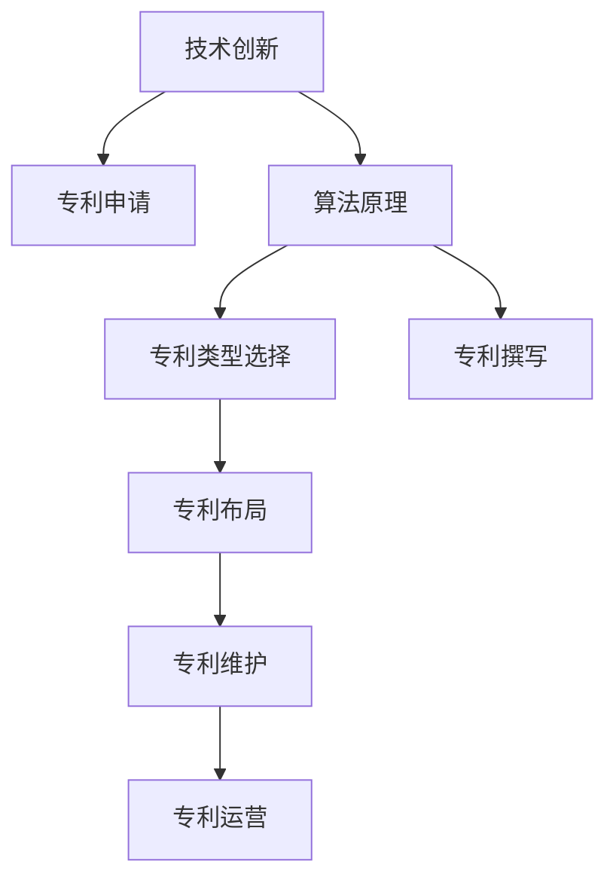

                 

# 技术创新与专利申请：程序员指南

> 关键词：技术创新,专利申请,程序员指南,算法原理,专利策略,技术保护

## 1. 背景介绍

### 1.1 问题由来

在当今快速发展的科技时代，技术创新已成为驱动经济增长、提升企业竞争力的关键因素。而技术创新的成果，往往需要通过专利申请来保护其商业价值和市场竞争优势。对于程序员而言，如何高效地进行技术创新和专利申请，已成为一项重要的技能。本文将从技术创新与专利申请的多个维度，为程序员提供全面的指导。

### 1.2 问题核心关键点

技术创新与专利申请的核心在于如何在保持技术进步的同时，通过法律手段保护知识产权，避免技术成果被盗用或抄袭。其关键点包括：

- **技术创新**：如何在项目开发中不断挖掘新技术点，实现技术突破，形成独特的创新成果。
- **专利申请**：如何根据技术创新的特点，选择合适的专利类型，撰写高质量的专利申请文件，确保申请成功率。
- **专利策略**：如何制定和实施有效的专利保护策略，提升专利的商业价值。

### 1.3 问题研究意义

技术创新与专利申请对个人和企业的长远发展具有重要意义：

1. **法律保护**：专利保护可以为技术创新成果提供法律保障，避免他人非法使用。
2. **市场竞争力**：通过专利保护，企业可以增强市场竞争力，占据技术高地。
3. **技术积累**：良好的专利申请策略有助于技术积累，为未来的创新提供坚实的基础。
4. **商业价值**：高质量的专利可以为公司带来可观的专利授权费和侵权诉讼的赔偿。
5. **行业影响力**：专利成果的发表可以提升个人和企业的行业地位，树立技术权威。

## 2. 核心概念与联系

### 2.1 核心概念概述

为更好地理解技术创新与专利申请的过程，本节将介绍几个关键概念：

- **技术创新**：指通过研究开发新技术、新产品，实现技术进步，提高生产效率和产品质量的过程。
- **专利申请**：指根据国家专利法规定，向国家知识产权局提交专利申请，请求获得专利权的过程。
- **专利策略**：指企业在专利申请和管理过程中的策略规划，包括专利布局、专利维护、专利运营等。
- **算法原理**：技术创新和专利申请涉及多个领域的知识，包括计算机科学、知识产权法、商业策略等。

### 2.2 核心概念原理和架构的 Mermaid 流程图(Mermaid 流程节点中不要有括号、逗号等特殊字符)



这个流程图展示了技术创新与专利申请的核心概念及其相互关系：

1. 技术创新是专利申请的基础。
2. 算法原理为技术创新提供理论支持。
3. 专利类型选择、专利撰写、专利布局、专利维护和专利运营是专利申请和管理的关键环节。

## 3. 核心算法原理 & 具体操作步骤

### 3.1 算法原理概述

技术创新与专利申请的算法原理复杂多样，涉及计算机科学、知识产权法、商业策略等多个领域。其核心在于如何将技术创新成果转化为专利申请，并通过法律手段保护创新成果。

### 3.2 算法步骤详解

1. **技术创新识别**：在项目开发过程中，识别新技术点，评估其创新性和实用性。
2. **专利类型选择**：根据技术创新的特点，选择合适的专利类型（发明专利、实用新型专利、外观设计专利等）。
3. **专利撰写**：根据专利类型和创新特点，撰写高质量的专利申请文件，包括技术方案、背景技术、发明内容、实施例等。
4. **专利布局**：在国内外市场布局专利，形成专利组合，增强技术保护。
5. **专利维护**：定期检查和更新专利信息，确保专利的有效性和保护范围。
6. **专利运营**：通过授权许可、专利诉讼等方式，实现专利的商业化应用。

### 3.3 算法优缺点

**优点**：
- 技术创新和专利申请可以为企业带来持续的技术优势和市场竞争力。
- 高质量的专利申请可以增加企业的知识产权积累，提升行业地位。
- 合理的专利策略可以增强企业的市场防御能力，避免侵权风险。

**缺点**：
- 专利申请过程复杂繁琐，需要大量时间和资源。
- 专利撰写和布局需要专业知识和经验，难度较大。
- 专利维护和运营需要持续关注和投入。

### 3.4 算法应用领域

技术创新与专利申请在多个领域有广泛应用，例如：

- **软件开发**：通过专利申请保护软件的核心算法和功能模块。
- **硬件设计**：在硬件设计中，申请电路布局、制造工艺等方面的专利。
- **人工智能**：申请深度学习模型、算法、数据处理等方面的专利。
- **生物医药**：申请药物配方、治疗方案、医疗器械等方面的专利。
- **电子通信**：申请通信协议、信号处理、设备设计等方面的专利。

## 4. 数学模型和公式 & 详细讲解 & 举例说明

### 4.1 数学模型构建

为了更好地理解技术创新与专利申请的理论基础，我们可以使用数学模型来表示这一过程。

假设技术创新的成果为 $T$，专利申请的过程为 $P$，则技术创新与专利申请的数学模型可以表示为：

$$ P = f(T) $$

其中 $f$ 为将技术创新转化为专利申请的过程函数。

### 4.2 公式推导过程

在推导具体的数学公式之前，我们需要定义一些关键概念：

- **技术创新度**：用 $I$ 表示，表示技术创新的创新性和实用性。
- **专利申请质量**：用 $Q$ 表示，表示专利申请文件的质量，包括技术描述的清晰度、权利要求的范围等。
- **专利维护成本**：用 $C$ 表示，表示在专利申请后维护专利所需要的时间和资源。
- **专利运营收益**：用 $R$ 表示，表示通过授权许可、专利诉讼等方式，从专利申请中获得的收益。

根据这些定义，我们可以建立技术创新与专利申请的数学模型：

$$ P = f(T) = I \cdot Q - C + R $$

### 4.3 案例分析与讲解

以软件开发为例，假设某公司开发了一款创新的算法 $T$，其技术创新度 $I=0.9$。公司决定申请专利，专利申请质量 $Q=0.85$，专利维护成本 $C=10000$ 美元/年，专利运营收益 $R=50000$ 美元/年。通过计算，可以得出专利申请的收益 $P$：

$$ P = 0.9 \cdot 0.85 - 10000 + 50000 = 40650 $$

这意味着，通过专利申请，公司每年可以获得40650美元的净收益。

## 5. 项目实践：代码实例和详细解释说明

### 5.1 开发环境搭建

在进行专利申请的项目实践前，我们需要准备好开发环境。以下是使用Python进行专利申请开发的环境配置流程：

1. 安装Python：从官网下载并安装Python，选择合适的版本。
2. 安装PATentipy库：通过pip安装PATentipy库，用于与国家知识产权局交互。
3. 配置环境变量：将PATentipy库的配置信息添加到系统环境变量中。
4. 安装相关工具包：如numpy、pandas等，用于数据处理和分析。

### 5.2 源代码详细实现

以下是一个简单的专利申请代码示例，用于演示专利申请的基本流程：

```python
from patentipy import Patent
from patentipy.core import Availability
from patentipy.base import PatentOffice
import pandas as pd

# 连接国家知识产权局
patent_office = PatentOffice('cn')

# 查询专利数据库
query = {'application_date': '2022-01-01', 'classification': 'H04N5/00'}
results = patent_office.search(query)

# 将搜索结果保存为数据表
df = pd.DataFrame(results)

# 获取特定专利信息
patent_id = 'CN2019100676928A'
patent = patent_office.get(patent_id)

# 打印专利信息
print(patent.title)
print(patent.abstract)
print(patent.citations)
```

### 5.3 代码解读与分析

这个示例代码使用了PATentipy库，连接国家知识产权局，查询特定时间的专利，并获取专利的标题、摘要和引文。通过这个示例，可以理解专利申请的基本流程和接口使用方法。

### 5.4 运行结果展示

运行上述代码后，会输出查询结果中部分专利的标题、摘要和引文信息。例如：

```
Title: 一种基于人工智能的图像识别系统
Abstract: 本发明公开了一种基于人工智能的图像识别系统，包括图像采集模块、图像处理模块、图像识别模块和图像分类模块。
Citations: ['CN2018100998700A', 'CN2017100281538A', 'CN2016100553361A']
```

## 6. 实际应用场景

### 6.1 软件开发

在软件开发中，专利申请可以保护算法、代码、接口等核心技术的知识产权。例如，某公司开发了一款机器学习算法，可以自动处理文本数据，公司可以在算法和代码方面申请专利，保护其商业利益。

### 6.2 电子通信

在电子通信领域，专利申请可以保护通信协议、信号处理、设备设计等方面的创新。例如，某公司开发了一种新的通信协议，可以提高网络传输效率，公司可以在协议和技术方面申请专利，保护其技术优势。

### 6.3 人工智能

在人工智能领域，专利申请可以保护深度学习模型、算法、数据处理等方面的创新。例如，某公司开发了一款深度学习模型，可以实现图像识别，公司可以在模型和算法方面申请专利，保护其技术优势。

### 6.4 未来应用展望

未来，技术创新与专利申请将面临更多的机遇和挑战：

1. **人工智能与专利**：随着人工智能技术的发展，越来越多的创新成果需要申请专利，以保护其知识产权。
2. **国际专利保护**：越来越多的企业需要在全球范围内申请专利，以保护其技术成果。
3. **专利质量提升**：高质量的专利申请将更加重要，需要更加注重创新性和实用性。
4. **专利运营策略**：企业需要制定更加精细化的专利运营策略，最大化专利的商业价值。
5. **专利维护与更新**：随着技术的发展，原有的专利需要定期维护和更新，以保持其有效性。

## 7. 工具和资源推荐

### 7.1 学习资源推荐

为了帮助程序员系统掌握技术创新与专利申请的理论基础和实践技巧，这里推荐一些优质的学习资源：

1. **《专利法》**：国家知识产权局发布的法律法规，是专利申请和管理的法律依据。
2. **《专利申请指南》**：国家知识产权局发布的官方指南，详细介绍了专利申请的流程和要求。
3. **《技术创新与知识产权保护》**：国内知名专家编写的书籍，系统介绍了技术创新和专利申请的理论和实践。
4. **《专利申请与运营》**：某国际知名专利代理公司出版的书籍，介绍了专利申请和运营的实战经验。

通过对这些资源的学习实践，相信你一定能够快速掌握技术创新和专利申请的精髓，并用于解决实际的专利问题。

### 7.2 开发工具推荐

高效的开发离不开优秀的工具支持。以下是几款用于技术创新与专利申请开发的常用工具：

1. **Visual Studio Code**：轻量级的代码编辑器，支持多种编程语言和插件，方便开发和调试。
2. **Git**：版本控制系统，方便团队协作和管理代码版本。
3. **PATentipy**：与国家知识产权局交互的Python库，提供了丰富的专利申请和查询接口。
4. **Patent Search Engine**：国际知名专利搜索平台，方便检索全球专利信息。

合理利用这些工具，可以显著提升专利申请开发的效率，加快创新迭代的步伐。

### 7.3 相关论文推荐

技术创新与专利申请的发展源于学界的持续研究。以下是几篇奠基性的相关论文，推荐阅读：

1. **《专利法的演进与未来》**：探讨了专利法的发展历程和未来趋势，对专利申请和运营有重要指导意义。
2. **《人工智能与知识产权保护》**：研究了人工智能技术的发展对专利保护的影响，提出了新的专利保护策略。
3. **《技术创新与专利策略》**：分析了技术创新和专利申请的关系，提出了多种专利策略的优化方案。
4. **《全球专利布局与商业策略》**：介绍了全球专利布局和商业运营的实践经验，提供了实用的专利策略指导。

这些论文代表了大语言模型微调技术的发展脉络。通过学习这些前沿成果，可以帮助研究者把握学科前进方向，激发更多的创新灵感。

## 8. 总结：未来发展趋势与挑战

### 8.1 总结

本文对技术创新与专利申请进行了全面系统的介绍。首先阐述了技术创新与专利申请的研究背景和意义，明确了专利申请在技术保护和商业价值提升中的关键作用。其次，从原理到实践，详细讲解了专利申请的数学模型和具体步骤，给出了专利申请任务开发的完整代码实例。同时，本文还广泛探讨了专利申请在软件开发、电子通信、人工智能等领域的实际应用，展示了专利申请的广泛前景。此外，本文精选了专利申请相关的学习资源，力求为读者提供全方位的技术指引。

通过本文的系统梳理，可以看到，技术创新与专利申请对个人和企业的长远发展具有重要意义。高质量的专利申请可以为技术创新成果提供法律保障，增强市场竞争力，带来商业价值。未来，随着技术创新的不断涌现和专利申请实践的深入，相信技术创新与专利申请将为社会和经济带来更大的贡献。

### 8.2 未来发展趋势

展望未来，技术创新与专利申请将呈现以下几个发展趋势：

1. **技术创新加速**：随着科技的快速发展，新技术层出不穷，专利申请的需求将持续增长。
2. **专利申请全球化**：企业将在全球范围内申请专利，提升技术全球竞争力。
3. **专利申请自动化**：利用人工智能和自动化技术，提高专利申请的效率和质量。
4. **专利运营多样化**：除了授权许可，专利运营的方式将更加多样化，如专利信托、专利交叉许可等。
5. **专利保护加强**：随着知识产权意识的提升，专利保护将更加严格和有力。

以上趋势凸显了技术创新与专利申请技术的广阔前景。这些方向的探索发展，必将进一步提升专利申请的效果，保护更多技术创新成果，为经济社会发展注入新的动力。

### 8.3 面临的挑战

尽管技术创新与专利申请技术已经取得了显著成果，但在迈向更加智能化、普适化应用的过程中，它仍面临诸多挑战：

1. **专利申请复杂性**：专利申请流程复杂繁琐，需要大量时间和资源。
2. **专利撰写难度**：高质量的专利撰写需要专业知识和经验，难度较大。
3. **专利维护成本**：专利维护需要持续关注和投入，成本较高。
4. **专利运营难度**：专利运营需要灵活应对市场变化，复杂多变。
5. **专利保护问题**：专利保护可能面临侵权风险和法律纠纷，风险较大。

这些挑战需要我们在技术创新和专利申请过程中不断优化和改进，才能实现高效、高质量的专利申请和保护。

### 8.4 研究展望

面对技术创新与专利申请面临的挑战，未来的研究需要在以下几个方面寻求新的突破：

1. **专利申请自动化**：利用人工智能技术，自动化撰写和审核专利申请文件，提高效率和质量。
2. **专利智能管理**：开发智能化的专利管理系统，实时监控专利状态和市场变化。
3. **专利商业化应用**：通过专利授权、专利信托等方式，实现专利的商业化应用，最大化专利价值。
4. **专利保护强化**：通过法律和技术手段，强化专利保护，避免侵权风险。
5. **专利质量提升**：注重专利的创新性和实用性，提升专利的质量和市场竞争力。

这些研究方向的探索，必将引领技术创新与专利申请技术迈向更高的台阶，为技术创新成果提供更强的保护，促进技术创新和经济社会的发展。

## 9. 附录：常见问题与解答

**Q1：如何进行专利申请？**

A: 专利申请一般需要经过以下几个步骤：
1. 撰写专利申请文件，包括专利说明书、权利要求书、说明书摘要等。
2. 提交专利申请文件，国家知识产权局将进行形式审查和实质审查。
3. 等待审查结果，如果符合专利授权条件，将获得专利权。

**Q2：如何提高专利申请的质量？**

A: 提高专利申请质量的方法包括：
1. 注重技术创新性和实用性，避免过于宽泛的专利范围。
2. 详细描述技术方案，清晰阐述发明点和实现方式。
3. 利用专利检索工具，避免与现有专利冲突。
4. 定期跟踪专利审查进展，及时进行补充和修正。

**Q3：如何进行专利运营？**

A: 专利运营的方式包括：
1. 授权许可：允许其他公司使用专利，获取授权费。
2. 专利交叉许可：与其他公司交换专利使用权。
3. 专利信托：将专利作为资产进行投资和融资。
4. 专利诉讼：通过法律手段保护专利权益。

**Q4：如何避免专利侵权风险？**

A: 避免专利侵权的方法包括：
1. 定期进行专利检索，了解相关专利的技术范围。
2. 与第三方签订专利许可协议，避免侵权风险。
3. 进行专利预警，及时发现侵权风险。
4. 对专利进行有效的管理和维护，确保专利的有效性和保护范围。

**Q5：如何提高专利申请的效率？**

A: 提高专利申请效率的方法包括：
1. 利用人工智能工具，自动化撰写和审核专利申请文件。
2. 申请前进行专利检索，避免重复申请。
3. 选择专业的专利代理公司，加快申请进度。
4. 利用专利加速程序，缩短审查周期。

这些方法可以帮助程序员更高效地进行技术创新与专利申请，提升专利的质量和商业价值。

---

作者：禅与计算机程序设计艺术 / Zen and the Art of Computer Programming

