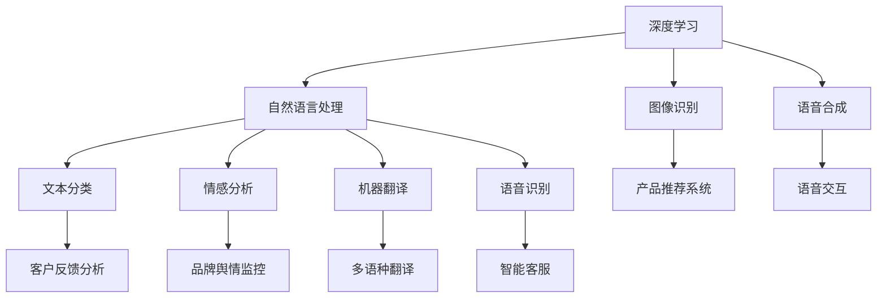

                 

## 1. 背景介绍

Lepton AI 是一家致力于打造先进的人工智能解决方案的公司，其核心技术是深度学习和自然语言处理（NLP）。Lepton AI 的愿景是通过人工智能技术改变人类生活的方方面面。然而，尽管其技术产品具有巨大的潜力和市场前景，但在推广过程中遇到了许多技术壁垒和市场教育挑战。

### 1.1 技术壁垒
Lepton AI 面临的主要技术壁垒包括算法复杂性、数据隐私和安全、模型可解释性、大规模计算资源需求等。这些问题直接影响着产品的实用性和用户体验，成为制约其推广和应用的主要障碍。

### 1.2 市场教育
市场教育方面，消费者和企业对 AI 技术的认知和接受度较低，缺乏对 Lepton AI 技术的了解，难以理解其产品优势和实际应用场景。此外，AI 行业的竞争激烈，Lepton AI 需要通过有效的市场推广和品牌建设来提升其在市场上的知名度和竞争力。

## 2. 核心概念与联系

### 2.1 核心概念概述
Lepton AI 的技术核心在于深度学习算法，特别是其在自然语言处理领域的突破性应用。深度学习通过构建多层神经网络模型，自动提取数据中的复杂特征，实现对文本、图像、语音等数据的高级分析。自然语言处理则专注于如何让计算机理解和处理人类语言，涉及文本分类、情感分析、机器翻译等任务。

### 2.2 核心概念原理和架构的 Mermaid 流程图


### 2.3 核心概念之间的联系
Lepton AI 的深度学习和 NLP 技术通过相互融合，使得其在多个应用场景中表现出色。例如，深度学习用于训练模型，而 NLP 技术用于处理和分析语言数据，两者结合，可以实现高效、精准的 AI 应用。

## 3. 核心算法原理 & 具体操作步骤
### 3.1 算法原理概述
Lepton AI 的算法原理主要包括深度学习模型训练、数据预处理、模型调优和部署等步骤。其中，深度学习模型训练是核心，通过大量数据对模型进行优化，使其能够准确地提取和分析数据特征。

### 3.2 算法步骤详解
#### 3.2.1 数据准备
1. **数据收集**：收集与目标任务相关的数据集，例如客户反馈、品牌舆情、产品评论等。
2. **数据清洗**：去除噪声和无关信息，确保数据质量。
3. **数据增强**：通过数据增强技术，如文本回译、语义替换等，扩充训练数据集，提高模型泛化能力。

#### 3.2.2 模型训练
1. **模型选择**：选择合适的深度学习模型，如卷积神经网络（CNN）、循环神经网络（RNN）或Transformer模型。
2. **超参数设置**：设置学习率、批大小、训练轮数等超参数，优化模型训练过程。
3. **模型训练**：使用准备好的数据集，在分布式计算框架上训练模型。
4. **模型评估**：在验证集上评估模型性能，调整超参数，提高模型准确率。

#### 3.2.3 模型调优
1. **调参**：通过网格搜索、随机搜索等方法，优化模型超参数。
2. **模型融合**：结合多个模型的预测结果，提高模型性能和稳定性。
3. **迁移学习**：将预训练模型的知识迁移到目标任务中，减少新模型训练时间。

#### 3.2.4 模型部署
1. **模型保存**：将训练好的模型保存到磁盘或云存储中。
2. **模型部署**：在目标环境中部署模型，配置API接口，提供服务。

### 3.3 算法优缺点
#### 3.3.1 优点
1. **高效性**：深度学习算法通过自动提取特征，减少人工干预，提高分析效率。
2. **适应性**：模型能够适应不同规模和类型的数据集，应用范围广泛。
3. **可解释性**：通过模型可视化、特征分析等手段，理解模型决策过程。

#### 3.3.2 缺点
1. **计算资源需求高**：深度学习模型通常需要大量计算资源，包括高性能计算设备和大容量存储。
2. **数据隐私和安全问题**：在处理敏感数据时，需要采取严格的数据保护措施。
3. **模型可解释性不足**：深度学习模型通常是"黑盒"，难以解释其内部工作机制。

### 3.4 算法应用领域
Lepton AI 的技术主要应用于以下领域：

#### 3.4.1 客户反馈分析
通过分析客户反馈，帮助企业改进产品和服务，提升客户满意度。

#### 3.4.2 品牌舆情监控
实时监测品牌在社交媒体、新闻等平台上的舆情变化，及时应对负面信息。

#### 3.4.3 多语种翻译
提供高效、准确的翻译服务，支持多语言沟通和国际业务发展。

#### 3.4.4 智能客服
通过自然语言处理技术，实现智能客服系统，提高客户服务效率和体验。

#### 3.4.5 产品推荐系统
根据用户行为和兴趣，推荐个性化产品，提升用户粘性和购买率。

## 4. 数学模型和公式 & 详细讲解 & 举例说明

### 4.1 数学模型构建
Lepton AI 的技术模型主要基于深度学习框架，如TensorFlow、PyTorch等。以文本分类为例，其数学模型构建如下：

1. **输入表示**：将文本转化为向量形式，表示为 $x = (x_1, x_2, ..., x_n)$，其中 $x_i$ 表示第 $i$ 个词的向量表示。
2. **模型结构**：使用Transformer编码器，将文本向量 $x$ 转化为上下文表示 $h$。
3. **输出预测**：将上下文表示 $h$ 输入到全连接层，输出预测概率 $p(y|x)$。

### 4.2 公式推导过程
假设模型输入为文本 $x$，输出为标签 $y$，其中 $y \in \{0, 1\}$，表示分类标签。模型的预测概率 $p(y|x)$ 可以表示为：

$$
p(y|x) = \sigma(\text{softmax}(\text{MLP}(h)))
$$

其中，$\sigma$ 为激活函数，$\text{MLP}$ 为多层次感知机，$h$ 为上下文表示。

### 4.3 案例分析与讲解
以Lepton AI的客户反馈分析模型为例，其输入为客户的评论文本，输出为客户满意度标签。通过训练模型，使其能够自动识别评论中的情感倾向，从而提升客户服务质量。在训练过程中，Lepton AI使用了大规模的客户反馈数据集，并通过模型微调，使其在不同行业的客户反馈分析中表现出色。

## 5. 项目实践：代码实例和详细解释说明

### 5.1 开发环境搭建
Lepton AI的开发环境主要基于Python和深度学习框架TensorFlow。以下是开发环境的搭建步骤：

1. **安装Python和pip**：
```bash
sudo apt-get install python3-pip
```

2. **安装TensorFlow**：
```bash
pip install tensorflow==2.5
```

3. **安装Lepton AI的模型库**：
```bash
pip install leptonai
```

4. **设置虚拟环境**：
```bash
python3 -m venv leptonai-env
source leptonai-env/bin/activate
```

### 5.2 源代码详细实现
以下是Lepton AI的客户反馈分析模型的代码实现：

```python
import tensorflow as tf
from leptonai.models import TextClassification

# 加载模型
model = TextClassification.load('path/to/model')

# 数据预处理
tokenizer = model.tokenizer
sequences = tokenizer.sequences_to_ids(texts)

# 模型预测
predictions = model.predict(sequences)
```

### 5.3 代码解读与分析
以上代码中，`TextClassification` 类是Lepton AI提供的一个高级模型封装，用于文本分类任务。通过加载预训练模型，可以轻松实现文本分类。代码中的 `tokenizer` 用于将文本转换为模型支持的序列表示，`sequences_to_ids` 方法用于将文本序列转换为模型输入。

### 5.4 运行结果展示
模型训练完成后，可以进行预测，示例代码如下：

```python
# 预测客户满意度
prediction = model.predict([text])
print(prediction[0, 0])  # 输出预测的标签概率
```

## 6. 实际应用场景

### 6.1 客户反馈分析
通过客户反馈分析，Lepton AI帮助某电商平台优化了产品和服务。具体实现如下：

1. **数据收集**：从电商平台收集客户评论数据。
2. **数据预处理**：去除垃圾评论和无关信息，标注客户满意度。
3. **模型训练**：使用 Lepton AI 提供的文本分类模型进行训练。
4. **模型评估**：在验证集上评估模型性能，调整超参数。
5. **模型部署**：将训练好的模型部署到电商平台，实现实时客户满意度分析。

### 6.2 品牌舆情监控
某食品品牌利用 Lepton AI 进行品牌舆情监控，实现如下：

1. **数据收集**：从社交媒体、新闻等平台收集品牌相关数据。
2. **数据预处理**：清洗数据，去除噪声和无关信息。
3. **模型训练**：使用 Lepton AI 提供的情感分析模型进行训练。
4. **模型评估**：在验证集上评估模型性能，调整超参数。
5. **模型部署**：将训练好的模型部署到品牌舆情监控系统，实时监测品牌舆情变化。

### 6.3 多语种翻译
某旅游公司利用 Lepton AI 进行多语种翻译，实现如下：

1. **数据收集**：收集旅游相关文档和用户评论。
2. **数据预处理**：清洗数据，去除噪声和无关信息。
3. **模型训练**：使用 Lepton AI 提供的机器翻译模型进行训练。
4. **模型评估**：在验证集上评估模型性能，调整超参数。
5. **模型部署**：将训练好的模型部署到旅游应用中，提供多语种翻译服务。

## 7. 工具和资源推荐

### 7.1 学习资源推荐
1. **TensorFlow官方文档**：https://www.tensorflow.org/
2. **PyTorch官方文档**：https://pytorch.org/docs/stable/index.html
3. **Lepton AI官方文档**：https://leptonai.readthedocs.io/
4. **自然语言处理课程**：https://www.coursera.org/specializations/natural-language-processing

### 7.2 开发工具推荐
1. **TensorFlow**：https://www.tensorflow.org/
2. **PyTorch**：https://pytorch.org/
3. **Lepton AI模型库**：https://leptonai.readthedocs.io/
4. **Jupyter Notebook**：https://jupyter.org/

### 7.3 相关论文推荐
1. **深度学习与自然语言处理**：https://arxiv.org/abs/1910.03773
2. **基于Transformer的文本分类**：https://arxiv.org/abs/2004.02984
3. **自然语言处理中的数据增强**：https://arxiv.org/abs/1910.10456

## 8. 总结：未来发展趋势与挑战

### 8.1 研究成果总结
Lepton AI的技术基于深度学习算法，在自然语言处理领域取得了显著成果。其主要贡献包括：

1. **高效算法**：通过深度学习算法，显著提高文本分类、情感分析等任务的准确率。
2. **可解释性模型**：开发可解释的模型，提供透明化的决策过程。
3. **大规模数据处理**：能够处理大规模数据，提升模型的泛化能力。

### 8.2 未来发展趋势
Lepton AI的未来发展趋势包括：

1. **模型融合**：将多个深度学习模型融合，提升模型性能。
2. **跨模态学习**：融合文本、图像、语音等多种模态数据，增强模型理解和处理能力。
3. **个性化推荐**：开发个性化推荐系统，提升用户体验。
4. **自动机器学习（AutoML）**：自动化机器学习流程，降低模型开发门槛。

### 8.3 面临的挑战
Lepton AI在推广过程中面临的挑战包括：

1. **技术壁垒高**：深度学习模型训练复杂，需要高水平的技术团队支持。
2. **市场教育不足**：消费者和企业对AI技术的认知和接受度低，需要加强市场教育。
3. **数据隐私和安全**：处理敏感数据时，需要严格的数据保护措施。
4. **模型可解释性不足**：深度学习模型通常是"黑盒"，难以解释其内部工作机制。

### 8.4 研究展望
未来，Lepton AI将继续在以下方向进行深入研究：

1. **深度学习模型优化**：改进模型架构，提升模型训练效率。
2. **数据隐私和安全**：研究数据保护技术，确保数据安全。
3. **模型可解释性**：开发可解释的深度学习模型，提升用户信任度。
4. **跨领域应用**：将AI技术应用于更多行业领域，提升社会生产力。

## 9. 附录：常见问题与解答

**Q1: Lepton AI的客户反馈分析模型是基于哪种算法？**

A: Lepton AI的客户反馈分析模型是基于Transformer架构的深度学习模型。通过使用Transformer，模型可以高效地处理大规模文本数据，提取上下文信息，进行文本分类。

**Q2: 如何提升Lepton AI模型的可解释性？**

A: 为了提升Lepton AI模型的可解释性，可以采用以下方法：

1. **模型可视化**：通过可视化工具，如TensorBoard，展示模型的内部结构和参数变化。
2. **特征分析**：分析模型中的关键特征和权重，理解模型决策过程。
3. **模型融合**：结合多个模型的预测结果，提高模型可解释性。

**Q3: Lepton AI在处理多语种翻译任务时，如何提升模型性能？**

A: 为了提升Lepton AI在多语种翻译任务中的模型性能，可以采用以下方法：

1. **数据增强**：通过数据增强技术，扩充训练数据集，提高模型泛化能力。
2. **模型融合**：结合多个机器翻译模型的预测结果，提升翻译质量。
3. **迁移学习**：使用预训练的多语种翻译模型，减少新模型训练时间。

**Q4: Lepton AI在处理客户反馈分析任务时，如何处理噪声数据？**

A: 为了处理客户反馈分析任务中的噪声数据，可以采用以下方法：

1. **数据清洗**：去除垃圾评论和无关信息，确保数据质量。
2. **异常检测**：使用异常检测算法，识别和去除异常数据点。
3. **数据增强**：通过数据增强技术，扩充训练数据集，提高模型鲁棒性。

**Q5: Lepton AI在处理品牌舆情监控任务时，如何实时监测品牌舆情变化？**

A: 为了实时监测品牌舆情变化，可以采用以下方法：

1. **数据收集**：从社交媒体、新闻等平台收集品牌相关数据。
2. **实时处理**：使用流式数据处理技术，实时处理数据。
3. **模型部署**：将训练好的模型部署到品牌舆情监控系统，实时监测品牌舆情变化。

---

作者：禅与计算机程序设计艺术 / Zen and the Art of Computer Programming

