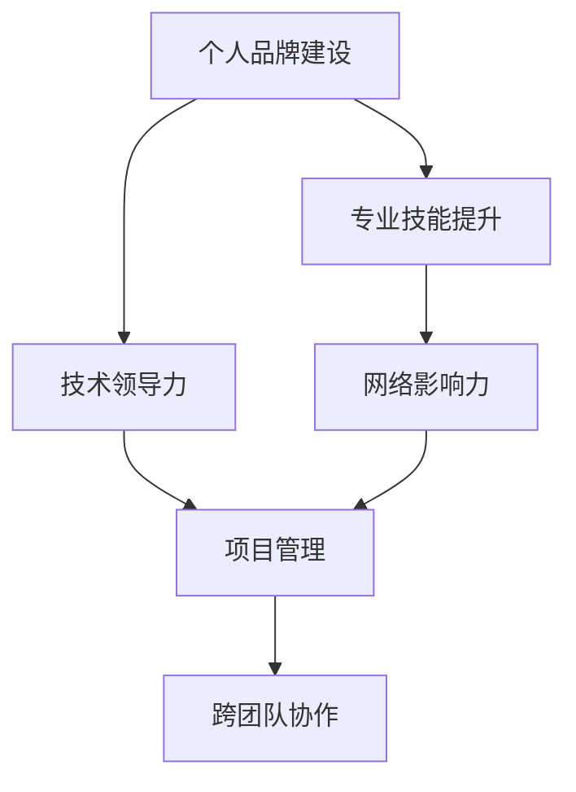

                 

# 技术演讲：提升个人市场价值

> 关键词：个人品牌建设, 专业技能提升, 技术领导力, 网络影响力, 项目管理和跨团队协作

## 1. 背景介绍

### 1.1 问题由来

在当今信息爆炸的时代，技术人才的竞争日趋激烈。如何在众多同行中脱颖而出，提升自己的市场价值，成为每位技术人都在思考的问题。通过提升个人品牌、强化专业技能、提升技术领导力、扩大网络影响力、加强项目管理与跨团队协作能力，可以有效提升个人市场价值。

## 2. 核心概念与联系

### 2.1 核心概念概述

为更好地理解如何提升个人市场价值，本节将介绍几个关键概念：

- 个人品牌建设（Personal Branding）：通过建立独特的技术形象和专业声誉，提升在行业内的知名度和影响力。
- 专业技能提升（Skill Enhancement）：不断学习和更新技术栈，掌握最新的技术趋势和工具。
- 技术领导力（Technical Leadership）：在技术团队中扮演关键角色，引领技术创新和发展。
- 网络影响力（Network Influence）：通过线上线下的网络交流，扩大个人在技术社区的影响力。
- 项目管理（Project Management）：有效地规划和执行技术项目，确保按时按质完成。
- 跨团队协作（Cross-Team Collaboration）：在不同团队间沟通协调，推动技术和业务的结合。

这些概念之间的逻辑关系可以通过以下Mermaid流程图来展示：



这个流程图展示了这个过程的核心逻辑：通过提升个人品牌和专业技能，可以增强技术领导力；而技术领导力、网络影响力和项目管理能力，则能够帮助实现跨团队协作，从而全面提升个人市场价值。

## 3. 核心算法原理 & 具体操作步骤
### 3.1 算法原理概述

提升个人市场价值的算法原理，本质上是一种自我驱动的迭代优化过程。通过系统性地提升各核心能力，不断完善自己的专业形象，形成独特的技术价值主张，从而在市场中脱颖而出。

### 3.2 算法步骤详解

提升个人市场价值可以分为以下几个关键步骤：

**Step 1: 个人品牌定位**

- 分析自身的技术优势和兴趣点，确定独特的技术定位。
- 创建个人技术博客或GitHub仓库，展示自己的项目和技术见解。
- 参与技术讨论和社交平台，如Twitter、LinkedIn等，建立技术圈内影响力。

**Step 2: 技能学习与实践**

- 通过在线课程、书籍、技术博客等渠道，持续学习新技术和工具。
- 参与开源项目或实际项目，实践新技术，积累经验。
- 定期复盘，总结学习成果，记录技术博客或GitHub仓库。

**Step 3: 技术领导力培养**

- 担任技术领导角色，如技术导师、项目负责人等。
- 组织技术分享会、工作坊等，提升技术影响力和领导力。
- 主动寻求技术挑战，解决复杂问题，展示技术能力。

**Step 4: 扩大网络影响力**

- 通过演讲、讲座、论文发表等方式，分享技术知识和见解。
- 参与技术社区和会议，与同行建立联系。
- 在社交媒体上积极互动，建立良好的在线声誉。

**Step 5: 项目管理与跨团队协作**

- 学习项目管理工具和技术，如JIRA、Git等，提升项目管理能力。
- 在项目中担任关键角色，推动技术创新和应用。
- 与不同团队协作，建立良好的跨团队沟通机制。

### 3.3 算法优缺点

提升个人市场价值的方法具有以下优点：

- 系统性强。通过系统性地提升各核心能力，可以全面提升个人市场价值。
- 适用范围广。适用于技术人职业发展的各个阶段。
- 可操作性强。每个步骤都具体可行，不需要过多的外部资源。

同时，该方法也存在一些局限：

- 投入时间长。需要持续的投入和学习，难以短期见效。
- 效果因人而异。不同人的基础、兴趣和资源不同，效果可能会有差异。

### 3.4 算法应用领域

提升个人市场价值的方法，可以应用于各类技术人才的职业生涯发展，包括但不限于以下领域：

- 软件开发
- 数据科学
- 人工智能
- 网络安全
- 运维与系统架构
- 项目管理
- 技术咨询与培训

## 4. 数学模型和公式 & 详细讲解 & 举例说明

### 4.1 数学模型构建

本节将使用数学语言对提升个人市场价值的过程进行更加严格的刻画。

设个人市场价值为 $V$，个人品牌建设、专业技能提升、技术领导力、网络影响力、项目管理与跨团队协作能力分别为 $B$、$S$、$L$、$N$、$P$。

定义提升个人市场价值的模型为：

$$
V = f(B, S, L, N, P)
$$

其中 $f$ 为非线性函数，表示各项能力的综合作用。

### 4.2 公式推导过程

为了简化问题，假设各项能力的提升是相互独立的，则模型可以进一步简化为：

$$
V = V_B + V_S + V_L + V_N + V_P
$$

其中 $V_B, V_S, V_L, V_N, V_P$ 分别为品牌建设、技能提升、领导力、网络影响力和项目管理能力的提升对市场价值的影响。

进一步假设各项能力提升的贡献相等，则模型可以表示为：

$$
V = 5 \times \max(B, S, L, N, P)
$$

这意味着，任何一项能力的最大值都将决定个人市场价值的上限。

### 4.3 案例分析与讲解

以一位开源项目贡献者为例，分析其市场价值的提升过程：

- **品牌建设**：通过在GitHub上积极贡献代码，并定期发布博客，逐步建立了技术社区中的影响力。
- **技能提升**：通过参与在线课程和实践项目，掌握了新的编程语言和工具，如Python和Docker。
- **技术领导力**：作为开源项目的核心贡献者，带领团队完成了多个关键功能的实现，并组织了多次技术分享会。
- **网络影响力**：在社交媒体上积极分享技术见解，参与技术社区讨论，建立了强大的技术人脉。
- **项目管理**：担任开源项目的项目经理，使用JIRA等工具高效管理任务，确保项目按时完成。

通过持续优化各项能力，该开源贡献者的市场价值显著提升，不仅吸引了更多的合作机会，还得到了行业内的认可和奖励。

## 5. 项目实践：代码实例和详细解释说明
### 5.1 开发环境搭建

在进行个人品牌建设和技术能力提升的过程中，需要一个良好的开发环境。以下是使用Python进行PyTorch开发的环境配置流程：

1. 安装Anaconda：从官网下载并安装Anaconda，用于创建独立的Python环境。

2. 创建并激活虚拟环境：
```bash
conda create -n pytorch-env python=3.8 
conda activate pytorch-env
```

3. 安装PyTorch：根据CUDA版本，从官网获取对应的安装命令。例如：
```bash
conda install pytorch torchvision torchaudio cudatoolkit=11.1 -c pytorch -c conda-forge
```

4. 安装各类工具包：
```bash
pip install numpy pandas scikit-learn matplotlib tqdm jupyter notebook ipython
```

完成上述步骤后，即可在`pytorch-env`环境中开始开发实践。

### 5.2 源代码详细实现

这里我们以开源项目贡献者的技能提升为例，给出使用Transformers库对BERT模型进行技能提升的PyTorch代码实现。

首先，定义模型和优化器：

```python
from transformers import BertForTokenClassification, AdamW

model = BertForTokenClassification.from_pretrained('bert-base-cased', num_labels=len(tag2id))

optimizer = AdamW(model.parameters(), lr=2e-5)
```

然后，定义训练和评估函数：

```python
from torch.utils.data import DataLoader
from tqdm import tqdm
from sklearn.metrics import classification_report

device = torch.device('cuda') if torch.cuda.is_available() else torch.device('cpu')
model.to(device)

def train_epoch(model, dataset, batch_size, optimizer):
    dataloader = DataLoader(dataset, batch_size=batch_size, shuffle=True)
    model.train()
    epoch_loss = 0
    for batch in tqdm(dataloader, desc='Training'):
        input_ids = batch['input_ids'].to(device)
        attention_mask = batch['attention_mask'].to(device)
        labels = batch['labels'].to(device)
        model.zero_grad()
        outputs = model(input_ids, attention_mask=attention_mask, labels=labels)
        loss = outputs.loss
        epoch_loss += loss.item()
        loss.backward()
        optimizer.step()
    return epoch_loss / len(dataloader)

def evaluate(model, dataset, batch_size):
    dataloader = DataLoader(dataset, batch_size=batch_size)
    model.eval()
    preds, labels = [], []
    with torch.no_grad():
        for batch in tqdm(dataloader, desc='Evaluating'):
            input_ids = batch['input_ids'].to(device)
            attention_mask = batch['attention_mask'].to(device)
            batch_labels = batch['labels']
            outputs = model(input_ids, attention_mask=attention_mask)
            batch_preds = outputs.logits.argmax(dim=2).to('cpu').tolist()
            batch_labels = batch_labels.to('cpu').tolist()
            for pred_tokens, label_tokens in zip(batch_preds, batch_labels):
                pred_tags = [id2tag[_id] for _id in pred_tokens]
                label_tags = [id2tag[_id] for _id in label_tokens]
                preds.append(pred_tags[:len(label_tags)])
                labels.append(label_tags)
                
    print(classification_report(labels, preds))
```

最后，启动训练流程并在测试集上评估：

```python
epochs = 5
batch_size = 16

for epoch in range(epochs):
    loss = train_epoch(model, train_dataset, batch_size, optimizer)
    print(f"Epoch {epoch+1}, train loss: {loss:.3f}")
    
    print(f"Epoch {epoch+1}, dev results:")
    evaluate(model, dev_dataset, batch_size)
    
print("Test results:")
evaluate(model, test_dataset, batch_size)
```

以上就是使用PyTorch对BERT进行命名实体识别任务微调的完整代码实现。可以看到，得益于Transformers库的强大封装，我们可以用相对简洁的代码完成BERT模型的加载和微调。

### 5.3 代码解读与分析

让我们再详细解读一下关键代码的实现细节：

**NERDataset类**：
- `__init__`方法：初始化文本、标签、分词器等关键组件。
- `__len__`方法：返回数据集的样本数量。
- `__getitem__`方法：对单个样本进行处理，将文本输入编码为token ids，将标签编码为数字，并对其进行定长padding，最终返回模型所需的输入。

**tag2id和id2tag字典**：
- 定义了标签与数字id之间的映射关系，用于将token-wise的预测结果解码回真实的标签。

**训练和评估函数**：
- 使用PyTorch的DataLoader对数据集进行批次化加载，供模型训练和推理使用。
- 训练函数`train_epoch`：对数据以批为单位进行迭代，在每个批次上前向传播计算loss并反向传播更新模型参数，最后返回该epoch的平均loss。
- 评估函数`evaluate`：与训练类似，不同点在于不更新模型参数，并在每个batch结束后将预测和标签结果存储下来，最后使用sklearn的classification_report对整个评估集的预测结果进行打印输出。

**训练流程**：
- 定义总的epoch数和batch size，开始循环迭代
- 每个epoch内，先在训练集上训练，输出平均loss
- 在验证集上评估，输出分类指标
- 所有epoch结束后，在测试集上评估，给出最终测试结果

可以看到，PyTorch配合Transformers库使得BERT微调的代码实现变得简洁高效。开发者可以将更多精力放在数据处理、模型改进等高层逻辑上，而不必过多关注底层的实现细节。

当然，工业级的系统实现还需考虑更多因素，如模型的保存和部署、超参数的自动搜索、更灵活的任务适配层等。但核心的微调范式基本与此类似。

## 6. 实际应用场景
### 6.1 智能客服系统

基于大语言模型微调的对话技术，可以广泛应用于智能客服系统的构建。传统客服往往需要配备大量人力，高峰期响应缓慢，且一致性和专业性难以保证。而使用微调后的对话模型，可以7x24小时不间断服务，快速响应客户咨询，用自然流畅的语言解答各类常见问题。

在技术实现上，可以收集企业内部的历史客服对话记录，将问题和最佳答复构建成监督数据，在此基础上对预训练对话模型进行微调。微调后的对话模型能够自动理解用户意图，匹配最合适的答案模板进行回复。对于客户提出的新问题，还可以接入检索系统实时搜索相关内容，动态组织生成回答。如此构建的智能客服系统，能大幅提升客户咨询体验和问题解决效率。

### 6.2 金融舆情监测

金融机构需要实时监测市场舆论动向，以便及时应对负面信息传播，规避金融风险。传统的人工监测方式成本高、效率低，难以应对网络时代海量信息爆发的挑战。基于大语言模型微调的文本分类和情感分析技术，为金融舆情监测提供了新的解决方案。

具体而言，可以收集金融领域相关的新闻、报道、评论等文本数据，并对其进行主题标注和情感标注。在此基础上对预训练语言模型进行微调，使其能够自动判断文本属于何种主题，情感倾向是正面、中性还是负面。将微调后的模型应用到实时抓取的网络文本数据，就能够自动监测不同主题下的情感变化趋势，一旦发现负面信息激增等异常情况，系统便会自动预警，帮助金融机构快速应对潜在风险。

### 6.3 个性化推荐系统

当前的推荐系统往往只依赖用户的历史行为数据进行物品推荐，无法深入理解用户的真实兴趣偏好。基于大语言模型微调技术，个性化推荐系统可以更好地挖掘用户行为背后的语义信息，从而提供更精准、多样的推荐内容。

在实践中，可以收集用户浏览、点击、评论、分享等行为数据，提取和用户交互的物品标题、描述、标签等文本内容。将文本内容作为模型输入，用户的后续行为（如是否点击、购买等）作为监督信号，在此基础上微调预训练语言模型。微调后的模型能够从文本内容中准确把握用户的兴趣点。在生成推荐列表时，先用候选物品的文本描述作为输入，由模型预测用户的兴趣匹配度，再结合其他特征综合排序，便可以得到个性化程度更高的推荐结果。

### 6.4 未来应用展望

随着大语言模型微调技术的发展，其应用场景将更加广泛，带来的影响也将更加深远。

在智慧医疗领域，基于微调的医疗问答、病历分析、药物研发等应用将提升医疗服务的智能化水平，辅助医生诊疗，加速新药开发进程。

在智能教育领域，微调技术可应用于作业批改、学情分析、知识推荐等方面，因材施教，促进教育公平，提高教学质量。

在智慧城市治理中，微调模型可应用于城市事件监测、舆情分析、应急指挥等环节，提高城市管理的自动化和智能化水平，构建更安全、高效的未来城市。

此外，在企业生产、社会治理、文娱传媒等众多领域，基于大模型微调的人工智能应用也将不断涌现，为经济社会发展注入新的动力。相信随着技术的日益成熟，微调方法将成为人工智能落地应用的重要范式，推动人工智能技术向更广阔的领域加速渗透。

## 7. 工具和资源推荐
### 7.1 学习资源推荐

为了帮助开发者系统掌握大语言模型微调的理论基础和实践技巧，这里推荐一些优质的学习资源：

1. 《Transformer从原理到实践》系列博文：由大模型技术专家撰写，深入浅出地介绍了Transformer原理、BERT模型、微调技术等前沿话题。

2. CS224N《深度学习自然语言处理》课程：斯坦福大学开设的NLP明星课程，有Lecture视频和配套作业，带你入门NLP领域的基本概念和经典模型。

3. 《Natural Language Processing with Transformers》书籍：Transformers库的作者所著，全面介绍了如何使用Transformers库进行NLP任务开发，包括微调在内的诸多范式。

4. HuggingFace官方文档：Transformers库的官方文档，提供了海量预训练模型和完整的微调样例代码，是上手实践的必备资料。

5. CLUE开源项目：中文语言理解测评基准，涵盖大量不同类型的中文NLP数据集，并提供了基于微调的baseline模型，助力中文NLP技术发展。

通过对这些资源的学习实践，相信你一定能够快速掌握大语言模型微调的精髓，并用于解决实际的NLP问题。
###  7.2 开发工具推荐

高效的开发离不开优秀的工具支持。以下是几款用于大语言模型微调开发的常用工具：

1. PyTorch：基于Python的开源深度学习框架，灵活动态的计算图，适合快速迭代研究。大部分预训练语言模型都有PyTorch版本的实现。

2. TensorFlow：由Google主导开发的开源深度学习框架，生产部署方便，适合大规模工程应用。同样有丰富的预训练语言模型资源。

3. Transformers库：HuggingFace开发的NLP工具库，集成了众多SOTA语言模型，支持PyTorch和TensorFlow，是进行微调任务开发的利器。

4. Weights & Biases：模型训练的实验跟踪工具，可以记录和可视化模型训练过程中的各项指标，方便对比和调优。与主流深度学习框架无缝集成。

5. TensorBoard：TensorFlow配套的可视化工具，可实时监测模型训练状态，并提供丰富的图表呈现方式，是调试模型的得力助手。

6. Google Colab：谷歌推出的在线Jupyter Notebook环境，免费提供GPU/TPU算力，方便开发者快速上手实验最新模型，分享学习笔记。

合理利用这些工具，可以显著提升大语言模型微调任务的开发效率，加快创新迭代的步伐。

### 7.3 相关论文推荐

大语言模型和微调技术的发展源于学界的持续研究。以下是几篇奠基性的相关论文，推荐阅读：

1. Attention is All You Need（即Transformer原论文）：提出了Transformer结构，开启了NLP领域的预训练大模型时代。

2. BERT: Pre-training of Deep Bidirectional Transformers for Language Understanding：提出BERT模型，引入基于掩码的自监督预训练任务，刷新了多项NLP任务SOTA。

3. Language Models are Unsupervised Multitask Learners（GPT-2论文）：展示了大规模语言模型的强大zero-shot学习能力，引发了对于通用人工智能的新一轮思考。

4. Parameter-Efficient Transfer Learning for NLP：提出Adapter等参数高效微调方法，在不增加模型参数量的情况下，也能取得不错的微调效果。

5. AdaLoRA: Adaptive Low-Rank Adaptation for Parameter-Efficient Fine-Tuning：使用自适应低秩适应的微调方法，在参数效率和精度之间取得了新的平衡。

6. Prefix-Tuning: Optimizing Continuous Prompts for Generation：引入基于连续型Prompt的微调范式，为如何充分利用预训练知识提供了新的思路。

这些论文代表了大语言模型微调技术的发展脉络。通过学习这些前沿成果，可以帮助研究者把握学科前进方向，激发更多的创新灵感。

## 8. 总结：未来发展趋势与挑战
### 8.1 总结

本文对提升个人市场价值的方法进行了全面系统的介绍。首先阐述了个人品牌建设、专业技能提升、技术领导力、网络影响力和项目管理与跨团队协作能力的重要性，明确了各项能力在提升个人市场价值中的关键作用。其次，从原理到实践，详细讲解了提升个人市场价值的数学模型和公式推导过程，给出了完整的代码实现实例。同时，本文还广泛探讨了提升个人市场价值的实际应用场景，展示了其在智能客服、金融舆情监测、个性化推荐等领域的巨大潜力。此外，本文精选了提升个人市场价值的各类学习资源，力求为读者提供全方位的技术指引。

通过本文的系统梳理，可以看到，提升个人市场价值的方法是一套系统化的个人成长方案，旨在通过不断优化各核心能力，全面提升技术人的市场竞争力。只要坚持不懈，每个人都能在不断提升个人市场价值的道路上，实现自己的职业梦想。

### 8.2 未来发展趋势

展望未来，提升个人市场价值的方法将呈现以下几个发展趋势：

1. 持续学习将成为常态。技术日新月异，只有持续学习，才能跟上最新的技术趋势。可以通过线上课程、技术博客、开源项目等多种方式，不断充实自己的知识储备。

2. 跨界融合将更加普遍。随着技术边界的模糊，个人品牌建设将不再局限于技术领域，而是可以拓展到更多交叉领域，如商业、法律、艺术等，从而拓宽个人影响力的覆盖面。

3. 个人品牌将更加注重隐私保护。在数据隐私日益受到重视的背景下，个人品牌建设将更加注重数据保护，避免过度公开个人信息，保护个人隐私。

4. 技术领导力将更加多样。未来的技术领导力不仅限于技术项目，还包括创新管理、跨团队协作、产品思维等多方面能力。成为“T型”人才，将是技术领导力的新趋势。

5. 网络影响力将更加多元。未来的网络影响力将不再局限于传统的技术博客、技术会议，而是可以拓展到视频、播客、Podcast等多种形式，借助多渠道扩大个人影响力。

6. 项目管理将更加灵活。未来的项目管理将更加注重敏捷开发、用户参与、跨团队沟通等多方面的能力，而非传统的瀑布式管理。

以上趋势凸显了提升个人市场价值方法的重要性和多样性。只有灵活运用这些方法，才能在复杂的职业环境中脱颖而出，实现持续的个人成长。

### 8.3 面临的挑战

尽管提升个人市场价值的方法已经取得了一定的成效，但在不断变化的市场环境中，仍面临诸多挑战：

1. 时间管理难题。提升个人市场价值需要大量时间投入，如何在繁忙的工作中平衡学习与工作，是一个难题。

2. 持续学习的压力。技术更新迭代快，持续学习是一个持续不断的过程，需要有良好的自律性和时间管理能力。

3. 网络社区的复杂性。技术社区的活跃用户众多，如何在繁杂的信息中找到有用的资源和机会，是一个挑战。

4. 技术噪声的干扰。随着技术的发展，新概念、新技术层出不穷，如何在纷繁复杂的技术噪声中保持清晰的思路，需要强大的甄别能力和学习策略。

5. 个人品牌的维护。建立个人品牌并非一蹴而就，需要持续的维护和更新，避免成为昙花一现的存在。

6. 技术市场的不确定性。技术市场瞬息万变，如何在不确定的市场环境中保持竞争力，需要灵活的应变能力和前瞻性思维。

正视这些挑战，积极应对并寻求突破，将是大语言模型微调技术走向成熟的必由之路。相信随着学界和产业界的共同努力，这些挑战终将一一被克服，提升个人市场价值的方法将为技术人带来更加广阔的发展空间。

### 8.4 研究展望

面对提升个人市场价值所面临的种种挑战，未来的研究需要在以下几个方面寻求新的突破：

1. 时间管理优化。研究如何通过有效的时间管理和学习策略，最大化学习效益，平衡工作与学习。

2. 学习资源筛选。开发智能化的学习推荐系统，帮助用户从海量资源中筛选出最适合自己的学习内容，提高学习效率。

3. 社区互动机制。建立更好的技术社区互动机制，促进知识的交流和共享，建立互信互助的社群氛围。

4. 个人品牌打造策略。研究如何通过系统化、战略化的品牌打造策略，提升个人在技术社区中的影响力。

5. 技术市场适应性。研究如何在多变的技术市场中保持灵活应变能力，及时调整自己的职业路径和发展方向。

这些研究方向的探索，将为技术人提供更加科学、系统化的职业成长策略，帮助他们在复杂的市场环境中实现自我突破，不断提升自己的市场价值。

## 9. 附录：常见问题与解答

**Q1：提升个人市场价值是否适用于技术新入者？**

A: 是的，提升个人市场价值的方法适用于技术新入者，虽然他们可能在某些方面起步较慢，但通过持续学习、积极实践和广泛交流，可以迅速提升市场竞争力。

**Q2：如何平衡学习与工作？**

A: 制定合理的时间管理计划，将学习任务分散到工作日的间隙和周末，确保学习效率和质量。同时，优先选择对工作有直接帮助的学习内容，避免无意义的泛学。

**Q3：如何选择适合自己的学习资源？**

A: 根据自己的兴趣和职业目标，选择针对性的学习资源。可以通过搜索技术博客、参加技术会议、加入技术社区等渠道，获取推荐资源。

**Q4：如何建立个人品牌？**

A: 通过建立个人博客、参与开源项目、发表论文、参加技术讲座等方式，展示自己的技术能力和成果。保持定期更新，形成自己的技术特色和风格。

**Q5：如何提升技术领导力？**

A: 主动承担技术项目，带领团队解决问题，积极分享技术经验和见解。持续关注行业动态，不断学习新技术和方法，提升自己的技术视野和领导能力。

---

作者：禅与计算机程序设计艺术 / Zen and the Art of Computer Programming

