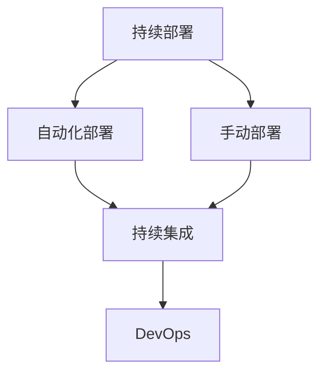

                 

# 持续部署策略：自动化和手动部署的选择

> 关键词：持续部署, 自动化部署, 手动部署, 持续集成, 自动化测试, DevOps, 软件开发, 软件工程, 部署策略

## 1. 背景介绍

### 1.1 问题由来
在现代软件开发过程中，部署成为软件开发生命周期中的一个重要环节。从早期的手工手动部署到如今的持续部署，这一过程经历了剧烈的变革。然而，在部署的过程中，自动化与手动部署仍然并存，不同组织和团队基于其特定的需求选择适合自身的部署策略。那么，在部署过程中，我们到底应该选择自动化部署还是手动部署呢？本文将从这一问题出发，探讨两者的优缺点和适用场景，并提出相应的建议。

### 1.2 问题核心关键点
在持续部署的过程中，自动化部署和手动部署的选择主要涉及以下几个方面：

- **部署效率与灵活性**：自动化部署能够提高部署效率，但可能导致灵活性不足。手动部署则更具有灵活性，但效率较低。
- **资源需求与成本**：自动化部署需要配置自动化工具和环境，初始投入和维护成本较高。手动部署则相对较低。
- **错误率与风险控制**：自动化部署可以降低人为错误，但可能导致依赖于工具的错误。手动部署则可以通过人工审查降低风险，但人为错误不可避免。
- **技能需求与团队结构**：自动化部署需要具备一定的技术能力和工具使用经验，手动部署则需要开发人员具备丰富的生产部署经验。

这些因素的综合考量决定了组织应选择何种部署策略。在本文中，我们将深入讨论自动化部署和手动部署的选择，并结合具体案例进行详细分析。

## 2. 核心概念与联系

### 2.1 核心概念概述

为了更好地理解自动化和手动部署的选择，本节将介绍几个密切相关的核心概念：

- **持续部署(Continuous Deployment)**：指在软件开发过程中，通过自动化工具和流程，将代码从开发、测试到生产的整个过程中持续地集成、构建、测试和部署。
- **自动化部署(Automated Deployment)**：指使用脚本、工具或系统自动执行部署任务的过程。
- **手动部署(Manual Deployment)**：指通过人工操作手动执行部署任务的过程。
- **持续集成(Continuous Integration)**：指通过自动化工具持续地集成代码，进行构建和测试，并及时发现和修复问题。
- **DevOps**：指开发和运维团队之间的协作与沟通，目标是实现更快速、更高效的软件交付。

这些概念之间的逻辑关系可以通过以下Mermaid流程图来展示：



这个流程图展示了几者之间的逻辑关系：

1. 持续部署是整个软件开发和交付过程的核心，涵盖了自动化部署和手动部署。
2. 持续集成是持续部署的重要组成部分，通过自动化手段持续集成代码，进行构建和测试。
3. DevOps强调开发和运维团队的紧密协作，共同推进软件交付效率和质量。

## 3. 核心算法原理 & 具体操作步骤
### 3.1 算法原理概述

自动化部署和手动部署的选择，本质上是基于成本、效率和风险的综合考虑。自动化部署和手动部署的选择，通常需要考虑以下因素：

- **部署频率**：自动化部署适合高频次的小规模更新，但手动部署适合低频率的大规模更新。
- **变更复杂度**：自动化部署适用于变更复杂度较低的应用，手动部署适用于变更复杂度较高的应用。
- **资源投入**：自动化部署需要较高的初期投入和维护成本，但长期来看可节省人力成本。手动部署初期投入较少，但长期维护成本高。
- **错误容忍度**：自动化部署对错误容忍度较高，适合对错误影响不大的应用。手动部署对错误容忍度较低，适合关键应用。

在实际应用中，通常需要根据项目的具体情况，权衡上述因素，选择合适的部署策略。

### 3.2 算法步骤详解

以下是选择自动化部署和手动部署的关键步骤：

**Step 1: 评估项目需求**
- 分析项目的部署频率、变更复杂度、资源需求和错误容忍度，进行初步评估。
- 确定项目在当前阶段的特定需求，是追求高效率、低成本，还是更注重灵活性和质量控制。

**Step 2: 选择合适的部署工具**
- 根据项目需求，选择适合的部署工具，如Jenkins、GitLab CI、Travis CI等。
- 对于自动化部署，选择功能完善的CI/CD工具，如Jenkins、GitLab CI等，自动执行构建、测试和部署。
- 对于手动部署，利用手动操作，借助版本控制工具（如Git）进行分支管理和变更管理。

**Step 3: 设计自动化流程**
- 对于自动化部署，设计自动化流程，包括代码拉取、构建、测试、部署等环节。
- 确保自动化流程中每个环节的稳定性，通过CI/CD工具进行集成和监控。
- 对于手动部署，制定详细的操作手册和审查流程，明确责任和步骤。

**Step 4: 实施并监控**
- 根据评估结果和设计方案，实施相应的自动化或手动部署策略。
- 持续监控部署过程，记录部署结果和反馈，及时调整和优化流程。

**Step 5: 评估和改进**
- 定期评估部署策略的效果，根据项目需求和反馈进行调整和改进。
- 根据实际效果，选择更加适合的自动化或手动部署方式，平衡效率和风险。

### 3.3 算法优缺点

自动化部署的优点包括：

1. **效率高**：自动化部署能够快速处理大量重复任务，减少人为操作，提高部署效率。
2. **准确性高**：自动化流程经过严格测试，错误率较低。
3. **一致性**：自动化流程在每次部署中保持一致，有助于提高软件的一致性和稳定性。

自动化部署的缺点包括：

1. **灵活性差**：自动化流程一旦设定，难以随意调整，对需求变化适应性较差。
2. **初始投入高**：需要配置自动化工具和环境，初期投入较高。
3. **依赖性**：对自动化工具的依赖可能导致问题解决困难。

手动部署的优点包括：

1. **灵活性高**：手动部署能够根据实际情况灵活调整，适应需求变化。
2. **初期投入低**：无需配置自动化工具，初期投入较低。
3. **风险控制**：人工审查能够更好地控制错误和风险。

手动部署的缺点包括：

1. **效率低**：手动操作耗时耗力，效率较低。
2. **人为错误**：人为操作可能导致错误，影响软件质量。
3. **资源浪费**：需要更多的人力和时间进行重复性工作。

### 3.4 算法应用领域

自动化部署和手动部署的选择，在不同领域和应用场景中各有其适用性。

- **Web应用**：Web应用的部署通常适合自动化部署，通过CI/CD工具能够快速、稳定地部署新版本。
- **移动应用**：移动应用的部署也适合自动化部署，能够快速处理不同平台的打包和发布。
- **系统更新**：系统更新的部署通常适合手动部署，需要谨慎处理，避免对生产环境造成影响。
- **安全系统**：安全系统的部署通常适合手动部署，需要严格审查和控制，确保系统的安全性和稳定性。
- **大数据系统**：大数据系统的部署通常适合自动化部署，能够快速处理大规模数据和作业。

## 4. 数学模型和公式 & 详细讲解 & 举例说明

### 4.1 数学模型构建

为了更清晰地理解自动化部署和手动部署的选择，本节将通过数学模型来描述两者的特点和比较。

设 $T_{\text{auto}}$ 和 $T_{\text{manual}}$ 分别为自动化部署和手动部署的期望时间成本，$C_{\text{auto}}$ 和 $C_{\text{manual}}$ 分别为自动化部署和手动部署的期望成本，$E_{\text{auto}}$ 和 $E_{\text{manual}}$ 分别为自动化部署和手动部署的期望错误率，$F_{\text{auto}}$ 和 $F_{\text{manual}}$ 分别为自动化部署和手动部署的灵活性评分。

根据以上定义，我们可以构建如下的数学模型来评估自动化部署和手动部署的选择：

$$
\text{Total Cost} = T_{\text{auto}} \times C_{\text{auto}} + T_{\text{manual}} \times C_{\text{manual}} \\
\text{Total Error} = T_{\text{auto}} \times E_{\text{auto}} + T_{\text{manual}} \times E_{\text{manual}} \\
\text{Total Flexibility} = T_{\text{auto}} \times F_{\text{auto}} + T_{\text{manual}} \times F_{\text{manual}}
$$

通过最小化总成本和总错误率，同时最大化总灵活性，我们可以得到最优的部署策略。

### 4.2 公式推导过程

以下是基于上述模型的推导过程：

1. **成本评估**：

$$
C_{\text{auto}} = \text{Cost of Automation Tools} + \text{Maintenance Cost}
$$

$$
C_{\text{manual}} = \text{Manpower Cost}
$$

2. **错误率评估**：

$$
E_{\text{auto}} = \text{Error Rate from Automation} + \text{Error Rate from Deployment}
$$

$$
E_{\text{manual}} = \text{Error Rate from Human Operation}
$$

3. **灵活性评估**：

$$
F_{\text{auto}} = \text{Flexibility of Automation} + \text{Adaptability to Change}
$$

$$
F_{\text{manual}} = \text{Flexibility of Human Operation} + \text{Adaptability to Human Handover}
$$

在实际应用中，我们通过实验和历史数据来评估以上参数，进而得到最终的决策模型。

### 4.3 案例分析与讲解

以下通过一个具体的案例来展示自动化部署和手动部署的选择过程。

**案例背景**：
某公司开发一个Web应用，需要定期更新和部署新功能。该应用每周有两次小更新，每月有一次大更新，对错误容忍度较高，但对部署效率和一致性要求较高。

**决策过程**：

1. **评估需求**：
   - 部署频率：每周两次小更新，每月一次大更新。
   - 变更复杂度：小更新较为简单，大更新较为复杂。
   - 资源需求：初期配置CI/CD工具需要较高投入。
   - 错误容忍度：对错误容忍度较高。

2. **选择工具**：
   - 选择GitLab CI作为自动化部署工具，自动执行构建、测试和部署。
   - 选择手动部署方式，结合版本控制工具Git进行变更管理和审查。

3. **设计流程**：
   - 自动化流程设计：在GitLab CI中设置CI/CD流水线，包括代码拉取、构建、测试和部署环节。
   - 手动部署流程设计：制定详细的手动部署操作手册和审查流程，明确责任和步骤。

4. **实施和监控**：
   - 实施自动化和手动部署策略，记录部署结果和反馈。
   - 持续监控部署过程，记录部署时间和错误。

5. **评估和改进**：
   - 根据实际效果，评估自动化和手动部署的选择。
   - 根据实际需求和反馈，进行调整和改进。

**结果分析**：
- 自动化部署适用于小更新，效率高、错误率低，但灵活性较差。
- 手动部署适用于大更新，灵活性高，但效率较低。

## 5. 项目实践：代码实例和详细解释说明

### 5.1 开发环境搭建

在进行部署实践前，我们需要准备好开发环境。以下是使用Docker进行自动化和手动部署的环境配置流程：

1. 安装Docker：从官网下载并安装Docker，用于创建和管理容器环境。

2. 创建并激活虚拟环境：
```bash
docker create --name my_container -it ubuntu:20.04
```

3. 安装所需工具和环境：
```bash
apt-get update && apt-get install -y wget unzip vim curl
```

4. 拉取代码和依赖：
```bash
wget https://example.com/myapp.tar.gz
tar -xzf myapp.tar.gz
cd myapp
npm install
```

完成上述步骤后，即可在Docker容器中开始部署实践。

### 5.2 源代码详细实现

这里我们以一个简单的Web应用部署为例，给出使用Docker和Jenkins进行自动化和手动部署的Python代码实现。

**Jenkins配置文件**：
```groovy
pipeline {
    agent any
    stages {
        stage('Build') {
            steps {
                sh 'npm run build'
            }
        }
        stage('Test') {
            steps {
                sh 'npm run test'
            }
        }
        stage('Deploy') {
            steps {
                with Docker {
                    container 'my_container'
                    containerImage 'my_container:latest'
                    command "sh my_script.sh"
                }
            }
        }
    }
}
```

**Docker脚本**：
```bash
#!/bin/bash
sudo apt-get update
sudo apt-get install -y nginx curl
sudo apt-get install -y nodejs
sudo apt-get install -y yarn
cd /var/www/html
npm install
npm run build
cp -r build/* .
rm -rf build
nginx -t
nginx -s reload
```

**手动部署脚本**：
```bash
#!/bin/bash
sudo apt-get update
sudo apt-get install -y nginx curl
sudo apt-get install -y nodejs
sudo apt-get install -y yarn
cd /var/www/html
npm install
npm run build
cp -r build/* .
rm -rf build
nginx -t
nginx -s reload
```

### 5.3 代码解读与分析

让我们再详细解读一下关键代码的实现细节：

**Jenkins配置文件**：
- `pipeline`：定义Jenkins流水线的结构。
- `agent`：指定Docker容器作为Jenkins的代理。
- `stage`：定义流水线的各个阶段，包括构建、测试和部署。
- `steps`：定义每个阶段的执行命令。

**Docker脚本**：
- `sudo apt-get update`：更新系统。
- `sudo apt-get install -y nginx curl nodejs yarn`：安装所需的依赖。
- `cd /var/www/html`：进入应用目录。
- `npm install`：安装项目依赖。
- `npm run build`：构建项目。
- `cp -r build/* .`：将构建后的文件复制到应用目录。
- `rm -rf build`：删除构建目录。
- `nginx -t`：测试Nginx配置文件。
- `nginx -s reload`：重新加载Nginx配置文件。

**手动部署脚本**：
- 与Docker脚本类似，但需要执行手动部署操作，并在每个步骤后手动输入命令。

## 6. 实际应用场景

### 6.1 持续部署的实际应用场景

在实际应用中，持续部署策略可以应用于多种场景，以下列举几个典型应用场景：

**场景一：Web应用部署**
在Web应用开发过程中，通过持续部署策略，可以快速地进行代码的集成、构建和部署，减少人为干预，提高部署效率和一致性。例如，使用Jenkins结合Docker容器进行自动化部署，可以实现快速、稳定地发布新版本。

**场景二：移动应用更新**
移动应用的持续部署策略通常使用自动化工具和平台，如Fastlane、Jenkins等，自动执行构建、测试和发布。通过自动化流程，可以快速处理不同平台的打包和发布，确保应用的稳定性和一致性。

**场景三：系统更新**
系统更新的持续部署策略通常采用手动部署和自动化部署相结合的方式。对于复杂更新，手动部署可以确保操作的安全性和准确性；对于小更新，自动化部署可以提高效率和稳定性。例如，在生产环境中，可以使用GitLab CI进行自动化部署，而在紧急情况下，则通过手动操作进行安全审查和部署。

### 6.2 未来应用展望

随着持续部署技术的发展，未来将在更多领域得到应用，为数字化转型带来新的机遇。

**未来趋势**：
1. **自动化和手动部署融合**：未来持续部署将更加注重自动化和手动部署的融合，根据具体需求灵活选择，平衡效率和灵活性。
2. **持续集成和持续部署一体化**：持续集成和持续部署将更加紧密结合，实现从代码提交到部署的自动化过程。
3. **DevOps工具链完善**：DevOps工具链将更加完善，包括自动化工具、容器管理、持续监控等，形成完整的交付生态。
4. **持续交付和持续监控**：持续交付将成为软件开发的主流模式，持续监控则确保应用的稳定性和性能。

## 7. 工具和资源推荐

### 7.1 学习资源推荐

为了帮助开发者系统掌握持续部署的理论基础和实践技巧，这里推荐一些优质的学习资源：

1. **《持续交付：发布软件的新方式》**：Martin Fowler著，详细介绍了持续交付的原理和实践。
2. **《CI/CD最佳实践》**：James Denis著，涵盖CI/CD工具的配置和管理，是持续部署的重要参考资料。
3. **《DevOps实践指南》**：Hanselman, Tim pp，介绍了DevOps的实践方法和工具链。
4. **《Docker实战》**：Kurt Jonker著，详细介绍了Docker容器的部署和管理。
5. **《Jenkins用户指南》**：Ludovico Ottaviani著，介绍了Jenkins的配置和管理。

通过对这些资源的学习实践，相信你一定能够快速掌握持续部署的精髓，并用于解决实际的部署问题。

### 7.2 开发工具推荐

高效的部署离不开优秀的工具支持。以下是几款用于持续部署开发的常用工具：

1. **Jenkins**：开源的持续集成和持续部署工具，支持多种插件和插件化扩展，适合大规模项目。
2. **GitLab CI**：GitLab提供的CI/CD工具，支持持续集成、持续部署和持续监控，与GitLab无缝集成。
3. **Travis CI**：基于Git的持续集成平台，支持多种编程语言和框架，适合开源项目。
4. **Docker**：轻量级的容器化工具，支持跨平台部署，适合微服务架构的应用。
5. **Kubernetes**：开源的容器编排工具，支持大规模应用的自动化部署和扩展。

合理利用这些工具，可以显著提升持续部署的开发效率，加快创新迭代的步伐。

### 7.3 相关论文推荐

持续部署技术的发展源于学界的持续研究。以下是几篇奠基性的相关论文，推荐阅读：

1. **《A Comparison of Continuous Deployment Practices》**：Carl R. Openshaw等著，比较了不同的持续部署实践，提供了丰富的案例和建议。
2. **《Modeling and Managing Service Deployment Processes》**：Alejandro Rueda-Barquero等著，讨论了持续部署模型的构建和优化。
3. **《Software Quality Assurance in the Large Scale Continuous Integration Environment》**：Jian Miao等著，探讨了在大规模持续集成环境中的质量保证问题。
4. **《Model-Based Reliability Assessment for Continuous Deployment》**：Brenda Kyselova等著，提出了一种基于模型的持续部署可靠性评估方法。
5. **《Continuous Integration/Continuous Deployment for Agile Software Development》**：Martin Fowler著，介绍了持续集成和持续部署在敏捷开发中的应用。

这些论文代表了大规模软件交付的研究进展，为持续部署技术的发展提供了重要的理论支持。

## 8. 总结：未来发展趋势与挑战

### 8.1 总结

本文对持续部署策略中的自动化和手动部署选择进行了全面系统的介绍。首先阐述了持续部署的原理和重要性，明确了自动化和手动部署的选择标准，探讨了二者的优缺点和适用场景。通过对实际案例的分析，展示了自动化和手动部署的具体实施过程，并提出了相应的建议。

通过本文的系统梳理，可以看到，持续部署策略已经成为软件开发的重要组成部分，自动化和手动部署的选择需要根据项目的具体情况进行灵活调整。未来，随着技术的不断进步，持续部署将更加高效、灵活和安全，成为推动数字化转型的重要工具。

### 8.2 未来发展趋势

展望未来，持续部署技术将呈现以下几个发展趋势：

1. **自动化和手动部署融合**：未来持续部署将更加注重自动化和手动部署的融合，根据具体需求灵活选择，平衡效率和灵活性。
2. **持续集成和持续部署一体化**：持续集成和持续部署将更加紧密结合，实现从代码提交到部署的自动化过程。
3. **DevOps工具链完善**：DevOps工具链将更加完善，包括自动化工具、容器管理、持续监控等，形成完整的交付生态。
4. **持续交付和持续监控**：持续交付将成为软件开发的主流模式，持续监控则确保应用的稳定性和性能。

这些趋势展示了持续部署技术的广阔前景，为软件开发和运维带来了新的机遇和挑战。

### 8.3 面临的挑战

尽管持续部署技术已经取得了显著进展，但在实施过程中仍面临诸多挑战：

1. **部署复杂度**：在复杂系统中，持续部署的实施和维护复杂度较高，需要综合考虑各种因素。
2. **安全风险**：持续部署可能带来安全风险，如恶意代码注入、系统崩溃等，需要加强安全管理和监控。
3. **工具适配**：不同工具和平台的兼容性问题，需要开发人员具备较强的工具适应能力。
4. **技能要求**：持续部署需要开发人员具备较强的自动化和运维技能，培养高技能人才是关键。
5. **成本控制**：持续部署的初始投入和维护成本较高，需要合理的成本控制策略。

正视持续部署面临的这些挑战，积极应对并寻求突破，将持续部署技术推向新的高度。

### 8.4 研究展望

未来的研究需要在以下几个方面寻求新的突破：

1. **持续部署框架优化**：优化持续部署框架，提高其灵活性和可扩展性。
2. **自动化工具改进**：开发更加高效和易用的自动化工具，降低持续部署的复杂度。
3. **持续监控和反馈**：建立持续监控和反馈机制，实时发现和解决问题，提升部署效率。
4. **持续交付和测试改进**：改进持续交付和测试技术，提高交付效率和质量。
5. **DevOps文化推广**：推广DevOps文化，加强开发和运维团队的协作和沟通。

这些研究方向将进一步提升持续部署的效率和可靠性，推动软件开发和运维的现代化进程。

## 9. 附录：常见问题与解答

**Q1：自动化部署和手动部署的适用场景是什么？**

A: 自动化部署适合高频次、变更简单的应用，如Web应用、移动应用等。手动部署适合低频率、变更复杂的项目，如系统更新、安全系统等。

**Q2：如何选择自动化部署和手动部署的策略？**

A: 需要根据项目的需求进行评估，考虑部署频率、变更复杂度、资源需求、错误容忍度等因素。自动化部署适合效率和一致性要求较高的场景，手动部署适合灵活性和安全性要求较高的场景。

**Q3：持续部署中如何控制成本？**

A: 通过合理配置自动化工具和环境，优化持续部署流程，减少不必要的资源投入。同时，定期评估和优化持续部署策略，提高效率和质量，降低长期维护成本。

**Q4：持续部署中如何确保安全？**

A: 加强持续部署的安全管理和监控，采用安全检查工具和策略，如代码扫描、漏洞检测等。建立应急响应机制，及时处理安全问题。

**Q5：持续部署中如何提升团队协作？**

A: 推广DevOps文化，加强开发和运维团队的协作和沟通，建立跨部门协作机制。通过工具和流程的优化，提升团队的自动化和运维能力。

通过本文的系统梳理，可以看到，自动化和手动部署的选择是持续部署策略中的重要问题。只有根据项目的具体情况，合理选择部署策略，并不断优化和改进，才能实现持续部署的可持续发展和高效运行。

