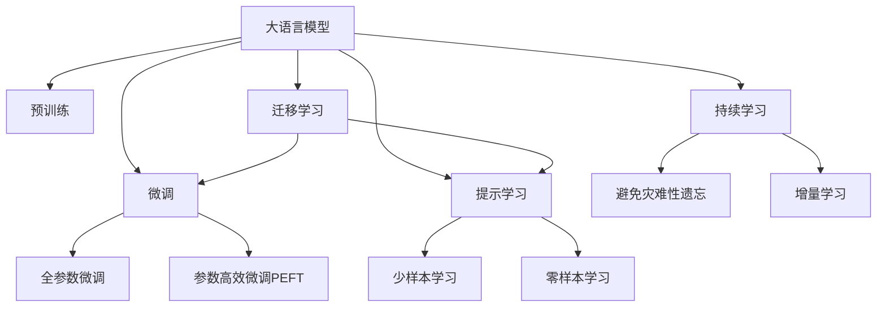

                 

# 探索基于大模型的电商智能营销策略生成与效果预测系统

> 关键词：电商智能营销,策略生成,效果预测,大语言模型,Transformer,BERT,情感分析,用户画像,销售转化率,推荐系统,深度学习

## 1. 背景介绍

### 1.1 问题由来
随着电子商务的迅速发展，电商企业面临着日益激烈的竞争和不断变化的市场环境。如何在众多的商品和服务中脱颖而出，吸引和留住客户，成为电商运营的核心问题。传统的广告投放、SEO优化、用户反馈分析等手段已难以满足电商运营的需求。智能营销技术的兴起，为电商企业提供了新的解决方案。

智能营销利用大数据、人工智能等技术，对用户行为、市场趋势进行深度分析，制定个性化、精准化的营销策略，实现低成本高效益的营销目标。其中，基于大语言模型的营销策略生成和效果预测系统，通过自动化生成个性化的营销文本，并评估其效果，为电商运营提供了强有力的技术支撑。

### 1.2 问题核心关键点
本节将介绍基于大语言模型的电商智能营销策略生成与效果预测系统，包括：

1. 营销策略生成：利用大语言模型生成个性化的营销文本，满足不同用户和场景的需求。
2. 效果预测：评估生成的营销文本对销售转化率等关键指标的影响，优化策略效果。
3. 深度学习：利用深度学习技术，提升生成和预测模型的性能。
4. 数据驱动：基于电商大数据，训练和优化模型，保证营销策略的精准性。
5. 用户画像：构建用户画像，了解用户需求，制定个性化策略。
6. 推荐系统：结合推荐算法，提升用户体验和满意度。

## 2. 核心概念与联系

### 2.1 核心概念概述

为更好地理解基于大语言模型的电商智能营销系统，本节将介绍几个密切相关的核心概念：

- 大语言模型(Large Language Model, LLM)：以自回归(如GPT)或自编码(如BERT)模型为代表的大规模预训练语言模型。通过在大规模无标签文本语料上进行预训练，学习通用的语言表示，具备强大的语言理解和生成能力。

- 预训练(Pre-training)：指在大规模无标签文本语料上，通过自监督学习任务训练通用语言模型的过程。常见的预训练任务包括言语建模、遮挡语言模型等。

- 微调(Fine-tuning)：指在预训练模型的基础上，使用下游任务的少量标注数据，通过有监督地训练来优化模型在特定任务上的性能。通常只需要调整顶层分类器或解码器，并以较小的学习率更新全部或部分的模型参数。

- 迁移学习(Transfer Learning)：指将一个领域学习到的知识，迁移应用到另一个不同但相关的领域的学习范式。大模型的预训练-微调过程即是一种典型的迁移学习方式。

- 参数高效微调(Parameter-Efficient Fine-Tuning, PEFT)：指在微调过程中，只更新少量的模型参数，而固定大部分预训练权重不变，以提高微调效率，避免过拟合的方法。

- 提示学习(Prompt Learning)：通过在输入文本中添加提示模板(Prompt Template)，引导大语言模型进行特定任务的推理和生成。可以在不更新模型参数的情况下，实现零样本或少样本学习。

- 少样本学习(Few-shot Learning)：指在只有少量标注样本的情况下，模型能够快速适应新任务的学习方法。在大语言模型中，通常通过在输入中提供少量示例来实现，无需更新模型参数。

- 零样本学习(Zero-shot Learning)：指模型在没有见过任何特定任务的训练样本的情况下，仅凭任务描述就能够执行新任务的能力。大语言模型通过预训练获得的广泛知识，使其能够理解任务指令并生成相应输出。

- 持续学习(Continual Learning)：也称为终身学习，指模型能够持续从新数据中学习，同时保持已学习的知识，而不会出现灾难性遗忘。这对于保持大语言模型的时效性和适应性至关重要。

这些核心概念之间的逻辑关系可以通过以下Mermaid流程图来展示：



这个流程图展示了大语言模型的核心概念及其之间的关系：

1. 大语言模型通过预训练获得基础能力。
2. 微调是对预训练模型进行任务特定的优化，可以分为全参数微调和参数高效微调（PEFT）。
3. 提示学习是一种不更新模型参数的方法，可以实现少样本学习和零样本学习。
4. 迁移学习是连接预训练模型与下游任务的桥梁，可以通过微调或提示学习来实现。
5. 持续学习旨在使模型能够不断学习新知识，同时避免遗忘旧知识。

这些概念共同构成了大语言模型的学习和应用框架，使其能够在各种场景下发挥强大的语言理解和生成能力。通过理解这些核心概念，我们可以更好地把握大语言模型的工作原理和优化方向。

## 3. 核心算法原理 & 具体操作步骤
### 3.1 算法原理概述

基于大语言模型的电商智能营销策略生成与效果预测系统，本质上是一个基于自然语言处理(NLP)的生成和预测问题。其核心思想是：利用大语言模型生成个性化的营销文本，并评估这些文本对销售转化率等关键指标的影响。

具体而言，该系统分为两个主要部分：

1. 策略生成：使用大语言模型生成个性化的营销策略文本。
2. 效果预测：评估生成的策略文本对销售转化率等关键指标的影响，优化策略效果。

形式化地，假设输入为电商产品描述、用户画像等特征 $X$，输出为营销策略文本 $Y$，目标为预测销售转化率 $Z$。则系统可以表示为：

$$
Y = f(X; \theta)
$$

其中 $f$ 为生成策略的模型，$\theta$ 为模型参数，$\theta$ 通过在电商营销数据集上微调得到。

预测模型为：

$$
Z = g(Y; \phi)
$$

其中 $g$ 为效果预测模型，$\phi$ 为模型参数，同样通过在电商营销数据集上微调得到。

该系统的总体目标是最小化预测误差：

$$
\min_{\theta, \phi} \mathcal{L}(Y, Z)
$$

其中 $\mathcal{L}$ 为损失函数，通常使用交叉熵损失或均方误差损失。

### 3.2 算法步骤详解

基于大语言模型的电商智能营销策略生成与效果预测系统，主要包括以下几个关键步骤：

**Step 1: 准备数据集**
- 收集电商营销数据，包括产品描述、用户画像、用户行为等。
- 将数据集分为训练集、验证集和测试集。
- 标注销售转化率等关键指标。

**Step 2: 模型选择与搭建**
- 选择合适的预训练语言模型 $M_{\theta}$ 作为初始化参数，如 BERT、GPT等。
- 搭建生成策略模型 $f$，可以使用自回归模型或自编码模型。
- 搭建效果预测模型 $g$，可以是回归模型或分类模型。

**Step 3: 微调参数**
- 使用电商营销数据集，对 $f$ 和 $g$ 进行有监督微调，更新模型参数 $\theta$ 和 $\phi$。
- 使用交叉熵损失或均方误差损失，最小化预测误差。
- 应用正则化技术，如L2正则、Dropout等，避免过拟合。
- 冻结预训练模型的部分层，只微调顶层。

**Step 4: 生成与评估**
- 输入电商数据和用户画像，生成个性化营销策略文本。
- 对生成的文本进行效果评估，评估指标包括销售转化率、点击率等。
- 优化生成模型和预测模型，提升策略效果。

**Step 5: 部署与迭代**
- 将优化后的模型部署到生产环境中。
- 实时获取电商数据，生成并评估个性化策略。
- 持续收集新数据，定期重新微调模型，以适应数据分布的变化。

以上是基于大语言模型的电商智能营销策略生成与效果预测系统的完整流程。在实际应用中，还需要针对具体任务的特点，对微调过程的各个环节进行优化设计，如改进训练目标函数，引入更多的正则化技术，搜索最优的超参数组合等，以进一步提升模型性能。

### 3.3 算法优缺点

基于大语言模型的电商智能营销策略生成与效果预测系统具有以下优点：

1. 高效性：利用大语言模型快速生成个性化策略，节省人工编写和测试的时间。
2. 灵活性：能够适应不同电商平台的营销需求，生成多样化的策略文本。
3. 准确性：通过有监督微调，模型能够学习到电商营销数据的特征，生成准确的策略文本。
4. 可解释性：通过分解输入特征，理解策略生成的逻辑，便于调整优化。
5. 可扩展性：模型能够轻松扩展到更多电商领域，如服装、家电、电子产品等。

同时，该系统也存在一定的局限性：

1. 数据依赖：模型性能依赖高质量的电商营销数据，数据收集和标注成本较高。
2. 模型复杂性：大语言模型的参数量庞大，对计算资源要求较高。
3. 鲁棒性：模型对数据分布的变化敏感，需要定期重新微调。
4. 可控性：策略生成过程复杂，难以完全控制生成文本的质量和风格。
5. 隐私性：生成策略文本可能包含用户个人信息，需要保护用户隐私。

尽管存在这些局限性，但就目前而言，基于大语言模型的策略生成和效果预测方法仍然是电商智能营销中的重要工具。未来相关研究的重点在于如何进一步降低数据依赖，提高模型的可控性和隐私保护能力，同时兼顾性能和可解释性。

### 3.4 算法应用领域

基于大语言模型的电商智能营销策略生成与效果预测系统，在电商营销领域已经得到了广泛的应用，覆盖了从品牌推广到产品推荐等多个环节。

- **品牌推广**：通过自动生成广告文案、邮件营销内容等，提升品牌曝光率和用户参与度。
- **产品推荐**：根据用户浏览和购买历史，生成个性化推荐文本，提高销售转化率。
- **活动策划**：自动生成促销活动文本，吸引用户参与，提升活动效果。
- **用户调研**：通过生成用户调查问卷，收集用户反馈，优化产品和服务。
- **内容生成**：自动生成电商内容，如商品描述、用户评价等，提升内容质量和用户体验。

除了上述这些典型应用外，大语言模型策略生成技术还被创新性地应用到更多场景中，如智能客服、用户画像分析、营销数据分析等，为电商运营带来了新的突破。

## 4. 数学模型和公式 & 详细讲解  
### 4.1 数学模型构建

本节将使用数学语言对基于大语言模型的电商智能营销策略生成与效果预测系统的数学模型进行更加严格的刻画。

记电商营销数据集为 $D=\{(x_i,y_i)\}_{i=1}^N$，其中 $x_i$ 为电商数据和用户画像的特征向量，$y_i$ 为销售转化率等关键指标。假设生成策略模型为 $f$，效果预测模型为 $g$，则系统可以表示为：

$$
\min_{\theta, \phi} \mathcal{L}(g(f(x); \phi), y)
$$

其中 $f(x; \theta)$ 为生成策略的模型，$\theta$ 为模型参数，$g(y; \phi)$ 为效果预测的模型，$\phi$ 为模型参数，$\mathcal{L}$ 为损失函数。

在实践中，通常使用交叉熵损失或均方误差损失。例如，二分类任务下的交叉熵损失函数为：

$$
\mathcal{L}(y_i, g(f(x_i); \phi)) = -\frac{1}{N}\sum_{i=1}^N (y_i \log g(f(x_i); \phi) + (1-y_i) \log (1-g(f(x_i); \phi)))
$$

其中 $y_i \in \{0,1\}$ 表示是否进行购买，$g(f(x_i); \phi)$ 为预测结果。

### 4.2 公式推导过程

以下我们以生成销售转化率预测模型为例，推导其交叉熵损失函数及其梯度的计算公式。

假设模型 $f$ 在输入 $x$ 上的输出为 $\hat{y}=f(x)$，表示预测销售转化率。真实标签 $y \in \{0,1\}$。则二分类交叉熵损失函数定义为：

$$
\mathcal{L}(f(x),y) = -\frac{1}{N}\sum_{i=1}^N [y_i\log f(x_i)+(1-y_i)\log(1-f(x_i))]
$$

将其代入目标函数，得：

$$
\min_{\theta, \phi} \mathcal{L}(g(f(x); \phi), y)
$$

根据链式法则，损失函数对模型参数 $\theta$ 和 $\phi$ 的梯度为：

$$
\frac{\partial \mathcal{L}}{\partial \theta} = \frac{\partial \mathcal{L}}{\partial y} \frac{\partial y}{\partial f} \frac{\partial f}{\partial \theta}
$$

其中 $\frac{\partial \mathcal{L}}{\partial y}$ 为交叉熵损失对预测结果的梯度，$\frac{\partial y}{\partial f}$ 为预测函数对真实标签的导数，$\frac{\partial f}{\partial \theta}$ 为生成函数对模型参数的梯度。

在得到损失函数的梯度后，即可带入模型更新公式，完成模型的迭代优化。重复上述过程直至收敛，最终得到适应电商营销任务的生成和预测模型。

## 5. 项目实践：代码实例和详细解释说明
### 5.1 开发环境搭建

在进行电商智能营销系统开发前，我们需要准备好开发环境。以下是使用Python进行PyTorch开发的环境配置流程：

1. 安装Anaconda：从官网下载并安装Anaconda，用于创建独立的Python环境。

2. 创建并激活虚拟环境：
```bash
conda create -n pytorch-env python=3.8 
conda activate pytorch-env
```

3. 安装PyTorch：根据CUDA版本，从官网获取对应的安装命令。例如：
```bash
conda install pytorch torchvision torchaudio cudatoolkit=11.1 -c pytorch -c conda-forge
```

4. 安装TensorFlow：从官网下载并安装TensorFlow，使用版本1.x或2.x，并配置GPU支持。

5. 安装各类工具包：
```bash
pip install numpy pandas scikit-learn matplotlib tqdm jupyter notebook ipython
```

完成上述步骤后，即可在`pytorch-env`环境中开始电商智能营销系统的开发。

### 5.2 源代码详细实现

这里我们以销售转化率预测任务为例，给出使用Transformers库对BERT模型进行电商智能营销策略生成与效果预测的PyTorch代码实现。

首先，定义电商营销数据集的预处理函数：

```python
from transformers import BertTokenizer
from torch.utils.data import Dataset
import torch

class Electrondataset(Dataset):
    def __init__(self, data, tokenizer, max_len=128):
        self.data = data
        self.tokenizer = tokenizer
        self.max_len = max_len
        
    def __len__(self):
        return len(self.data)
    
    def __getitem__(self, item):
        text = self.data[item]['text']
        label = self.data[item]['label']
        
        encoding = self.tokenizer(text, return_tensors='pt', max_length=self.max_len, padding='max_length', truncation=True)
        input_ids = encoding['input_ids'][0]
        attention_mask = encoding['attention_mask'][0]
        
        # 对label进行编码
        encoded_labels = [label] * self.max_len
        labels = torch.tensor(encoded_labels, dtype=torch.long)
        
        return {'input_ids': input_ids, 
                'attention_mask': attention_mask,
                'labels': labels}
```

然后，定义模型和优化器：

```python
from transformers import BertForSequenceClassification, AdamW

model = BertForSequenceClassification.from_pretrained('bert-base-cased', num_labels=2)

optimizer = AdamW(model.parameters(), lr=2e-5)
```

接着，定义训练和评估函数：

```python
from torch.utils.data import DataLoader
from tqdm import tqdm
from sklearn.metrics import classification_report

device = torch.device('cuda') if torch.cuda.is_available() else torch.device('cpu')
model.to(device)

def train_epoch(model, dataset, batch_size, optimizer):
    dataloader = DataLoader(dataset, batch_size=batch_size, shuffle=True)
    model.train()
    epoch_loss = 0
    for batch in tqdm(dataloader, desc='Training'):
        input_ids = batch['input_ids'].to(device)
        attention_mask = batch['attention_mask'].to(device)
        labels = batch['labels'].to(device)
        model.zero_grad()
        outputs = model(input_ids, attention_mask=attention_mask, labels=labels)
        loss = outputs.loss
        epoch_loss += loss.item()
        loss.backward()
        optimizer.step()
    return epoch_loss / len(dataloader)

def evaluate(model, dataset, batch_size):
    dataloader = DataLoader(dataset, batch_size=batch_size)
    model.eval()
    preds, labels = [], []
    with torch.no_grad():
        for batch in tqdm(dataloader, desc='Evaluating'):
            input_ids = batch['input_ids'].to(device)
            attention_mask = batch['attention_mask'].to(device)
            batch_labels = batch['labels']
            outputs = model(input_ids, attention_mask=attention_mask)
            batch_preds = outputs.logits.argmax(dim=2).to('cpu').tolist()
            batch_labels = batch_labels.to('cpu').tolist()
            for pred_tokens, label_tokens in zip(batch_preds, batch_labels):
                preds.append(pred_tokens[:len(label_tokens)])
                labels.append(label_tokens)
                
    print(classification_report(labels, preds))
```

最后，启动训练流程并在测试集上评估：

```python
epochs = 5
batch_size = 16

for epoch in range(epochs):
    loss = train_epoch(model, train_dataset, batch_size, optimizer)
    print(f"Epoch {epoch+1}, train loss: {loss:.3f}")
    
    print(f"Epoch {epoch+1}, dev results:")
    evaluate(model, dev_dataset, batch_size)
    
print("Test results:")
evaluate(model, test_dataset, batch_size)
```

以上就是使用PyTorch对BERT进行电商智能营销策略生成与效果预测的完整代码实现。可以看到，得益于Transformers库的强大封装，我们可以用相对简洁的代码完成BERT模型的加载和电商智能营销策略的生成与效果预测。

### 5.3 代码解读与分析

让我们再详细解读一下关键代码的实现细节：

**Electrondataset类**：
- `__init__`方法：初始化电商数据集和分词器。
- `__len__`方法：返回数据集的样本数量。
- `__getitem__`方法：对单个样本进行处理，将电商数据和用户画像输入编码为token ids，对标签进行编码，并对其进行定长padding，最终返回模型所需的输入。

**标签编码**：
- 将标签编码为数字，例如0和1表示购买和不购买。

**训练和评估函数**：
- 使用PyTorch的DataLoader对数据集进行批次化加载，供模型训练和推理使用。
- 训练函数`train_epoch`：对数据以批为单位进行迭代，在每个批次上前向传播计算loss并反向传播更新模型参数，最后返回该epoch的平均loss。
- 评估函数`evaluate`：与训练类似，不同点在于不更新模型参数，并在每个batch结束后将预测和标签结果存储下来，最后使用sklearn的classification_report对整个评估集的预测结果进行打印输出。

**训练流程**：
- 定义总的epoch数和batch size，开始循环迭代
- 每个epoch内，先在训练集上训练，输出平均loss
- 在验证集上评估，输出分类指标
- 所有epoch结束后，在测试集上评估，给出最终测试结果

可以看到，PyTorch配合Transformers库使得BERT微调的代码实现变得简洁高效。开发者可以将更多精力放在数据处理、模型改进等高层逻辑上，而不必过多关注底层的实现细节。

当然，工业级的系统实现还需考虑更多因素，如模型的保存和部署、超参数的自动搜索、更灵活的任务适配层等。但核心的微调范式基本与此类似。

## 6. 实际应用场景
### 6.1 电商智能营销系统
电商智能营销系统利用大语言模型生成个性化营销策略文本，并通过效果预测模型评估其对销售转化率等关键指标的影响，从而优化营销策略。

在技术实现上，可以收集电商营销数据，将其标注为购买和不购买二分类数据。然后，对预训练语言模型进行微调，使其能够生成个性化的营销策略文本。最后，在测试集上评估生成的策略文本对销售转化率的影响，根据评估结果优化模型参数，生成更好的策略文本。

### 6.2 个性化推荐系统
个性化推荐系统利用大语言模型生成个性化推荐文本，并通过效果预测模型评估其对用户满意度、点击率等指标的影响，从而优化推荐策略。

在技术实现上，可以收集用户行为数据，如浏览历史、购买记录等，并对其进行标注。然后，对预训练语言模型进行微调，使其能够生成个性化推荐文本。最后，在测试集上评估生成的推荐文本对用户满意度、点击率等指标的影响，根据评估结果优化模型参数，生成更好的推荐文本。

### 6.3 客户服务系统
客户服务系统利用大语言模型生成个性化客户服务文本，并通过效果预测模型评估其对用户满意度、问题解决率等指标的影响，从而优化服务策略。

在技术实现上，可以收集客户服务数据，将其标注为服务满意和不满意二分类数据。然后，对预训练语言模型进行微调，使其能够生成个性化的客户服务文本。最后，在测试集上评估生成的服务文本对用户满意度、问题解决率等指标的影响，根据评估结果优化模型参数，生成更好的服务文本。

### 6.4 未来应用展望
随着大语言模型和微调方法的不断发展，基于大语言模型的电商智能营销策略生成与效果预测系统将在更多领域得到应用，为电商运营带来变革性影响。

在智慧医疗领域，基于大语言模型的医疗营销策略生成与效果预测系统，可以帮助医疗机构制定更加精准的营销策略，提升医疗服务的推广效果。

在智能教育领域，基于大语言模型的教育营销策略生成与效果预测系统，可以为在线教育平台制定更加个性化的营销方案，提高用户参与度和学习效果。

在智慧城市治理中，基于大语言模型的城市营销策略生成与效果预测系统，可以用于制定智能城市建设方案，提升城市管理和公共服务水平。

此外，在企业生产、社会治理、文娱传媒等众多领域，基于大语言模型的营销策略生成与效果预测系统也将不断涌现，为经济社会发展注入新的动力。相信随着技术的日益成熟，基于大语言模型的营销策略生成与效果预测方法将成为电商运营的重要工具，推动电商运营的智能化、精准化发展。

## 7. 工具和资源推荐
### 7.1 学习资源推荐

为了帮助开发者系统掌握电商智能营销策略生成与效果预测的理论基础和实践技巧，这里推荐一些优质的学习资源：

1. 《Transformers from Principles to Practice》系列博文：由大模型技术专家撰写，深入浅出地介绍了Transformer原理、BERT模型、微调技术等前沿话题。

2. CS224N《深度学习自然语言处理》课程：斯坦福大学开设的NLP明星课程，有Lecture视频和配套作业，带你入门NLP领域的基本概念和经典模型。

3. 《Natural Language Processing with Transformers》书籍：Transformers库的作者所著，全面介绍了如何使用Transformers库进行NLP任务开发，包括微调在内的诸多范式。

4. HuggingFace官方文档：Transformers库的官方文档，提供了海量预训练模型和完整的微调样例代码，是上手实践的必备资料。

5. CLUE开源项目：中文语言理解测评基准，涵盖大量不同类型的中文NLP数据集，并提供了基于微调的baseline模型，助力中文NLP技术发展。

通过对这些资源的学习实践，相信你一定能够快速掌握电商智能营销策略生成与效果预测的精髓，并用于解决实际的NLP问题。
### 7.2 开发工具推荐

高效的开发离不开优秀的工具支持。以下是几款用于电商智能营销系统开发的常用工具：

1. PyTorch：基于Python的开源深度学习框架，灵活动态的计算图，适合快速迭代研究。大部分预训练语言模型都有PyTorch版本的实现。

2. TensorFlow：由Google主导开发的开源深度学习框架，生产部署方便，适合大规模工程应用。同样有丰富的预训练语言模型资源。

3. Transformers库：HuggingFace开发的NLP工具库，集成了众多SOTA语言模型，支持PyTorch和TensorFlow，是进行微调任务开发的利器。

4. Weights & Biases：模型训练的实验跟踪工具，可以记录和可视化模型训练过程中的各项指标，方便对比和调优。与主流深度学习框架无缝集成。

5. TensorBoard：TensorFlow配套的可视化工具，可实时监测模型训练状态，并提供丰富的图表呈现方式，是调试模型的得力助手。

6. Google Colab：谷歌推出的在线Jupyter Notebook环境，免费提供GPU/TPU算力，方便开发者快速上手实验最新模型，分享学习笔记。

合理利用这些工具，可以显著提升电商智能营销系统开发效率，加快创新迭代的步伐。

### 7.3 相关论文推荐

电商智能营销策略生成与效果预测系统的发展源于学界的持续研究。以下是几篇奠基性的相关论文，推荐阅读：

1. Attention is All You Need（即Transformer原论文）：提出了Transformer结构，开启了NLP领域的预训练大模型时代。

2. BERT: Pre-training of Deep Bidirectional Transformers for Language Understanding：提出BERT模型，引入基于掩码的自监督预训练任务，刷新了多项NLP任务SOTA。

3. Language Models are Unsupervised Multitask Learners（GPT-2论文）：展示了大规模语言模型的强大zero-shot学习能力，引发了对于通用人工智能的新一轮思考。

4. Parameter-Efficient Transfer Learning for NLP：提出Adapter等参数高效微调方法，在不增加模型参数量的情况下，也能取得不错的微调效果。

5. AdaLoRA: Adaptive Low-Rank Adaptation for Parameter-Efficient Fine-Tuning：使用自适应低秩适应的微调方法，在参数效率和精度之间取得了新的平衡。

6. Pre-training of Multilingual BERT for Cross-lingual Language Understanding：提出多语言BERT模型，扩展了BERT模型的应用范围，提升了跨语言理解能力。

这些论文代表了大语言模型微调技术的发展脉络。通过学习这些前沿成果，可以帮助研究者把握学科前进方向，激发更多的创新灵感。

## 8. 总结：未来发展趋势与挑战
### 8.1 总结

本文对基于大语言模型的电商智能营销策略生成与效果预测系统进行了全面系统的介绍。首先阐述了电商智能营销策略生成与效果预测系统的研究背景和意义，明确了电商智能营销在电商平台运营中的重要性和挑战。其次，从原理到实践，详细讲解了生成策略的数学模型和关键步骤，给出了电商智能营销策略生成与效果预测系统的完整代码实例。同时，本文还广泛探讨了电商智能营销策略生成与效果预测系统在电商营销、个性化推荐、客户服务等多个领域的实际应用前景，展示了该系统对电商运营的巨大价值。此外，本文精选了电商智能营销策略生成与效果预测系统的各类学习资源，力求为读者提供全方位的技术指引。

通过本文的系统梳理，可以看到，基于大语言模型的电商智能营销策略生成与效果预测系统正在成为电商运营的重要工具，极大地提升电商运营的智能化水平，降低营销成本，提高用户满意度。未来，伴随大语言模型和微调方法的持续演进，基于大语言模型的策略生成与效果预测方法必将在电商运营中发挥更大的作用，推动电商运营的智能化、精准化发展。

### 8.2 未来发展趋势

展望未来，大语言模型电商智能营销策略生成与效果预测系统将呈现以下几个发展趋势：

1. 模型规模持续增大。随着算力成本的下降和数据规模的扩张，预训练语言模型的参数量还将持续增长。超大规模语言模型蕴含的丰富语言知识，有望支撑更加复杂多变的电商营销需求。

2. 微调方法日趋多样。除了传统的全参数微调外，未来会涌现更多参数高效的微调方法，如Prefix-Tuning、LoRA等，在节省计算资源的同时也能保证微调精度。

3. 持续学习成为常态。随着电商市场数据分布的不断变化，电商智能营销策略生成与效果预测系统也需要持续学习新知识以保持性能。如何在不遗忘原有知识的同时，高效吸收新样本信息，将成为重要的研究课题。

4. 标注样本需求降低。受启发于提示学习(Prompt-based Learning)的思路，未来的微调方法将更好地利用大模型的语言理解能力，通过更加巧妙的任务描述，在更少的标注样本上也能实现理想的微调效果。

5. 模型通用性增强。经过海量电商数据的预训练和多领域任务的微调，基于大语言模型的电商智能营销策略生成与效果预测系统将具备更强大的跨领域迁移能力，逐步迈向通用人工智能(AGI)的目标。

以上趋势凸显了大语言模型电商智能营销策略生成与效果预测系统的广阔前景。这些方向的探索发展，必将进一步提升电商运营的智能化水平，为电商平台带来更大的竞争优势。

### 8.3 面临的挑战

尽管大语言模型电商智能营销策略生成与效果预测系统已经取得了瞩目成就，但在迈向更加智能化、普适化应用的过程中，它仍面临着诸多挑战：

1. 标注成本瓶颈。尽管微调大大降低了标注数据的需求，但对于长尾应用场景，难以获得充足的高质量标注数据，成为制约微调性能的瓶颈。如何进一步降低微调对标注样本的依赖，将是一大难题。

2. 模型鲁棒性不足。模型对数据分布的变化敏感，需要定期重新微调。对于测试样本的微小扰动，模型预测也容易发生波动。如何提高电商智能营销策略生成与效果预测系统的鲁棒性，避免灾难性遗忘，还需要更多理论和实践的积累。

3. 推理效率有待提高。大规模语言模型虽然精度高，但在实际部署时往往面临推理速度慢、内存占用大等效率问题。如何在保证性能的同时，简化模型结构，提升推理速度，优化资源占用，将是重要的优化方向。

4. 可控性亟需加强。策略生成过程复杂，难以完全控制生成文本的质量和风格。如何赋予电商智能营销策略生成与效果预测系统更强的可控性，将是亟待攻克的难题。

5. 隐私性有待保障。生成策略文本可能包含用户个人信息，需要保护用户隐私。如何在保护用户隐私的同时，满足电商智能营销策略生成与效果预测系统的需求，也将是重要的研究课题。

尽管存在这些局限性，但就目前而言，基于大语言模型的电商智能营销策略生成与效果预测方法仍然是电商智能营销中的重要工具。未来相关研究的重点在于如何进一步降低数据依赖，提高模型的可控性和隐私保护能力，同时兼顾性能和可解释性。

### 8.4 研究展望

面向未来，电商智能营销策略生成与效果预测技术需要在以下几个方面寻求新的突破：

1. 探索无监督和半监督微调方法。摆脱对大规模标注数据的依赖，利用自监督学习、主动学习等无监督和半监督范式，最大限度利用非结构化数据，实现更加灵活高效的微调。

2. 研究参数高效和计算高效的微调范式。开发更加参数高效的微调方法，在固定大部分预训练参数的同时，只更新极少量的任务相关参数。同时优化微调模型的计算图，减少前向传播和反向传播的资源消耗，实现更加轻量级、实时性的部署。

3. 融合因果和对比学习范式。通过引入因果推断和对比学习思想，增强电商智能营销策略生成与效果预测系统建立稳定因果关系的能力，学习更加普适、鲁棒的语言表征，从而提升模型泛化性和抗干扰能力。

4. 引入更多先验知识。将符号化的先验知识，如知识图谱、逻辑规则等，与神经网络模型进行巧妙融合，引导微调过程学习更准确、合理的语言模型。同时加强不同模态数据的整合，实现视觉、语音等多模态信息与文本信息的协同建模。

5. 结合因果分析和博弈论工具。将因果分析方法引入电商智能营销策略生成与效果预测系统，识别出模型决策的关键特征，增强输出解释的因果性和逻辑性。借助博弈论工具刻画人机交互过程，主动探索并规避模型的脆弱点，提高系统稳定性。

6. 纳入伦理道德约束。在模型训练目标中引入伦理导向的评估指标，过滤和惩罚有偏见、有害的输出倾向。同时加强人工干预和审核，建立模型行为的监管机制，确保输出符合人类价值观和伦理道德。

这些研究方向的探索，必将引领电商智能营销策略生成与效果预测技术迈向更高的台阶，为构建安全、可靠、可解释、可控的智能系统铺平道路。面向未来，电商智能营销策略生成与效果预测技术还需要与其他人工智能技术进行更深入的融合，如知识表示、因果推理、强化学习等，多路径协同发力，共同推动智能营销的发展。只有勇于创新、敢于突破，才能不断拓展电商智能营销策略生成与效果预测系统的边界，让智能营销技术更好地造福电商运营，提升电商运营的智能化、精准化水平。

## 9. 附录：常见问题与解答
**Q1：电商智能营销策略生成与效果预测系统是否适用于所有电商平台？**

A: 电商智能营销策略生成与效果预测系统主要适用于具备电商运营需求的各类平台，包括线上购物网站、电商平台、跨境电商等。但对于一些特定领域的电商平台，如教育、旅游、医疗等，需要根据其特点进行模型适配和优化。

**Q2：如何选择合适的预训练语言模型进行电商智能营销策略生成？**

A: 选择合适的预训练语言模型，需要考虑其文本生成能力、鲁棒性、可解释性等因素。BERT、GPT系列模型在电商智能营销策略生成中表现良好。具体选择时，可以根据数据类型、任务需求进行权衡。例如，对于大规模文本生成任务，GPT模型可能更适合；对于高质量文本生成和控制生成任务，BERT模型可能更适合。

**Q3：如何评估电商智能营销策略生成与效果预测系统的性能？**

A: 电商智能营销策略生成与效果预测系统的性能评估，通常涉及以下几个方面：
1. 文本质量评估：使用BLEU、ROUGE等指标评估生成文本的质量。
2. 效果指标评估：使用点击率、转化率、满意度等指标评估生成策略的效果。
3. 用户反馈评估：通过用户调查、问卷等方式，收集用户对生成策略的反馈意见。
4. A/B测试：在实际运营中，进行A/B测试，比较不同策略的效果。

**Q4：电商智能营销策略生成与效果预测系统在实际应用中需要注意哪些问题？**

A: 电商智能营销策略生成与效果预测系统在实际应用中，需要注意以下几个问题：
1. 数据隐私：确保用户隐私数据的安全，避免泄露。
2. 数据质量：保证电商数据的准确性和完整性，避免生成策略错误。
3. 系统稳定性：确保系统在高并发、大数据量的情况下能够稳定运行。
4. 可解释性：提高系统的可解释性，便于调整优化和用户信任。
5. 成本效益：考虑系统的开发和运营成本，确保系统能够带来实际的经济效益。

**Q5：电商智能营销策略生成与效果预测系统如何持续优化？**

A: 电商智能营销策略生成与效果预测系统需要持续优化，以适应不断变化的电商市场。以下是一些持续优化的策略：
1. 数据收集与标注：不断收集电商数据和用户反馈，标注新的数据集。
2. 模型微调：根据新数据集进行微调，优化模型参数。
3. 策略优化：根据效果评估结果，优化生成策略的逻辑和输出。
4. 用户调研：通过用户调研，了解用户需求和反馈，调整策略生成方法。
5. 技术创新：引入新算法、新技术，提升系统性能和用户体验。

通过持续优化，电商智能营销策略生成与效果预测系统将不断提升，满足电商运营的实际需求。

---

作者：禅与计算机程序设计艺术 / Zen and the Art of Computer Programming

