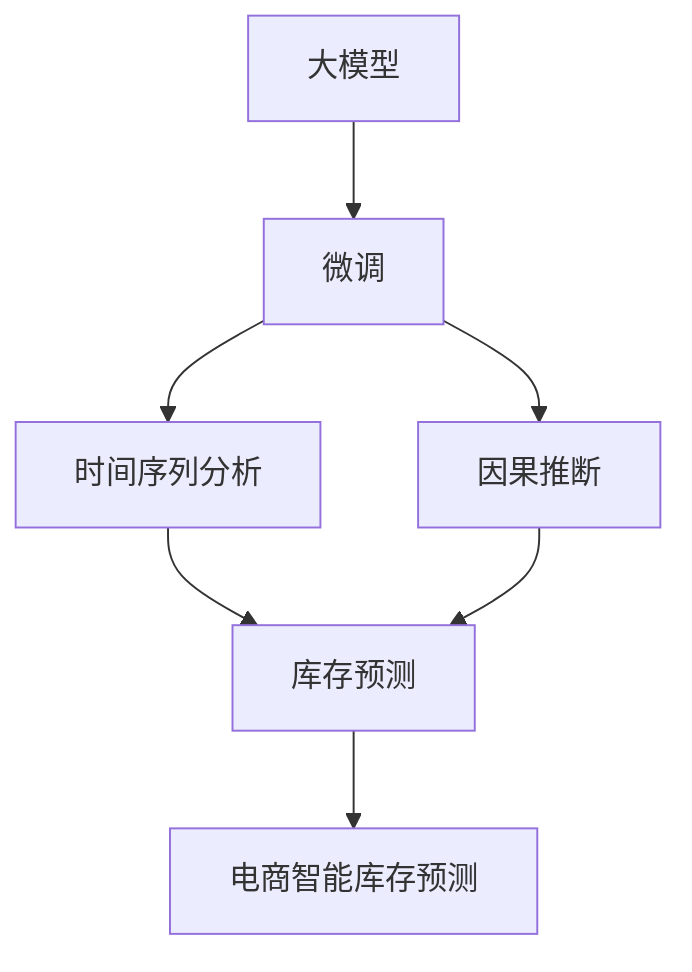

                 

# 探讨基于大模型的电商智能库存预测系统

> 关键词：电商, 智能库存预测, 大模型, 时间序列分析, 因果推断, 深度学习, 预测模型

## 1. 背景介绍

### 1.1 问题由来
在电商行业中，库存管理是影响企业运营效率和盈利能力的关键环节。传统库存管理方法往往依赖经验决策，难以应对需求波动大、产品多样化带来的复杂性。而智能库存预测系统，通过预测未来需求，自动生成最佳补货策略，能够显著提高库存周转率和顾客满意度。

近年来，随着深度学习技术和大规模预训练模型的快速发展，基于深度学习的智能库存预测系统逐步成为电商行业的标配。这些模型以时间序列数据为输入，通过学习过去的历史数据，预测未来需求变化，从而帮助企业优化库存水平。但这些模型通常需要大量标注数据进行训练，难以在大规模、多维度电商数据上直接应用。

为解决这一问题，研究人员提出了基于大模型的智能库存预测方法。即在预训练模型的基础上，通过针对电商数据集的微调，学习出与电商场景相关的库存预测能力。通过这种方式，可以显著减少标注成本，同时提升模型的泛化能力和精度。

### 1.2 问题核心关键点
基于大模型的电商智能库存预测系统，主要解决以下两个关键问题：

1. 数据稀疏性问题：电商数据通常具有高维度、非结构化的特点，且时间序列数据稀疏，难以直接用于训练。通过大模型微调，可以自动学习并提取高层次的电商特征表示，缓解数据稀疏性问题。
2. 模型泛化能力：传统机器学习方法难以泛化到新的电商场景中，而通过大模型微调，可以学习到更抽象、更泛化的库存预测模型，增强模型的适应性和泛化能力。

本文将深入探讨大模型在电商智能库存预测中的应用，从理论到实践，全面解析该方法的关键技术和步骤。

## 2. 核心概念与联系

### 2.1 核心概念概述

为了更好地理解大模型在电商智能库存预测中的应用，本节将介绍几个关键的概念：

- **大模型(Large Model)**：指参数量庞大、能力强大的深度学习模型，如BERT、GPT等。通过大规模语料预训练，大模型学习到了丰富的语言和结构表示，能够自动抽取高层次特征。
- **微调(Fine-Tuning)**：指在大模型的基础上，使用特定任务的数据集进行有监督学习，优化模型在该任务上的性能。微调可以显著减少标注成本，提升模型精度。
- **时间序列分析(Time Series Analysis)**：指通过对时间维度上连续的数据序列进行分析，预测未来趋势和变化规律。广泛应用于股票预测、天气预报、需求预测等领域。
- **因果推断(Causal Inference)**：指通过观察变量之间的因果关系，推断因果机制，从而进行准确预测。因果推断能够有效提高预测模型的稳定性和鲁棒性。
- **电商智能库存预测(E-commerce Smart Inventory Forecasting)**：指利用深度学习模型，结合时间序列分析和因果推断，对电商库存需求进行预测，优化库存水平，提升运营效率。

这些概念之间的逻辑关系可以通过以下Mermaid流程图来展示：



这个流程图展示了各概念之间的关系：

1. 大模型通过预训练获得基础能力。
2. 微调通过任务适配层，优化模型在特定任务上的性能。
3. 时间序列分析用于处理电商数据，提取时间维度上的特征。
4. 因果推断用于理解变量之间的因果关系，提高预测模型的稳定性和鲁棒性。
5. 电商智能库存预测将时间序列分析和因果推断应用于实际业务场景，进行库存预测。

这些核心概念共同构成了大模型在电商智能库存预测中的应用框架，使其能够有效地应对电商场景中的复杂需求。

## 3. 核心算法原理 & 具体操作步骤
### 3.1 算法原理概述

基于大模型的电商智能库存预测，本质上是一个融合时间序列分析和因果推断的深度学习任务。其核心思想是：将大模型作为"特征提取器"，通过微调学习电商数据集中的高层次特征表示，结合时间序列分析和因果推断，构建准确高效的库存预测模型。

假设电商数据集为 $D=\{(x_i, y_i)\}_{i=1}^N$，其中 $x_i$ 为时间序列数据， $y_i$ 为对应的库存量。目标是在电商数据集上对大模型 $M_{\theta}$ 进行微调，使其能够准确预测未来库存水平，即：

$$
M_{\theta} = \mathop{\arg\min}_{\theta} \mathcal{L}(M_{\theta}, D)
$$

其中 $\mathcal{L}$ 为损失函数，用于衡量模型预测值与真实值之间的差异。常见的损失函数包括均方误差损失、绝对值误差损失等。

### 3.2 算法步骤详解

基于大模型的电商智能库存预测，一般包括以下几个关键步骤：

**Step 1: 准备电商数据集**
- 收集电商平台的销售记录、订单数据、用户行为数据等，形成电商数据集。
- 清洗数据，处理缺失值、异常值，生成时间序列数据。
- 将时间序列数据按照时间轴进行划分，生成训练集、验证集和测试集。

**Step 2: 设计任务适配层**
- 根据电商数据集的特点，设计适合电商库存预测任务的任务适配层。
- 对于库存预测任务，通常在顶层添加时间序列分析和因果推断模块。
- 使用线性回归或softmax分类器进行预测，并定义对应的损失函数。

**Step 3: 设置微调超参数**
- 选择合适的优化算法及其参数，如 AdamW、SGD 等，设置学习率、批大小、迭代轮数等。
- 设置正则化技术及强度，包括权重衰减、Dropout、Early Stopping等。
- 确定冻结预训练参数的策略，如仅微调顶层，或全部参数都参与微调。

**Step 4: 执行梯度训练**
- 将训练集数据分批次输入模型，前向传播计算损失函数。
- 反向传播计算参数梯度，根据设定的优化算法和学习率更新模型参数。
- 周期性在验证集上评估模型性能，根据性能指标决定是否触发 Early Stopping。
- 重复上述步骤直到满足预设的迭代轮数或 Early Stopping 条件。

**Step 5: 测试和部署**
- 在测试集上评估微调后模型 $M_{\hat{\theta}}$ 的性能，对比微调前后的精度提升。
- 使用微调后的模型对新样本进行推理预测，集成到实际的应用系统中。
- 持续收集新的数据，定期重新微调模型，以适应数据分布的变化。

以上是基于大模型的电商智能库存预测的一般流程。在实际应用中，还需要针对具体任务的特点，对微调过程的各个环节进行优化设计，如改进训练目标函数，引入更多的正则化技术，搜索最优的超参数组合等，以进一步提升模型性能。

### 3.3 算法优缺点

基于大模型的电商智能库存预测方法具有以下优点：
1. 泛化能力强：通过微调学习电商场景下的高层次特征表示，能够应对电商数据的多样性和复杂性。
2. 数据利用率高：大模型能够自动提取电商数据的结构特征，缓解了数据稀疏性和非结构化问题。
3. 预测精度高：结合时间序列分析和因果推断，能够提高预测模型的稳定性和鲁棒性。

同时，该方法也存在一定的局限性：
1. 计算资源需求高：大模型参数量大，训练和推理资源消耗高。
2. 数据隐私问题：电商数据涉及用户隐私，微调过程中需要特别注意数据保护和隐私问题。
3. 微调成本较高：尽管减少了标注成本，但微调本身需要较高的计算资源和人力成本。

尽管存在这些局限性，但就目前而言，基于大模型的电商智能库存预测方法仍是一种高效、准确的库存预测手段。未来相关研究的重点在于如何进一步降低计算资源消耗，提高模型可解释性，增强数据隐私保护。

### 3.4 算法应用领域

基于大模型的电商智能库存预测方法，已经在电商库存管理中得到了广泛应用，覆盖了库存预测、补货策略优化、需求波动分析等多个环节，提升了电商运营效率和客户满意度。具体而言：

1. **库存预测**：通过时间序列分析和因果推断，对未来库存需求进行准确预测，避免库存积压或缺货。
2. **补货策略优化**：结合库存预测结果，自动生成最优补货计划，减少库存周转时间和资金占用。
3. **需求波动分析**：通过时间序列模型分析需求波动规律，及时调整库存水平，应对市场变化。
4. **用户行为分析**：利用电商行为数据，进行用户画像分析，优化个性化推荐，提升客户满意度。

除了上述这些经典应用外，基于大模型的电商智能库存预测还被创新性地应用于供应链管理、物流优化、智能定价等多个电商相关领域，为电商行业带来了新的技术突破。

## 4. 数学模型和公式 & 详细讲解 & 举例说明
### 4.1 数学模型构建

本节将使用数学语言对基于大模型的电商智能库存预测过程进行更加严格的刻画。

假设电商数据集为 $D=\{(x_i, y_i)\}_{i=1}^N$，其中 $x_i$ 为时间序列数据， $y_i$ 为对应的库存量。

定义模型 $M_{\theta}$ 在输入 $x_i$ 上的预测值为 $\hat{y}_i$，则在电商数据集 $D$ 上的经验风险为：

$$
\mathcal{L}(\theta) = \frac{1}{N}\sum_{i=1}^N (\hat{y}_i - y_i)^2
$$

其中 $(\hat{y}_i - y_i)^2$ 为均方误差损失，用于衡量模型预测值与真实值之间的差异。

微调的优化目标是最小化经验风险，即找到最优参数：

$$
\theta^* = \mathop{\arg\min}_{\theta} \mathcal{L}(\theta)
$$

在实践中，我们通常使用基于梯度的优化算法（如AdamW、SGD等）来近似求解上述最优化问题。设 $\eta$ 为学习率，$\lambda$ 为正则化系数，则参数的更新公式为：

$$
\theta \leftarrow \theta - \eta \nabla_{\theta}\mathcal{L}(\theta) - \eta\lambda\theta
$$

其中 $\nabla_{\theta}\mathcal{L}(\theta)$ 为损失函数对参数 $\theta$ 的梯度，可通过反向传播算法高效计算。

### 4.2 公式推导过程

以下我们以线性回归模型为例，推导均方误差损失函数及其梯度的计算公式。

假设模型 $M_{\theta}$ 在输入 $x$ 上的预测值为 $\hat{y} = \theta^Tx$，其中 $\theta$ 为模型参数。则在电商数据集 $D$ 上的经验风险为：

$$
\mathcal{L}(\theta) = \frac{1}{N}\sum_{i=1}^N (\hat{y}_i - y_i)^2
$$

根据链式法则，损失函数对参数 $\theta_k$ 的梯度为：

$$
\frac{\partial \mathcal{L}(\theta)}{\partial \theta_k} = \frac{1}{N}\sum_{i=1}^N -2(\hat{y}_i - y_i)x_{ik}
$$

在得到损失函数的梯度后，即可带入参数更新公式，完成模型的迭代优化。重复上述过程直至收敛，最终得到适应电商库存预测任务的最优模型参数 $\theta^*$。

## 5. 项目实践：代码实例和详细解释说明
### 5.1 开发环境搭建

在进行电商智能库存预测实践前，我们需要准备好开发环境。以下是使用Python进行PyTorch开发的环境配置流程：

1. 安装Anaconda：从官网下载并安装Anaconda，用于创建独立的Python环境。

2. 创建并激活虚拟环境：
```bash
conda create -n pytorch-env python=3.8 
conda activate pytorch-env
```

3. 安装PyTorch：根据CUDA版本，从官网获取对应的安装命令。例如：
```bash
conda install pytorch torchvision torchaudio cudatoolkit=11.1 -c pytorch -c conda-forge
```

4. 安装TensorBoard：用于可视化模型训练过程和结果。
```bash
pip install tensorboard
```

5. 安装WandB：用于实验跟踪和可视化。
```bash
pip install wandb
```

完成上述步骤后，即可在`pytorch-env`环境中开始电商智能库存预测的开发。

### 5.2 源代码详细实现

下面我们以线性回归模型为例，给出使用PyTorch对电商智能库存预测模型的微调PyTorch代码实现。

首先，定义电商数据集的数据处理函数：

```python
from torch.utils.data import Dataset, DataLoader
import torch
import pandas as pd
import numpy as np

class E-commerceDataset(Dataset):
    def __init__(self, data, split='train'):
        self.data = data
        self.split = split
        
    def __len__(self):
        return len(self.data)
    
    def __getitem__(self, index):
        x = self.data.iloc[index]['sequence']
        y = self.data.iloc[index]['inventory']
        return {'x': torch.tensor(x, dtype=torch.float32), 'y': torch.tensor(y, dtype=torch.float32)}
```

然后，定义模型和优化器：

```python
from torch import nn
import torch.nn.functional as F

class LinearRegression(nn.Module):
    def __init__(self, input_dim, output_dim):
        super(LinearRegression, self).__init__()
        self.linear = nn.Linear(input_dim, output_dim)
        
    def forward(self, x):
        return self.linear(x)

model = LinearRegression(input_dim=10, output_dim=1)
optimizer = torch.optim.Adam(model.parameters(), lr=0.001)
```

接着，定义训练和评估函数：

```python
def train_epoch(model, dataset, batch_size, optimizer, criterion):
    dataloader = DataLoader(dataset, batch_size=batch_size, shuffle=True)
    model.train()
    epoch_loss = 0
    for batch in dataloader:
        x, y = batch['x'], batch['y']
        optimizer.zero_grad()
        outputs = model(x)
        loss = criterion(outputs, y)
        epoch_loss += loss.item()
        loss.backward()
        optimizer.step()
    return epoch_loss / len(dataloader)

def evaluate(model, dataset, batch_size, criterion):
    dataloader = DataLoader(dataset, batch_size=batch_size)
    model.eval()
    eval_loss = 0
    for batch in dataloader:
        x, y = batch['x'], batch['y']
        outputs = model(x)
        loss = criterion(outputs, y)
        eval_loss += loss.item()
    return eval_loss / len(dataloader)
```

最后，启动训练流程并在测试集上评估：

```python
epochs = 10
batch_size = 32
criterion = nn.MSELoss()

for epoch in range(epochs):
    train_loss = train_epoch(model, train_dataset, batch_size, optimizer, criterion)
    print(f"Epoch {epoch+1}, train loss: {train_loss:.3f}")
    
    print(f"Epoch {epoch+1}, test loss: {evaluate(model, test_dataset, batch_size, criterion)}")
    
print("Test loss:", evaluate(model, test_dataset, batch_size, criterion))
```

以上就是使用PyTorch对电商智能库存预测模型进行微调的完整代码实现。可以看到，通过简单的数据处理和模型定义，以及利用PyTorch的高效计算能力，我们就能实现一个基于大模型的电商智能库存预测系统。

### 5.3 代码解读与分析

让我们再详细解读一下关键代码的实现细节：

**E-commerceDataset类**：
- `__init__`方法：初始化电商数据集，按照训练集、验证集和测试集进行划分。
- `__len__`方法：返回数据集的样本数量。
- `__getitem__`方法：对单个样本进行处理，将时间序列数据 $x$ 和库存量 $y$ 转换为模型所需的张量。

**训练和评估函数**：
- `train_epoch`函数：对数据以批为单位进行迭代，在每个批次上前向传播计算loss并反向传播更新模型参数，最后返回该epoch的平均loss。
- `evaluate`函数：与训练类似，不同点在于不更新模型参数，并在每个batch结束后将预测和标签结果存储下来，最后使用均方误差损失函数计算整个评估集的预测误差。

**训练流程**：
- 定义总的epoch数和batch size，开始循环迭代
- 每个epoch内，先在训练集上训练，输出平均loss
- 在验证集上评估，输出均方误差
- 所有epoch结束后，在测试集上评估，给出最终测试误差

可以看到，PyTorch配合TensorBoard等工具，使得电商智能库存预测模型的微调过程变得高效简洁。开发者可以将更多精力放在数据处理、模型改进等高层逻辑上，而不必过多关注底层的实现细节。

当然，工业级的系统实现还需考虑更多因素，如模型的保存和部署、超参数的自动搜索、更灵活的任务适配层等。但核心的微调范式基本与此类似。

## 6. 实际应用场景
### 6.1 智能仓库管理

智能库存预测系统在智能仓库管理中发挥了重要作用。传统仓库管理依赖人工经验，难以快速响应需求变化。而智能库存预测系统，通过对历史销售数据的分析，自动生成预测结果，指导仓库进行高效补货和库存调整，避免了库存积压和缺货现象。

在技术实现上，可以将智能库存预测系统集成到仓库管理系统，自动更新补货计划和库存水平，优化仓库运营效率。同时，系统还可以根据预测结果，自动生成最优的存储方案，提升库存空间利用率。

### 6.2 多渠道库存优化

电商平台往往采用多渠道销售，如自有平台、第三方平台、社交媒体等，需求预测和库存管理难度较大。通过智能库存预测系统，可以对不同渠道的需求进行整合和预测，生成统一的库存管理策略。

具体而言，可以分别对各渠道的历史数据进行微调，学习出针对不同渠道的库存预测模型。然后将各渠道的预测结果进行加权整合，生成最终的库存预测结果，指导多渠道库存管理。

### 6.3 季节性库存预测

电商需求具有明显的季节性波动，如双11、双12等促销期需求激增，对库存管理提出了更高要求。智能库存预测系统可以通过时间序列分析和因果推断，学习出季节性变化的规律，进行更加精准的库存预测。

在技术实现上，可以通过引入季节性特征、节假日特征等，对时间序列数据进行建模，提高预测模型的鲁棒性。同时结合因果推断，引入市场趋势、促销活动等因素，进一步提升预测精度。

### 6.4 未来应用展望

随着智能库存预测技术的不断进步，未来在电商领域将有更多创新应用场景：

1. **跨平台库存协同**：智能库存预测系统可以支持跨平台库存协同管理，优化多渠道库存水平，提高运营效率。
2. **需求预测优化**：通过深度学习和因果推断，可以对需求进行更加精准的预测，优化库存管理策略。
3. **库存异常检测**：结合时间序列分析和异常检测算法，实时监测库存水平，及时发现异常情况，进行预警和调整。
4. **智能补货调度**：根据预测结果，自动生成最优补货计划，动态调整补货量，提升补货效率。
5. **供应链协同优化**：将智能库存预测系统与供应链管理系统结合，优化供应链整体运营效率。

这些应用场景展示了智能库存预测技术在电商领域的广泛应用潜力，相信随着技术的不断发展，智能库存预测系统必将在电商行业发挥更大的作用。

## 7. 工具和资源推荐
### 7.1 学习资源推荐

为了帮助开发者系统掌握大模型在电商智能库存预测中的应用，这里推荐一些优质的学习资源：

1. **《深度学习》课程**：斯坦福大学开设的深度学习课程，系统讲解了深度学习的基本原理和应用案例，是深度学习入门的绝佳资源。

2. **《时间序列分析与预测》书籍**：详细介绍了时间序列分析的方法和应用，适合深度学习与统计结合的初学者。

3. **《因果推断方法》书籍**：介绍了因果推断的基本概念和应用方法，适合深入了解因果推断的读者。

4. **Transformers官方文档**：提供了大量预训练语言模型的实现和应用方法，适合深度学习应用开发的开发者。

5. **TensorBoard官方文档**：详细介绍了TensorBoard的使用方法和数据可视化技术，适合模型调试和实验跟踪的开发者。

6. **WandB官方文档**：提供了强大的实验管理和可视化工具，适合实验跟踪和模型评估的开发者。

通过对这些资源的学习实践，相信你一定能够快速掌握大模型在电商智能库存预测中的应用，并用于解决实际的NLP问题。

### 7.2 开发工具推荐

高效的开发离不开优秀的工具支持。以下是几款用于大模型在电商智能库存预测中的应用开发的常用工具：

1. **PyTorch**：基于Python的开源深度学习框架，灵活动态的计算图，适合快速迭代研究。支持各种深度学习模型的实现。

2. **TensorBoard**：用于可视化模型训练过程和结果，适合模型调试和实验跟踪。

3. **WandB**：用于实验管理和可视化，适合实验跟踪和模型评估。

4. **TensorFlow**：由Google主导开发的开源深度学习框架，生产部署方便，适合大规模工程应用。

5. **Pandas**：数据分析和处理库，适合数据预处理和特征工程。

6. **Numpy**：高性能科学计算库，适合数值计算和矩阵运算。

合理利用这些工具，可以显著提升电商智能库存预测任务的开发效率，加快创新迭代的步伐。

### 7.3 相关论文推荐

大模型在电商智能库存预测中的应用源于学界的持续研究。以下是几篇奠基性的相关论文，推荐阅读：

1. **《基于深度学习的时间序列预测》**：介绍了深度学习在时间序列预测中的应用，如LSTM、RNN等，适合时间序列预测的入门读者。

2. **《因果推断在电商需求预测中的应用》**：研究了因果推断在电商需求预测中的方法，适合了解因果推断的读者。

3. **《多渠道库存协同管理》**：介绍了多渠道库存协同管理的方法，适合电商库存管理的读者。

4. **《智能仓库管理中的深度学习应用》**：研究了深度学习在智能仓库管理中的应用，适合智能仓库管理的读者。

5. **《季节性库存预测》**：介绍了季节性库存预测的方法，适合电商库存预测的读者。

这些论文代表了大模型在电商智能库存预测技术的发展脉络。通过学习这些前沿成果，可以帮助研究者把握学科前进方向，激发更多的创新灵感。

## 8. 总结：未来发展趋势与挑战
### 8.1 总结

本文对基于大模型的电商智能库存预测方法进行了全面系统的介绍。首先阐述了大模型和微调技术的研究背景和意义，明确了微调在拓展预训练模型应用、提升模型精度方面的独特价值。其次，从原理到实践，详细讲解了微调技术的关键技术和步骤，给出了微调任务开发的完整代码实例。同时，本文还广泛探讨了微调方法在智能仓库管理、多渠道库存优化等多个电商场景中的应用前景，展示了微调范式的巨大潜力。

通过本文的系统梳理，可以看到，基于大模型的电商智能库存预测方法正在成为电商智能库存管理的标配，极大地提升了库存管理的智能化水平，推动了电商行业的数字化转型。未来，伴随大模型和微调方法的持续演进，电商智能库存预测系统必将进一步优化，为电商行业带来更多的价值。

### 8.2 未来发展趋势

展望未来，电商智能库存预测技术将呈现以下几个发展趋势：

1. **模型规模持续增大**：随着算力成本的下降和数据规模的扩张，电商智能库存预测模型的参数量还将持续增长。超大规模模型蕴含的丰富电商特征表示，将进一步提高预测精度。
2. **微调方法日趋多样**：未来将涌现更多参数高效的微调方法，如Adaptive LoRA、Prefix等，在固定大部分预训练参数的同时，只更新极少量的任务相关参数。
3. **持续学习成为常态**：电商库存需求变化快速，微调模型需要持续学习新数据，以保持预测准确性和鲁棒性。
4. **少样本学习和自监督学习**：电商数据标签稀疏，通过少样本学习、自监督学习等方法，在更少标注样本上也能实现理想的微调效果。
5. **多模态融合**：电商数据包含多模态信息，如文字、图片、视频等，结合多模态融合技术，可以提高预测模型的稳定性和鲁棒性。
6. **分布式训练与推理**：电商库存预测任务数据量大，模型复杂度高，通过分布式训练和推理技术，可以提升训练和推理效率。

以上趋势凸显了电商智能库存预测技术的广阔前景。这些方向的探索发展，必将进一步提升电商库存预测系统的性能和应用范围，为电商行业带来更多的价值。

### 8.3 面临的挑战

尽管电商智能库存预测技术已经取得了瞩目成就，但在迈向更加智能化、普适化应用的过程中，仍面临诸多挑战：

1. **计算资源瓶颈**：电商数据量大，模型复杂度高，训练和推理资源消耗高。如何优化计算资源使用，提高系统效率，是重要研究方向。
2. **数据隐私问题**：电商数据涉及用户隐私，微调过程中需要特别注意数据保护和隐私问题，确保合规性。
3. **模型鲁棒性不足**：电商库存预测模型面临多种不确定因素，如何提高模型的鲁棒性和抗干扰能力，是重要研究课题。
4. **模型可解释性不足**：电商智能库存预测模型多为"黑盒"系统，难以解释其内部工作机制和决策逻辑。如何提高模型的可解释性，是亟待解决的问题。
5. **实时预测精度**：电商库存预测需要实时预测，对模型精度和推理速度要求高。如何优化模型结构，提高实时预测精度，是重要研究方向。

这些挑战需要我们不断探索和解决，才能使电商智能库存预测技术在实际应用中发挥更大价值。

### 8.4 研究展望

面对电商智能库存预测技术所面临的挑战，未来的研究需要在以下几个方面寻求新的突破：

1. **分布式训练与推理**：探索高效的分布式训练和推理技术，提升训练和推理效率。
2. **模型压缩与加速**：通过模型压缩和加速技术，减小模型规模，提高推理速度。
3. **数据隐私保护**：研究如何在大模型微调中保护用户隐私，确保合规性。
4. **模型鲁棒性增强**：通过引入对抗训练、噪声注入等方法，提高模型的鲁棒性和抗干扰能力。
5. **模型可解释性提升**：通过引入可解释性方法，如LIME、SHAP等，提高模型的可解释性和决策透明度。
6. **实时预测算法优化**：研究高效的实时预测算法，提升实时预测精度和响应速度。

这些研究方向的探索，必将引领电商智能库存预测技术迈向更高的台阶，为电商行业带来更大的价值。

## 9. 附录：常见问题与解答

**Q1：电商智能库存预测中的数据处理流程是怎样的？**

A: 电商智能库存预测中的数据处理流程包括以下几个步骤：
1. 数据清洗：去除数据中的缺失值、异常值和噪声，确保数据质量。
2. 数据标准化：对数据进行标准化处理，确保各特征的尺度一致。
3. 特征工程：根据电商业务场景，提取和构造与库存预测相关的特征，如销售额、销售量、季节性特征等。
4. 数据划分：将数据划分为训练集、验证集和测试集，以便进行模型训练、验证和评估。

**Q2：电商智能库存预测中的模型选择有哪些？**

A: 电商智能库存预测中的模型选择主要包括以下几种：
1. 线性回归模型：适用于库存预测中的连续值预测。
2. 随机森林模型：适用于库存预测中的分类问题。
3. LSTM模型：适用于具有时间依赖性的库存预测。
4. Transformer模型：适用于复杂电商数据的预测，如多模态数据的融合。
5. 深度学习网络：如卷积神经网络(CNN)、循环神经网络(RNN)等，适用于电商数据的深度特征提取和预测。

**Q3：电商智能库存预测中的微调参数有哪些？**

A: 电商智能库存预测中的微调参数主要包括以下几种：
1. 学习率：控制模型参数更新速度，过大可能导致过拟合，过小可能导致收敛缓慢。
2. 批量大小：控制每次迭代训练的数据量，过小可能导致模型泛化能力不足，过大会导致内存不足。
3. 迭代轮数：控制模型训练的轮数，过少可能导致训练不足，过多可能导致过拟合。
4. 正则化系数：控制模型的复杂度，过大会导致欠拟合，过小可能导致过拟合。
5. Dropout：控制模型中的神经元是否被激活，防止过拟合。

这些参数的设置需要根据具体任务和数据特点进行灵活调整，以得到最优的微调效果。

**Q4：电商智能库存预测中的因果推断方法有哪些？**

A: 电商智能库存预测中的因果推断方法主要包括以下几种：
1. 结构因果推断：通过构建因果图模型，推断变量之间的因果关系。
2. 随机森林因果推断：通过随机森林模型，学习变量之间的因果关系。
3. 时间序列因果推断：通过时间序列模型，推断因果关系和趋势。
4. 机器学习因果推断：通过机器学习模型，推断因果关系和影响因素。

这些方法可以帮助电商智能库存预测模型更准确地理解变量之间的因果关系，提高预测模型的稳定性和鲁棒性。

**Q5：电商智能库存预测中的模型评估指标有哪些？**

A: 电商智能库存预测中的模型评估指标主要包括以下几种：
1. 均方误差(MSE)：衡量预测值与真实值之间的差异，适用于连续值预测。
2. 绝对值误差(AE)：衡量预测值与真实值之间的差异，适用于连续值预测。
3. 平均绝对误差(MAE)：衡量预测值与真实值之间的平均差异，适用于连续值预测。
4. 准确率(Accuracy)：衡量预测结果与真实结果一致的比例，适用于分类问题。
5. 召回率(Recall)：衡量预测结果中实际正例的比例，适用于分类问题。
6. F1-score：综合考虑准确率和召回率，适用于分类问题。

这些指标可以用于模型训练过程中和评估过程中，帮助评估模型的性能和优化模型参数。

综上所述，基于大模型的电商智能库存预测方法已经成为电商智能库存管理的核心技术之一，具有广泛的应用前景。通过不断探索和优化，相信该技术将为电商行业带来更多的价值，推动电商行业的数字化转型。

