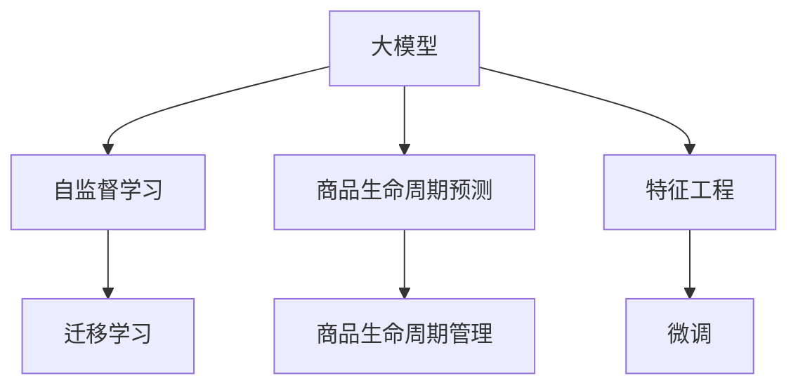

                 

# 探讨大模型在电商平台商品生命周期预测与管理中的作用

大模型作为近年来人工智能领域的一个重要突破，其应用范围不断扩大，涉及领域也越来越广泛。在电商平台中，商品生命周期预测与管理是一个关键的业务环节，其核心是预测商品的生命周期曲线，即从上市到下架的时间线，以便商家根据商品的销售情况及时作出调整，优化库存管理，提升销售额。本文将探讨大模型在商品生命周期预测与管理中的作用，通过系统化地分析，给出理论框架，并介绍几种实用的模型构建方法和应用场景。

## 1. 背景介绍

### 1.1 问题由来

在现代电商平台上，商品种类繁多，从生活用品到电子产品，从服装鞋帽到家居用品，各品类商品的生命周期差异巨大。以服装鞋帽为例，夏季新品可能会在短时间内迅速热销，但随着季节变化，需求量会快速下降；而常销商品则可能在整个销售周期中保持相对稳定的销售量。为了有效地管理库存，电商平台需要及时掌握商品销售趋势，预测其生命周期，以实现商品的全生命周期管理。传统的统计方法或经验判断难以准确预测新商品的生命周期，且难以应对数据动态变化和多样化需求，急需更加智能化的预测模型。

### 1.2 问题核心关键点

商品生命周期预测与管理的主要挑战包括：
1. **数据复杂性**：电商平台上存储了大量的商品销售数据，这些数据具有多维度、高维稀疏性，对模型提出了高要求。
2. **预测精度**：如何从复杂的数据中提取有效的特征，构建准确的预测模型，确保模型预测的精度和泛化能力。
3. **实时性**：电商平台的库存管理需要实时数据支持，预测模型需要快速响应用户行为变化。
4. **可解释性**：电商商家需要了解模型预测的原因，以便对结果进行合理的解释和调整。

针对以上问题，大模型以其强大的学习能力和大数据处理能力，为商品生命周期预测与管理提供了全新的解决方案。

## 2. 核心概念与联系

### 2.1 核心概念概述

为更好地理解大模型在商品生命周期预测与管理中的作用，本节将介绍几个密切相关的核心概念：

- **大模型**：指大规模的深度神经网络模型，如BERT、GPT等，具有强大的数据表示和模式识别能力，适合处理复杂的高维数据。
- **商品生命周期预测**：预测商品从上市到下架的时间线，包括上市时间、销售峰值时间、衰退时间等关键时间点。
- **商品生命周期管理**：根据预测结果，对商品进行库存调整、促销策略优化等，以提高销售效果和库存周转率。
- **自监督学习**：通过在大规模无标签数据上预训练模型，学习数据的内在规律和结构，然后在有标签数据上进行微调，提高模型性能。
- **迁移学习**：将在一个领域学到的知识迁移到另一个领域，以提升新领域的预测能力。

这些概念之间的逻辑关系可以通过以下Mermaid流程图来展示：



这个流程图展示了大模型的核心概念及其之间的关系：

1. 大模型通过自监督学习获得广泛的知识表示。
2. 将预训练模型应用于商品生命周期预测任务，通过迁移学习提高模型在该任务上的性能。
3. 利用特征工程提升模型对特定商品的预测能力。
4. 微调模型以适应具体的电商业务场景。

这些概念共同构成了大模型在商品生命周期预测与管理中的工作流程。

## 3. 核心算法原理 & 具体操作步骤
### 3.1 算法原理概述

大模型在商品生命周期预测与管理中的作用，主要体现在以下几个方面：

1. **数据预处理与特征提取**：利用大模型的表示能力，从电商数据中自动提取有意义的特征，例如商品的销量、用户评价、季节性特征等。
2. **历史趋势预测**：利用大模型对历史销售数据进行分析，预测商品在未来的销售趋势。
3. **生命周期曲线拟合**：结合预测结果，构建商品的生命周期曲线，帮助电商平台及时优化库存。
4. **实时调整与优化**：利用大模型的动态调整能力，实时响应用户行为变化，调整促销策略和库存配置。

### 3.2 算法步骤详解

基于大模型的商品生命周期预测与管理流程一般包括以下几个关键步骤：

**Step 1: 数据预处理**

- 收集电商平台上商品的销售数据，包括商品的ID、价格、销量、用户评价、促销活动等。
- 清洗数据，去除异常值和噪声，处理缺失值。
- 进行特征工程，提取出对预测有贡献的特征，如销量时间序列、价格波动、用户评价等。

**Step 2: 自监督预训练**

- 在大规模无标签电商数据上对大模型进行自监督预训练，学习商品销售的内在规律。
- 常用的自监督任务包括预测商品之间的相关性、预测用户购买概率等。

**Step 3: 迁移学习与微调**

- 在预训练模型的基础上，利用电商商品的销售数据进行迁移学习。
- 选择合适的目标任务，如商品销售预测、促销效果评估等。
- 通过微调模型，提高模型在该任务上的性能。

**Step 4: 模型部署与优化**

- 将微调后的模型部署到电商平台，实时处理新的销售数据。
- 根据实时预测结果，动态调整库存和促销策略。
- 定期重新微调模型，适应数据分布的变化。

### 3.3 算法优缺点

利用大模型进行商品生命周期预测与管理具有以下优点：
1. **强大表示能力**：大模型能够自动提取多维高维特征，适用于电商数据的复杂性。
2. **泛化能力强**：大模型经过自监督预训练，能够适应不同的电商商品和销售场景。
3. **动态调整**：大模型能够实时响应用户行为变化，优化库存和促销策略。

同时，该方法也存在一定的局限性：
1. **数据依赖性高**：模型性能依赖于电商数据的覆盖度和质量，数据不足可能影响预测效果。
2. **模型复杂度高**：大模型的复杂度较高，训练和推理成本较大。
3. **可解释性不足**：大模型的内部机制较为复杂，难以提供有意义的解释。

尽管存在这些局限性，但就目前而言，利用大模型的商品生命周期预测与管理方法已经在大规模电商平台上得到了广泛应用，并取得了显著效果。

### 3.4 算法应用领域

大模型在商品生命周期预测与管理中的应用领域主要包括以下几个方面：

1. **商品推荐系统**：利用大模型对用户行为进行预测，推荐商品，从而提升用户购买率和商品转化率。
2. **库存管理**：根据大模型的预测结果，优化商品库存配置，减少库存积压和缺货情况。
3. **促销活动优化**：利用大模型预测促销活动效果，调整促销策略，提升促销活动的效果。
4. **价格优化**：利用大模型预测用户对价格的敏感性，进行动态价格调整，提升销售额。
5. **风险预警**：利用大模型预测商品的销售趋势，预警潜在的库存积压和滞销风险。

除了上述这些核心应用外，大模型还可以应用于电商平台的许多其他场景，如用户流失预测、退货分析等，为电商平台的运营管理提供更多支撑。

## 4. 数学模型和公式 & 详细讲解 & 举例说明

### 4.1 数学模型构建

在本节中，我们将详细讨论利用大模型进行商品生命周期预测的数学模型构建。

设商品 $i$ 的销售数据为 $(x_i,t_i)$，其中 $x_i=(x_i^1,x_i^2,...,x_i^d)$ 为 $i$ 商品在不同时间点的特征向量，$t_i$ 为对应的销售时间。假设大模型为 $M$，其预测结果为 $\hat{y}_i(t)$。

大模型的预测函数可以表示为：

$$
\hat{y}_i(t) = M(x_i,t;\theta)
$$

其中 $\theta$ 为大模型的参数。

### 4.2 公式推导过程

在实际应用中，我们可以利用自监督预训练和迁移学习的思路，构建商品生命周期预测的模型。

假设大模型在无标签数据上进行了自监督预训练，得到了表示函数 $h(x_i,t)$，其与真实标签 $y_i$ 的关系可以表示为：

$$
y_i = h(x_i,t;\omega)
$$

其中 $\omega$ 为自监督预训练模型的参数。

在迁移学习过程中，我们利用电商商品的销售数据对预训练模型进行微调，得到商品生命周期预测模型 $M(x_i,t;\theta)$。预测结果 $\hat{y}_i(t)$ 可以表示为：

$$
\hat{y}_i(t) = M(x_i,t;\theta)
$$

结合自监督预训练和迁移学习，我们可以得到最终的预测模型：

$$
\hat{y}_i(t) = M(x_i,t;\theta) = \tilde{M}(h(x_i,t);\phi)
$$

其中 $\tilde{M}$ 为迁移学习的模型，$\phi$ 为迁移学习模型的参数。

### 4.3 案例分析与讲解

以服装销售数据的预测为例，我们可以将商品特征 $x_i$ 表示为：

$$
x_i = \{价格, 促销活动, 季节, 用户评分, 广告投放\}
$$

其中季节和用户评分等特征可能具有时序特征，需要在时间维度上进行处理。

利用自监督预训练，我们可以在大规模电商数据上学习商品的相关性，得到一个表示函数 $h(x_i,t)$。在迁移学习阶段，我们利用历史销售数据对预训练模型进行微调，得到最终的预测模型 $M(x_i,t;\theta)$。

在模型训练和预测过程中，我们可以利用均方误差、均方根误差等损失函数来评估模型性能。例如，均方误差可以表示为：

$$
\text{MSE}(y_i,\hat{y}_i) = \frac{1}{N}\sum_{i=1}^N (y_i - \hat{y}_i)^2
$$

其中 $N$ 为样本数量。

## 5. 项目实践：代码实例和详细解释说明
### 5.1 开发环境搭建

在进行大模型应用实践前，我们需要准备好开发环境。以下是使用Python进行PyTorch开发的环境配置流程：

1. 安装Anaconda：从官网下载并安装Anaconda，用于创建独立的Python环境。

2. 创建并激活虚拟环境：
```bash
conda create -n pytorch-env python=3.8 
conda activate pytorch-env
```

3. 安装PyTorch：根据CUDA版本，从官网获取对应的安装命令。例如：
```bash
conda install pytorch torchvision torchaudio cudatoolkit=11.1 -c pytorch -c conda-forge
```

4. 安装相关库：
```bash
pip install transformers numpy pandas sklearn matplotlib tqdm jupyter notebook ipython
```

完成上述步骤后，即可在`pytorch-env`环境中开始大模型的应用实践。

### 5.2 源代码详细实现

下面以利用BERT模型进行商品生命周期预测为例，给出使用PyTorch和HuggingFace的代码实现。

首先，定义模型和优化器：

```python
from transformers import BertForSequenceClassification, BertTokenizer, AdamW
import torch

# 加载预训练模型和tokenizer
model = BertForSequenceClassification.from_pretrained('bert-base-uncased')
tokenizer = BertTokenizer.from_pretrained('bert-base-uncased')

# 定义优化器
optimizer = AdamW(model.parameters(), lr=2e-5)
```

接着，定义数据预处理函数：

```python
def preprocess_data(data, tokenizer, max_len):
    # 将数据转化为token ids和attention mask
    encoded_inputs = tokenizer(data, padding='max_length', truncation=True, max_length=max_len)
    input_ids = encoded_inputs['input_ids']
    attention_mask = encoded_inputs['attention_mask']
    return input_ids, attention_mask
```

然后，定义模型训练函数：

```python
def train_model(model, optimizer, train_loader, device):
    model.to(device)
    model.train()
    for batch in train_loader:
        input_ids, attention_mask = batch
        input_ids = input_ids.to(device)
        attention_mask = attention_mask.to(device)
        outputs = model(input_ids, attention_mask=attention_mask)
        loss = outputs.loss
        optimizer.zero_grad()
        loss.backward()
        optimizer.step()
```

最后，启动训练流程：

```python
epochs = 5
max_len = 256

# 加载数据集
train_dataset = ...
dev_dataset = ...
test_dataset = ...

# 构建数据加载器
train_loader = ...
dev_loader = ...
test_loader = ...

# 训练模型
device = torch.device('cuda') if torch.cuda.is_available() else torch.device('cpu')
for epoch in range(epochs):
    train_model(model, optimizer, train_loader, device)
    evaluate_model(model, dev_loader, device)
```

以上代码展示了利用BERT模型进行商品生命周期预测的基本流程。可以看到，通过HuggingFace库的封装，我们能够方便地加载预训练模型和进行微调。

### 5.3 代码解读与分析

让我们再详细解读一下关键代码的实现细节：

**preprocess_data函数**：
- 将电商数据转化为token ids和attention mask，准备输入模型。
- 利用tokenizer将数据转化为预训练模型的输入格式。
- 利用max_length限制输入序列的长度，超出长度则进行截断或补零。

**train_model函数**：
- 定义训练过程：
  1. 将输入数据加载到GPU上。
  2. 前向传播计算预测结果。
  3. 计算loss并反向传播更新模型参数。
  4. 使用AdamW优化器更新参数。

**训练流程**：
- 定义训练轮数和序列长度，开始循环迭代。
- 每个epoch内，先在训练集上训练，输出平均loss。
- 在验证集上评估模型性能，调整模型参数。
- 重复上述步骤直至满足预设的迭代轮数或提前停止条件。

可以看到，利用BERT模型进行商品生命周期预测，代码实现相对简洁高效。开发者可以将更多精力放在数据处理、模型改进等高层逻辑上，而不必过多关注底层的实现细节。

## 6. 实际应用场景
### 6.1 智能推荐

智能推荐系统是电商平台上重要的功能之一，能够帮助用户发现潜在的购买需求，提升用户体验和销售转化率。利用大模型进行商品生命周期预测，可以为推荐系统提供更加准确的商品热度预测，从而优化推荐算法，提升推荐效果。

在具体实现上，可以利用大模型预测商品的生命周期曲线，然后将预测结果作为推荐系统的输入特征之一，结合用户行为数据、商品属性等，进行推荐算法训练和优化。通过持续迭代和实时更新，推荐系统能够根据用户需求和商品库存，动态调整推荐结果，实现更精准的推荐。

### 6.2 库存管理

库存管理是电商平台运营的核心环节，合理的库存配置能够显著提升销售效果和运营效率。利用大模型进行商品生命周期预测，可以为库存管理提供数据支持，帮助商家及时优化库存配置。

具体实现中，可以定期获取商品销售数据，利用大模型预测商品的生命周期曲线，并根据预测结果调整库存水平。对于生命周期即将结束的商品，可以提前促销或降价处理，避免积压；对于生命周期较长的商品，可以优化采购计划，减少缺货情况。通过智能化的库存管理，电商平台能够提升运营效率，降低库存成本。

### 6.3 价格优化

商品价格是影响用户购买决策的重要因素之一。利用大模型进行商品生命周期预测，可以为价格优化提供数据依据，帮助商家动态调整价格，提升销售效果。

具体实现中，可以利用大模型预测商品的热度变化趋势，并将预测结果作为价格优化算法的一部分。对于热度上升的商品，可以适当提升价格；对于热度下降的商品，可以逐步降价。通过动态价格调整，电商平台能够最大化销售收益，优化利润结构。

### 6.4 风险预警

电商平台中，商品滞销和库存积压是常见的风险之一，严重时会带来财务损失和运营压力。利用大模型进行商品生命周期预测，可以为风险预警提供数据支持，帮助商家及时调整策略，规避风险。

具体实现中，可以定期获取商品销售数据，利用大模型预测商品的生命周期曲线，并根据预测结果进行风险预警。对于生命周期即将结束的商品，可以提前预警，调整促销策略，减少库存积压；对于热销商品，可以调整采购计划，避免缺货。通过实时监测和风险预警，电商平台能够提高运营稳定性和抗风险能力。

## 7. 工具和资源推荐
### 7.1 学习资源推荐

为了帮助开发者系统掌握大模型在商品生命周期预测与管理中的应用，这里推荐一些优质的学习资源：

1. **《Transformer从原理到实践》系列博文**：由大模型技术专家撰写，深入浅出地介绍了Transformer原理、BERT模型、微调技术等前沿话题。

2. **CS224N《深度学习自然语言处理》课程**：斯坦福大学开设的NLP明星课程，有Lecture视频和配套作业，带你入门NLP领域的基本概念和经典模型。

3. **《Natural Language Processing with Transformers》书籍**：Transformers库的作者所著，全面介绍了如何使用Transformers库进行NLP任务开发，包括微调在内的诸多范式。

4. **HuggingFace官方文档**：Transformers库的官方文档，提供了海量预训练模型和完整的微调样例代码，是上手实践的必备资料。

5. **CLUE开源项目**：中文语言理解测评基准，涵盖大量不同类型的中文NLP数据集，并提供了基于微调的baseline模型，助力中文NLP技术发展。

通过对这些资源的学习实践，相信你一定能够快速掌握大模型在商品生命周期预测与管理中的作用，并用于解决实际的电商问题。

### 7.2 开发工具推荐

高效的开发离不开优秀的工具支持。以下是几款用于大模型应用开发的常用工具：

1. **PyTorch**：基于Python的开源深度学习框架，灵活动态的计算图，适合快速迭代研究。大部分预训练语言模型都有PyTorch版本的实现。

2. **TensorFlow**：由Google主导开发的开源深度学习框架，生产部署方便，适合大规模工程应用。同样有丰富的预训练语言模型资源。

3. **Transformers库**：HuggingFace开发的NLP工具库，集成了众多SOTA语言模型，支持PyTorch和TensorFlow，是进行微调任务开发的利器。

4. **Weights & Biases**：模型训练的实验跟踪工具，可以记录和可视化模型训练过程中的各项指标，方便对比和调优。与主流深度学习框架无缝集成。

5. **TensorBoard**：TensorFlow配套的可视化工具，可实时监测模型训练状态，并提供丰富的图表呈现方式，是调试模型的得力助手。

6. **Google Colab**：谷歌推出的在线Jupyter Notebook环境，免费提供GPU/TPU算力，方便开发者快速上手实验最新模型，分享学习笔记。

合理利用这些工具，可以显著提升大模型应用实践的开发效率，加快创新迭代的步伐。

### 7.3 相关论文推荐

大模型在商品生命周期预测与管理领域的研究源于学界的持续研究。以下是几篇奠基性的相关论文，推荐阅读：

1. **Attention is All You Need**：提出了Transformer结构，开启了NLP领域的预训练大模型时代。

2. **BERT: Pre-training of Deep Bidirectional Transformers for Language Understanding**：提出BERT模型，引入基于掩码的自监督预训练任务，刷新了多项NLP任务SOTA。

3. **Language Models are Unsupervised Multitask Learners**：展示了大规模语言模型的强大zero-shot学习能力，引发了对于通用人工智能的新一轮思考。

4. **Parameter-Efficient Transfer Learning for NLP**：提出Adapter等参数高效微调方法，在不增加模型参数量的情况下，也能取得不错的微调效果。

5. **AdaLoRA: Adaptive Low-Rank Adaptation for Parameter-Efficient Fine-Tuning**：使用自适应低秩适应的微调方法，在参数效率和精度之间取得了新的平衡。

6. **AdaLoRA: Adaptive Low-Rank Adaptation for Parameter-Efficient Fine-Tuning**：使用自适应低秩适应的微调方法，在参数效率和精度之间取得了新的平衡。

这些论文代表了大模型在商品生命周期预测与管理领域的发展脉络。通过学习这些前沿成果，可以帮助研究者把握学科前进方向，激发更多的创新灵感。

## 8. 总结：未来发展趋势与挑战

### 8.1 研究成果总结

本文对利用大模型进行商品生命周期预测与管理的理论框架和实践方法进行了系统性梳理，从模型构建、特征工程、训练优化等方面给出了详细阐述。通过结合实际案例和代码实例，展示了大模型在商品推荐、库存管理、价格优化、风险预警等电商场景中的应用，为电商平台提供了智能化决策的依据。

### 8.2 未来发展趋势

展望未来，大模型在商品生命周期预测与管理中的应用将呈现以下几个发展趋势：

1. **多模态融合**：未来的大模型将融合视觉、音频等多模态数据，提供更加全面的商品信息。例如，通过图像识别和视频分析，预测商品的热度和生命周期曲线。

2. **实时动态调整**：实时数据获取和处理能力将不断提升，大模型能够快速响应用户行为变化，动态调整预测结果。

3. **领域迁移学习**：大模型将具备更强的跨领域迁移能力，通过少样本学习、零样本学习等方式，适应新的电商商品和市场环境。

4. **可解释性增强**：未来的大模型将更加注重可解释性，通过提供预测理由和决策依据，增强商家的信任感。

5. **自动化预测**：通过自动化模型训练和优化，大模型能够更加灵活地应对电商平台的动态变化，提升预测的及时性和准确性。

### 8.3 面临的挑战

尽管大模型在商品生命周期预测与管理中的应用前景广阔，但在实际落地过程中，仍面临诸多挑战：

1. **数据获取与处理**：电商平台数据量大且复杂，如何高效处理和利用数据，仍是技术难题。

2. **模型性能**：电商平台的业务场景多样，不同商品和销售阶段对模型的要求不同，如何构建高性能的预测模型，仍是技术挑战。

3. **可解释性**：大模型内部的复杂结构，难以提供有意义的解释，如何增强模型的可解释性，仍是技术难点。

4. **成本与效率**：大模型的训练和推理成本较高，如何在保证性能的同时，降低计算资源消耗，仍是技术挑战。

### 8.4 研究展望

面对大模型在商品生命周期预测与管理中的应用挑战，未来的研究需要在以下几个方面寻求新的突破：

1. **数据增强与预处理**：通过数据增强、特征工程等方法，提升模型的数据处理能力，提高预测效果。

2. **多任务学习**：通过多任务学习，提升模型在多个任务上的性能，增强模型对电商业务的综合理解。

3. **自适应学习**：开发自适应学习算法，使模型能够根据电商平台的业务变化，动态调整预测模型。

4. **跨模态融合**：融合视觉、音频等多模态数据，提供更加全面的商品信息，提升预测的准确性。

5. **自动化优化**：通过自动化模型训练和优化，提高模型的预测及时性和准确性，增强商家的信任感。

6. **伦理与安全**：在大模型应用过程中，需关注模型偏见和伦理问题，确保模型输出的安全性。

## 9. 附录：常见问题与解答

**Q1：大模型在商品生命周期预测中是否适用于所有类型的商品？**

A: 大模型在商品生命周期预测中的应用，并不局限于某一种类型的商品。但不同类型的商品可能有不同的生命周期曲线和影响因素，因此需根据具体商品特性进行模型训练和优化。例如，快速时尚商品和耐用消费品可能需要不同的特征工程和模型设计。

**Q2：如何评估大模型的预测效果？**

A: 大模型在商品生命周期预测中的效果评估，可以通过以下指标进行衡量：
1. 均方误差(MSE)：衡量预测值与真实值之间的差异。
2. 均方根误差(RMSE)：衡量预测值与真实值之间的平均差异。
3. 平均绝对误差(MAE)：衡量预测值与真实值之间的平均绝对差异。
4. 准确率、召回率、F1分数等分类指标，适用于预测商品是否上市或下架等二分类任务。

**Q3：大模型在商品生命周期预测中是否需要定期重新训练？**

A: 大模型需要定期重新训练，以适应电商平台业务的变化。特别是在电商季节性变化较大、商品种类频繁变化的情况下，定期重新训练可以确保模型预测的准确性和及时性。

**Q4：大模型在商品生命周期预测中是否需要考虑用户行为变化？**

A: 是的，大模型需要考虑用户行为变化，以便更准确地预测商品的生命周期曲线。可以通过收集用户行为数据，如浏览记录、购买记录、评价记录等，作为模型训练的输入特征，优化预测模型。

**Q5：大模型在商品生命周期预测中是否需要引入外部知识库？**

A: 引入外部知识库可以进一步提升大模型的预测能力。例如，将知识图谱、行业报告等知识信息作为模型训练的输入特征，可以增强模型的解释能力和预测准确性。但需注意，引入外部知识库可能增加模型的复杂性和计算成本，需根据实际情况进行权衡。

---

作者：禅与计算机程序设计艺术 / Zen and the Art of Computer Programming

