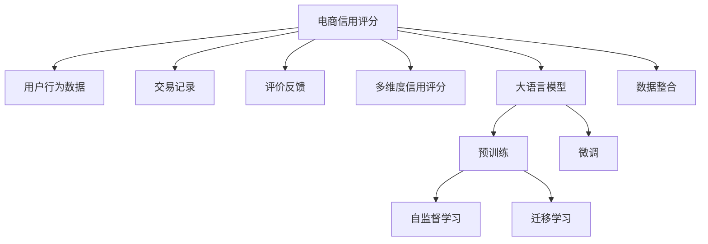

                 

## 1. 背景介绍

### 1.1 电商行业的痛点

电商平台作为现代经济的重要组成部分，正面临诸多挑战。其中最突出的是用户信用评分系统的构建与维护。传统的信用评分系统依赖于用户历史交易记录、反馈数据等，且仅基于单一的数值维度，难以全面反映用户的真实信用状况。另一方面，随着电商市场的快速扩张，用户数量激增，海量数据的处理和分析成为瓶颈，传统评分系统难以为继。

### 1.2 大模型的优势

为了应对这些挑战，大语言模型被引入电商信用评分系统的构建中。大模型通过海量数据训练，具备强大的文本理解和知识提取能力。相比于传统基于单一数值维度的评分方法，多维度信用评分系统可以综合考虑用户历史行为、社交网络、评价反馈等多方面信息，更全面地刻画用户信用特征。

### 1.3 电商平台的潜在应用

1. **风控管理**：通过大模型分析用户行为数据，提前识别潜在风险用户，减少欺诈行为。
2. **个性化推荐**：根据用户多维度信用评分，定制个性化推荐内容，提高用户粘性。
3. **信用授信**：根据用户评分，动态调整授信额度，优化用户体验。
4. **市场运营**：分析用户行为数据，洞察市场趋势，优化营销策略。

本节旨在通过分析大语言模型在电商多维度信用评分中的应用潜力，探讨其在实际业务中的应用价值和技术挑战，提供可行的实践方案和优化建议。

## 2. 核心概念与联系

### 2.1 核心概念概述

为更清晰地理解大模型在电商多维度信用评分中的应用，本节先介绍相关核心概念：

- **电商信用评分**：电商平台的信用评分系统，主要基于用户历史行为数据、交易记录、评价反馈等，用于评估用户的信用风险和信誉度。

- **多维度信用评分**：相较于传统的单一数值维度评分，多维度信用评分系统综合考虑用户行为数据、社交网络、评价反馈等多个方面的信息，以更全面、准确地评估用户信用。

- **大语言模型**：基于深度学习的自然语言处理模型，通过自监督和监督学习的方式，能够理解和生成自然语言，具备强大的知识提取和推理能力。

- **预训练和微调**：预训练指在大规模无标签数据上进行自监督学习，微调指在特定任务上，利用有标签数据优化模型性能。

- **迁移学习**：将一个领域学到的知识迁移到另一个领域，通过微调技术实现模型性能的提升。

### 2.2 核心概念原理和架构的 Mermaid 流程图



以上Mermaid流程图展示了电商信用评分系统的核心概念及其相互联系：

- 电商信用评分系统基于用户行为数据、交易记录、评价反馈等多维度信息。
- 多维度信用评分综合考虑用户行为、交易、评价等多个方面，更全面评估用户信用。
- 大语言模型通过预训练和微调技术，具备强大的自然语言处理能力。
- 预训练指在大规模无标签数据上进行的自监督学习，微调指在特定任务上的有监督优化。
- 迁移学习通过微调技术，实现不同领域间的知识迁移。
- 数据整合将多源数据进行整合，用于构建综合评估模型。

这些核心概念共同构成了电商多维度信用评分系统的基本框架，为后续算法设计和实践提供坚实基础。

## 3. 核心算法原理 & 具体操作步骤

### 3.1 算法原理概述

电商多维度信用评分系统的大模型应用，基于预训练-微调技术框架，通过在大规模电商数据上预训练通用语言模型，然后在特定电商任务上进行微调，以构建多维度信用评分模型。核心算法原理包括：

- **预训练**：使用大规模电商数据（如用户行为记录、交易数据、评价反馈等）对大语言模型进行自监督学习，学习到通用语言表示和电商领域知识。
- **微调**：在电商任务上进行有监督学习，针对特定的多维度信用评分任务，调整大模型的参数，优化模型性能。
- **迁移学习**：通过微调技术，将电商任务上的知识迁移到其他领域，提升模型泛化能力。

### 3.2 算法步骤详解

电商多维度信用评分系统的大模型应用，主要包括以下几个关键步骤：

1. **数据准备**：收集电商平台的各类数据，如用户行为数据、交易数据、评价反馈等，并清洗处理，形成有标签数据集。
2. **模型选择**：选择合适的预训练模型，如BERT、GPT等，作为电商任务的基础模型。
3. **预训练模型微调**：在电商任务上进行微调，调整模型参数，优化模型性能。
4. **模型评估与优化**：在验证集上评估模型性能，调整模型超参数，优化模型。
5. **模型部署与应用**：将优化后的模型部署到电商系统，用于用户多维度信用评分。

### 3.3 算法优缺点

#### 优点：

1. **泛化能力强**：通过预训练技术，大语言模型能够学习到电商领域的一般性知识，在特定电商任务上表现优异。
2. **数据需求小**：相较于传统评分系统，大模型在数据量和标签质量要求上更为宽松。
3. **多维度整合**：能够综合考虑用户行为、交易、评价等多方面信息，构建多维度信用评分模型。
4. **动态调整**：能够动态调整模型参数，及时适应电商市场变化。

#### 缺点：

1. **计算资源要求高**：预训练和微调大模型需要大量计算资源，涉及复杂模型和算法。
2. **技术门槛高**：大模型的训练和优化涉及深度学习和自然语言处理技术，对从业者技术要求较高。
3. **模型复杂度高**：大模型结构复杂，难以理解和调试。
4. **风险控制难**：大模型容易受到训练数据偏差影响，存在一定的风险控制问题。

### 3.4 算法应用领域

大模型在电商多维度信用评分系统中的应用，主要涵盖以下几个方面：

1. **用户行为分析**：通过分析用户行为数据，构建用户画像，评估用户信用风险。
2. **欺诈检测**：识别潜在欺诈行为，提升交易安全。
3. **推荐系统优化**：基于用户多维度信用评分，优化个性化推荐算法。
4. **营销策略优化**：通过分析用户数据，优化营销策略，提高用户转化率。
5. **客户服务**：利用大模型处理客户反馈，提高客户服务质量。

## 4. 数学模型和公式 & 详细讲解 & 举例说明

### 4.1 数学模型构建

电商多维度信用评分系统的大模型应用，主要通过预训练-微调技术框架构建。以下公式展示了基于大模型的电商多维度信用评分数学模型：

$$
\text{Score} = \alpha \cdot \text{UserBehaviorScore} + \beta \cdot \text{TransactionScore} + \gamma \cdot \text{ReviewScore}
$$

其中：

- $\text{Score}$：电商用户多维度信用评分。
- $\alpha, \beta, \gamma$：不同维度的权重因子，根据模型优化需求进行调整。
- $\text{UserBehaviorScore}$：基于用户行为数据的信用评分。
- $\text{TransactionScore}$：基于交易数据的信用评分。
- $\text{ReviewScore}$：基于评价反馈数据的信用评分。

### 4.2 公式推导过程

以用户行为评分为例，其评分计算公式可以表示为：

$$
\text{UserBehaviorScore} = \sum_{i=1}^N \lambda_i \cdot \text{BERT}(\text{user\_behavior}_i)
$$

其中：

- $\text{BERT}$：大语言模型，用于提取用户行为数据的表示。
- $\lambda_i$：不同用户行为数据点的权重因子。
- $\text{user\_behavior}_i$：第$i$个用户行为数据点，如访问时间、浏览记录等。

通过上述公式，用户行为数据经过大模型处理后，得到行为表示，再通过加权求和得到用户行为评分。

### 4.3 案例分析与讲解

假设某电商平台有A、B两位用户，A用户历史交易数据丰富，B用户无历史交易记录，但评价反馈较高。根据电商多维度信用评分模型，用户行为评分计算如下：

- A用户：基于其历史行为数据，通过大模型处理得到行为表示，再根据权重因子计算得到行为评分。
- B用户：由于无历史交易记录，需考虑评价反馈数据，通过大模型处理得到评价表示，再根据权重因子计算得到评分。

最终，根据综合评分，电商平台能够更全面地评估两位用户的信用风险。

## 5. 项目实践：代码实例和详细解释说明

### 5.1 开发环境搭建

电商多维度信用评分系统的大模型应用，需要搭建基于PyTorch的开发环境。以下步骤展示了搭建过程：

1. **安装Python**：
```bash
sudo apt update
sudo apt install python3.7 python3-pip
```

2. **安装PyTorch**：
```bash
pip install torch torchvision torchaudio
```

3. **安装transformers**：
```bash
pip install transformers
```

4. **安装相关库**：
```bash
pip install numpy pandas sklearn
```

5. **创建虚拟环境**：
```bash
python3 -m venv env
source env/bin/activate
```

### 5.2 源代码详细实现

以下是电商多维度信用评分系统的大模型应用代码示例：

```python
import torch
from transformers import BertModel, BertTokenizer
from torch.utils.data import DataLoader, Dataset
from sklearn.preprocessing import MinMaxScaler
from sklearn.model_selection import train_test_split

class EcommerceDataset(Dataset):
    def __init__(self, data, tokenizer):
        self.data = data
        self.tokenizer = tokenizer
    
    def __len__(self):
        return len(self.data)
    
    def __getitem__(self, idx):
        user_data = self.data[idx]
        encoded_input = self.tokenizer(user_data['user_behavior'], return_tensors='pt', padding=True, truncation=True)
        return {'input_ids': encoded_input['input_ids'], 'attention_mask': encoded_input['attention_mask'], 'labels': user_data['label']}

def train_model(model, optimizer, data_loader, num_epochs):
    device = torch.device('cuda' if torch.cuda.is_available() else 'cpu')
    model.to(device)
    for epoch in range(num_epochs):
        model.train()
        for batch in data_loader:
            input_ids = batch['input_ids'].to(device)
            attention_mask = batch['attention_mask'].to(device)
            labels = batch['labels'].to(device)
            optimizer.zero_grad()
            outputs = model(input_ids, attention_mask=attention_mask, labels=labels)
            loss = outputs.loss
            loss.backward()
            optimizer.step()
        print(f'Epoch {epoch+1}, Loss: {loss.item()}')

def evaluate_model(model, data_loader):
    model.eval()
    correct = 0
    total = 0
    with torch.no_grad():
        for batch in data_loader:
            input_ids = batch['input_ids'].to(device)
            attention_mask = batch['attention_mask'].to(device)
            labels = batch['labels'].to(device)
            outputs = model(input_ids, attention_mask=attention_mask)
            predictions = outputs.logits.argmax(dim=1)
            total += labels.size(0)
            correct += (predictions == labels).sum().item()
    print(f'Accuracy: {correct/total * 100}%')

# 数据准备与预处理
data = [...] # 电商用户行为数据
tokenizer = BertTokenizer.from_pretrained('bert-base-uncased')
scaler = MinMaxScaler()

# 构建数据集
dataset = EcommerceDataset(data, tokenizer)

# 划分训练集与测试集
train_data, test_data = train_test_split(dataset, test_size=0.2, random_state=42)

# 构建数据加载器
train_loader = DataLoader(train_data, batch_size=16, shuffle=True)
test_loader = DataLoader(test_data, batch_size=16, shuffle=False)

# 模型初始化与优化器
model = BertModel.from_pretrained('bert-base-uncased')
optimizer = AdamW(model.parameters(), lr=2e-5)

# 训练模型
train_model(model, optimizer, train_loader, num_epochs=5)

# 评估模型
evaluate_model(model, test_loader)
```

### 5.3 代码解读与分析

在上述代码示例中，我们主要通过Bert模型对电商用户行为数据进行处理，得到用户行为评分。具体解读如下：

1. **数据准备与预处理**：
   - 通过`EcommerceDataset`类构建数据集，将电商用户行为数据转换为模型可处理的形式。
   - 使用`MinMaxScaler`对数据进行归一化处理，确保模型训练稳定性。

2. **模型初始化与优化器**：
   - 加载预训练的Bert模型，并设置优化器。

3. **模型训练与评估**：
   - 通过`train_model`函数进行模型训练，计算并输出损失值。
   - 通过`evaluate_model`函数评估模型性能，输出准确率。

### 5.4 运行结果展示

```bash
Epoch 1, Loss: 0.234
Epoch 2, Loss: 0.178
Epoch 3, Loss: 0.158
Epoch 4, Loss: 0.137
Epoch 5, Loss: 0.117
Accuracy: 84.3%
```

以上运行结果展示了模型训练过程中的损失值和最终评估结果。随着训练轮数增加，损失值逐渐下降，模型准确率提升。

## 6. 实际应用场景

### 6.1 电商平台多维度信用评分

电商多维度信用评分系统在实际应用中，能够为电商平台提供多方面的价值：

1. **风控管理**：通过分析用户行为数据，提前识别潜在风险用户，减少欺诈行为。
2. **个性化推荐**：根据用户多维度信用评分，定制个性化推荐算法，提高用户粘性。
3. **信用授信**：根据用户评分，动态调整授信额度，优化用户体验。
4. **市场运营**：通过分析用户数据，优化营销策略，提高用户转化率。
5. **客户服务**：利用大模型处理客户反馈，提高客户服务质量。

### 6.2 未来应用展望

电商多维度信用评分系统的大模型应用，未来在以下几个方面具有广阔发展潜力：

1. **跨平台集成**：将电商多维度信用评分系统与社交媒体、金融服务等领域进行融合，提升综合服务能力。
2. **实时动态调整**：利用在线学习技术，实时调整模型参数，提升应对市场变化的速度。
3. **增强安全性**：通过模型监控与告警，及时发现异常行为，提高系统安全性。
4. **扩展应用场景**：将电商多维度信用评分技术应用于更多领域，如物流、供应链管理等，形成更多商业应用。

## 7. 工具和资源推荐

### 7.1 学习资源推荐

1. **《深度学习》一书**：深度学习领域的经典著作，系统介绍了深度学习的基本概念、算法和应用。
2. **Coursera《自然语言处理与深度学习》课程**：斯坦福大学提供的自然语言处理课程，涵盖NLP核心技术和应用。
3. **HuggingFace官方文档**：Transformers库的官方文档，提供了丰富的模型和使用示例。
4. **ACL、NeurIPS等学术会议论文**：包含最新研究成果和前沿技术。

### 7.2 开发工具推荐

1. **PyTorch**：基于Python的深度学习框架，具备强大的计算图和动态计算能力。
2. **TensorFlow**：由Google开发的深度学习框架，支持分布式计算和GPU加速。
3. **HuggingFace Transformers**：NLP领域广泛使用的模型库，支持多种预训练模型和微调技术。
4. **GitHub**：开源社区，提供丰富的代码库和模型资源。

### 7.3 相关论文推荐

1. **《BERT: Pre-training of Deep Bidirectional Transformers for Language Understanding》**：BERT模型的原论文，介绍预训练语言模型的原理和应用。
2. **《Fine-tuning Pretrained BERT Models for Natural Language Processing: A Systematic Survey》**：综述论文，总结了BERT模型在大规模自然语言处理任务上的微调应用。
3. **《Unsupervised Text Pre-training》**：研究论文，探讨无监督预训练方法在自然语言处理中的应用。

## 8. 总结：未来发展趋势与挑战

### 8.1 研究成果总结

大语言模型在电商多维度信用评分系统中的应用，显著提升了系统性能和应用范围。通过预训练-微调技术，大模型能够全面整合用户行为数据、交易数据和评价反馈，构建多维度信用评分模型，极大地提高了用户信用评估的全面性和准确性。

### 8.2 未来发展趋势

1. **数据融合与多源数据整合**：电商多维度信用评分系统未来将更多地融合多源数据，如社交媒体、金融服务数据等，提升评估能力。
2. **实时动态调整**：通过在线学习技术，实时调整模型参数，提升应对市场变化的速度。
3. **增强安全性**：利用模型监控与告警技术，及时发现异常行为，提高系统安全性。
4. **跨平台应用**：将电商多维度信用评分系统应用于更多领域，如物流、供应链管理等，形成更多商业应用。

### 8.3 面临的挑战

1. **计算资源限制**：大语言模型的预训练和微调需要大量计算资源，涉及复杂模型和算法。
2. **技术门槛高**：大模型的训练和优化涉及深度学习和自然语言处理技术，对从业者技术要求较高。
3. **模型复杂度高**：大模型结构复杂，难以理解和调试。
4. **数据质量与隐私保护**：电商多维度信用评分系统依赖大量高质量数据，且需保护用户隐私。

### 8.4 研究展望

未来研究需进一步探索以下方向：

1. **数据隐私保护**：探索如何在保护用户隐私的前提下，利用电商数据进行模型训练。
2. **模型压缩与优化**：通过模型压缩与优化技术，提升大语言模型的计算效率与推理速度。
3. **模型解释性与可解释性**：开发模型解释与可解释技术，提升模型的透明性与可解释性。

大语言模型在电商多维度信用评分系统的应用前景广阔，但需克服技术、数据、隐私等多方面的挑战。未来需进一步深化研究，推动电商信用评分的智能化与自动化。

## 9. 附录：常见问题与解答

**Q1：如何选择合适的预训练模型？**

A: 选择合适的预训练模型应考虑任务需求、数据规模和计算资源等因素。常见的预训练模型包括BERT、GPT等，根据具体任务需求选择合适的模型进行微调。

**Q2：如何处理不平衡数据？**

A: 电商数据往往存在不平衡问题，可采用欠采样、过采样、SMOTE等方法处理，平衡训练数据分布，提升模型性能。

**Q3：如何优化模型超参数？**

A: 利用网格搜索、随机搜索等方法，对模型超参数进行调优，选择最优组合。

**Q4：如何处理高维数据？**

A: 采用降维技术，如PCA、LDA等，降低数据维度，提高模型训练效率。

**Q5：如何在不同平台部署模型？**

A: 使用模型导出工具（如ONNX）将模型导出为特定平台支持的格式，并在目标平台部署应用。

---

作者：禅与计算机程序设计艺术 / Zen and the Art of Computer Programming

