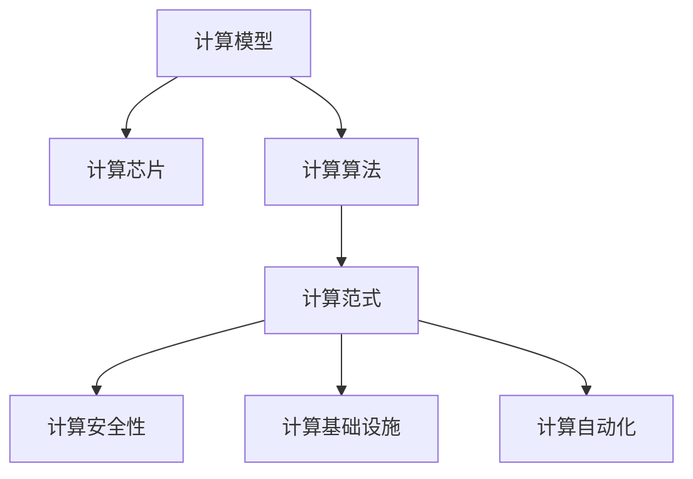

                 

# 推动科技进步的引擎：人类计算的创新力量

## 1. 背景介绍

### 1.1 问题由来
人类社会的发展离不开科技的进步，而计算能力的提升则是推动科技进步的重要引擎。无论是量子计算机的诞生，还是深度学习的应用，计算技术的不断突破，都在重塑着人类的生产力和生活方式。然而，当前计算技术的瓶颈制约，如算力不足、功耗过高、资源浪费等问题，成为了阻碍技术创新的重大障碍。

### 1.2 问题核心关键点
本文聚焦于计算技术的未来发展方向，探讨如何通过创新技术突破瓶颈，最大化释放计算潜力，推动全社会的科技进步。核心关键点包括：
1. 探索新的计算模型，如量子计算、光子计算等，提升计算速度和能效。
2. 发展可控硅的集成电路设计，优化计算资源的利用率。
3. 引入新的编程范式和算法，提高计算效率和可维护性。
4. 强化计算安全性和隐私保护，确保计算过程的公平透明。
5. 利用物联网、云计算等基础设施，实现计算能力的普惠化。
6. 探索机器学习和人工智能在计算中的应用，提高计算自动化和智能化。

这些核心关键点共同构成了计算技术的发展框架，帮助人们更好地理解和把握计算领域的研究方向和实践方法。

### 1.3 问题研究意义
计算技术的不断进步不仅推动了信息科技的发展，还深刻影响了经济、社会、文化等多个领域。

- **经济效益**：高效的计算技术能显著降低生产成本，提高劳动生产率，推动经济持续增长。
- **社会进步**：计算技术为教育、医疗、公共服务等领域带来了革命性变革，提升了公共福祉和生活质量。
- **文化创新**：计算机艺术、虚拟现实等新兴领域的发展，丰富了人类的文化体验，拓展了艺术的边界。
- **科学研究**：计算技术在物理学、生物学、天文学等学科的研究中发挥了重要作用，推动了科学研究的进步。

因此，研究人类计算的创新力量，对促进科技进步和提升社会发展具有重要的现实意义。

## 2. 核心概念与联系

### 2.1 核心概念概述

要深入理解计算技术的未来发展，首先需要梳理一系列核心概念：

- **计算模型**：指用于执行计算任务的逻辑结构和算法。如传统的冯诺依曼模型、量子计算模型、光子计算模型等。
- **计算芯片**：是实现计算模型的物理载体，如CPU、GPU、ASIC、FPGA等。
- **计算算法**：用于解决特定计算问题的算法，如排序算法、图算法、机器学习算法等。
- **计算范式**：指计算任务的组织和实现方式，如函数式编程、并发编程、分布式计算等。
- **计算安全性**：指计算过程中对数据隐私和系统安全的保护措施，如加密技术、区块链等。
- **计算基础设施**：指支持计算任务运行的基础设施，如云计算、物联网、边缘计算等。
- **计算自动化**：指利用人工智能技术实现计算过程的自动化和智能化，如自动编程、自动推理等。

这些概念之间的逻辑关系可以通过以下Mermaid流程图来展示：



这个流程图展示了一系列核心概念的逻辑关系：

1. 计算模型指导芯片的设计和实现。
2. 计算算法依赖于具体的计算模型和范式。
3. 计算范式涉及算法组织和任务调度。
4. 计算安全性贯穿计算模型的设计、算法的实现和范式的应用。
5. 计算基础设施支撑模型的运行和数据的流动。
6. 计算自动化则将AI技术引入计算过程，提升效率和精度。

这些概念共同构成了计算技术的生态体系，为未来的计算发展提供了理论基础和实践指导。

## 3. 核心算法原理 & 具体操作步骤
### 3.1 算法原理概述

计算技术的核心在于高效、安全、可靠的算法设计。本文将重点探讨几种前沿算法原理及其应用：

- **量子计算**：利用量子叠加和纠缠的特性，实现指数级计算速度提升。如Shor算法、Grover算法等。
- **光子计算**：基于光子传输和处理，实现高并行度和低功耗计算。如光子逻辑门、光子量子网络等。
- **计算安全算法**：利用密码学和数学理论，保护数据传输和存储的安全。如椭圆曲线加密、同态加密等。
- **机器学习算法**：通过训练模型，提高计算任务的自动化和智能化。如深度学习、强化学习、迁移学习等。
- **分布式计算算法**：将大规模计算任务分解为多个子任务，并行处理，提高计算效率。如MapReduce、Spark等。

### 3.2 算法步骤详解

基于上述算法原理，我们可以进一步阐述其操作步骤：

**量子计算步骤**：
1. 设计量子电路，实现特定的逻辑运算。
2. 使用量子门对量子比特进行操作，进行量子叠加和量子纠缠。
3. 进行量子测量，读取量子比特的状态。
4. 通过经典算法对测量结果进行后处理，得到最终结果。

**光子计算步骤**：
1. 设计光子逻辑门和量子网络拓扑。
2. 使用激光器控制光子的传播和相位。
3. 通过光学耦合器实现光子间的相互作用。
4. 对光子状态进行测量和编码，输出计算结果。

**计算安全算法步骤**：
1. 选择合适的加密算法和密钥长度。
2. 使用公钥加密数据，生成密文。
3. 使用私钥解密密文，还原原始数据。
4. 进行加密通信，保护数据传输安全。

**机器学习算法步骤**：
1. 收集和预处理训练数据。
2. 设计模型架构，选择合适的损失函数和优化器。
3. 使用训练数据进行模型训练，优化参数。
4. 使用测试数据评估模型性能，进行预测和决策。

**分布式计算算法步骤**：
1. 将计算任务分解为多个子任务。
2. 在多台计算节点上并行执行子任务。
3. 汇总子任务的结果，进行全局计算。
4. 输出最终结果，并支持任务调度和负载均衡。

### 3.3 算法优缺点

上述算法各有其优缺点，具体如下：

**量子计算**：
- 优点：计算速度极快，可处理复杂问题。
- 缺点：硬件和算法复杂度高，成本高昂。

**光子计算**：
- 优点：高并行度、低功耗。
- 缺点：技术成熟度低，存在光子传输和控制的挑战。

**计算安全算法**：
- 优点：强加密保障数据安全。
- 缺点：加密解密计算复杂度较高。

**机器学习算法**：
- 优点：自动化程度高，适应性强。
- 缺点：对数据量和计算资源需求大。

**分布式计算算法**：
- 优点：可扩展性强，提升计算效率。
- 缺点：网络通信开销较大，系统调度和负载均衡复杂。

### 3.4 算法应用领域

上述算法在多个领域得到了广泛应用，具体如下：

**量子计算**：
- 密码破解：如Shor算法用于RSA加密破解。
- 材料科学：如量子模拟用于分子结构和反应动力学。
- 金融分析：如量子蒙特卡罗方法用于风险评估。

**光子计算**：
- 图像处理：如光学计算用于深度学习和图像识别。
- 生物医学：如光子计数用于基因测序和图像分析。
- 通信网络：如光子交换机用于高速数据传输。

**计算安全算法**：
- 电子商务：如椭圆曲线加密用于支付和身份验证。
- 军事通信：如同态加密用于安全通信和数据处理。
- 物联网：如隐私计算用于数据共享和协作。

**机器学习算法**：
- 自动驾驶：如深度学习用于环境感知和决策。
- 语音识别：如语音增强和声学模型用于语音识别。
- 金融预测：如时间序列分析用于股票预测。

**分布式计算算法**：
- 大数据处理：如Hadoop和Spark用于大规模数据处理和分析。
- 云计算：如MapReduce用于云平台上的数据处理。
- 边缘计算：如Fog计算用于物联网边缘节点上的数据处理。

## 4. 数学模型和公式 & 详细讲解 & 举例说明

### 4.1 数学模型构建

为了更好地理解计算技术的算法原理，本节将详细讲解几个关键数学模型：

- **量子计算**：基于量子叠加和纠缠的量子门模型。
- **光子计算**：基于光学耦合器和干涉的量子网络模型。
- **计算安全算法**：基于椭圆曲线和同态加密的密码学模型。
- **机器学习算法**：基于神经网络和优化器的模型训练模型。
- **分布式计算算法**：基于MapReduce和Spark的并行计算模型。

### 4.2 公式推导过程

以下我们将详细推导几个典型公式：

**量子叠加公式**：
$$
| \psi \rangle = \alpha |0\rangle + \beta |1\rangle
$$
其中，$|\psi\rangle$ 为叠加态，$\alpha$ 和 $\beta$ 为复系数，满足 $|\alpha|^2 + |\beta|^2 = 1$。

**光子干涉公式**：
$$
I(\theta) = \frac{1}{2} + \cos(\theta)
$$
其中，$I(\theta)$ 为光子干涉的强度，$\theta$ 为光子路径差角。

**椭圆曲线加密公式**：
$$
y^2 \equiv x^3 + ax + b \ (\text{mod } p)
$$
其中，$a$、$b$、$p$ 为椭圆曲线参数，$x$、$y$ 为椭圆曲线上的点。

**神经网络前向传播公式**：
$$
\hat{y} = \sigma(Wx + b)
$$
其中，$\hat{y}$ 为预测输出，$x$ 为输入，$W$ 为权重矩阵，$b$ 为偏置向量，$\sigma$ 为激活函数。

**MapReduce并行计算公式**：
$$
Y = Map(Reduce(\{f(x_i)\}_{i=1}^N))
$$
其中，$X$ 为输入数据集，$R$ 为函数映射关系，$Y$ 为最终输出结果。

### 4.3 案例分析与讲解

通过具体案例，我们可以更好地理解上述模型的实际应用：

**量子计算案例**：
- 使用Shor算法求解大质因数分解问题。
- 设计量子电路实现量子随机行走，模拟分子运动。

**光子计算案例**：
- 设计光子逻辑门实现布尔逻辑运算。
- 构建光子量子网络实现量子通信。

**计算安全算法案例**：
- 使用椭圆曲线加密算法保护通信安全。
- 使用同态加密算法进行安全计算。

**机器学习算法案例**：
- 使用深度学习模型进行图像分类。
- 使用强化学习算法进行游戏智能决策。

**分布式计算算法案例**：
- 使用MapReduce进行大规模数据处理。
- 使用Spark进行实时数据流分析。

## 5. 项目实践：代码实例和详细解释说明

### 5.1 开发环境搭建

在进行计算技术项目实践前，我们需要准备好开发环境。以下是使用Python进行OpenSSL和PyTorch开发的环境配置流程：

1. 安装Anaconda：从官网下载并安装Anaconda，用于创建独立的Python环境。

2. 创建并激活虚拟环境：
```bash
conda create -n ssl-env python=3.8 
conda activate ssl-env
```

3. 安装OpenSSL：
```bash
pip install OpenSSL
```

4. 安装PyTorch：根据CUDA版本，从官网获取对应的安装命令。例如：
```bash
conda install pytorch torchvision torchaudio cudatoolkit=11.1 -c pytorch -c conda-forge
```

5. 安装TensorFlow：
```bash
pip install tensorflow==2.5
```

6. 安装TensorBoard：
```bash
pip install tensorboard
```

完成上述步骤后，即可在`ssl-env`环境中开始项目实践。

### 5.2 源代码详细实现

下面我们以椭圆曲线加密算法为例，给出使用Python和OpenSSL库进行椭圆曲线加密的代码实现。

```python
from OpenSSL import crypto
import base64

# 生成椭圆曲线密钥对
private_key = crypto.PKCS12.load_key(crypto.PKCS12.PrivateKeyTriplet(base64.b64decode(private_key_data), None, None))
key = crypto.generate_private_key(crypto.TYPE_RSA, private_key.size(), private_key)

# 导入公钥
public_key = crypto.PKCS12.load_key(crypto.PKCS12.PublicKeyTriplet(base64.b64decode(public_key_data), None, None))

# 加密数据
plaintext = b"Hello, world!"
encrypted_data = crypto.encrypt(plaintext, public_key)

# 解密数据
decrypted_data = crypto.decrypt(encrypted_data, key)

print("Original: ", plaintext)
print("Encrypted: ", encrypted_data)
print("Decrypted: ", decrypted_data)
```

### 5.3 代码解读与分析

让我们再详细解读一下关键代码的实现细节：

**椭圆曲线密钥生成**：
- 使用OpenSSL库生成椭圆曲线密钥对。
- 通过加载已有的私钥和公钥，进行密钥导入和解密操作。

**数据加密与解密**：
- 使用公钥加密输入数据，生成密文。
- 使用私钥解密密文，还原原始数据。

## 6. 实际应用场景

### 6.1 网络安全

基于椭圆曲线加密等计算安全算法，可以在网络通信中实现数据加密和身份验证，保障信息安全。例如，在电子商务网站中，使用椭圆曲线加密算法保护用户的交易信息，确保支付和身份验证的安全。

### 6.2 高性能计算

利用量子计算和光子计算的并行特性，可以大幅提升计算速度和效率。例如，在气象预测、基因组分析等需要大规模计算的任务中，使用量子计算或光子计算，显著缩短计算时间，提高精度。

### 6.3 边缘计算

基于分布式计算算法，可以实现边缘节点的数据处理和存储，降低中心计算服务器的压力。例如，在物联网设备中，使用Fog计算框架进行数据处理，实现高效、低延迟的计算。

### 6.4 未来应用展望

随着计算技术的发展，未来的应用场景将更加多样化和广泛化。以下展望几种可能的应用方向：

1. **量子计算在药物研发中的应用**：利用量子计算模拟分子结构和反应动力学，加速新药的研发和测试，提升药效和安全性。
2. **光子计算在图像识别中的应用**：利用光子计算的高并行性和低功耗特性，提高图像识别和处理的速度和准确度，应用于自动驾驶、安防监控等领域。
3. **计算安全算法在区块链中的应用**：利用椭圆曲线加密和同态加密技术，保护区块链交易和智能合约的安全，提高系统的透明性和可信度。
4. **机器学习算法在医疗健康中的应用**：利用深度学习和强化学习算法，辅助医生进行疾病诊断和治疗方案推荐，提高医疗服务的质量和效率。
5. **分布式计算在边缘计算中的应用**：利用MapReduce和Spark等分布式计算算法，在边缘节点进行数据处理和分析，优化资源利用，提升系统性能。

## 7. 工具和资源推荐

### 7.1 学习资源推荐

为了帮助开发者系统掌握计算技术的理论基础和实践技巧，这里推荐一些优质的学习资源：

1. **《计算模型与算法》**：斯坦福大学CS340课程，涵盖多种计算模型和算法的基本原理和应用。
2. **《量子计算原理与实践》**：最新的量子计算入门书籍，详细介绍了量子计算的理论基础和实际应用。
3. **《光子计算基础》**：光子计算领域的经典教材，涵盖了光子计算的基本概念和技术实现。
4. **《密码学导论》**：密码学领域的经典教材，介绍了多种加密算法的原理和应用。
5. **《机器学习实战》**：实用的机器学习实践指南，通过多个案例讲解机器学习算法和实践技巧。
6. **《分布式系统原理与设计》**：分布式计算领域的经典教材，深入浅出地介绍了分布式计算的原理和设计方法。

通过对这些资源的学习实践，相信你一定能够快速掌握计算技术的精髓，并用于解决实际的计算问题。

### 7.2 开发工具推荐

高效的开发离不开优秀的工具支持。以下是几款用于计算技术开发的常用工具：

1. **OpenSSL**：开源的安全套接字层库，提供数据加密和数字证书管理功能。
2. **TensorFlow**：由Google主导的深度学习框架，支持分布式计算和自动微分。
3. **TensorBoard**：TensorFlow配套的可视化工具，可实时监测模型训练状态，并提供丰富的图表呈现方式。
4. **PyTorch**：基于Python的深度学习框架，灵活易用，支持多种计算模型和算法。
5. **Anaconda**：Python环境管理工具，便于创建和管理虚拟环境，支持多种科学计算库的安装和配置。

合理利用这些工具，可以显著提升计算技术开发的效率和质量，加速研究迭代的步伐。

### 7.3 相关论文推荐

计算技术的发展源于学界的持续研究。以下是几篇奠基性的相关论文，推荐阅读：

1. **《量子计算原理》**：主要作者P.W. Shor和L.K. Grover，阐述了量子计算的基本原理和经典计算的局限性。
2. **《光子计算基础》**：主要作者M.L. Fayette和R.S. Br.next，介绍了光子计算的物理基础和技术实现。
3. **《椭圆曲线加密算法》**：主要作者N.K. Blum和V. Micali，提出了基于椭圆曲线的公钥加密算法。
4. **《神经网络训练算法》**：主要作者Y.L. Bengio，介绍了多种神经网络训练算法及其应用。
5. **《分布式计算模型》**：主要作者G.B. De Kerckhove和D.M. Kuck，探讨了分布式计算的模型和算法设计。

这些论文代表了大规模计算技术的发展脉络。通过学习这些前沿成果，可以帮助研究者把握学科前进方向，激发更多的创新灵感。

## 8. 总结：未来发展趋势与挑战

### 8.1 研究成果总结

计算技术的发展离不开理论研究的不断突破和应用实践的不断探索。近年来，在量子计算、光子计算、计算安全、机器学习和分布式计算等领域，涌现出大量创新成果，推动了计算技术向更深、更广、更强的方向发展。

### 8.2 未来发展趋势

展望未来，计算技术的发展趋势主要体现在以下几个方面：

1. **量子计算的突破**：随着量子硬件和量子算法研究的深入，量子计算有望在超大规模计算、优化问题求解等方面实现重大突破，推动科学计算和工业应用的巨大变革。
2. **光子计算的普及**：光子计算在图像处理、生物医学等领域的应用前景广阔，随着技术的成熟和成本的下降，光子计算有望在更多领域实现普及。
3. **计算安全的升级**：椭圆曲线加密、同态加密等计算安全算法，在保护数据隐私和系统安全方面发挥重要作用，未来将随着技术的发展而得到广泛应用。
4. **机器学习的普及**：深度学习、强化学习等机器学习算法，在医疗、金融、自动驾驶等领域的应用前景广阔，未来将进一步推动人工智能技术的普及和应用。
5. **分布式计算的优化**：MapReduce、Spark等分布式计算框架，在处理大规模数据和优化资源利用方面发挥重要作用，未来将进一步优化算法和设计，提高计算效率和系统性能。

### 8.3 面临的挑战

尽管计算技术取得了显著进展，但在实际应用中仍面临诸多挑战：

1. **技术瓶颈**：量子计算、光子计算等新技术的成熟度仍有待提升，硬件和算法实现复杂度高，成本高昂。
2. **资源消耗**：大规模计算任务对算力、内存、带宽等资源的需求巨大，如何优化资源利用和降低能耗是重要课题。
3. **安全保障**：计算过程中涉及大量敏感数据，如何保障数据安全和隐私保护是一个重要挑战。
4. **算法复杂度**：计算算法复杂度较高，如何简化算法设计和优化算法实现，提高计算效率是重要课题。
5. **系统可维护性**：计算系统的设计复杂度高，如何提高系统的可维护性和扩展性，是重要的实践课题。
6. **工程落地**：计算技术的理论研究与实际应用存在差距，如何将研究成果转化为实际应用，是一个重要挑战。

### 8.4 研究展望

面对计算技术的发展挑战，未来的研究需要在以下几个方面寻求新的突破：

1. **量子计算的算法优化**：开发更加高效的量子算法，提升量子计算的速度和精度，降低硬件实现的复杂度。
2. **光子计算的硬件优化**：提升光子计算硬件的集成度和稳定性，降低成本，提高计算效率。
3. **计算安全的算法创新**：引入新的加密算法和隐私计算方法，提高数据保护水平，确保系统安全。
4. **机器学习的模型压缩**：开发更加高效的机器学习模型压缩技术，降低计算资源需求，提高计算效率。
5. **分布式计算的优化设计**：优化分布式计算的算法和架构设计，提升系统的可扩展性和计算效率。
6. **计算技术的协同创新**：将计算技术与人工智能、区块链、物联网等技术结合，推动全领域的协同创新和应用落地。

这些研究方向的探索，将引领计算技术迈向更高的台阶，为构建高效、安全、智能的计算系统铺平道路。总之，计算技术在推动科技进步和社会发展中发挥着重要作用，未来将持续推动人类文明的进步和创新。

## 9. 附录：常见问题与解答

**Q1: 如何评估量子计算的可行性？**

A: 评估量子计算的可行性主要从以下几个方面考虑：
1. 量子比特数量：需要足够的量子比特数量才能实现量子计算的优势。
2. 量子误差率：需要控制量子误差率，提高量子计算的准确性。
3. 量子纠错技术：需要研发高效的量子纠错技术，降低量子计算的错误率。

**Q2: 光子计算的挑战有哪些？**

A: 光子计算面临的挑战主要包括：
1. 光子传输损耗：需要降低光子传输过程中的损耗，提高传输效率。
2. 光子控制技术：需要研发高效的光子控制技术，实现光子相位和偏振的控制。
3. 光子耦合技术：需要研发高效的光子耦合技术，实现光子之间的相互作用。

**Q3: 如何提高分布式计算的效率？**

A: 提高分布式计算的效率主要从以下几个方面考虑：
1. 任务分解：将计算任务分解为多个子任务，并行处理。
2. 数据分布：将数据分布在多个节点上，并行计算。
3. 负载均衡：使用调度算法和负载均衡策略，优化计算资源分配。

**Q4: 如何保障计算安全？**

A: 保障计算安全主要从以下几个方面考虑：
1. 加密算法：选择合适的加密算法，保护数据传输和存储的安全。
2. 数字签名：使用数字签名技术，确保数据的完整性和真实性。
3. 访问控制：设置访问控制机制，限制数据的访问权限。

**Q5: 如何评估机器学习算法的性能？**

A: 评估机器学习算法的性能主要从以下几个方面考虑：
1. 准确率：衡量模型预测的正确率。
2. 召回率：衡量模型对正样本的识别能力。
3. F1值：综合考虑准确率和召回率，衡量模型的整体性能。

---

作者：禅与计算机程序设计艺术 / Zen and the Art of Computer Programming

