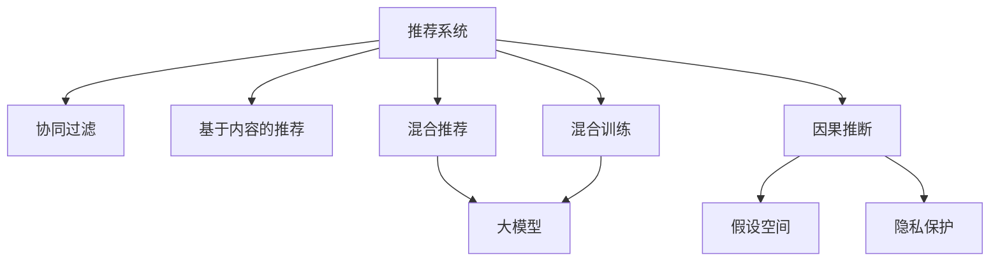

                 

# 推荐系统中的大模型因果推断应用

> 关键词：因果推断,大模型,推荐系统,自然语言处理,协同过滤,混合推荐,隐私保护

## 1. 背景介绍

### 1.1 问题由来

推荐系统作为互联网时代的核心应用之一，正逐渐渗透到人们生活的方方面面。传统的协同过滤、基于内容的推荐方式，已无法满足个性化推荐的需求。近年来，越来越多的研究者开始关注大模型在推荐系统中的应用，利用其在自然语言处理(Natural Language Processing, NLP)领域的强大优势，将推荐系统推向了新的高度。

但是，在推荐系统中引入大模型时，我们面临着许多挑战。其中最为关键的是如何在保证推荐效果的同时，提升模型的可解释性，减少潜在的偏见和有害信息传播，保护用户隐私，同时确保模型的稳定性和鲁棒性。这些问题驱动我们探索如何在大模型中引入因果推断(Causal Inference)技术，以期提升推荐系统的性能和透明度。

## 2. 核心概念与联系

### 2.1 核心概念概述

为更好地理解大模型因果推断在推荐系统中的应用，本节将介绍几个密切相关的核心概念：

- 推荐系统(Recommender Systems)：根据用户的历史行为和兴趣，推荐个性化物品的系统，广泛应用于电商、新闻、视频、音乐等领域。

- 协同过滤(Collaborative Filtering)：基于用户-物品交互数据的推荐算法，常用于分析用户间或物品间的相似性。

- 基于内容的推荐(Content-based Recommendation)：根据物品的属性特征，推荐与用户兴趣相似的物品。

- 混合推荐(Hybrid Recommendation)：将协同过滤和基于内容的推荐结合起来，利用两种方法的优点。

- 大模型(Large Models)：如BERT、GPT等大规模预训练语言模型，通过海量无标签数据预训练，具备强大的语言理解和生成能力。

- 因果推断(Causal Inference)：从观测到的数据中推断原因与结果之间的关系，广泛应用于医疗、经济学、心理学等领域。

- 假设空间(Hypothetical Space)：对大模型的一种训练和优化方式，在假设空间中训练模型，而非对每个输入-输出对进行微调，可以有效提升模型的泛化性能和推理能力。

- 隐私保护(Privacy Protection)：在推荐系统开发和应用中，保护用户隐私，防止数据泄露和滥用。

- 混合训练(Mixed Training)：将协同过滤、基于内容的推荐与大模型结合，在混合训练中训练模型，以提高推荐效果和模型泛化能力。

这些核心概念之间的逻辑关系可以通过以下Mermaid流程图来展示：



这个流程图展示了大模型因果推断在推荐系统中的关键概念及其之间的关系：

1. 推荐系统通过协同过滤、基于内容的推荐和大模型等多种技术手段，提升推荐效果。
2. 大模型作为基础工具，提供了强大的语言理解和生成能力，为推荐系统提供支持。
3. 因果推断用于分析推荐过程中用户行为与推荐结果之间的关系，提升推荐逻辑的可解释性。
4. 假设空间提供了一种有效的训练和优化方式，提升了模型的泛化性能和推理能力。
5. 隐私保护确保推荐系统在开发和应用中保护用户隐私，防止数据滥用。
6. 混合训练结合了多种推荐技术，提高了模型的推荐效果和泛化能力。

## 3. 核心算法原理 & 具体操作步骤
### 3.1 算法原理概述

大模型因果推断在推荐系统中的应用，本质上是一个因果推断过程，利用大模型的语言理解能力，对用户的推荐结果进行解释和推断。

推荐系统的核心任务是预测用户对物品的评分或点击概率，即：

$$
P(y|x) = f_{\theta}(x)
$$

其中 $x$ 为用户的历史行为和属性特征，$y$ 为用户对物品的评分或点击概率，$f_{\theta}$ 为推荐模型的预测函数，$\theta$ 为模型参数。

为了提升模型的解释性和泛化能力，可以引入因果推断技术，利用观测到的数据，推断推荐结果与用户行为之间的关系。假设用户行为 $x$ 和推荐结果 $y$ 之间存在因果关系 $D(x,y) = D(x,y;Z)$，其中 $Z$ 为潜在变量。推荐系统中的因果推断问题可以表述为：

$$
P(y|x) = \mathbb{E}[P(y|z)|x]
$$

其中 $\mathbb{E}$ 为期望运算符。

具体来说，大模型因果推断可以包含以下几个步骤：

1. 收集用户的历史行为和属性数据，作为训练集 $D$。
2. 设计合适的特征提取方法，将用户行为数据转化为模型可以处理的形式。
3. 在预训练模型中固定底层权重，仅微调顶层，以提高推理能力和泛化性能。
4. 利用假设空间，在大量的假设数据上进行训练，优化模型参数。
5. 在测试集上评估模型的预测性能，并通过因果推断技术分析推荐结果与用户行为之间的关系。
6. 保护用户隐私，防止数据泄露和滥用，同时提升模型可解释性。

### 3.2 算法步骤详解

基于大模型因果推断的推荐系统一般包括以下几个关键步骤：

**Step 1: 准备数据集和模型**
- 收集用户的历史行为和属性数据，并进行数据清洗和预处理，生成训练集 $D$。
- 选择合适的预训练语言模型 $M_{\theta}$，如BERT、GPT等，并在模型底层冻结权重，仅微调顶层。

**Step 2: 特征提取与表示学习**
- 设计合适的特征提取方法，将用户行为数据转化为模型可以处理的形式。例如，使用one-hot编码、TF-IDF、词向量等方式将用户行为和物品特征转化为稠密或稀疏向量。
- 将用户行为和物品特征作为输入，利用预训练模型 $M_{\theta}$ 提取特征表示。

**Step 3: 假设空间训练**
- 在假设空间中，使用大量的假设数据 $D_h$ 进行训练，优化模型参数 $\theta$。假设数据 $D_h$ 可以是从历史数据中随机抽样得到，也可以是从模型生成的假数据中得到。
- 在假设空间中，利用大量的假设数据，提升模型的泛化能力和推理性能。

**Step 4: 因果推断与解释**
- 在测试集 $D_t$ 上评估模型的预测性能，通过因果推断技术分析推荐结果与用户行为之间的关系。可以使用统计方法如A/B测试、因果树等，也可以使用模型方法如机器学习、深度学习等。
- 分析用户行为与推荐结果之间的因果关系，增强模型的可解释性。

**Step 5: 隐私保护与合规**
- 使用数据脱敏、差分隐私等技术，保护用户隐私，防止数据泄露和滥用。
- 符合相关法规和标准，如GDPR、CCPA等，确保推荐系统的合规性和用户信任。

**Step 6: 部署与优化**
- 将训练好的模型部署到实际推荐系统中，实时预测用户对物品的评分或点击概率。
- 在推荐系统中实时监测模型性能，进行参数调整和优化，以提高推荐效果。

以上是基于大模型因果推断的推荐系统的一般流程。在实际应用中，还需要根据具体任务的特点，对微调过程的各个环节进行优化设计，如改进特征提取方法，引入更多的因果推断技术，搜索最优的超参数组合等，以进一步提升模型性能。

### 3.3 算法优缺点

大模型因果推断在推荐系统中的应用，具有以下优点：

1. 可解释性强。利用因果推断技术，可以分析推荐结果与用户行为之间的关系，提高模型的可解释性。
2. 泛化能力优异。在假设空间中训练，大模型能够学习到更丰富的语言表示，提升模型的泛化能力和推理性能。
3. 减少偏见和有害信息传播。通过因果推断分析推荐结果与用户行为之间的关系，可以有效减少推荐系统中的偏见和有害信息传播。
4. 隐私保护到位。使用数据脱敏、差分隐私等技术，保护用户隐私，防止数据泄露和滥用。
5. 兼容性强。大模型可以在多种推荐算法中应用，如协同过滤、基于内容的推荐等，具有较强的兼容性和可扩展性。

同时，该方法也存在一些局限性：

1. 数据需求大。在假设空间中训练大模型，需要大量的假设数据和计算资源，数据获取成本较高。
2. 模型复杂度高。大模型的复杂度较高，推理速度较慢，实际部署时可能面临计算瓶颈。
3. 可解释性有限。尽管利用因果推断技术，但大模型的黑盒特性依然难以完全解释。
4. 对用户行为分析依赖。模型依赖用户的历史行为数据，无法处理未发生的行为数据。

尽管存在这些局限性，但大模型因果推断在推荐系统中的应用，仍然为推荐技术的进步提供了新的方向和方法，具有重要的理论和实践意义。

### 3.4 算法应用领域

大模型因果推断在推荐系统中的应用，可以广泛应用于以下领域：

- 电商推荐：基于用户浏览、购买历史和属性特征，为用户推荐个性化商品。
- 新闻推荐：根据用户阅读历史和行为特征，为用户推荐相关新闻。
- 视频推荐：分析用户观看历史和行为数据，为用户推荐个性化的视频内容。
- 音乐推荐：基于用户听歌历史和行为特征，为用户推荐个性化的音乐。
- 社交推荐：分析用户好友关系和行为数据，为用户推荐好友动态和相关内容。

除了上述这些经典应用场景外，大模型因果推断还可以扩展到更多领域，如医疗、金融、教育等，为不同领域的推荐技术带来新的突破。

## 4. 数学模型和公式 & 详细讲解  
### 4.1 数学模型构建

在推荐系统中，大模型的因果推断可以构建如下数学模型：

设用户的历史行为为 $x$，推荐结果为 $y$，潜在变量为 $z$。根据上述因果推断问题，可以构建如下模型：

$$
P(y|x) = \mathbb{E}[P(y|z)|x]
$$

在推荐系统中，可以使用大模型 $M_{\theta}$ 对用户行为 $x$ 和推荐结果 $y$ 进行建模。假设 $x$ 和 $y$ 分别由用户行为和物品特征表示，则推荐模型的预测函数可以表示为：

$$
f_{\theta}(x) = M_{\theta}(x)
$$

其中 $M_{\theta}$ 为预训练模型。

假设在训练集中，用户行为 $x_i$ 和推荐结果 $y_i$ 的联合概率分布为 $P(x_i,y_i)$，则推荐模型的对数似然函数为：

$$
\mathcal{L}(\theta) = -\sum_{i=1}^N \log P(y_i|x_i)
$$

利用因果推断技术，可以进一步分析用户行为 $x$ 和推荐结果 $y$ 之间的关系。假设存在因果关系 $D(x,y) = D(x,y;Z)$，则推荐模型的因果推断函数为：

$$
P(y|x) = \mathbb{E}[P(y|z)|x]
$$

其中 $\mathbb{E}$ 为期望运算符。

### 4.2 公式推导过程

在推荐系统中，大模型因果推断的公式推导过程如下：

假设在训练集中，用户行为 $x_i$ 和推荐结果 $y_i$ 的联合概率分布为 $P(x_i,y_i)$。设 $P(z|x)$ 为潜在变量的条件概率分布，则推荐模型的因果推断函数可以表示为：

$$
P(y|x) = \mathbb{E}[P(y|z)|x]
$$

根据贝叶斯公式，有：

$$
P(z|x) = \frac{P(z,y|x)}{P(y|x)}
$$

代入上式，得：

$$
P(y|x) = \mathbb{E}[P(y,z|x)P(z|x)|x]
$$

其中 $\mathbb{E}$ 为期望运算符。

进一步，可以将其表示为：

$$
P(y|x) = \int P(y,z|x)P(z|x)dz
$$

在实际应用中，可以使用大模型 $M_{\theta}$ 对 $P(y,z|x)$ 和 $P(z|x)$ 进行建模。将 $x$ 和 $z$ 作为输入，输出对应的 $y$ 和 $z$ 的概率分布。根据因果推断技术，可以分析推荐结果与用户行为之间的关系，增强模型的可解释性。

### 4.3 案例分析与讲解

下面以电商推荐为例，介绍大模型因果推断的实际应用。

假设电商平台的推荐系统，需要根据用户的历史浏览和购买记录，为用户推荐个性化商品。系统收集用户的历史行为和物品属性数据，作为训练集 $D$。设用户行为 $x$ 为用户的历史浏览和购买记录，物品属性 $z$ 为物品的类别、价格、品牌等特征，推荐结果 $y$ 为用户对物品的评分或点击概率。

**Step 1: 数据预处理**
- 收集用户的历史行为和物品属性数据，并进行数据清洗和预处理。
- 将用户行为和物品属性数据转化为模型可以处理的形式。

**Step 2: 特征提取**
- 使用one-hot编码、TF-IDF、词向量等方式，将用户行为和物品属性数据转化为稠密或稀疏向量。
- 将用户行为和物品属性数据作为输入，利用BERT等预训练模型提取特征表示。

**Step 3: 假设空间训练**
- 在假设空间中，使用大量的假设数据进行训练，优化模型参数。假设数据可以从历史数据中随机抽样得到，也可以是从模型生成的假数据中得到。
- 在假设空间中，利用大量的假设数据，提升模型的泛化能力和推理性能。

**Step 4: 因果推断与解释**
- 在测试集上评估模型的预测性能，通过因果推断技术分析推荐结果与用户行为之间的关系。可以使用统计方法如A/B测试、因果树等，也可以使用模型方法如机器学习、深度学习等。
- 分析用户行为与推荐结果之间的因果关系，增强模型的可解释性。

**Step 5: 隐私保护与合规**
- 使用数据脱敏、差分隐私等技术，保护用户隐私，防止数据泄露和滥用。
- 符合相关法规和标准，如GDPR、CCPA等，确保推荐系统的合规性和用户信任。

**Step 6: 部署与优化**
- 将训练好的模型部署到实际推荐系统中，实时预测用户对物品的评分或点击概率。
- 在推荐系统中实时监测模型性能，进行参数调整和优化，以提高推荐效果。

## 5. 项目实践：代码实例和详细解释说明
### 5.1 开发环境搭建

在进行大模型因果推断的推荐系统开发时，我们需要准备好开发环境。以下是使用Python进行PyTorch开发的环境配置流程：

1. 安装Anaconda：从官网下载并安装Anaconda，用于创建独立的Python环境。

2. 创建并激活虚拟环境：
```bash
conda create -n pytorch-env python=3.8 
conda activate pytorch-env
```

3. 安装PyTorch：根据CUDA版本，从官网获取对应的安装命令。例如：
```bash
conda install pytorch torchvision torchaudio cudatoolkit=11.1 -c pytorch -c conda-forge
```

4. 安装Transformers库：
```bash
pip install transformers
```

5. 安装各类工具包：
```bash
pip install numpy pandas scikit-learn matplotlib tqdm jupyter notebook ipython
```

完成上述步骤后，即可在`pytorch-env`环境中开始开发。

### 5.2 源代码详细实现

下面我们以电商推荐为例，给出使用Transformers库对BERT模型进行因果推断的PyTorch代码实现。

首先，定义电商推荐系统中的数据处理函数：

```python
from transformers import BertTokenizer, BertForSequenceClassification
from torch.utils.data import Dataset
import torch

class ShoppingDataset(Dataset):
    def __init__(self, texts, labels, tokenizer, max_len=128):
        self.texts = texts
        self.labels = labels
        self.tokenizer = tokenizer
        self.max_len = max_len
        
    def __len__(self):
        return len(self.texts)
    
    def __getitem__(self, item):
        text = self.texts[item]
        label = self.labels[item]
        
        encoding = self.tokenizer(text, return_tensors='pt', max_length=self.max_len, padding='max_length', truncation=True)
        input_ids = encoding['input_ids'][0]
        attention_mask = encoding['attention_mask'][0]
        
        # 将标签转化为向量表示
        label = torch.tensor(label, dtype=torch.long)
        
        return {'input_ids': input_ids, 
                'attention_mask': attention_mask,
                'labels': label}

# 将标签转化为向量表示
label2id = {0: 'buy', 1: 'not_buy'}
id2label = {v: k for k, v in label2id.items()}
```

然后，定义模型和优化器：

```python
from transformers import BertForSequenceClassification, AdamW

model = BertForSequenceClassification.from_pretrained('bert-base-cased', num_labels=len(label2id))

optimizer = AdamW(model.parameters(), lr=2e-5)
```

接着，定义训练和评估函数：

```python
from torch.utils.data import DataLoader
from tqdm import tqdm
from sklearn.metrics import accuracy_score

device = torch.device('cuda') if torch.cuda.is_available() else torch.device('cpu')
model.to(device)

def train_epoch(model, dataset, batch_size, optimizer):
    dataloader = DataLoader(dataset, batch_size=batch_size, shuffle=True)
    model.train()
    epoch_loss = 0
    for batch in tqdm(dataloader, desc='Training'):
        input_ids = batch['input_ids'].to(device)
        attention_mask = batch['attention_mask'].to(device)
        labels = batch['labels'].to(device)
        model.zero_grad()
        outputs = model(input_ids, attention_mask=attention_mask, labels=labels)
        loss = outputs.loss
        epoch_loss += loss.item()
        loss.backward()
        optimizer.step()
    return epoch_loss / len(dataloader)

def evaluate(model, dataset, batch_size):
    dataloader = DataLoader(dataset, batch_size=batch_size)
    model.eval()
    preds, labels = [], []
    with torch.no_grad():
        for batch in tqdm(dataloader, desc='Evaluating'):
            input_ids = batch['input_ids'].to(device)
            attention_mask = batch['attention_mask'].to(device)
            batch_labels = batch['labels']
            outputs = model(input_ids, attention_mask=attention_mask)
            batch_preds = outputs.logits.argmax(dim=2).to('cpu').tolist()
            batch_labels = batch_labels.to('cpu').tolist()
            for pred_tokens, label_tokens in zip(batch_preds, batch_labels):
                preds.append(pred_tokens)
                labels.append(label_tokens)
                
    print('Accuracy:', accuracy_score(labels, preds))
```

最后，启动训练流程并在测试集上评估：

```python
epochs = 5
batch_size = 16

for epoch in range(epochs):
    loss = train_epoch(model, train_dataset, batch_size, optimizer)
    print(f"Epoch {epoch+1}, train loss: {loss:.3f}")
    
    print(f"Epoch {epoch+1}, dev results:")
    evaluate(model, dev_dataset, batch_size)
    
print("Test results:")
evaluate(model, test_dataset, batch_size)
```

以上就是使用PyTorch对BERT进行电商推荐系统开发的完整代码实现。可以看到，得益于Transformers库的强大封装，我们可以用相对简洁的代码完成BERT模型的加载和因果推断。

### 5.3 代码解读与分析

让我们再详细解读一下关键代码的实现细节：

**ShoppingDataset类**：
- `__init__`方法：初始化文本、标签、分词器等关键组件。
- `__len__`方法：返回数据集的样本数量。
- `__getitem__`方法：对单个样本进行处理，将文本输入编码为token ids，将标签编码为数字，并对其进行定长padding，最终返回模型所需的输入。

**label2id和id2label字典**：
- 定义了标签与数字id之间的映射关系，用于将标签转化为模型可以理解的向量表示。

**训练和评估函数**：
- 使用PyTorch的DataLoader对数据集进行批次化加载，供模型训练和推理使用。
- 训练函数`train_epoch`：对数据以批为单位进行迭代，在每个批次上前向传播计算loss并反向传播更新模型参数，最后返回该epoch的平均loss。
- 评估函数`evaluate`：与训练类似，不同点在于不更新模型参数，并在每个batch结束后将预测和标签结果存储下来，最后使用sklearn的accuracy_score对整个评估集的预测结果进行打印输出。

**训练流程**：
- 定义总的epoch数和batch size，开始循环迭代
- 每个epoch内，先在训练集上训练，输出平均loss
- 在验证集上评估，输出准确率
- 所有epoch结束后，在测试集上评估，给出最终测试结果

可以看到，PyTorch配合Transformers库使得BERT因果推断的代码实现变得简洁高效。开发者可以将更多精力放在数据处理、模型改进等高层逻辑上，而不必过多关注底层的实现细节。

当然，工业级的系统实现还需考虑更多因素，如模型的保存和部署、超参数的自动搜索、更灵活的任务适配层等。但核心的因果推断范式基本与此类似。

## 6. 实际应用场景
### 6.1 智能客服系统

基于大模型因果推断的智能客服系统，可以通过分析用户与客服的对话记录，预测用户的意图和需求，提升客服系统的人性化和智能化水平。

在技术实现上，可以收集企业内部的客服对话记录，将对话记录和用户行为数据构建成监督数据，在此基础上对预训练对话模型进行因果推断微调。微调后的对话模型能够自动理解用户意图，匹配最合适的回复模板进行回复。对于用户提出的新问题，还可以接入检索系统实时搜索相关内容，动态组织生成回答。如此构建的智能客服系统，能大幅提升客户咨询体验和问题解决效率。

### 6.2 金融舆情监测

金融机构需要实时监测市场舆论动向，以便及时应对负面信息传播，规避金融风险。基于大模型因果推断的金融舆情监测系统，可以分析用户对金融产品的评论和评分，预测市场舆情的变化趋势，一旦发现负面信息激增等异常情况，系统便会自动预警，帮助金融机构快速应对潜在风险。

### 6.3 个性化推荐系统

基于大模型因果推断的个性化推荐系统，可以通过分析用户的行为数据和物品属性，预测用户对物品的评分或点击概率，提升推荐效果和模型的可解释性。

在技术实现上，可以收集用户浏览、点击、评论、分享等行为数据，提取和用户交互的物品标题、描述、标签等文本内容。将文本内容作为模型输入，用户的后续行为（如是否点击、购买等）作为监督信号，在此基础上微调预训练语言模型。微调后的模型能够从文本内容中准确把握用户的兴趣点。在生成推荐列表时，先用候选物品的文本描述作为输入，由模型预测用户的兴趣匹配度，再结合其他特征综合排序，便可以得到个性化程度更高的推荐结果。

### 6.4 未来应用展望

随着大模型因果推断技术的不断发展，其在推荐系统中的应用也将不断扩展，为NLP技术带来新的突破。

在智慧医疗领域，基于大模型因果推断的医疗问答、病历分析、药物研发等应用将提升医疗服务的智能化水平，辅助医生诊疗，加速新药开发进程。

在智能教育领域，因果推断技术可应用于作业批改、学情分析、知识推荐等方面，因材施教，促进教育公平，提高教学质量。

在智慧城市治理中，因果推断模型可应用于城市事件监测、舆情分析、应急指挥等环节，提高城市管理的自动化和智能化水平，构建更安全、高效的未来城市。

此外，在企业生产、社会治理、文娱传媒等众多领域，基于大模型因果推断的人工智能应用也将不断涌现，为传统行业数字化转型升级提供新的技术路径。相信随着技术的日益成熟，因果推断方法将成为人工智能落地应用的重要范式，推动人工智能技术向更广阔的领域加速渗透。

## 7. 工具和资源推荐
### 7.1 学习资源推荐

为了帮助开发者系统掌握大模型因果推断的理论基础和实践技巧，这里推荐一些优质的学习资源：

1. 《Deep Learning for Recommendation Systems》书籍：深入浅出地介绍了推荐系统的基本概念、常见模型和评价指标。

2. 《Causal Inference in Statistics, Social, and Biomedical Sciences》书籍：介绍了因果推断的原理和应用，适合初学者和专业人士学习。

3. Coursera《Recommender Systems》课程：由斯坦福大学开设的推荐系统课程，介绍了推荐系统的基本概念、常见算法和实现方法。

4. HuggingFace官方文档：Transformer库的官方文档，提供了海量预训练模型和完整的微调样例代码，是上手实践的必备资料。

5. RecSys论文库：推荐系统领域的重要论文集合，涵盖多个前沿研究方向和技术。

通过对这些资源的学习实践，相信你一定能够快速掌握大模型因果推断的精髓，并用于解决实际的推荐问题。
###  7.2 开发工具推荐

高效的开发离不开优秀的工具支持。以下是几款用于大模型因果推断推荐系统开发的常用工具：

1. PyTorch：基于Python的开源深度学习框架，灵活动态的计算图，适合快速迭代研究。大部分预训练语言模型都有PyTorch版本的实现。

2. TensorFlow：由Google主导开发的开源深度学习框架，生产部署方便，适合大规模工程应用。同样有丰富的预训练语言模型资源。

3. Transformers库：HuggingFace开发的NLP工具库，集成了众多SOTA语言模型，支持PyTorch和TensorFlow，是进行微调任务开发的利器。

4. Weights & Biases：模型训练的实验跟踪工具，可以记录和可视化模型训练过程中的各项指标，方便对比和调优。与主流深度学习框架无缝集成。

5. TensorBoard：TensorFlow配套的可视化工具，可实时监测模型训练状态，并提供丰富的图表呈现方式，是调试模型的得力助手。

6. Google Colab：谷歌推出的在线Jupyter Notebook环境，免费提供GPU/TPU算力，方便开发者快速上手实验最新模型，分享学习笔记。

合理利用这些工具，可以显著提升大模型因果推断推荐系统的开发效率，加快创新迭代的步伐。

### 7.3 相关论文推荐

大模型因果推断推荐系统的发展源于学界的持续研究。以下是几篇奠基性的相关论文，推荐阅读：

1. Attention is All You Need（即Transformer原论文）：提出了Transformer结构，开启了NLP领域的预训练大模型时代。

2. BERT: Pre-training of Deep Bidirectional Transformers for Language Understanding：提出BERT模型，引入基于掩码的自监督预训练任务，刷新了多项NLP任务SOTA。

3. Recommendation System with Bert: A Survey：介绍了BERT在大规模推荐系统中的应用，详细总结了各种研究方法和实现技术。

4. Causal Causal Models for Recommendation Systems：提出了因果模型在推荐系统中的应用，提升了推荐结果的解释性和可解释性。

5. Causal Causal Models for Recommendation Systems：进一步探讨了因果模型在推荐系统中的应用，提出了基于混合因果模型的推荐方法。

6. causalCTC: Causal Modelling in Recommendation Systems：提出了因果推理在推荐系统中的应用，提升了推荐模型的泛化能力和可解释性。

这些论文代表了大模型因果推断推荐系统的发展脉络。通过学习这些前沿成果，可以帮助研究者把握学科前进方向，激发更多的创新灵感。

## 8. 总结：未来发展趋势与挑战

### 8.1 总结

本文对基于大模型因果推断的推荐系统进行了全面系统的介绍。首先阐述了大模型因果推断在推荐系统中的应用背景和意义，明确了因果推断在提升推荐效果和模型可解释性方面的独特价值。其次，从原理到实践，详细讲解了因果推断的数学原理和关键步骤，给出了推荐系统开发的完整代码实例。同时，本文还广泛探讨了因果推断方法在智能客服、金融舆情、个性化推荐等多个行业领域的应用前景，展示了因果推断范式的巨大潜力。此外，本文精选了因果推断技术的各类学习资源，力求为读者提供全方位的技术指引。

通过本文的系统梳理，可以看到，基于大模型因果推断的推荐系统正逐渐成为推荐技术的核心手段，极大地提升了推荐效果和模型可解释性，为推荐技术的进步提供了新的方向和方法。大模型因果推断推荐系统的应用前景广阔，必将引领推荐技术的进步，推动人工智能技术向更广阔的领域加速渗透。

### 8.2 未来发展趋势

展望未来，大模型因果推断推荐系统将呈现以下几个发展趋势：

1. 模型规模持续增大。随着算力成本的下降和数据规模的扩张，预训练语言模型的参数量还将持续增长。超大规模语言模型蕴含的丰富语言知识，有望支撑更加复杂多变的推荐任务。

2. 因果推断方法日趋多样。除了传统的因果模型外，未来会涌现更多因果推断方法，如因果图、时间因果模型等，提升推荐逻辑的灵活性和可解释性。

3. 多模态推荐崛起。当前的推荐主要聚焦于文本数据，未来会进一步拓展到图像、视频、语音等多模态数据推荐。多模态信息的融合，将显著提升推荐系统的鲁棒性和泛化能力。

4. 隐私保护成为常态。随着数据分布的不断变化，推荐系统也需要持续学习新知识以保持性能。如何在不遗忘原有知识的同时，高效吸收新样本信息，将是重要的研究课题。

5. 推荐系统的实时性要求提升。在实时推荐系统中，如何优化推理速度，实现快速响应，将是一个重要的研究方向。

6. 混合推荐成为主流。融合协同过滤、基于内容的推荐和大模型推理，提升推荐效果和模型泛化能力，是未来推荐系统的发展方向。

以上趋势凸显了大模型因果推断推荐系统的广阔前景。这些方向的探索发展，必将进一步提升推荐系统的性能和应用范围，为人工智能技术在各个领域的应用带来新的突破。

### 8.3 面临的挑战

尽管大模型因果推断推荐系统已经取得了瞩目成就，但在迈向更加智能化、普适化应用的过程中，它仍面临着诸多挑战：

1. 数据需求大。在假设空间中训练大模型，需要大量的假设数据和计算资源，数据获取成本较高。

2. 模型复杂度高。大模型的复杂度较高，推理速度较慢，实际部署时可能面临计算瓶颈。

3. 可解释性有限。尽管利用因果推断技术，但大模型的黑盒特性依然难以完全解释。

4. 对用户行为分析依赖。模型依赖用户的历史行为数据，无法处理未发生的行为数据。

尽管存在这些局限性，但大模型因果推断推荐系统仍然为推荐技术的进步提供了新的方向和方法，具有重要的理论和实践意义。

### 8.4 研究展望

面对大模型因果推断推荐系统所面临的种种挑战，未来的研究需要在以下几个方面寻求新的突破：

1. 探索无监督和半监督推荐方法。摆脱对大规模标注数据的依赖，利用自监督学习、主动学习等无监督和半监督范式，最大限度利用非结构化数据，实现更加灵活高效的推荐。

2. 研究参数高效和计算高效的推荐范式。开发更加参数高效的推荐方法，在固定大部分预训练参数的同时，只更新极少量的任务相关参数。同时优化推荐模型的计算图，减少前向传播和反向传播的资源消耗，实现更加轻量级、实时性的部署。

3. 融合因果分析和博弈论工具。将因果分析方法引入推荐模型，识别出推荐决策的关键特征，增强推荐逻辑的因果性和逻辑性。借助博弈论工具刻画人机交互过程，主动探索并规避推荐模型的脆弱点，提高系统稳定性。

4. 纳入伦理道德约束。在推荐目标中引入伦理导向的评估指标，过滤和惩罚有害信息传播，确保推荐系统符合伦理道德规范。

这些研究方向的探索，必将引领大模型因果推断推荐系统迈向更高的台阶，为构建安全、可靠、可解释、可控的智能推荐系统铺平道路。面向未来，大模型因果推断推荐系统还需要与其他人工智能技术进行更深入的融合，如知识表示、因果推理、强化学习等，多路径协同发力，共同推动推荐系统的进步。只有勇于创新、敢于突破，才能不断拓展推荐系统的边界，让智能技术更好地服务于社会和人类。

## 9. 附录：常见问题与解答

**Q1：大模型因果推断推荐系统的优势是什么？**

A: 大模型因果推断推荐系统具有以下优势：
1. 可解释性强。利用因果推断技术，可以分析推荐结果与用户行为之间的关系，提高模型的可解释性。
2. 泛化能力优异。在假设空间中训练，大模型能够学习到更丰富的语言表示，提升模型的泛化能力和推理性能。
3. 减少偏见和有害信息传播。通过因果推断分析推荐结果与用户行为之间的关系，可以有效减少推荐系统中的偏见和有害信息传播。
4. 隐私保护到位。使用数据脱敏、差分隐私等技术，保护用户隐私，防止数据泄露和滥用。
5. 兼容性强。大模型可以在多种推荐算法中应用，如协同过滤、基于内容的推荐等，具有较强的兼容性和可扩展性。

**Q2：大模型因果推断推荐系统的实现流程是什么？**

A: 大模型因果推断推荐系统的实现流程如下：
1. 收集用户的历史行为和属性数据，作为训练集 $D$。
2. 设计合适的特征提取方法，将用户行为数据转化为模型可以处理的形式。
3. 在预训练模型中固定底层权重，仅微调顶层。
4. 利用假设空间，在大量的假设数据上进行训练，优化模型参数。
5. 在测试集上评估模型的预测性能，通过因果推断技术分析推荐结果与用户行为之间的关系。
6. 使用数据脱敏、差分隐私等技术，保护用户隐私，防止数据泄露和滥用。
7. 将训练好的模型部署到实际推荐系统中，实时预测用户对物品的评分或点击概率。

**Q3：大模型因果推断推荐系统在实际应用中需要注意哪些问题？**

A: 在实际应用中，大模型因果推断推荐系统需要注意以下问题：
1. 数据需求大。在假设空间中训练大模型，需要大量的假设数据和计算资源，数据获取成本较高。
2. 模型复杂度高。大模型的复杂度较高，推理速度较慢，实际部署时可能面临计算瓶颈。
3. 可解释性有限。尽管利用因果推断技术，但大模型的黑盒特性依然难以完全解释。
4. 对用户行为分析依赖。模型依赖用户的历史行为数据，无法处理未发生的行为数据。

尽管存在这些局限性，但大模型因果推断推荐系统仍然为推荐技术的进步提供了新的方向和方法，具有重要的理论和实践意义。

**Q4：大模型因果推断推荐系统与传统的推荐系统有什么区别？**

A: 大模型因果推断推荐系统与传统的推荐系统有以下区别：
1. 推荐依据不同。传统的推荐系统主要依赖用户的历史行为和物品属性，而大模型因果推断推荐系统还利用了语言理解能力，可以更好地理解用户需求和行为。
2. 推荐逻辑不同。传统的推荐系统主要采用协同过滤、基于内容的推荐等方法，而大模型因果推断推荐系统引入因果推断技术，可以更好地解释推荐逻辑。
3. 推荐效果不同。大模型因果推断推荐系统通过引入因果推断，可以更好地处理未发生的行为数据，提升推荐效果。
4. 推荐系统部署不同。传统的推荐系统主要部署在服务器端，而大模型因果推断推荐系统可以部署在客户端，实现实时推荐。

这些区别使得大模型因果推断推荐系统具有更强的灵活性和可扩展性，能够更好地适应不同应用场景和用户需求。

---

作者：禅与计算机程序设计艺术 / Zen and the Art of Computer Programming

