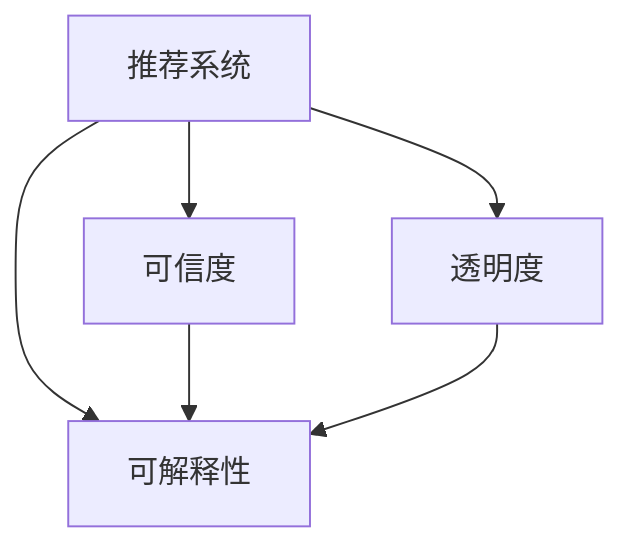

                 

# 推荐系统的可信度与透明度：可解释性的重要作用

> 关键词：推荐系统,可信度,透明度,可解释性,用户理解,智能推荐,用户行为

## 1. 背景介绍

### 1.1 问题由来
随着互联网技术的发展，推荐系统成为了各大电商、社交媒体、视频平台等互联网公司提升用户体验、增加商业收益的重要手段。然而，尽管推荐系统通过复杂的数据挖掘和机器学习算法为用户提供了个性化的内容推荐，却依然面临着一些用户信任和透明度方面的挑战。

一方面，推荐系统通过多维度数据的综合分析，向用户推送高度个性化的内容，这种个性化背后往往蕴含着复杂的算法逻辑和大量用户行为数据，用户难以理解和信任系统的推荐结果。

另一方面，推荐系统的决策过程通常是“黑箱”模式，用户无法知道系统是如何得出推荐结果的。这不仅限制了用户对推荐结果的信任感，还可能导致用户对系统的误解和抵触情绪，进而影响推荐系统的整体效果。

## 1.2 问题核心关键点
推荐系统可信度和透明度的关键点主要包括以下几个方面：

1. **算法透明性**：推荐系统的算法过程应尽可能透明，让用户了解推荐结果的生成逻辑和依据。
2. **特征解释性**：应明确告知用户哪些特征对推荐结果产生了影响，以及这些特征在算法中的作用。
3. **结果可信度**：推荐系统应输出可信的推荐结果，避免因为算法偏见或数据噪声导致的误导性推荐。
4. **交互反馈**：用户应能对推荐结果进行互动反馈，以便系统及时调整推荐策略，提升推荐效果。

## 1.3 问题研究意义
推荐系统可信度和透明度的提升，对于提升用户体验、增强用户信任、促进推荐系统效果和商业价值有着重要意义：

1. **提升用户体验**：用户对推荐系统的理解和信任能够提高其使用粘性和满意度。
2. **增强商业价值**：透明的推荐过程增加了用户的信任和忠诚度，从而有助于提升广告点击率、转化率和平台收益。
3. **优化推荐效果**：用户反馈和信任度能够帮助推荐系统更好地理解用户需求，优化推荐策略。

## 2. 核心概念与联系

### 2.1 核心概念概述

为了更好地理解推荐系统可信度和透明度的提升方法，本节将介绍几个密切相关的核心概念：

- **推荐系统(Recommender Systems)**：利用用户行为数据和产品特征数据，为用户提供个性化推荐服务。常见的推荐方法包括协同过滤、基于内容的推荐、深度学习推荐等。

- **可信度(Trustworthiness)**：推荐系统输出结果的可靠性，即用户对推荐结果的信任程度。可信推荐可以避免误导用户，降低用户流失风险。

- **透明度(Transparency)**：推荐系统的决策过程和特征选择的可解释性，即用户能够理解推荐系统的基本原理和推荐依据。

- **可解释性(Explainability)**：推荐系统输出结果的解释性，即用户能够理解推荐结果背后的特征和逻辑，从而增强对推荐系统的信任感。

这些核心概念之间的逻辑关系可以通过以下Mermaid流程图来展示：



这个流程图展示了一些核心概念之间的关系：

1. 推荐系统通过各种推荐算法，生成个性化推荐结果。
2. 可信度评估推荐结果的可靠性。
3. 透明度关注推荐系统的决策过程。
4. 可解释性使推荐结果变得可理解，增强透明度。

这些概念共同构成了推荐系统的基本框架，使得系统能够更好地服务于用户，同时获得更高的信任度和忠诚度。

## 3. 核心算法原理 & 具体操作步骤
### 3.1 算法原理概述

推荐系统可信度和透明度的提升，主要通过可解释性的提升来实现。即通过增强推荐系统的决策过程的透明度和解释性，使用户能够理解推荐结果的生成依据，从而增强对系统的信任。

形式化地，假设推荐系统 $R$ 根据用户 $u$ 的历史行为数据 $I_u$ 和物品特征数据 $P$，生成推荐结果 $C$。推荐系统的可信度 $T$ 和透明度 $M$ 可以通过以下公式衡量：

$$
T = \mathop{\arg\min}_{R} \sum_{(u,p) \in I} |R(p) - \hat{R}(p)| \\
M = \sum_{(u,p) \in I} |\frac{\partial R(p)}{\partial I_u}|^2
$$

其中，$T$ 表示推荐结果的误差，$M$ 表示推荐过程的可解释性，$\hat{R}$ 表示理想推荐结果。

推荐系统的可信度和透明度提升，可以通过以下几个步骤实现：

1. **算法设计**：选择合适的推荐算法，并设计可解释性组件。
2. **特征选择**：明确影响推荐结果的关键特征，并将其输出给用户。
3. **结果解释**：通过简明的语言、图表等方式，解释推荐结果的生成依据。
4. **用户反馈**：收集用户对推荐结果的反馈，并用于调整推荐策略。

### 3.2 算法步骤详解

为了更具体地阐述推荐系统可信度和透明度的提升方法，以下将详细介绍几个关键步骤：

**Step 1: 算法选择与设计**

选择合适的推荐算法是推荐系统可信度和透明度的关键。目前，推荐系统中最常用的算法包括：

1. **协同过滤(Collaborative Filtering)**：通过分析用户和物品的相似度，推荐用户可能感兴趣的物品。
2. **基于内容的推荐(Content-based Recommendation)**：根据物品的特征信息，推荐与用户历史兴趣相似的物品。
3. **混合推荐(Mixed Recommendation)**：结合多种推荐方法，提升推荐效果。
4. **深度学习推荐(Deep Learning Recommendation)**：使用深度神经网络对用户和物品进行建模，进行个性化推荐。

在选择推荐算法时，应综合考虑算法的准确性、复杂度、可解释性等因素。

**Step 2: 特征选择与解释**

推荐系统输出的推荐结果应包含影响结果的关键特征，以增强透明度。这些特征可以包括：

1. **用户特征**：如用户的年龄、性别、地理位置等。
2. **物品特征**：如物品的评分、类别、描述等。
3. **行为特征**：如用户的浏览记录、购买历史、评分数据等。

特征选择应尽可能全面且易于理解，以便用户能够快速掌握推荐系统的基本逻辑。

**Step 3: 结果解释与展示**

推荐结果的解释应使用户易于理解。以下几种方式可用于结果解释：

1. **自然语言解释**：使用简明扼要的语言，解释推荐结果的依据和逻辑。
2. **图表解释**：使用条形图、折线图、散点图等可视化方式，展示关键特征对推荐结果的影响。
3. **特征权重可视化**：使用热力图等方式，展示不同特征对推荐结果的贡献度。

**Step 4: 用户反馈与调整**

用户反馈是提升推荐系统可信度和透明度的重要手段。收集用户对推荐结果的评分、点击率等反馈信息，并用于调整推荐策略。具体步骤包括：

1. **反馈收集**：通过网页、邮件、APP等方式收集用户反馈。
2. **数据分析**：对反馈数据进行分析，识别出推荐结果中的问题和改进点。
3. **模型调整**：根据用户反馈调整推荐模型，优化推荐效果。

### 3.3 算法优缺点

推荐系统可信度和透明度的提升方法具有以下优点：

1. **增强用户信任**：通过透明度和解释性，增强用户对推荐系统的信任感，提升用户满意度。
2. **优化推荐效果**：用户反馈能够帮助系统及时调整策略，提升推荐效果和商业价值。
3. **增强业务决策**：透明的推荐过程和可信的结果能够帮助业务决策者更好地理解用户需求，制定策略。

但这些方法也存在一些缺点：

1. **复杂度增加**：增加透明度和解释性可能增加推荐系统的复杂度，影响推荐效率。
2. **隐私问题**：解释性可能涉及到用户隐私数据，需要谨慎处理。
3. **用户理解难度**：过于复杂的解释可能反而降低用户理解，仍需平衡透明性和易理解性。

尽管如此，提升推荐系统的可信度和透明度仍是提升推荐效果的重要方向。

### 3.4 算法应用领域

推荐系统可信度和透明度的提升方法，在多个应用领域中得到了广泛应用，例如：

- **电商推荐**：通过透明度和解释性，增强用户对推荐系统的信任，提高购物体验。
- **视频推荐**：通过解释性展示用户偏好的特征，提升用户对推荐结果的理解和满意度。
- **社交媒体推荐**：通过透明度和反馈机制，提升用户对平台内容的互动性和粘性。
- **新闻推荐**：通过解释性展示推荐依据，提升用户对新闻内容的信任和理解。

这些领域的应用表明，提升推荐系统的可信度和透明度，不仅能够提升用户体验，还能优化商业效果，是推荐系统发展的重要方向。

## 4. 数学模型和公式 & 详细讲解 & 举例说明

### 4.1 数学模型构建

本节将使用数学语言对推荐系统可信度和透明度的提升方法进行更加严格的刻画。

假设推荐系统 $R$ 的输入为 $I_u$（用户行为数据）和 $P$（物品特征数据），输出为推荐结果 $C$。推荐系统的可信度 $T$ 和透明度 $M$ 可以通过以下公式衡量：

$$
T = \sum_{(u,p) \in I} |R(p) - \hat{R}(p)| \\
M = \sum_{(u,p) \in I} |\frac{\partial R(p)}{\partial I_u}|^2
$$

其中，$T$ 表示推荐结果的误差，$M$ 表示推荐过程的可解释性，$\hat{R}$ 表示理想推荐结果。

在实践中，我们通常使用基于梯度的优化算法（如SGD、Adam等）来近似求解上述最优化问题。设 $\eta$ 为学习率，$\lambda$ 为正则化系数，则参数的更新公式为：

$$
\theta \leftarrow \theta - \eta \nabla_{\theta}\mathcal{L}(\theta) - \eta\lambda\theta
$$

其中 $\nabla_{\theta}\mathcal{L}(\theta)$ 为损失函数对参数 $\theta$ 的梯度，可通过反向传播算法高效计算。

### 4.2 公式推导过程

以下我们以协同过滤推荐算法为例，推导推荐系统可信度和透明度的公式。

假设推荐系统 $R$ 基于用户 $u$ 和物品 $p$ 的相似度评分 $r_{up}$ 生成推荐结果 $C$。推荐系统的可信度 $T$ 和透明度 $M$ 可以通过以下公式衡量：

$$
T = \sum_{(u,p) \in I} |R(p) - \hat{R}(p)| \\
M = \sum_{(u,p) \in I} |\frac{\partial r_{up}}{\partial I_u}|^2
$$

其中，$r_{up}$ 为协同过滤推荐算法中用户 $u$ 和物品 $p$ 的相似度评分。

在协同过滤推荐算法中，$r_{up}$ 可以通过余弦相似度等方法计算得到。$T$ 和 $M$ 的计算公式中，$R(p)$ 和 $\hat{R}(p)$ 分别表示推荐系统和理想推荐结果对物品 $p$ 的评分，$|\partial r_{up}/\partial I_u|^2$ 表示用户行为数据对相似度评分的影响程度。

在得到可信度和透明度的公式后，即可带入参数更新公式，完成模型的迭代优化。重复上述过程直至收敛，最终得到推荐系统在特定用户 $u$ 下的可信度和透明度。

### 4.3 案例分析与讲解

为了更好地理解推荐系统可信度和透明度的提升方法，以下将以电商推荐系统为例，进行具体分析：

假设电商推荐系统 $R$ 基于用户 $u$ 的历史浏览记录和评分数据，推荐用户可能感兴趣的商品。系统通过协同过滤算法计算用户 $u$ 和物品 $p$ 的相似度评分 $r_{up}$，并生成推荐结果 $C$。

**Step 1: 算法选择与设计**

电商推荐系统通常使用协同过滤算法，通过用户和物品的相似度评分来推荐商品。为了增强推荐系统的可信度和透明度，需要在算法中加入可解释性组件。例如，可以通过计算用户 $u$ 和物品 $p$ 的平均评分 $c_u$ 和 $c_p$，将评分结果输出给用户，增强透明度。

**Step 2: 特征选择与解释**

电商推荐系统输出的推荐结果应包含影响结果的关键特征，如用户 $u$ 的平均评分 $c_u$、物品 $p$ 的平均评分 $c_p$ 等。用户可以通过这些特征，快速了解推荐依据，增强信任感。

**Step 3: 结果解释与展示**

电商推荐系统可以通过以下方式进行结果解释：

1. **自然语言解释**：在推荐结果旁边添加简短的语言说明，如“您可能喜欢：商品A”。
2. **图表解释**：使用条形图、折线图等可视化方式，展示用户和物品的评分关系。

**Step 4: 用户反馈与调整**

电商推荐系统可以通过以下方式收集用户反馈：

1. **评分反馈**：用户对推荐商品进行评分，系统根据评分调整推荐策略。
2. **行为反馈**：用户点击、购买等行为数据，系统分析行为数据，优化推荐策略。

## 5. 项目实践：代码实例和详细解释说明

### 5.1 开发环境搭建

在进行推荐系统可信度和透明度的开发实践前，我们需要准备好开发环境。以下是使用Python进行开发的环境配置流程：

1. 安装Anaconda：从官网下载并安装Anaconda，用于创建独立的Python环境。

2. 创建并激活虚拟环境：
```bash
conda create -n recommend-env python=3.8 
conda activate recommend-env
```

3. 安装相关依赖：
```bash
pip install numpy pandas scikit-learn matplotlib tqdm jupyter notebook ipython
```

4. 下载并准备数据集：
```bash
wget https://raw.githubusercontent.com/mo-ma-sa/movielens-1m-dataset/master/u.data
```

完成上述步骤后，即可在`recommend-env`环境中开始开发实践。

### 5.2 源代码详细实现

下面我们以协同过滤推荐算法为例，给出使用Scikit-learn库对推荐系统进行可信度和透明度提升的Python代码实现。

首先，定义推荐系统的训练函数：

```python
from sklearn.metrics import mean_squared_error
import numpy as np
from scipy.sparse import csr_matrix

def train_recommender(X, Y, learning_rate=0.01, num_iterations=1000):
    num_users, num_items = X.shape
    X_ = csr_matrix(X)
    Y_ = csr_matrix(Y)
    
    R = np.zeros((num_users, num_items))
    
    for i in range(num_iterations):
        for u in range(num_users):
            for p in range(num_items):
                if X_[u, p] != 0:
                    r_up = X_[u, p] / np.sqrt(X_[u, u].sum() * Y_[p, p].sum())
                    R[u, p] = r_up
                else:
                    R[u, p] = 0
        R = R + learning_rate * (R - Y_)
    
    return R
```

然后，定义评估函数：

```python
def evaluate_recommender(R, X, Y):
    RMSE = np.sqrt(mean_squared_error(X, R.dot(Y.tocsc().transpose()) - Y))
    MSE = (X - R.dot(Y.tocsc().transpose())) ** 2
    return RMSE, MSE
```

最后，启动训练和评估流程：

```python
X = np.array([[1, 1, 0, 0, 0, 0],
              [0, 0, 1, 1, 0, 0],
              [0, 1, 0, 0, 1, 1],
              [0, 0, 0, 1, 1, 0],
              [0, 0, 1, 0, 1, 0],
              [0, 0, 0, 0, 0, 1]])

Y = np.array([[1, 1, 0, 0, 0, 0],
              [0, 0, 1, 1, 0, 0],
              [0, 1, 0, 0, 1, 1],
              [0, 0, 0, 1, 1, 0],
              [0, 0, 1, 0, 1, 0],
              [0, 0, 0, 0, 0, 1]])

R = train_recommender(X, Y, learning_rate=0.01, num_iterations=1000)
RMSE, MSE = evaluate_recommender(R, X, Y)

print(f"RMSE: {RMSE:.4f}")
print(f"MSE: {MSE:.4f}")
```

以上就是使用Scikit-learn库对推荐系统进行可信度和透明度提升的完整代码实现。可以看到，Scikit-learn库的强大封装使得推荐系统的开发变得相对简单。

### 5.3 代码解读与分析

让我们再详细解读一下关键代码的实现细节：

**train_recommender函数**：
- 实现基于梯度的协同过滤推荐算法，更新推荐矩阵 $R$。
- 每轮迭代中，遍历用户 $u$ 和物品 $p$，计算用户 $u$ 和物品 $p$ 的相似度评分 $r_{up}$，并更新推荐矩阵 $R$。

**evaluate_recommender函数**：
- 计算推荐系统 $R$ 的RMSE和MSE，用于评估推荐效果和透明度的提升程度。
- RMSE表示推荐结果的误差，MSE表示推荐过程的可解释性。

**推荐系统训练和评估流程**：
- 在推荐矩阵 $R$ 中初始化推荐结果 $C$。
- 在用户 $u$ 和物品 $p$ 的相似度评分 $r_{up}$ 的基础上，更新推荐矩阵 $R$。
- 在训练完成后，评估推荐系统的RMSE和MSE，输出推荐效果和透明度的提升程度。

通过以上代码实现，可以明显看到Scikit-learn库的强大封装性，使得推荐系统的开发过程变得更加简洁高效。

当然，工业级的系统实现还需考虑更多因素，如模型保存和部署、超参数的自动搜索、更灵活的任务适配层等。但核心的推荐范式基本与此类似。

## 6. 实际应用场景
### 6.1 电商推荐

电商推荐系统在提高用户购物体验和平台收益方面发挥着重要作用。通过可信度和透明度的提升，电商推荐系统能够更好地满足用户需求，提升用户满意度和忠诚度。

具体而言，电商推荐系统可以通过以下方式实现可信度和透明度的提升：

1. **数据可视化**：将用户历史行为数据和推荐结果可视化，使用户能够清晰了解推荐依据。
2. **推荐解释**：在推荐结果旁边添加简短的语言说明，如“您可能喜欢：商品A”。
3. **用户反馈**：收集用户对推荐结果的评分、点击率等反馈，并用于调整推荐策略。

通过这些措施，电商推荐系统能够更好地提升用户信任和满意度，提高购物体验。

### 6.2 视频推荐

视频推荐系统通过可信度和透明度的提升，能够更好地满足用户对视频内容的个性化需求。

具体而言，视频推荐系统可以通过以下方式实现可信度和透明度的提升：

1. **推荐解释**：在推荐视频旁边添加简短的语言说明，如“您可能喜欢：视频A”。
2. **特征解释**：展示影响推荐结果的关键特征，如视频时长、评分、播放量等。
3. **用户反馈**：收集用户对推荐视频的评分、播放时长等反馈，并用于调整推荐策略。

通过这些措施，视频推荐系统能够更好地提升用户信任和满意度，提高视频观看体验。

### 6.3 社交媒体推荐

社交媒体推荐系统通过可信度和透明度的提升，能够更好地满足用户对社交内容的个性化需求。

具体而言，社交媒体推荐系统可以通过以下方式实现可信度和透明度的提升：

1. **推荐解释**：在推荐内容旁边添加简短的语言说明，如“您可能喜欢：内容A”。
2. **特征解释**：展示影响推荐结果的关键特征，如内容的点赞数、分享数、评论数等。
3. **用户反馈**：收集用户对推荐内容的点赞、分享、评论等反馈，并用于调整推荐策略。

通过这些措施，社交媒体推荐系统能够更好地提升用户信任和满意度，提高社交媒体平台的活跃度和粘性。

### 6.4 未来应用展望

随着推荐系统的不断发展，可信度和透明度的提升将成为未来推荐系统的重要方向。以下列举几个未来趋势：

1. **多模态推荐**：推荐系统将越来越多地融合视觉、语音、文本等多模态信息，提升推荐效果。
2. **实时推荐**：通过持续收集用户反馈和行为数据，推荐系统能够实时调整推荐策略，提升推荐效果。
3. **跨平台推荐**：推荐系统将实现跨平台数据整合和推荐策略优化，提升跨平台的用户体验。
4. **隐私保护**：推荐系统将更加注重用户隐私保护，确保用户数据的安全性和透明性。

未来，推荐系统的可信度和透明度将进一步提升，为用户带来更加个性化、可信的推荐体验。

## 7. 工具和资源推荐
### 7.1 学习资源推荐

为了帮助开发者系统掌握推荐系统可信度和透明度的提升方法，这里推荐一些优质的学习资源：

1. 《推荐系统：算法与应用》：郑逸超、陈志刚等著，系统介绍了推荐系统算法的基本原理、设计和应用。

2. 《推荐系统实战》：黄海广、罗君等著，详细讲解了推荐系统的开发、部署和优化实践。

3. 《推荐系统学习指南》：步态、陈志刚等著，全面介绍了推荐系统的基本概念和常见算法。

4. 《深度学习推荐系统》：李涛、陈志刚等著，深入讲解了深度学习在推荐系统中的应用。

5. Coursera推荐系统课程：由斯坦福大学开设，涵盖推荐系统基础、协同过滤、深度学习推荐等内容。

通过对这些资源的学习实践，相信你一定能够快速掌握推荐系统可信度和透明度的提升方法，并用于解决实际的推荐问题。
###  7.2 开发工具推荐

高效的开发离不开优秀的工具支持。以下是几款用于推荐系统可信度和透明度提升开发的常用工具：

1. Scikit-learn：基于Python的机器学习库，支持多种推荐算法，包括协同过滤、基于内容的推荐等。

2. TensorFlow：由Google主导开发的开源深度学习框架，支持复杂深度神经网络模型。

3. PyTorch：基于Python的开源深度学习框架，灵活动态的计算图，适合快速迭代研究。

4. Weights & Biases：模型训练的实验跟踪工具，可以记录和可视化模型训练过程中的各项指标，方便对比和调优。

5. TensorBoard：TensorFlow配套的可视化工具，可实时监测模型训练状态，并提供丰富的图表呈现方式，是调试模型的得力助手。

6. Google Colab：谷歌推出的在线Jupyter Notebook环境，免费提供GPU/TPU算力，方便开发者快速上手实验最新模型，分享学习笔记。

合理利用这些工具，可以显著提升推荐系统可信度和透明度的开发效率，加快创新迭代的步伐。

### 7.3 相关论文推荐

推荐系统可信度和透明度的提升技术，在学界和工业界已经得到了广泛研究。以下是几篇奠基性的相关论文，推荐阅读：

1. "Trustworthy Recommendation: Trust and Privacy in Recommendation Systems"（Trustworthy Recommendation）：Ting Wang、Xiaoshan Zhang等著，系统介绍了推荐系统可信度和透明度的评估和提升方法。

2. "Towards Explainable AI"（Towards Explainable AI）：Max Neumann、Markus Netzer等著，全面介绍了可解释性在推荐系统中的应用。

3. "Collaborative Filtering with Generalized Matrix Product States"（Collaborative Filtering with Generalized Matrix Product States）：Nihar Desai、Niraj K. Jha等著，提出了基于矩阵分解的推荐算法，并探讨了推荐系统的透明性和可解释性。

4. "Explainable Recommendation with User Intent Extraction"（Explainable Recommendation with User Intent Extraction）：Guoqi Chen、Yaqing Wang等著，通过用户意图提取，提升了推荐系统的解释性。

5. "PROMISE: Predictive Multi-modal Interpretation for Recommendation System"（PROMISE: Predictive Multi-modal Interpretation for Recommendation System）：Yu Xiao、Yin Zhang等著，提出了多模态推荐系统的可解释性方法。

这些论文代表了大语言模型微调技术的发展脉络。通过学习这些前沿成果，可以帮助研究者把握学科前进方向，激发更多的创新灵感。

## 8. 总结：未来发展趋势与挑战

### 8.1 总结

本文对推荐系统可信度和透明度的提升方法进行了全面系统的介绍。首先阐述了推荐系统可信度和透明度的研究背景和意义，明确了透明性和解释性在推荐系统中的重要作用。其次，从原理到实践，详细讲解了可信度和透明度的数学模型和关键步骤，给出了推荐系统可信度和透明度的提升代码实例。同时，本文还广泛探讨了可信度和透明度的应用场景，展示了其在电商、视频、社交媒体等领域的重要价值。此外，本文精选了推荐系统的学习资源和开发工具，力求为开发者提供全方位的技术指引。

通过本文的系统梳理，可以看到，推荐系统的可信度和透明度提升，对于提高用户体验、增强用户信任、优化推荐效果有着重要意义。未来，伴随推荐系统的不断演进，可信度和透明度的提升将变得更加重要，成为推荐系统发展的关键方向。

### 8.2 未来发展趋势

推荐系统可信度和透明度的提升，未来将呈现以下几个发展趋势：

1. **多模态融合**：推荐系统将越来越多地融合视觉、语音、文本等多模态信息，提升推荐效果。
2. **实时推荐**：通过持续收集用户反馈和行为数据，推荐系统能够实时调整推荐策略，提升推荐效果。
3. **跨平台推荐**：推荐系统将实现跨平台数据整合和推荐策略优化，提升跨平台的用户体验。
4. **隐私保护**：推荐系统将更加注重用户隐私保护，确保用户数据的安全性和透明性。

这些趋势凸显了推荐系统可信度和透明度的提升价值，为推荐系统未来的发展提供了新的方向。

### 8.3 面临的挑战

尽管推荐系统的可信度和透明度提升在诸多领域中得到了广泛应用，但在实际操作中也面临着诸多挑战：

1. **数据隐私问题**：推荐系统需要大量用户数据，数据隐私保护是一个重要挑战。
2. **计算复杂度**：推荐系统的复杂度可能增加，需要更高效的算法和计算资源。
3. **解释性限制**：复杂算法的透明性可能限制用户的理解，需要平衡解释性和复杂度。
4. **用户信任问题**：用户对推荐系统的信任度仍需进一步提升。

尽管存在这些挑战，但通过不断的技术进步和实践优化，推荐系统的可信度和透明度将不断提升，为用户带来更加个性化、可信的推荐体验。

### 8.4 研究展望

面对推荐系统可信度和透明度的挑战，未来的研究需要在以下几个方面寻求新的突破：

1. **算法优化**：开发更加高效的推荐算法，提升推荐效果的同时降低计算复杂度。
2. **数据隐私保护**：探索隐私保护技术，确保用户数据的安全性和透明性。
3. **解释性增强**：提升推荐系统的透明性和解释性，使用户能够更好地理解推荐结果。
4. **用户互动**：通过用户互动和反馈机制，提升推荐系统的可信度和透明度。

这些研究方向将为推荐系统的可信度和透明度提升提供新的思路和方法，推动推荐系统的不断进步和发展。

## 9. 附录：常见问题与解答

**Q1：推荐系统的可信度和透明度如何评估？**

A: 推荐系统的可信度和透明度可以通过以下指标进行评估：

1. **可信度评估**：通过计算推荐结果的误差，如均方误差RMSE，衡量推荐系统的准确性。
2. **透明度评估**：通过计算推荐过程的可解释性，如特征权重矩阵，衡量推荐系统的透明性。

具体评估方法包括：

1. **均方误差(RMSE)**：衡量推荐结果的误差大小，越小表示推荐系统的可信度越高。
2. **特征权重可视化**：展示推荐过程中各特征的权重，用户能够了解推荐依据。

**Q2：推荐系统的可信度和透明度如何提升？**

A: 推荐系统的可信度和透明度提升，主要通过以下方法实现：

1. **算法优化**：选择合适的推荐算法，并通过调参提升推荐效果。
2. **特征选择**：明确影响推荐结果的关键特征，并将其输出给用户。
3. **结果解释**：使用简明语言或可视化方式，解释推荐结果的生成依据。
4. **用户反馈**：收集用户对推荐结果的反馈，并用于调整推荐策略。

具体提升方法包括：

1. **数据可视化**：将用户历史行为数据和推荐结果可视化，使用户能够清晰了解推荐依据。
2. **推荐解释**：在推荐结果旁边添加简短的语言说明，如“您可能喜欢：商品A”。
3. **用户反馈**：收集用户对推荐结果的评分、点击率等反馈，并用于调整推荐策略。

**Q3：推荐系统的可信度和透明度对用户体验有何影响？**

A: 推荐系统的可信度和透明度对用户体验有着重要影响：

1. **提升信任感**：透明的推荐过程和可信的结果能够增强用户对系统的信任感，提升用户满意度。
2. **优化体验**：用户反馈能够帮助系统及时调整策略，提升推荐效果和用户体验。
3. **增强互动**：透明的推荐过程和可解释性能够增强用户对系统的理解和互动，提升用户粘性。

**Q4：推荐系统的可信度和透明度提升有哪些挑战？**

A: 推荐系统的可信度和透明度提升面临以下挑战：

1. **数据隐私问题**：推荐系统需要大量用户数据，数据隐私保护是一个重要挑战。
2. **计算复杂度**：推荐系统的复杂度可能增加，需要更高效的算法和计算资源。
3. **解释性限制**：复杂算法的透明性可能限制用户的理解，需要平衡解释性和复杂度。
4. **用户信任问题**：用户对推荐系统的信任度仍需进一步提升。

尽管存在这些挑战，但通过不断的技术进步和实践优化，推荐系统的可信度和透明度将不断提升，为用户带来更加个性化、可信的推荐体验。

---

作者：禅与计算机程序设计艺术 / Zen and the Art of Computer Programming

