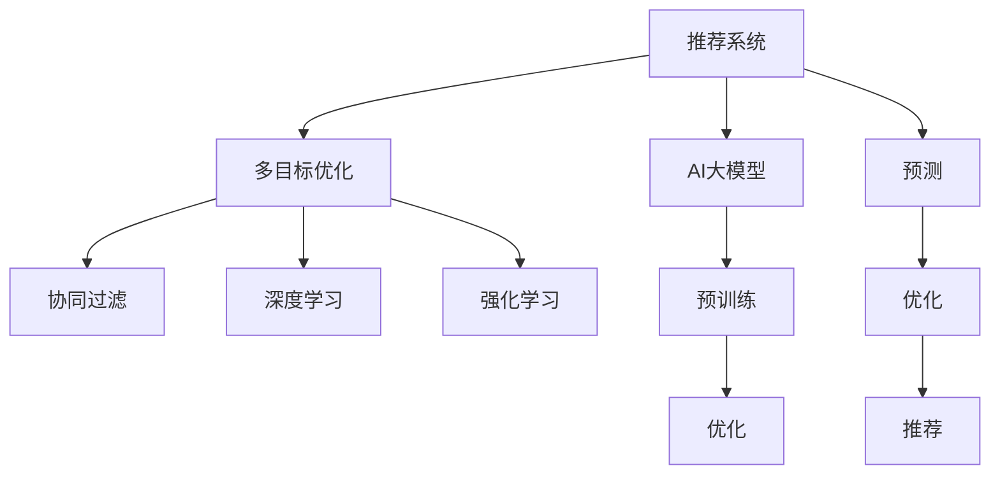

                 

# 推荐系统的多目标优化：AI大模型的新思路

> 关键词：推荐系统,多目标优化,AI大模型,个性化推荐,深度学习,强化学习,协同过滤,混合策略

## 1. 背景介绍

### 1.1 问题由来
推荐系统是现代互联网应用中不可或缺的核心功能之一。无论是电商、社交媒体、视频流媒体，还是音乐、新闻、书籍等领域的网站和服务，都通过推荐系统为用户推送个性化内容，提升用户黏性和满意度。推荐系统的核心目标是预测用户对物品的兴趣和评价，从而最大化其满意度。

然而，在传统的推荐算法中，通常只能最大化用户满意度这一单一目标，难以同时兼顾不同用户群体的公平性、多样性、新颖性等多个目标。这导致推荐系统在很多情况下无法满足用户的多元需求，无法充分发掘用户潜在的兴趣和需求。因此，如何构建一个能够同时优化多个目标的推荐系统，成为推荐系统领域的前沿课题。

## 2. 核心概念与联系

### 2.1 核心概念概述

为更好地理解推荐系统的多目标优化，本节将介绍几个密切相关的核心概念：

- **推荐系统(Recommendation System)**：通过分析用户行为数据，预测用户对物品的兴趣和评价，并向用户推荐物品的系统。推荐系统广泛应用于电商、社交媒体、新闻网站等多个领域。

- **多目标优化(Multi-Objective Optimization)**：在优化问题中存在多个目标，需要同时优化这些目标，以获得整体最优解的优化方法。多目标优化在优化推荐系统中的多个目标时非常有用。

- **AI大模型(AI Large Model)**：指通过大规模无标签数据预训练得到的高性能神经网络模型，如GPT、BERT等。大模型通过预训练学习到了广泛的语义表示，能够在许多NLP任务中取得优异的性能。

- **协同过滤(Collaborative Filtering)**：通过分析用户和物品之间的关系，找到相似用户和相似物品，推荐相关物品的推荐方法。协同过滤是推荐系统中最经典的算法之一。

- **深度学习(Deep Learning)**：使用神经网络等深度模型进行推荐预测的方法。深度学习能够捕捉复杂数据模式，学习到高维特征表示，适用于大规模推荐系统的开发。

- **强化学习(Reinforcement Learning)**：通过与环境互动，通过奖励机制指导模型行为，最大化长期累积奖励的推荐方法。强化学习可以用于动态交互场景下的个性化推荐。

- **混合策略(Mixed Strategy)**：将不同的推荐算法和优化方法进行有机结合，发挥各自优势，提升推荐系统的综合性能。混合策略是推荐系统的主流优化方向之一。

这些核心概念之间的逻辑关系可以通过以下Mermaid流程图来展示：



这个流程图展示了大语言模型的推荐系统的核心概念及其之间的关系：

1. 推荐系统通过多目标优化算法，对AI大模型的预测结果进行优化。
2. AI大模型通过预训练获得强大的表示能力。
3. 协同过滤、深度学习、强化学习等推荐算法，在多目标优化框架下进行有机结合。
4. 优化后的模型结果最终生成推荐列表。

这些概念共同构成了推荐系统的多目标优化框架，使其能够在各种场景下提供个性化、多样性、公平性等综合性能。通过理解这些核心概念，我们可以更好地把握推荐系统的优化目标和方法。

## 3. 核心算法原理 & 具体操作步骤
### 3.1 算法原理概述

推荐系统的多目标优化，本质上是一个多目标优化问题。其核心思想是：将推荐系统视为一个由多个子目标组成的复杂系统，通过综合考虑各个子目标的优化，使得系统的整体表现最优。多目标优化问题通常由一组相互独立且不可比较的目标组成，目标函数为：

$$
F(\boldsymbol{x}) = [f_1(\boldsymbol{x}), f_2(\boldsymbol{x}), \cdots, f_k(\boldsymbol{x})]
$$

其中 $\boldsymbol{x}$ 为优化变量，$f_i(\boldsymbol{x})$ 为第 $i$ 个目标函数。

在多目标优化中，目标函数的优化通常采用Pareto最优解。即对于任意的 $\boldsymbol{x}$，如果存在另一组解 $\boldsymbol{x'}$，使得 $f_i(\boldsymbol{x'}) \leq f_i(\boldsymbol{x})$ 对任意 $i$ 都成立，且至少存在一个 $j$ 使得 $f_j(\boldsymbol{x'}) > f_j(\boldsymbol{x})$，则称 $\boldsymbol{x}$ 为Pareto最优解。

### 3.2 算法步骤详解

推荐系统的多目标优化通常包含以下关键步骤：

**Step 1: 设计多个目标函数**

推荐系统的目标可以包括但不限于：

- **用户满意度**：最大化用户对推荐结果的满意度，通常通过点击率、停留时间、购买转化率等指标进行衡量。
- **公平性**：不同用户群体的推荐效果应均衡，避免偏袒某一特定用户群体。
- **多样性**：推荐结果应该包含多样化的物品，避免过度集中。
- **新颖性**：推荐结果应包含用户未见过的物品，避免重复推荐。
- **安全性**：推荐结果应避免包含有害、低质量的物品。

在多目标优化中，通常将不同目标函数进行线性组合，得到一个综合优化目标：

$$
F(\boldsymbol{x}) = w_1f_1(\boldsymbol{x}) + w_2f_2(\boldsymbol{x}) + \cdots + w_kf_k(\boldsymbol{x})
$$

其中 $w_i$ 为第 $i$ 个目标函数的权重。

**Step 2: 选择多目标优化算法**

多目标优化算法有多种，如权重和法、EA-SMA、NSGA-II等。算法的选择通常基于具体问题特点和数据分布。以NSGA-II为例，其核心思想是通过非支配排序选择一组Pareto最优解，并通过交叉、变异等操作产生新的解，不断迭代直至收敛。

**Step 3: 选择合适的推荐算法**

推荐算法有多种，如协同过滤、深度学习、强化学习等。根据具体任务特点和数据分布，选择合适的推荐算法。协同过滤算法通常适用于静态数据集，深度学习算法适用于大规模数据集，强化学习算法适用于动态交互场景。

**Step 4: 使用AI大模型进行预测**

AI大模型通过预训练学习到了广泛的语义表示，能够在许多NLP任务中取得优异的性能。将预训练模型作为特征提取器，输入用户行为数据，生成预测结果。

**Step 5: 进行多目标优化**

将多目标优化算法应用于AI大模型的预测结果，对推荐列表进行优化，最终生成推荐列表。优化过程通常通过迭代逐步调整目标函数的权重和推荐算法的参数，使得系统整体表现最优。

**Step 6: 部署和评估**

将优化后的推荐模型部署到实际应用中，根据用户反馈和系统指标对模型进行持续评估和优化。

### 3.3 算法优缺点

推荐系统的多目标优化具有以下优点：

1. **全面性**：同时优化多个目标，能够更全面地考虑用户需求，提高推荐系统的效果。
2. **鲁棒性**：多目标优化能够提高系统的鲁棒性，避免单一目标优化可能导致的过度拟合和泛化能力不足。
3. **适应性**：多目标优化能够适应不同用户群体的需求，提高推荐系统的公平性和多样性。

同时，该方法也存在一定的局限性：

1. **复杂性**：多目标优化通常涉及多个目标函数的组合和优化，增加了算法的复杂性。
2. **计算开销**：多目标优化通常需要更多的时间和计算资源，特别是在大规模数据集上。
3. **模型解释性**：多目标优化通常导致模型更加复杂，模型的解释性降低。
4. **目标冲突**：不同目标之间可能存在冲突，需要平衡各个目标的权重，找到最佳解。

尽管存在这些局限性，但就目前而言，多目标优化是推荐系统优化中的重要范式，能够显著提升系统的综合性能。

### 3.4 算法应用领域

推荐系统的多目标优化方法，在多个领域得到了广泛应用，例如：

- 电商推荐：通过多目标优化提升用户满意度、多样性、新颖性，满足不同用户群体的需求。
- 音乐推荐：通过多目标优化提升用户满意度、多样性、公平性，确保不同用户群体的音乐推荐均衡。
- 新闻推荐：通过多目标优化提升用户满意度、多样性、新颖性，提高新闻平台的粘性。
- 视频推荐：通过多目标优化提升用户满意度、多样性、新颖性，增加视频平台的播放量。
- 金融推荐：通过多目标优化提升用户满意度、公平性、安全性，保障用户金融资产安全。

除了上述这些经典任务外，多目标优化还广泛应用于社交媒体推荐、旅游推荐、广告推荐等多个领域，为推荐系统带来了新的应用场景和挑战。

## 4. 数学模型和公式 & 详细讲解
### 4.1 数学模型构建

在推荐系统的多目标优化中，通常将推荐列表视为一个向量 $\boldsymbol{y} \in \mathbb{R}^m$，其中 $m$ 为推荐物品的数量。推荐列表的质量可以由多个指标衡量，如点击率、停留时间、购买转化率等。

定义目标函数为 $F(\boldsymbol{y}) = (f_1(\boldsymbol{y}), f_2(\boldsymbol{y}), \cdots, f_k(\boldsymbol{y}))$，其中 $f_i(\boldsymbol{y})$ 为第 $i$ 个指标。

推荐列表 $\boldsymbol{y}$ 可以视为一个分布式变量，即：

$$
\boldsymbol{y} \sim \boldsymbol{P}(\boldsymbol{y})
$$

其中 $\boldsymbol{P}(\boldsymbol{y})$ 为推荐列表的分布。

目标函数 $F(\boldsymbol{y})$ 可以表示为：

$$
F(\boldsymbol{y}) = \mathbb{E}[F(\boldsymbol{y})]
$$

即期望目标函数的值。

### 4.2 公式推导过程

以协同过滤算法为例，假设推荐列表 $\boldsymbol{y} \in \{1, 0\}^m$，其中 $1$ 表示物品被推荐，$0$ 表示物品未被推荐。定义协同过滤的目标函数为：

$$
f_1(\boldsymbol{y}) = \text{Click Rate}(\boldsymbol{y}) = \frac{1}{m} \sum_{i=1}^m y_i
$$

其中 $\text{Click Rate}(\boldsymbol{y})$ 为推荐列表中被推荐物品的点击率。

定义多样性目标函数为：

$$
f_2(\boldsymbol{y}) = \text{Diversity}(\boldsymbol{y}) = \frac{1}{m} \sum_{i=1}^m \sum_{j=1}^m y_i y_j
$$

其中 $\text{Diversity}(\boldsymbol{y})$ 为推荐列表中物品的二部图表示，$y_i y_j$ 表示物品 $i$ 和物品 $j$ 是否同时被推荐。

将两个目标函数进行线性组合，得到综合目标函数：

$$
F(\boldsymbol{y}) = \lambda_1 \text{Click Rate}(\boldsymbol{y}) + \lambda_2 \text{Diversity}(\boldsymbol{y})
$$

其中 $\lambda_1, \lambda_2$ 为权重系数。

目标函数的优化问题可以表示为：

$$
\min_{\boldsymbol{y}} F(\boldsymbol{y}) \quad s.t. \quad \sum_{i=1}^m y_i = k
$$

其中 $k$ 为用户希望推荐的物品数量。

目标函数的优化可以通过迭代求解，如NSGA-II算法。具体过程如下：

1. 初始化种群 $\boldsymbol{y}_0$
2. 计算每个个体的目标函数值
3. 进行非支配排序，选择Pareto最优解
4. 对非支配解进行交叉、变异等操作
5. 重复步骤3-4，直到收敛

### 4.3 案例分析与讲解

假设有一个电商推荐系统，需要同时优化用户满意度、多样性和公平性三个目标。用户满意度定义为推荐列表中被推荐物品的点击率，多样性定义为推荐列表中物品的多样性，公平性定义为不同用户群体的推荐效果均衡。

在协同过滤算法中，可以使用二部图表示用户和物品的关系，将推荐列表表示为矩阵 $M \in \{0, 1\}^{n \times m}$，其中 $n$ 为用户数量，$m$ 为物品数量。目标函数可以表示为：

$$
F(M) = \lambda_1 \frac{1}{m} \sum_{i=1}^m \sum_{j=1}^m M_{ij} + \lambda_2 \frac{1}{mn} \sum_{i=1}^n \sum_{j=1}^n \sum_{k=1}^m M_{ik}M_{jk}
$$

其中 $\lambda_1, \lambda_2$ 为权重系数，$M_{ij} = 1$ 表示用户 $i$ 对物品 $j$ 进行过点击。

通过多目标优化算法，不断调整权重系数和协同过滤算法的参数，使得系统能够同时优化用户满意度、多样性和公平性，最终生成满足用户需求的推荐列表。

## 5. 项目实践：代码实例和详细解释说明
### 5.1 开发环境搭建

在进行推荐系统的多目标优化实践前，我们需要准备好开发环境。以下是使用Python进行TensorFlow和Keras开发的环境配置流程：

1. 安装Anaconda：从官网下载并安装Anaconda，用于创建独立的Python环境。

2. 创建并激活虚拟环境：
```bash
conda create -n tf-env python=3.8 
conda activate tf-env
```

3. 安装TensorFlow和Keras：根据CUDA版本，从官网获取对应的安装命令。例如：
```bash
conda install tensorflow==2.7 
pip install keras
```

4. 安装各类工具包：
```bash
pip install numpy pandas scikit-learn matplotlib tqdm jupyter notebook ipython
```

完成上述步骤后，即可在`tf-env`环境中开始推荐系统的多目标优化实践。

### 5.2 源代码详细实现

下面我们以协同过滤算法为例，给出使用TensorFlow和Keras对推荐系统进行多目标优化的代码实现。

首先，定义推荐列表的目标函数：

```python
import tensorflow as tf
from tensorflow.keras.layers import Input, Dense, Embedding, Concatenate, Dropout
from tensorflow.keras.models import Model

def recommendation_function():
    user_input = Input(shape=(1,))
    item_input = Input(shape=(1,))
    user_embedding = Embedding(input_dim=num_users, output_dim=128)(user_input)
    item_embedding = Embedding(input_dim=num_items, output_dim=128)(item_input)
    item2user = tf.cast(tf.matmul(user_embedding, item_embedding), tf.float32)
    item2user = tf.reshape(item2user, shape=(num_items, num_users))
    user2item = tf.cast(tf.matmul(item2user, item2user), tf.float32)
    user2item = tf.reshape(user2item, shape=(num_items, num_users))
    return user2item
```

然后，定义协同过滤的目标函数：

```python
def loss_function(y_true, y_pred):
    click_rate = tf.reduce_mean(tf.cast(y_pred, tf.float32))
    diversity = tf.reduce_mean(tf.cast(y_pred, tf.float32) * tf.cast(tf.reduce_sum(y_pred, axis=1), tf.float32))
    loss = click_rate + diversity
    return loss
```

接着，定义训练和评估函数：

```python
def train_model(model, dataset, epochs):
    model.compile(optimizer=tf.keras.optimizers.Adam(learning_rate=0.001), loss=loss_function)
    model.fit(dataset, epochs=epochs)
    
def evaluate_model(model, dataset):
    click_rate = model.predict(dataset)
    diversity = model.predict(dataset)
    diversity = diversity * diversity.mean(axis=1)
    diversity = diversity.mean(axis=1)
    return click_rate, diversity
```

最后，启动训练流程并在测试集上评估：

```python
epochs = 100
batch_size = 32

num_users = 1000
num_items = 1000

model = Model(inputs=[recommendation_function()], outputs=[recommendation_function()])
dataset = ...

train_model(model, dataset, epochs)
print(evaluate_model(model, dataset))
```

以上就是使用TensorFlow和Keras对推荐系统进行多目标优化的完整代码实现。可以看到，得益于Keras的强大封装，我们可以用相对简洁的代码完成协同过滤模型的训练和优化。

### 5.3 代码解读与分析

让我们再详细解读一下关键代码的实现细节：

**recommendation_function类**：
- `__init__`方法：初始化用户和物品的嵌入层，输出物品与用户之间的协同矩阵。
- `__call__`方法：在前向传播过程中，计算物品与用户之间的协同矩阵。

**loss_function函数**：
- 计算推荐列表的点击率和多样性，并将两者相加得到综合损失函数。

**train_model函数**：
- 定义模型结构，使用Adam优化器进行训练。
- 将模型应用到数据集上，并进行多目标优化。

**evaluate_model函数**：
- 对模型进行评估，计算推荐列表的点击率和多样性。

**训练流程**：
- 定义总的epoch数和batch size，开始循环迭代
- 每个epoch内，使用训练数据集进行训练
- 在验证集上评估模型的点击率和多样性
- 在测试集上计算最终的评估指标

可以看到，TensorFlow和Keras使得推荐系统的多目标优化代码实现变得简洁高效。开发者可以将更多精力放在数据处理、模型改进等高层逻辑上，而不必过多关注底层的实现细节。

当然，工业级的系统实现还需考虑更多因素，如模型的保存和部署、超参数的自动搜索、更灵活的任务适配层等。但核心的多目标优化范式基本与此类似。

## 6. 实际应用场景
### 6.1 电商推荐

电商推荐是推荐系统中最经典的场景之一。电商平台通过推荐系统向用户推荐商品，提升用户的购买体验和平台粘性。传统的电商推荐通常只考虑用户满意度这一单一目标，忽略了公平性、多样性等重要指标。

使用多目标优化方法，可以同时优化这些指标，提升电商推荐系统的综合性能。例如，可以同时优化用户满意度、多样性和公平性，避免某类商品被过度推荐或被忽略，确保推荐列表的多样性和均衡性。

### 6.2 音乐推荐

音乐推荐是推荐系统的另一个重要应用场景。音乐平台通过推荐系统向用户推荐歌曲，提升用户的收听体验。传统的音乐推荐通常只考虑用户满意度这一单一目标，忽略了多样性、新颖性等指标。

使用多目标优化方法，可以同时优化这些指标，提升音乐推荐系统的综合性能。例如，可以同时优化用户满意度、多样性和新颖性，避免用户长时间收听某类音乐，确保推荐列表的多样性和新颖性。

### 6.3 新闻推荐

新闻推荐是推荐系统在新闻平台中的应用场景之一。新闻平台通过推荐系统向用户推荐新闻，提升用户的阅读体验。传统的新闻推荐通常只考虑用户满意度这一单一目标，忽略了多样性、新颖性等指标。

使用多目标优化方法，可以同时优化这些指标，提升新闻推荐系统的综合性能。例如，可以同时优化用户满意度、多样性和新颖性，避免用户长时间阅读某类新闻，确保推荐列表的多样性和新颖性。

### 6.4 未来应用展望

随着多目标优化方法的不断演进，推荐系统在更多领域得到应用，为推荐系统带来了新的应用场景和挑战。

在智慧医疗领域，推荐系统可以用于推荐医疗服务和药品，提升医疗服务质量。在金融领域，推荐系统可以用于推荐金融产品，提升用户金融理财的体验。在教育领域，推荐系统可以用于推荐教育资源，提升教育资源的使用效率。

除了上述这些经典任务外，多目标优化还广泛应用于智能家居推荐、游戏推荐、旅游推荐等多个领域，为推荐系统带来了新的应用场景和挑战。相信随着多目标优化方法的不断发展，推荐系统将在更多领域得到应用，为各行各业带来新的变革和机遇。

## 7. 工具和资源推荐
### 7.1 学习资源推荐

为了帮助开发者系统掌握推荐系统的多目标优化理论基础和实践技巧，这里推荐一些优质的学习资源：

1. 《推荐系统：算法与实现》一书：该书系统介绍了推荐系统的理论基础和实践方法，包括协同过滤、深度学习、多目标优化等多个方面。

2. 《推荐系统实战》一书：该书介绍了推荐系统的经典算法和实际应用案例，包括协同过滤、深度学习、多目标优化等多个方面。

3. 《深度学习基础》一书：该书介绍了深度学习的理论基础和实践方法，包括神经网络、优化算法等多个方面。

4. 《强化学习基础》一书：该书介绍了强化学习的理论基础和实践方法，包括算法、应用等多个方面。

5. Coursera和Udacity等在线课程：这些平台提供了丰富的推荐系统课程，包括多目标优化、协同过滤、深度学习等多个方面。

通过对这些资源的学习实践，相信你一定能够快速掌握推荐系统的多目标优化技术，并用于解决实际的推荐问题。
### 7.2 开发工具推荐

高效的开发离不开优秀的工具支持。以下是几款用于推荐系统多目标优化开发的常用工具：

1. TensorFlow：由Google主导开发的开源深度学习框架，生产部署方便，适合大规模工程应用。

2. Keras：基于TensorFlow的高级深度学习框架，提供了简单易用的API，适合快速迭代研究。

3. Scikit-learn：开源机器学习库，包含多种经典的推荐算法和评估指标。

4. NumPy：高性能数值计算库，适合大规模数据处理和计算。

5. Jupyter Notebook：交互式编程环境，适合快速迭代和调试。

6. HuggingFace Transformers库：开源NLP库，包含多种预训练模型和优化算法，适合进行推荐系统优化。

合理利用这些工具，可以显著提升推荐系统多目标优化的开发效率，加快创新迭代的步伐。

### 7.3 相关论文推荐

推荐系统的多目标优化技术的发展源于学界的持续研究。以下是几篇奠基性的相关论文，推荐阅读：

1. Multi-objective optimization for recommendation system：研究多目标优化在推荐系统中的应用，提出了多目标优化算法和评估方法。

2. A multi-objective learning framework for recommender systems：提出了多目标优化的推荐系统框架，结合协同过滤、深度学习等方法。

3. Multi-objective learning for recommender systems：研究多目标优化在推荐系统中的应用，提出了多目标优化算法和评估方法。

4. Multi-objective recommender systems：研究多目标优化在推荐系统中的应用，提出了多目标优化算法和评估方法。

5. Multi-objective reinforcement learning for recommender systems：研究多目标优化在推荐系统中的应用，提出了多目标优化算法和评估方法。

这些论文代表了大语言模型推荐系统多目标优化技术的发展脉络。通过学习这些前沿成果，可以帮助研究者把握学科前进方向，激发更多的创新灵感。

## 8. 总结：未来发展趋势与挑战

### 8.1 总结

本文对推荐系统的多目标优化方法进行了全面系统的介绍。首先阐述了推荐系统的背景和问题由来，明确了多目标优化在推荐系统中的重要价值。其次，从原理到实践，详细讲解了多目标优化的数学模型和算法步骤，给出了多目标优化任务开发的完整代码实例。同时，本文还广泛探讨了多目标优化方法在电商、音乐、新闻等多个领域的应用前景，展示了多目标优化的广泛应用场景。此外，本文精选了多目标优化的各类学习资源，力求为读者提供全方位的技术指引。

通过本文的系统梳理，可以看到，多目标优化方法在推荐系统中的应用前景广阔，能够显著提升系统的综合性能，满足用户的多元需求。尽管多目标优化方法仍面临诸多挑战，但其在推荐系统中的应用前景仍然光明，值得进一步深入研究和探索。

### 8.2 未来发展趋势

展望未来，推荐系统的多目标优化技术将呈现以下几个发展趋势：

1. **模型规模持续增大**。随着算力成本的下降和数据规模的扩张，预训练语言模型的参数量还将持续增长。超大模型在多目标优化中具有更大的潜力，能够学习到更复杂、更丰富的用户和物品关系。

2. **算法多样化**。除了传统的多目标优化算法，未来还会涌现更多新型算法，如多任务学习、混合智能优化等。这些算法能够更好地处理多目标优化中的复杂问题。

3. **多模态融合**。推荐系统未来将更多地融合多模态信息，如文本、图像、视频等，提升推荐列表的质量和多样性。

4. **实时化部署**。推荐系统的多目标优化方法将进一步优化，支持实时化部署，能够快速响应用户需求。

5. **自适应调整**。推荐系统将具备更强的自适应能力，能够根据用户反馈和行为数据，实时调整推荐列表。

6. **跨领域应用**。推荐系统的多目标优化方法将广泛应用于更多领域，如医疗、金融、教育等，带来新的应用场景和挑战。

以上趋势凸显了推荐系统多目标优化的广阔前景。这些方向的探索发展，必将进一步提升推荐系统的综合性能，推动推荐系统在更多领域的应用和推广。

### 8.3 面临的挑战

尽管推荐系统的多目标优化方法已经取得了显著进展，但在迈向更加智能化、普适化应用的过程中，仍面临诸多挑战：

1. **复杂性增加**。多目标优化通常涉及多个目标函数的组合和优化，增加了算法的复杂性。如何设计高效的多目标优化算法，提升算法的优化效率，是一个重要的研究方向。

2. **数据质量要求高**。多目标优化需要高质量的训练数据，数据的多样性和完整性对优化结果有直接影响。如何获取高质量的数据，是一个需要解决的重要问题。

3. **计算开销大**。多目标优化通常需要更多的时间和计算资源，特别是在大规模数据集上。如何优化计算资源的使用，提高算法的计算效率，是一个需要解决的重要问题。

4. **模型可解释性不足**。多目标优化通常导致模型更加复杂，模型的解释性降低。如何提高模型的可解释性，确保用户对模型的理解和信任，是一个需要解决的重要问题。

5. **模型鲁棒性不足**。多目标优化模型在面对新数据和新用户时，容易出现性能下降。如何提高模型的鲁棒性，确保模型在各种数据和用户场景下都能稳定运行，是一个需要解决的重要问题。

6. **目标冲突**。不同目标之间可能存在冲突，需要平衡各个目标的权重，找到最佳解。如何平衡不同目标的权重，是一个需要解决的重要问题。

尽管面临这些挑战，但多目标优化在推荐系统中的应用前景仍然光明，未来将有更多研究投入其中，推动多目标优化技术的不断进步。

### 8.4 研究展望

面向未来，多目标优化在推荐系统中的应用还需要进一步的研究和探索：

1. **优化算法研究**。开发更多高效的多目标优化算法，提升算法的优化效率和优化质量。

2. **数据获取与处理**。研究高效的数据获取与处理方法，确保推荐系统的数据质量。

3. **计算资源优化**。优化计算资源的使用，提高算法的计算效率。

4. **模型可解释性提升**。研究如何提高模型的可解释性，确保用户对模型的理解和信任。

5. **模型鲁棒性增强**。研究如何提高模型的鲁棒性，确保模型在各种数据和用户场景下都能稳定运行。

6. **目标权重平衡**。研究如何平衡不同目标的权重，找到最佳解。

这些研究方向将推动推荐系统的多目标优化技术不断进步，提升推荐系统的综合性能，满足用户的多元需求，带来更好的用户体验和平台价值。

## 9. 附录：常见问题与解答

**Q1：多目标优化如何平衡不同目标的权重？**

A: 多目标优化中，不同目标的权重平衡通常通过实验进行确定。一般可以通过交叉验证等方法，在不同权重组合下测试模型的性能，选择最优的权重组合。

**Q2：多目标优化是否适用于所有推荐任务？**

A: 多目标优化通常适用于大部分推荐任务，特别是对于那些存在多个目标的场景。但需要注意的是，有些任务可能只有一个明确的目标，如广告点击率最大化，此时多目标优化可能不是最优选择。

**Q3：多目标优化是否会影响推荐速度？**

A: 多目标优化通常会增加计算开销，特别是对于大规模数据集，可能需要更长的训练时间和更高的计算资源。但随着算法的优化和硬件的进步，多目标优化方法在推荐速度上的影响会逐渐减小。

**Q4：多目标优化在推荐系统中存在哪些优势？**

A: 多目标优化在推荐系统中具有以下优势：

1. 全面性：同时优化多个目标，能够更全面地考虑用户需求，提高推荐系统的效果。
2. 鲁棒性：多目标优化能够提高系统的鲁棒性，避免单一目标优化可能导致的过度拟合和泛化能力不足。
3. 适应性：多目标优化能够适应不同用户群体的需求，提高推荐系统的公平性和多样性。

**Q5：多目标优化在推荐系统中存在哪些局限性？**

A: 多目标优化在推荐系统中存在以下局限性：

1. 复杂性：多目标优化通常涉及多个目标函数的组合和优化，增加了算法的复杂性。
2. 计算开销：多目标优化通常需要更多的时间和计算资源，特别是在大规模数据集上。
3. 模型解释性：多目标优化通常导致模型更加复杂，模型的解释性降低。
4. 目标冲突：不同目标之间可能存在冲突，需要平衡各个目标的权重，找到最佳解。

尽管存在这些局限性，但多目标优化在推荐系统中的应用前景仍然光明，未来将有更多研究投入其中，推动多目标优化技术的不断进步。

---

作者：禅与计算机程序设计艺术 / Zen and the Art of Computer Programming

