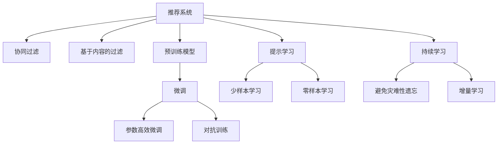

                 

# 推荐系统的统一框架：大模型的解决方案

## 1. 背景介绍

### 1.1 问题由来

推荐系统是人工智能领域的重要应用之一，广泛应用于电子商务、社交媒体、内容分发等领域。传统推荐系统主要基于用户行为数据进行协同过滤、基于内容的过滤等方法，但随着数据量和维度的不断增加，其扩展性和精确性面临着巨大的挑战。因此，探索新的推荐系统架构和方法变得至关重要。

近年来，随着深度学习技术的迅猛发展，基于深度学习的推荐系统逐渐成为主流。其中，基于大模型的推荐系统方法，通过在大规模语料上预训练，然后在特定推荐任务上进行微调，表现出了优异的推荐效果和泛化能力。本文旨在探讨基于大模型的推荐系统，通过深入浅出的语言，系统讲解其原理和实现方法。

### 1.2 问题核心关键点

基于大模型的推荐系统方法主要包括以下几个关键点：

1. **预训练和微调**：通过在大规模无标签数据上进行预训练，学习通用的语言表示，然后在特定的推荐任务上进行微调，优化模型的推荐效果。
2. **大语言模型**：如BERT、GPT、T5等，通过自监督和监督任务训练，具备强大的语言理解和生成能力。
3. **参数高效微调(PEFT)**：在微调过程中，仅更新少量的模型参数，以提高微调效率，避免过拟合。
4. **数据增强**：通过改写、回译等方式，丰富训练集，增强模型的泛化能力。
5. **对抗训练**：引入对抗样本，提高模型的鲁棒性。
6. **提示学习(Prompt Learning)**：通过精心设计输入文本的格式，引导模型按期望方式输出，减少微调参数。
7. **少样本学习(Few-shot Learning)**：在少量标注样本的情况下，模型能够快速适应新任务。
8. **零样本学习(Zero-shot Learning)**：在从未见过的数据上，模型能够根据任务描述执行新任务。
9. **持续学习**：模型能够不断学习新数据，同时保持已学习的知识，避免灾难性遗忘。

这些关键点构成了基于大模型的推荐系统方法的核心，旨在通过预训练和微调，提升推荐系统的性能和泛化能力，同时兼顾模型的效率和可解释性。

## 2. 核心概念与联系

### 2.1 核心概念概述

为了更好地理解基于大模型的推荐系统方法，本节将介绍几个密切相关的核心概念：

- **推荐系统(Recommendation System)**：通过分析用户的历史行为、兴趣和上下文信息，为用户推荐感兴趣的物品或内容。
- **协同过滤(Collaborative Filtering)**：通过用户间相似度的计算，为用户推荐其他用户喜欢的物品。
- **基于内容的过滤(Content-Based Filtering)**：通过分析物品的特征，为用户推荐内容相似的物品。
- **预训练模型(Pre-trained Model)**：在大规模无标签数据上训练的通用模型，具备强大的语言表示能力。
- **微调(Fine-Tuning)**：在预训练模型的基础上，使用特定推荐任务的数据进行有监督学习，优化模型在该任务上的性能。
- **参数高效微调(PEFT)**：在微调过程中，仅更新少量的模型参数，以提高微调效率，避免过拟合。
- **大语言模型(Large Language Model, LLM)**：如BERT、GPT、T5等，通过自监督和监督任务训练，具备强大的语言理解和生成能力。
- **对抗训练(Adversarial Training)**：通过引入对抗样本，提高模型的鲁棒性。
- **提示学习(Prompt Learning)**：通过精心设计输入文本的格式，引导模型按期望方式输出，减少微调参数。
- **少样本学习(Few-shot Learning)**：在少量标注样本的情况下，模型能够快速适应新任务。
- **零样本学习(Zero-shot Learning)**：在从未见过的数据上，模型能够根据任务描述执行新任务。
- **持续学习(Continual Learning)**：模型能够不断学习新数据，同时保持已学习的知识，避免灾难性遗忘。

这些核心概念之间的逻辑关系可以通过以下Mermaid流程图来展示：



这个流程图展示了大模型的推荐系统方法的核心概念及其之间的关系：

1. 推荐系统通过分析用户行为和上下文信息，为用户推荐物品或内容。
2. 协同过滤和基于内容的过滤是传统推荐系统的主要方法。
3. 预训练模型通过在大规模无标签数据上进行训练，学习通用的语言表示。
4. 微调在预训练模型的基础上，使用特定推荐任务的数据进行有监督学习，优化模型在该任务上的性能。
5. 参数高效微调在微调过程中，仅更新少量的模型参数，以提高微调效率。
6. 对抗训练通过引入对抗样本，提高模型的鲁棒性。
7. 提示学习通过精心设计输入文本的格式，引导模型按期望方式输出，减少微调参数。
8. 少样本学习和零样本学习在少量标注样本的情况下，模型能够快速适应新任务。
9. 持续学习模型能够不断学习新数据，同时保持已学习的知识，避免灾难性遗忘。

这些概念共同构成了大模型推荐系统方法的框架，使得推荐系统具备了强大的泛化能力和高效性。通过理解这些核心概念，我们可以更好地把握大模型推荐系统的工作原理和优化方向。

## 3. 核心算法原理 & 具体操作步骤
### 3.1 算法原理概述

基于大模型的推荐系统方法，其核心思想是通过预训练模型学习通用的语言表示，然后在特定推荐任务上进行微调，以优化模型的推荐效果。其算法原理主要包括以下几个步骤：

1. **预训练**：在大规模无标签数据上训练预训练模型，学习通用的语言表示。
2. **微调**：在预训练模型的基础上，使用特定推荐任务的数据进行有监督学习，优化模型在该任务上的性能。
3. **参数高效微调(PEFT)**：在微调过程中，仅更新少量的模型参数，以提高微调效率。
4. **数据增强**：通过改写、回译等方式，丰富训练集，增强模型的泛化能力。
5. **对抗训练**：通过引入对抗样本，提高模型的鲁棒性。
6. **提示学习(Prompt Learning)**：通过精心设计输入文本的格式，引导模型按期望方式输出，减少微调参数。
7. **少样本学习(Few-shot Learning)**：在少量标注样本的情况下，模型能够快速适应新任务。
8. **零样本学习(Zero-shot Learning)**：在从未见过的数据上，模型能够根据任务描述执行新任务。
9. **持续学习(Continual Learning)**：模型能够不断学习新数据，同时保持已学习的知识，避免灾难性遗忘。

### 3.2 算法步骤详解

基于大模型的推荐系统方法一般包括以下关键步骤：

**Step 1: 准备预训练模型和数据集**
- 选择合适的预训练模型，如BERT、GPT等。
- 准备推荐任务的数据集，划分为训练集、验证集和测试集。

**Step 2: 添加任务适配层**
- 根据推荐任务类型，在预训练模型顶层设计合适的输出层和损失函数。
- 对于推荐任务，通常在顶层添加解码器输出概率分布，并以交叉熵损失函数为优化目标。

**Step 3: 设置微调超参数**
- 选择合适的优化算法及其参数，如AdamW、SGD等。
- 设置学习率、批大小、迭代轮数等超参数。
- 应用正则化技术，如L2正则、Dropout、Early Stopping等，防止模型过度适应小规模训练集。

**Step 4: 执行梯度训练**
- 将训练集数据分批次输入模型，前向传播计算损失函数。
- 反向传播计算参数梯度，根据设定的优化算法和学习率更新模型参数。
- 周期性在验证集上评估模型性能，根据性能指标决定是否触发Early Stopping。
- 重复上述步骤直至满足预设的迭代轮数或Early Stopping条件。

**Step 5: 测试和部署**
- 在测试集上评估微调后模型，对比微调前后的推荐精度提升。
- 使用微调后的模型对新样本进行推荐，集成到实际的应用系统中。
- 持续收集新的数据，定期重新微调模型，以适应数据分布的变化。

以上是基于大模型的推荐系统方法的一般流程。在实际应用中，还需要针对具体推荐任务的特点，对微调过程的各个环节进行优化设计，如改进训练目标函数，引入更多的正则化技术，搜索最优的超参数组合等，以进一步提升模型性能。

### 3.3 算法优缺点

基于大模型的推荐系统方法具有以下优点：

1. **简单高效**：使用预训练模型和微调方法，可以显著减少从头开发所需的数据、计算和人力等成本投入。
2. **效果显著**：在学术界和工业界的诸多推荐任务上，基于微调的方法已经刷新了最先进的性能指标。
3. **泛化能力强**：通过在大规模数据上进行预训练，模型具备较强的泛化能力，能够适应不同的推荐任务。
4. **参数高效**：利用参数高效微调技术，在固定大部分预训练参数的情况下，仍可取得不错的提升。
5. **灵活性强**：模型可以通过微调适配不同的推荐场景，满足个性化推荐需求。

但同时，该方法也存在一定的局限性：

1. **数据依赖性强**：微调的效果很大程度上取决于推荐任务的数据质量和数量，获取高质量推荐数据成本较高。
2. **过拟合风险**：当目标任务与预训练数据的分布差异较大时，微调的性能提升有限。
3. **计算资源需求高**：预训练模型和微调过程需要大量的计算资源，可能对算力和存储提出较高要求。
4. **模型复杂度高**：大规模预训练模型和微调后的模型参数量巨大，模型推理速度较慢，可能影响实时性。

尽管存在这些局限性，但就目前而言，基于大模型的推荐系统方法仍然是推荐系统研究的主流范式。未来相关研究的重点在于如何进一步降低微调对推荐数据的需求，提高模型的少样本学习和跨领域迁移能力，同时兼顾可解释性和伦理安全性等因素。

### 3.4 算法应用领域

基于大模型的推荐系统方法在多个领域得到了广泛应用，例如：

- **电子商务推荐**：根据用户历史行为和兴趣，推荐商品或服务。通过微调优化推荐效果，提升用户体验和转化率。
- **内容推荐**：根据用户阅读历史，推荐新闻、文章、视频等内容。通过微调提升内容相关性和吸引力。
- **社交媒体推荐**：根据用户互动行为，推荐朋友、文章、话题等。通过微调优化社交网络的多样性和个性化。
- **个性化推荐系统**：根据用户行为和特征，推荐个性化的商品、音乐、电影等。通过微调提升推荐精度和用户体验。
- **广告推荐系统**：根据用户行为和兴趣，推荐个性化的广告内容。通过微调提升广告投放效果和ROI。

除了上述这些经典任务外，大模型推荐系统方法还被创新性地应用到更多场景中，如基于用户画像的推荐、多模态推荐等，为推荐系统带来了全新的突破。随着预训练模型和微调方法的不断进步，相信推荐系统技术将在更广阔的应用领域大放异彩。

## 4. 数学模型和公式 & 详细讲解  
### 4.1 数学模型构建

本节将使用数学语言对基于大模型的推荐系统方法进行更加严格的刻画。

记预训练推荐模型为 $M_{\theta}:\mathcal{X} \rightarrow \mathcal{Y}$，其中 $\mathcal{X}$ 为输入空间，$\mathcal{Y}$ 为输出空间，$\theta \in \mathbb{R}^d$ 为模型参数。假设推荐任务为 $T$，训练集为 $D=\{(x_i,y_i)\}_{i=1}^N, x_i \in \mathcal{X}, y_i \in \mathcal{Y}$。

定义模型 $M_{\theta}$ 在数据样本 $(x,y)$ 上的损失函数为 $\ell(M_{\theta}(x),y)$，则在数据集 $D$ 上的经验风险为：

$$
\mathcal{L}(\theta) = \frac{1}{N}\sum_{i=1}^N \ell(M_{\theta}(x_i),y_i)
$$

微调的优化目标是最小化经验风险，即找到最优参数：

$$
\theta^* = \mathop{\arg\min}_{\theta} \mathcal{L}(\theta)
$$

在实践中，我们通常使用基于梯度的优化算法（如SGD、Adam等）来近似求解上述最优化问题。设 $\eta$ 为学习率，$\lambda$ 为正则化系数，则参数的更新公式为：

$$
\theta \leftarrow \theta - \eta \nabla_{\theta}\mathcal{L}(\theta) - \eta\lambda\theta
$$

其中 $\nabla_{\theta}\mathcal{L}(\theta)$ 为损失函数对参数 $\theta$ 的梯度，可通过反向传播算法高效计算。

### 4.2 公式推导过程

以下我们以商品推荐为例，推导交叉熵损失函数及其梯度的计算公式。

假设模型 $M_{\theta}$ 在输入 $x$ 上的输出为 $\hat{y}=M_{\theta}(x) \in [0,1]$，表示物品被推荐的概率。真实标签 $y \in \{0,1\}$。则二分类交叉熵损失函数定义为：

$$
\ell(M_{\theta}(x),y) = -[y\log \hat{y} + (1-y)\log (1-\hat{y})]
$$

将其代入经验风险公式，得：

$$
\mathcal{L}(\theta) = -\frac{1}{N}\sum_{i=1}^N [y_i\log M_{\theta}(x_i)+(1-y_i)\log(1-M_{\theta}(x_i))]
$$

根据链式法则，损失函数对参数 $\theta_k$ 的梯度为：

$$
\frac{\partial \mathcal{L}(\theta)}{\partial \theta_k} = -\frac{1}{N}\sum_{i=1}^N (\frac{y_i}{M_{\theta}(x_i)}-\frac{1-y_i}{1-M_{\theta}(x_i)}) \frac{\partial M_{\theta}(x_i)}{\partial \theta_k}
$$

其中 $\frac{\partial M_{\theta}(x_i)}{\partial \theta_k}$ 可进一步递归展开，利用自动微分技术完成计算。

在得到损失函数的梯度后，即可带入参数更新公式，完成模型的迭代优化。重复上述过程直至收敛，最终得到适应推荐任务的最优模型参数 $\theta^*$。

## 5. 项目实践：代码实例和详细解释说明
### 5.1 开发环境搭建

在进行推荐系统微调实践前，我们需要准备好开发环境。以下是使用Python进行PyTorch开发的环境配置流程：

1. 安装Anaconda：从官网下载并安装Anaconda，用于创建独立的Python环境。

2. 创建并激活虚拟环境：
```bash
conda create -n pytorch-env python=3.8 
conda activate pytorch-env
```

3. 安装PyTorch：根据CUDA版本，从官网获取对应的安装命令。例如：
```bash
conda install pytorch torchvision torchaudio cudatoolkit=11.1 -c pytorch -c conda-forge
```

4. 安装Transformers库：
```bash
pip install transformers
```

5. 安装各类工具包：
```bash
pip install numpy pandas scikit-learn matplotlib tqdm jupyter notebook ipython
```

完成上述步骤后，即可在`pytorch-env`环境中开始推荐系统微调实践。

### 5.2 源代码详细实现

这里我们以商品推荐为例，给出使用Transformers库对BERT模型进行推荐系统微调的PyTorch代码实现。

首先，定义推荐任务的数据处理函数：

```python
from transformers import BertTokenizer
from torch.utils.data import Dataset
import torch

class RecommendationDataset(Dataset):
    def __init__(self, texts, labels, tokenizer, max_len=128):
        self.texts = texts
        self.labels = labels
        self.tokenizer = tokenizer
        self.max_len = max_len
        
    def __len__(self):
        return len(self.texts)
    
    def __getitem__(self, item):
        text = self.texts[item]
        label = self.labels[item]
        
        encoding = self.tokenizer(text, return_tensors='pt', max_length=self.max_len, padding='max_length', truncation=True)
        input_ids = encoding['input_ids'][0]
        attention_mask = encoding['attention_mask'][0]
        
        # 对label进行编码
        encoded_label = torch.tensor(label, dtype=torch.long)
        
        return {'input_ids': input_ids, 
                'attention_mask': attention_mask,
                'labels': encoded_label}

# 标签编码
label2id = {'not_recommended': 0, 'recommended': 1}
id2label = {v: k for k, v in label2id.items()}

# 创建dataset
tokenizer = BertTokenizer.from_pretrained('bert-base-cased')

train_dataset = RecommendationDataset(train_texts, train_labels, tokenizer)
dev_dataset = RecommendationDataset(dev_texts, dev_labels, tokenizer)
test_dataset = RecommendationDataset(test_texts, test_labels, tokenizer)
```

然后，定义模型和优化器：

```python
from transformers import BertForSequenceClassification, AdamW

model = BertForSequenceClassification.from_pretrained('bert-base-cased', num_labels=2)

optimizer = AdamW(model.parameters(), lr=2e-5)
```

接着，定义训练和评估函数：

```python
from torch.utils.data import DataLoader
from tqdm import tqdm
from sklearn.metrics import accuracy_score

device = torch.device('cuda') if torch.cuda.is_available() else torch.device('cpu')
model.to(device)

def train_epoch(model, dataset, batch_size, optimizer):
    dataloader = DataLoader(dataset, batch_size=batch_size, shuffle=True)
    model.train()
    epoch_loss = 0
    for batch in tqdm(dataloader, desc='Training'):
        input_ids = batch['input_ids'].to(device)
        attention_mask = batch['attention_mask'].to(device)
        labels = batch['labels'].to(device)
        model.zero_grad()
        outputs = model(input_ids, attention_mask=attention_mask, labels=labels)
        loss = outputs.loss
        epoch_loss += loss.item()
        loss.backward()
        optimizer.step()
    return epoch_loss / len(dataloader)

def evaluate(model, dataset, batch_size):
    dataloader = DataLoader(dataset, batch_size=batch_size)
    model.eval()
    preds, labels = [], []
    with torch.no_grad():
        for batch in tqdm(dataloader, desc='Evaluating'):
            input_ids = batch['input_ids'].to(device)
            attention_mask = batch['attention_mask'].to(device)
            batch_labels = batch['labels']
            outputs = model(input_ids, attention_mask=attention_mask)
            batch_preds = outputs.logits.argmax(dim=2).to('cpu').tolist()
            batch_labels = batch_labels.to('cpu').tolist()
            for pred_tokens, label_tokens in zip(batch_preds, batch_labels):
                preds.append(pred_tokens)
                labels.append(label_tokens)
                
    return accuracy_score(labels, preds)
```

最后，启动训练流程并在测试集上评估：

```python
epochs = 5
batch_size = 16

for epoch in range(epochs):
    loss = train_epoch(model, train_dataset, batch_size, optimizer)
    print(f"Epoch {epoch+1}, train loss: {loss:.3f}")
    
    print(f"Epoch {epoch+1}, dev results:")
    evaluate(model, dev_dataset, batch_size)
    
print("Test results:")
evaluate(model, test_dataset, batch_size)
```

以上就是使用PyTorch对BERT进行推荐系统微调的完整代码实现。可以看到，得益于Transformers库的强大封装，我们可以用相对简洁的代码完成BERT模型的加载和微调。

### 5.3 代码解读与分析

让我们再详细解读一下关键代码的实现细节：

**RecommendationDataset类**：
- `__init__`方法：初始化文本、标签、分词器等关键组件。
- `__len__`方法：返回数据集的样本数量。
- `__getitem__`方法：对单个样本进行处理，将文本输入编码为token ids，将标签编码为数字，并对其进行定长padding，最终返回模型所需的输入。

**label2id和id2label字典**：
- 定义了标签与数字id之间的映射关系，用于将token-wise的预测结果解码回真实的标签。

**训练和评估函数**：
- 使用PyTorch的DataLoader对数据集进行批次化加载，供模型训练和推理使用。
- 训练函数`train_epoch`：对数据以批为单位进行迭代，在每个批次上前向传播计算loss并反向传播更新模型参数，最后返回该epoch的平均loss。
- 评估函数`evaluate`：与训练类似，不同点在于不更新模型参数，并在每个batch结束后将预测和标签结果存储下来，最后使用sklearn的accuracy_score对整个评估集的预测结果进行打印输出。

**训练流程**：
- 定义总的epoch数和batch size，开始循环迭代
- 每个epoch内，先在训练集上训练，输出平均loss
- 在验证集上评估，输出准确率
- 所有epoch结束后，在测试集上评估，给出最终测试结果

可以看到，PyTorch配合Transformers库使得BERT微调的代码实现变得简洁高效。开发者可以将更多精力放在数据处理、模型改进等高层逻辑上，而不必过多关注底层的实现细节。

当然，工业级的系统实现还需考虑更多因素，如模型的保存和部署、超参数的自动搜索、更灵活的任务适配层等。但核心的微调范式基本与此类似。

## 6. 实际应用场景
### 6.1 智能推荐系统

基于大模型的推荐系统方法，可以广泛应用于智能推荐系统的构建。传统的推荐系统往往需要用户提交明确的查询请求，才能得到推荐结果，而智能推荐系统则能主动推荐用户可能感兴趣的内容，提升用户体验和满意度。

在技术实现上，可以收集用户的历史行为数据，如浏览、点击、评分等，构建推荐任务的监督数据。在此基础上对预训练推荐模型进行微调，使其能够根据用户的行为数据进行推荐。微调后的推荐系统能够自动理解用户兴趣，匹配最合适的推荐结果，甚至可以根据上下文信息动态调整推荐策略。

### 6.2 个性化推荐服务

个性化的推荐服务是推荐系统的核心应用之一。通过收集用户的个人信息、兴趣偏好、行为数据等，推荐系统能够为其提供更加精准和个性化的推荐内容，提升用户的满意度和转化率。

在实践中，可以收集用户的行为数据，如浏览历史、点击记录、购买行为等，构建推荐任务的监督数据。在此基础上对预训练推荐模型进行微调，使其能够根据用户的历史行为进行推荐。微调后的推荐系统能够自动学习用户的兴趣模式，预测其未来行为，为其提供更加个性化的推荐内容。

### 6.3 广告投放优化

广告投放优化是推荐系统的另一个重要应用。通过分析用户的兴趣和行为数据，推荐系统能够为其推荐最合适的广告内容，提升广告投放的效果和ROI。

在实践中，可以收集用户的点击、展示、转化等行为数据，构建广告投放任务的监督数据。在此基础上对预训练推荐模型进行微调，使其能够根据用户的兴趣和行为数据进行广告投放。微调后的推荐系统能够自动学习用户的兴趣模式，预测其对不同广告的响应效果，优化广告投放策略。

### 6.4 未来应用展望

随着大模型和微调方法的不断发展，基于大模型的推荐系统方法将在更多领域得到应用，为推荐系统带来新的突破。

在智慧医疗领域，基于推荐系统的个性化医疗服务将能够根据患者的健康数据，为其推荐个性化的医疗方案和产品，提升医疗服务的精准性和效率。

在智能制造领域，基于推荐系统的产品推荐系统将能够根据设备的使用数据，为其推荐最优的维护方案和配件，提升生产设备的运行效率和寿命。

在智慧农业领域，基于推荐系统的精准农业服务将能够根据土壤、气候等环境数据，为其推荐最优的种植方案和肥料，提升农作物的产量和质量。

除了上述这些领域外，基于大模型的推荐系统方法还将被应用到更多场景中，如金融理财、旅游推荐、智能家居等，为各行各业带来新的变革性影响。相信随着技术的日益成熟，推荐系统技术将成为人工智能技术落地应用的重要范式，推动人工智能技术在各领域的广泛应用。

## 7. 工具和资源推荐
### 7.1 学习资源推荐

为了帮助开发者系统掌握基于大模型的推荐系统方法的理论基础和实践技巧，这里推荐一些优质的学习资源：

1. 《深度学习推荐系统》系列博文：由深度学习专家撰写，深入浅出地介绍了推荐系统的理论基础和前沿方法。

2. CS294.01《推荐系统》课程：斯坦福大学开设的推荐系统课程，有Lecture视频和配套作业，带你入门推荐系统的基本概念和经典模型。

3. 《推荐系统实践指南》书籍：推荐系统领域的经典著作，涵盖了推荐系统的理论、算法和实践，适合系统学习。

4. KDD-2019推荐系统论文集：KDD大会上推荐系统领域的最新研究成果，涵盖多种推荐方法的创新和应用。

5. GitHub上的推荐系统开源项目：如TensorFlow推荐系统、PyTorch推荐系统等，提供了丰富的推荐系统实现代码和资源。

通过对这些资源的学习实践，相信你一定能够快速掌握基于大模型的推荐系统方法的精髓，并用于解决实际的推荐问题。
###  7.2 开发工具推荐

高效的开发离不开优秀的工具支持。以下是几款用于基于大模型的推荐系统开发的常用工具：

1. PyTorch：基于Python的开源深度学习框架，灵活动态的计算图，适合快速迭代研究。大部分推荐系统模型都有PyTorch版本的实现。

2. TensorFlow：由Google主导开发的开源深度学习框架，生产部署方便，适合大规模工程应用。同样有丰富的推荐系统模型资源。

3. Transformers库：HuggingFace开发的推荐系统工具库，集成了众多SOTA推荐模型，支持PyTorch和TensorFlow，是进行推荐系统开发的利器。

4. Weights & Biases：模型训练的实验跟踪工具，可以记录和可视化模型训练过程中的各项指标，方便对比和调优。与主流深度学习框架无缝集成。

5. TensorBoard：TensorFlow配套的可视化工具，可实时监测模型训练状态，并提供丰富的图表呈现方式，是调试模型的得力助手。

6. Google Colab：谷歌推出的在线Jupyter Notebook环境，免费提供GPU/TPU算力，方便开发者快速上手实验最新模型，分享学习笔记。

合理利用这些工具，可以显著提升基于大模型的推荐系统开发效率，加快创新迭代的步伐。

### 7.3 相关论文推荐

推荐系统的发展得益于学界的持续研究。以下是几篇奠基性的相关论文，推荐阅读：

1. Recommender Systems Handbook: The Textbook: Recommender Systems Handbook: The Textbook：推荐系统领域的经典书籍，涵盖了推荐系统的基本概念、算法和应用。

2. Matrix Factorization Techniques for Recommender Systems：介绍了基于矩阵分解的推荐系统方法，是推荐系统领域的经典之作。

3. Neural Collaborative Filtering：提出基于神经网络的推荐系统方法，推动了深度学习在推荐系统中的应用。

4. Attention Is All You Need：Transformer原论文，提出Transformer结构，为推荐系统中的序列建模提供了新的思路。

5. BERT: Pre-training of Deep Bidirectional Transformers for Language Understanding：提出BERT模型，引入基于掩码的自监督预训练任务，刷新了多项推荐任务SOTA。

6. Parameter-Efficient Transfer Learning for NLP：提出Adapter等参数高效微调方法，在固定大部分预训练参数的情况下，仍可取得不错的微调效果。

这些论文代表了大模型推荐系统方法的发展脉络。通过学习这些前沿成果，可以帮助研究者把握学科前进方向，激发更多的创新灵感。

## 8. 总结：未来发展趋势与挑战

### 8.1 总结

本文对基于大模型的推荐系统方法进行了全面系统的介绍。首先阐述了大模型和微调方法的研究背景和意义，明确了微调在拓展预训练模型应用、提升推荐系统性能方面的独特价值。其次，从原理到实践，详细讲解了推荐系统的数学原理和关键步骤，给出了推荐系统开发的完整代码实例。同时，本文还广泛探讨了推荐系统方法在智能推荐、个性化服务、广告优化等多个行业领域的应用前景，展示了推荐系统方法的巨大潜力。此外，本文精选了推荐系统的各类学习资源，力求为读者提供全方位的技术指引。

通过本文的系统梳理，可以看到，基于大模型的推荐系统方法正在成为推荐系统研究的主流范式，极大地拓展了推荐系统的应用边界，催生了更多的落地场景。受益于大规模语料的预训练，推荐系统具备了强大的泛化能力和高效性，能够在各种推荐任务上取得优异的性能。未来，伴随预训练模型和微调方法的不断进步，相信推荐系统技术将在更广阔的应用领域大放异彩，深刻影响人类的生产生活方式。

### 8.2 未来发展趋势

展望未来，大模型推荐系统方法将呈现以下几个发展趋势：

1. **模型规模持续增大**：随着算力成本的下降和数据规模的扩张，预训练模型和微调后的模型参数量还将持续增长。超大规模模型蕴含的丰富知识，有望支撑更加复杂多变的推荐任务。

2. **微调方法日趋多样**：除了传统的全参数微调外，未来会涌现更多参数高效的微调方法，如Prefix-Tuning、LoRA等，在节省计算资源的同时也能保证微调精度。

3. **持续学习成为常态**：随着数据分布的不断变化，推荐系统也需要持续学习新知识以保持性能。如何在不遗忘原有知识的同时，高效吸收新样本信息，将成为重要的研究课题。

4. **标注样本需求降低**：受启发于提示学习(Prompt-based Learning)的思路，未来的推荐系统方法将更好地利用大模型的语言理解能力，通过更加巧妙的任务描述，在更少的标注样本上也能实现理想的微调效果。

5. **多模态推荐崛起**：当前的推荐系统往往只依赖文本数据，未来会进一步拓展到图像、视频、语音等多模态数据推荐。多模态信息的融合，将显著提升推荐系统的表现力和应用范围。

6. **推荐系统通用性增强**：经过海量数据的预训练和多领域任务的微调，推荐系统将具备更强大的常识推理和跨领域迁移能力，逐步迈向通用推荐系统(General Recommendation System)的目标。

以上趋势凸显了大模型推荐系统方法的广阔前景。这些方向的探索发展，必将进一步提升推荐系统的性能和应用范围，为推荐系统技术的发展注入新的动力。

### 8.3 面临的挑战

尽管大模型推荐系统方法已经取得了瞩目成就，但在迈向更加智能化、普适化应用的过程中，它仍面临着诸多挑战：

1. **标注成本瓶颈**：推荐系统的效果很大程度上取决于推荐数据的质量和数量，获取高质量推荐数据成本较高。如何进一步降低推荐数据的需求，将是一大难题。

2. **过拟合风险**：当目标任务与预训练数据的分布差异较大时，推荐系统的性能提升有限。对于新任务的推荐效果，模型容易发生过拟合。

3. **计算资源需求高**：预训练模型和微调过程需要大量的计算资源，可能对算力和存储提出较高要求。

4. **模型复杂度高**：大规模预训练模型和微调后的模型参数量巨大，模型推理速度较慢，可能影响实时性。

尽管存在这些局限性，但就目前而言，基于大模型的推荐系统方法仍然是推荐系统研究的主流范式。未来相关研究的重点在于如何进一步降低推荐数据的需求，提高模型的少样本学习和跨领域迁移能力，同时兼顾可解释性和伦理安全性等因素。

### 8.4 研究展望

面对大模型推荐系统方法所面临的种种挑战，未来的研究需要在以下几个方面寻求新的突破：

1. **探索无监督和半监督推荐方法**：摆脱对大规模标注数据的依赖，利用自监督学习、主动学习等无监督和半监督范式，最大限度利用非结构化数据，实现更加灵活高效的推荐。

2. **研究参数高效和计算高效的推荐范式**：开发更加参数高效的推荐方法，在固定大部分预训练参数的情况下，仍可取得不错的推荐效果。同时优化推荐模型的计算图，减少前向传播和反向传播的资源消耗，实现更加轻量级、实时性的部署。

3. **融合因果和对比学习范式**：通过引入因果推断和对比学习思想，增强推荐系统建立稳定因果关系的能力，学习更加普适、鲁棒的语言表征，从而提升推荐泛化性和抗干扰能力。

4. **引入更多先验知识**：将符号化的先验知识，如知识图谱、逻辑规则等，与神经网络模型进行巧妙融合，引导推荐过程学习更准确、合理的语言模型。同时加强不同模态数据的整合，实现视觉、语音等多模态信息与文本信息的协同建模。

5. **结合因果分析和博弈论工具**：将因果分析方法引入推荐系统，识别出推荐决策的关键特征，增强推荐输出的因果性和逻辑性。借助博弈论工具刻画人机交互过程，主动探索并规避推荐的脆弱点，提高系统稳定性。

6. **纳入伦理道德约束**：在推荐目标中引入伦理导向的评估指标，过滤和惩罚有偏见、有害的推荐结果。同时加强人工干预和审核，建立推荐行为的监管机制，确保推荐符合人类价值观和伦理道德。

这些研究方向的探索，必将引领大模型推荐系统方法迈向更高的台阶，为构建安全、可靠、可解释、可控的推荐系统铺平道路。面向未来，大模型推荐系统方法还需要与其他人工智能技术进行更深入的融合，如知识表示、因果推理、强化学习等，多路径协同发力，共同推动推荐系统技术的进步。只有勇于创新、敢于突破，才能不断拓展推荐系统的边界，让推荐技术更好地造福人类社会。

## 9. 附录：常见问题与解答

**Q1：推荐系统微调是否适用于所有推荐任务？**

A: 推荐系统微调在大多数推荐任务上都能取得不错的效果，特别是对于数据量较小的任务。但对于一些特定领域的任务，如医疗、法律等，仅仅依靠通用语料预训练的模型可能难以很好地适应。此时需要在特定领域语料上进一步预训练，再进行微调，才能获得理想效果。此外，对于一些需要时效性、个性化很强的任务，如对话推荐、实时推荐等，推荐方法也需要针对性的改进优化。

**Q2：推荐系统微调过程中如何选择合适的学习率？**

A: 推荐系统微调的学习率一般要比预训练时小1-2个数量级，如果使用过大的学习率，容易破坏预训练权重，导致过拟合。一般建议从1e-5开始调参，逐步减小学习率，直至收敛。也可以使用warmup策略，在开始阶段使用较小的学习率，再逐渐过渡到预设值。需要注意的是，不同的优化器(如AdamW、Adafactor等)以及不同的学习率调度策略，可能需要设置不同的学习率阈值。

**Q3：推荐系统微调时，数据增强和对抗训练有哪些常见方法？**

A: 推荐系统微调时，数据增强和对抗训练是常用的方法，具体包括：

- 数据增强：通过对用户行为数据进行改写、回译等方式，丰富训练集，增强模型的泛化能力。例如，将用户浏览的网页标题和摘要进行回译，生成新的网页数据。
- 对抗训练：通过引入对抗样本，提高模型的鲁棒性。例如，在训练过程中，加入对抗性样本，使模型能够识别和抵御恶意攻击。

这些方法在实际推荐系统中应用广泛，可以有效提升模型的泛化能力和鲁棒性，值得开发者深入研究。

**Q4：推荐系统微调过程中，如何避免过拟合？**

A: 推荐系统微调过程中，避免过拟合的方法包括：

- 数据增强：通过对用户行为数据进行改写、回译等方式，丰富训练集，增强模型的泛化能力。例如，将用户浏览的网页标题和摘要进行回译，生成新的网页数据。
- 正则化：使用L2正则、Dropout、Early Stopping等防止模型过度适应小规模训练集。
- 对抗训练：通过引入对抗样本，提高模型的鲁棒性。
- 参数高效微调(PEFT)：在微调过程中，仅更新少量的模型参数，以提高微调效率，避免过拟合。

这些方法需要根据具体任务和数据特点进行灵活组合。只有在数据、模型、训练、推理等各环节进行全面优化，才能最大限度地发挥推荐系统微调的威力。

**Q5：推荐系统微调模型在落地部署时需要注意哪些问题？**

A: 将微调模型转化为实际应用，还需要考虑以下因素：

- 模型裁剪：去除不必要的层和参数，减小模型尺寸，加快推理速度。
- 量化加速：将浮点模型转为定点模型，压缩存储空间，提高计算效率。
- 服务化封装：将模型封装为标准化服务接口，便于集成调用。
- 弹性伸缩：根据请求流量动态调整资源配置，平衡服务质量和成本。
- 监控告警：实时采集系统指标，设置异常告警阈值，确保服务稳定性。
- 安全防护：采用访问鉴权、数据脱敏等措施，保障数据和模型安全。

大模型微调推荐系统需要开发者根据具体任务，不断迭代和优化模型、数据和算法，方能得到理想的效果。

---

作者：禅与计算机程序设计艺术 / Zen and the Art of Computer Programming

