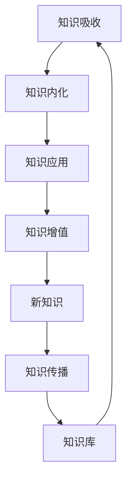

                 

# 提高知识吸收率的关键：大量输出

在当今信息爆炸的时代，如何快速吸收新知识，构建系统的知识体系，已成为许多人的共同挑战。尽管在线学习、阅读书籍、参加研讨会等传统方式仍然是获取知识的重要渠道，但面对海量的信息，仅凭被动接受和简单阅读已无法满足深度学习的需要。本文将从理论和实践两方面探讨如何通过大量输出，提高知识吸收率，构建属于自己的知识体系，进而推动个人和组织在复杂多变的知识经济时代中持续成长。

## 1. 背景介绍

### 1.1 问题由来

随着互联网的发展，信息获取的门槛不断降低，各类知识库、线上课程、专业博客、论坛等海量的资源为学习者提供了极大的便利。然而，面对这种信息过载的环境，学习者往往陷入“信息噪音”中，难以从中提取出有价值的内容，更不用说真正吸收和应用这些知识。传统的“输入为主”的学习方式已不再适应新的学习环境。

### 1.2 问题核心关键点

要提高知识吸收率，关键在于通过大量输出，将输入的知识进行内化、拓展和应用。具体来说，可以通过以下途径：

1. **内化知识**：通过总结、笔记、思维导图等形式，将输入的知识内化成自己的理解，形成系统的认知。
2. **拓展应用**：通过实践、教学、讨论等方式，将知识应用于实际场景，验证和完善自己的认知。
3. **生成新知**：通过创新、研究、编程等活动，结合已有知识产生新的见解和成果，形成知识增值。

这种“输出为主”的学习方式，不仅能帮助学习者构建个人知识体系，还能通过知识的分享和传播，推动知识的扩散和创新，形成良性循环。

## 2. 核心概念与联系

### 2.1 核心概念概述

为更好地理解大量输出的学习方法，本节将介绍几个核心概念：

- **知识吸收率**：指学习者从输入中获得有价值知识的程度。通过大量输出，可以提升知识吸收率，使学习更加高效。
- **知识内化**：指学习者将外部知识通过自身理解和加工，转化为内在的认知结构。
- **知识应用**：指学习者将知识应用于实际情境中，解决具体问题。
- **知识增值**：指学习者通过创新和研究，生成新的知识，进一步提升自身的知识水平。

这些概念之间的联系可以用以下Mermaid流程图来表示：



这个流程图展示了知识吸收、内化、应用、增值、传播和知识库的相互关系：

1. 学习者通过知识吸收，获取外部知识。
2. 经过知识内化，将知识转化为个人的认知。
3. 将内化的知识应用到实际问题中，提升解决问题的能力。
4. 通过知识增值，产生新的见解和成果。
5. 新知识通过知识传播，回到知识库，进入下一轮知识吸收。

## 3. 核心算法原理 & 具体操作步骤

### 3.1 算法原理概述

大量输出的学习方法基于“输出倒逼输入”的原理，即通过输出驱动输入，使得学习过程更加主动和深入。具体来说，通过系统地输出知识，学习者不仅能够验证和巩固自己的认知，还能识别出自身知识的盲点和不足，进一步补充和完善。

### 3.2 算法步骤详解

以下是大量输出学习方法的步骤：

**Step 1: 确定输出目标**

学习者应根据自己的兴趣和需求，明确输出的目标和形式。常见的输出形式包括文章、视频、代码、演讲等。明确目标有助于保持学习的动力和方向。

**Step 2: 输入知识**

学习者通过阅读书籍、参加课程、观看视频等方式，系统地输入相关的知识和技能。选择合适的输入源，获取高质量的信息，是有效学习的前提。

**Step 3: 知识内化**

学习者通过总结、笔记、思维导图等工具，将输入的知识进行整理和内化。这个过程需要反复思考和反思，将知识转化为自己的理解。

**Step 4: 知识应用**

学习者将内化的知识应用于实际问题中，解决实际问题，验证知识的有效性。这一步是知识应用的重要环节，通过实践可以进一步巩固和深化知识。

**Step 5: 知识增值**

学习者通过创新、研究、编程等方式，结合已有知识产生新的见解和成果。这一过程不仅是对已有知识的巩固，更是对新知识的创造。

**Step 6: 知识传播**

学习者将新知识通过文章、视频、讲座、代码库等方式进行传播，分享自己的见解和成果，进一步扩大知识的传播范围和影响力。

**Step 7: 反馈与调整**

通过获取读者的反馈，学习者可以进一步调整和优化自己的知识体系和输出方法，不断迭代和进步。

### 3.3 算法优缺点

大量输出的学习方法具有以下优点：

1. **主动学习**：通过系统输出，学习者主动参与学习过程，增强了对知识的理解和应用能力。
2. **深度内化**：通过总结和反思，学习者能够将知识转化为深层次的内在认知。
3. **实践验证**：通过实践应用，学习者能够验证和巩固知识，增强解决问题的能力。
4. **知识增值**：通过创新和研究，学习者能够生成新的知识，推动自身成长。

同时，该方法也存在一定的局限性：

1. **时间投入**：大量输出需要大量时间和精力的投入，对学习者的自律性和时间管理能力提出了较高的要求。
2. **产出质量**：输出的质量和深度直接影响到知识吸收率，如果输出内容过于浅显或重复，效果可能不理想。
3. **知识吸收风险**：如果输出过于频繁或内容过于杂乱，学习者可能难以有效整合和内化知识，导致知识吸收率下降。

尽管存在这些局限性，但总体而言，大量输出学习方法在提升知识吸收率和构建知识体系方面具有显著优势，值得广泛推广和应用。

### 3.4 算法应用领域

大量输出的学习方法不仅适用于个人学习，在企业培训、教育体系、知识传播等领域也有广泛的应用。具体应用场景包括：

- **企业培训**：通过内训师或知识分享会的形式，系统输出企业内部知识，提升员工的技能和认知。
- **教育体系**：通过布置项目、进行实验等方式，鼓励学生大量输出，促进知识的深度内化和应用。
- **知识传播**：通过博客、视频、课程等形式，分享和学习者的研究成果和见解，推动知识的广泛传播和扩散。

## 4. 数学模型和公式 & 详细讲解 & 举例说明

### 4.1 数学模型构建

本节将使用数学语言对大量输出学习方法进行更加严格的刻画。

设学习者输入的知识为 $K$，输出的内容为 $O$。知识吸收率 $R$ 定义为：

$$
R = \frac{O}{K}
$$

其中，$O$ 为学习者通过输出获取的知识总量，$K$ 为输入的知识总量。目标是通过优化 $O$，提升 $R$。

### 4.2 公式推导过程

知识吸收率的优化可以转化为输出内容的最大化问题。假设学习者通过 $n$ 种形式的输出，每一种输出的数量为 $x_i$，则总输出量为：

$$
O = \sum_{i=1}^n x_i
$$

由于不同的输出形式可能涉及不同的输入量和输出质量，我们需要引入输入量和输出质量的概念。设第 $i$ 种输出形式的输入量为 $I_i$，输出质量为 $Q_i$，则总输入量为：

$$
K = \sum_{i=1}^n I_i
$$

其中 $I_i$ 和 $Q_i$ 都是非负数。

知识吸收率的优化问题可以转化为以下最优化问题：

$$
\maximize_{x_i} \sum_{i=1}^n x_i \\
\text{subject to} \quad \sum_{i=1}^n x_i \cdot Q_i = \sum_{i=1}^n I_i
$$

目标是在总输入量固定的情况下，最大化总输出量。

### 4.3 案例分析与讲解

以写博客为例，分析大量输出方法的实践过程：

1. **确定输出目标**：博客的目标是分享和学习者的研究成果，传播专业知识。
2. **输入知识**：阅读相关书籍、文献、研究报告，了解最新的研究成果和技术进展。
3. **知识内化**：总结和梳理输入的知识，形成系统性的文章大纲。
4. **知识应用**：将知识应用于实际问题，解决技术难题或撰写研究论文。
5. **知识增值**：通过讨论、交流等方式，结合已有知识产生新的见解，进一步完善文章内容。
6. **知识传播**：将文章发布在博客平台，分享和传播知识，获取读者的反馈和建议。
7. **反馈与调整**：根据读者的反馈，调整和优化文章内容，进一步提高文章质量。

通过不断循环这个过程，学习者不仅能够提升知识吸收率，还能不断生成新的知识和见解，构建属于自己的知识体系。

## 5. 项目实践：代码实例和详细解释说明

### 5.1 开发环境搭建

在进行大量输出实践前，我们需要准备好开发环境。以下是使用Python进行开发的常见环境配置流程：

1. 安装Anaconda：从官网下载并安装Anaconda，用于创建独立的Python环境。

2. 创建并激活虚拟环境：
```bash
conda create -n myenv python=3.8 
conda activate myenv
```

3. 安装必要的Python库：
```bash
pip install numpy pandas matplotlib jupyter notebook scikit-learn
```

完成上述步骤后，即可在`myenv`环境中开始实践。

### 5.2 源代码详细实现

以下是一个简单的博客文章生成代码示例，详细解释其功能：

```python
import pandas as pd
import numpy as np
from sklearn.feature_extraction.text import TfidfVectorizer
from sklearn.decomposition import NMF

# 数据准备
data = pd.read_csv('blog_data.csv')  # 从CSV文件中读取博客文章数据

# 特征提取
tfidf = TfidfVectorizer(stop_words='english', max_features=1000)
X = tfidf.fit_transform(data['content'])

# 主题建模
nmf = NMF(n_components=5, random_state=42)
X_topics = nmf.fit_transform(X)
data['topic'] = np.argmax(X_topics, axis=1)

# 主题分类
data.groupby('topic').mean()

# 输出结果
for topic in np.unique(data['topic']):
    print('Topic {}:'.format(topic))
    print(data[data['topic'] == topic]['title'].value_counts())
```

这段代码通过Python和scikit-learn库，实现了从博客数据中提取主题，并输出每个主题下最热门的博客标题。通过大量输出，学习者不仅能够理解主题建模的过程和结果，还能发现不同主题下的热门话题，进一步拓展自己的知识视野。

### 5.3 代码解读与分析

**数据准备**：
- 使用Pandas库从CSV文件中读取博客文章数据，并准备用于特征提取。

**特征提取**：
- 使用TF-IDF方法对博客内容进行向量化处理，提取关键特征。
- 使用NMF模型对提取的特征进行主题建模，识别出文章的主要话题。

**主题分类**：
- 根据主题模型的结果，对博客进行主题分类，统计每个主题下博客的分布情况。

**输出结果**：
- 根据主题分类结果，输出每个主题下最热门的博客标题，通过阅读这些标题，学习者可以进一步拓展对相应主题的知识。

## 6. 实际应用场景

### 6.1 个人知识管理

大量输出的学习方法在个人知识管理中具有广泛的应用。通过撰写技术博客、制作思维导图、编写读书笔记等方式，学习者可以将输入的知识系统化、结构化，形成个人知识库，便于随时查阅和回顾。

### 6.2 企业内部培训

企业可以通过内训师或知识分享会的形式，鼓励员工大量输出，系统地传播和应用内部知识，提升员工的技能和认知水平，增强团队的凝聚力和战斗力。

### 6.3 教育体系改革

学校可以改革传统的教学方式，鼓励学生通过项目实践、科研训练等方式，大量输出知识，促进知识的深度内化和应用，培养具有创新能力和实践能力的人才。

### 6.4 知识传播与社区建设

大量输出的学习方法也适用于知识传播与社区建设。通过博客、视频、课程等形式，分享和学习者的研究成果和见解，构建知识传播网络，推动知识的广泛传播和扩散，促进社区成员的共同成长。

## 7. 工具和资源推荐

### 7.1 学习资源推荐

为了帮助学习者掌握大量输出的学习方法，这里推荐一些优质的学习资源：

1. **Coursera**：提供各类在线课程，涵盖计算机科学、数据科学、自然语言处理等多个领域，通过视频和互动学习，提升学习效果。

2. **edX**：与世界顶级大学合作，提供高质量的在线课程，包括MIT、Harvard等知名学府，学习者可以自主选择课程，深入学习。

3. **Kaggle**：数据科学和机器学习竞赛平台，提供大量真实数据集和开源项目，通过参与竞赛，实践和应用所学知识。

4. **GitHub**：全球最大的代码托管平台，提供丰富的开源项目和代码库，学习者可以通过阅读和编写代码，深入理解算法和技术实现。

5. **博客平台**：如Medium、知乎等，提供广泛的知识传播平台，学习者可以通过撰写文章，分享和传播自己的研究成果。

6. **在线学习社区**：如Stack Overflow、Reddit等，提供丰富的讨论和交流平台，学习者可以通过提问和答疑，深化对知识的理解。

这些资源为学习者提供了多样化的学习路径和工具，通过利用这些资源，学习者可以更加系统地掌握大量输出方法，提升知识吸收率。

### 7.2 开发工具推荐

高效的开发离不开优秀的工具支持。以下是几款用于大量输出实践的常用工具：

1. **Jupyter Notebook**：Python的交互式编程环境，支持代码、文本、图形等多种形式输出，方便学习和分享。

2. **Git**：版本控制系统，支持多人协作开发和代码管理，适用于团队知识共享和版本控制。

3. **Markdown**：轻量级标记语言，支持丰富的文本格式和内嵌链接，适用于撰写博客和文档。

4. **LaTeX**：专业的文档排版工具，适用于撰写学术论文和技术文档，支持复杂的排版和格式。

5. **Google Colab**：谷歌推出的在线Jupyter Notebook环境，免费提供GPU/TPU算力，方便学习者快速上手实验新模型。

6. **VS Code**：跨平台的开发工具，支持多种编程语言和插件，适用于快速开发和调试。

通过合理利用这些工具，学习者可以显著提升开发效率和输出质量，快速迭代和优化自己的知识体系。

### 7.3 相关论文推荐

大量输出的学习方法源于学界的持续研究。以下是几篇奠基性的相关论文，推荐阅读：

1. **Deep Learning for Knowledge Discovery in Biomedicine**：通过深度学习技术从生物医学文献中提取知识和见解，推动医学知识的传播和应用。

2. **The Knowledge-First Machine Learning Approach**：提出知识驱动的机器学习方法，通过结合领域知识和机器学习技术，提升知识发现和应用的效果。

3. **Learning from Rare Events in Online Collaborative Learning**：研究在线协作学习中的知识传播和吸收问题，通过系统输出，提升学习者的知识吸收率和效果。

4. **Knowledge Spreading Through Social Networks**：分析社交网络中的知识传播过程，通过大量输出，促进知识在网络中的传播和扩散。

5. **Collaborative Knowledge Acquisition and Diffusion in Online Communities**：研究在线社区中的知识共享和传播机制，通过大量输出，提升社区成员的知识吸收率和学习效果。

这些论文代表了大规模知识传播和学习方法的发展脉络。通过学习这些前沿成果，可以帮助研究者把握学科前进方向，激发更多的创新灵感。

## 8. 总结：未来发展趋势与挑战

### 8.1 总结

本文对大量输出的学习方法进行了全面系统的介绍。首先阐述了该方法在提升知识吸收率、构建知识体系方面的独特价值，明确了该方法在实际应用中的重要性和应用前景。其次，从理论和实践两方面，详细讲解了大量输出方法的核心步骤和具体操作，给出了一个完整的代码示例。最后，探讨了该方法在个人知识管理、企业培训、教育体系改革、知识传播与社区建设等多个领域的应用，展示了大量输出方法的多样化和普适性。

通过本文的系统梳理，可以看到，大量输出学习方法不仅适用于个人学习，在各个行业领域也有广泛的应用前景。借助该方法，学习者可以更加主动和深入地吸收知识，构建自己的知识体系，推动个人和组织在知识经济时代中持续成长。

### 8.2 未来发展趋势

展望未来，大量输出的学习方法将呈现以下几个发展趋势：

1. **技术工具的集成化**：随着各类学习工具和平台的发展，未来的学习将更加注重工具的集成和应用，通过综合利用多种工具，提升学习效率和效果。

2. **数据驱动的学习**：大量输出方法将更加依赖数据驱动，通过大数据分析和机器学习技术，优化输出策略和内容，提高知识传播的精准性和覆盖面。

3. **个性化学习**：随着个性化学习技术的发展，未来的学习将更加注重个性化，通过系统输出，针对学习者的兴趣和需求，提供定制化的学习内容。

4. **知识共享的全球化**：在全球化背景下，未来的学习将更加注重知识的共享和传播，通过大量输出，促进不同文化和背景下的知识交流和创新。

5. **学习生态系统的形成**：未来的学习将更加注重生态系统的构建，通过大量的知识输出和互动，形成良性循环的学习网络，提升整个学习社区的协作和创新能力。

这些趋势凸显了大量输出学习方法在知识传播和创新方面的巨大潜力，未来的学习将更加智能、高效和协作。

### 8.3 面临的挑战

尽管大量输出学习方法已经取得了显著成效，但在迈向更加智能化、普适化应用的过程中，它仍面临着诸多挑战：

1. **输出内容的创新性**：大量输出需要原创和创新的内容，否则容易陷入重复和同质化的困境。如何不断生成高质量、有深度的输出内容，是未来的重要挑战。

2. **时间管理的优化**：大量输出需要大量时间和精力的投入，如何平衡输出和学习，避免过度投入，需要更多的工具和方法。

3. **知识吸收的质量**：输出内容的深度和质量直接影响到知识吸收的效果，如何优化输入和输出的匹配，提升知识吸收的质量，是关键问题。

4. **知识的整合和应用**：通过大量输出，学习者需要进一步整合和应用知识，解决实际问题。如何实现知识的深度整合和应用，需要更多的实践和经验。

5. **社区建设的协同**：知识共享和传播需要社区的协同，如何构建积极、活跃的学习社区，促进知识传播和交流，是未来的重要任务。

6. **技术的普及和普及**：大量输出方法需要依赖技术工具和平台，如何普及和推广这些技术，提升学习者的主动性和参与度，是重要的社会问题。

这些挑战需要更多的创新和努力，才能真正实现大量输出方法在知识传播和创新方面的潜力。

### 8.4 研究展望

面对大量输出方法所面临的挑战，未来的研究需要在以下几个方面寻求新的突破：

1. **技术工具的优化**：开发更智能、易用的技术工具和平台，提高学习者的操作效率和体验。

2. **内容生成机制的创新**：探索内容生成的新机制和方法，通过协同编辑、智能推荐等方式，提升输出内容的创新性和多样性。

3. **知识传播的优化**：利用大数据和机器学习技术，优化知识传播的路径和策略，提高知识传播的覆盖面和效果。

4. **学习生态系统的构建**：构建积极、活跃、协同的学习生态系统，通过知识传播和交流，促进学习的持续发展和创新。

5. **知识吸收的质量提升**：通过系统分析和反馈机制，优化输入和输出的匹配，提升知识吸收的质量和效果。

6. **技术的普及和推广**：通过教育和培训，普及和推广大量输出方法和工具，提升学习者的参与度和应用效果。

这些研究方向的探索，必将引领大量输出方法在知识传播和创新方面的持续进步，推动学习者和社会在知识经济时代中的不断成长和进步。

## 9. 附录：常见问题与解答

**Q1：大量输出是否适用于所有类型的学习者？**

A: 大量输出学习方法适用于各类学习者，但不同的学习者需要根据自己的兴趣和需求，选择适合自己的输出形式和内容。例如，技术博主适合通过撰写博客分享技术见解，而艺术家可以通过绘画、音乐等方式表达创作。

**Q2：大量输出需要投入多少时间？**

A: 大量输出需要根据具体任务和输出形式灵活安排时间。一般来说，每天至少抽出30分钟进行输出，并逐步增加时间，能够有效提升知识吸收率。同时，可以通过设定小目标，逐步增加输出量和质量，逐步提升学习效果。

**Q3：大量输出是否需要掌握特定的技能？**

A: 大量输出方法的核心在于系统输出和知识内化，并不需要掌握特定的技能。通过总结、笔记、思维导图等工具，学习者可以逐步提升输出质量和深度，通过不断实践和学习，逐步掌握相关技能。

**Q4：大量输出是否会导致过度疲劳？**

A: 大量输出需要投入大量时间和精力，容易引发疲劳。可以通过设定小目标、逐步增加时间、合理安排休息等方式，避免过度疲劳。同时，可以通过多形式输出，保持输出内容的持续性和多样性，防止单一输出形式的枯燥和乏味。

**Q5：大量输出是否能够提升知识吸收率？**

A: 大量输出方法通过系统输出驱动输入，能够有效提升知识吸收率。通过不断输出和反思，学习者能够不断补充和完善自己的认知，构建系统的知识体系，推动知识的深度理解和应用。

通过不断实践和学习，大量输出方法将成为提升知识吸收率、构建知识体系的重要手段，推动个人和组织在知识经济时代中的持续成长和进步。相信随着该方法在各个领域的广泛应用，未来的学习将更加智能、高效和协作，为知识传播和创新带来更多的机遇和挑战。

