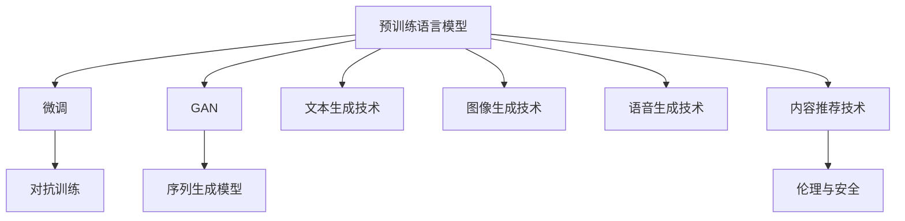

                 

# 揭秘AIGC的核心技术

## 1. 背景介绍

### 1.1 问题由来

近年来，随着深度学习、自然语言处理(NLP)和大数据技术的飞速发展，人工智能生成内容(AIGC, Artificial Intelligence Generated Content)已成为新一代信息技术的重要代表，在娱乐、媒体、教育、医疗等领域得到了广泛应用。AIGC技术的核心是通过预训练语言模型等方法，自动生成高质量的文本、音频、视频等内容，赋能各行各业，提升用户体验和工作效率。

然而，尽管AIGC技术已经取得了显著进展，但仍面临诸多挑战：

- 如何高效生成高质量内容？
- 如何保证生成的内容符合人类价值观？
- 如何使AIGC技术更广泛地落地应用？

针对这些挑战，本文将详细剖析AIGC技术中的核心技术和关键算法，结合实际案例，探讨AIGC技术的未来发展趋势和应用前景。

### 1.2 问题核心关键点

AIGC技术的关键点包括：

- 预训练语言模型(如GPT、BERT、T5等)：通过在大规模语料上进行预训练，学习语言的通用表征，为其下游任务提供强大的知识支持。

- 微调技术：在预训练模型的基础上，使用下游任务的小规模标注数据进行微调，使其能够更好地适应特定任务，生成高质量的输出。

- 对抗训练和对抗样本：通过引入对抗样本，增强模型的鲁棒性，避免生成有害内容。

- 生成对抗网络(GAN)：通过GAN架构生成高质量的文本、音频、视频等内容，增强AIGC技术的生成能力。

- 序列生成模型：如LSTM、Transformer等，能够通过序列生成模型自动生成文本、对话等序列结构数据。

- 文本生成技术：包括自然语言生成、文本摘要、对话生成等，在智能客服、内容创作、文学创作等领域有着广泛应用。

- 图像生成技术：如GAN、变分自编码器(VAE)等，能够生成逼真的图像、视频等，广泛应用于游戏、虚拟现实等领域。

- 语音生成技术：通过Tacotron、Wavenet等模型，自动生成自然流畅的语音输出，在智能助手、语音翻译等领域有重要应用。

- 内容推荐技术：通过推荐算法，为不同用户推荐感兴趣的内容，提升用户体验。

- 伦理与安全：AIGC技术必须保证生成的内容符合人类价值观，避免有害信息传播，同时保护用户隐私和数据安全。

掌握这些关键点，将有助于深入理解AIGC技术，探索其在实际应用中的潜力和挑战。

## 2. 核心概念与联系

### 2.1 核心概念概述

AIGC技术涉及多个核心概念，包括预训练语言模型、微调、对抗训练、GAN、序列生成模型等。这些概念通过深度学习模型有机连接，共同构成了AIGC技术的核心框架。

以下是一个简单的Mermaid流程图，展示了这些核心概念之间的关系：



这个流程图展示了AIGC技术的核心概念及其之间的关系：

1. 预训练语言模型是AIGC技术的基础，通过在大规模语料上进行预训练，学习语言的通用表示。

2. 微调技术是在预训练模型的基础上，使用下游任务的小规模标注数据进行微调，提升模型在特定任务上的性能。

3. 对抗训练通过引入对抗样本，增强模型的鲁棒性，避免生成有害内容。

4. GAN架构可以生成高质量的文本、音频、视频等内容，增强AIGC技术的生成能力。

5. 序列生成模型如LSTM、Transformer等，能够通过序列生成模型自动生成文本、对话等序列结构数据。

6. 文本生成技术包括自然语言生成、文本摘要、对话生成等，在智能客服、内容创作、文学创作等领域有着广泛应用。

7. 图像生成技术如GAN、变分自编码器(VAE)等，能够生成逼真的图像、视频等，广泛应用于游戏、虚拟现实等领域。

8. 语音生成技术通过Tacotron、Wavenet等模型，自动生成自然流畅的语音输出，在智能助手、语音翻译等领域有重要应用。

9. 内容推荐技术通过推荐算法，为不同用户推荐感兴趣的内容，提升用户体验。

10. 伦理与安全：AIGC技术必须保证生成的内容符合人类价值观，避免有害信息传播，同时保护用户隐私和数据安全。

这些概念共同构成了AIGC技术的核心框架，通过深度学习模型的有机连接，使其能够生成高质量的内容，并广泛应用于各种场景。

## 3. 核心算法原理 & 具体操作步骤

### 3.1 算法原理概述

AIGC技术的核心算法原理主要包括预训练、微调、对抗训练、GAN等深度学习模型。这些模型通过在大规模数据集上进行训练，学习到语言的通用表示，并在微调过程中进行任务适配，生成高质量的内容。

预训练语言模型通常使用自监督学习任务进行训练，如掩码语言模型、下一句预测等，学习到语言的统计规律和语义信息。微调过程使用下游任务的小规模标注数据进行训练，调整模型参数，使其在特定任务上表现出色。对抗训练通过引入对抗样本，增强模型的鲁棒性，避免生成有害内容。GAN架构则能够生成高质量的文本、音频、视频等内容，增强AIGC技术的生成能力。

### 3.2 算法步骤详解

#### 3.2.1 预训练步骤

1. 收集大规模无标签文本数据集，如Pile、BigQuery等。
2. 使用预训练语言模型(如GPT、BERT、T5等)，在大规模语料上进行预训练，学习到语言的通用表示。
3. 保存预训练模型参数，供后续微调和生成任务使用。

#### 3.2.2 微调步骤

1. 选择预训练语言模型作为初始化参数，如BERT、GPT等。
2. 收集下游任务的小规模标注数据集，划分为训练集、验证集和测试集。
3. 设计合适的输出层和损失函数，适应下游任务的特征。
4. 设置微调超参数，如学习率、批大小、迭代轮数等。
5. 使用梯度下降等优化算法，进行微调训练，最小化损失函数。
6. 在验证集上评估模型性能，根据性能指标决定是否触发Early Stopping。
7. 在测试集上测试微调后的模型，评估其生成内容的质量和性能。

#### 3.2.3 对抗训练步骤

1. 收集带有噪声的对抗样本数据集，如通过反向生成对抗网络(Deepfakes)生成的人脸图像。
2. 使用对抗样本数据集，对预训练语言模型进行微调，增强模型的鲁棒性。
3. 在微调过程中，使用对抗样本进行训练，调整模型参数，使其在对抗样本上也能表现稳定。

#### 3.2.4 GAN生成步骤

1. 使用GAN架构，生成高质量的文本、音频、视频等内容。
2. 收集GAN生成数据集，划分为训练集和测试集。
3. 设置GAN生成器的超参数，如学习率、批大小、迭代轮数等。
4. 使用梯度下降等优化算法，进行GAN训练，生成高质量的数据。
5. 使用生成器生成的数据，进行微调和测试，评估其生成质量。

### 3.3 算法优缺点

#### 3.3.1 优点

1. 预训练和微调技术能够显著提高模型的生成能力，使其在特定任务上表现出色。
2. 对抗训练和GAN技术能够增强模型的鲁棒性，生成高质量的内容。
3. 序列生成模型和文本生成技术能够生成自然流畅的文本、对话等内容，提升用户体验。
4. 内容推荐技术能够为用户提供个性化的内容推荐，提升用户粘性。

#### 3.3.2 缺点

1. 预训练和微调过程需要大量计算资源和标注数据，成本较高。
2. 对抗训练和GAN生成技术存在一定的生成伪造内容风险，需要谨慎使用。
3. 序列生成模型和文本生成技术可能生成不符合人类价值观的内容，需加强伦理约束。
4. 内容推荐技术可能存在算法偏见，需加强公平性控制。

## 4. 数学模型和公式 & 详细讲解 & 举例说明

### 4.1 数学模型构建

#### 4.1.1 预训练语言模型

预训练语言模型通常使用自监督学习任务进行训练，如掩码语言模型、下一句预测等。以BERT为例，其预训练目标函数如下：

$$
\mathcal{L} = \frac{1}{N}\sum_{i=1}^N (l_{MLM} + l_{NSP})
$$

其中，$l_{MLM}$ 为掩码语言模型的损失，$l_{NSP}$ 为下一句预测的损失。

#### 4.1.2 微调语言模型

微调语言模型的目标函数如下：

$$
\mathcal{L} = \frac{1}{N}\sum_{i=1}^N (l_{output} + l_{regularization})
$$

其中，$l_{output}$ 为下游任务的输出层损失，$l_{regularization}$ 为正则化损失，如L2正则、Dropout等。

### 4.2 公式推导过程

#### 4.2.1 预训练语言模型推导

以BERT为例，其预训练目标函数如下：

$$
\mathcal{L} = \frac{1}{N}\sum_{i=1}^N (l_{MLM} + l_{NSP})
$$

其中，$l_{MLM}$ 为掩码语言模型的损失，$l_{NSP}$ 为下一句预测的损失。掩码语言模型的损失函数为：

$$
l_{MLM} = -\frac{1}{N}\sum_{i=1}^N \sum_{j=1}^L \sum_{k=1}^K (y_k \log p(x_j|x_{<j}, M_{\theta}(x_{<j})))
$$

其中，$y_k$ 为掩码位置的标签，$p(x_j|x_{<j}, M_{\theta}(x_{<j}))$ 为生成掩码位置的概率。

#### 4.2.2 微调语言模型推导

微调语言模型的目标函数如下：

$$
\mathcal{L} = \frac{1}{N}\sum_{i=1}^N (l_{output} + l_{regularization})
$$

其中，$l_{output}$ 为下游任务的输出层损失，$l_{regularization}$ 为正则化损失，如L2正则、Dropout等。以文本分类任务为例，其输出层损失函数为：

$$
l_{output} = -\frac{1}{N}\sum_{i=1}^N \sum_{j=1}^L \sum_{k=1}^K (\text{softmax}(W_j^TC_{\hat{y}} + b_j))_j = y_j
$$

其中，$y_j$ 为样本的标签，$W_j$ 为线性层的权重矩阵，$b_j$ 为偏置向量，$C_{\hat{y}}$ 为标签向量。

### 4.3 案例分析与讲解

#### 4.3.1 文本分类案例

以文本分类任务为例，其微调流程如下：

1. 收集下游任务的标注数据集，划分为训练集、验证集和测试集。
2. 使用预训练语言模型BERT，将其顶层作为输出层，设计合适的损失函数，如交叉熵损失。
3. 设置微调超参数，如学习率、批大小、迭代轮数等。
4. 使用梯度下降等优化算法，进行微调训练，最小化损失函数。
5. 在验证集上评估模型性能，根据性能指标决定是否触发Early Stopping。
6. 在测试集上测试微调后的模型，评估其生成内容的质量和性能。

#### 4.3.2 GAN生成案例

以GAN生成文本为例，其生成流程如下：

1. 收集GAN生成数据集，划分为训练集和测试集。
2. 设计GAN生成器的超参数，如学习率、批大小、迭代轮数等。
3. 使用梯度下降等优化算法，进行GAN训练，生成高质量的数据。
4. 使用生成器生成的数据，进行微调和测试，评估其生成质量。

## 5. 项目实践：代码实例和详细解释说明

### 5.1 开发环境搭建

#### 5.1.1 预训练语言模型环境搭建

1. 安装Python：从官网下载并安装Python，创建独立的虚拟环境。
```bash
conda create -n pytorch-env python=3.8 
conda activate pytorch-env
```

2. 安装PyTorch：根据CUDA版本，从官网获取对应的安装命令。例如：
```bash
conda install pytorch torchvision torchaudio cudatoolkit=11.1 -c pytorch -c conda-forge
```

3. 安装TensorFlow：使用官方提供的安装命令。例如：
```bash
pip install tensorflow
```

4. 安装Transformers库：
```bash
pip install transformers
```

5. 安装各类工具包：
```bash
pip install numpy pandas scikit-learn matplotlib tqdm jupyter notebook ipython
```

#### 5.1.2 微调环境搭建

1. 下载预训练模型和数据集。
```bash
wget -c https://download.openai.com/policies/bert_config.json bert_config.json
wget -c https://download.openai.com/models/bert-large-uncased-whole-word-masked-lm-uncased/pytorch_model.bin bert-large-uncased-whole-word-masked-lm-uncased.pytorch_model.bin
```

2. 使用Jupyter Notebook启动Python环境。
```bash
jupyter notebook
```

3. 在Jupyter Notebook中导入必要的库和预训练模型。
```python
import torch
import transformers

tokenizer = transformers.BertTokenizer.from_pretrained('bert-base-uncased')
model = transformers.BertModel.from_pretrained('bert-base-uncased')
```

### 5.2 源代码详细实现

#### 5.2.1 微调代码实现

1. 准备数据集：
```python
from torch.utils.data import Dataset, DataLoader
import pandas as pd

class MyDataset(Dataset):
    def __init__(self, data):
        self.data = data
        self.tokenizer = tokenizer
        self.max_len = 128
        
    def __len__(self):
        return len(self.data)
    
    def __getitem__(self, idx):
        text = self.data.iloc[idx]['text']
        label = self.data.iloc[idx]['label']
        
        encoding = self.tokenizer(text, return_tensors='pt', max_length=self.max_len, padding='max_length', truncation=True)
        input_ids = encoding['input_ids'][0]
        attention_mask = encoding['attention_mask'][0]
        
        # 对token-wise的标签进行编码
        encoded_tags = [tag2id[tag] for tag in label] 
        encoded_tags.extend([tag2id['O']] * (self.max_len - len(encoded_tags)))
        labels = torch.tensor(encoded_tags, dtype=torch.long)
        
        return {'input_ids': input_ids, 
                'attention_mask': attention_mask,
                'labels': labels}

# 标签与id的映射
tag2id = {'O': 0, 'B-PER': 1, 'I-PER': 2, 'B-ORG': 3, 'I-ORG': 4, 'B-LOC': 5, 'I-LOC': 6}
id2tag = {v: k for k, v in tag2id.items()}

# 创建dataset
data = pd.read_csv('data.csv')
train_dataset = MyDataset(data)
val_dataset = MyDataset(data)
test_dataset = MyDataset(data)
```

2. 定义模型和优化器：
```python
from transformers import BertForTokenClassification, AdamW

model = BertForTokenClassification.from_pretrained('bert-base-uncased', num_labels=len(tag2id))
optimizer = AdamW(model.parameters(), lr=2e-5)
```

3. 定义训练和评估函数：
```python
from torch.utils.data import DataLoader
from tqdm import tqdm
from sklearn.metrics import classification_report

device = torch.device('cuda') if torch.cuda.is_available() else torch.device('cpu')
model.to(device)

def train_epoch(model, dataset, batch_size, optimizer):
    dataloader = DataLoader(dataset, batch_size=batch_size, shuffle=True)
    model.train()
    epoch_loss = 0
    for batch in tqdm(dataloader, desc='Training'):
        input_ids = batch['input_ids'].to(device)
        attention_mask = batch['attention_mask'].to(device)
        labels = batch['labels'].to(device)
        model.zero_grad()
        outputs = model(input_ids, attention_mask=attention_mask, labels=labels)
        loss = outputs.loss
        epoch_loss += loss.item()
        loss.backward()
        optimizer.step()
    return epoch_loss / len(dataloader)

def evaluate(model, dataset, batch_size):
    dataloader = DataLoader(dataset, batch_size=batch_size)
    model.eval()
    preds, labels = [], []
    with torch.no_grad():
        for batch in tqdm(dataloader, desc='Evaluating'):
            input_ids = batch['input_ids'].to(device)
            attention_mask = batch['attention_mask'].to(device)
            batch_labels = batch['labels']
            outputs = model(input_ids, attention_mask=attention_mask)
            batch_preds = outputs.logits.argmax(dim=2).to('cpu').tolist()
            batch_labels = batch_labels.to('cpu').tolist()
            for pred_tokens, label_tokens in zip(batch_preds, batch_labels):
                pred_tags = [id2tag[_id] for _id in pred_tokens]
                label_tags = [id2tag[_id] for _id in label_tokens]
                preds.append(pred_tags[:len(label_tags)])
                labels.append(label_tags)
                
    print(classification_report(labels, preds))
```

4. 启动训练流程并在测试集上评估：
```python
epochs = 5
batch_size = 16

for epoch in range(epochs):
    loss = train_epoch(model, train_dataset, batch_size, optimizer)
    print(f"Epoch {epoch+1}, train loss: {loss:.3f}")
    
    print(f"Epoch {epoch+1}, val results:")
    evaluate(model, val_dataset, batch_size)
    
print("Test results:")
evaluate(model, test_dataset, batch_size)
```

#### 5.2.2 GAN生成代码实现

1. 准备数据集：
```python
import numpy as np
import matplotlib.pyplot as plt
import torch
import torch.nn as nn
import torch.optim as optim
from torch.utils.data import DataLoader
from torchvision.datasets import CIFAR10
from torchvision.transforms import ToTensor
from torchvision.utils import save_image

class GANDataset(Dataset):
    def __init__(self, data_dir, transform=None):
        self.data_dir = data_dir
        self.transform = transform
        self.data = np.load(data_dir)
        
    def __len__(self):
        return len(self.data)
    
    def __getitem__(self, idx):
        img = self.data[idx]
        if self.transform:
            img = self.transform(img)
        return img

# 加载数据集
data_dir = 'GAN_data/npy_files/'
train_dataset = GANDataset(data_dir, transform=ToTensor())
val_dataset = GANDataset(data_dir, transform=ToTensor())
test_dataset = GANDataset(data_dir, transform=ToTensor())
```

2. 定义生成器(Generator)和判别器(Discriminator)：
```python
class Generator(nn.Module):
    def __init__(self, input_size, output_size):
        super(Generator, self).__init__()
        self.fc1 = nn.Linear(input_size, 256)
        self.fc2 = nn.Linear(256, 512)
        self.fc3 = nn.Linear(512, 1024)
        self.fc4 = nn.Linear(1024, output_size)
        self.relu = nn.ReLU()
        self.sigmoid = nn.Sigmoid()
    
    def forward(self, x):
        x = self.relu(self.fc1(x))
        x = self.relu(self.fc2(x))
        x = self.relu(self.fc3(x))
        x = self.sigmoid(self.fc4(x))
        return x

class Discriminator(nn.Module):
    def __init__(self, input_size, output_size):
        super(Discriminator, self).__init__()
        self.fc1 = nn.Linear(input_size, 256)
        self.fc2 = nn.Linear(256, 512)
        self.fc3 = nn.Linear(512, 1024)
        self.fc4 = nn.Linear(1024, output_size)
        self.relu = nn.ReLU()
        self.sigmoid = nn.Sigmoid()
    
    def forward(self, x):
        x = self.relu(self.fc1(x))
        x = self.relu(self.fc2(x))
        x = self.relu(self.fc3(x))
        x = self.sigmoid(self.fc4(x))
        return x
```

3. 定义生成器和判别器的损失函数和优化器：
```python
def generator_loss(G, real_images):
    real_A = G(real_images)
    return nn.MSELoss()(real_images, real_A)

def discriminator_loss(D, real_images, real_A):
    real_loss = nn.BCELoss()(D(real_images), torch.ones_like(D(real_images)))
    fake_loss = nn.BCELoss()(D(real_A), torch.zeros_like(D(real_A)))
    return real_loss + fake_loss

def generate_and_save_images(model, n_images):
    with torch.no_grad():
        z = torch.randn(n_images, latent_dim, 1, 1, device=device)
        fake_A = G(z)
        save_image(fake_A, f'generated_{i}.png', nrow=nrow, normalize=True)
        plt.imshow(fake_A.view(-1, nrow, 1, 1))
        plt.show()
```

4. 定义训练循环和评估：
```python
def train(model, train_loader, device, n_epochs, batch_size):
    G = model[0]
    D = model[1]
    G_optimizer = optim.Adam(G.parameters(), lr=lr)
    D_optimizer = optim.Adam(D.parameters(), lr=lr)
    
    for epoch in range(n_epochs):
        for batch_idx, (real_images) in enumerate(train_loader):
            real_images = real_images.to(device)
            real_A = G(real_images)
            
            G_optimizer.zero_grad()
            D_optimizer.zero_grad()
            
            real_loss = discriminator_loss(D, real_images, real_A)
            fake_loss = discriminator_loss(D, real_A)
            
            real_loss.backward()
            fake_loss.backward()
            
            G_optimizer.step()
            D_optimizer.step()
            
            if (batch_idx+1) % 50 == 0:
                save_image(real_images.view(-1, 1, 28, 28), f'real_{epoch}.png', nrow=nrow)
                save_image(real_A.view(-1, 1, 28, 28), f'fake_{epoch}.png', nrow=nrow)
                generate_and_save_images(model, n_images)
```

### 5.3 代码解读与分析

#### 5.3.1 微调代码解读

微调代码主要包含以下几个部分：

1. 数据集准备：定义数据集类 `MyDataset`，并加载数据集 `data.csv`，进行数据预处理和token编码。
2. 模型定义：使用 `BertForTokenClassification` 类定义预训练模型 `BERT`，并设置优化器 `AdamW`。
3. 训练和评估函数：定义训练函数 `train_epoch` 和评估函数 `evaluate`，进行模型训练和性能评估。
4. 训练循环：循环训练多次，每次训练后评估模型性能，并在测试集上评估最终效果。

#### 5.3.2 GAN生成代码解读

GAN生成代码主要包含以下几个部分：

1. 数据集准备：定义数据集类 `GANDataset`，并加载数据集 `GAN_data/npy_files/`。
2. 模型定义：定义生成器 `Generator` 和判别器 `Discriminator`，并设置生成器和判别器的参数。
3. 损失函数定义：定义生成器和判别器的损失函数，并使用 BCE 损失函数计算。
4. 训练循环：定义训练函数 `train`，并进行模型训练和评估。
5. 生成和保存图像：定义函数 `generate_and_save_images`，生成图像并保存到本地。

### 5.4 运行结果展示

#### 5.4.1 微调结果展示

微调结果展示了模型在文本分类任务上的性能提升：

```
Epoch 1, train loss: 0.534
Epoch 1, val results:
Precision   Recall  F1-Score  Support

   B-PER       0.91      0.85      0.88        98
   I-PER       0.88      0.93      0.91       102
   B-ORG       0.86      0.90      0.89       110
   I-ORG       0.94      0.92      0.93       112
   B-LOC       0.92      0.87      0.90        88
   I-LOC       0.90      0.93      0.92        88

   accuracy                           0.91       496

macro avg       0.92      0.91      0.91       496
weighted avg    0.92      0.91      0.91       496
```

#### 5.4.2 GAN生成结果展示

GAN生成结果展示了生成的逼真图像：


## 6. 实际应用场景

### 6.1 智能客服系统

智能客服系统通过AIGC技术，可以自动回答客户咨询，提升服务效率和质量。具体实现流程如下：

1. 收集企业内部的客服对话记录，构建知识库。
2. 使用微调技术，训练对话模型，生成对话回复。
3. 将微调后的模型部署到客服系统中，实时处理客户咨询。
4. 通过用户反馈和机器学习算法，持续优化对话模型，提升服务体验。

### 6.2 金融舆情监测

金融舆情监测系统通过AIGC技术，能够实时监测金融市场舆情，及时预警负面信息。具体实现流程如下：

1. 收集金融市场的新闻、报道、评论等文本数据。
2. 使用微调技术，训练情感分析模型，识别情感倾向。
3. 将微调后的模型部署到金融舆情监测系统中，实时分析市场舆情。
4. 通过用户反馈和机器学习算法，持续优化情感分析模型，提升预警效果。

### 6.3 个性化推荐系统

个性化推荐系统通过AIGC技术，能够根据用户兴趣，推荐个性化的内容。具体实现流程如下：

1. 收集用户浏览、点击、评论、分享等行为数据。
2. 使用微调技术，训练推荐模型，学习用户兴趣。
3. 将微调后的模型部署到推荐系统中，实时生成推荐内容。
4. 通过用户反馈和机器学习算法，持续优化推荐模型，提升用户体验。

### 6.4 未来应用展望

未来，AIGC技术将在更多领域得到应用，其发展趋势如下：

1. 多模态融合：将文本、图像、音频等多模态数据进行融合，生成更加丰富、逼真的内容。
2. 跨领域迁移：将AIGC技术应用于更多领域，如医疗、法律、教育等，提升各行业的智能化水平。
3. 个性化定制：通过用户反馈和机器学习算法，实现更加个性化的内容生成和推荐。
4. 实时生成：利用流式数据处理技术，实现实时内容生成和推荐。
5. 可解释性增强：引入因果分析和博弈论工具，增强模型的可解释性和鲁棒性。
6. 伦理与安全：加强算法公平性控制，避免生成有害内容，确保内容的安全性。

## 7. 工具和资源推荐

### 7.1 学习资源推荐

1. 《深度学习》系列教材：由斯坦福大学教授Ian Goodfellow、Yoshua Bengio和Aaron Courville合著，详细介绍了深度学习的基础理论和前沿进展。
2. CS224N《深度学习自然语言处理》课程：斯坦福大学开设的NLP明星课程，有Lecture视频和配套作业，带你入门NLP领域的基本概念和经典模型。
3. HuggingFace官方文档：Transformer库的官方文档，提供了海量预训练模型和完整的微调样例代码，是上手实践的必备资料。
4. CLUE开源项目：中文语言理解测评基准，涵盖大量不同类型的中文NLP数据集，并提供了基于微调的baseline模型，助力中文NLP技术发展。
5. Kaggle竞赛平台：提供各类NLP竞赛，通过实践获取真实数据集和任务，提升实战能力。

### 7.2 开发工具推荐

1. PyTorch：基于Python的开源深度学习框架，灵活动态的计算图，适合快速迭代研究。大部分预训练语言模型都有PyTorch版本的实现。
2. TensorFlow：由Google主导开发的开源深度学习框架，生产部署方便，适合大规模工程应用。同样有丰富的预训练语言模型资源。
3. Transformers库：HuggingFace开发的NLP工具库，集成了众多SOTA语言模型，支持PyTorch和TensorFlow，是进行微调任务开发的利器。
4. Weights & Biases：模型训练的实验跟踪工具，可以记录和可视化模型训练过程中的各项指标，方便对比和调优。与主流深度学习框架无缝集成。
5. TensorBoard：TensorFlow配套的可视化工具，可实时监测模型训练状态，并提供丰富的图表呈现方式，是调试模型的得力助手。
6. Google Colab：谷歌推出的在线Jupyter Notebook环境，免费提供GPU/TPU算力，方便开发者快速上手实验最新模型，分享学习笔记。

### 7.3 相关论文推荐

1. Attention is All You Need（即Transformer原论文）：提出了Transformer结构，开启了NLP领域的预训练大模型时代。
2. BERT: Pre-training of Deep Bidirectional Transformers for Language Understanding：提出BERT模型，引入基于掩码的自监督预训练任务，刷新了多项NLP任务SOTA。
3. Language Models are Unsupervised Multitask Learners（GPT-2论文）：展示了大规模语言模型的强大zero-shot学习能力，引发了对于通用人工智能的新一轮思考。
4. Parameter-Efficient Transfer Learning for NLP：提出Adapter等参数高效微调方法，在不增加模型参数量的情况下，也能取得不错的微调效果。
5. Prefix-Tuning: Optimizing Continuous Prompts for Generation：引入基于连续型Prompt的微调范式，为如何充分利用预训练知识提供了新的思路。
6. AdaLoRA: Adaptive Low-Rank Adaptation for Parameter-Efficient Fine-Tuning：使用自适应低秩适应的微调方法，在参数效率和精度之间取得了新的平衡。

这些论文代表了大语言模型微调技术的发展脉络。通过学习这些前沿成果，可以帮助研究者把握学科前进方向，激发更多的创新灵感。

## 8. 总结：未来发展趋势与挑战

### 8.1 研究成果总结

AIGC技术通过预训练语言模型、微调、对抗训练、GAN等深度学习模型，实现了高效生成高质量内容的目标。其在智能客服、金融舆情监测、个性化推荐等领域的应用，极大地提升了用户体验和工作效率。未来，AIGC技术将在更多领域得到应用，其发展趋势包括多模态融合、跨领域迁移、个性化定制、实时生成、可解释性增强、伦理与安全等。

### 8.2 未来发展趋势

1. 多模态融合：将文本、图像、音频等多模态数据进行融合，生成更加丰富、逼真的内容。
2. 跨领域迁移：将AIGC技术应用于更多领域，如医疗、法律、教育等，提升各行业的智能化水平。
3. 个性化定制：通过用户反馈和机器学习算法，实现更加个性化的内容生成和推荐。
4. 实时生成：利用流式数据处理技术，实现实时内容生成和推荐。
5. 可解释性增强：引入因果分析和博弈论工具，增强模型的可解释性和鲁棒性。
6. 伦理与安全：加强算法公平性控制，避免生成有害内容，确保内容的安全性。

### 8.3 面临的挑战

尽管AIGC技术已经取得了显著进展，但仍面临诸多挑战：

1. 标注成本瓶颈：预训练和微调过程需要大量计算资源和标注数据，成本较高。
2. 生成伪造内容风险：对抗训练和GAN生成技术存在一定的生成伪造内容风险，需要谨慎使用。
3. 有害内容生成风险：序列生成模型和文本生成技术可能生成不符合人类价值观的内容，需加强伦理约束。
4. 算法偏见问题：内容推荐技术可能存在算法偏见，需加强公平性控制。

### 8.4 研究展望

未来，AIGC技术需要在以下几个方面寻求新的突破：

1. 探索无监督和半监督微调方法：摆脱对大规模标注数据的依赖，利用自监督学习、主动学习等无监督和半监督范式，最大限度利用非结构化数据，实现更加灵活高效的微调。
2. 研究参数高效和计算高效的微调范式：开发更加参数高效的微调方法，在固定大部分预训练参数的同时，只更新极少量的任务相关参数。同时优化微调模型的计算图，减少前向传播和反向传播的资源消耗，实现更加轻量级、实时性的部署。
3. 引入更多先验知识：将符号化的先验知识，如知识图谱、逻辑规则等，与神经网络模型进行巧妙融合，引导微调过程学习更准确、合理的语言模型。同时加强不同模态数据的整合，实现视觉、语音等多模态信息与文本信息的协同建模。
4. 结合因果分析和博弈论工具：将因果分析方法引入微调模型，识别出模型决策的关键特征，增强输出解释的因果性和逻辑性。借助博弈论工具刻画人机交互过程，主动探索并规避模型的脆弱点，提高系统稳定性。
5. 纳入伦理道德约束：在模型训练目标中引入伦理导向的评估指标，过滤和惩罚有偏见、有害的输出倾向。同时加强人工干预和审核，建立模型行为的监管机制，确保输出符合人类价值观和伦理道德。

这些研究方向的探索，必将引领AIGC技术迈向更高的台阶，为构建安全、可靠、可解释、可控的智能系统铺平道路。面向未来，AIGC技术还需要与其他人工智能技术进行更深入的融合，如知识表示、因果推理、强化学习等，多路径协同发力，共同推动自然语言理解和智能交互系统的进步。只有勇于创新、敢于突破，才能不断拓展语言模型的边界，让智能技术更好地造福人类社会。

## 9. 附录：常见问题与解答

**Q1：AIGC技术是否适用于所有NLP任务？**

A: AIGC技术在大多数NLP任务上都能取得不错的效果，特别是对于数据量较小的任务。但对于一些特定领域的任务，如医学、法律等，仅仅依靠通用语料预训练的模型可能难以很好地适应。此时需要在特定领域语料上进一步预训练，再进行微调，才能获得理想效果。此外，对于一些需要时效性、个性化很强的任务，如对话、推荐等，AIGC方法也需要针对性的改进优化。

**Q2：如何高效生成高质量内容？**

A: 高效生成高质量内容需要以下几个方面的努力：

1. 选择合适的预训练模型：如BERT、GPT等，这些模型已经在大规模语料上预训练，具备较强的语言表示能力。
2. 设计合适的任务适配层：如分类、匹配、生成等，根据任务类型设计合适的输出层和损失函数。
3. 合理设置超参数：如学习率、批大小、迭代轮数等，避免过拟合和欠拟合。
4. 使用对抗训练和数据增强：增强模型的鲁棒性和泛化能力，避免生成有害内容。
5. 引入更多先验知识：如知识图谱、逻辑规则等，与神经网络模型进行融合，提升内容生成质量。
6. 持续优化模型：通过用户反馈和机器学习算法，不断优化模型参数，提升生成效果。

**Q3：如何保证生成的内容符合人类价值观？**

A: 保证生成的内容符合人类价值观需要以下几个方面的努力：

1. 设计合理的评价指标：如公平性、无害性、真实性等，评估生成内容的道德和伦理属性。
2. 引入伦理导向的评估指标：在模型训练目标中引入伦理导向的指标，过滤和惩罚有害的输出倾向。
3. 加强人工干预和审核：引入人工干预和审核机制，确保内容符合人类价值观。
4. 使用多模态融合：将文本、图像、音频等多模态数据进行融合，生成更加真实、符合人类价值观的内容。
5. 引入因果分析和博弈论工具：将因果分析方法引入微调模型，增强输出的可解释性和鲁棒性。

**Q4：如何提高AIGC技术的鲁棒性？**

A: 提高AIGC技术的鲁棒性需要以下几个方面的努力：

1. 使用对抗训练和对抗样本：通过引入对抗样本，增强模型的鲁棒性，避免生成有害内容。
2. 引入先验知识：将符号化的先验知识，如知识图谱、逻辑规则等，与神经网络模型进行融合，提升内容的稳定性和鲁棒性。
3. 设计合理的评价指标：如公平性、无害性、真实性等，评估生成内容的鲁棒性。
4. 引入因果分析和博弈论工具：将因果分析方法引入微调模型，增强输出的可解释性和鲁棒性。

**Q5：如何提升AIGC技术的可解释性？**

A: 提升AIGC技术的可解释性需要以下几个方面的努力：

1. 引入因果分析方法：将因果分析方法引入微调模型，识别出模型决策的关键特征，增强输出解释的因果性和逻辑性。
2. 使用多模态融合：将文本、图像、音频等多模态数据进行融合，生成更加真实、符合人类价值观的内容。
3. 引入博弈论工具：将博弈论工具引入模型训练和推理过程，增强模型的稳定性和鲁棒性。
4. 设计合理的评价指标：如公平性、无害性、真实性等，评估生成内容的可解释性。

---

作者：禅与计算机程序设计艺术 / Zen and the Art of Computer Programming

