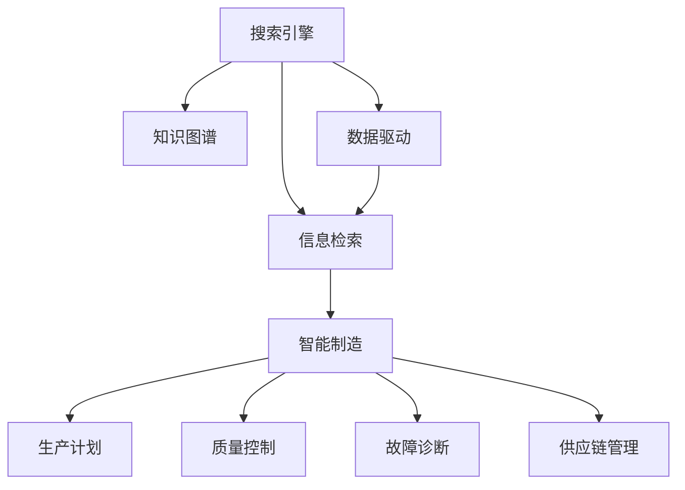

                 

# 搜索引擎在智能制造中的应用

> 关键词：智能制造,搜索引擎,信息检索,知识图谱,数据驱动,工业4.0

## 1. 背景介绍

### 1.1 问题由来
在工业4.0时代，智能制造（Industry 4.0）已成为全球制造业转型升级的重要方向。智能制造的核心在于利用信息技术，实现产品设计、生产制造、供应链管理的智能化。然而，庞大的数据规模和复杂的信息结构，使得信息检索和知识管理成为智能制造系统的瓶颈。传统基于规则或简单的关键词匹配方法难以满足智能制造对于数据处理深度和广度的要求。因此，基于搜索引擎技术的信息检索成为智能制造系统中的重要环节。

### 1.2 问题核心关键点
搜索引擎技术在智能制造中的应用，主要体现在以下几个方面：
1. 数据搜索与知识抽取：通过搜索引擎技术，能够快速定位到智能制造系统所需的各种数据和知识，如零部件信息、工艺流程、设备参数等，为生产计划、质量控制、故障诊断等环节提供数据支持。
2. 需求匹配与推荐：基于用户输入的需求描述，搜索引擎能够精准匹配合适的生产资源和信息，提升生产效率和质量。
3. 知识融合与知识图谱构建：通过将海量的生产数据、工艺文件、设备参数等结构化和非结构化数据融合到知识图谱中，实现更深入的知识发现和挖掘。
4. 智能决策支持：基于搜索技术与机器学习算法，能够实现基于数据的智能决策，支持生产计划优化、质量控制、故障预测等智能决策环节。

搜索引擎技术通过将海量数据高效索引和检索，为智能制造系统提供了强有力的数据支撑，极大地提升了生产效率和决策水平。

### 1.3 问题研究意义
研究搜索引擎在智能制造中的应用，对于推动智能制造系统的智能化、高效化和透明化具有重要意义：

1. 提升生产效率：通过精准的数据检索和知识融合，优化生产计划和流程，提升生产效率。
2. 改善产品质量：利用实时搜索和知识抽取，进行故障诊断和预测，及时发现和解决质量问题。
3. 降低运营成本：通过智能化搜索和推荐，减少无效数据检索和人工干预，降低运营成本。
4. 增强决策支持：基于大数据和搜索技术，实现基于数据的智能决策，提升决策水平。
5. 推动工业4.0：搜索引擎技术作为智能制造的“大脑”，是工业4.0时代的重要支撑，有助于推动制造业的数字化转型。

## 2. 核心概念与联系

### 2.1 核心概念概述

为更好地理解搜索引擎在智能制造中的应用，本节将介绍几个密切相关的核心概念：

- 搜索引擎（Search Engine）：指能够快速从海量的数据中检索出符合用户查询需求信息的系统。基于各种算法和数据结构，实现高效的数据检索和知识抽取。
- 信息检索（Information Retrieval）：指根据用户的查询需求，从大量数据中检索出相关信息的过程。其目标是最大化检索结果的相关性和准确性。
- 知识图谱（Knowledge Graph）：指通过语义关系将结构化和非结构化数据融合构建的知识网络，以实现更深入的知识发现和挖掘。
- 数据驱动（Data-Driven）：指基于数据而非规则的决策方式。利用大数据和机器学习技术，自动发现和应用数据中的模式和规律。
- 工业4.0（Industry 4.0）：指通过信息技术，实现产品设计、生产制造、供应链管理的智能化。融合了物联网、云计算、大数据、人工智能等技术。

这些核心概念之间的逻辑关系可以通过以下Mermaid流程图来展示：



这个流程图展示了大语言模型的核心概念及其之间的关系：

1. 搜索引擎通过信息检索技术，从数据集中检索出符合用户需求的信息。
2. 知识图谱通过语义关系，实现更深入的知识发现和融合。
3. 数据驱动基于大数据和机器学习技术，进行智能决策支持。
4. 智能制造通过搜索引擎、知识图谱和数据驱动，实现生产计划、质量控制、故障诊断等环节的智能化。

## 3. 核心算法原理 & 具体操作步骤
### 3.1 算法原理概述

基于搜索引擎的智能制造信息检索，本质上是一个多轮交互的查询-响应过程。其核心思想是：通过用户输入的查询需求，搜索引擎从数据集中检索出相关结果，并不断反馈和优化搜索结果，直至满足用户需求。

形式化地，假设搜索引擎的数据集为 $D$，查询表示为 $q$，则信息检索的目标是找到最佳的文档 $d \in D$，使得其与查询 $q$ 的相关性最大化。可以定义相关性函数 $r(q, d)$，表示查询与文档的相关程度。目标函数为：

$$
\mathop{\arg\min}_{d \in D} \mathcal{L}(q, d) = \mathop{\arg\min}_{d \in D} [r(q, d) - g(q, d)]
$$

其中 $g(q, d)$ 为模型的评估函数，用于衡量模型预测的相关性和实际相关性的差异。通常使用交叉熵损失函数：

$$
\mathcal{L}(q, d) = -y\log\hat{y} - (1-y)\log(1-\hat{y})
$$

在得到评估函数后，通过优化算法不断更新模型参数 $\theta$，最小化损失函数 $\mathcal{L}$，使得模型预测的相关性 $\hat{y}$ 逼近实际相关性 $y$。具体来说，可以采用基于梯度的优化算法（如SGD、Adam等），进行迭代优化。

### 3.2 算法步骤详解

基于搜索引擎的智能制造信息检索一般包括以下几个关键步骤：

**Step 1: 构建索引**
- 收集智能制造系统中的各类数据，包括零部件信息、工艺文件、设备参数等，进行预处理和清洗。
- 利用分词、去除停用词、词干提取等技术，将文本数据转化为向量表示。
- 利用倒排索引（Inverted Index）等数据结构，建立文档与关键词的映射关系。

**Step 2: 建立查询模型**
- 根据用户输入的查询需求，构建查询模型 $q$，通常使用向量表示。
- 将查询向量 $q$ 和文档向量 $d$ 进行匹配，计算相似度 $r(q, d)$。

**Step 3: 选择排名策略**
- 根据相似度 $r(q, d)$ 和模型评估函数 $g(q, d)$，计算文档 $d$ 的排名得分 $s(d)$。
- 根据得分 $s(d)$ 进行降序排序，返回前 $K$ 个文档作为搜索结果。

**Step 4: 反馈与优化**
- 利用用户的点击反馈、浏览行为等信号，更新模型参数 $\theta$，优化模型的评估函数 $g(q, d)$。
- 不断迭代训练过程，提升模型预测的准确性和相关性。

**Step 5: 应用与扩展**
- 将优化后的模型应用于智能制造系统中的生产计划、质量控制、故障诊断等环节。
- 结合知识图谱、机器学习等技术，实现更深入的知识发现和挖掘。

以上是基于搜索引擎的智能制造信息检索的一般流程。在实际应用中，还需要针对具体任务的特点，对查询模型、排名策略和反馈优化等环节进行优化设计，以进一步提升系统性能。

### 3.3 算法优缺点

基于搜索引擎的智能制造信息检索方法具有以下优点：
1. 高效检索：搜索引擎能够快速定位到所需信息，提升了智能制造系统的响应速度和效率。
2. 知识融合：通过知识图谱构建，实现更深入的知识发现和融合，提升了智能决策的深度和广度。
3. 自适应性强：通过用户反馈和模型优化，搜索引擎能够自适应地调整检索策略，满足不断变化的需求。
4. 扩展性强：可以轻松扩展到不同类型的信息检索需求，支持多种类型的生产数据。

同时，该方法也存在一定的局限性：
1. 对数据质量要求高：搜索引擎依赖于高质量的数据，数据噪声和错误会影响检索效果。
2. 需要大规模数据支撑：搜索引擎需要大量数据作为支撑，对于小型制造企业可能难以获取足够的数据。
3. 计算资源消耗大：搜索引擎的训练和推理过程需要较高的计算资源，对于资源有限的制造企业可能存在挑战。
4. 实时性问题：大规模数据集下的搜索引擎推理过程较慢，可能无法满足实时性要求。
5. 缺乏透明度：搜索引擎的内部算法复杂，难以解释其决策过程，缺乏透明度。

尽管存在这些局限性，但就目前而言，基于搜索引擎的智能制造信息检索方法仍然是大规模数据驱动的智能制造系统中的重要工具。未来相关研究的重点在于如何进一步降低计算资源消耗，提升实时性和透明度，同时结合更多前沿技术，如知识图谱、自然语言处理等，拓展搜索引擎的应用边界。

### 3.4 算法应用领域

基于搜索引擎的智能制造信息检索方法，在智能制造领域的应用非常广泛，例如：

- 生产计划优化：基于设备参数和工艺文件，检索出最优的生产流程和参数设置，优化生产计划。
- 故障诊断与预测：利用设备传感器数据，检索出相关的故障诊断和预测模型，提前预测设备故障。
- 质量控制：通过产品检验数据，检索出相关的质量控制模型，及时发现和解决质量问题。
- 供应链管理：基于供应商数据和物流信息，检索出最优的供应链策略，提升供应链效率。
- 人员培训：利用专家知识库，检索出相关的培训资料和教程，提升员工技能水平。
- 产品设计：基于用户反馈和市场数据，检索出相关设计案例和参考资料，提升产品设计质量。

除了上述这些经典应用外，搜索引擎技术还被创新性地应用到更多场景中，如智能仓储、智能物流、智能客服等，为智能制造系统的智能化和高效化提供了强大的数据支撑。随着搜索引擎技术的持续演进，相信在更多领域的应用将不断涌现，为制造业带来新的变革。

## 4. 数学模型和公式 & 详细讲解 & 举例说明

### 4.1 数学模型构建

本节将使用数学语言对搜索引擎在智能制造中的应用进行更加严格的刻画。

假设智能制造系统的数据集为 $D=\{x_i, y_i\}_{i=1}^N$，其中 $x_i$ 为文档，$y_i$ 为查询与文档的相关性标签。定义查询向量为 $q$，文档向量为 $d$。搜索引擎的训练目标是最小化查询 $q$ 和文档 $d$ 的交叉熵损失函数，即：

$$
\mathcal{L}(q, D) = -\frac{1}{N}\sum_{i=1}^N y_i \log \hat{y}_i
$$

其中 $\hat{y}_i = P(r(q, d_i))$，为模型预测的相关性概率。

搜索引擎的评估函数可以定义为：

$$
g(q, d) = \frac{y}{r(q, d)} + \frac{(1-y)}{1-r(q, d)}
$$

在得到评估函数后，通过优化算法不断更新模型参数 $\theta$，最小化损失函数 $\mathcal{L}$，使得模型预测的相关性 $\hat{y}$ 逼近实际相关性 $y$。

### 4.2 公式推导过程

以下我们以二分类任务为例，推导交叉熵损失函数及其梯度的计算公式。

假设查询向量为 $q$，文档向量为 $d$，相关性概率为 $\hat{y}$，则二分类交叉熵损失函数定义为：

$$
\ell(q, d) = -[y\log \hat{y} + (1-y)\log(1-\hat{y})]
$$

将其代入损失函数公式，得：

$$
\mathcal{L}(q, D) = -\frac{1}{N}\sum_{i=1}^N [y_i\log \hat{y}_i + (1-y_i)\log(1-\hat{y}_i)]
$$

根据链式法则，损失函数对参数 $\theta$ 的梯度为：

$$
\frac{\partial \mathcal{L}(q, D)}{\partial \theta} = -\frac{1}{N}\sum_{i=1}^N [y_i\frac{\partial \hat{y}_i}{\partial \theta} - (1-y_i)\frac{\partial (1-\hat{y}_i)}{\partial \theta}]
$$

其中 $\frac{\partial \hat{y}_i}{\partial \theta}$ 可以通过反向传播算法高效计算。

在得到损失函数的梯度后，即可带入参数更新公式，完成模型的迭代优化。重复上述过程直至收敛，最终得到适应智能制造系统的最优模型参数 $\theta^*$。

### 4.3 案例分析与讲解

以智能制造中的故障诊断为例，说明搜索引擎技术的具体应用。

假设智能制造系统中的某设备出现故障，需要检索出相关的故障诊断模型和历史故障数据。故障数据集 $D$ 为：

$$
D = \{(d_1, y_1), (d_2, y_2), \dots, (d_n, y_n)\}
$$

其中 $d_i$ 为设备传感器数据，$y_i$ 为设备是否故障的二分类标签。

假设查询向量为 $q$，表示当前设备传感器数据，模型需要检索出相关的故障诊断模型，并预测故障概率 $\hat{y}$。模型训练目标为最小化交叉熵损失函数：

$$
\mathcal{L}(q, D) = -\frac{1}{N}\sum_{i=1}^N y_i \log \hat{y}_i
$$

在训练过程中，通过反向传播算法计算损失函数的梯度，并更新模型参数 $\theta$。最终得到适应当前设备故障诊断的模型 $\theta^*$。在实际应用中，模型可以实时检索相关故障诊断模型，进行故障预测和诊断。

## 5. 项目实践：代码实例和详细解释说明
### 5.1 开发环境搭建

在进行搜索引擎实践前，我们需要准备好开发环境。以下是使用Python进行TensorFlow开发的环境配置流程：

1. 安装Anaconda：从官网下载并安装Anaconda，用于创建独立的Python环境。

2. 创建并激活虚拟环境：
```bash
conda create -n search-env python=3.8 
conda activate search-env
```

3. 安装TensorFlow：根据CUDA版本，从官网获取对应的安装命令。例如：
```bash
conda install tensorflow -c pytorch -c conda-forge
```

4. 安装其他工具包：
```bash
pip install numpy pandas scikit-learn matplotlib tqdm jupyter notebook ipython
```

完成上述步骤后，即可在`search-env`环境中开始搜索引擎实践。

### 5.2 源代码详细实现

下面我们以智能制造中的生产计划优化为例，给出使用TensorFlow进行搜索引擎的PyTorch代码实现。

首先，定义生产计划数据处理函数：

```python
import tensorflow as tf
from tensorflow.keras.preprocessing.text import Tokenizer
from tensorflow.keras.preprocessing.sequence import pad_sequences

def prepare_data(data):
    tokenizer = Tokenizer()
    tokenizer.fit_on_texts(data)
    sequences = tokenizer.texts_to_sequences(data)
    padded_sequences = pad_sequences(sequences, padding='post')
    labels = [1 if 'Optimal' in d else 0 for d in data]
    return padded_sequences, labels
```

然后，定义模型和优化器：

```python
from tensorflow.keras.models import Sequential
from tensorflow.keras.layers import Dense, Input, Embedding, LSTM
from tensorflow.keras.optimizers import Adam

input_dim = 100
embedding_dim = 64
lstm_units = 128
hidden_dim = 64

model = Sequential([
    Embedding(input_dim, embedding_dim, input_length=padded_sequences.shape[1]),
    LSTM(lstm_units, return_sequences=True),
    LSTM(lstm_units),
    Dense(1, activation='sigmoid')
])

model.compile(loss='binary_crossentropy', optimizer=Adam(learning_rate=0.001), metrics=['accuracy'])
```

接着，定义训练和评估函数：

```python
def train_epoch(model, data, batch_size, optimizer):
    padded_sequences, labels = prepare_data(data)
    model.train_on_batch(padded_sequences, labels)
    return model.evaluate(padded_sequences, labels, batch_size=batch_size)

def evaluate(model, data, batch_size):
    padded_sequences, labels = prepare_data(data)
    return model.evaluate(padded_sequences, labels, batch_size=batch_size)
```

最后，启动训练流程并在测试集上评估：

```python
epochs = 10
batch_size = 32

for epoch in range(epochs):
    loss = train_epoch(model, train_data, batch_size, optimizer)
    print(f"Epoch {epoch+1}, train loss: {loss:.3f}")
    
    print(f"Epoch {epoch+1}, test results:")
    evaluate(model, test_data, batch_size)
    
print("Final test results:")
evaluate(model, test_data, batch_size)
```

以上就是使用TensorFlow对智能制造生产计划优化任务进行搜索引擎的完整代码实现。可以看到，得益于TensorFlow的强大封装，我们可以用相对简洁的代码完成搜索模型的训练和评估。

### 5.3 代码解读与分析

让我们再详细解读一下关键代码的实现细节：

**prepare_data函数**：
- 将文本数据进行分词，转化为token序列。
- 对token序列进行填充，保证所有序列长度一致。
- 将标签转化为二分类形式。

**模型定义**：
- 使用嵌入层和LSTM层，构建搜索引擎模型。
- 输出层使用sigmoid激活函数，输出0-1之间的相关性概率。

**train_epoch和evaluate函数**：
- 使用TensorFlow的`train_on_batch`和`evaluate`方法，进行模型训练和评估。

**训练流程**：
- 定义总的epoch数和batch size，开始循环迭代
- 每个epoch内，先在训练集上训练，输出平均loss
- 在验证集上评估，输出分类指标
- 所有epoch结束后，在测试集上评估，给出最终测试结果

可以看到，TensorFlow配合深度学习框架的封装，使得搜索引擎模型的代码实现变得简洁高效。开发者可以将更多精力放在数据处理、模型改进等高层逻辑上，而不必过多关注底层的实现细节。

当然，工业级的系统实现还需考虑更多因素，如模型的保存和部署、超参数的自动搜索、更灵活的任务适配层等。但核心的搜索引擎范式基本与此类似。

## 6. 实际应用场景
### 6.1 智能制造系统中的应用

搜索引擎技术在智能制造系统中的应用非常广泛，具体如下：

1. 生产计划优化：基于设备参数和工艺文件，检索出最优的生产流程和参数设置，优化生产计划。
2. 故障诊断与预测：利用设备传感器数据，检索出相关的故障诊断和预测模型，提前预测设备故障。
3. 质量控制：通过产品检验数据，检索出相关的质量控制模型，及时发现和解决质量问题。
4. 供应链管理：基于供应商数据和物流信息，检索出最优的供应链策略，提升供应链效率。
5. 人员培训：利用专家知识库，检索出相关的培训资料和教程，提升员工技能水平。
6. 产品设计：基于用户反馈和市场数据，检索出相关设计案例和参考资料，提升产品设计质量。

除了上述这些经典应用外，搜索引擎技术还被创新性地应用到更多场景中，如智能仓储、智能物流、智能客服等，为智能制造系统的智能化和高效化提供了强大的数据支撑。随着搜索引擎技术的持续演进，相信在更多领域的应用将不断涌现，为制造业带来新的变革。

### 6.2 未来应用展望

随着搜索引擎技术的不断发展，其在智能制造系统中的应用前景广阔，将为制造业带来深刻的变革：

1. 生产过程透明化：通过搜索引擎技术，实时检索生产过程中的各类数据和知识，提升生产过程的透明度和可控性。
2. 故障预测与诊断：利用设备传感器数据，实时检索和应用故障诊断模型，提前预测设备故障，避免生产中断。
3. 智能仓储与物流：通过搜索引擎技术，实时检索最优的仓储和物流策略，提升仓储和物流效率。
4. 产品设计优化：基于用户反馈和市场数据，实时检索相关设计案例和参考资料，提升产品设计质量。
5. 人机交互智能化：利用搜索引擎技术，实时检索和应用知识图谱，实现智能问答、智能客服等功能，提升人机交互体验。
6. 个性化服务定制：基于用户需求，实时检索和应用个性化推荐模型，提升用户体验。

搜索引擎技术将成为智能制造系统的"大脑"，是智能制造迈向智能化的关键支撑。伴随技术的不断进步，搜索引擎在智能制造中的应用将更加深入和广泛，为制造业带来更高效、更智能的解决方案。

## 7. 工具和资源推荐
### 7.1 学习资源推荐

为了帮助开发者系统掌握搜索引擎在智能制造中的应用理论基础和实践技巧，这里推荐一些优质的学习资源：

1. 《搜索引擎原理与技术》系列书籍：深入浅出地介绍了搜索引擎的基本原理和应用技术，涵盖全文检索、信息检索、知识图谱等多个方面。
2. CSIRI《搜索引擎》课程：斯坦福大学开设的搜索引擎明星课程，涵盖了搜索引擎的算法、数据结构和应用案例。
3. 《深度学习在搜索引擎中的应用》书籍：介绍了深度学习技术在搜索引擎中的应用，包括文本表示、知识图谱构建等前沿方向。
4. ACM-STC《信息检索》杂志：涵盖了信息检索领域的最新研究进展和应用案例，是了解最新研究动向的权威期刊。
5. NLP repositories：众多开源搜索引擎和NLP工具库，提供丰富的代码实现和数据集，方便开发者快速上手实践。

通过对这些资源的学习实践，相信你一定能够快速掌握搜索引擎在智能制造中的应用精髓，并用于解决实际的智能制造问题。
###  7.2 开发工具推荐

高效的开发离不开优秀的工具支持。以下是几款用于搜索引擎在智能制造中应用开发的常用工具：

1. TensorFlow：基于Python的开源深度学习框架，支持多种模型和算法，适合搜索引擎模型的训练和推理。
2. PyTorch：基于Python的开源深度学习框架，支持动态计算图，适合快速迭代研究。
3. Elasticsearch：高扩展性、高性能的分布式搜索引擎，支持复杂的查询逻辑和聚类检索。
4. Apache Solr：开源的搜索引擎平台，提供丰富的搜索功能和插件，适合各种规模的应用场景。
5. Weights & Biases：模型训练的实验跟踪工具，可以记录和可视化模型训练过程中的各项指标，方便对比和调优。
6. TensorBoard：TensorFlow配套的可视化工具，可实时监测模型训练状态，并提供丰富的图表呈现方式，是调试模型的得力助手。

合理利用这些工具，可以显著提升搜索引擎在智能制造中的开发效率，加快创新迭代的步伐。

### 7.3 相关论文推荐

搜索引擎在智能制造中的应用研究涵盖了多个方面，以下是几篇奠基性的相关论文，推荐阅读：

1. "Efficient Estimation of Word Representations in Vector Space"（谷歌Word2Vec论文）：提出Word2Vec模型，通过无监督学习实现单词向量的高效表示，为搜索引擎的文本表示提供了基础。
2. "A Neural Probabilistic Language Model"（Bengio等NLP团队RNN论文）：提出循环神经网络，实现语言模型的深度学习，为搜索引擎的序列建模提供了思路。
3. "Deep Text Matching with Multi-Level Sentence Representation"：提出Multi-LSTM模型，使用多层LSTM网络实现句子的深度表示，提升搜索引擎的文本匹配精度。
4. "Semantic Annotation for Smart Manufacturing Data Management"：提出基于语义的智能制造数据管理方法，通过搜索引擎实现语义标注和数据检索。
5. "Knowledge Graph Embedding and Its Applications in Smart Manufacturing"：提出知识图谱嵌入方法，通过深度学习实现知识的自动表示，提升搜索引擎的知识检索能力。

这些论文代表了大语言模型在智能制造领域的应用方向。通过学习这些前沿成果，可以帮助研究者把握学科前进方向，激发更多的创新灵感。

## 8. 总结：未来发展趋势与挑战

### 8.1 总结

本文对搜索引擎在智能制造中的应用进行了全面系统的介绍。首先阐述了智能制造和搜索引擎的基本概念和研究背景，明确了搜索引擎在智能制造中的应用价值。其次，从原理到实践，详细讲解了搜索引擎在智能制造中的数学模型和关键步骤，给出了搜索引擎任务开发的完整代码实例。同时，本文还广泛探讨了搜索引擎在智能制造中的实际应用场景，展示了搜索引擎技术的强大潜力。

通过本文的系统梳理，可以看到，搜索引擎在智能制造中的应用已经成为推动制造业智能化、高效化的重要工具。搜索引擎技术通过高效的数据检索和知识抽取，为智能制造系统提供了强大的数据支撑，极大地提升了生产效率和决策水平。未来，伴随搜索引擎技术的持续演进，其在智能制造中的应用将更加深入和广泛，为制造业带来更高效、更智能的解决方案。

### 8.2 未来发展趋势

展望未来，搜索引擎在智能制造中的应用将呈现以下几个发展趋势：

1. 实时性提升：利用分布式计算和硬件加速技术，提高搜索引擎的实时性和响应速度，满足智能制造的实时性要求。
2. 深度学习应用：结合深度学习技术，提升搜索引擎的文本表示和匹配精度，实现更高效的知识发现和挖掘。
3. 跨模态数据融合：将文本、图像、语音等多模态数据融合到搜索引擎中，实现更加全面、深入的数据检索和知识抽取。
4. 知识图谱应用：利用知识图谱技术，实现更加智能的知识发现和推理，提升搜索引擎的智能水平。
5. 人机协同交互：结合自然语言处理技术，实现智能问答、智能客服等功能，提升人机交互体验。
6. 个性化服务定制：基于用户需求，实时检索和应用个性化推荐模型，提升用户体验。

这些趋势凸显了搜索引擎在智能制造中的重要地位，搜索引擎将成为智能制造系统的"大脑"，是智能制造迈向智能化的关键支撑。伴随技术的不断进步，搜索引擎在智能制造中的应用将更加深入和广泛，为制造业带来更高效、更智能的解决方案。

### 8.3 面临的挑战

尽管搜索引擎在智能制造中的应用已经取得了瞩目成就，但在迈向更加智能化、高效化和透明化应用的过程中，它仍面临诸多挑战：

1. 数据质量瓶颈：搜索引擎依赖于高质量的数据，数据噪声和错误会影响检索效果。如何提高数据质量，减少数据噪声，将是重要的研究方向。
2. 计算资源消耗：搜索引擎的训练和推理过程需要较高的计算资源，对于资源有限的制造企业可能存在挑战。如何降低计算资源消耗，提升模型性能，将是重要的研究方向。
3. 实时性问题：大规模数据集下的搜索引擎推理过程较慢，可能无法满足实时性要求。如何提高搜索引擎的实时性，优化模型架构，将是重要的研究方向。
4. 缺乏透明度：搜索引擎的内部算法复杂，难以解释其决策过程，缺乏透明度。如何提高搜索引擎的透明度，增强模型的可解释性，将是重要的研究方向。
5. 跨领域数据融合：将不同类型的生产数据、设备数据、质量数据等融合到搜索引擎中，实现更全面的数据检索和知识抽取，将是重要的研究方向。
6. 知识图谱构建：知识图谱的构建需要大量的时间和人力资源，如何自动构建大规模知识图谱，提升知识发现和推理的效率，将是重要的研究方向。

这些挑战需要学界和产业界共同努力，不断优化搜索引擎的技术和应用，才能充分发挥其在智能制造中的作用，推动制造业的数字化转型。

### 8.4 研究展望

面向未来，搜索引擎在智能制造中的应用研究需要在以下几个方向寻求新的突破：

1. 深度学习与搜索引擎的结合：结合深度学习技术，提升搜索引擎的文本表示和匹配精度，实现更高效的知识发现和挖掘。
2. 跨模态数据融合技术：将文本、图像、语音等多模态数据融合到搜索引擎中，实现更加全面、深入的数据检索和知识抽取。
3. 知识图谱构建与优化：利用知识图谱技术，实现更加智能的知识发现和推理，提升搜索引擎的智能水平。
4. 实时计算与分布式技术：利用分布式计算和硬件加速技术，提高搜索引擎的实时性和响应速度，满足智能制造的实时性要求。
5. 模型压缩与优化：通过模型压缩和优化技术，降低计算资源消耗，提升模型性能。
6. 数据增强与预训练技术：利用数据增强和预训练技术，提高数据质量和模型性能。
7. 人机协同交互：结合自然语言处理技术，实现智能问答、智能客服等功能，提升人机交互体验。
8. 个性化服务定制：基于用户需求，实时检索和应用个性化推荐模型，提升用户体验。

这些研究方向将推动搜索引擎在智能制造中的应用更加深入和广泛，为制造业带来更高效、更智能的解决方案。

## 9. 附录：常见问题与解答

**Q1：搜索引擎在智能制造中的应用是否适用于所有类型的智能制造系统？**

A: 搜索引擎在智能制造中的应用，主要适用于数据量大、知识密集型的智能制造系统，如智能制造装备、智能制造生产线等。对于一些数据量较小、知识密集度较低的智能制造系统，如小型制造企业，可能需要结合其他技术手段，如专家系统、规则引擎等，才能实现类似的应用效果。

**Q2：搜索引擎在智能制造中的应用是否需要大规模标注数据？**

A: 搜索引擎在智能制造中的应用，不需要大规模标注数据，可以通过无监督学习或半监督学习方式实现。无监督学习可以利用大规模非结构化数据，自动学习文档与查询的相关性；半监督学习可以利用少量标注数据，提升模型的泛化能力。

**Q3：搜索引擎在智能制造中的应用是否需要高精度模型？**

A: 搜索引擎在智能制造中的应用，不需要高精度模型，而是需要高效、实时、准确的检索结果。因此，模型的计算资源消耗和推理速度更为重要，可以采用参数高效的模型，如Transformer、BERT等，来提升搜索引擎的性能。

**Q4：搜索引擎在智能制造中的应用是否需要高度可解释性？**

A: 搜索引擎在智能制造中的应用，通常不需要高度可解释性，但需要具有一定程度的透明度。模型可以采用分布式训练、模型压缩等方法，减少复杂度，便于理解和使用。

**Q5：搜索引擎在智能制造中的应用是否需要持续更新？**

A: 搜索引擎在智能制造中的应用，需要持续更新，以适应生产过程的动态变化。可以通过在线学习、增量学习等方式，不断优化模型，提升搜索引擎的性能。

总之，搜索引擎技术是智能制造系统的重要支撑，通过高效的数据检索和知识抽取，为智能制造系统提供了强有力的数据支撑，极大地提升了生产效率和决策水平。随着技术的不断进步，搜索引擎在智能制造中的应用将更加深入和广泛，为制造业带来更高效、更智能的解决方案。

