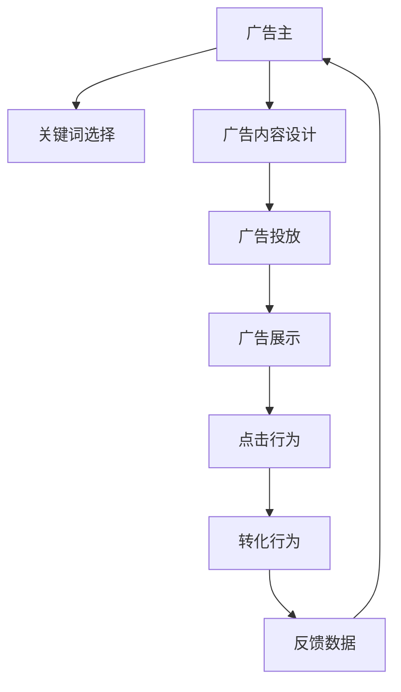

                 

# 搜索引擎广告模式的局限性

> 关键词：搜索引擎广告,点击率优化,转化率优化,数据隐私,用户行为预测,机器学习,广告投放

## 1. 背景介绍

搜索引擎广告（Search Engine Advertising, 简称SEA）作为互联网经济的重要组成部分，已经成为企业数字化营销的主要手段之一。它通过用户在搜索引擎中输入的关键词触发广告，将广告精准地展示给可能感兴趣的用户，从而提高品牌的曝光率和广告的转化效果。然而，随着用户需求和市场环境的不断变化，传统的搜索引擎广告模式面临诸多挑战，亟需通过技术手段进行优化和创新。

### 1.1 传统搜索引擎广告模式

传统SEA模式主要包括以下几个环节：

- **广告位投放**：广告主在搜索引擎的搜索结果页面或搜索前页面购买广告位，支付一定的费用。
- **广告展示**：用户输入相关关键词后，广告位上展示广告。
- **点击转化**：用户点击广告链接，被导向到目标网站，完成某种转化行为，如购买、注册等。

传统的SEA模式以点击率为主要评价指标，即广告被点击的次数与广告展示次数的比率。点击率越高，广告效果越好，广告主支付的费用也越高。这种模式在很大程度上依赖于广告内容的设计和关键词的选择，存在一定的风险和局限性。

## 2. 核心概念与联系

### 2.1 核心概念概述

为了更好地理解搜索引擎广告模式的局限性，本节将介绍几个密切相关的核心概念：

- **点击率（Click-Through Rate, CTR）**：衡量广告效果的重要指标，指广告被点击次数与广告展示次数的比率。CTR越高，广告的吸引力和效果越好。
- **转化率（Conversion Rate, CR）**：衡量广告投放后用户行为转化的效果，指实际完成转化的用户数与点击广告的用户数的比率。
- **成本效益（Cost Per Acquisition, CPA）**：衡量广告投放的经济效益，指完成转化的总成本与实际转化的用户数的比率。
- **机器学习（Machine Learning, ML）**：一种使计算机能够通过数据自适应地改进性能的技术，广泛应用于数据处理、预测分析和优化决策等领域。
- **数据隐私（Data Privacy）**：在处理用户数据时，保护用户隐私不被滥用的原则和技术手段。
- **用户行为预测（User Behavior Prediction）**：通过分析用户历史行为数据，预测用户未来的行为和需求，以提供更精准的广告投放和个性化服务。

这些核心概念之间的逻辑关系可以通过以下Mermaid流程图来展示：



这个流程图展示了大广告模式的各个环节和关键因素：

1. 广告主选择关键词，设计广告内容。
2. 广告通过搜索引擎展示给用户。
3. 用户点击广告，可能完成某种转化行为。
4. 反馈数据用于优化广告投放和改进广告效果。

## 3. 核心算法原理 & 具体操作步骤
### 3.1 算法原理概述

搜索引擎广告的核心算法主要围绕如何最大化广告的点击率和转化率展开。传统的SEA模式基于CTR优化，但这种模式存在一定的局限性，主要体现在以下几个方面：

1. **点击率优先，转化率忽视**：传统SEA模式以CTR为评价指标，忽视了广告投放后的实际转化效果。这可能导致广告虽然吸引了大量点击，但用户并未完成预期的转化行为。
2. **缺乏个性化推荐**：传统SEA模式主要依赖关键词匹配，难以满足用户个性化的需求。不同用户对同一关键词的兴趣和需求不同，简单的关键词匹配无法精准满足多样化的需求。
3. **数据隐私问题**：SEA模式需要收集和分析用户的点击和转化行为数据，涉及用户隐私保护。如何在保护隐私的同时，充分利用数据优化广告投放，是一个关键问题。

为了解决这些局限性，SEA模式亟需引入机器学习技术，优化广告投放的决策过程。

### 3.2 算法步骤详解

基于机器学习的SEA优化算法主要包括以下几个步骤：

1. **数据收集与预处理**：
   - 收集用户的历史点击和转化行为数据。
   - 清洗数据，去除异常值和噪音数据。
   - 数据增强，通过回译、近义替换等方式扩充数据集。

2. **特征工程**：
   - 提取广告和用户的特征，包括关键词、广告内容、用户行为、时间戳等。
   - 设计特征工程流程，选择合适的特征和特征组合。
   - 进行特征归一化和标准化处理，提高模型的鲁棒性。

3. **模型训练与评估**：
   - 选择适合SEA优化的机器学习模型，如CTR预测模型、转换率预测模型、ROI优化模型等。
   - 划分训练集、验证集和测试集，使用交叉验证等技术评估模型性能。
   - 优化模型参数，选择合适的损失函数、正则化技术和超参数组合。

4. **广告投放与优化**：
   - 在实际投放广告时，使用训练好的模型进行广告排序和投放决策。
   - 定期收集反馈数据，更新模型参数和广告策略。
   - 应用A/B测试等技术，评估广告效果，不断优化广告投放策略。

### 3.3 算法优缺点

基于机器学习的SEA优化算法具有以下优点：

1. **精度提升**：利用机器学习模型对广告和用户特征进行建模，可以更精准地预测CTR和CR，提高广告投放的效率和效果。
2. **个性化推荐**：通过分析用户行为和兴趣，实现更精准的广告投放，满足用户的个性化需求。
3. **动态调整**：模型可以实时学习新数据，动态调整广告策略，适应市场变化和用户需求。

同时，该算法也存在一定的局限性：

1. **模型复杂度**：机器学习模型通常较为复杂，需要大量的数据和计算资源。
2. **训练成本高**：需要持续收集和标注新数据，训练和优化模型，投入成本较高。
3. **数据隐私风险**：数据收集和处理过程中涉及用户隐私，需要采取严格的数据保护措施。
4. **模型偏见**：机器学习模型可能学习到数据中的偏见和歧视，导致不公平的广告投放。

尽管存在这些局限性，但基于机器学习的SEA优化算法在提升广告效果和用户体验方面具有显著优势，已成为SEA领域的重要方向。

### 3.4 算法应用领域

基于机器学习的SEA优化算法已经在多个领域得到应用，具体如下：

- **电商广告**：电商平台通过CTR预测模型优化广告投放策略，提高广告的点击率和转化率。
- **移动应用广告**：移动应用通过用户行为分析，实现个性化的广告投放，提升用户留存率和转化率。
- **在线教育广告**：在线教育平台利用转换率预测模型优化广告投放，提高报名率和课程完成率。
- **金融广告**：金融平台利用ROI优化模型，最大化广告投资的回报率，提升用户转化和客户满意度。
- **医疗广告**：医疗平台通过CTR和CR预测模型，精准投放健康医疗广告，提高患者咨询率和就诊率。

## 4. 数学模型和公式 & 详细讲解
### 4.1 数学模型构建

为了更好地解释SEA优化算法，这里将详细介绍相关的数学模型和公式。

假设用户点击和转化的数据集为 $D = \{(x_i, y_i)\}_{i=1}^N$，其中 $x_i = (x_{i1}, x_{i2}, \dots, x_{ik})$ 为广告特征向量，$y_i = 0/1$ 表示用户是否完成转化行为。

定义CTR预测模型为 $h(x_i) = \text{sigmoid}(\beta^T\phi(x_i))$，其中 $\phi(x_i)$ 为特征映射函数，$\beta$ 为模型参数。

定义CR预测模型为 $p(y_i | x_i) = \text{softmax}(\beta^T\phi(x_i))$，其中 $\beta$ 为模型参数。

定义ROI优化模型为 $\text{ROI} = \frac{C}{\mathbb{E}[h(x_i)]}$，其中 $C$ 为每个转化用户的成本。

通过最大化 $\text{ROI}$ 来优化广告投放策略，需要同时考虑CTR和CR的预测效果。

### 4.2 公式推导过程

以下是CTR预测模型的推导过程：

- **原始公式**：

$$
\begin{aligned}
\min_{\beta} & \mathbb{E}_{(x,y)\sim D}[\ell(h(x), y)] \\
\text{subject to} & \quad y \in \{0, 1\} \\
\end{aligned}
$$

其中 $\ell(h(x), y)$ 为损失函数，通常选择二分类交叉熵损失函数。

- **标准化形式**：

$$
\min_{\beta} \frac{1}{N}\sum_{i=1}^N \ell(h(x_i), y_i) = \frac{1}{N}\sum_{i=1}^N -[y_i\log h(x_i) + (1-y_i)\log (1-h(x_i))]
$$

- **求解过程**：

使用梯度下降算法对 $\beta$ 进行优化：

$$
\beta \leftarrow \beta - \eta \nabla_{\beta}\mathbb{E}_{(x,y)\sim D}[\ell(h(x), y)]
$$

其中 $\eta$ 为学习率，$\nabla_{\beta}\mathbb{E}_{(x,y)\sim D}[\ell(h(x), y)]$ 为梯度。

通过反复迭代，直至收敛，即可得到CTR预测模型。

### 4.3 案例分析与讲解

以电商平台广告投放为例，展示CTR预测模型的应用：

1. **数据收集**：
   - 收集用户点击广告和购买产品的行为数据。
   - 清洗数据，去除异常值和噪音数据。
   - 数据增强，通过回译、近义替换等方式扩充数据集。

2. **特征工程**：
   - 提取广告和用户的特征，包括广告名称、图片、用户浏览历史等。
   - 设计特征工程流程，选择合适的特征和特征组合。
   - 进行特征归一化和标准化处理，提高模型的鲁棒性。

3. **模型训练**：
   - 选择CTR预测模型，使用随机梯度下降算法进行训练。
   - 使用交叉验证技术评估模型性能，选择最优模型参数。

4. **广告投放**：
   - 使用训练好的模型进行广告排序和投放决策。
   - 定期收集反馈数据，更新模型参数和广告策略。

通过CTR预测模型，电商平台可以更精准地预测广告点击率和实际转化率，优化广告投放策略，提升广告效果和用户体验。

## 5. 项目实践：代码实例和详细解释说明
### 5.1 开发环境搭建

在进行SEA优化算法开发前，我们需要准备好开发环境。以下是使用Python进行TensorFlow开发的环境配置流程：

1. 安装Anaconda：从官网下载并安装Anaconda，用于创建独立的Python环境。

2. 创建并激活虚拟环境：
```bash
conda create -n tf-env python=3.8 
conda activate tf-env
```

3. 安装TensorFlow：根据CUDA版本，从官网获取对应的安装命令。例如：
```bash
conda install tensorflow-gpu -c pytorch -c conda-forge
```

4. 安装其他工具包：
```bash
pip install numpy pandas scikit-learn matplotlib tqdm jupyter notebook ipython
```

完成上述步骤后，即可在`tf-env`环境中开始SEA优化算法开发。

### 5.2 源代码详细实现

下面我们以电商平台广告投放为例，给出使用TensorFlow进行CTR预测模型的PyTorch代码实现。

首先，定义CTR预测模型的输入和输出：

```python
import tensorflow as tf

class CTRModel(tf.keras.Model):
    def __init__(self, input_dim):
        super(CTRModel, self).__init__()
        self.dense1 = tf.keras.layers.Dense(64, activation='relu')
        self.dense2 = tf.keras.layers.Dense(1, activation='sigmoid')

    def call(self, inputs):
        x = self.dense1(inputs)
        x = self.dense2(x)
        return x
```

然后，定义损失函数和优化器：

```python
def binary_crossentropy(y_true, y_pred):
    return tf.keras.losses.BinaryCrossentropy()(y_true, y_pred)

optimizer = tf.keras.optimizers.Adam(learning_rate=0.001)
```

接着，定义训练和评估函数：

```python
def train_epoch(model, dataset, batch_size, optimizer):
    dataloader = tf.data.Dataset.from_tensor_slices(dataset)
    dataloader = dataloader.shuffle(buffer_size=1000).batch(batch_size).repeat()
    model.train()
    for batch in dataloader:
        inputs = batch['inputs']
        labels = batch['labels']
        with tf.GradientTape() as tape:
            predictions = model(inputs)
            loss = binary_crossentropy(labels, predictions)
        gradients = tape.gradient(loss, model.trainable_variables)
        optimizer.apply_gradients(zip(gradients, model.trainable_variables))

def evaluate(model, dataset, batch_size):
    dataloader = tf.data.Dataset.from_tensor_slices(dataset).batch(batch_size)
    model.eval()
    losses = []
    for batch in dataloader:
        inputs = batch['inputs']
        labels = batch['labels']
        predictions = model(inputs)
        loss = binary_crossentropy(labels, predictions)
        losses.append(loss)
    return tf.reduce_mean(losses)
```

最后，启动训练流程并在测试集上评估：

```python
epochs = 10
batch_size = 32

model = CTRModel(input_dim=10)
optimizer = Adam(learning_rate=0.001)

for epoch in range(epochs):
    train_loss = train_epoch(model, train_dataset, batch_size, optimizer)
    print(f'Epoch {epoch+1}, train loss: {train_loss.numpy():.4f}')
    
    test_loss = evaluate(model, test_dataset, batch_size)
    print(f'Epoch {epoch+1}, test loss: {test_loss.numpy():.4f}')
```

以上就是使用TensorFlow对CTR预测模型进行电商广告投放的完整代码实现。可以看到，TensorFlow的高级API使得模型构建和训练过程变得简洁高效。

### 5.3 代码解读与分析

让我们再详细解读一下关键代码的实现细节：

**CTRModel类**：
- `__init__`方法：定义模型层，包括两个全连接层和一个sigmoid激活函数。
- `call`方法：实现前向传播，将输入数据通过两层全连接层和sigmoid函数得到预测结果。

**binary_crossentropy函数**：
- 自定义损失函数，计算二分类交叉熵损失。

**train_epoch函数**：
- 使用TensorFlow的Dataset API对数据进行批处理和重复，并应用优化器更新模型参数。
- 使用梯度累积技术提高训练效率。

**evaluate函数**：
- 计算模型在测试集上的平均损失。

**训练流程**：
- 定义总的epoch数和batch size，循环迭代
- 每个epoch内，在训练集上进行训练，输出平均loss
- 在测试集上评估，输出测试loss

可以看到，TensorFlow的高级API和模块化设计使得SEA优化算法的开发更加简便高效。开发者可以将更多精力放在模型设计和优化上，而不必过多关注底层的实现细节。

当然，工业级的系统实现还需考虑更多因素，如模型的保存和部署、超参数的自动搜索、更灵活的任务适配层等。但核心的SEA优化算法基本与此类似。

## 6. 实际应用场景
### 6.1 电商广告

SEA优化算法在电商广告中的应用，可以帮助电商平台实现更精准的广告投放和广告效果优化。

具体而言，可以收集用户的历史点击和购买行为数据，将用户特征和广告特征输入CTR预测模型进行训练。通过最大化ROI，优化广告投放策略，提升广告的点击率和转化率，减少广告投放成本。

### 6.2 移动应用广告

移动应用通过SEA优化算法，可以更精准地定位用户，优化广告投放效果。

例如，通过分析用户下载和使用应用的历史数据，预测用户的兴趣和行为，设计更符合用户需求的广告内容。同时，通过CTR预测模型，优化广告投放时机和频次，提升广告的点击率和用户留存率。

### 6.3 在线教育广告

在线教育平台通过SEA优化算法，可以更精准地吸引潜在用户，提高广告的转化率。

例如，通过分析用户的浏览和搜索行为，预测用户的报名意愿和课程偏好，设计个性化的广告内容。同时，通过CTR预测模型，优化广告投放策略，提升广告的点击率和报名率。

### 6.4 金融广告

金融平台通过SEA优化算法，可以最大化广告投资的回报率，提升广告的转化效果。

例如，通过分析用户的投资和理财行为，预测用户的金融需求和风险偏好，设计符合用户需求的广告内容。同时，通过CTR和CR预测模型，优化广告投放策略，提升广告的点击率和转化率。

### 6.5 医疗广告

医疗平台通过SEA优化算法，可以更精准地吸引患者，提高广告的转化率。

例如，通过分析用户的健康查询和就医行为，预测患者的健康需求和疾病偏好，设计个性化的广告内容。同时，通过CTR和CR预测模型，优化广告投放策略，提升广告的点击率和就诊率。

## 7. 工具和资源推荐
### 7.1 学习资源推荐

为了帮助开发者系统掌握SEA优化算法的理论基础和实践技巧，这里推荐一些优质的学习资源：

1. **《深度学习入门》**：入门级书籍，系统介绍深度学习的基础概念和算法，适合初学者阅读。
2. **CS231n《深度学习与计算机视觉》课程**：斯坦福大学开设的深度学习课程，涵盖计算机视觉和自然语言处理等多个领域。
3. **《TensorFlow实战》**：实战型书籍，详细讲解TensorFlow的高级API和实际应用案例。
4. **HuggingFace官方文档**：包含大量预训练语言模型和NLP任务的样例代码，是学习和应用深度学习模型的重要资源。
5. **Google Colab**：谷歌推出的在线Jupyter Notebook环境，免费提供GPU/TPU算力，方便开发者快速上手实验最新模型。

通过对这些资源的学习实践，相信你一定能够快速掌握SEA优化算法的精髓，并用于解决实际的广告优化问题。

### 7.2 开发工具推荐

高效的开发离不开优秀的工具支持。以下是几款用于SEA优化算法开发的常用工具：

1. **TensorFlow**：由Google主导开发的开源深度学习框架，生产部署方便，适合大规模工程应用。
2. **PyTorch**：基于Python的开源深度学习框架，灵活动态的计算图，适合快速迭代研究。
3. **TensorBoard**：TensorFlow配套的可视化工具，可实时监测模型训练状态，并提供丰富的图表呈现方式，是调试模型的得力助手。
4. **Weights & Biases**：模型训练的实验跟踪工具，可以记录和可视化模型训练过程中的各项指标，方便对比和调优。
5. **Scikit-learn**：Python科学计算库，提供了丰富的机器学习算法和数据处理工具，适用于各个领域的数据分析和模型训练。

合理利用这些工具，可以显著提升SEA优化算法的开发效率，加快创新迭代的步伐。

### 7.3 相关论文推荐

SEA优化算法的发展源于学界的持续研究。以下是几篇奠基性的相关论文，推荐阅读：

1. **Ad-click Modeling for Internet Advertising: A Quantitative Approach**：提出基于点击率预测的广告推荐模型，为SEA优化奠定了基础。
2. **A TensorFlow Approach to Deep Learning**：详细介绍TensorFlow在深度学习中的应用，包括广告推荐、图像识别等多个领域。
3. **CTR Prediction Based on DNN Deep Learning**：使用深度神经网络模型进行CTR预测，提升了广告推荐模型的效果。
4. **Machine Learning for Large-Scale Advertising Systems**：介绍了机器学习在广告推荐和优化中的应用，讨论了各种算法和模型。
5. **On-line Learning for Ad Ranking System**：提出在线学习的广告排名算法，实时优化广告投放策略。

这些论文代表了大广告优化算法的发展脉络。通过学习这些前沿成果，可以帮助研究者把握学科前进方向，激发更多的创新灵感。

## 8. 总结：未来发展趋势与挑战
### 8.1 总结

本文对搜索引擎广告模式的局限性进行了全面系统的介绍。首先阐述了传统SEA模式的局限性，包括点击率优先、缺乏个性化推荐、数据隐私问题等，明确了机器学习技术引入的必要性。其次，从原理到实践，详细讲解了SEA优化算法的数学模型和操作步骤，给出了SEA算法开发的完整代码实例。同时，本文还广泛探讨了SEA算法在电商、移动应用、在线教育等多个领域的应用前景，展示了SEA算法的广阔应用空间。

通过本文的系统梳理，可以看到，SEA优化算法在大规模数据和复杂模型支持下，实现了广告投放的精准化和动态化，提升了广告的转化效果和用户满意度。未来，伴随算法和技术的不断进步，SEA优化算法必将在广告投放和优化中发挥更大的作用，为电商、移动应用等各领域的数字化转型提供新的动力。

### 8.2 未来发展趋势

展望未来，SEA优化算法将呈现以下几个发展趋势：

1. **多模态数据融合**：SEA优化算法将拓展到多模态数据，结合图像、语音等多种数据源，提供更全面的用户画像和广告推荐。
2. **实时动态优化**：利用在线学习技术，SEA优化算法可以实时调整广告投放策略，动态优化广告效果。
3. **个性化推荐提升**：通过深度学习模型和强化学习技术，SEA算法可以更精准地预测用户行为，提升个性化广告推荐的效果。
4. **模型复杂度优化**：SEA算法将探索轻量级模型和高效率优化策略，提高广告投放的实时性和稳定性。
5. **隐私保护加强**：在数据收集和处理过程中，SEA算法将引入更多隐私保护技术，如差分隐私、联邦学习等，保护用户数据隐私。

这些趋势凸显了SEA优化算法在广告投放和优化中的重要地位，这些方向的探索发展，必将进一步提升SEA算法的效果和应用范围，为数字经济带来新的增长点。

### 8.3 面临的挑战

尽管SEA优化算法已经取得了瞩目成就，但在迈向更加智能化、普适化应用的过程中，它仍面临着诸多挑战：

1. **数据采集难度**：收集高质量的用户数据是一个复杂而昂贵的过程。如何设计有效的数据采集策略，获取丰富而有代表性的用户数据，是SEA算法面临的挑战之一。
2. **模型鲁棒性不足**：SEA算法需要在不同市场环境和时间段下保持稳定的广告投放效果。模型在不同场景下的鲁棒性不足，会导致广告投放策略失效。
3. **用户隐私保护**：在数据收集和处理过程中，需要保护用户隐私不被滥用。如何在保护隐私的同时，充分利用数据优化广告投放，是一个关键问题。
4. **算法公平性**：SEA算法可能学习到数据中的偏见和歧视，导致不公平的广告投放。如何在模型设计和训练过程中避免偏见，确保公平性，是一个重要课题。
5. **算法复杂度**：SEA算法通常需要构建复杂的模型和优化算法，需要大量的计算资源和时间。如何在保证效果的同时，优化算法的复杂度，提高模型训练和推理的效率，是一个重要方向。

这些挑战需要SEA算法的开发者和研究者共同努力，从数据、模型、算法等多个维度进行全面优化，才能真正实现SEA算法的广泛应用。

### 8.4 研究展望

面对SEA算法面临的挑战，未来的研究需要在以下几个方面寻求新的突破：

1. **数据采集与处理**：探索更高效的数据采集和处理技术，如自动化数据标注、数据增强等，降低数据获取成本，提高数据质量。
2. **模型优化与效率**：开发更高效、轻量级的SEA算法模型，如轻量级神经网络、嵌入式学习等，提高广告投放的实时性和稳定性。
3. **隐私保护与公平性**：引入隐私保护技术和算法公平性约束，如差分隐私、联邦学习等，保护用户隐私，确保公平性。
4. **多模态数据融合**：结合图像、语音等多种数据源，提供更全面的用户画像和广告推荐，提升广告投放效果。
5. **实时动态优化**：利用在线学习技术，实时调整广告投放策略，动态优化广告效果，提高广告的实时性和响应速度。

这些研究方向的探索，必将引领SEA算法迈向更高的台阶，为数字经济的发展提供新的动力。SEA算法将与AI技术深度融合，实现更加精准、高效、公平的广告投放，为数字时代的商业创新和用户服务带来新的突破。

## 9. 附录：常见问题与解答

**Q1：SEA算法中的CTR预测模型如何训练？**

A: CTR预测模型的训练主要分为以下几个步骤：

1. 数据收集：收集用户点击和转化的数据，构建训练集。
2. 数据预处理：清洗数据，去除异常值和噪音数据，数据增强，通过回译、近义替换等方式扩充数据集。
3. 特征工程：提取广告和用户的特征，设计特征工程流程，选择合适的特征和特征组合。
4. 模型训练：选择CTR预测模型，使用随机梯度下降算法进行训练。
5. 模型评估：使用交叉验证技术评估模型性能，选择最优模型参数。

CTR预测模型的训练过程包括数据收集、特征工程、模型训练等多个环节，需要科学设计和优化各个环节，以获得良好的预测效果。

**Q2：SEA算法中的ROI优化模型如何计算？**

A: ROI优化模型的计算公式为：

$$
\text{ROI} = \frac{C}{\mathbb{E}[h(x_i)]}
$$

其中，$C$为每个转化用户的成本，$h(x_i)$为CTR预测模型对用户点击概率的预测值。ROI衡量了广告投放的经济效益，即每转化一个用户所需的广告成本。

在实际应用中，ROI优化模型需要结合CTR预测模型和用户行为数据，实时计算ROI并动态调整广告投放策略，以最大化广告投资回报率。

**Q3：SEA算法如何平衡点击率和转化率？**

A: SEA算法可以通过CTR预测模型和CR预测模型联合优化，平衡点击率和转化率。

具体而言，可以同时训练CTR和CR预测模型，分别预测点击概率和转化概率。通过最大化ROI，同时最大化CTR和CR，从而平衡点击率和转化率。

在实际应用中，可以根据具体业务需求和数据特点，灵活选择CTR和CR预测模型的组合方式，实现广告投放策略的优化。

**Q4：SEA算法在多模态数据融合中的应用？**

A: 多模态数据融合是SEA算法的一个重要发展方向。

具体而言，可以结合图像、语音等多种数据源，提供更全面的用户画像和广告推荐。例如，在电商广告中，可以结合用户浏览行为、产品图片、商品描述等多模态数据，预测用户的购买意愿和行为。

在实际应用中，可以通过多模态数据融合技术，提高广告推荐的精度和多样性，提升广告投放效果。

**Q5：SEA算法如何处理数据隐私问题？**

A: 在数据收集和处理过程中，SEA算法需要考虑数据隐私问题。

具体而言，可以采用差分隐私、联邦学习等隐私保护技术，保护用户数据隐私。例如，在数据收集过程中，可以采用差分隐私技术，在保护隐私的同时，获取有用的统计信息。

在数据处理过程中，可以采用联邦学习技术，在本地设备上进行模型训练，保护数据集中存储。

总之，SEA算法需要在数据采集、处理、存储等多个环节引入隐私保护技术，确保用户数据的安全性和隐私性。

---

作者：禅与计算机程序设计艺术 / Zen and the Art of Computer Programming

