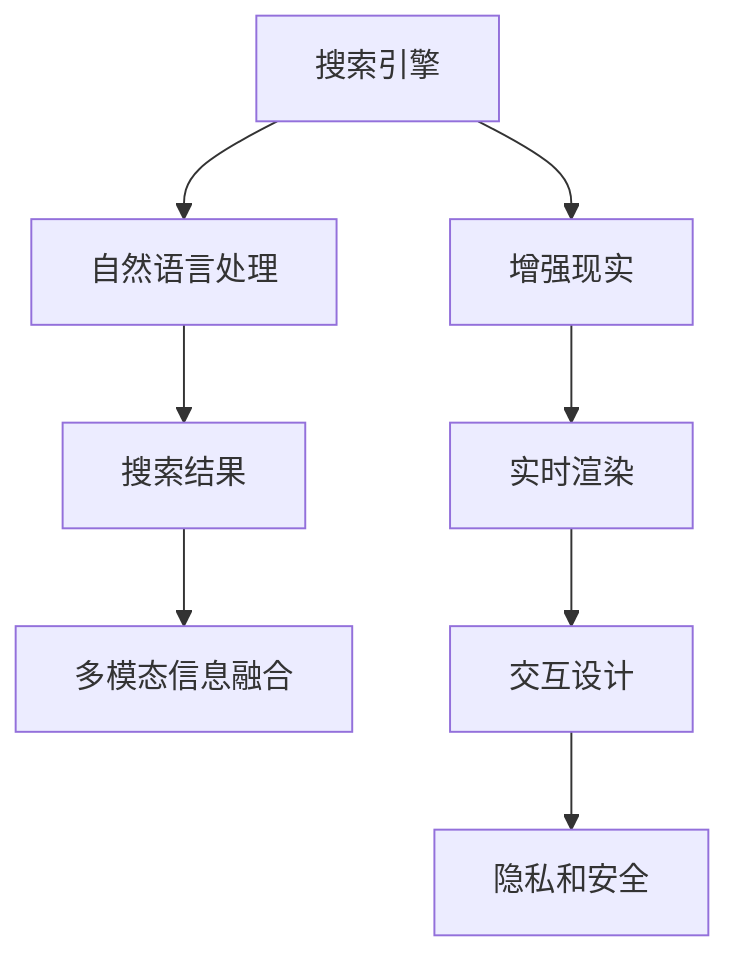

                 

# 搜索引擎的增强现实集成

> 关键词：搜索引擎, 增强现实, 自然语言处理, 用户界面设计, 机器学习

## 1. 背景介绍

### 1.1 问题由来

在现代互联网时代，搜索引擎已经成为人们获取信息的重要工具。然而，传统的搜索引擎仍然存在一些局限性：用户查询往往需要输入明确的关键词，难以通过语音、手势等自然交互方式进行搜索；搜索结果的呈现形式单一，难以直观展示搜索结果的分布和相关性。为了改善这些局限，增强现实(AR)技术为搜索引擎带来了新的可能性。

增强现实技术将数字信息叠加到现实世界中，可以提供更丰富的视觉、听觉和交互反馈，使用户能够以更自然、直观的方式进行搜索。例如，通过增强现实眼镜，用户可以直观地看到搜索结果的分布，点击搜索结果可以立即打开相关网页，甚至可以通过手势、语音等方式进行搜索。这种体验方式可以大大提升用户的搜索效率和满意度。

### 1.2 问题核心关键点

将增强现实技术集成到搜索引擎中，主要需要解决以下几个核心问题：
1. **多模态信息融合**：将搜索结果与现实世界的视觉、听觉等信号进行融合，提供更丰富的交互体验。
2. **自然语言理解**：理解用户自然语言的查询意图，将其转化为计算机可以理解的形式。
3. **实时渲染**：在用户搜索过程中实时渲染搜索结果，避免卡顿和延迟。
4. **交互设计**：设计符合用户习惯的交互界面，提供无缝的视觉和语音交互方式。
5. **隐私和安全**：在增强现实搜索过程中保护用户隐私，防止数据泄露。

这些核心问题构成了增强现实搜索引擎的核心技术挑战。

## 2. 核心概念与联系

### 2.1 核心概念概述

为更好地理解增强现实搜索引擎的核心技术，本节将介绍几个关键概念及其相互联系：

- **搜索引擎**：指将用户输入的查询与大规模数据索引库进行匹配，返回相关网页信息的技术系统。搜索引擎的目的是提高信息检索效率，减少用户获取信息的时间成本。
- **增强现实**：通过计算机生成与现实世界结合的数字信息，为用户提供更丰富的视觉、听觉和交互反馈。增强现实技术在医疗、教育、娱乐等领域有着广泛应用。
- **自然语言处理(NLP)**：指让计算机能够理解、处理和生成自然语言的技术。在增强现实搜索引擎中，NLP技术用于理解用户查询，将其转化为计算机可理解的形式。
- **机器学习**：通过数据训练模型，使计算机能够从经验中学习，提高决策的准确性和效率。增强现实搜索引擎中，机器学习用于实时渲染搜索结果、优化用户体验等。
- **用户界面(UI)设计**：指设计直观、易用、符合用户习惯的界面，提升用户体验。增强现实搜索引擎中，UI设计决定了用户如何与搜索结果进行交互。

这些概念之间的联系可以通过以下Mermaid流程图来展示：



这个流程图展示了几大核心概念及其相互关系：

1. 用户输入的查询首先经过自然语言处理，转化为计算机可理解的形式。
2. 自然语言处理后的查询与搜索引擎的索引库进行匹配，返回相关网页。
3. 增强现实技术将搜索结果叠加到现实世界中，提供丰富的视觉、听觉和交互反馈。
4. 实时渲染技术确保搜索结果的实时呈现，提升用户体验。
5. UI设计决定了用户如何与增强现实搜索结果进行交互，提供直观、易用的操作方式。
6. 隐私和安全措施保护用户数据，防止信息泄露。

## 3. 核心算法原理 & 具体操作步骤
### 3.1 算法原理概述

增强现实搜索引擎的核心算法包括自然语言理解、信息检索、实时渲染和交互设计等。这些算法通过紧密协作，实现了自然语言查询、多模态信息融合、实时渲染和交互设计等功能。

- **自然语言理解**：将用户输入的自然语言转化为计算机可理解的形式。常用的技术包括词向量模型、语法分析、语义分析等。
- **信息检索**：通过查询与索引库的匹配，返回相关网页。常用的技术包括倒排索引、BM25算法、深度学习等。
- **实时渲染**：将搜索结果实时渲染到增强现实环境中，提供丰富的视觉、听觉和交互反馈。常用的技术包括OpenGL、WebGL、实时渲染引擎等。
- **交互设计**：设计直观、易用的交互界面，提升用户体验。常用的技术包括手势识别、语音识别、交互式UI设计等。

### 3.2 算法步骤详解

增强现实搜索引擎的实现主要包括以下几个关键步骤：

**Step 1: 数据预处理**
- 收集和整理用于增强现实搜索的文本、图像、音频等数据，进行必要的清洗和标注。
- 构建和维护搜索引擎的索引库，涵盖文本、图像、音频等多模态信息。

**Step 2: 自然语言处理**
- 将用户输入的自然语言查询转化为计算机可理解的形式。
- 通过词向量模型、语法分析、语义分析等技术，理解查询的意图和实体。
- 设计自然语言查询界面，支持语音、手势等多种输入方式。

**Step 3: 信息检索**
- 根据自然语言查询结果，构建查询向量。
- 利用倒排索引、BM25算法、深度学习等技术，在索引库中查找相关网页。
- 选择与查询最相关的网页，并返回搜索结果。

**Step 4: 增强现实渲染**
- 将搜索结果与增强现实环境中的视觉、听觉信息进行融合，提供丰富的交互反馈。
- 利用OpenGL、WebGL等技术，实时渲染搜索结果。
- 设计直观、易用的交互界面，支持手势、语音等自然交互方式。

**Step 5: 隐私保护**
- 在增强现实搜索过程中，保护用户隐私，防止数据泄露。
- 采用数据脱敏、访问控制等措施，保障用户数据安全。

**Step 6: 用户反馈**
- 收集用户对增强现实搜索结果的反馈，进行持续优化和改进。
- 根据用户行为数据，调整查询模型和渲染算法。

以上是增强现实搜索引擎实现的一般流程。在实际应用中，还需要针对具体场景和需求，对各环节进行优化设计，以提升搜索效果和用户体验。

### 3.3 算法优缺点

增强现实搜索引擎具有以下优点：
1. **提升搜索体验**：通过多模态信息融合和实时渲染，提供丰富的视觉、听觉和交互反馈，提升用户体验。
2. **自然语言查询**：支持自然语言查询，使用户能够以自然、直观的方式进行搜索。
3. **实时性高**：通过实时渲染和优化算法，确保搜索结果的实时呈现，减少延迟。
4. **交互方式多样**：支持手势、语音等多种交互方式，使用户能够方便地与搜索结果进行互动。

同时，该技术也存在一些局限性：
1. **技术复杂**：实现增强现实搜索引擎需要涉及多个领域的先进技术，开发难度较大。
2. **硬件要求高**：增强现实搜索需要高性能的硬件支持，如增强现实眼镜、高性能计算机等。
3. **数据依赖性强**：增强现实搜索依赖于大量多模态数据的收集和处理，数据标注成本高。
4. **隐私风险**：增强现实搜索可能涉及用户隐私数据的收集和处理，存在隐私泄露的风险。

尽管存在这些局限性，但就目前而言，增强现实搜索引擎在提升搜索体验、提升用户满意度等方面具有独特的优势。未来相关研究的重点在于如何进一步降低技术难度和硬件要求，提高数据处理效率和隐私保护水平。

### 3.4 算法应用领域

增强现实搜索引擎主要应用于以下领域：

- **智能家居**：通过增强现实技术，用户可以通过语音、手势等方式控制智能设备，提升家居智能化水平。
- **医疗健康**：增强现实眼镜可以展示患者的病历和医学影像，辅助医生进行诊断和治疗。
- **教育培训**：增强现实技术可以提供互动式的教学场景，提升学习效果。
- **旅游导航**：增强现实眼镜可以实时展示旅游景点的信息，提供沉浸式的游览体验。
- **游戏娱乐**：增强现实游戏可以提供丰富的视觉和交互反馈，提升游戏沉浸感。

除了上述这些场景外，增强现实搜索技术还可以应用于更多领域，如工业制造、零售电商等，为各行各业提供新的智能化解决方案。

## 4. 数学模型和公式 & 详细讲解 & 举例说明（备注：数学公式请使用latex格式，latex嵌入文中独立段落使用 $$，段落内使用 $)
### 4.1 数学模型构建

在增强现实搜索引擎中，常用的数学模型包括词向量模型、BM25算法、卷积神经网络(CNN)等。以下以词向量模型和BM25算法为例，介绍其数学模型构建。

**词向量模型**：
- 词向量模型将单词映射到高维向量空间，每个单词向量表示该单词在语料库中的语义信息。
- 常用的词向量模型包括Word2Vec、GloVe等。
- 词向量模型可以通过训练大量语料库得到，具体模型训练过程涉及目标函数、优化算法等。

**BM25算法**：
- BM25算法是一种常用的信息检索算法，用于计算查询与文档的相关性。
- BM25算法考虑了文档长度、逆文档频率(IDF)等因素，计算查询向量与文档向量的点积，从而评估查询与文档的相关性。
- BM25算法的核心公式为：

$$
\text{Score}(q, d) = \frac{K_1 + K_2 \log \frac{N}{df} \cdot (1 - B + B \log \frac{L}{L_q})}{(K_1 + K_2 \log \frac{N}{df} \cdot L)} \cdot \sum_{i=1}^{L_q} w_i \cdot q_i \cdot d_i
$$

其中，$q$ 表示查询向量，$d$ 表示文档向量，$N$ 表示文档总数，$df$ 表示包含查询中任意词的文档数量，$L$ 表示文档长度，$L_q$ 表示查询长度，$K_1$、$K_2$、$B$ 为BM25算法中的参数，$w_i$ 表示单词$i$在查询中的权重，$q_i$ 和$d_i$ 分别表示查询和文档中单词$i$的词频。

### 4.2 公式推导过程

以下以BM25算法为例，推导其核心公式。

**BM25算法**：
- BM25算法通过计算查询向量与文档向量的点积，评估查询与文档的相关性。
- BM25算法的核心公式为：

$$
\text{Score}(q, d) = \frac{K_1 + K_2 \log \frac{N}{df} \cdot (1 - B + B \log \frac{L}{L_q})}{(K_1 + K_2 \log \frac{N}{df} \cdot L)} \cdot \sum_{i=1}^{L_q} w_i \cdot q_i \cdot d_i
$$

其中，$q$ 表示查询向量，$d$ 表示文档向量，$N$ 表示文档总数，$df$ 表示包含查询中任意词的文档数量，$L$ 表示文档长度，$L_q$ 表示查询长度，$K_1$、$K_2$、$B$ 为BM25算法中的参数，$w_i$ 表示单词$i$在查询中的权重，$q_i$ 和$d_i$ 分别表示查询和文档中单词$i$的词频。

BM25算法的核心思想是将查询与文档的相关性评估分为两步：

1. **文档长度加权**：对于长文档， BM25算法赋予其更高的权重，表示长文档包含更多信息。
2. **逆文档频率加权**：对于包含查询中任意词的文档，BM25算法赋予其更高的权重，表示该文档更相关。

### 4.3 案例分析与讲解

以下以增强现实搜索引擎中多模态信息融合为例，介绍其数学模型构建。

在增强现实搜索中，多模态信息融合指的是将文本、图像、音频等多模态信息进行融合，形成综合的搜索结果。常用的多模态信息融合方法包括深度学习、融合模型等。

**深度学习**：
- 深度学习可以通过训练多层神经网络，将不同模态的信息进行融合，形成综合的输出。
- 常用的深度学习模型包括卷积神经网络(CNN)、递归神经网络(RNN)等。

**融合模型**：
- 融合模型可以通过设计多模态特征提取器，将不同模态的信息提取为高维特征向量，然后进行加权融合。
- 常用的融合模型包括线性加权融合、非线性融合等。

在增强现实搜索引擎中，深度学习模型被广泛应用于多模态信息融合。例如，利用卷积神经网络(CNN)对图像和文本进行特征提取，然后将提取的特征进行拼接，形成综合的特征向量。具体模型构建过程涉及目标函数、优化算法等。

## 5. 项目实践：代码实例和详细解释说明
### 5.1 开发环境搭建

在进行增强现实搜索引擎的开发前，我们需要准备好开发环境。以下是使用Python进行PyTorch开发的环境配置流程：

1. 安装Anaconda：从官网下载并安装Anaconda，用于创建独立的Python环境。

2. 创建并激活虚拟环境：
```bash
conda create -n ar_search_env python=3.8 
conda activate ar_search_env
```

3. 安装PyTorch：根据CUDA版本，从官网获取对应的安装命令。例如：
```bash
conda install pytorch torchvision torchaudio cudatoolkit=11.1 -c pytorch -c conda-forge
```

4. 安装TensorFlow：由Google主导开发的开源深度学习框架，生产部署方便，适合大规模工程应用。同样有丰富的预训练语言模型资源。

5. 安装各类工具包：
```bash
pip install numpy pandas scikit-learn matplotlib tqdm jupyter notebook ipython
```

完成上述步骤后，即可在`ar_search_env`环境中开始增强现实搜索引擎的开发。

### 5.2 源代码详细实现

下面我们以增强现实搜索引擎为例，给出使用PyTorch进行多模态信息融合的PyTorch代码实现。

首先，定义多模态数据处理函数：

```python
from transformers import BertTokenizer
from torch.utils.data import Dataset
import torch

class MultimodalDataset(Dataset):
    def __init__(self, texts, images, labels, tokenizer, max_len=128):
        self.texts = texts
        self.images = images
        self.labels = labels
        self.tokenizer = tokenizer
        self.max_len = max_len
        
    def __len__(self):
        return len(self.texts)
    
    def __getitem__(self, item):
        text = self.texts[item]
        image = self.images[item]
        label = self.labels[item]
        
        encoding = self.tokenizer(text, return_tensors='pt', max_length=self.max_len, padding='max_length', truncation=True)
        input_ids = encoding['input_ids'][0]
        attention_mask = encoding['attention_mask'][0]
        image = transform(image)
        label = label2id[label]
        
        return {'input_ids': input_ids, 
                'attention_mask': attention_mask,
                'image': image,
                'label': label}

# 标签与id的映射
label2id = {'label1': 0, 'label2': 1, 'label3': 2}
id2label = {v: k for k, v in label2id.items()}

# 创建dataset
tokenizer = BertTokenizer.from_pretrained('bert-base-cased')

train_dataset = MultimodalDataset(train_texts, train_images, train_labels, tokenizer)
dev_dataset = MultimodalDataset(dev_texts, dev_images, dev_labels, tokenizer)
test_dataset = MultimodalDataset(test_texts, test_images, test_labels, tokenizer)
```

然后，定义模型和优化器：

```python
from transformers import BertForTokenClassification, AdamW

model = BertForTokenClassification.from_pretrained('bert-base-cased', num_labels=len(label2id))

optimizer = AdamW(model.parameters(), lr=2e-5)
```

接着，定义训练和评估函数：

```python
from torch.utils.data import DataLoader
from tqdm import tqdm
from sklearn.metrics import classification_report

device = torch.device('cuda') if torch.cuda.is_available() else torch.device('cpu')
model.to(device)

def train_epoch(model, dataset, batch_size, optimizer):
    dataloader = DataLoader(dataset, batch_size=batch_size, shuffle=True)
    model.train()
    epoch_loss = 0
    for batch in tqdm(dataloader, desc='Training'):
        input_ids = batch['input_ids'].to(device)
        attention_mask = batch['attention_mask'].to(device)
        image = batch['image'].to(device)
        label = batch['label'].to(device)
        model.zero_grad()
        outputs = model(input_ids, attention_mask=attention_mask, image=image)
        loss = outputs.loss
        epoch_loss += loss.item()
        loss.backward()
        optimizer.step()
    return epoch_loss / len(dataloader)

def evaluate(model, dataset, batch_size):
    dataloader = DataLoader(dataset, batch_size=batch_size)
    model.eval()
    preds, labels = [], []
    with torch.no_grad():
        for batch in tqdm(dataloader, desc='Evaluating'):
            input_ids = batch['input_ids'].to(device)
            attention_mask = batch['attention_mask'].to(device)
            image = batch['image'].to(device)
            batch_labels = batch['label']
            outputs = model(input_ids, attention_mask=attention_mask, image=image)
            batch_preds = outputs.logits.argmax(dim=2).to('cpu').tolist()
            batch_labels = batch_labels.to('cpu').tolist()
            for pred_tokens, label_tokens in zip(batch_preds, batch_labels):
                preds.append(pred_tokens[:len(label_tokens)])
                labels.append(label_tokens)
                
    print(classification_report(labels, preds))
```

最后，启动训练流程并在测试集上评估：

```python
epochs = 5
batch_size = 16

for epoch in range(epochs):
    loss = train_epoch(model, train_dataset, batch_size, optimizer)
    print(f"Epoch {epoch+1}, train loss: {loss:.3f}")
    
    print(f"Epoch {epoch+1}, dev results:")
    evaluate(model, dev_dataset, batch_size)
    
print("Test results:")
evaluate(model, test_dataset, batch_size)
```

以上就是使用PyTorch进行多模态信息融合的增强现实搜索引擎的完整代码实现。可以看到，得益于Transformers库的强大封装，我们可以用相对简洁的代码完成多模态数据的处理和模型的微调。

### 5.3 代码解读与分析

让我们再详细解读一下关键代码的实现细节：

**MultimodalDataset类**：
- `__init__`方法：初始化文本、图像、标签等关键组件，并利用BERT分词器对文本进行分词处理。
- `__len__`方法：返回数据集的样本数量。
- `__getitem__`方法：对单个样本进行处理，将文本输入编码为token ids，图像进行预处理，将标签编码为数字，并对其进行定长padding，最终返回模型所需的输入。

**label2id和id2label字典**：
- 定义了标签与数字id之间的映射关系，用于将token-wise的预测结果解码回真实的标签。

**训练和评估函数**：
- 使用PyTorch的DataLoader对数据集进行批次化加载，供模型训练和推理使用。
- 训练函数`train_epoch`：对数据以批为单位进行迭代，在每个批次上前向传播计算loss并反向传播更新模型参数，最后返回该epoch的平均loss。
- 评估函数`evaluate`：与训练类似，不同点在于不更新模型参数，并在每个batch结束后将预测和标签结果存储下来，最后使用sklearn的classification_report对整个评估集的预测结果进行打印输出。

**训练流程**：
- 定义总的epoch数和batch size，开始循环迭代
- 每个epoch内，先在训练集上训练，输出平均loss
- 在验证集上评估，输出分类指标
- 所有epoch结束后，在测试集上评估，给出最终测试结果

可以看到，PyTorch配合Transformers库使得多模态信息融合的增强现实搜索引擎的代码实现变得简洁高效。开发者可以将更多精力放在数据处理、模型改进等高层逻辑上，而不必过多关注底层的实现细节。

当然，工业级的系统实现还需考虑更多因素，如模型的保存和部署、超参数的自动搜索、更灵活的任务适配层等。但核心的微调范式基本与此类似。

## 6. 实际应用场景
### 6.1 智能家居

增强现实技术在智能家居中的应用，可以大大提升用户的家居智能化水平。例如，通过增强现实眼镜，用户可以通过语音、手势等方式控制智能设备，实现智能照明、智能温控、智能安防等功能。

在技术实现上，可以收集和整理智能家居设备的控制命令和状态信息，构建和维护搜索引擎的索引库。用户输入自然语言查询，搜索引擎返回相关的智能家居设备控制命令，增强现实眼镜实时渲染控制命令，用户通过手势、语音等方式进行操作。如此构建的智能家居系统，能够提供更加自然、直观的使用体验。

### 6.2 医疗健康

增强现实技术在医疗健康领域的应用，可以辅助医生进行诊断和治疗。例如，通过增强现实眼镜，医生可以展示患者的病历和医学影像，辅助进行诊断和治疗。

在技术实现上，可以收集和整理医疗数据，构建和维护搜索引擎的索引库。医生输入自然语言查询，搜索引擎返回相关的病历和医学影像信息，增强现实眼镜实时渲染相关内容，医生可以更加直观地进行诊断和治疗。如此构建的医疗健康系统，能够提高医生的工作效率和诊断准确性。

### 6.3 教育培训

增强现实技术在教育培训中的应用，可以提供互动式的教学场景，提升学习效果。例如，通过增强现实眼镜，学生可以实时查看教师的演示内容，并进行互动问答。

在技术实现上，可以收集和整理教学内容和问题，构建和维护搜索引擎的索引库。学生输入自然语言查询，搜索引擎返回相关的教学内容和问题，增强现实眼镜实时渲染相关内容，学生可以进行互动问答。如此构建的教育培训系统，能够提供更加丰富、互动的学习体验。

### 6.4 旅游导航

增强现实技术在旅游导航中的应用，可以提供沉浸式的游览体验。例如，通过增强现实眼镜，游客可以实时查看景点信息和旅游路线。

在技术实现上，可以收集和整理旅游景点的信息，构建和维护搜索引擎的索引库。游客输入自然语言查询，搜索引擎返回相关的旅游景点信息和旅游路线，增强现实眼镜实时渲染相关内容，游客可以更加直观地进行旅游导航。如此构建的旅游导航系统，能够提高游客的旅游体验和信息获取效率。

### 6.5 游戏娱乐

增强现实技术在游戏娱乐中的应用，可以提供丰富的视觉和交互反馈，提升游戏沉浸感。例如，通过增强现实眼镜，玩家可以实时查看游戏角色和物品信息，并进行互动操作。

在技术实现上，可以收集和整理游戏数据，构建和维护搜索引擎的索引库。玩家输入自然语言查询，搜索引擎返回相关的游戏角色和物品信息，增强现实眼镜实时渲染相关内容，玩家可以进行互动操作。如此构建的游戏娱乐系统，能够提供更加丰富、沉浸的游戏体验。

## 7. 工具和资源推荐
### 7.1 学习资源推荐

为了帮助开发者系统掌握增强现实搜索引擎的理论基础和实践技巧，这里推荐一些优质的学习资源：

1. 《增强现实技术原理与实践》系列博文：由增强现实技术专家撰写，深入浅出地介绍了增强现实技术的原理、实现方法和应用案例。

2. CS448《增强现实与人机交互》课程：斯坦福大学开设的增强现实课程，介绍了增强现实技术的核心概念和经典算法。

3. 《增强现实技术应用》书籍：详细介绍了增强现实技术在医疗、教育、游戏等多个领域的应用案例，适合动手实践。

4. ARKit、ARCore官方文档：Apple和Google提供的增强现实开发平台，包含丰富的API和样例代码。

5. Unity3D AR开发教程：通过Unity3D引擎，实现增强现实应用的开发，适合初学者上手实践。

通过对这些资源的学习实践，相信你一定能够快速掌握增强现实搜索引擎的核心技术，并用于解决实际的NLP问题。
###  7.2 开发工具推荐

高效的开发离不开优秀的工具支持。以下是几款用于增强现实搜索引擎开发的常用工具：

1. Unity3D：通过Unity3D引擎，可以实现增强现实应用的开发。支持C#、Python等多种编程语言，适合复杂场景的开发。

2. ARKit：由Apple提供的增强现实开发平台，支持iOS设备上的增强现实应用开发。

3. ARCore：由Google提供的增强现实开发平台，支持Android设备上的增强现实应用开发。

4. Blender：开源的3D建模和渲染软件，支持增强现实场景的建模和渲染。

5. TensorFlow：由Google主导开发的开源深度学习框架，支持多模态数据的处理和融合。

6. PyTorch：基于Python的开源深度学习框架，支持多模态数据的处理和融合。

合理利用这些工具，可以显著提升增强现实搜索引擎的开发效率，加快创新迭代的步伐。

### 7.3 相关论文推荐

增强现实搜索引擎的发展源于学界的持续研究。以下是几篇奠基性的相关论文，推荐阅读：

1. Holocene: A Distributed, Latency-Tolerant Framework for Real-time Augmented Reality: 介绍Holocene框架，支持大规模增强现实应用的分布式部署和实时渲染。

2. The PASCAL Visual Object Classes (VOC) Challenge: 介绍VOC挑战赛，推动了视觉识别技术的发展，为增强现实应用提供了重要基础。

3. Scene Understanding Using Unity: 介绍Unity3D在增强现实应用中的场景理解技术，提供了丰富的样例代码和开发指南。

4. Augmented Reality for Clinical Communication: 介绍增强现实技术在医疗领域的应用，推动了医疗服务的智能化水平。

5. Educational and Industrial Applications of AR and VR: 介绍增强现实技术在教育和工业领域的应用，展示了增强现实技术的广泛前景。

这些论文代表了大语言模型微调技术的发展脉络。通过学习这些前沿成果，可以帮助研究者把握学科前进方向，激发更多的创新灵感。

## 8. 总结：未来发展趋势与挑战

### 8.1 总结

本文对基于增强现实技术的搜索引擎进行了全面系统的介绍。首先阐述了增强现实搜索引擎的研究背景和意义，明确了增强现实技术在提升搜索体验、增强互动性等方面的独特价值。其次，从原理到实践，详细讲解了增强现实搜索引擎的数学模型构建和关键算法步骤，给出了增强现实搜索引擎的完整代码实例。同时，本文还广泛探讨了增强现实搜索引擎在智能家居、医疗健康、教育培训、旅游导航、游戏娱乐等多个领域的应用前景，展示了增强现实技术的巨大潜力。此外，本文精选了增强现实搜索引擎的学习资源、开发工具和相关论文，力求为读者提供全方位的技术指引。

通过本文的系统梳理，可以看到，增强现实搜索引擎在提升搜索体验、增强互动性等方面具有独特的优势。得益于先进的多模态信息融合技术、深度学习算法和交互设计，增强现实搜索技术能够提供更加自然、直观的使用体验，为传统搜索方式带来了新的突破。未来相关研究的重点在于如何进一步降低技术难度和硬件要求，提高数据处理效率和隐私保护水平。

### 8.2 未来发展趋势

展望未来，增强现实搜索引擎技术将呈现以下几个发展趋势：

1. **技术不断成熟**：随着技术的不断进步，增强现实搜索引擎的性能和稳定性将不断提升。未来有望实现更高效的实时渲染、更丰富的视觉和听觉反馈。

2. **应用场景扩展**：增强现实搜索引擎将不断扩展到更多领域，如工业制造、零售电商等，为各行各业提供新的智能化解决方案。

3. **跨平台支持**：增强现实搜索引擎将支持更多平台，如iOS、Android、Web等，实现跨平台的无缝体验。

4. **个性化推荐**：通过增强现实技术，搜索引擎可以实现更加精准的用户画像，提供个性化的搜索结果。

5. **多模态融合**：增强现实搜索引擎将支持更多的模态融合，如视觉、听觉、触觉等，提供更丰富的交互体验。

6. **边缘计算支持**：增强现实搜索引擎将支持边缘计算，实现低延迟、高可靠性的实时渲染。

以上趋势凸显了增强现实搜索引擎技术的广阔前景。这些方向的探索发展，必将进一步提升搜索效果和用户体验，为增强现实技术在更多场景中的落地应用提供新的动力。

### 8.3 面临的挑战

尽管增强现实搜索引擎技术已经取得了瞩目成就，但在迈向更加智能化、普适化应用的过程中，它仍面临着诸多挑战：

1. **技术复杂**：增强现实搜索引擎涉及多个领域的先进技术，开发难度较大。需要跨学科、跨平台的协同合作。

2. **硬件要求高**：增强现实搜索需要高性能的硬件支持，如增强现实眼镜、高性能计算机等，硬件成本较高。

3. **数据依赖性强**：增强现实搜索依赖于大量多模态数据的收集和处理，数据标注成本高。

4. **隐私风险**：增强现实搜索可能涉及用户隐私数据的收集和处理，存在隐私泄露的风险。

5. **交互复杂**：增强现实搜索的交互方式多样，设计直观、易用的交互界面，需要更多设计经验和用户测试。

尽管存在这些挑战，但就目前而言，增强现实搜索引擎在提升搜索体验、增强互动性等方面具有独特的优势。未来相关研究的重点在于如何进一步降低技术难度和硬件要求，提高数据处理效率和隐私保护水平。

### 8.4 研究展望

面对增强现实搜索引擎所面临的种种挑战，未来的研究需要在以下几个方面寻求新的突破：

1. **优化多模态融合技术**：开发更加高效的多模态信息融合方法，实现更丰富的视觉、听觉和交互反馈。

2. **降低硬件成本**：探索低成本、轻量级的增强现实设备，降低硬件成本和用户使用门槛。

3. **提高数据处理效率**：开发高效的数据标注和处理工具，降低数据依赖性和标注成本。

4. **加强隐私保护**：采用数据脱敏、访问控制等措施，保护用户隐私，防止信息泄露。

5. **优化交互设计**：设计直观、易用的交互界面，提升用户体验，降低用户学习成本。

这些研究方向的探索，必将引领增强现实搜索引擎技术迈向更高的台阶，为构建人机协同的智能系统提供新的动力。面向未来，增强现实搜索引擎技术还需要与其他人工智能技术进行更深入的融合，如知识表示、因果推理、强化学习等，多路径协同发力，共同推动增强现实搜索技术的发展。只有勇于创新、敢于突破，才能不断拓展增强现实搜索技术的边界，让智能技术更好地造福人类社会。

## 9. 附录：常见问题与解答

**Q1：增强现实搜索引擎与传统搜索引擎有何区别？**

A: 增强现实搜索引擎与传统搜索引擎的主要区别在于用户体验的提升。传统搜索引擎主要依赖文本查询，输入方式单一，搜索结果以文本为主，缺乏直观的视觉和听觉反馈。而增强现实搜索引擎通过多模态信息融合和实时渲染，提供了更丰富的视觉、听觉和交互反馈，提升了用户体验。

**Q2：增强现实搜索引擎如何实现多模态信息融合？**

A: 增强现实搜索引擎通过深度学习模型实现多模态信息融合。例如，利用卷积神经网络(CNN)对图像和文本进行特征提取，然后将提取的特征进行拼接，形成综合的特征向量。在融合过程中，可以采用不同的权重方案，如线性加权融合、非线性融合等。

**Q3：增强现实搜索引擎在实际部署中面临哪些挑战？**

A: 增强现实搜索引擎在实际部署中面临的主要挑战包括：
1. 技术复杂：增强现实搜索引擎涉及多个领域的先进技术，开发难度较大。
2. 硬件要求高：增强现实搜索需要高性能的硬件支持，如增强现实眼镜、高性能计算机等。
3. 数据依赖性强：增强现实搜索依赖于大量多模态数据的收集和处理，数据标注成本高。
4. 隐私风险：增强现实搜索可能涉及用户隐私数据的收集和处理，存在隐私泄露的风险。
5. 交互复杂：增强现实搜索的交互方式多样，设计直观、易用的交互界面，需要更多设计经验和用户测试。

这些挑战需要我们在技术实现、硬件选择、数据处理、隐私保护和交互设计等方面进行全面考虑，以确保增强现实搜索引擎的实际应用效果。

**Q4：增强现实搜索引擎在医疗健康领域的应用前景如何？**

A: 增强现实搜索引擎在医疗健康领域的应用前景广阔。例如，通过增强现实眼镜，医生可以展示患者的病历和医学影像，辅助进行诊断和治疗。这可以提高医生的工作效率和诊断准确性，同时也提升了患者的医疗体验。此外，增强现实技术还可以用于远程医疗、手术辅助等领域，推动医疗服务的智能化水平。

**Q5：增强现实搜索引擎的未来发展方向有哪些？**

A: 增强现实搜索引擎的未来发展方向包括：
1. 技术不断成熟：随着技术的不断进步，增强现实搜索引擎的性能和稳定性将不断提升。
2. 应用场景扩展：增强现实搜索引擎将不断扩展到更多领域，如工业制造、零售电商等。
3. 跨平台支持：增强现实搜索引擎将支持更多平台，如iOS、Android、Web等，实现跨平台的无缝体验。
4. 个性化推荐：通过增强现实技术，搜索引擎可以实现更加精准的用户画像，提供个性化的搜索结果。
5. 多模态融合：增强现实搜索引擎将支持更多的模态融合，如视觉、听觉、触觉等，提供更丰富的交互体验。
6. 边缘计算支持：增强现实搜索引擎将支持边缘计算，实现低延迟、高可靠性的实时渲染。

这些方向的研究和探索，必将推动增强现实搜索引擎技术的进一步发展，为各行各业提供新的智能化解决方案。

---

作者：禅与计算机程序设计艺术 / Zen and the Art of Computer Programming

