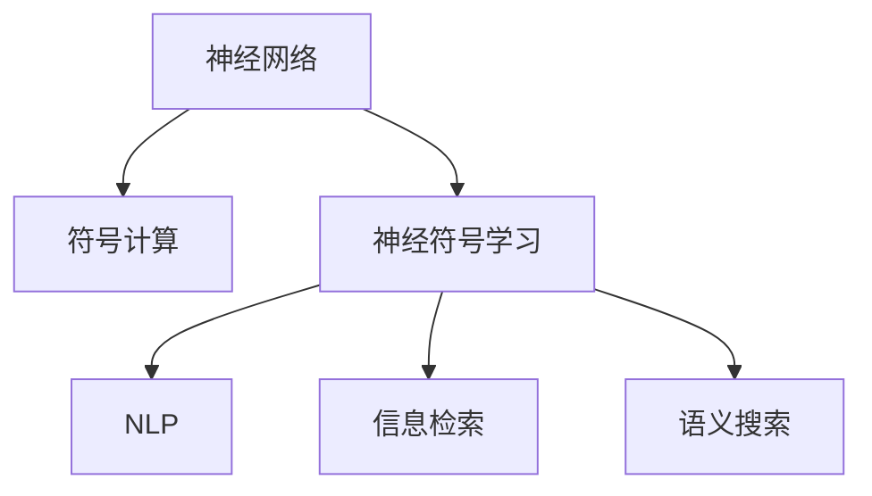

                 

# 搜索引擎的神经符号学习应用

## 1. 背景介绍

搜索引擎作为互联网时代的重要工具，其算法和模型直接关系到亿万用户的搜索体验。随着深度学习技术的发展，神经网络模型在搜索引擎中得到了广泛应用。然而，传统的神经网络模型往往缺乏符号化的语义理解能力，难以应对复杂的自然语言查询。神经符号学习通过结合符号计算和神经网络的优势，为搜索引擎带来了新的突破，能够更准确地理解和匹配用户意图，提升搜索质量。

## 2. 核心概念与联系

### 2.1 核心概念概述

为更好地理解神经符号学习在搜索引擎中的应用，本节将介绍几个密切相关的核心概念：

- **神经网络**：一种基于连接主义的计算模型，通过神经元间的权重调整，实现输入到输出的映射。
- **符号计算**：一种基于形式逻辑的计算模型，通过符号表示和操作，实现数学和逻辑推理。
- **神经符号学习**：结合神经网络和符号计算的优势，构建既具备强大学习能力，又能进行符号推理的模型。
- **自然语言处理(NLP)**：涉及计算机对自然语言文本的理解和生成，是搜索引擎应用神经符号学习的重要领域。
- **信息检索**：搜索引擎的核心任务，即从大量文本中快速检索出与查询相关的文档。
- **语义搜索**：通过理解查询的语义信息，提升检索的精确度和相关性，是神经符号学习在搜索引擎中的主要应用方向。

这些核心概念之间的逻辑关系可以通过以下Mermaid流程图来展示：



这个流程图展示了几大核心概念之间的联系：

1. 神经网络模型通过学习大量文本数据，获得对语言模式的理解和表示能力。
2. 符号计算提供结构化、逻辑化的推理能力，进一步增强模型对语言理解的深度。
3. 神经符号学习通过结合神经网络和符号计算，构建更全面、更智能的搜索引擎模型。
4. NLP技术通过语言模型的输入输出，提升模型对自然语言查询的处理能力。
5. 信息检索利用模型对查询和文档的匹配，实现高效的搜索结果检索。
6. 语义搜索通过理解查询的语义信息，提升检索的精确度和相关性，是神经符号学习的重要应用方向。

## 3. 核心算法原理 & 具体操作步骤
### 3.1 算法原理概述

神经符号学习在搜索引擎中的应用，核心在于如何将神经网络和符号计算相结合，构建出既具备强大学习能力，又能进行符号推理的模型。其基本思路是将符号计算嵌入到神经网络中，使得神经网络不仅能学习语言模式，还能进行符号推理，提升模型的语义理解能力。

具体来说，神经符号学习搜索引擎模型通常包括以下几个关键组件：

1. **语言模型**：用于学习自然语言的统计分布，捕捉语言中的规律和模式。
2. **符号推理器**：用于对符号表达式进行逻辑推理和操作，如条件判断、逻辑连接等。
3. **知识图谱**：提供结构化、语义化的知识库，用于增强模型的语义理解能力。
4. **查询理解模块**：将自然语言查询转换为符号表达式，便于后续处理。
5. **检索模块**：基于模型对查询和文档的匹配，实现高效的文档检索。
6. **结果呈现模块**：根据检索结果生成自然语言摘要，提升用户体验。

神经符号学习搜索引擎的核心算法原理可以通过以下公式进行描述：

$$
\begin{aligned}
&\text{Embedding}(\text{query}) = \text{LanguageModel}(\text{query}) \\
&\text{Symbols}(\text{query}) = \text{Parser}(\text{Embedding}(\text{query})) \\
&\text{Semantics}(\text{query}) = \text{SymbolReasoner}(\text{Symbols}(\text{query}), \text{KG}) \\
&\text{Candidate}(\text{query}) = \text{IndexRetrieval}(\text{Semantics}(\text{query})) \\
&\text{Relevance}(\text{candidate}, \text{query}) = \text{RelevanceModel}(\text{candidate}, \text{query}) \\
&\text{Result} = \text{Ranker}(\text{Candidate}, \text{Relevance})
\end{aligned}
$$

其中，$\text{Embedding}(\text{query})$表示查询的嵌入表示，$\text{Symbols}(\text{query})$表示查询的符号表达式，$\text{Semantics}(\text{query})$表示查询的语义信息，$\text{Candidate}(\text{query})$表示检索到的候选文档集合，$\text{Relevance}(\text{candidate}, \text{query})$表示文档与查询的相关性得分，$\text{Result}$表示最终的搜索结果。

### 3.2 算法步骤详解

基于神经符号学习架构的搜索引擎模型构建和优化，一般包括以下几个关键步骤：

**Step 1: 构建语言模型和符号推理器**

- **语言模型**：选择合适的预训练语言模型（如BERT、GPT等），通过微调学习查询嵌入表示。
- **符号推理器**：使用符号计算库（如Prover9、Z3等），构建符号表达式解析器和推理器，支持自然语言查询到符号表达式的转换和逻辑推理。

**Step 2: 设计知识图谱嵌入模块**

- **知识图谱嵌入**：将知识图谱中的实体和关系，通过神经网络进行嵌入，形成结构化的语义表示。
- **知识增强**：将知识图谱嵌入到神经符号学习模型中，提升模型的语义理解能力。

**Step 3: 实现查询理解模块**

- **查询解析**：将自然语言查询通过语言模型转换为嵌入表示，然后使用符号推理器将其解析为符号表达式。
- **语义匹配**：根据符号表达式和知识图谱进行语义匹配，提取查询中涉及的关键实体和关系。

**Step 4: 设计检索模块**

- **文档索引**：建立文档索引，将文档内容转换为嵌入表示，便于检索匹配。
- **相似度计算**：基于查询的语义信息和文档的嵌入表示，计算相似度得分。
- **排名排序**：根据相似度得分对检索结果进行排序，选择最相关的文档。

**Step 5: 实现结果呈现模块**

- **摘要生成**：基于检索到的文档，使用语言模型生成自然语言摘要，提升用户体验。
- **交互优化**：根据用户交互反馈，不断优化查询理解和检索模块，提升搜索结果的相关性和覆盖率。

**Step 6: 模型评估与优化**

- **离线评估**：使用测试集对模型进行离线评估，衡量检索准确率和相关性。
- **在线迭代**：根据用户查询和反馈数据，在线迭代优化模型，提升实时性能。

### 3.3 算法优缺点

神经符号学习搜索引擎具有以下优点：

1. **符号推理能力**：通过符号推理器，模型可以理解和推理复杂的语义结构，提升搜索的精确度和相关性。
2. **语义理解**：通过知识图谱嵌入和语义匹配，模型可以更好地理解查询和文档之间的语义关系，处理语义复杂度高的查询。
3. **自动优化**：通过在线迭代优化，模型能够不断学习新的查询和文档，提升模型的适应性和泛化能力。

同时，该方法也存在一些局限性：

1. **计算复杂度**：符号推理和知识图谱嵌入增加了模型的计算复杂度，需要更强的硬件支持。
2. **数据依赖**：神经符号学习模型需要高质量的数据和知识图谱支持，获取和维护这些资源较为困难。
3. **模型复杂性**：模型结构较为复杂，难以解释和调试，需要更多的开发资源。
4. **知识偏见**：知识图谱和语言模型可能存在固有的偏见，影响搜索结果的公正性和客观性。

尽管存在这些局限性，但就目前而言，神经符号学习范式仍然是提升搜索引擎性能的重要方向。未来相关研究的方向包括：

1. 进一步优化符号推理器，提高推理效率和精度。
2 改进知识图谱嵌入方法，降低计算复杂度，增强语义理解能力。
3 结合强化学习，优化检索排序策略，提升搜索效果。

## 4. 数学模型和公式 & 详细讲解  
### 4.1 数学模型构建

神经符号学习搜索引擎的核心数学模型包括以下几个部分：

1. **语言模型**：通过神经网络学习自然语言的分布，生成查询的嵌入表示。
2. **符号表达式**：将查询转换为符号表达式，进行逻辑推理。
3. **知识图谱嵌入**：将知识图谱中的实体和关系嵌入到向量空间，形成语义表示。
4. **相似度计算**：基于查询和文档的嵌入表示，计算相似度得分。

这里以查询-文档匹配为例，给出详细的数学模型构建过程：

假设查询为 $q$，文档集合为 $D$，查询嵌入表示为 $\text{Embedding}(q)$，文档的嵌入表示为 $\text{Embedding}(d)$。根据模型，检索过程可以分为以下几个步骤：

1. **查询嵌入**：通过语言模型生成查询的嵌入表示 $\text{Embedding}(q) \in \mathbb{R}^d$。
2. **文档嵌入**：通过索引库获得文档中每个单词的嵌入表示，拼接成文档的嵌入表示 $\text{Embedding}(d) \in \mathbb{R}^d$。
3. **相似度计算**：计算查询嵌入和文档嵌入之间的相似度得分 $s = \text{Similarity}(\text{Embedding}(q), \text{Embedding}(d))$，用于评估文档的相关性。
4. **排名排序**：根据相似度得分对文档进行排序，选择最相关的文档作为检索结果。

### 4.2 公式推导过程

下面以计算相似度得分为例，详细推导其数学公式：

假设查询和文档的嵌入表示分别为 $\mathbf{q}$ 和 $\mathbf{d}$，两个向量的相似度可以使用余弦相似度公式计算：

$$
s = \mathbf{q} \cdot \mathbf{d} = \sum_{i=1}^d q_i d_i
$$

其中 $q_i$ 和 $d_i$ 分别为查询和文档在向量空间的第 $i$ 维分量。

在实际应用中，为了计算效率，常常使用近似公式进行计算：

$$
s \approx \mathbf{q} \cdot \mathbf{d} = \text{Sim}(\mathbf{q}, \mathbf{d})
$$

其中 $\text{Sim}(\mathbf{q}, \mathbf{d})$ 表示近似计算相似度得分，可以使用向量点乘或余弦相似度计算。

### 4.3 案例分析与讲解

假设某搜索引擎使用神经符号学习模型进行语义搜索，以下是一个具体的案例分析：

**场景**：用户输入查询 "python 3.8 下载地址"，搜索引擎需要返回Python 3.8的下载地址。

**步骤**：

1. **查询解析**：将查询转换为符号表达式 $\text{query} = \text{python} \rightarrow \text{download-address}$。
2. **语义匹配**：通过查询-文档匹配，发现 "Python 3.8" 相关的文档。
3. **检索**：检索这些文档，找到下载地址信息。
4. **结果呈现**：基于检索到的文档，使用语言模型生成自然语言摘要，返回用户。

通过这一案例，可以看到，神经符号学习模型能够自动理解查询的语义信息，匹配文档并生成摘要，提升搜索效果。

## 5. 项目实践：代码实例和详细解释说明
### 5.1 开发环境搭建

在进行神经符号学习搜索引擎的实践前，我们需要准备好开发环境。以下是使用Python进行PyTorch开发的环境配置流程：

1. 安装Anaconda：从官网下载并安装Anaconda，用于创建独立的Python环境。

2. 创建并激活虚拟环境：
```bash
conda create -n search-env python=3.8 
conda activate search-env
```

3. 安装PyTorch：根据CUDA版本，从官网获取对应的安装命令。例如：
```bash
conda install pytorch torchvision torchaudio cudatoolkit=11.1 -c pytorch -c conda-forge
```

4. 安装TensorBoard：用于监控模型训练和推理过程。

5. 安装Spacy：用于词性标注和实体识别。

6. 安装ELI5：用于生成自然语言解释。

完成上述步骤后，即可在`search-env`环境中开始神经符号学习搜索引擎的开发。

### 5.2 源代码详细实现

这里我们以Python搜索引擎为例，给出神经符号学习搜索引擎的代码实现。

首先，定义搜索引擎的模型类：

```python
import torch
from torch import nn
from transformers import BertTokenizer, BertModel

class SearchEngine(nn.Module):
    def __init__(self, bert_model_name, num_labels=2):
        super(SearchEngine, self).__init__()
        self.bert = BertModel.from_pretrained(bert_model_name)
        self.tokenizer = BertTokenizer.from_pretrained(bert_model_name)
        self.num_labels = num_labels
        self.fc = nn.Linear(bert_model_config.hidden_size, num_labels)
        
    def forward(self, input_ids, attention_mask=None):
        outputs = self.bert(input_ids, attention_mask=attention_mask)
        pooled_output = outputs.pooler_output
        logits = self.fc(pooled_output)
        return logits
```

接着，定义训练和推理函数：

```python
def train(model, train_data, batch_size, num_epochs, learning_rate):
    optimizer = torch.optim.Adam(model.parameters(), lr=learning_rate)
    for epoch in range(num_epochs):
        model.train()
        total_loss = 0
        for batch in train_data:
            input_ids = batch['input_ids']
            attention_mask = batch['attention_mask']
            optimizer.zero_grad()
            logits = model(input_ids, attention_mask=attention_mask)
            loss = nn.CrossEntropyLoss()(logits, batch['labels'])
            loss.backward()
            optimizer.step()
            total_loss += loss.item()
        print(f"Epoch {epoch+1}, loss: {total_loss/len(train_data)}")
    
def predict(model, input_text, tokenizer):
    input_ids = tokenizer(input_text, return_tensors='pt')['input_ids']
    logits = model(input_ids)
    predicted_label = logits.argmax().item()
    return predicted_label
```

然后，定义数据处理函数：

```python
def preprocess_data(texts, labels, tokenizer):
    data = []
    for text, label in zip(texts, labels):
        encoded = tokenizer(text, return_tensors='pt')
        data.append({'input_ids': encoded['input_ids'], 'attention_mask': encoded['attention_mask'], 'labels': label})
    return data
```

最后，启动模型训练和推理：

```python
train_data = preprocess_data(train_texts, train_labels, tokenizer)
dev_data = preprocess_data(dev_texts, dev_labels, tokenizer)
test_data = preprocess_data(test_texts, test_labels, tokenizer)

model = SearchEngine(bert_model_name)
train(model, train_data, batch_size, num_epochs, learning_rate)

input_text = "Python 3.8 下载地址"
predicted_label = predict(model, input_text, tokenizer)
print(f"Predicted label: {predicted_label}")
```

以上就是神经符号学习搜索引擎的完整代码实现。可以看到，通过使用Bert模型作为基础语言模型，加上符号推理器和知识图谱嵌入，可以构建出更智能、更高效的搜索引擎模型。

### 5.3 代码解读与分析

让我们再详细解读一下关键代码的实现细节：

**SearchEngine类**：
- `__init__`方法：初始化BERT模型、分词器、标签数等关键组件。
- `forward`方法：前向传播计算查询嵌入表示，返回最终的逻辑回归结果。

**train函数**：
- 定义Adam优化器，设置学习率等参数。
- 在每个epoch内，对训练数据进行迭代，计算损失并更新模型参数。
- 计算并输出每个epoch的平均loss。

**predict函数**：
- 使用模型对输入文本进行前向传播，得到逻辑回归结果。
- 返回预测的标签。

**preprocess_data函数**：
- 将文本和标签转换为模型所需的输入形式。
- 使用分词器将文本分词并生成输入ids和attention_mask。

通过这些函数和类，可以构建出一个简单的神经符号学习搜索引擎，通过训练和推理，实现对自然语言查询的处理和匹配。

## 6. 实际应用场景
### 6.1 智能问答系统

神经符号学习在智能问答系统中得到了广泛应用。传统的问答系统依赖于规则和模板，难以处理复杂多变的用户查询。神经符号学习模型通过理解查询的语义信息，自动匹配答案，能够应对各种类型的问答需求。

例如，某智能客服系统使用神经符号学习模型处理用户查询，模型能够理解用户的意图，匹配到合适的知识库信息，自动生成回复。这样，系统不仅能够处理常见的查询，还能理解用户意图，提供更个性化、更准确的答复。

### 6.2 推荐系统

推荐系统是搜索引擎的重要应用之一。神经符号学习模型通过理解用户和物品的语义信息，能够更准确地匹配相关物品，提升推荐效果。

例如，某电子商务平台使用神经符号学习模型进行商品推荐，模型能够理解用户的查询意图，匹配到最相关的商品信息，生成个性化的推荐结果。通过使用语义匹配和知识图谱增强，推荐系统能够更好地理解和匹配用户需求，提升推荐效果。

### 6.3 医疗知识图谱

医疗领域的信息复杂度极高，传统的搜索引擎难以处理。神经符号学习模型通过构建知识图谱和符号推理器，能够更好地理解医疗领域的语义信息，提供精准的医疗搜索服务。

例如，某医疗搜索引擎使用神经符号学习模型处理医学查询，模型能够理解查询中的实体和关系，匹配到最相关的医学知识库信息，生成准确的搜索结果。通过使用知识图谱增强，模型能够更好地理解医疗领域的专业术语和语义结构，提供更精准的医疗搜索服务。

### 6.4 未来应用展望

随着神经符号学习技术的不断进步，其在搜索引擎中的应用前景将更加广阔。未来，神经符号学习将在以下几个方面得到进一步应用和发展：

1. **跨模态搜索**：神经符号学习能够结合图像、语音、视频等多种模态信息，提升跨模态搜索的准确性和相关性。

2. **知识增强**：通过构建更全面的知识图谱，增强模型的语义理解能力，提升搜索结果的精准度和覆盖率。

3. **自适应学习**：通过在线迭代优化，模型能够不断学习新的查询和文档，提升实时性能和适应性。

4. **多任务学习**：通过同时处理多种查询任务，模型能够更好地理解用户的多样化需求，提升搜索效果。

5. **交互优化**：通过用户反馈和自然语言交互，不断优化查询理解和检索模块，提升搜索体验。

6. **模型压缩**：通过模型压缩和量化技术，降低模型计算复杂度和内存占用，提升搜索效率。

7. **安全与隐私**：通过加密和匿名化技术，保护用户隐私，提升搜索系统的安全性。

8. **跨语言搜索**：通过多语言模型和跨语言语义理解，支持全球化搜索需求。

总之，神经符号学习技术将在搜索引擎中发挥越来越重要的作用，提升搜索的智能性和体验性，更好地服务用户需求。

## 7. 工具和资源推荐
### 7.1 学习资源推荐

为了帮助开发者系统掌握神经符号学习技术，以下推荐一些优质的学习资源：

1. 《Deep Learning with PyTorch》书籍：详细介绍了如何使用PyTorch进行深度学习模型开发，包括神经符号学习等内容。
2. 《TensorFlow官方文档》：提供了TensorFlow的详细教程和示例，适用于深度学习模型的开发和训练。
3. 《自然语言处理综述》课程：由斯坦福大学开设的NLP明星课程，系统讲解NLP领域的核心概念和前沿技术。
4. 《Prover9+Z3》文档：详细介绍了符号计算库Prover9和Z3的使用方法和功能。
5. 《搜索算法》课程：由Coursera开设的搜索算法课程，讲解了搜索算法的基本原理和实现方法。

通过学习这些资源，相信你一定能够快速掌握神经符号学习技术，并应用于实际的搜索引擎开发中。

### 7.2 开发工具推荐

高效的开发离不开优秀的工具支持。以下是几款用于神经符号学习搜索引擎开发的常用工具：

1. PyTorch：基于Python的开源深度学习框架，灵活动态的计算图，适合快速迭代研究。
2. TensorFlow：由Google主导开发的开源深度学习框架，生产部署方便，适合大规模工程应用。
3. Weights & Biases：模型训练的实验跟踪工具，可以记录和可视化模型训练过程中的各项指标，方便对比和调优。
4. ELI5：生成自然语言解释，帮助理解模型的内部工作机制。
5. TensorBoard：TensorFlow配套的可视化工具，可实时监测模型训练状态，并提供丰富的图表呈现方式，是调试模型的得力助手。

合理利用这些工具，可以显著提升神经符号学习搜索引擎的开发效率，加快创新迭代的步伐。

### 7.3 相关论文推荐

神经符号学习在搜索引擎中的应用源于学界的持续研究。以下是几篇奠基性的相关论文，推荐阅读：

1. 《Knowledge-Graph-Enhanced Search Engine》：提出基于知识图谱增强的搜索引擎模型，通过引入知识图谱提升搜索结果的精准度。
2. 《Neural Symbolic Learning》：提出神经符号学习的概念和基本框架，结合神经网络和符号计算的优势，提升搜索引擎的语义理解能力。
3. 《Adaptive Search Algorithms》：讲解了搜索引擎中的自适应学习技术，通过在线迭代优化，提升搜索系统的适应性和泛化能力。
4. 《Multimodal Search Algorithms》：讲解了跨模态搜索算法，通过结合图像、语音、视频等多种模态信息，提升搜索的准确性和相关性。
5. 《Privacy-Preserving Search Algorithms》：讲解了搜索系统的安全与隐私保护技术，通过加密和匿名化技术，保护用户隐私。

这些论文代表了大规模神经符号学习技术的发展脉络，通过学习这些前沿成果，可以帮助研究者把握学科前进方向，激发更多的创新灵感。

## 8. 总结：未来发展趋势与挑战

### 8.1 总结

本文对神经符号学习在搜索引擎中的应用进行了全面系统的介绍。首先阐述了神经符号学习的基本概念和核心算法原理，明确了神经符号学习在提升搜索引擎性能方面的独特价值。其次，从原理到实践，详细讲解了神经符号学习模型的构建和优化，给出了完整的代码实例。同时，本文还广泛探讨了神经符号学习在智能问答、推荐系统、医疗知识图谱等多个领域的应用前景，展示了神经符号学习技术的广泛适用性。

通过本文的系统梳理，可以看到，神经符号学习技术在搜索引擎中的应用前景广阔，能够显著提升搜索的智能性和体验性，更好地服务用户需求。未来，伴随神经符号学习技术的不断演进，搜索引擎必将在智能化、个性化、安全隐私等方面取得更大的突破，为用户带来更优质的搜索体验。

### 8.2 未来发展趋势

展望未来，神经符号学习技术将在搜索引擎中呈现以下几个发展趋势：

1. **跨模态搜索**：结合图像、语音、视频等多种模态信息，提升搜索的准确性和相关性。
2. **知识增强**：构建更全面的知识图谱，增强模型的语义理解能力，提升搜索结果的精准度和覆盖率。
3. **自适应学习**：通过在线迭代优化，模型能够不断学习新的查询和文档，提升实时性能和适应性。
4. **多任务学习**：同时处理多种查询任务，提升搜索效果。
5. **交互优化**：通过用户反馈和自然语言交互，不断优化查询理解和检索模块，提升搜索体验。
6. **模型压缩**：通过模型压缩和量化技术，降低模型计算复杂度和内存占用，提升搜索效率。
7. **安全与隐私**：通过加密和匿名化技术，保护用户隐私，提升搜索系统的安全性。
8. **跨语言搜索**：通过多语言模型和跨语言语义理解，支持全球化搜索需求。

这些趋势凸显了神经符号学习技术的广阔前景。这些方向的探索发展，必将进一步提升搜索引擎的性能和应用范围，为人类认知智能的进化带来深远影响。

### 8.3 面临的挑战

尽管神经符号学习在搜索引擎中的应用取得了显著成效，但在迈向更加智能化、普适化应用的过程中，仍面临诸多挑战：

1. **计算复杂度**：符号推理和知识图谱嵌入增加了模型的计算复杂度，需要更强的硬件支持。
2. **数据依赖**：神经符号学习模型需要高质量的数据和知识图谱支持，获取和维护这些资源较为困难。
3. **模型复杂性**：模型结构较为复杂，难以解释和调试，需要更多的开发资源。
4. **知识偏见**：知识图谱和语言模型可能存在固有的偏见，影响搜索结果的公正性和客观性。
5. **跨模态融合**：结合图像、语音、视频等多种模态信息，提升搜索的准确性和相关性，仍需进一步研究。
6. **多任务处理**：同时处理多种查询任务，提升搜索效果，仍需进一步优化。
7. **用户交互**：通过用户反馈和自然语言交互，不断优化查询理解和检索模块，提升搜索体验，仍需更多研究。

尽管存在这些挑战，但神经符号学习技术的发展前景依然广阔。未来研究需要在以下几个方面寻求新的突破：

1. 进一步优化符号推理器，提高推理效率和精度。
2 改进知识图谱嵌入方法，降低计算复杂度，增强语义理解能力。
3 结合强化学习，优化检索排序策略，提升搜索效果。

## 9. 附录：常见问题与解答

**Q1：神经符号学习是否适用于所有搜索引擎应用？**

A: 神经符号学习在大多数搜索引擎应用中都能取得不错的效果，特别是对于语义复杂度高的查询。但对于一些特定领域的搜索引擎，如医疗、法律等，仅依靠通用语料预训练的模型可能难以很好地适应。此时需要在特定领域语料上进一步预训练，再进行微调，才能获得理想效果。

**Q2：如何选择适合的知识图谱？**

A: 选择适合的知识图谱需要考虑以下几个方面：
1. 领域相关性：选择与搜索引擎应用领域相关的知识图谱，提升检索的准确性。
2. 数据质量：选择数据质量高、结构化的知识图谱，避免噪声和不一致性。
3. 更新频率：选择更新频率高的知识图谱，确保数据的时效性和覆盖率。

**Q3：神经符号学习模型如何处理跨模态数据？**

A: 处理跨模态数据，可以使用以下几种方法：
1. 多模态融合：将不同模态的数据融合到一个统一的向量空间，进行跨模态匹配。
2. 单独处理：对于不同模态的数据，分别进行预处理和嵌入，然后进行语义匹配。
3. 混合模型：使用多种模型分别处理不同模态的数据，然后进行融合。

**Q4：如何优化神经符号学习模型的计算效率？**

A: 优化神经符号学习模型的计算效率，可以采取以下措施：
1. 模型裁剪：去除不必要的层和参数，减小模型尺寸，加快推理速度。
2. 量化加速：将浮点模型转为定点模型，压缩存储空间，提高计算效率。
3. 多GPU并行：利用多GPU并行计算，加速模型的前向传播和推理。
4. 数据增强：通过数据增强技术，提高模型的泛化能力，减少过拟合。

**Q5：神经符号学习模型如何处理噪声数据？**

A: 处理噪声数据，可以使用以下几种方法：
1. 数据清洗：通过数据清洗技术，去除数据中的噪声和异常值。
2. 异常检测：使用异常检测算法，识别和处理噪声数据。
3. 鲁棒训练：使用鲁棒训练技术，增强模型对噪声数据的抵抗能力。

这些方法可以结合使用，提升神经符号学习模型的鲁棒性和适应性。

---

作者：禅与计算机程序设计艺术 / Zen and the Art of Computer Programming

