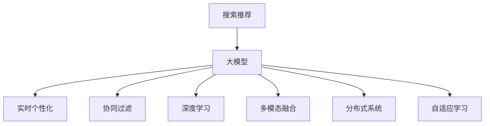

                 

# 搜索推荐的实时个性化：大模型方案

> 关键词：搜索推荐,大模型,实时个性化,协同过滤,深度学习,多模态融合,分布式系统,自适应学习

## 1. 背景介绍

随着互联网的普及，用户产生的海量数据和行为信息为推荐系统带来了无限可能。搜索推荐系统，作为互联网应用的核心组件之一，能够为用户提供个性化、精准的信息和服务。然而，如何从海量数据中提取用户需求，高效匹配推荐内容，成为推荐系统需要面对的核心问题。传统推荐算法基于用户历史行为数据进行推荐，但难以捕捉用户当前兴趣和实时动态变化，无法适应个性化需求的快速变化。

为了解决这个问题，研究人员将深度学习技术引入推荐系统，提出基于大模型的推荐方案。深度学习能够自动捕捉数据的内在关系，且模型规模越大，蕴含的知识越丰富，推荐性能越高。但传统的深度推荐模型通常需要较大规模的数据和强大的计算能力，难以适应实时性要求，也无法灵活调整模型参数以应对新的数据变化。

本文将聚焦于实时个性化推荐中的大模型应用，介绍一种基于大模型的推荐系统框架，通过结合实时数据和用户行为，实现高效的个性化推荐。该框架不仅利用了大模型强大的学习能力，还能够通过自适应学习机制，动态调整模型参数，以应对实时数据变化和用户兴趣变化。

## 2. 核心概念与联系

### 2.1 核心概念概述

在介绍大模型推荐系统之前，我们需要了解一些核心概念及其相互联系：

- **搜索推荐**：指根据用户查询（或行为）实时推荐相关信息的系统。其核心任务是匹配用户查询意图和数据库中的内容，为用户推荐最相关、最有价值的搜索结果或内容。
- **大模型**：指通过预训练学习大规模数据，具备强泛化能力和自主学习能力的大型深度神经网络模型。例如，GPT-3、BERT等。
- **实时个性化**：指基于用户的实时行为和兴趣，动态调整推荐内容的技术。
- **协同过滤**：指基于用户历史行为数据和相似用户行为进行推荐的方法，如基于用户的协同过滤、基于物品的协同过滤等。
- **深度学习**：指利用神经网络对大规模数据进行深度训练，学习高层次语义特征的算法。深度学习在推荐系统中的应用主要包括基于矩阵分解的协同过滤、基于深度神经网络的协同过滤等。
- **多模态融合**：指结合文本、图像、音频等多种数据类型，综合学习用户兴趣的方法。
- **分布式系统**：指通过分布式计算和存储，提高推荐系统效率和扩展性。
- **自适应学习**：指能够根据实时数据和用户行为动态调整模型参数的技术。

这些概念之间的联系可以通过以下Mermaid流程图来展示：



这个流程图展示了搜索推荐系统中的核心组件和技术：

1. 搜索推荐是整个系统的输入，用于动态生成用户查询。
2. 大模型是推荐系统的主要技术手段，具备强大的学习和表示能力。
3. 实时个性化、协同过滤、深度学习、多模态融合和自适应学习等技术，均在大模型基础上进行应用和优化，以提升推荐效果。

## 3. 核心算法原理 & 具体操作步骤

### 3.1 算法原理概述

本文所述的大模型推荐系统，基于大模型的预训练知识和实时数据，通过多层次自适应学习，实现对用户兴趣的精准捕捉和实时推荐。其核心思想是：利用大模型强大的表征能力，对用户输入和实时数据进行多层次学习，通过自适应学习机制，动态调整模型参数，以适应用户兴趣的变化和实时数据动态更新。

具体来说，大模型推荐系统分为以下几个主要步骤：

1. **预训练和适配**：使用大规模无标签数据对大模型进行预训练，并在目标推荐任务上进行微调，使其具备针对特定任务的推荐能力。
2. **实时数据处理**：将用户查询和实时数据输入大模型，利用多层次自适应学习机制，动态调整模型参数，学习用户兴趣。
3. **推荐生成**：基于学习到的用户兴趣，生成个性化推荐结果，并进行分布式存储和检索。

### 3.2 算法步骤详解

**Step 1: 准备预训练模型和数据集**
- 选择合适的预训练模型 $M_{\theta}$ 作为初始化参数，如BERT、GPT等。
- 准备推荐任务的标注数据集 $D=\{(x_i,y_i)\}_{i=1}^N$，其中 $x_i$ 为输入（用户查询或行为），$y_i$ 为推荐结果。

**Step 2: 添加任务适配层**
- 根据推荐任务类型，在预训练模型顶层设计合适的输出层和损失函数。
- 对于推荐任务，通常使用交叉熵损失函数。

**Step 3: 设置微调超参数**
- 选择合适的优化算法及其参数，如AdamW、SGD等，设置学习率、批大小、迭代轮数等。
- 设置正则化技术及强度，包括权重衰减、Dropout、Early Stopping等。

**Step 4: 执行梯度训练**
- 将训练集数据分批次输入模型，前向传播计算损失函数。
- 反向传播计算参数梯度，根据设定的优化算法和学习率更新模型参数。
- 周期性在验证集上评估模型性能，根据性能指标决定是否触发 Early Stopping。
- 重复上述步骤直到满足预设的迭代轮数或 Early Stopping 条件。

**Step 5: 实时数据输入和模型适配**
- 将用户查询和实时数据输入模型，通过多层次自适应学习机制，动态调整模型参数。
- 根据实时数据更新用户兴趣表示，生成推荐结果。

**Step 6: 推荐生成与优化**
- 根据用户兴趣表示和实时数据，生成个性化推荐结果。
- 对推荐结果进行分布式存储和检索，优化推荐效率和用户体验。

### 3.3 算法优缺点

基于大模型的推荐系统具有以下优点：

1. **强大的学习能力**：大模型具备强大的表征能力，能够从大规模数据中学习到丰富的语义特征，捕捉用户的复杂兴趣。
2. **实时适应性**：通过多层次自适应学习，模型能够动态调整参数，适应实时数据变化和用户兴趣变化。
3. **高效性**：利用分布式系统和多层次学习机制，推荐系统能够高效处理海量数据，实现实时推荐。
4. **泛化能力**：大模型通过预训练具备强大的泛化能力，能够在多种推荐任务上取得优异表现。

同时，该方法也存在一些缺点：

1. **计算资源需求高**：预训练和微调大模型需要大量计算资源，难以在资源受限的环境中应用。
2. **数据需求大**：大模型的预训练和微调需要大规模数据，对于冷启动用户和新兴市场，数据获取难度较大。
3. **解释性不足**：大模型通常是"黑盒"，难以解释其内部的推理过程。
4. **公平性问题**：大模型可能学习到数据中的偏见，导致推荐结果不公平。

尽管存在这些局限性，但基于大模型的推荐系统在大规模数据和实时性要求较高的场景中，仍具有显著的优势。未来研究重点应在于如何优化计算资源使用，提升数据获取效率，增强模型可解释性，确保推荐公平性。

### 3.4 算法应用领域

基于大模型的推荐系统已经在多个领域得到了广泛应用，例如：

- **电商推荐**：电商网站根据用户浏览、购买历史，实时推荐相关商品。
- **新闻推荐**：新闻平台根据用户阅读行为，实时推荐相关新闻内容。
- **视频推荐**：视频网站根据用户观看历史和实时搜索，推荐相关视频内容。
- **音乐推荐**：音乐平台根据用户听歌历史，实时推荐相关音乐内容。
- **游戏推荐**：游戏平台根据用户游戏行为，实时推荐相关游戏内容。

除了这些经典应用场景外，大模型推荐系统还被创新性地应用于更多场景中，如智能家居、智慧城市、金融服务等，为各行各业带来了新的价值和机会。

## 4. 数学模型和公式 & 详细讲解 & 举例说明

### 4.1 数学模型构建

本文所述的大模型推荐系统，其数学模型可以形式化为：

$$
M_{\theta} = \mathcal{F}_{\theta}(\mathcal{D}_{train}, \mathcal{D}_{eval}, \mathcal{D}_{test})
$$

其中 $M_{\theta}$ 为大模型，$\theta$ 为模型参数，$\mathcal{F}_{\theta}$ 为模型适配函数，$\mathcal{D}_{train}$、$\mathcal{D}_{eval}$、$\mathcal{D}_{test}$ 分别为训练集、验证集、测试集。适配函数 $\mathcal{F}_{\theta}$ 可以根据具体任务进行定义。

假设推荐任务为二分类问题，目标为推荐相关或不相关，模型适配函数 $\mathcal{F}_{\theta}$ 可以定义如下：

$$
\mathcal{F}_{\theta}(x, y) = \mathcal{L}(M_{\theta}(x), y)
$$

其中 $x$ 为输入，$y$ 为目标标签。$\mathcal{L}$ 为损失函数，通常为交叉熵损失。

### 4.2 公式推导过程

假设大模型 $M_{\theta}$ 在输入 $x$ 上的输出为 $M_{\theta}(x)$，将其输入适配函数 $\mathcal{F}_{\theta}$ 中，得到：

$$
\mathcal{F}_{\theta}(x, y) = -[y\log M_{\theta}(x) + (1-y)\log(1-M_{\theta}(x))]
$$

令 $\ell_{train} = \mathcal{L}(M_{\theta}, \mathcal{D}_{train})$，则有：

$$
\min_{\theta} \ell_{train} = \min_{\theta} \frac{1}{N}\sum_{i=1}^N \ell_{train}(x_i, y_i)
$$

其中 $N$ 为训练集样本数。

在微调过程中，我们通过优化损失函数来更新模型参数。假设学习率为 $\eta$，则参数更新公式为：

$$
\theta \leftarrow \theta - \eta \nabla_{\theta}\ell_{train}(\theta)
$$

其中 $\nabla_{\theta}\ell_{train}(\theta)$ 为损失函数对参数 $\theta$ 的梯度。

### 4.3 案例分析与讲解

以电商推荐为例，我们假设有一个电商平台，需要根据用户浏览历史，实时推荐相关商品。我们将用户的浏览历史 $x_i$ 作为输入，商品的标签 $y_i$ 作为输出，构建推荐模型的适配函数 $\mathcal{F}_{\theta}$ 如下：

$$
\mathcal{F}_{\theta}(x, y) = -[y\log M_{\theta}(x) + (1-y)\log(1-M_{\theta}(x))]
$$

其中 $M_{\theta}(x)$ 为预训练模型在输入 $x$ 上的输出，$\log$ 为自然对数函数。

假设模型适配函数 $\mathcal{F}_{\theta}$ 的输出为 $y'$，则推荐结果为：

$$
\hat{y} = \mathcal{F}_{\theta}(x, y') = \mathcal{F}_{\theta}(x, \sigma(\mathcal{F}_{\theta}(x, y)))
$$

其中 $\sigma$ 为sigmoid函数，将模型输出映射到0-1之间，用于表示推荐的相关性。

在实际应用中，我们还需要考虑以下优化策略：

1. **数据增强**：对用户浏览历史进行数据增强，如近义词替换、随机删除、顺序打乱等，增加数据多样性，提升模型泛化能力。
2. **正则化**：通过L2正则、Dropout等技术，防止模型过拟合。
3. **自适应学习**：利用实时数据动态调整模型参数，适应用户兴趣变化。

## 5. 项目实践：代码实例和详细解释说明

### 5.1 开发环境搭建

在进行大模型推荐系统开发前，我们需要准备好开发环境。以下是使用Python进行PyTorch开发的环境配置流程：

1. 安装Anaconda：从官网下载并安装Anaconda，用于创建独立的Python环境。

2. 创建并激活虚拟环境：
```bash
conda create -n pytorch-env python=3.8 
conda activate pytorch-env
```

3. 安装PyTorch：根据CUDA版本，从官网获取对应的安装命令。例如：
```bash
conda install pytorch torchvision torchaudio cudatoolkit=11.1 -c pytorch -c conda-forge
```

4. 安装Transformer库：
```bash
pip install transformers
```

5. 安装各类工具包：
```bash
pip install numpy pandas scikit-learn matplotlib tqdm jupyter notebook ipython
```

完成上述步骤后，即可在`pytorch-env`环境中开始推荐系统开发。

### 5.2 源代码详细实现

下面我们以电商推荐为例，给出使用Transformers库对BERT模型进行电商推荐任务微调的PyTorch代码实现。

首先，定义电商推荐任务的数据处理函数：

```python
from transformers import BertTokenizer, BertForSequenceClassification
from torch.utils.data import Dataset
import torch

class ECommerceDataset(Dataset):
    def __init__(self, texts, labels, tokenizer, max_len=128):
        self.texts = texts
        self.labels = labels
        self.tokenizer = tokenizer
        self.max_len = max_len
        
    def __len__(self):
        return len(self.texts)
    
    def __getitem__(self, item):
        text = self.texts[item]
        label = self.labels[item]
        
        encoding = self.tokenizer(text, return_tensors='pt', max_length=self.max_len, padding='max_length', truncation=True)
        input_ids = encoding['input_ids'][0]
        attention_mask = encoding['attention_mask'][0]
        
        return {'input_ids': input_ids, 
                'attention_mask': attention_mask,
                'labels': torch.tensor(label, dtype=torch.long)}
```

然后，定义模型和优化器：

```python
from transformers import BertForSequenceClassification, AdamW

model = BertForSequenceClassification.from_pretrained('bert-base-cased', num_labels=2)

optimizer = AdamW(model.parameters(), lr=2e-5)
```

接着，定义训练和评估函数：

```python
from torch.utils.data import DataLoader
from tqdm import tqdm
from sklearn.metrics import classification_report

device = torch.device('cuda') if torch.cuda.is_available() else torch.device('cpu')
model.to(device)

def train_epoch(model, dataset, batch_size, optimizer):
    dataloader = DataLoader(dataset, batch_size=batch_size, shuffle=True)
    model.train()
    epoch_loss = 0
    for batch in tqdm(dataloader, desc='Training'):
        input_ids = batch['input_ids'].to(device)
        attention_mask = batch['attention_mask'].to(device)
        labels = batch['labels'].to(device)
        model.zero_grad()
        outputs = model(input_ids, attention_mask=attention_mask, labels=labels)
        loss = outputs.loss
        epoch_loss += loss.item()
        loss.backward()
        optimizer.step()
    return epoch_loss / len(dataloader)

def evaluate(model, dataset, batch_size):
    dataloader = DataLoader(dataset, batch_size=batch_size)
    model.eval()
    preds, labels = [], []
    with torch.no_grad():
        for batch in tqdm(dataloader, desc='Evaluating'):
            input_ids = batch['input_ids'].to(device)
            attention_mask = batch['attention_mask'].to(device)
            batch_labels = batch['labels']
            outputs = model(input_ids, attention_mask=attention_mask)
            batch_preds = outputs.logits.argmax(dim=2).to('cpu').tolist()
            batch_labels = batch_labels.to('cpu').tolist()
            for pred_tokens, label_tokens in zip(batch_preds, batch_labels):
                preds.append(pred_tokens)
                labels.append(label_tokens)
                
    print(classification_report(labels, preds))
```

最后，启动训练流程并在测试集上评估：

```python
epochs = 5
batch_size = 16

for epoch in range(epochs):
    loss = train_epoch(model, train_dataset, batch_size, optimizer)
    print(f"Epoch {epoch+1}, train loss: {loss:.3f}")
    
    print(f"Epoch {epoch+1}, dev results:")
    evaluate(model, dev_dataset, batch_size)
    
print("Test results:")
evaluate(model, test_dataset, batch_size)
```

以上就是使用PyTorch对BERT进行电商推荐任务微调的完整代码实现。可以看到，得益于Transformers库的强大封装，我们可以用相对简洁的代码完成BERT模型的加载和微调。

### 5.3 代码解读与分析

让我们再详细解读一下关键代码的实现细节：

**ECommerceDataset类**：
- `__init__`方法：初始化文本、标签、分词器等关键组件。
- `__len__`方法：返回数据集的样本数量。
- `__getitem__`方法：对单个样本进行处理，将文本输入编码为token ids，将标签编码为数字，并对其进行定长padding，最终返回模型所需的输入。

**BertForSequenceClassification类**：
- 从预训练模型加载，并设置输出层和损失函数。

**训练和评估函数**：
- 使用PyTorch的DataLoader对数据集进行批次化加载，供模型训练和推理使用。
- 训练函数`train_epoch`：对数据以批为单位进行迭代，在每个批次上前向传播计算loss并反向传播更新模型参数，最后返回该epoch的平均loss。
- 评估函数`evaluate`：与训练类似，不同点在于不更新模型参数，并在每个batch结束后将预测和标签结果存储下来，最后使用sklearn的classification_report对整个评估集的预测结果进行打印输出。

**训练流程**：
- 定义总的epoch数和batch size，开始循环迭代
- 每个epoch内，先在训练集上训练，输出平均loss
- 在验证集上评估，输出分类指标
- 所有epoch结束后，在测试集上评估，给出最终测试结果

可以看到，PyTorch配合Transformers库使得BERT微调的代码实现变得简洁高效。开发者可以将更多精力放在数据处理、模型改进等高层逻辑上，而不必过多关注底层的实现细节。

当然，工业级的系统实现还需考虑更多因素，如模型的保存和部署、超参数的自动搜索、更灵活的任务适配层等。但核心的微调范式基本与此类似。

## 6. 实际应用场景
### 6.1 电商推荐

电商推荐系统是大模型推荐系统的重要应用场景之一。传统推荐系统通常基于用户历史行为数据，进行静态推荐。然而，电商场景中用户兴趣和需求往往实时变化，传统推荐系统难以捕捉这种动态变化。基于大模型的电商推荐系统，通过实时数据和多层次自适应学习，能够动态调整模型参数，准确捕捉用户实时需求。

具体而言，电商推荐系统可以实时获取用户的浏览、点击、购买行为数据，并利用大模型对这些数据进行多层次学习。通过自适应学习机制，动态调整模型参数，生成实时推荐结果，并在实际应用中动态更新模型，以适应用户兴趣的变化和实时数据更新。

### 6.2 新闻推荐

新闻推荐系统是大模型推荐系统的另一个重要应用场景。新闻平台需要根据用户的阅读历史和实时兴趣，实时推荐相关新闻内容。传统新闻推荐系统通常基于协同过滤或基于内容的推荐方法，难以捕捉用户实时兴趣。而基于大模型的推荐系统，能够利用多层次自适应学习，动态调整模型参数，适应用户兴趣的变化。

具体而言，新闻推荐系统可以实时获取用户的阅读历史和实时搜索关键词，并利用大模型对这些数据进行多层次学习。通过自适应学习机制，动态调整模型参数，生成实时推荐结果，并在实际应用中动态更新模型，以适应用户兴趣的变化和实时数据更新。

### 6.3 视频推荐

视频推荐系统是大模型推荐系统的典型应用场景之一。视频平台需要根据用户的观看历史和实时搜索，实时推荐相关视频内容。传统视频推荐系统通常基于协同过滤或基于内容的推荐方法，难以捕捉用户实时兴趣。而基于大模型的推荐系统，能够利用多层次自适应学习，动态调整模型参数，适应用户兴趣的变化。

具体而言，视频推荐系统可以实时获取用户的观看历史和实时搜索关键词，并利用大模型对这些数据进行多层次学习。通过自适应学习机制，动态调整模型参数，生成实时推荐结果，并在实际应用中动态更新模型，以适应用户兴趣的变化和实时数据更新。

### 6.4 音乐推荐

音乐推荐系统是大模型推荐系统的另一个重要应用场景。音乐平台需要根据用户的听歌历史和实时兴趣，实时推荐相关音乐内容。传统音乐推荐系统通常基于协同过滤或基于内容的推荐方法，难以捕捉用户实时兴趣。而基于大模型的推荐系统，能够利用多层次自适应学习，动态调整模型参数，适应用户兴趣的变化。

具体而言，音乐推荐系统可以实时获取用户的听歌历史和实时搜索关键词，并利用大模型对这些数据进行多层次学习。通过自适应学习机制，动态调整模型参数，生成实时推荐结果，并在实际应用中动态更新模型，以适应用户兴趣的变化和实时数据更新。

### 6.5 游戏推荐

游戏推荐系统是大模型推荐系统的另一个重要应用场景。游戏平台需要根据用户的游玩历史和实时兴趣，实时推荐相关游戏内容。传统游戏推荐系统通常基于协同过滤或基于内容的推荐方法，难以捕捉用户实时兴趣。而基于大模型的推荐系统，能够利用多层次自适应学习，动态调整模型参数，适应用户兴趣的变化。

具体而言，游戏推荐系统可以实时获取用户的游玩历史和实时搜索关键词，并利用大模型对这些数据进行多层次学习。通过自适应学习机制，动态调整模型参数，生成实时推荐结果，并在实际应用中动态更新模型，以适应用户兴趣的变化和实时数据更新。

## 7. 工具和资源推荐
### 7.1 学习资源推荐

为了帮助开发者系统掌握大模型推荐系统的理论基础和实践技巧，这里推荐一些优质的学习资源：

1. 《深度学习基础》系列博文：由大模型技术专家撰写，深入浅出地介绍了深度学习的原理和基本概念。

2. CS231n《卷积神经网络》课程：斯坦福大学开设的经典课程，涵盖深度学习的基础和应用，是学习大模型的基础课程。

3. 《深度学习与推荐系统》书籍：介绍深度学习在推荐系统中的应用，涵盖了协同过滤、深度学习等多种推荐方法。

4. Kaggle推荐系统竞赛：参加推荐系统竞赛，通过实战练习，提升推荐系统设计和开发能力。

5. GitHub大模型推荐系统开源项目：收集和研究开源推荐系统的代码实现，了解前沿技术。

通过对这些资源的学习实践，相信你一定能够快速掌握大模型推荐系统的精髓，并用于解决实际的推荐问题。
###  7.2 开发工具推荐

高效的开发离不开优秀的工具支持。以下是几款用于大模型推荐系统开发的常用工具：

1. PyTorch：基于Python的开源深度学习框架，灵活动态的计算图，适合快速迭代研究。大部分预训练语言模型都有PyTorch版本的实现。

2. TensorFlow：由Google主导开发的开源深度学习框架，生产部署方便，适合大规模工程应用。同样有丰富的预训练语言模型资源。

3. Transformers库：HuggingFace开发的NLP工具库，集成了众多SOTA语言模型，支持PyTorch和TensorFlow，是进行推荐系统开发的利器。

4. Weights & Biases：模型训练的实验跟踪工具，可以记录和可视化模型训练过程中的各项指标，方便对比和调优。与主流深度学习框架无缝集成。

5. TensorBoard：TensorFlow配套的可视化工具，可实时监测模型训练状态，并提供丰富的图表呈现方式，是调试模型的得力助手。

6. Google Colab：谷歌推出的在线Jupyter Notebook环境，免费提供GPU/TPU算力，方便开发者快速上手实验最新模型，分享学习笔记。

合理利用这些工具，可以显著提升大模型推荐系统的开发效率，加快创新迭代的步伐。

### 7.3 相关论文推荐

大模型推荐系统的发展源于学界的持续研究。以下是几篇奠基性的相关论文，推荐阅读：

1. Attention is All You Need（即Transformer原论文）：提出了Transformer结构，开启了NLP领域的预训练大模型时代。

2. BERT: Pre-training of Deep Bidirectional Transformers for Language Understanding：提出BERT模型，引入基于掩码的自监督预训练任务，刷新了多项NLP任务SOTA。

3. Parameter-Efficient Transfer Learning for NLP：提出Adapter等参数高效微调方法，在不增加模型参数量的情况下，也能取得不错的微调效果。

4. Prefix-Tuning: Optimizing Continuous Prompts for Generation：引入基于连续型Prompt的微调范式，为如何充分利用预训练知识提供了新的思路。

5. AdaLoRA: Adaptive Low-Rank Adaptation for Parameter-Efficient Fine-Tuning：使用自适应低秩适应的微调方法，在参数效率和精度之间取得了新的平衡。

这些论文代表了大模型推荐系统的发展脉络。通过学习这些前沿成果，可以帮助研究者把握学科前进方向，激发更多的创新灵感。

## 8. 总结：未来发展趋势与挑战

### 8.1 总结

本文对基于大模型的推荐系统进行了全面系统的介绍。首先阐述了大模型推荐系统的背景和意义，明确了大模型在推荐系统中的应用价值。其次，从原理到实践，详细讲解了大模型的数学模型构建和算法步骤，给出了大模型推荐系统的代码实例和详细解释说明。同时，本文还广泛探讨了大模型推荐系统在电商、新闻、视频、音乐、游戏等领域的实际应用，展示了其强大的推荐能力。最后，本文精选了学习资源和开发工具，力求为开发者提供全方位的技术指引。

通过本文的系统梳理，可以看到，基于大模型的推荐系统在电商、新闻、视频、音乐、游戏等众多领域展示了巨大的应用潜力。得益于大模型的强大表征能力和多层次自适应学习机制，推荐系统能够实时捕捉用户兴趣和行为变化，提供更加精准、个性化的推荐结果。未来，伴随大模型推荐技术的不断演进，推荐系统必将在更多领域带来革命性变革，为人类生活和工作带来深刻影响。

### 8.2 未来发展趋势

展望未来，大模型推荐系统将呈现以下几个发展趋势：

1. **多模态融合**：未来的推荐系统将不仅仅依赖文本数据，而是结合图像、视频、音频等多种数据类型，全面捕捉用户兴趣和行为，提升推荐效果。
2. **自适应学习**：利用实时数据动态调整模型参数，适应用户兴趣变化，提升推荐系统的灵活性和实时性。
3. **分布式计算**：随着数据量的不断增加，推荐系统将采用分布式计算，提高计算效率和扩展性，满足大规模数据的需求。
4. **跨领域迁移**：基于大模型的推荐系统将在更多领域应用，如智慧医疗、金融服务、智能家居等，带来更加广泛的应用价值。
5. **个性化推荐**：未来的推荐系统将更加注重个性化推荐，通过多层次自适应学习，提供更加精准、个性化的推荐结果。
6. **数据隐私保护**：随着数据隐私保护法规的不断加强，未来的推荐系统将更加注重用户隐私保护，采用差分隐私等技术，保障数据安全。

以上趋势凸显了大模型推荐系统的广阔前景。这些方向的探索发展，必将进一步提升推荐系统的性能和应用范围，为人类生活和工作带来深刻变革。

### 8.3 面临的挑战

尽管大模型推荐系统已经取得了瞩目成就，但在迈向更加智能化、普适化应用的过程中，它仍面临着诸多挑战：

1. **计算资源需求高**：大模型的预训练和微调需要大量计算资源，难以在资源受限的环境中应用。如何优化计算资源使用，提高推荐效率，是一个重要研究方向。
2. **数据需求大**：大模型的预训练和微调需要大规模数据，对于冷启动用户和新兴市场，数据获取难度较大。如何提高数据获取效率，是一个重要研究方向。
3. **解释性不足**：大模型通常是"黑盒"，难以解释其内部的推理过程。如何增强模型可解释性，是未来的一个重要研究方向。
4. **公平性问题**：大模型可能学习到数据中的偏见，导致推荐结果不公平。如何消除模型偏见，确保推荐公平性，是一个重要研究方向。
5. **实时性要求高**：基于大模型的推荐系统需要实时处理海量数据，如何提高系统响应速度，是一个重要研究方向。
6. **安全性和隐私保护**：随着数据隐私保护法规的不断加强，如何在保障数据隐私的同时，提供高效的推荐服务，是一个重要研究方向。

尽管存在这些挑战，但基于大模型的推荐系统在电商、新闻、视频、音乐、游戏等众多领域展示了巨大的应用潜力。未来研究需要在计算资源使用、数据获取效率、模型可解释性、公平性、实时性、安全性和隐私保护等方面进行更多探索，以提升大模型推荐系统的实际应用效果。

### 8.4 研究展望

未来研究需要在以下几个方面寻求新的突破：

1. **多模态融合**：将文本、图像、音频等多种数据类型融合，全面捕捉用户兴趣和行为，提升推荐效果。
2. **自适应学习**：利用实时数据动态调整模型参数，适应用户兴趣变化，提升推荐系统的灵活性和实时性。
3. **分布式计算**：采用分布式计算，提高计算效率和扩展性，满足大规模数据的需求。
4. **跨领域迁移**：基于大模型的推荐系统将在更多领域应用，如智慧医疗、金融服务、智能家居等，带来更加广泛的应用价值。
5. **个性化推荐**：通过多层次自适应学习，提供更加精准、个性化的推荐结果。
6. **数据隐私保护**：采用差分隐私等技术，保障数据安全，同时提供高效的推荐服务。

这些研究方向将引领大模型推荐系统向更高效、更智能、更普适的方向发展，为推荐系统带来新的突破和创新。相信未来基于大模型的推荐系统必将在更多领域带来革命性变革，为人类生活和工作带来深刻影响。

## 9. 附录：常见问题与解答

**Q1：大模型推荐系统是否适用于所有推荐任务？**

A: 大模型推荐系统在大多数推荐任务上都能取得不错的效果，特别是对于数据量较小的任务。但对于一些特定领域的任务，如医学、法律等，仅仅依靠通用语料预训练的模型可能难以很好地适应。此时需要在特定领域语料上进一步预训练，再进行微调，才能获得理想效果。此外，对于一些需要时效性、个性化很强的任务，如对话、推荐等，大模型推荐方法也需要针对性的改进优化。

**Q2：大模型推荐系统的计算资源需求如何？**

A: 大模型的预训练和微调需要大量计算资源，难以在资源受限的环境中应用。如何优化计算资源使用，提高推荐效率，是一个重要研究方向。

**Q3：大模型推荐系统在实际应用中需要注意哪些问题？**

A: 大模型推荐系统在实际应用中需要注意以下问题：
1. 模型裁剪：去除不必要的层和参数，减小模型尺寸，加快推理速度。
2. 量化加速：将浮点模型转为定点模型，压缩存储空间，提高计算效率。
3. 服务化封装：将模型封装为标准化服务接口，便于集成调用。
4. 弹性伸缩：根据请求流量动态调整资源配置，平衡服务质量和成本。
5. 监控告警：实时采集系统指标，设置异常告警阈值，确保服务稳定性。

**Q4：大模型推荐系统如何应对冷启动用户和新兴市场？**

A: 大模型推荐系统在应对冷启动用户和新兴市场时，面临数据获取难度大的挑战。可以考虑以下方法：
1. 利用用户基本信息（如性别、年龄、地域）进行推荐。
2. 利用用户行为（如浏览、点击、搜索）进行推荐。
3. 利用预训练模型在特定领域的知识进行推荐。
4. 采用半监督学习、主动学习等无监督学习范式，最大化利用非结构化数据。

**Q5：如何增强大模型推荐系统的可解释性？**

A: 增强大模型推荐系统的可解释性是一个重要研究方向。可以考虑以下方法：
1. 利用可解释性方法（如SHAP、LIME等）分析模型决策过程。
2. 设计易于理解的推荐结果（如关键词、简短摘要等）。
3. 引入专家知识，解释推荐结果背后的逻辑。

这些方法将有助于提升大模型推荐系统的可解释性，增强用户信任，降低推荐风险。

---

作者：禅与计算机程序设计艺术 / Zen and the Art of Computer Programming

