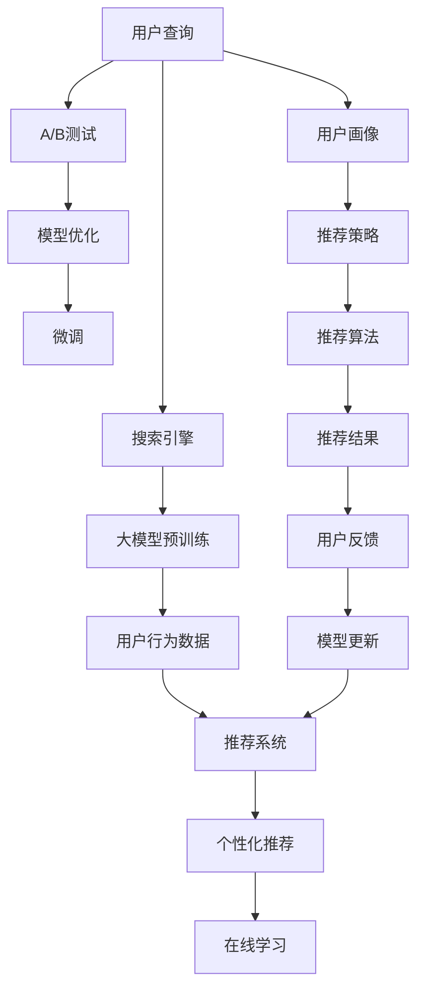

                 

# 搜索推荐系统的AI 大模型优化：电商平台的核心竞争优势

## 1. 背景介绍

随着互联网电商的迅速发展，平台如何提供精准的搜索和推荐服务，成为提升用户体验和增加交易转化率的关键。人工智能(AI)大模型，如BERT、GPT等，通过大规模语料预训练和微调，已经成为了搜索推荐系统的重要技术工具。这些大模型具备强大的语言理解能力和知识迁移能力，能够从文本中提取有用信息，进行精准匹配和推荐。然而，在实际应用中，如何高效地利用这些模型，最大化搜索推荐的性能和效率，是一个具有挑战性的问题。

本文将聚焦于搜索推荐系统中的AI大模型优化，重点探讨如何通过优化大模型，提升电商平台的搜索和推荐效果，构建核心竞争优势。我们将从背景、核心概念、算法原理、应用实例等方面进行详细阐述，希望能为电商平台的开发者提供有价值的参考。

## 2. 核心概念与联系

### 2.1 核心概念概述

为了更好地理解搜索推荐系统中的AI大模型优化，首先需要明确一些核心概念：

- **AI大模型**：指通过大规模语料预训练，具备强大语言理解和生成能力的大规模神经网络模型，如BERT、GPT等。
- **微调(Fine-tuning)**：在大规模预训练模型的基础上，通过小规模标注数据进行有监督学习，优化模型在特定任务上的性能。
- **推荐系统**：利用用户历史行为和实时数据，为用户推荐产品、内容等，以提高用户满意度和服务质量。
- **搜索引擎**：根据用户查询，从大量产品或内容中筛选出最相关的结果，提供给用户。
- **个性化推荐**：根据用户画像和行为特征，推荐个性化的产品或内容。
- **在线学习**：指推荐系统不断更新和迭代，学习用户最新偏好，提升推荐效果。
- **A/B测试**：通过随机分组，对比不同策略的效果，以优化推荐算法。

这些概念之间存在紧密的联系，共同构成了搜索推荐系统的核心框架。在实际应用中，通过AI大模型的微调，可以显著提升推荐和搜索系统的性能和效率。

### 2.2 核心概念原理和架构的 Mermaid 流程图



该流程图展示了搜索推荐系统的主要流程和组成部分：用户通过搜索引擎检索产品或内容，搜索引擎利用预训练大模型进行文本匹配，推荐系统根据用户行为数据进行个性化推荐，在线学习不断更新推荐模型，A/B测试用于优化推荐策略，微调大模型以提升性能。

## 3. 核心算法原理 & 具体操作步骤

### 3.1 算法原理概述

在搜索推荐系统中，AI大模型的优化主要基于两种策略：推荐系统的特征工程和模型的微调。

- **特征工程**：通过提取和选择文本特征、用户行为特征等，提升模型的输入质量，从而提升推荐效果。
- **微调**：利用小规模标注数据，对预训练大模型进行优化，使其在特定任务上具备更好的表现。

微调的核心思想是通过有监督学习，利用小规模标注数据更新模型参数，使模型输出更加符合实际需求。微调的目标是提升模型的预测准确性，降低过拟合风险，提高泛化能力。

### 3.2 算法步骤详解

#### 3.2.1 数据准备

- **数据收集**：从电商平台收集用户历史行为数据、点击记录、购买记录等，作为推荐系统的训练数据。
- **数据预处理**：对文本数据进行分词、去除停用词、构建词向量等预处理操作。对用户行为数据进行特征提取和标准化。
- **数据标注**：根据用户行为数据，生成推荐系统训练数据，标注用户是否点击、购买等行为。

#### 3.2.2 模型选择

选择合适的预训练大模型作为特征提取器。常用的预训练大模型包括BERT、GPT等。

#### 3.2.3 特征提取

使用预训练大模型提取输入文本的特征表示。对于文本推荐，可以使用BERT等模型生成词向量作为输入。对于图片推荐，可以使用Vision Transformer等模型提取图像特征。

#### 3.2.4 模型微调

将预训练大模型作为初始化参数，利用标注数据进行微调。微调的目标是最大化推荐效果。

#### 3.2.5 模型评估

使用验证集对微调后的模型进行评估，选择性能最好的模型。

#### 3.2.6 模型部署

将微调后的模型部署到生产环境中，提供实时推荐服务。

### 3.3 算法优缺点

#### 3.3.1 优点

1. **性能提升**：通过微调，模型能够更好地理解用户需求和产品特征，提供更加精准的推荐和搜索服务。
2. **泛化能力**：微调后的模型具备更好的泛化能力，能够应对多种复杂的应用场景。
3. **高效性**：利用大模型的强大特征提取能力，可以显著提升推荐系统的效率和准确性。
4. **灵活性**：微调过程可以灵活调整，针对不同的应用场景进行优化。

#### 3.3.2 缺点

1. **计算资源需求高**：微调大模型需要大量的计算资源和时间，可能会对实际应用产生影响。
2. **数据依赖**：微调的效果很大程度上依赖于标注数据的质量和数量，数据获取成本较高。
3. **模型复杂**：大模型结构复杂，难以解释和调试，可能存在不可控的输出。
4. **过拟合风险**：微调过程中，模型容易过拟合训练数据，影响泛化能力。

### 3.4 算法应用领域

AI大模型优化在搜索推荐系统中具有广泛的应用前景，包括：

- **文本推荐**：根据用户历史浏览记录，推荐相关的文本内容。
- **商品推荐**：根据用户行为数据，推荐用户可能感兴趣的商品。
- **个性化搜索**：根据用户查询，提供个性化的搜索结果。
- **广告投放**：根据用户兴趣，推荐相关广告，提高广告转化率。
- **内容推荐**：根据用户画像和行为，推荐相关文章、视频等。

## 4. 数学模型和公式 & 详细讲解 & 举例说明

### 4.1 数学模型构建

假设推荐系统的训练数据集为 $D=\{(x_i, y_i)\}_{i=1}^N$，其中 $x_i$ 为用户行为数据或文本数据，$y_i$ 为推荐标签。

定义预训练大模型为 $M_{\theta}$，其中 $\theta$ 为模型参数。推荐模型的损失函数为：

$$
\mathcal{L}(\theta) = \frac{1}{N} \sum_{i=1}^N \ell(M_{\theta}(x_i),y_i)
$$

其中 $\ell$ 为推荐模型的损失函数，常见的有交叉熵损失、均方误差损失等。

### 4.2 公式推导过程

以交叉熵损失函数为例，推荐模型 $M_{\theta}$ 在输入 $x_i$ 上的输出为 $\hat{y}_i = M_{\theta}(x_i)$，则交叉熵损失函数为：

$$
\ell(M_{\theta}(x_i),y_i) = -y_i\log \hat{y}_i + (1-y_i)\log (1-\hat{y}_i)
$$

最小化损失函数，得到模型参数 $\theta$ 的优化公式为：

$$
\theta \leftarrow \theta - \eta \nabla_{\theta}\mathcal{L}(\theta)
$$

其中 $\eta$ 为学习率，$\nabla_{\theta}\mathcal{L}(\theta)$ 为损失函数对参数 $\theta$ 的梯度。

### 4.3 案例分析与讲解

假设有一个电商平台的推荐系统，其数据集包含用户的历史浏览记录和购买记录。首先，对文本数据进行分词，生成词向量作为输入，对用户行为数据进行特征提取，如点击次数、浏览时间等。

使用预训练的BERT模型作为特征提取器，将用户行为数据和文本数据输入BERT模型，生成特征表示。然后，将这些特征表示作为输入，训练一个线性分类器，输出推荐标签。

在微调过程中，选择合适的学习率，利用标注数据对模型进行优化。最后，在验证集上评估模型的性能，选择表现最好的模型进行部署。

## 5. 项目实践：代码实例和详细解释说明

### 5.1 开发环境搭建

为了进行搜索推荐系统的AI大模型优化，需要搭建相应的开发环境。以下是Python开发环境的搭建步骤：

1. **安装Anaconda**：从官网下载并安装Anaconda，用于创建独立的Python环境。
2. **创建并激活虚拟环境**：
```bash
conda create -n pyenv python=3.8 
conda activate pyenv
```
3. **安装必要的Python包**：
```bash
pip install transformers torch
```

### 5.2 源代码详细实现

假设我们使用BERT模型进行文本推荐，以下是一个简单的微调代码实现：

```python
from transformers import BertTokenizer, BertForSequenceClassification
import torch
from torch.utils.data import DataLoader, Dataset

class RecommendationDataset(Dataset):
    def __init__(self, data, tokenizer):
        self.data = data
        self.tokenizer = tokenizer
        
    def __len__(self):
        return len(self.data)
    
    def __getitem__(self, index):
        text = self.data[index]['text']
        label = self.data[index]['label']
        
        encoding = self.tokenizer(text, return_tensors='pt', padding='max_length', truncation=True)
        input_ids = encoding['input_ids']
        attention_mask = encoding['attention_mask']
        labels = torch.tensor(label, dtype=torch.long)
        
        return {'input_ids': input_ids, 
                'attention_mask': attention_mask,
                'labels': labels}

# 数据集加载
train_dataset = RecommendationDataset(train_data, train_tokenizer)
dev_dataset = RecommendationDataset(dev_data, dev_tokenizer)
test_dataset = RecommendationDataset(test_data, test_tokenizer)

# 模型初始化
model = BertForSequenceClassification.from_pretrained('bert-base-uncased', num_labels=2)

# 优化器
optimizer = torch.optim.Adam(model.parameters(), lr=2e-5)

# 训练函数
def train_epoch(model, dataset, optimizer):
    dataloader = DataLoader(dataset, batch_size=16)
    model.train()
    loss_sum = 0
    for batch in dataloader:
        input_ids = batch['input_ids'].to(device)
        attention_mask = batch['attention_mask'].to(device)
        labels = batch['labels'].to(device)
        model.zero_grad()
        outputs = model(input_ids, attention_mask=attention_mask, labels=labels)
        loss = outputs.loss
        loss_sum += loss.item()
        loss.backward()
        optimizer.step()
    
    return loss_sum / len(dataloader)

# 评估函数
def evaluate(model, dataset):
    dataloader = DataLoader(dataset, batch_size=16)
    model.eval()
    preds, labels = [], []
    with torch.no_grad():
        for batch in dataloader:
            input_ids = batch['input_ids'].to(device)
            attention_mask = batch['attention_mask'].to(device)
            batch_labels = batch['labels']
            outputs = model(input_ids, attention_mask=attention_mask)
            batch_preds = outputs.logits.argmax(dim=1).to('cpu').tolist()
            batch_labels = batch_labels.to('cpu').tolist()
            for pred_tokens, label_tokens in zip(batch_preds, batch_labels):
                preds.append(pred_tokens[:len(label_tokens)])
                labels.append(label_tokens)
        
    return preds, labels

# 训练流程
epochs = 5
batch_size = 16

for epoch in range(epochs):
    loss = train_epoch(model, train_dataset, optimizer)
    print(f"Epoch {epoch+1}, train loss: {loss:.3f}")
    
    print(f"Epoch {epoch+1}, dev results:")
    preds, labels = evaluate(model, dev_dataset)
    print(classification_report(labels, preds))
    
print("Test results:")
preds, labels = evaluate(model, test_dataset)
print(classification_report(labels, preds))
```

### 5.3 代码解读与分析

该代码实现包含以下几个关键部分：

1. **数据集定义**：自定义一个RecommendationDataset类，用于处理推荐数据集。
2. **模型初始化**：使用BertForSequenceClassification初始化BERT模型，设定二分类标签数。
3. **优化器选择**：使用Adam优化器进行模型参数更新。
4. **训练函数实现**：定义train_epoch函数，利用DataLoader对数据集进行批次化加载，对模型进行前向传播、反向传播和参数更新。
5. **评估函数实现**：定义evaluate函数，在验证集上评估模型性能。
6. **训练流程控制**：循环进行多轮训练和验证，打印训练和验证损失，最终在测试集上评估模型性能。

## 6. 实际应用场景

### 6.1 电商平台推荐系统

电商平台利用AI大模型优化推荐系统，可以显著提升用户购买转化率和购物体验。例如，京东、淘宝等电商平台，通过微调BERT模型，能够根据用户浏览和购买历史，生成个性化推荐，提高用户的购物满意度和平台粘性。

### 6.2 广告投放

广告主利用AI大模型优化广告投放策略，可以更精准地投放广告，提高广告转化率。例如，通过微调BERT模型，根据用户兴趣和行为数据，生成个性化的广告推荐，提升广告效果。

### 6.3 内容推荐

内容平台利用AI大模型优化内容推荐系统，可以提供更加精准的内容推荐服务。例如，YouTube、Bilibili等平台，通过微调BERT模型，根据用户历史观看记录，生成个性化的视频推荐，提高用户的观看体验和平台粘性。

### 6.4 未来应用展望

随着AI大模型的不断演进，搜索推荐系统将具备更强的智能化和个性化能力。未来，搜索推荐系统可以进一步融合多模态数据、引入因果推理、引入伦理道德约束等，为用户提供更加精准和安全的推荐服务。

## 7. 工具和资源推荐

### 7.1 学习资源推荐

1. **《深度学习》**：Yoshua Bengio等著，全面介绍了深度学习的基本概念和算法。
2. **《自然语言处理综述》**：Michael Collins等著，介绍了自然语言处理的基本原理和经典模型。
3. **《TensorFlow实战Google深度学习》**：李沐等著，介绍了TensorFlow的深度学习应用。
4. **《Transformers实战》**：张俊等著，介绍了Transformers库的使用和微调范式。
5. **《深度学习与Python》**：Geron等著，介绍了深度学习的基本概念和Python实现。

### 7.2 开发工具推荐

1. **TensorFlow**：Google开发的深度学习框架，适用于大规模模型训练和推理。
2. **PyTorch**：Facebook开发的深度学习框架，灵活动态的计算图，适用于快速迭代研究。
3. **HuggingFace Transformers**：开源的自然语言处理工具库，集成了多种预训练大模型，支持微调范式。
4. **Jupyter Notebook**：免费的交互式编程环境，适合快速迭代实验和开发。
5. **TensorBoard**：TensorFlow配套的可视化工具，用于实时监测模型训练状态。

### 7.3 相关论文推荐

1. **《BERT: Pre-training of Deep Bidirectional Transformers for Language Understanding》**：Devlin等著，介绍了BERT模型的预训练和微调方法。
2. **《Attention is All You Need》**：Vaswani等著，介绍了Transformer模型的原理和应用。
3. **《Semi-Supervised Sequence Generation》**：Tang等著，介绍了半监督学习在序列生成任务中的应用。
4. **《End-to-End Learning and Generation》**：Eisenschtat等著，介绍了端到端学习在推荐系统中的应用。

## 8. 总结：未来发展趋势与挑战

### 8.1 研究成果总结

AI大模型的优化在搜索推荐系统中具有广泛的应用前景。通过微调，模型能够更好地理解用户需求和产品特征，提供更加精准的推荐和搜索服务。优化方法包括特征工程、模型微调等，能够显著提升推荐效果。

### 8.2 未来发展趋势

1. **多模态数据融合**：未来的推荐系统将更多地融合多模态数据，如文本、图片、视频等，提供更加全面的推荐服务。
2. **因果推理**：引入因果推理，提高推荐系统的稳定性和可解释性。
3. **深度强化学习**：融合深度强化学习，优化推荐策略，提高推荐效果。
4. **隐私保护**：引入隐私保护技术，保护用户数据安全，提升用户信任度。

### 8.3 面临的挑战

1. **计算资源需求高**：微调大模型需要大量的计算资源和时间，可能会对实际应用产生影响。
2. **数据依赖**：微调的效果很大程度上依赖于标注数据的质量和数量，数据获取成本较高。
3. **模型复杂**：大模型结构复杂，难以解释和调试，可能存在不可控的输出。
4. **过拟合风险**：微调过程中，模型容易过拟合训练数据，影响泛化能力。

### 8.4 研究展望

未来的研究方向包括：

1. **模型压缩**：通过模型压缩技术，减少大模型的计算资源需求。
2. **知识图谱融合**：将知识图谱与大模型结合，提高推荐系统的准确性和多样性。
3. **跨领域迁移学习**：引入跨领域迁移学习，提高模型的泛化能力。
4. **对抗攻击防御**：研究对抗攻击防御技术，提升推荐系统的鲁棒性。

## 9. 附录：常见问题与解答

### Q1：如何选择合适的预训练大模型？

A: 选择合适的预训练大模型，需要考虑数据类型、任务需求等因素。例如，文本推荐可以使用BERT、GPT等模型，图片推荐可以使用ResNet等模型。

### Q2：如何优化推荐模型的性能？

A: 优化推荐模型的性能，可以从以下几个方面入手：
1. **特征工程**：提取和选择更有意义的特征，提升模型的输入质量。
2. **模型微调**：利用小规模标注数据进行微调，提高模型的预测准确性。
3. **正则化**：使用L2正则、Dropout等技术，避免过拟合。
4. **A/B测试**：通过随机分组，对比不同策略的效果，优化推荐算法。

### Q3：如何处理冷启动问题？

A: 冷启动问题是指新用户或新商品的推荐难以进行。可以引入嵌入式学习技术，利用少量标签数据进行推荐，或者引入半监督学习，利用未标注数据进行推荐。

### Q4：如何平衡个性化推荐和多样性推荐？

A: 个性化推荐和多样性推荐是一对矛盾，可以通过引入公平性约束、引入多样性度量等方法进行平衡。

### Q5：如何处理推荐系统的实时性问题？

A: 实时性问题可以通过模型并行、异步更新等技术进行优化，提高推荐系统的响应速度。

### Q6：如何处理推荐系统的可解释性问题？

A: 可解释性问题可以通过引入可解释模型、提供推荐解释等方法进行优化，提高用户的信任度和满意度。

---

作者：禅与计算机程序设计艺术 / Zen and the Art of Computer Programming

