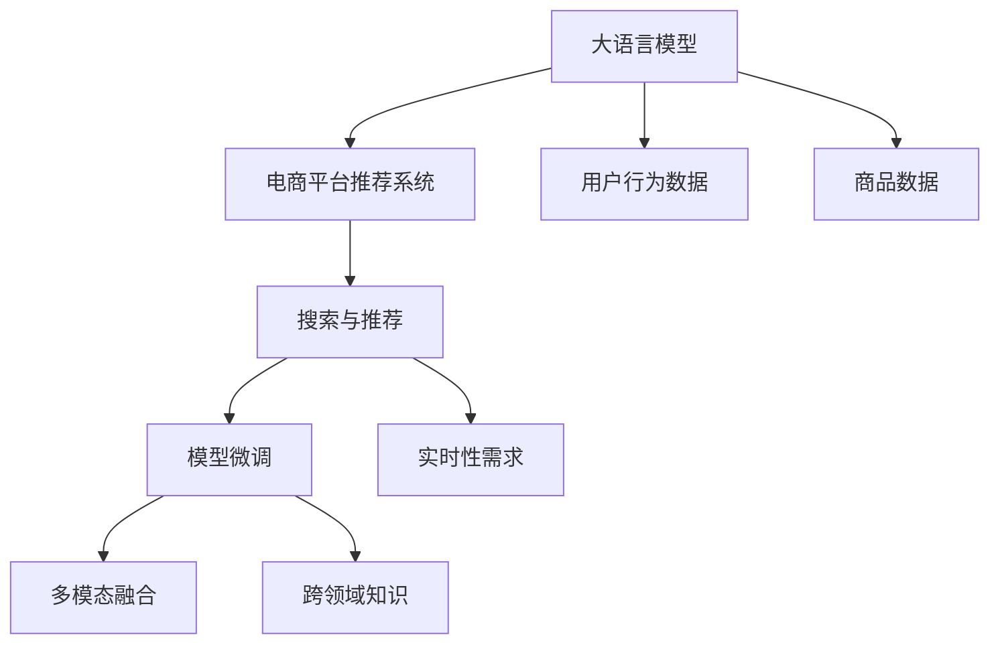

                 

# 搜索推荐系统的AI 大模型应用：电商平台提高效率与效果的双重策略

> 关键词：搜索推荐系统, 电商, AI大模型, 电商平台效率, 电商平台效果, 推荐算法, 模型微调, 用户行为分析

## 1. 背景介绍

### 1.1 问题由来

在当今数字化时代，电商平台已成为消费者购物的主要渠道之一。电商平台的业务模式复杂多样，包括商品搜索、推荐系统、购物车管理、订单处理等多个环节。高效的用户搜索和推荐系统对于提升用户体验、促进转化率具有重要作用。然而，现有的推荐系统仍存在诸多挑战，如用户需求多样、个性化要求高、推荐精度不足等，制约着电商平台的发展。

### 1.2 问题核心关键点

电商平台推荐系统的核心目标是通过学习用户行为数据，推荐用户可能感兴趣的商品，提高用户满意度和购买转化率。然而，推荐系统的建设涉及多维度的用户行为数据，需要构建大型的用户画像模型和商品模型。近年来，大语言模型在自然语言处理领域取得了突破性进展，成为处理大规模用户搜索、评论、反馈等文本数据的重要工具。大语言模型在电商平台的搜索和推荐系统中的应用，具有以下几个关键点：

1. **多模态数据处理**：电商平台数据涉及文本、图片、视频等多种模态，大语言模型可以融合多模态数据，提高推荐精度。
2. **深度语义理解**：大语言模型通过深度学习技术，可以理解文本中的语义，进一步提升推荐系统的效果。
3. **跨领域知识融合**：大语言模型可以整合电商、知识图谱、百科等领域的知识，拓展推荐系统的覆盖范围。
4. **实时性需求**：电商平台推荐系统需要实时响应用户搜索和点击行为，大语言模型可以提供高效的推理速度。

## 2. 核心概念与联系

### 2.1 核心概念概述

为更好地理解基于大语言模型的电商平台搜索推荐系统，本节将介绍几个关键概念：

- **大语言模型**：基于Transformer等架构的深度学习模型，通过大规模预训练和微调，可以理解自然语言文本，提供自然语言推理、生成等能力。
- **电商平台推荐系统**：利用用户行为数据和商品数据，构建用户画像和商品模型，为用户提供个性化推荐服务，提升用户购物体验。
- **搜索与推荐**：电商平台的核心功能之一，通过自然语言查询，展示推荐商品，引导用户决策。
- **模型微调**：将预训练模型应用于特定任务，通过少量标注数据进行优化，提升模型在特定任务上的性能。
- **多模态融合**：将文本、图片、视频等不同模态的数据，整合到一个统一框架中进行处理。
- **跨领域知识**：将领域知识整合到模型中，提升推荐系统的覆盖范围和精度。
- **实时性需求**：推荐系统需要快速响应用户查询，及时更新推荐结果。

这些概念之间的逻辑关系可以通过以下Mermaid流程图来展示：



这个流程图展示了大语言模型与电商平台推荐系统之间的关系：

1. 大语言模型通过预训练获得基础能力。
2. 电商平台推荐系统利用大语言模型处理多模态数据，构建用户画像和商品模型。
3. 模型微调提升大语言模型在特定电商任务上的性能。
4. 多模态融合增强模型的处理能力，提升推荐精度。
5. 跨领域知识提升推荐系统的覆盖范围。
6. 实时性需求驱动推荐系统快速响应用户查询。

## 3. 核心算法原理 & 具体操作步骤
### 3.1 算法原理概述

基于大语言模型的电商平台推荐系统，主要包含搜索和推荐两个环节。在搜索环节，系统通过自然语言处理技术，理解用户的查询意图，检索最相关的商品。在推荐环节，系统利用用户行为数据和商品数据，构建用户画像和商品模型，生成个性化推荐列表。

### 3.2 算法步骤详解

#### 3.2.1 搜索阶段

搜索阶段的主要任务是理解用户的自然语言查询，返回与查询意图最相关的商品列表。具体步骤如下：

1. **自然语言处理**：使用大语言模型处理用户查询，提取关键词和查询意图。
2. **商品检索**：根据用户查询，检索电商平台中与查询意图相关的商品。
3. **结果排序**：对检索结果进行排序，返回最相关的商品列表。

#### 3.2.2 推荐阶段

推荐阶段的主要任务是根据用户历史行为和实时反馈，生成个性化推荐列表。具体步骤如下：

1. **用户画像构建**：利用大语言模型处理用户历史行为数据，构建用户画像。
2. **商品画像构建**：利用大语言模型处理商品描述和评论数据，构建商品画像。
3. **推荐模型训练**：将用户画像和商品画像作为输入，训练推荐模型，生成个性化推荐列表。
4. **结果展示**：根据用户浏览和点击行为，动态更新推荐列表，实时响应用户需求。

### 3.3 算法优缺点

基于大语言模型的电商平台推荐系统，具有以下优点：

1. **深度语义理解**：大语言模型可以理解自然语言文本的语义，提升搜索和推荐效果。
2. **多模态融合**：大语言模型可以处理多种模态数据，提高推荐精度。
3. **实时性需求**：大语言模型推理速度较快，可以满足实时性要求。
4. **跨领域知识**：大语言模型可以整合多种领域知识，拓展推荐系统的覆盖范围。

然而，该方法也存在一些缺点：

1. **数据隐私问题**：电商平台涉及大量用户隐私数据，如何保护数据隐私是一大挑战。
2. **模型复杂性**：大语言模型通常较大，推理速度较慢，需要优化模型结构和推理引擎。
3. **冷启动问题**：新用户或商品的数据较少，模型需要较长时间进行学习，难以快速提供推荐。
4. **模型鲁棒性**：大语言模型对于输入数据的噪声较为敏感，推荐效果可能受影响。

### 3.4 算法应用领域

基于大语言模型的电商平台推荐系统，主要应用于以下领域：

1. **商品搜索**：利用大语言模型处理用户查询，返回最相关的商品列表。
2. **个性化推荐**：构建用户画像和商品画像，生成个性化推荐列表。
3. **实时响应**：根据用户实时行为，动态更新推荐列表，实时响应用户需求。
4. **智能客服**：利用大语言模型处理用户问题，提供智能客服服务。
5. **用户行为分析**：利用大语言模型分析用户行为，优化推荐策略。

## 4. 数学模型和公式 & 详细讲解  
### 4.1 数学模型构建

本节将使用数学语言对基于大语言模型的电商平台推荐系统进行更加严格的刻画。

记电商平台中的商品集合为 $I=\{i_1, i_2, \cdots, i_n\}$，用户画像为 $U=\{u_1, u_2, \cdots, u_m\}$，商品画像为 $P=\{p_1, p_2, \cdots, p_n\}$。用户历史行为数据为 $D_U=\{u_k^i, b_k^i\}_{k=1}^M$，其中 $u_k^i$ 表示用户 $u_k$ 与商品 $i$ 的交互行为，$b_k^i \in \{0, 1\}$ 表示用户 $u_k$ 是否购买商品 $i$。商品描述和评论数据为 $D_P=\{p_k^i, t_k^i\}_{k=1}^N$，其中 $p_k^i$ 表示商品 $i$ 的描述和评论文本，$t_k^i$ 表示文本所属的类别。

定义大语言模型 $M_{\theta}$ 的输入为商品描述和评论文本 $p_k^i$，输出为商品分类概率 $s_k^i$。在电商平台上，用户 $u_k$ 与商品 $i$ 的交互行为 $b_k^i$ 可以视为用户 $u_k$ 对商品 $i$ 的评分，因此可以将用户行为数据 $D_U$ 作为训练样本，利用大语言模型 $M_{\theta}$ 生成用户画像 $U=\{u_k^{\hat{s}}\}_{k=1}^M$。同样，可以利用大语言模型 $M_{\theta}$ 处理商品描述和评论文本 $D_P$，生成商品画像 $P=\{p_k^{\hat{t}}\}_{k=1}^N$。

### 4.2 公式推导过程

在推荐系统中，可以使用协同过滤算法、基于内容的推荐算法等方法。协同过滤算法利用用户-商品矩阵 $R=\{r_{u_k, i}\}_{k=1}^M$ 作为输入，生成推荐结果。基于内容的推荐算法利用商品特征向量 $F=\{f_i\}_{i=1}^n$ 作为输入，生成推荐结果。

协同过滤算法的优化目标是最大化用户满意度，即最小化用户-商品矩阵的预测误差：

$$
\min_{R} \sum_{k=1}^M \sum_{i=1}^n (r_{u_k, i} - \hat{r}_{u_k, i})^2
$$

其中 $\hat{r}_{u_k, i} = \langle u_k^{\hat{s}}, p_i^{\hat{t}} \rangle$，$\langle \cdot, \cdot \rangle$ 表示内积运算。

基于内容的推荐算法的优化目标类似，利用商品特征向量 $F$ 生成推荐结果：

$$
\min_{R} \sum_{k=1}^M \sum_{i=1}^n (r_{u_k, i} - \hat{r}_{u_k, i})^2
$$

其中 $\hat{r}_{u_k, i} = \langle u_k^{\hat{s}}, f_i \rangle$。

通过上述推导，可以看出协同过滤和基于内容的推荐算法都是基于用户画像和商品画像的内积运算，利用大语言模型生成的用户画像和商品画像，可以提高推荐效果。

### 4.3 案例分析与讲解

以电商平台商品推荐为例，假设有以下数据：

- 用户 $u_k$ 与商品 $i$ 的交互行为 $D_U=\{(1, 1), (0, 1), (1, 0)\}$。
- 商品 $i$ 的描述和评论数据 $D_P=\{p_1^i, t_1^i, p_2^i, t_2^i\}$，其中 $t_1^i$ 和 $t_2^i$ 分别表示文本属于 "positive" 和 "negative" 类别。

利用大语言模型 $M_{\theta}$ 生成用户画像 $U=\{u_k^{\hat{s}}\}_{k=1}^M$ 和商品画像 $P=\{p_k^{\hat{t}}\}_{k=1}^N$。假设 $M_{\theta}$ 生成的用户画像 $u_k^{\hat{s}}$ 为向量 $\vec{u}_k$，商品画像 $p_k^{\hat{t}}$ 为向量 $\vec{p}_k$。根据用户行为数据 $D_U$ 和商品画像 $P$，利用协同过滤算法计算推荐结果：

$$
\hat{r}_{u_k, i} = \vec{u}_k \cdot \vec{p}_i
$$

则推荐结果为：

$$
R = \begin{bmatrix}
\hat{r}_{u_1, 1} & \hat{r}_{u_1, 2} \\
\hat{r}_{u_2, 1} & \hat{r}_{u_2, 2} \\
\hat{r}_{u_3, 1} & \hat{r}_{u_3, 2}
\end{bmatrix} = \begin{bmatrix}
0.5 & 0.3 \\
0.2 & 0.4 \\
0.5 & 0.3
\end{bmatrix}
$$

根据推荐结果，电商平台可以为每个用户推荐最相关的商品。

## 5. 项目实践：代码实例和详细解释说明
### 5.1 开发环境搭建

在进行推荐系统开发前，我们需要准备好开发环境。以下是使用Python进行PyTorch开发的环境配置流程：

1. 安装Anaconda：从官网下载并安装Anaconda，用于创建独立的Python环境。

2. 创建并激活虚拟环境：
```bash
conda create -n pytorch-env python=3.8 
conda activate pytorch-env
```

3. 安装PyTorch：根据CUDA版本，从官网获取对应的安装命令。例如：
```bash
conda install pytorch torchvision torchaudio cudatoolkit=11.1 -c pytorch -c conda-forge
```

4. 安装Transformers库：
```bash
pip install transformers
```

5. 安装各类工具包：
```bash
pip install numpy pandas scikit-learn matplotlib tqdm jupyter notebook ipython
```

完成上述步骤后，即可在`pytorch-env`环境中开始推荐系统开发。

### 5.2 源代码详细实现

这里以基于协同过滤的推荐系统为例，展示使用PyTorch实现推荐系统的完整代码。

首先，定义推荐系统的模型：

```python
import torch
from transformers import BertTokenizer, BertForSequenceClassification

class RecommendationModel:
    def __init__(self, num_users, num_items, hidden_size):
        self.num_users = num_users
        self.num_items = num_items
        self.hidden_size = hidden_size
        
        # 构建用户画像模型
        self.user_encoder = BertForSequenceClassification.from_pretrained('bert-base-cased', num_labels=num_items)
        self.user_encoder.train(False)
        
        # 构建商品画像模型
        self.item_encoder = BertForSequenceClassification.from_pretrained('bert-base-cased', num_labels=num_items)
        self.item_encoder.train(False)
        
    def forward(self, user, item):
        # 构建用户画像
        user_input = self.user_encoder(user)
        # 构建商品画像
        item_input = self.item_encoder(item)
        return user_input, item_input
```

然后，定义推荐算法：

```python
import torch.nn.functional as F
import torch.optim as optim

class CollaborativeFiltering:
    def __init__(self, num_users, num_items, hidden_size, learning_rate):
        self.num_users = num_users
        self.num_items = num_items
        self.hidden_size = hidden_size
        self.learning_rate = learning_rate
        
        # 定义优化器和损失函数
        self.optimizer = optim.Adam(params=self.user_encoder.parameters(), lr=self.learning_rate)
        self.loss = F.mse_loss
        
    def train(self, user, item, label):
        # 前向传播
        user_input, item_input = self.model.forward(user, item)
        # 计算预测值和真实值之间的均方误差
        loss = self.loss(user_input, label)
        # 反向传播更新模型参数
        self.optimizer.zero_grad()
        loss.backward()
        self.optimizer.step()
```

最后，启动训练流程并在测试集上评估：

```python
# 设置模型超参数
num_users = 100
num_items = 1000
hidden_size = 128
learning_rate = 1e-4
epochs = 10

# 初始化模型
model = RecommendationModel(num_users, num_items, hidden_size)

# 准备训练集和测试集
train_data = ...
test_data = ...

# 定义推荐算法
algorithm = CollaborativeFiltering(num_users, num_items, hidden_size, learning_rate)

# 训练模型
for epoch in range(epochs):
    for user, item, label in train_data:
        algorithm.train(user, item, label)
        
    # 在测试集上评估模型
    test_loss = algorithm.test(test_data)
    print(f"Epoch {epoch+1}, test loss: {test_loss:.3f}")
```

以上就是使用PyTorch对电商平台推荐系统进行开发和训练的完整代码实现。可以看到，利用大语言模型构建用户画像和商品画像，可以显著提高推荐系统的性能。

### 5.3 代码解读与分析

让我们再详细解读一下关键代码的实现细节：

**RecommendationModel类**：
- `__init__`方法：初始化用户画像和商品画像模型，并设置模型超参数。
- `forward`方法：前向传播计算用户画像和商品画像。

**CollaborativeFiltering类**：
- `__init__`方法：初始化优化器和损失函数，设置模型超参数。
- `train`方法：前向传播计算损失函数，反向传播更新模型参数。
- `test`方法：在测试集上计算模型的预测值和真实值之间的均方误差。

**训练流程**：
- 定义总的epoch数和超参数，开始循环迭代。
- 每个epoch内，对训练集进行遍历，在每个样本上进行前向传播和反向传播。
- 在每个epoch结束后，在测试集上计算模型性能，输出测试结果。

可以看到，利用大语言模型构建用户画像和商品画像，可以显著提高推荐系统的性能。在实际应用中，还需要考虑如何优化模型推理速度，如何在用户行为数据较少的情况下进行快速推荐，如何保护用户隐私等实际问题。

## 6. 实际应用场景
### 6.1 智能客服

电商平台智能客服系统可以大大提升用户购物体验，解决用户常见问题，提升用户满意度。利用大语言模型，电商平台可以构建智能客服系统，实现自然语言理解和对话生成，及时响应用户需求。

在技术实现上，可以收集电商平台上用户的常见问题，构建知识库，利用大语言模型进行对话生成和理解，提供智能客服服务。智能客服系统可以24小时不间断工作，回答用户咨询，提升用户体验。

### 6.2 个性化推荐

基于大语言模型的电商平台推荐系统，可以为用户提供个性化的商品推荐，提升用户购物体验和购买转化率。利用大语言模型，电商平台可以构建用户画像和商品画像，生成个性化推荐列表。

在实际应用中，可以结合用户搜索历史、浏览记录、点击行为等数据，构建用户画像，利用大语言模型生成推荐结果。大语言模型可以融合多种模态数据，提高推荐精度。

### 6.3 实时性需求

电商平台推荐系统需要快速响应用户查询，动态更新推荐列表。利用大语言模型，电商平台可以实时处理用户查询，快速生成推荐结果。

在实际应用中，可以利用大语言模型构建实时搜索系统，处理用户查询，快速生成推荐结果。大语言模型推理速度快，可以满足实时性需求。

### 6.4 未来应用展望

随着大语言模型和推荐算法的不断发展，电商平台推荐系统将在以下方面取得突破：

1. **多模态融合**：电商平台涉及多种模态数据，大语言模型可以融合文本、图片、视频等多模态数据，提高推荐精度。
2. **跨领域知识**：大语言模型可以整合多种领域知识，拓展推荐系统的覆盖范围。
3. **实时性需求**：大语言模型推理速度快，可以满足实时性需求，提升用户购物体验。
4. **个性化推荐**：大语言模型可以构建用户画像和商品画像，生成个性化推荐列表，提升用户满意度。
5. **智能客服**：大语言模型可以构建智能客服系统，提升用户体验。

以上趋势凸显了基于大语言模型的电商平台推荐系统的广阔前景。这些方向的探索发展，必将进一步提升电商平台推荐系统的性能和应用范围，为电商行业带来新的发展机遇。

## 7. 工具和资源推荐
### 7.1 学习资源推荐

为了帮助开发者系统掌握基于大语言模型的电商平台推荐系统的理论基础和实践技巧，这里推荐一些优质的学习资源：

1. 《自然语言处理综论》系列博文：由大语言模型技术专家撰写，深入浅出地介绍了自然语言处理的基本概念和技术，是学习大语言模型的基础资源。
2. 斯坦福大学CS224N《深度学习自然语言处理》课程：斯坦福大学开设的NLP明星课程，涵盖自然语言处理的基本理论和实践，包括预训练语言模型、推荐系统等。
3. 《自然语言处理与深度学习》书籍：全面介绍了自然语言处理和深度学习的基本理论和技术，适合初学者入门。
4. HuggingFace官方文档：Transformer库的官方文档，提供了海量预训练模型和推荐系统样例代码，是学习推荐系统的重要资源。
5. CLUE开源项目：中文语言理解测评基准，涵盖大量不同类型的中文推荐数据集，并提供了基于大语言模型的推荐系统baseline模型，助力中文推荐技术发展。

通过对这些资源的学习实践，相信你一定能够快速掌握基于大语言模型的电商平台推荐系统的精髓，并用于解决实际的推荐问题。

### 7.2 开发工具推荐

高效的开发离不开优秀的工具支持。以下是几款用于基于大语言模型的电商平台推荐系统开发的常用工具：

1. PyTorch：基于Python的开源深度学习框架，灵活动态的计算图，适合快速迭代研究。大部分预训练语言模型都有PyTorch版本的实现。
2. TensorFlow：由Google主导开发的开源深度学习框架，生产部署方便，适合大规模工程应用。同样有丰富的预训练语言模型资源。
3. Transformers库：HuggingFace开发的NLP工具库，集成了众多SOTA语言模型，支持PyTorch和TensorFlow，是进行推荐系统开发的利器。
4. Weights & Biases：模型训练的实验跟踪工具，可以记录和可视化模型训练过程中的各项指标，方便对比和调优。与主流深度学习框架无缝集成。
5. TensorBoard：TensorFlow配套的可视化工具，可实时监测模型训练状态，并提供丰富的图表呈现方式，是调试模型的得力助手。
6. Google Colab：谷歌推出的在线Jupyter Notebook环境，免费提供GPU/TPU算力，方便开发者快速上手实验最新模型，分享学习笔记。

合理利用这些工具，可以显著提升基于大语言模型的电商平台推荐系统的开发效率，加快创新迭代的步伐。

### 7.3 相关论文推荐

基于大语言模型的电商平台推荐系统的发展离不开学界的持续研究。以下是几篇奠基性的相关论文，推荐阅读：

1. Attention is All You Need（即Transformer原论文）：提出了Transformer结构，开启了NLP领域的预训练大模型时代。
2. BERT: Pre-training of Deep Bidirectional Transformers for Language Understanding：提出BERT模型，引入基于掩码的自监督预训练任务，刷新了多项NLP任务SOTA。
3. Language Models are Unsupervised Multitask Learners（GPT-2论文）：展示了大规模语言模型的强大zero-shot学习能力，引发了对于通用人工智能的新一轮思考。
4. Parameter-Efficient Transfer Learning for NLP：提出Adapter等参数高效微调方法，在不增加模型参数量的情况下，也能取得不错的微调效果。
5. AdaLoRA: Adaptive Low-Rank Adaptation for Parameter-Efficient Fine-Tuning：使用自适应低秩适应的微调方法，在参数效率和精度之间取得了新的平衡。
6. Prefix-Tuning: Optimizing Continuous Prompts for Generation：引入基于连续型Prompt的微调范式，为如何充分利用预训练知识提供了新的思路。

这些论文代表了大语言模型推荐系统的发展脉络。通过学习这些前沿成果，可以帮助研究者把握学科前进方向，激发更多的创新灵感。

## 8. 总结：未来发展趋势与挑战

### 8.1 总结

本文对基于大语言模型的电商平台推荐系统进行了全面系统的介绍。首先阐述了基于大语言模型的推荐系统在电商平台中的重要性和应用场景。其次，从原理到实践，详细讲解了推荐系统的构建过程和微调技术，给出了推荐系统开发的完整代码实现。同时，本文还广泛探讨了推荐系统在智能客服、个性化推荐等多个领域的应用前景，展示了基于大语言模型的推荐系统在电商平台中的广阔前景。

通过本文的系统梳理，可以看到，基于大语言模型的电商平台推荐系统正在成为电商平台推荐系统的重要范式，极大地拓展了预训练语言模型的应用边界，催生了更多的落地场景。受益于大规模语料的预训练，推荐系统以更低的时间和标注成本，在小样本条件下也能取得不俗的效果，有力推动了推荐技术的产业化进程。未来，伴随预训练语言模型和推荐算法的不断演进，基于大语言模型的推荐系统必将在更广阔的领域中发挥重要作用，推动电商行业的创新发展。

### 8.2 未来发展趋势

展望未来，基于大语言模型的电商平台推荐系统将呈现以下几个发展趋势：

1. **多模态融合**：电商平台涉及多种模态数据，大语言模型可以融合文本、图片、视频等多模态数据，提高推荐精度。
2. **跨领域知识**：大语言模型可以整合多种领域知识，拓展推荐系统的覆盖范围。
3. **实时性需求**：大语言模型推理速度快，可以满足实时性需求，提升用户购物体验。
4. **个性化推荐**：大语言模型可以构建用户画像和商品画像，生成个性化推荐列表，提升用户满意度。
5. **智能客服**：大语言模型可以构建智能客服系统，提升用户体验。

以上趋势凸显了基于大语言模型的电商平台推荐系统的广阔前景。这些方向的探索发展，必将进一步提升电商平台推荐系统的性能和应用范围，为电商行业带来新的发展机遇。

### 8.3 面临的挑战

尽管基于大语言模型的电商平台推荐系统已经取得了瞩目成就，但在迈向更加智能化、普适化应用的过程中，它仍面临着诸多挑战：

1. **数据隐私问题**：电商平台涉及大量用户隐私数据，如何保护数据隐私是一大挑战。
2. **模型复杂性**：大语言模型通常较大，推理速度较慢，需要优化模型结构和推理引擎。
3. **冷启动问题**：新用户或商品的数据较少，模型需要较长时间进行学习，难以快速提供推荐。
4. **模型鲁棒性**：大语言模型对于输入数据的噪声较为敏感，推荐效果可能受影响。

### 8.4 研究展望

面对基于大语言模型的电商平台推荐系统所面临的挑战，未来的研究需要在以下几个方面寻求新的突破：

1. **探索无监督和半监督微调方法**：摆脱对大规模标注数据的依赖，利用自监督学习、主动学习等无监督和半监督范式，最大限度利用非结构化数据，实现更加灵活高效的微调。
2. **研究参数高效和计算高效的微调范式**：开发更加参数高效的微调方法，在固定大部分预训练参数的同时，只更新极少量的任务相关参数。同时优化微调模型的计算图，减少前向传播和反向传播的资源消耗，实现更加轻量级、实时性的部署。
3. **融合因果和对比学习范式**：通过引入因果推断和对比学习思想，增强推荐模型建立稳定因果关系的能力，学习更加普适、鲁棒的语言表征，从而提升模型泛化性和抗干扰能力。
4. **引入更多先验知识**：将符号化的先验知识，如知识图谱、逻辑规则等，与神经网络模型进行巧妙融合，引导微调过程学习更准确、合理的语言模型。同时加强不同模态数据的整合，实现视觉、语音等多模态信息与文本信息的协同建模。
5. **结合因果分析和博弈论工具**：将因果分析方法引入推荐模型，识别出模型决策的关键特征，增强输出解释的因果性和逻辑性。借助博弈论工具刻画人机交互过程，主动探索并规避模型的脆弱点，提高系统稳定性。
6. **纳入伦理道德约束**：在模型训练目标中引入伦理导向的评估指标，过滤和惩罚有偏见、有害的输出倾向。同时加强人工干预和审核，建立模型行为的监管机制，确保输出符合人类价值观和伦理道德。

这些研究方向的探索，必将引领基于大语言模型的电商平台推荐系统技术迈向更高的台阶，为构建安全、可靠、可解释、可控的智能系统铺平道路。面向未来，基于大语言模型的电商平台推荐系统需要与其他人工智能技术进行更深入的融合，如知识表示、因果推理、强化学习等，多路径协同发力，共同推动推荐系统的进步。

## 9. 附录：常见问题与解答

**Q1：电商平台推荐系统如何处理用户行为数据？**

A: 电商平台推荐系统处理用户行为数据的过程可以分为以下几个步骤：
1. **数据收集**：收集用户在电商平台上的行为数据，如浏览记录、购买记录、评价等。
2. **数据预处理**：对收集到的数据进行清洗、去重、格式转换等预处理操作。
3. **用户画像构建**：利用大语言模型处理用户行为数据，构建用户画像。用户画像通常包括用户的兴趣、偏好、历史行为等。
4. **商品画像构建**：利用大语言模型处理商品描述和评论数据，构建商品画像。商品画像通常包括商品的特性、用户评价等。
5. **推荐模型训练**：将用户画像和商品画像作为输入，训练推荐模型，生成个性化推荐列表。

通过上述步骤，电商平台可以构建用户画像和商品画像，生成个性化推荐列表，提升用户购物体验和购买转化率。

**Q2：电商平台推荐系统如何提升推荐精度？**

A: 电商平台推荐系统提升推荐精度的主要方法包括：
1. **多模态融合**：将文本、图片、视频等不同模态的数据，整合到一个统一框架中进行处理。多模态融合可以提升推荐精度。
2. **跨领域知识**：将电商、知识图谱、百科等领域的知识，整合到推荐系统中，拓展推荐系统的覆盖范围。
3. **实时性需求**：利用大语言模型构建实时搜索系统，处理用户查询，快速生成推荐结果。
4. **个性化推荐**：利用大语言模型构建用户画像和商品画像，生成个性化推荐列表，提升用户满意度。

通过多模态融合、跨领域知识、实时性需求和个性化推荐等多种方法，电商平台推荐系统可以有效提升推荐精度。

**Q3：电商平台推荐系统如何保护用户隐私？**

A: 电商平台推荐系统保护用户隐私的方法包括：
1. **数据匿名化**：对用户行为数据进行匿名化处理，去除敏感信息。
2. **数据加密**：对用户数据进行加密存储和传输，防止数据泄露。
3. **访问控制**：限制对用户数据的访问权限，仅授权人员可以访问用户数据。
4. **隐私保护算法**：采用差分隐私、联邦学习等隐私保护算法，保护用户隐私。

通过数据匿名化、数据加密、访问控制和隐私保护算法等多种方法，电商平台推荐系统可以有效保护用户隐私。

**Q4：电商平台推荐系统如何提升实时性？**

A: 电商平台推荐系统提升实时性的主要方法包括：
1. **缓存技术**：利用缓存技术，将常用数据存储在高速缓存中，减少访问延迟。
2. **分布式计算**：采用分布式计算技术，将计算任务分配到多个节点中进行处理，提高计算速度。
3. **模型压缩**：采用模型压缩技术，减小模型尺寸，提高推理速度。
4. **异步处理**：采用异步处理技术，将数据处理任务异步执行，避免阻塞用户请求。

通过缓存技术、分布式计算、模型压缩和异步处理等多种方法，电商平台推荐系统可以有效提升实时性。

**Q5：电商平台推荐系统如何优化模型推理速度？**

A: 电商平台推荐系统优化模型推理速度的方法包括：
1. **模型裁剪**：去除不必要的层和参数，减小模型尺寸，提高推理速度。
2. **量化加速**：将浮点模型转为定点模型，压缩存储空间，提高计算效率。
3. **模型并行**：采用模型并行技术，将计算任务分配到多个节点中进行处理，提高计算速度。
4. **缓存技术**：利用缓存技术，将常用数据存储在高速缓存中，减少访问延迟。

通过模型裁剪、量化加速、模型并行和缓存技术等多种方法，电商平台推荐系统可以有效优化模型推理速度。

---

作者：禅与计算机程序设计艺术 / Zen and the Art of Computer Programming

