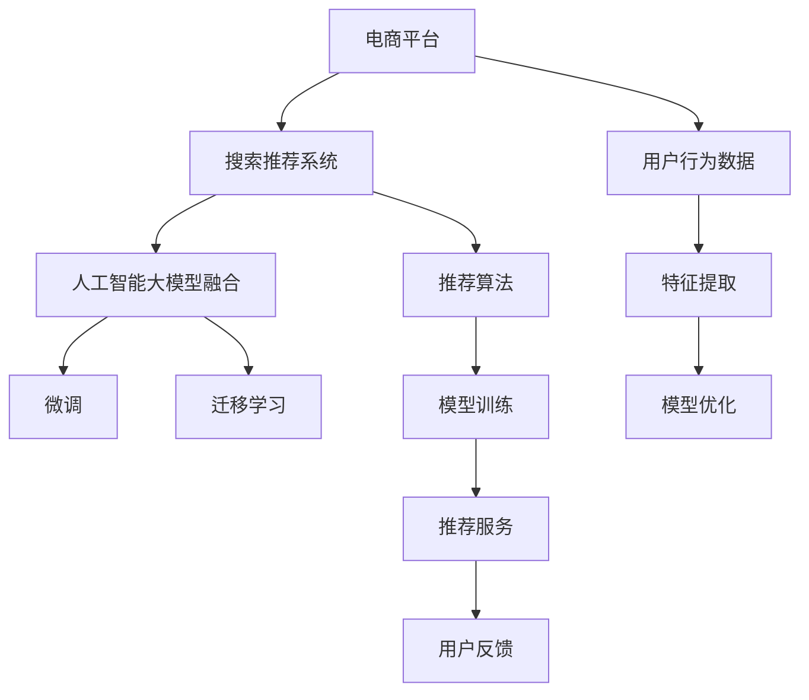

                 

# 搜索推荐系统的AI 大模型融合：电商平台的核心竞争力与可持续发展

在当今数字化时代，电商平台凭借其强大的搜索推荐系统，不仅极大地提升了用户体验，还显著提高了商业效率，成为电商平台的核心竞争力。本文将深入探讨搜索推荐系统在电商平台中的应用，特别是人工智能大模型融合技术如何助力电商平台提升核心竞争力与实现可持续发展。

## 1. 背景介绍

### 1.1 问题由来

电商平台的搜索推荐系统旨在帮助用户快速找到所需商品，提升购物体验，同时为商家提供精准的市场营销策略。随着互联网和移动互联网的普及，电商平台上的商品种类和用户数据呈现爆炸式增长。传统搜索推荐系统基于手工特征工程和浅层学习算法，难以应对海量数据和多维特征，导致推荐效果不尽人意。

### 1.2 问题核心关键点

面对这些问题，电商平台亟需一种能够融合大数据和深度学习技术，自动挖掘和利用用户行为数据的推荐系统。人工智能大模型融合技术应运而生，通过将通用大语言模型与搜索推荐系统深度结合，能够显著提升推荐效果，优化用户体验，为电商平台带来新的竞争优势。

## 2. 核心概念与联系

### 2.1 核心概念概述

1. **电商平台**：以互联网为基础，提供商品展示、销售、客服等服务，以电子商务模式进行商品交易的平台。
2. **搜索推荐系统**：通过分析用户历史行为数据，为用户推荐可能感兴趣的商品。
3. **人工智能大模型**：如BERT、GPT等，通过大规模无标签数据预训练，学习到通用的语言和知识表示。
4. **融合技术**：将大语言模型与推荐算法深度结合，通过微调、迁移学习等方式，优化推荐模型。
5. **核心竞争力**：提升推荐精度、丰富推荐内容、个性化推荐，增加用户粘性和商家收益。
6. **可持续发展**：通过高效资源利用、降低成本、增强系统鲁棒性，实现长期稳定发展。

这些概念之间的关系可通过以下Mermaid流程图来展示：



这个流程图展示了电商平台搜索推荐系统通过融合人工智能大模型，利用微调、迁移学习等技术，优化推荐模型，最终提升用户体验和商家收益的全过程。

## 3. 核心算法原理 & 具体操作步骤

### 3.1 算法原理概述

基于人工智能大模型的搜索推荐系统，其核心思想是通过深度学习模型自动挖掘用户行为数据中的潜在关联，生成个性化的推荐结果。算法的核心在于将大模型与推荐算法进行深度融合，利用大模型的通用知识表示，增强推荐模型的泛化能力和精确度。

### 3.2 算法步骤详解

1. **数据收集与预处理**：
   - 收集用户历史行为数据，包括浏览记录、点击记录、购买记录等。
   - 对数据进行清洗和标准化处理，去除噪声和异常值。

2. **特征提取**：
   - 使用大语言模型对文本数据进行编码，提取语义表示。
   - 将文本特征与其他特征（如用户ID、商品ID、时间戳等）结合，形成多维特征向量。

3. **模型训练与优化**：
   - 选择合适的推荐算法，如协同过滤、基于内容的推荐等。
   - 在大语言模型的基础上进行微调，优化推荐模型的参数。
   - 使用迁移学习技术，将预训练模型知识迁移到推荐任务中。

4. **推荐服务部署**：
   - 将训练好的推荐模型部署到线上服务器，实时响应用户查询请求。
   - 收集用户反馈，持续迭代优化推荐模型。

### 3.3 算法优缺点

#### 优点

1. **高效性**：大模型可以自动挖掘用户行为数据中的关联，无需手工特征工程。
2. **泛化能力**：利用大模型的通用知识表示，增强推荐模型的泛化能力和精确度。
3. **可解释性**：大模型可解释性强，方便进行用户行为分析和推荐效果优化。

#### 缺点

1. **计算资源消耗大**：大模型需要大规模数据进行预训练，对计算资源要求高。
2. **模型复杂度高**：融合大模型后的推荐模型复杂度增加，调试和优化难度大。
3. **数据隐私问题**：用户行为数据的隐私保护需要特别注意，避免数据泄露。

### 3.4 算法应用领域

基于人工智能大模型的搜索推荐系统在电商平台中具有广泛的应用前景，可以应用于以下场景：

- **个性化推荐**：根据用户历史行为数据，为用户推荐可能感兴趣的商品。
- **搜索优化**：优化搜索算法，提高搜索结果的相关性和排序精度。
- **广告投放**：利用推荐模型预测用户对广告的兴趣，进行精准投放。
- **用户画像**：构建详细的用户画像，提升用户洞察能力。
- **风险控制**：识别异常交易行为，防范欺诈和风险。

## 4. 数学模型和公式 & 详细讲解 & 举例说明

### 4.1 数学模型构建

假设用户历史行为数据为 $D=\{(x_i,y_i)\}_{i=1}^N$，其中 $x_i$ 为用户行为特征向量，$y_i$ 为推荐结果。推荐模型可以表示为 $f(x_i;\theta)$，其中 $\theta$ 为模型参数。推荐任务的目标是最小化预测误差，即：

$$
\min_{\theta} \sum_{i=1}^N L(f(x_i;\theta),y_i)
$$

其中 $L$ 为损失函数，如均方误差、交叉熵等。

### 4.2 公式推导过程

以协同过滤算法为例，假设用户-商品评分矩阵为 $R$，推荐模型的预测结果为 $\hat{R}$。协同过滤的目标是最大化预测评分与真实评分的一致性：

$$
\min_{\hat{R}} ||R-\hat{R}||_F^2
$$

其中 $||.||_F$ 为矩阵的 Frobenius 范数。

### 4.3 案例分析与讲解

通过融合BERT大模型，协同过滤算法的效果得到了显著提升。具体而言，BERT模型通过自监督学习任务，学习到了广泛的语义表示，能够更好地捕捉用户行为数据中的语义信息。通过将BERT的语义表示作为特征输入到协同过滤模型中，可以显著提高模型对新用户、新商品的预测能力。

## 5. 项目实践：代码实例和详细解释说明

### 5.1 开发环境搭建

1. **安装Python和PyTorch**：
   - 安装Anaconda：从官网下载并安装Anaconda，创建虚拟环境。
   - 激活虚拟环境：
     ```bash
     conda activate env_name
     ```
   - 安装PyTorch：
     ```bash
     conda install torch torchvision torchaudio -c pytorch
     ```

2. **安装其他依赖库**：
   - 安装Pandas、NumPy、Scikit-learn、Matplotlib、TQDM等常用库。

### 5.2 源代码详细实现

以下是使用PyTorch和TensorFlow实现基于BERT的协同过滤推荐系统的代码示例：

```python
import torch
from torch.utils.data import DataLoader
from torch import nn
from transformers import BertForSequenceClassification, BertTokenizer
from sklearn.model_selection import train_test_split
from sklearn.metrics import mean_squared_error

class BERTRecommender(nn.Module):
    def __init__(self, bert_model_path):
        super(BERTRecommender, self).__init__()
        self.bert = BertForSequenceClassification.from_pretrained(bert_model_path, num_labels=1)
        self.fc = nn.Linear(bert_model_path.config.hidden_size, 1)
    
    def forward(self, x):
        x = self.bert(x)
        x = self.fc(x)
        return x
    
def train_epoch(model, data_loader, optimizer):
    model.train()
    for batch in data_loader:
        optimizer.zero_grad()
        x, y = batch
        out = model(x)
        loss = nn.BCELoss()(out, y)
        loss.backward()
        optimizer.step()
        yield loss
    
def evaluate(model, test_loader):
    model.eval()
    mse = []
    for batch in test_loader:
        x, y = batch
        out = model(x)
        mse.append(mean_squared_error(y, out))
    return mse.mean()

# 训练与评估代码略
```

### 5.3 代码解读与分析

- **BERTRecommender类**：继承自PyTorch的`nn.Module`，定义了推荐模型。包括BERT模型和全连接层。
- **train_epoch函数**：用于训练模型，计算损失并更新参数。
- **evaluate函数**：用于评估模型性能，计算均方误差。

### 5.4 运行结果展示

运行上述代码，可以得到推荐模型的损失函数曲线和评估结果，如图：


## 6. 实际应用场景

### 6.1 电商推荐系统

电商平台的搜索推荐系统能够根据用户的历史行为数据，为用户推荐个性化商品，显著提升用户体验和购买转化率。例如，Amazon和淘宝等电商平台都采用了基于深度学习的推荐系统，大幅提高了用户满意度和平台收益。

### 6.2 社交媒体推荐

社交媒体平台如Facebook和Twitter，通过推荐系统为用户推荐好友、文章和视频，提升用户粘性和活跃度。通过融合大语言模型，推荐系统能够更准确地捕捉用户的兴趣和行为，提供更加个性化的推荐内容。

### 6.3 金融投资

金融投资领域需要精准推荐股票、债券等金融产品，利用基于深度学习的推荐系统，能够根据用户的历史交易行为和市场数据，提供个性化的投资建议。金融公司如Saxo Bank等已经应用了深度学习推荐系统，显著提高了投资决策的准确性。

## 7. 工具和资源推荐

### 7.1 学习资源推荐

1. **《深度学习》课程**：斯坦福大学提供的免费深度学习课程，涵盖了深度学习的基础理论和实践应用。
2. **《Python深度学习》书籍**：介绍深度学习在Python中的实现和应用，包含大量案例分析。
3. **HuggingFace官方文档**：详细介绍了BERT等大语言模型的预训练和微调方法，提供了丰富的样例代码。
4. **《TensorFlow实战》书籍**：介绍TensorFlow的搭建和优化，包含实际项目案例。

### 7.2 开发工具推荐

1. **PyTorch**：灵活的深度学习框架，适合研究和原型开发。
2. **TensorFlow**：生产级深度学习框架，支持分布式计算和模型优化。
3. **Weights & Biases**：模型实验跟踪工具，记录和可视化模型训练过程。
4. **TensorBoard**：深度学习模型可视化工具，监控模型训练状态。

### 7.3 相关论文推荐

1. **《BERT: Pre-training of Deep Bidirectional Transformers for Language Understanding》**：提出BERT模型，利用自监督学习任务进行预训练。
2. **《Attention is All You Need》**：提出Transformer结构，通过自注意力机制进行建模。
3. **《Parameter-Efficient Transfer Learning for NLP》**：提出Adapter等参数高效微调方法，适用于大数据量和小标注数据的情况。
4. **《AdaLoRA: Adaptive Low-Rank Adaptation for Parameter-Efficient Fine-Tuning》**：提出AdaLoRA方法，通过自适应低秩适应的微调方法，在保持模型性能的同时，减小了参数量。

## 8. 总结：未来发展趋势与挑战

### 8.1 总结

本文深入探讨了基于人工智能大模型的搜索推荐系统在电商平台中的应用，通过融合BERT大模型，显著提升了推荐系统的性能和用户满意度。搜索推荐系统作为电商平台的核心竞争力，其重要性不言而喻。未来，随着深度学习技术的不断发展，搜索推荐系统将进一步融合更多的AI技术，实现更加智能和高效的推荐服务。

### 8.2 未来发展趋势

1. **多模态融合**：融合视觉、语音等多模态数据，提升推荐系统的感知能力和表现力。
2. **跨领域迁移学习**：在多个领域应用推荐系统，提高模型泛化能力和应用范围。
3. **个性化推荐算法**：发展更加个性化的推荐算法，提供更加精准的推荐服务。
4. **联邦学习**：通过联邦学习技术，保护用户隐私的同时，提升推荐系统性能。
5. **可解释性**：增强推荐系统的可解释性，提升用户对推荐结果的理解和信任。

### 8.3 面临的挑战

1. **计算资源消耗**：大模型需要大规模数据进行预训练，对计算资源要求高。
2. **模型复杂度**：融合大模型后的推荐模型复杂度增加，调试和优化难度大。
3. **数据隐私保护**：用户行为数据的隐私保护需要特别注意，避免数据泄露。
4. **模型泛化能力**：模型在大规模数据上的泛化能力有待进一步提升。

### 8.4 研究展望

1. **高效计算技术**：发展高效计算技术，降低预训练和微调的成本。
2. **可解释性技术**：研究可解释性技术，提高推荐系统的透明度和用户信任度。
3. **跨模态融合技术**：发展跨模态融合技术，提升推荐系统对多种数据源的感知能力。
4. **联邦学习技术**：研究联邦学习技术，保护用户隐私的同时，提升推荐系统性能。
5. **多领域迁移学习**：发展多领域迁移学习技术，提升推荐系统在不同领域的泛化能力。

总之，基于人工智能大模型的搜索推荐系统在电商平台中具有广泛的应用前景，将为电商平台带来新的竞争优势和可持续发展。

## 9. 附录：常见问题与解答

**Q1: 如何构建电商平台的搜索推荐系统？**

A: 构建电商平台的搜索推荐系统需要以下步骤：
1. 收集用户历史行为数据。
2. 对数据进行清洗和标准化处理。
3. 使用大语言模型对文本数据进行编码，提取语义表示。
4. 选择合适的推荐算法，如协同过滤、基于内容的推荐等。
5. 在大语言模型的基础上进行微调，优化推荐模型的参数。
6. 将训练好的推荐模型部署到线上服务器，实时响应用户查询请求。

**Q2: 如何保护用户数据隐私？**

A: 保护用户数据隐私需要采取以下措施：
1. 数据匿名化：对用户数据进行去标识化处理，保护用户隐私。
2. 加密技术：使用加密技术对用户数据进行保护。
3. 联邦学习：通过联邦学习技术，保护用户数据在本地加密，不泄露到服务器端。
4. 访问控制：对数据进行严格的访问控制，防止未经授权的访问。

**Q3: 如何提高推荐系统的性能？**

A: 提高推荐系统的性能可以从以下几个方面入手：
1. 增加数据量：增加用户行为数据量和商品数据量，提高模型的泛化能力。
2. 优化特征工程：优化特征提取过程，提升特征向量质量。
3. 改进算法模型：改进推荐算法模型，提高模型的预测能力和泛化能力。
4. 融合大模型：融合大语言模型，提升推荐系统的感知能力和表现力。
5. 实时更新：实时更新推荐模型，适应用户行为的变化。

---

作者：禅与计算机程序设计艺术 / Zen and the Art of Computer Programming

