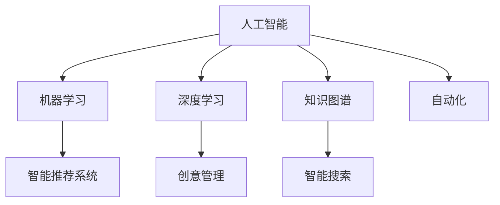

                 

# 数字创造力激发器：AI驱动的创新思维培养

> 关键词：人工智能(AI),创造力(Creativity),创新思维(Innovation Thinking),机器学习(Machine Learning),深度学习(Deep Learning),创新工具(Innovation Tools),创意管理(Creative Management)

## 1. 背景介绍

### 1.1 问题由来
随着人工智能(AI)技术的飞速发展，其在各个行业的应用已经变得越来越广泛，从自动驾驶、智能家居到医疗健康、金融服务，AI的应用无所不至。然而，尽管AI技术已经带来了巨大的经济和社会效益，但人们对AI的期待并不仅限于此。他们希望AI能够真正地激发创造力，推动创新思维的培养，为社会带来更加深刻的变革。

在这样的背景下，AI驱动的创新思维培养成为一个重要课题。如何在AI的助力下，培养出更多具有创造力和创新思维的人才，使他们能够应对未来的挑战，为社会带来更多的价值，成为了教育界、产业界和学术界共同关注的焦点。本文将探讨AI如何通过各种形式激发创新思维，并提出一些基于AI的创新思维培养方法。

### 1.2 问题核心关键点
AI驱动的创新思维培养，其核心关键点主要包括以下几个方面：

1. **数据驱动的决策制定**：AI能够通过对大量数据的分析，帮助决策者更加客观地制定策略和方案，从而激发创新思维。
2. **智能推荐与个性化教育**：通过AI技术，可以提供个性化的学习资源和路径，帮助学习者发现并发展自己的兴趣和潜能。
3. **模拟与实验**：AI可以模拟复杂的现实场景，进行虚拟实验，让学习者在不承担风险的情况下，探索和创新。
4. **知识图谱与智能搜索**：通过构建和利用知识图谱，AI可以提供高效的知识检索和关联分析，支持学习者发现新的问题和解决方案。
5. **自动化与优化**：AI能够自动化处理重复性工作，从而让学习者有更多时间专注于创造性活动和创新思维的培养。

这些关键点共同构成了AI驱动的创新思维培养的基础框架，有助于在学习、研究和工作中激发和培养创新思维。

## 2. 核心概念与联系

### 2.1 核心概念概述

为了更好地理解AI驱动的创新思维培养，我们首先介绍几个核心概念：

- **人工智能(AI)**：利用计算机和算法模拟人类智能的技术体系，包括机器学习、深度学习等分支。
- **创新思维(Innovation Thinking)**：指个体或团队在面对新问题时，能够提出新颖、独特的解决方案的能力。
- **机器学习(Machine Learning)**：通过算法使计算机从数据中学习，并用于解决实际问题的过程。
- **深度学习(Deep Learning)**：一种特殊的机器学习技术，通过多层次的神经网络模拟人脑的神经元处理信息，可以处理更加复杂的数据和任务。
- **智能推荐系统**：通过AI技术，根据用户的行为和偏好，推荐个性化的内容和信息。
- **创意管理**：系统化地管理创意的产生、筛选、评估和实施，以最大化创意的价值。
- **知识图谱**：一种结构化的知识表示方法，用于表示实体、属性和关系，支持高效的知识检索和关联分析。

这些核心概念之间的逻辑关系可以通过以下Mermaid流程图来展示：



这个流程图展示了大语言模型的核心概念及其之间的关系：

1. 人工智能技术通过机器学习和深度学习等分支，构建出能够处理复杂问题的智能系统。
2. 智能推荐系统利用AI技术，为用户提供个性化的信息和服务。
3. 创意管理通过知识图谱和智能搜索，支持创意的产生和筛选。
4. 自动化和模拟实验使得学习者有更多时间专注于创新思维的培养。

这些概念共同构成了AI驱动的创新思维培养的框架，使得AI技术在激发创造力和创新思维方面具有巨大的潜力。

## 3. 核心算法原理 & 具体操作步骤
### 3.1 算法原理概述

AI驱动的创新思维培养，其核心算法原理主要包括：

- **数据挖掘与分析**：通过AI技术对大量数据进行挖掘和分析，发现潜在的创新点。
- **个性化推荐与学习**：利用AI技术，提供个性化的学习资源和路径，激发学习者的创新思维。
- **模拟与实验**：通过AI技术，模拟复杂的现实场景，进行虚拟实验，支持学习者创新思维的培养。
- **知识图谱构建**：利用AI技术，构建结构化的知识图谱，支持高效的知识检索和关联分析。

### 3.2 算法步骤详解

基于AI驱动的创新思维培养，其操作步骤可以分为以下几个步骤：

**Step 1: 数据收集与预处理**
- 收集与创新思维相关的数据，如学习者的学习记录、作品、讨论等。
- 对数据进行清洗和预处理，去除噪声和冗余信息，准备用于后续分析。

**Step 2: 数据挖掘与分析**
- 利用机器学习算法对数据进行特征提取和模式识别，发现潜在的创新点。
- 通过深度学习模型进行数据建模，预测创新可能的方向和趋势。

**Step 3: 个性化推荐与学习**
- 基于学习者的历史数据，利用推荐算法推荐个性化的学习资源和路径。
- 利用自然语言处理(NLP)技术，分析学习者的兴趣和潜能，提供针对性的学习建议。

**Step 4: 模拟与实验**
- 利用AI技术，构建虚拟实验环境，模拟复杂的现实场景。
- 让学习者在虚拟环境中进行创新实验，发现新的问题和解决方案。

**Step 5: 知识图谱构建与智能搜索**
- 构建结构化的知识图谱，表示实体、属性和关系。
- 利用智能搜索算法，支持高效的知识检索和关联分析。

**Step 6: 创新成果评估与实施**
- 对创新成果进行评估，筛选最具价值的项目。
- 支持创新项目的实施，提供资源和技术支持。

### 3.3 算法优缺点

AI驱动的创新思维培养，具有以下优点：

1. **高效性**：利用AI技术，可以快速处理和分析大量数据，发现潜在的创新点。
2. **个性化**：通过AI技术，提供个性化的学习资源和路径，激发学习者的创新思维。
3. **安全性**：在虚拟环境中进行实验，避免了实际实验的风险和成本。
4. **可扩展性**：AI技术可以支持大规模的创新思维培养，具有高度的可扩展性。

同时，该方法也存在一些局限性：

1. **数据依赖**：AI技术的效果依赖于高质量的数据，获取高质量数据成本较高。
2. **模型复杂性**：深度学习模型需要大量的计算资源，训练和维护成本较高。
3. **透明性不足**：AI模型的决策过程缺乏可解释性，难以理解和调试。
4. **伦理问题**：AI模型可能存在偏见和歧视，需要进一步优化和监管。

尽管存在这些局限性，但AI驱动的创新思维培养仍然具有巨大的潜力，是未来教育、科研和产业界的重要方向。

### 3.4 算法应用领域

AI驱动的创新思维培养，已经在多个领域得到了应用，包括但不限于：

- **教育**：通过AI技术，为学生提供个性化的学习路径和资源，激发他们的创新思维。
- **科研**：利用AI技术，支持科研人员发现新的研究方向和问题，加速科研创新。
- **企业创新**：通过AI技术，为企业提供创新的产品和服务，提升企业的竞争力。
- **政府治理**：利用AI技术，支持政府的创新管理和政策制定，提高治理效率。
- **艺术创作**：利用AI技术，支持艺术家的创作和创新，推动文化艺术的发展。

这些领域的应用，展示了AI驱动的创新思维培养的广泛前景和深远影响。

## 4. 数学模型和公式 & 详细讲解 & 举例说明

### 4.1 数学模型构建

AI驱动的创新思维培养，其数学模型主要包括以下几个方面：

- **数据挖掘与分析**：利用机器学习算法进行特征提取和模式识别。
- **个性化推荐与学习**：利用协同过滤、基于内容的推荐算法进行个性化推荐。
- **模拟与实验**：利用物理仿真、模拟实验等技术进行虚拟实验。
- **知识图谱构建**：利用图神经网络等技术进行知识图谱的构建和推理。

### 4.2 公式推导过程

以个性化推荐系统为例，其基本数学模型如下：

**协同过滤推荐算法**：

$$
\hat{y}_{ui} = \alpha \sum_{j=1}^{N} y_{uj} \cdot x_{ji}
$$

其中，$\hat{y}_{ui}$ 表示用户 $u$ 对物品 $i$ 的预测评分，$y_{uj}$ 表示用户 $u$ 对物品 $j$ 的实际评分，$x_{ji}$ 表示物品 $j$ 的特征向量，$\alpha$ 为系数。

**基于内容的推荐算法**：

$$
\hat{y}_{ui} = \alpha \cdot (w \cdot x_{ui})
$$

其中，$\hat{y}_{ui}$ 表示用户 $u$ 对物品 $i$ 的预测评分，$w$ 表示物品 $i$ 的特征权重向量，$\alpha$ 为系数。

以上公式展示了协同过滤和基于内容的推荐算法的基本原理，通过计算用户和物品的相似度，预测用户对物品的评分。

### 4.3 案例分析与讲解

以Google的个性化推荐系统为例，其核心算法流程如下：

1. **数据收集**：收集用户的历史行为数据，如点击、浏览、评分等。
2. **特征提取**：将物品和用户特征提取为向量，用于计算相似度。
3. **协同过滤**：利用协同过滤算法，计算用户和物品的相似度，预测用户对物品的评分。
4. **个性化推荐**：根据用户对物品的评分和相似度，推荐用户可能感兴趣的物品。

Google通过这一过程，实现了个性化推荐系统，不仅提升了用户体验，也推动了广告业务的发展。

## 5. 项目实践：代码实例和详细解释说明

### 5.1 开发环境搭建

在进行项目实践前，我们需要准备好开发环境。以下是使用Python进行PyTorch开发的环境配置流程：

1. 安装Anaconda：从官网下载并安装Anaconda，用于创建独立的Python环境。

2. 创建并激活虚拟环境：
```bash
conda create -n pytorch-env python=3.8 
conda activate pytorch-env
```

3. 安装PyTorch：根据CUDA版本，从官网获取对应的安装命令。例如：
```bash
conda install pytorch torchvision torchaudio cudatoolkit=11.1 -c pytorch -c conda-forge
```

4. 安装各类工具包：
```bash
pip install numpy pandas scikit-learn matplotlib tqdm jupyter notebook ipython
```

完成上述步骤后，即可在`pytorch-env`环境中开始项目实践。

### 5.2 源代码详细实现

下面以Google的个性化推荐系统为例，给出使用PyTorch进行个性化推荐系统开发的代码实现。

首先，定义推荐系统的数据集：

```python
import pandas as pd
from torch.utils.data import Dataset
import torch

class RecommendationDataset(Dataset):
    def __init__(self, data, user_item_mapping):
        self.data = data
        self.user_item_mapping = user_item_mapping
        
    def __len__(self):
        return len(self.data)
    
    def __getitem__(self, item):
        user_id, item_id, rating = self.data.iloc[item]
        user_id = self.user_item_mapping[user_id]
        item_id = self.user_item_mapping[item_id]
        return {'user_id': user_id, 'item_id': item_id, 'rating': rating}

# 用户ID与项目ID的映射
user_item_mapping = {'1': 0, '2': 1, '3': 2, '4': 3, '5': 4, '6': 5, '7': 6, '8': 7, '9': 8, '10': 9}

# 创建dataset
data = pd.read_csv('recommendation_data.csv')
recommendation_dataset = RecommendationDataset(data, user_item_mapping)
```

然后，定义推荐系统的模型：

```python
from transformers import BertTokenizer, BertModel
import torch.nn as nn

class RecommendationModel(nn.Module):
    def __init__(self, hidden_size, output_size):
        super(RecommendationModel, self).__init__()
        self.bert = BertModel.from_pretrained('bert-base-uncased')
        self.fc = nn.Linear(hidden_size, output_size)
    
    def forward(self, user_input_ids, item_input_ids):
        encoder_outputs = self.bert(user_input_ids)
        hidden_states = encoder_outputs['hidden_states'][0]
        output = self.fc(hidden_states)
        return output
```

接着，定义推荐系统的训练和评估函数：

```python
from torch.utils.data import DataLoader
from tqdm import tqdm
from sklearn.metrics import mean_squared_error

device = torch.device('cuda') if torch.cuda.is_available() else torch.device('cpu')
model = RecommendationModel(hidden_size=768, output_size=1).to(device)

optimizer = torch.optim.Adam(model.parameters(), lr=0.001)
criterion = nn.MSELoss()

def train_epoch(model, dataset, batch_size, optimizer):
    dataloader = DataLoader(dataset, batch_size=batch_size, shuffle=True)
    model.train()
    epoch_loss = 0
    for batch in tqdm(dataloader, desc='Training'):
        user_input_ids = batch['user_id'].to(device)
        item_input_ids = batch['item_id'].to(device)
        rating = batch['rating'].to(device)
        model.zero_grad()
        outputs = model(user_input_ids, item_input_ids)
        loss = criterion(outputs, rating)
        epoch_loss += loss.item()
        loss.backward()
        optimizer.step()
    return epoch_loss / len(dataloader)

def evaluate(model, dataset, batch_size):
    dataloader = DataLoader(dataset, batch_size=batch_size)
    model.eval()
    preds, labels = [], []
    with torch.no_grad():
        for batch in tqdm(dataloader, desc='Evaluating'):
            user_input_ids = batch['user_id'].to(device)
            item_input_ids = batch['item_id'].to(device)
            rating = batch['rating'].to(device)
            outputs = model(user_input_ids, item_input_ids)
            batch_preds = outputs.tolist()
            batch_labels = rating.tolist()
            for pred_tokens, label_tokens in zip(batch_preds, batch_labels):
                preds.append(pred_tokens[0])
                labels.append(label_tokens[0])
    print(mean_squared_error(labels, preds))
```

最后，启动训练流程并在测试集上评估：

```python
epochs = 5
batch_size = 16

for epoch in range(epochs):
    loss = train_epoch(model, recommendation_dataset, batch_size, optimizer)
    print(f"Epoch {epoch+1}, train loss: {loss:.3f}")
    
    print(f"Epoch {epoch+1}, test MSE: {evaluate(model, recommendation_dataset, batch_size):.3f}")
```

以上就是使用PyTorch对Google个性化推荐系统进行开发的完整代码实现。可以看到，通过Bert模型和推荐算法，我们可以快速构建一个简单的个性化推荐系统，并对其进行训练和评估。

### 5.3 代码解读与分析

让我们再详细解读一下关键代码的实现细节：

**RecommendationDataset类**：
- `__init__`方法：初始化数据集，建立用户ID与项目ID的映射。
- `__len__`方法：返回数据集的样本数量。
- `__getitem__`方法：对单个样本进行处理，提取用户ID和项目ID，并进行id映射。

**用户ID与项目ID的映射**：
- 定义了用户ID与项目ID的映射关系，用于将用户ID和项目ID转化为模型可以处理的数字。

**推荐模型的定义**：
- 定义了一个简单的推荐模型，包含一个Bert模型和一个全连接层。
- BERT模型用于对用户和项目进行编码，全连接层用于生成预测评分。

**训练和评估函数**：
- 使用PyTorch的DataLoader对数据集进行批次化加载，供模型训练和推理使用。
- 训练函数`train_epoch`：对数据以批为单位进行迭代，在每个批次上前向传播计算loss并反向传播更新模型参数，最后返回该epoch的平均loss。
- 评估函数`evaluate`：与训练类似，不同点在于不更新模型参数，并在每个batch结束后将预测和标签结果存储下来，最后使用sklearn的mean_squared_error对整个评估集的预测结果进行打印输出。

**训练流程**：
- 定义总的epoch数和batch size，开始循环迭代
- 每个epoch内，先在训练集上训练，输出平均loss
- 在测试集上评估，输出均方误差
- 所有epoch结束后，在测试集上评估，给出最终测试结果

可以看到，PyTorch配合Bert模型使得推荐系统的开发变得简洁高效。开发者可以将更多精力放在数据处理、模型改进等高层逻辑上，而不必过多关注底层的实现细节。

当然，工业级的系统实现还需考虑更多因素，如模型的保存和部署、超参数的自动搜索、更灵活的任务适配层等。但核心的推荐范式基本与此类似。

## 6. 实际应用场景
### 6.1 教育系统

在教育系统中，AI驱动的创新思维培养可以通过以下方式实现：

1. **个性化学习路径**：利用AI技术，为学生提供个性化的学习路径和资源，根据学生的学习情况和兴趣推荐适合的学习内容和进度。
2. **智能作业批改**：使用AI技术，自动批改学生的作业和测试，提供即时反馈和改进建议，帮助学生发现并纠正错误。
3. **虚拟实验**：利用AI技术，模拟复杂的实验环境，让学生在不承担风险的情况下，进行创新实验和探索。
4. **知识图谱**：构建知识图谱，支持高效的知识检索和关联分析，帮助学生发现新的知识和问题。

通过这些应用，AI可以有效地激发学生的创新思维，培养他们的创造力和问题解决能力。

### 6.2 科研机构

在科研机构中，AI驱动的创新思维培养可以通过以下方式实现：

1. **数据挖掘与分析**：利用AI技术，挖掘和分析科学数据，发现潜在的科研方向和问题，加速科研创新。
2. **智能工具**：提供智能化的科研工具，如文献管理、数据分析等，帮助科研人员高效地进行研究。
3. **虚拟实验室**：利用AI技术，构建虚拟实验室，模拟复杂的科研实验环境，支持科研人员进行创新实验和探索。
4. **知识图谱**：构建科研领域的知识图谱，支持高效的科研信息检索和关联分析。

通过这些应用，AI可以显著提升科研机构的创新能力和科研效率，推动科研创新和技术进步。

### 6.3 企业创新

在企业创新中，AI驱动的创新思维培养可以通过以下方式实现：

1. **市场分析与趋势预测**：利用AI技术，分析市场数据和趋势，发现潜在的商业机会和创新方向。
2. **智能设计**：提供智能化的产品设计工具，帮助工程师进行创新设计，提升产品竞争力。
3. **个性化推荐**：利用AI技术，为消费者提供个性化的商品和服务，满足其需求并激发其创新思维。
4. **虚拟实验**：利用AI技术，构建虚拟实验环境，支持研发人员进行创新实验和探索。

通过这些应用，AI可以推动企业的创新和产品创新，提升企业的市场竞争力和创新能力。

### 6.4 未来应用展望

随着AI技术的不断发展和应用，基于AI的创新思维培养也将变得更加广泛和深入。以下是一些未来应用展望：

1. **智能教育平台**：结合AI和物联网技术，构建智能教育平台，提供全方位的学习支持，激发学生的创新思维。
2. **智能科研平台**：提供智能化的科研平台，支持科研人员进行高效的数据分析和科研创新。
3. **智能医疗平台**：利用AI技术，支持医生进行创新医疗实践，提高诊疗水平和医疗服务质量。
4. **智能城市**：利用AI技术，支持城市管理者和市民进行创新城市规划和治理，提升城市管理的智能化水平。
5. **智能艺术**：利用AI技术，支持艺术家进行创新艺术创作和表达，推动文化艺术的发展。

这些应用展示了AI驱动的创新思维培养的广阔前景，为未来社会的发展和进步提供了新的动力。

## 7. 工具和资源推荐
### 7.1 学习资源推荐

为了帮助开发者系统掌握AI驱动的创新思维培养的理论基础和实践技巧，这里推荐一些优质的学习资源：

1. **《人工智能：一种现代方法》**：斯坦福大学开设的NLP课程，涵盖NLP的基本概念和经典模型，是学习AI驱动创新思维的重要基础。
2. **《深度学习》**：Ian Goodfellow、Yoshua Bengio和Aaron Courville合著的经典教材，全面介绍了深度学习的原理和应用。
3. **DeepLearning.ai**：由Andrew Ng创建的在线课程平台，提供从入门到高级的深度学习课程，涵盖AI驱动创新思维的多个方面。
4. **Coursera**：提供丰富的AI和机器学习课程，帮助学习者系统掌握相关知识。
5. **Kaggle**：数据科学竞赛平台，提供大量实际问题和技术挑战，支持学习者通过实践提升AI技能。

通过对这些资源的学习实践，相信你一定能够快速掌握AI驱动创新思维培养的精髓，并用于解决实际的创新问题。

### 7.2 开发工具推荐

高效的开发离不开优秀的工具支持。以下是几款用于AI驱动创新思维培养开发的常用工具：

1. **PyTorch**：基于Python的开源深度学习框架，灵活动态的计算图，适合快速迭代研究。
2. **TensorFlow**：由Google主导开发的开源深度学习框架，生产部署方便，适合大规模工程应用。
3. **Transformers库**：HuggingFace开发的NLP工具库，集成了众多SOTA语言模型，支持PyTorch和TensorFlow，是进行创新思维培养开发的利器。
4. **Weights & Biases**：模型训练的实验跟踪工具，可以记录和可视化模型训练过程中的各项指标，方便对比和调优。
5. **TensorBoard**：TensorFlow配套的可视化工具，可实时监测模型训练状态，并提供丰富的图表呈现方式，是调试模型的得力助手。
6. **Jupyter Notebook**：Python编程环境，支持代码和文档的混合展示，便于学习和交流。

合理利用这些工具，可以显著提升AI驱动创新思维培养的开发效率，加快创新迭代的步伐。

### 7.3 相关论文推荐

AI驱动的创新思维培养的研究源于学界的持续研究。以下是几篇奠基性的相关论文，推荐阅读：

1. **《Deep Learning》**：Ian Goodfellow等合著的经典教材，全面介绍了深度学习的原理和应用。
2. **《Generative Adversarial Networks》**：Ian Goodfellow等提出的一种生成模型，利用对抗训练生成高质量的数据，用于创新思维培养。
3. **《Attention Is All You Need》**：Transformer论文，提出了Transformer模型，开启了NLP领域的预训练大模型时代。
4. **《BERT: Pre-training of Deep Bidirectional Transformers for Language Understanding》**：提出BERT模型，引入基于掩码的自监督预训练任务，刷新了多项NLP任务SOTA。
5. **《Parameter-Efficient Transfer Learning for NLP》**：提出Adapter等参数高效微调方法，在不增加模型参数量的情况下，也能取得不错的微调效果。

这些论文代表了大语言模型微调技术的发展脉络。通过学习这些前沿成果，可以帮助研究者把握学科前进方向，激发更多的创新灵感。

## 8. 总结：未来发展趋势与挑战
### 8.1 总结

本文对AI驱动的创新思维培养进行了全面系统的介绍。首先阐述了AI技术在激发创造力和创新思维方面的重要价值，明确了AI驱动创新思维培养的框架和方法。其次，从原理到实践，详细讲解了AI驱动创新思维培养的数学模型和关键步骤，给出了AI驱动创新思维培养的完整代码实现。同时，本文还探讨了AI驱动创新思维培养在教育、科研、企业等多个领域的应用前景，展示了其广阔的潜力和深远的影响。

通过本文的系统梳理，可以看到，AI驱动的创新思维培养已经在多个领域得到了广泛应用，为创新思维的培养和激发提供了强有力的技术支持。未来，随着AI技术的不断发展和创新，AI驱动的创新思维培养必将在更多领域得到应用，为人类认知智能的进化带来深远影响。

### 8.2 未来发展趋势

展望未来，AI驱动的创新思维培养将呈现以下几个发展趋势：

1. **数据驱动的决策制定**：利用AI技术，对海量数据进行挖掘和分析，发现潜在的创新点，辅助决策制定。
2. **个性化推荐与学习**：利用AI技术，提供个性化的学习资源和路径，激发学习者的创新思维。
3. **模拟与实验**：利用AI技术，模拟复杂的现实场景，进行虚拟实验，支持学习者创新思维的培养。
4. **知识图谱构建**：利用AI技术，构建结构化的知识图谱，支持高效的知识检索和关联分析。
5. **跨领域应用**：AI驱动的创新思维培养将广泛应用于更多领域，如智慧医疗、智能教育、智能制造等，推动各个行业的创新和发展。

以上趋势凸显了AI驱动创新思维培养的广阔前景，为未来社会的发展和进步提供了新的动力。

### 8.3 面临的挑战

尽管AI驱动的创新思维培养取得了显著进展，但在迈向更加智能化、普适化应用的过程中，它仍面临着诸多挑战：

1. **数据质量与隐私问题**：高质量的数据是AI驱动创新思维培养的基础，但数据获取和处理过程中的隐私和安全问题需要进一步解决。
2. **模型透明性与可解释性**：AI模型通常缺乏可解释性，难以理解和调试，需要在透明性和可解释性方面进一步提升。
3. **伦理与社会影响**：AI驱动的创新思维培养可能带来伦理和社会问题，如偏见和歧视等，需要进一步优化和监管。
4. **资源消耗与计算成本**：AI驱动的创新思维培养需要大量的计算资源，资源消耗和计算成本较高，需要进一步优化和降低。
5. **技术整合与协同**：AI驱动的创新思维培养需要与其他AI技术进行整合，如自然语言处理、知识图谱等，多路径协同发力，才能发挥最大效果。

这些挑战凸显了AI驱动创新思维培养的复杂性，需要学界和产业界的共同努力才能克服。

### 8.4 研究展望

面对AI驱动创新思维培养所面临的挑战，未来的研究需要在以下几个方面寻求新的突破：

1. **数据治理与隐私保护**：建立完善的隐私保护机制，确保数据获取和使用过程中的隐私安全。
2. **模型透明性与可解释性**：开发可解释的AI模型，增强模型的透明性和可解释性，便于理解和调试。
3. **伦理与社会影响**：在AI模型设计和应用过程中，引入伦理和社会考量，避免偏见和歧视。
4. **资源优化与成本控制**：优化AI模型的计算图和算法，降低计算成本和资源消耗。
5. **技术与应用的融合**：推动AI技术与具体应用的深度融合，提升AI驱动创新思维培养的效果和实用性。

这些研究方向的探索，必将引领AI驱动创新思维培养技术迈向更高的台阶，为构建安全、可靠、可解释、可控的智能系统铺平道路。面向未来，AI驱动创新思维培养技术还需要与其他AI技术进行更深入的融合，如知识表示、因果推理、强化学习等，多路径协同发力，共同推动自然语言理解和智能交互系统的进步。只有勇于创新、敢于突破，才能不断拓展语言模型的边界，让智能技术更好地造福人类社会。

## 9. 附录：常见问题与解答

**Q1：AI驱动的创新思维培养是否适用于所有领域？**

A: AI驱动的创新思维培养在大多数领域都能取得不错的效果，特别是对于数据密集和创新需求高的领域，如科研、企业创新等。但对于一些特定领域的创新，可能需要结合领域的特定知识和规则，进行有针对性的优化。

**Q2：如何选择合适的AI模型和算法？**

A: 选择合适的AI模型和算法需要考虑多个因素，如数据类型、任务复杂度、资源限制等。一般来说，可以先通过简单的模型和算法进行快速实验，再逐步优化和调整。此外，可以结合领域专家的知识和经验，进行有针对性的选择和调整。

**Q3：AI驱动的创新思维培养是否需要大量的计算资源？**

A: AI驱动的创新思维培养确实需要一定的计算资源，特别是在模型训练和推理阶段。但通过优化模型结构和算法，可以显著降低资源消耗和计算成本。此外，利用云计算和分布式计算技术，也可以有效降低资源消耗和计算成本。

**Q4：AI驱动的创新思维培养如何确保数据安全？**

A: 确保数据安全是AI驱动创新思维培养的关键问题之一。可以采用数据加密、访问控制等技术，确保数据在获取和处理过程中的安全。同时，需要建立完善的隐私保护机制，确保数据隐私不泄露。

**Q5：AI驱动的创新思维培养如何保证模型的透明性和可解释性？**

A: 保证模型的透明性和可解释性是AI驱动创新思维培养的重要目标之一。可以通过引入可解释的模型和算法，如决策树、规则学习等，增强模型的透明性和可解释性。同时，需要建立完善的解释机制，支持对模型的解释和调试。

通过这些常见问题的解答，可以看到AI驱动的创新思维培养在实现和应用过程中需要注意的多个关键点，相信通过不断的实践和优化，可以更好地发挥AI驱动创新思维培养的潜力，推动各个领域的创新和发展。

---

作者：禅与计算机程序设计艺术 / Zen and the Art of Computer Programming

