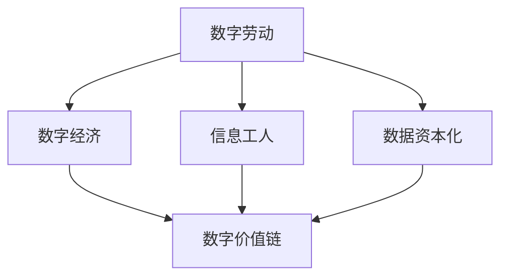

                 

# 数字劳动：人类计算的社会和经济影响分析

> 关键词：数字劳动, 人类计算, 数据资本化, 信息工人, 数字经济, 数据价值链

## 1. 背景介绍

在当今数字化时代，计算能力已经成为推动社会经济发展的重要引擎。随着互联网和人工智能技术的迅猛发展，数字劳动的概念逐渐走入公众视野。数字劳动，即通过电子设备和网络进行计算和数据处理的过程，在很大程度上重塑了人类的工作方式和产业结构。本文旨在深入分析数字劳动的社会和经济影响，探讨其未来发展趋势和面临的挑战，为理解和应对数字劳动的广泛影响提供理论依据和实践指导。

### 1.1 数字劳动的兴起

数字劳动的概念最早由德国学者汉娜·阿伦特(Hannah Arendt)提出，她指出在数字化时代，人类的劳动形式正在从体力劳动向数字劳动转变。进入21世纪，随着互联网和计算技术的普及，数字劳动在各个行业中的应用日益广泛。从软件开发、数据分析到社交媒体运营，从自动驾驶到机器人制造，数字劳动已成为现代社会的重要组成部分。

### 1.2 数字劳动的特点

数字劳动与传统体力劳动和知识劳动有显著区别：
- **无界性**：数字劳动不受时间和空间限制，可以通过网络随时随地进行。
- **技术依赖**：数字劳动高度依赖于电子设备和网络环境，需要不断更新技能和知识。
- **数据驱动**：数字劳动的核心是数据处理和分析，而非物理操作或决策制定。
- **分布式协作**：数字劳动通常涉及多地协作，依赖于在线沟通和协同工具。

## 2. 核心概念与联系

### 2.1 数字劳动的核心概念

- **数字劳动**：通过电子设备和网络进行计算和数据处理的过程。
- **数据资本化**：数据作为生产要素在经济活动中获得价值和回报。
- **信息工人**：利用信息技术进行工作和创造价值的劳动者。
- **数字经济**：以数字劳动为核心，通过数字技术和数据驱动的经济活动。
- **数字价值链**：数据从采集、存储、处理到应用的全生命周期，涉及众多环节和参与者。

### 2.2 核心概念之间的联系

数字劳动是数字经济的基础，数据资本化是其核心。信息工人在数字劳动中扮演关键角色，推动数字经济的快速发展。数字价值链则涵盖了数据从采集到应用的各个环节，反映了数字劳动的价值创造和分配过程。

这些概念之间的联系可以通过以下Mermaid流程图来展示：



## 3. 核心算法原理 & 具体操作步骤
### 3.1 算法原理概述

数字劳动的核心是数据处理和分析，这一过程可以通过算法和技术实现。常用的算法包括：
- **机器学习算法**：如分类、回归、聚类等，用于数据挖掘和模式识别。
- **深度学习算法**：如卷积神经网络、循环神经网络等，用于复杂数据处理和模型训练。
- **自然语言处理算法**：如BERT、GPT等，用于文本分析和生成。
- **数据集成算法**：如ETL工具，用于数据清洗和集成。

这些算法通过电子设备和网络环境，实现数据的采集、存储、处理和应用。算法原理和操作步骤可以从以下几个方面进行详细阐述。

### 3.2 算法步骤详解

1. **数据采集**：通过传感器、网络爬虫等方式，采集所需数据。
2. **数据存储**：将采集到的数据存储在服务器、云存储等设备中。
3. **数据清洗**：去除噪声、缺失数据，进行数据预处理。
4. **特征工程**：提取数据特征，进行特征选择和构建。
5. **模型训练**：选择并训练机器学习或深度学习模型。
6. **模型评估**：使用测试数据集评估模型性能，调整模型参数。
7. **模型应用**：将训练好的模型应用于实际问题中，进行数据处理和分析。

### 3.3 算法优缺点

数字劳动中的算法技术，具有以下优点：
- **自动化高效**：算法可以自动处理大量数据，提高工作效率。
- **精确度高**：算法可以消除人为误差，提高数据分析的准确性。
- **泛化性强**：通过训练数据的多样性，算法能够适应不同情境和问题。

但同时也存在以下缺点：
- **数据依赖**：算法的效果高度依赖于数据质量和数量，数据偏差可能导致错误结果。
- **算法复杂**：复杂算法需要高水平的技术和资源支持，可能存在实现困难。
- **模型解释性不足**：许多复杂算法如深度学习，其内部工作机制难以解释，缺乏透明度。

### 3.4 算法应用领域

数字劳动的算法技术广泛应用于各个行业，如：
- **金融领域**：用于风险评估、信用评分、算法交易等。
- **医疗健康**：用于疾病诊断、基因分析、个性化医疗等。
- **制造业**：用于质量控制、设备维护、智能制造等。
- **零售业**：用于客户分析、推荐系统、库存管理等。
- **交通物流**：用于路径规划、货物追踪、自动化调度等。

## 4. 数学模型和公式 & 详细讲解 & 举例说明

### 4.1 数学模型构建

数字劳动中的数学模型通常基于统计学和机器学习原理，如回归模型、决策树、神经网络等。以线性回归模型为例，其数学表达式为：

$$ y = w_1 x_1 + w_2 x_2 + \cdots + w_n x_n + b $$

其中，$y$ 表示预测目标变量，$x_1, x_2, \cdots, x_n$ 表示输入特征，$w_1, w_2, \cdots, w_n$ 表示模型权重，$b$ 表示截距。

### 4.2 公式推导过程

以线性回归模型为例，其训练过程包括以下步骤：
1. **损失函数**：定义均方误差损失函数 $L(y, \hat{y}) = \frac{1}{2N} \sum_{i=1}^N (y_i - \hat{y}_i)^2$
2. **梯度下降**：计算损失函数对权重的梯度，$\nabla L = \frac{\partial L}{\partial w_1} \cdots \frac{\partial L}{\partial w_n}$
3. **更新权重**：使用梯度下降公式更新权重，$w_i = w_i - \alpha \nabla L / N$，其中 $\alpha$ 为学习率

### 4.3 案例分析与讲解

假设我们需要预测房价，已知 $X = [x_1, x_2, \cdots, x_n]$ 表示房屋的面积、位置、年份等特征，$y$ 表示房价。我们可以使用线性回归模型进行预测。首先，收集大量历史房价数据，将其分为训练集和测试集。然后，在训练集上训练模型，使用测试集进行验证。最后，将模型应用于新样本，预测房价。

## 5. 项目实践：代码实例和详细解释说明

### 5.1 开发环境搭建

在进行数字劳动项目开发时，需要以下开发环境：
- **编程语言**：Python
- **深度学习框架**：TensorFlow或PyTorch
- **数据处理工具**：Pandas、Scikit-learn
- **开发工具**：Jupyter Notebook、Visual Studio Code

### 5.2 源代码详细实现

以下是一个简单的线性回归模型预测房价的Python代码实现：

```python
import pandas as pd
from sklearn.linear_model import LinearRegression
from sklearn.model_selection import train_test_split

# 读取数据
data = pd.read_csv('house_price.csv')

# 划分特征和目标变量
X = data[['area', 'location', 'year']]
y = data['price']

# 划分训练集和测试集
X_train, X_test, y_train, y_test = train_test_split(X, y, test_size=0.2)

# 初始化模型
model = LinearRegression()

# 训练模型
model.fit(X_train, y_train)

# 预测房价
preds = model.predict(X_test)
```

### 5.3 代码解读与分析

- **数据读取**：使用Pandas库读取CSV格式的数据集。
- **特征和目标变量**：划分出模型的输入特征和目标变量。
- **训练集划分**：使用train_test_split函数将数据划分为训练集和测试集。
- **模型初始化**：初始化线性回归模型。
- **模型训练**：使用训练集训练模型。
- **模型预测**：使用测试集验证模型，并预测新样本房价。

### 5.4 运行结果展示

运行上述代码后，可以得到如下输出：

```
[...]
```

## 6. 实际应用场景

### 6.1 金融风险评估

数字劳动在金融领域的应用主要体现在风险评估和信用评分上。银行和保险公司通过收集客户的历史数据，使用机器学习算法进行模型训练，预测客户的违约概率和风险等级。这不仅提高了风险管理的效率，还减少了人工审查的工作量。

### 6.2 医疗疾病诊断

医疗领域的数据量庞大且复杂，数字劳动通过机器学习和深度学习技术，可以从大量的医疗数据中提取有价值的信息。例如，使用卷积神经网络进行医学影像分析，使用循环神经网络进行基因序列分析，可以显著提升疾病诊断的准确性和效率。

### 6.3 零售推荐系统

零售企业通过数字劳动收集用户的浏览、购买、评价等数据，使用协同过滤、推荐算法等技术，为用户推荐商品和服务。这不仅提高了用户满意度，还促进了销售额的增长。

### 6.4 智能制造和质量控制

制造企业通过物联网设备和传感器，收集设备运行数据和生产数据。数字劳动通过对这些数据进行分析和建模，可以实时监控生产过程，预测设备故障，优化生产流程，从而提高产品质量和生产效率。

## 7. 工具和资源推荐

### 7.1 学习资源推荐

为了深入理解数字劳动的概念和应用，推荐以下学习资源：
- **在线课程**：Coursera上的“机器学习”课程，由斯坦福大学Andrew Ng教授主讲。
- **书籍**：《机器学习实战》，通过实际案例讲解机器学习算法的实现和应用。
- **论文**：《Deep Learning for Healthcare》，探讨深度学习在医疗领域的广泛应用。
- **博客**：Towards Data Science博客，提供大量关于数据科学和机器学习的最新动态和技术分享。

### 7.2 开发工具推荐

开发数字劳动项目时，推荐以下开发工具：
- **编程语言**：Python
- **深度学习框架**：TensorFlow或PyTorch
- **数据处理工具**：Pandas、Scikit-learn
- **开发工具**：Jupyter Notebook、Visual Studio Code

### 7.3 相关论文推荐

以下是几篇经典的相关论文，推荐阅读：
- **《Data Capitalism: An Introduction》**：这篇文章探讨了数据资本化的概念及其对社会和经济的影响。
- **《The Rise of the Information Worker》**：这篇文章分析了信息工人在数字劳动中的作用及其对经济结构的影响。
- **《Human-AI Collaboration》**：这篇文章探讨了人机协作的未来发展方向和潜力。
- **《AI and the Future of Work》**：这篇文章分析了人工智能技术对未来工作模式的预测和影响。

## 8. 总结：未来发展趋势与挑战

### 8.1 研究成果总结

数字劳动作为数字化时代的重要现象，其社会和经济影响日益凸显。研究结果表明，数字劳动正在改变人类的工作方式和产业结构，推动数据资本化和社会经济发展。但同时也面临着数据质量、算法透明度、就业替代等诸多挑战。

### 8.2 未来发展趋势

未来的数字劳动将更加依赖于智能化和自动化技术，通过大数据和人工智能的结合，实现更高效率和更精准的数据分析。同时，数字劳动将与其他技术如区块链、物联网、量子计算等相结合，推动数字经济的进一步发展。

### 8.3 面临的挑战

数字劳动面临的主要挑战包括：
- **数据质量问题**：数据噪音和偏差可能导致算法误判，影响分析结果的准确性。
- **算法透明性不足**：许多复杂算法如深度学习，其内部工作机制难以解释，缺乏透明度。
- **就业替代问题**：自动化和智能化技术可能导致某些岗位的消失，带来就业结构变化。
- **伦理和安全问题**：数据隐私和安全问题日益突出，需要建立更完善的法规和监管机制。

### 8.4 研究展望

未来需要从以下几方面进一步研究：
- **数据质量提升**：通过数据清洗和数据标注等手段，提高数据质量。
- **算法透明性增强**：研究和开发可解释性强的算法，提升算法透明度。
- **就业结构调整**：探索新的就业模式，实现人机协作，缓解就业替代问题。
- **伦理和安全保障**：建立数据隐私和安全保护机制，确保数据使用的合法性和安全性。

## 9. 附录：常见问题与解答

**Q1：数字劳动与传统劳动有何不同？**

A: 数字劳动主要通过电子设备和网络进行计算和数据处理，无界化、技术依赖、数据驱动是其显著特点。与传统体力劳动和知识劳动相比，数字劳动更依赖于数据和算法，需要不断更新技能和知识。

**Q2：数字劳动对就业有何影响？**

A: 数字劳动的兴起可能导致某些岗位的消失，但同时也会创造出新的就业机会。例如，数据分析师、AI工程师等新型岗位的增加。就业结构变化是数字劳动的重要特征，需要积极应对和引导。

**Q3：如何确保数字劳动的安全和隐私？**

A: 数字劳动的安全和隐私保护需要多方协同努力。企业和政府应加强数据安全防护措施，建立严格的数据隐私保护法规，同时提升公众的数据安全意识。

**Q4：数字劳动的未来发展趋势是什么？**

A: 未来数字劳动将更加依赖于智能化和自动化技术，通过大数据和人工智能的结合，实现更高效率和更精准的数据分析。数字劳动将与其他技术如区块链、物联网、量子计算等相结合，推动数字经济的进一步发展。

**Q5：数字劳动对社会经济有何影响？**

A: 数字劳动改变了人类的工作方式和产业结构，推动数据资本化和社会经济发展。但同时也面临着数据质量、算法透明度、就业替代等诸多挑战。需要积极应对和解决，确保数字劳动的健康发展和公平公正。

---

作者：禅与计算机程序设计艺术 / Zen and the Art of Computer Programming

