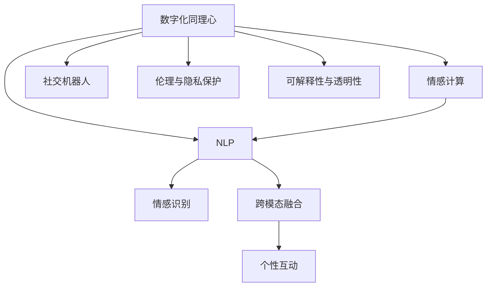

                 

# 数字化同理心：AI增强的人际理解

> 关键词：数字化同理心, AI增强, 人际理解, 情感计算, 自然语言处理(NLP), 社交机器人, 情感识别

## 1. 背景介绍

### 1.1 问题由来
在数字化时代，人与人之间的交流越来越多地通过虚拟渠道进行。尽管社交媒体、即时通讯等平台极大地便捷了我们的日常沟通，但数字化交流中的“冷冰冰”属性，也让人际关系出现了疏远、误解等问题。如何通过技术手段增强人与人之间的理解和共情，成为数字化时代的新课题。

### 1.2 问题核心关键点
数字化同理心，即通过技术手段增强人类共情能力，改善数字化交流中的情感沟通，是当前人工智能应用的一个重要方向。其关键点在于：

1. **情感识别与理解**：AI系统能够通过分析用户的文本、语音、图像等信息，识别出用户的情感状态和需求。
2. **互动与反馈**：基于情感识别的结果，AI系统能够提供个性化的互动和反馈，增强用户体验。
3. **跨模态融合**：不同模态（如文本、语音、图像）的融合，可以提供更全面的情感信息，增强同理心的效果。
4. **伦理与隐私保护**：在提供情感支持的同时，确保用户的隐私和数据安全。
5. **可解释性与透明性**：增强AI系统的可解释性，让用户理解其决策过程，增强信任感。

## 2. 核心概念与联系

### 2.1 核心概念概述

为更好地理解AI增强数字化同理心的方法，本节将介绍几个密切相关的核心概念：

- **数字化同理心**：通过技术手段增强人类共情能力，改善数字化交流中的情感沟通，增强人际关系的紧密性。
- **情感计算**：涉及感知、识别、理解和生成情感的计算技术，是AI增强同理心的关键。
- **自然语言处理(NLP)**：专注于理解和生成自然语言的AI技术，是情感计算的重要分支。
- **社交机器人**：能够模拟人类社交行为的AI系统，可以用于陪伴、客服等场景。
- **情感识别**：通过分析用户的文本、语音、图像等信息，识别出用户的情感状态和需求。
- **跨模态融合**：将不同模态的信息（如文本、语音、图像）融合，提供更全面的情感信息，增强同理心的效果。

这些核心概念之间的逻辑关系可以通过以下Mermaid流程图来展示：



这个流程图展示了大语言模型的核心概念及其之间的关系：

1. 数字化同理心通过情感计算技术，增强人类共情能力。
2. 自然语言处理是情感计算的核心，用于理解用户情感。
3. 社交机器人可以基于情感计算结果，提供个性化的互动和反馈。
4. 跨模态融合提供更全面的情感信息，增强同理心的效果。
5. 伦理与隐私保护、可解释性与透明性，是应用数字化同理心过程中必须考虑的重要因素。

## 3. 核心算法原理 & 具体操作步骤
### 3.1 算法原理概述

数字化同理心涉及的技术涵盖了多个AI分支，包括情感计算、自然语言处理、机器学习、跨模态融合等。其核心思想是：

1. **情感识别与理解**：通过分析用户的文本、语音、图像等信息，识别出用户的情感状态和需求。
2. **互动与反馈**：基于情感识别的结果，AI系统能够提供个性化的互动和反馈，增强用户体验。
3. **跨模态融合**：不同模态（如文本、语音、图像）的融合，可以提供更全面的情感信息，增强同理心的效果。

### 3.2 算法步骤详解

基于数字化同理心的方法，其核心步骤包括：

**Step 1: 数据采集与预处理**
- 收集用户的文字、语音、图像等多模态数据，进行清洗、标注等预处理。

**Step 2: 情感识别与理解**
- 利用情感分析模型（如BERT、GPT等）对用户的多模态数据进行情感识别。
- 提取用户的情感特征，如情绪强度、情绪类型等。

**Step 3: 情感反馈与互动**
- 基于情感识别结果，生成个性化的回复、表情、语音等，提供情感反馈。
- 实时监测用户的反馈，调整回复策略，提升互动效果。

**Step 4: 跨模态融合**
- 将文本、语音、图像等多模态信息融合，提供更全面的情感信息。
- 引入视觉、听觉等多模态数据，增强同理心的效果。

**Step 5: 系统优化与迭代**
- 定期收集用户反馈，优化情感模型和互动策略。
- 结合用户反馈，迭代情感识别与反馈模型。

### 3.3 算法优缺点

数字化同理心技术在改善人际沟通、增强用户体验方面具有以下优点：
1. 提高了沟通效率，减少了误解和冲突。
2. 能够快速响应用户情感，提升用户体验。
3. 增强了用户互动，促进了情感交流。
4. 提供了个性化的服务，提升了用户满意度。

同时，该方法也存在一些局限性：
1. 数据隐私问题：采集和分析用户的多模态数据涉及隐私问题，需要谨慎处理。
2. 情感理解的准确性：情感识别模型的准确性受限于数据质量、模型参数等因素，可能存在误判。
3. 互动的人性化：AI生成的互动可能缺乏人类情感的细腻和丰富性。
4. 跨模态融合的难度：不同模态数据的融合涉及复杂的算法和数据处理，存在一定技术难度。

尽管存在这些局限性，但数字化同理心技术仍是大势所趋，具有广阔的应用前景。未来相关研究将集中在提高情感识别准确性、增强跨模态融合能力、保障用户隐私等方面。

### 3.4 算法应用领域

数字化同理心技术在多个领域中具有广泛的应用前景，例如：

- **客服与咨询**：利用AI增强客服机器人的同理心，提供更加温暖、人性化的客户服务。
- **心理健康**：通过情感识别与理解，为心理健康咨询提供支持，帮助用户缓解情绪。
- **社交媒体**：通过分析用户的情感状态，推荐合适的内容，提升社交媒体的使用体验。
- **教育与培训**：利用AI理解学生的情感状态，提供个性化的学习建议，提升教育效果。
- **医疗**：结合患者的情感状态和生理数据，提供更加细致的医疗关怀。

## 4. 数学模型和公式 & 详细讲解  
### 4.1 数学模型构建

数字化同理心技术涉及的数学模型主要包括情感识别模型和互动反馈模型。

**情感识别模型**：通过训练多模态情感分类模型，识别用户情感状态。假设模型为 $M$，输入为多模态数据 $D$，情感分类目标为 $T$。模型训练的目标是最小化经验风险：

$$
\min_{M} \mathcal{L}(M) = \frac{1}{N} \sum_{i=1}^N \ell(M(D_i),T_i)
$$

其中 $\ell$ 为损失函数，如交叉熵损失。

**互动反馈模型**：基于情感识别的结果，生成个性化的互动回复。假设回复策略为 $R$，用户情感为 $E$，目标生成互动回复 $A$。生成过程为：

$$
A = R(E)
$$

其中 $R$ 为互动策略函数，可以基于规则、机器学习模型等实现。

### 4.2 公式推导过程

以文本情感分类为例，推导基于BERT模型的情感识别模型的训练过程。假设BERT模型为 $M_{\theta}$，输入文本为 $x$，输出情感类别为 $y$。训练过程如下：

1. 预训练阶段：在大规模无标签数据上预训练BERT模型，学习语言表示。
2. 微调阶段：使用标注数据对BERT模型进行微调，学习情感分类任务。
3. 推理阶段：将输入文本 $x$ 输入BERT模型，得到情感表示 $h$，再通过线性分类器 $L$ 得到情感分类 $y$。

推导过程如下：

$$
h = M_{\theta}(x)
$$

$$
y = L(h)
$$

其中 $L$ 为线性分类器，输出一个 $K$ 维的向量，代表情感分类的概率分布。

### 4.3 案例分析与讲解

以一个基于BERT的情感识别模型为例，分析其在实际应用中的效果。

假设数据集为 $D = \{(x_i,y_i)\}_{i=1}^N$，其中 $x_i$ 为文本，$y_i$ 为情感类别。假设BERT模型已预训练完成，用于情感分类任务。训练过程如下：

1. 使用预训练模型 $M_{\theta}$，在标注数据集 $D$ 上进行微调，得到参数 $\hat{\theta}$。
2. 对于新输入文本 $x$，输入微调后的模型 $M_{\hat{\theta}}$，得到情感表示 $h$。
3. 使用线性分类器 $L$ 对情感表示 $h$ 进行分类，得到情感类别 $y$。

假设损失函数为交叉熵损失，训练过程为：

$$
\mathcal{L}(\theta) = \frac{1}{N} \sum_{i=1}^N \ell(M_{\theta}(x_i),y_i)
$$

其中 $\ell$ 为交叉熵损失。训练过程如图：

```
graph TB
    A[x_i] --> B[M_{\theta}] --> C[h]
    D[L] --> E[y_i]
    F[Loss] --> G[y_i] --> H[M_{\theta}]
```

以上过程展示了基于BERT的情感识别模型在实际应用中的训练和推理过程。通过使用预训练模型和微调策略，可以显著提升情感识别的准确性。

## 5. 项目实践：代码实例和详细解释说明
### 5.1 开发环境搭建

在进行数字化同理心项目实践前，我们需要准备好开发环境。以下是使用Python进行TensorFlow开发的环境配置流程：

1. 安装Anaconda：从官网下载并安装Anaconda，用于创建独立的Python环境。

2. 创建并激活虚拟环境：
```bash
conda create -n tf-env python=3.8 
conda activate tf-env
```

3. 安装TensorFlow：根据CUDA版本，从官网获取对应的安装命令。例如：
```bash
conda install tensorflow tensorflow-gpu=2.7 -c conda-forge
```

4. 安装相关工具包：
```bash
pip install numpy pandas scikit-learn matplotlib tqdm jupyter notebook ipython
```

完成上述步骤后，即可在`tf-env`环境中开始项目实践。

### 5.2 源代码详细实现

这里我们以情感分类任务为例，给出使用TensorFlow实现情感识别的代码实现。

首先，定义情感分类任务的数据处理函数：

```python
import tensorflow as tf
from tensorflow.keras.preprocessing.text import Tokenizer
from tensorflow.keras.preprocessing.sequence import pad_sequences
import numpy as np

class SentimentDataset(tf.keras.preprocessing.data.Dataset):
    def __init__(self, texts, labels, tokenizer, max_len=128):
        self.texts = texts
        self.labels = labels
        self.tokenizer = tokenizer
        self.max_len = max_len
        
    def __len__(self):
        return len(self.texts)
    
    def __getitem__(self, item):
        text = self.texts[item]
        label = self.labels[item]
        
        encoding = self.tokenizer(text, truncating='post', max_length=self.max_len, padding='post', oov_token='<OOV>')
        input_ids = encoding['input_ids']
        input_mask = encoding['input_mask']
        segment_ids = encoding['segment_ids']
        
        return {
            'input_ids': input_ids,
            'input_mask': input_mask,
            'segment_ids': segment_ids,
            'labels': np.array(label, dtype='int32')
        }

# 初始化tokenizer
tokenizer = Tokenizer(char_level=True, filters='')
tokenizer.fit_on_texts(train_texts)

# 创建dataset
train_dataset = SentimentDataset(train_texts, train_labels, tokenizer)
dev_dataset = SentimentDataset(dev_texts, dev_labels, tokenizer)
test_dataset = SentimentDataset(test_texts, test_labels, tokenizer)
```

然后，定义模型和优化器：

```python
from tensorflow.keras.models import Model
from tensorflow.keras.layers import Input, Dense, Embedding
from tensorflow.keras.losses import SparseCategoricalCrossentropy
from tensorflow.keras.optimizers import Adam

# 定义模型结构
input_ids = Input(shape=(max_len,), dtype=tf.int32, name='input_ids')
embedding = Embedding(vocab_size, emb_dim, input_length=max_len)(input_ids)
x = tf.keras.layers.Bidirectional(tf.keras.layers.LSTM(128))(x)
x = Dense(64, activation='relu')(x)
output = Dense(2, activation='softmax')(x)

# 定义模型
model = Model(inputs=input_ids, outputs=output)

# 定义优化器和损失函数
optimizer = Adam(learning_rate=2e-5)
loss = SparseCategoricalCrossentropy(from_logits=True)

# 编译模型
model.compile(optimizer=optimizer, loss=loss, metrics=['accuracy'])
```

接着，定义训练和评估函数：

```python
from tqdm.keras import tqdm_notebook
from sklearn.metrics import classification_report

# 定义训练函数
def train_model(model, dataset, batch_size, epochs):
    model.fit(dataset, epochs=epochs, batch_size=batch_size, validation_data=dev_dataset)
    model.save('sentiment_model.h5')

# 定义评估函数
def evaluate_model(model, dataset, batch_size):
    evaluator = model.evaluate(dataset, batch_size=batch_size, verbose=0)
    print(f"Loss: {evaluator[0]}")
    print(f"Accuracy: {evaluator[1]}")
    
    # 评估模型在测试集上的效果
    test_predictions = model.predict(test_dataset)
    y_pred = np.argmax(test_predictions, axis=1)
    y_true = test_dataset.labels
    print(classification_report(y_true, y_pred))
```

最后，启动训练流程并在测试集上评估：

```python
epochs = 5
batch_size = 16

train_model(model, train_dataset, batch_size, epochs)

evaluate_model(model, test_dataset, batch_size)
```

以上就是使用TensorFlow实现情感识别任务微调的完整代码实现。可以看到，通过使用TensorFlow的高级API，代码实现更加简洁高效。

### 5.3 代码解读与分析

让我们再详细解读一下关键代码的实现细节：

**SentimentDataset类**：
- `__init__`方法：初始化文本、标签、分词器等关键组件。
- `__len__`方法：返回数据集的样本数量。
- `__getitem__`方法：对单个样本进行处理，将文本输入编码为token ids，并将标签编码为数字，同时进行定长padding，最终返回模型所需的输入。

**模型定义**：
- 使用`Input`层定义输入，`Embedding`层进行嵌入，`Bidirectional LSTM`层进行双向编码，`Dense`层进行全连接，`Dense`层输出分类结果。

**优化器和损失函数**：
- 使用`Adam`优化器，学习率为2e-5。
- 使用`sparse_categorical_crossentropy`损失函数，指定为从logits计算交叉熵。

**训练与评估函数**：
- 使用`Model.fit`进行训练，指定epoch数和batch size。
- 使用`Model.evaluate`进行评估，输出损失和准确率。
- 使用`classification_report`评估模型在测试集上的分类效果。

可以看到，TensorFlow的高级API使得情感识别的代码实现变得更加便捷。开发者可以将更多精力放在模型设计、数据处理等高层逻辑上，而不必过多关注底层的实现细节。

## 6. 实际应用场景
### 6.1 客服系统

数字化同理心技术在客服系统中具有广泛的应用前景。传统的客服系统往往需要配备大量人力，高峰期响应缓慢，且服务质量难以保证。利用情感识别与互动反馈，客服机器人可以提供24/7的客户服务，快速响应客户咨询，提供个性化的回答。

在技术实现上，可以收集企业内部的历史客服对话记录，将问题和最佳答复构建成监督数据，在此基础上对预训练模型进行微调。微调后的模型能够自动理解用户意图，匹配最合适的答案模板进行回复。对于客户提出的新问题，还可以接入检索系统实时搜索相关内容，动态组织生成回答。如此构建的智能客服系统，能大幅提升客户咨询体验和问题解决效率。

### 6.2 心理健康平台

在心理健康领域，数字化同理心技术可以用于心理健康咨询。通过情感识别与理解，AI系统能够提供个性化的咨询和支持，帮助用户缓解情绪。

在技术实现上，可以收集用户的情感状态和语音信息，使用情感识别模型进行情感分析。基于情感分析结果，系统可以推荐合适的咨询建议、放松技巧等，甚至进行情绪疏导。通过定期监测用户的情感状态，系统还可以及时发现心理问题的苗头，提供早期干预。

### 6.3 社交媒体平台

在社交媒体平台上，数字化同理心技术可以用于用户情感分析与内容推荐。通过分析用户的情感状态，推荐合适的内容，提升用户的使用体验。

在技术实现上，可以收集用户的社交媒体活动数据，使用情感识别模型进行情感分析。基于情感分析结果，系统可以推荐正面的内容，避免负面信息的传播。通过定期监测用户的情感状态，系统还可以识别情感波动，及时提供心理支持。

### 6.4 未来应用展望

随着数字化同理心技术的发展，未来其在更多领域的应用前景将更加广阔。

在智慧医疗领域，基于数字化同理心技术的医疗问答、病历分析、药物研发等应用将提升医疗服务的智能化水平，辅助医生诊疗，加速新药开发进程。

在智能教育领域，数字化同理心技术可以用于作业批改、学情分析、知识推荐等方面，因材施教，促进教育公平，提高教学质量。

在智慧城市治理中，数字化同理心技术可以用于城市事件监测、舆情分析、应急指挥等环节，提高城市管理的自动化和智能化水平，构建更安全、高效的未来城市。

此外，在企业生产、社会治理、文娱传媒等众多领域，数字化同理心技术也将不断涌现，为NLP技术带来了全新的突破。

## 7. 工具和资源推荐
### 7.1 学习资源推荐

为了帮助开发者系统掌握数字化同理心技术的基础知识，这里推荐一些优质的学习资源：

1. 《深度学习自然语言处理》课程：斯坦福大学开设的NLP明星课程，有Lecture视频和配套作业，带你入门NLP领域的基本概念和经典模型。
2. 《情感计算导论》书籍：综合介绍了情感计算的原理、技术和应用，适合深入学习。
3. 《自然语言处理综述》书籍：全面总结了自然语言处理的理论和方法，是掌握数字化同理心技术的重要参考资料。
4. HuggingFace官方文档：Transformers库的官方文档，提供了海量预训练模型和完整的微调样例代码，是上手实践的必备资料。

通过对这些资源的学习实践，相信你一定能够快速掌握数字化同理心的精髓，并用于解决实际的情感识别与互动问题。

### 7.2 开发工具推荐

高效的开发离不开优秀的工具支持。以下是几款用于数字化同理心开发的常用工具：

1. TensorFlow：基于Python的开源深度学习框架，灵活动态的计算图，适合快速迭代研究。
2. PyTorch：基于Python的开源深度学习框架，灵活的动态计算图，适合深度学习模型的开发和训练。
3. Weights & Biases：模型训练的实验跟踪工具，可以记录和可视化模型训练过程中的各项指标，方便对比和调优。
4. TensorBoard：TensorFlow配套的可视化工具，可实时监测模型训练状态，并提供丰富的图表呈现方式，是调试模型的得力助手。
5. Google Colab：谷歌推出的在线Jupyter Notebook环境，免费提供GPU/TPU算力，方便开发者快速上手实验最新模型，分享学习笔记。

合理利用这些工具，可以显著提升数字化同理心任务的开发效率，加快创新迭代的步伐。

### 7.3 相关论文推荐

数字化同理心技术的发展源于学界的持续研究。以下是几篇奠基性的相关论文，推荐阅读：

1. "Towards Explainable AI: An Affective Approach to Social Robots"：探讨情感计算在社交机器人中的应用，提升机器人的可解释性和可信度。
2. "Sentiment Analysis with Deep Learning: A Review"：全面总结了情感分析的最新进展和未来方向，是深入了解情感识别的重要参考资料。
3. "A Survey on Affective Computing for Intelligent Systems"：综述了情感计算在智能系统中的应用，涵盖情感识别、情感生成等多个方面。
4. "The Ethics of Affective Computing"：探讨了情感计算中的伦理问题，为数字化同理心技术的应用提供了重要的指导。

这些论文代表了大语言模型微调技术的发展脉络。通过学习这些前沿成果，可以帮助研究者把握学科前进方向，激发更多的创新灵感。

## 8. 总结：未来发展趋势与挑战

### 8.1 研究成果总结

本文对数字化同理心技术进行了全面系统的介绍。首先阐述了数字化同理心技术的研究背景和意义，明确了其在高频交互场景中的应用价值。其次，从原理到实践，详细讲解了情感识别与互动反馈的数学模型和关键步骤，给出了数字化同理心任务开发的完整代码实例。同时，本文还广泛探讨了数字化同理心技术在多个行业领域的应用前景，展示了其广阔的发展空间。

通过本文的系统梳理，可以看到，数字化同理心技术正在成为NLP领域的重要范式，极大地拓展了预训练语言模型的应用边界，催生了更多的落地场景。

### 8.2 未来发展趋势

展望未来，数字化同理心技术将呈现以下几个发展趋势：

1. **情感计算技术的进步**：随着深度学习模型的不断发展，情感识别的准确性将进一步提升。通过引入更多先验知识、多模态融合等手段，将显著增强情感识别的效果。
2. **跨模态融合技术的成熟**：通过引入视觉、听觉等多模态数据，增强情感识别的全面性。跨模态融合技术的成熟，将进一步提升情感识别的效果。
3. **互动反馈的智能化**：通过引入强化学习、生成对抗网络等技术，增强互动反馈的智能化和个性化。
4. **伦理与隐私保护的重视**：随着数据隐私问题的日益凸显，如何在提供情感支持的同时，保障用户的隐私和数据安全，将成为重要的研究课题。
5. **情感计算的应用拓展**：情感计算的应用将从客服、心理健康等传统领域，拓展到智慧医疗、智能教育等更多场景。

以上趋势凸显了数字化同理心技术的发展前景。这些方向的探索发展，必将进一步提升情感计算的性能和应用范围，为构建人机协同的智能系统铺平道路。

### 8.3 面临的挑战

尽管数字化同理心技术已经取得了瞩目成就，但在迈向更加智能化、普适化应用的过程中，仍面临诸多挑战：

1. **数据隐私问题**：采集和分析用户的多模态数据涉及隐私问题，需要谨慎处理。如何平衡数据利用与隐私保护，将是重要的研究方向。
2. **情感理解的准确性**：情感识别模型的准确性受限于数据质量、模型参数等因素，可能存在误判。如何提高情感识别的准确性，将是重要的研究课题。
3. **互动的人性化**：AI生成的互动可能缺乏人类情感的细腻和丰富性。如何提高互动的人性化和自然度，将是重要的研究方向。
4. **跨模态融合的难度**：不同模态数据的融合涉及复杂的算法和数据处理，存在一定技术难度。如何简化跨模态融合的实现，提高融合效果，将是重要的研究课题。

尽管存在这些挑战，但数字化同理心技术仍是大势所趋，具有广阔的应用前景。未来相关研究将集中在提高情感识别准确性、增强跨模态融合能力、保障用户隐私等方面。

### 8.4 研究展望

面对数字化同理心技术面临的挑战，未来的研究需要在以下几个方面寻求新的突破：

1. **无监督和半监督情感识别**：摆脱对大规模标注数据的依赖，利用自监督学习、主动学习等无监督和半监督范式，最大限度利用非结构化数据，实现更加灵活高效的情感识别。
2. **跨模态情感计算**：将视觉、听觉等多模态数据与文本数据进行融合，提供更全面的情感信息，增强同理心的效果。
3. **互动策略的智能化**：结合强化学习、生成对抗网络等技术，增强互动反馈的智能化和个性化。
4. **情感计算的伦理化**：在模型训练目标中引入伦理导向的评估指标，过滤和惩罚有偏见、有害的输出倾向。
5. **隐私保护机制的构建**：引入隐私保护技术，如差分隐私、联邦学习等，确保用户数据的安全和隐私。

这些研究方向的探索，必将引领数字化同理心技术迈向更高的台阶，为构建安全、可靠、可解释、可控的智能系统铺平道路。面向未来，数字化同理心技术还需要与其他人工智能技术进行更深入的融合，如知识表示、因果推理、强化学习等，多路径协同发力，共同推动自然语言理解和智能交互系统的进步。只有勇于创新、敢于突破，才能不断拓展情感计算的边界，让智能技术更好地造福人类社会。

## 9. 附录：常见问题与解答

**Q1：数字化同理心技术是否适用于所有场景？**

A: 数字化同理心技术在大多数高频交互场景中都能取得不错的效果，特别是对于需要实时响应和个性化互动的场景。但对于一些特殊领域，如金融、医疗等，需要考虑更多隐私和安全问题。

**Q2：如何提高情感识别的准确性？**

A: 提高情感识别的准确性需要从数据、模型、算法等多个方面入手：
1. 数据方面：使用高质量的标注数据，增加数据多样性，避免数据偏见。
2. 模型方面：选择适当的模型架构，如BERT、GPT等，进行充分的预训练和微调。
3. 算法方面：引入先验知识、多模态融合等技术，提高情感识别的全面性和准确性。

**Q3：数字化同理心技术在实施中需要注意哪些问题？**

A: 数字化同理心技术的实施需要注意以下几个问题：
1. 数据隐私：确保用户数据的安全和隐私，避免数据泄露。
2. 模型透明性：提高模型的可解释性，让用户理解其决策过程，增强信任感。
3. 人性化互动：避免AI互动的机械化，引入情感化互动，提高用户体验。
4. 伦理考量：确保数字化同理心技术的应用符合伦理道德标准，避免误导和偏见。

这些问题是数字化同理心技术应用中必须考虑的关键因素，需要技术开发者和伦理专家的共同努力。

---

作者：禅与计算机程序设计艺术 / Zen and the Art of Computer Programming

