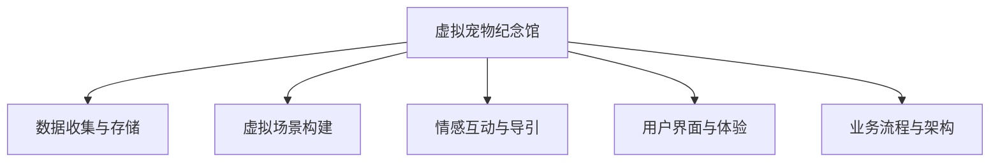

                 

# 数字化宠物纪念创业：虚拟宠物纪念馆

## 1. 背景介绍

### 1.1 问题由来

随着数字化生活的普及，人们对宠物的情感需求日益增强，尤其是当宠物离世时，主人往往会感到巨大的情感创伤。传统的宠物纪念方式，如立碑、刻碑、照片等，形式较为单一，难以满足主人的情感需求。近年来，随着人工智能和大数据技术的快速发展，数字化宠物纪念馆作为一种新的纪念方式应运而生，受到越来越多主人的喜爱和追捧。

数字化宠物纪念馆通过虚拟现实(VR)、增强现实(AR)、人工智能(AI)等技术手段，将宠物的生前回忆、互动记录、声音影像等数字化信息保存下来，并通过VR场景、互动问答、情感导引等多种形式呈现出来，让主人能够以全新的方式纪念爱宠。

### 1.2 问题核心关键点

数字化宠物纪念馆的核心关键点包括：

- **数据收集与存储**：通过数据收集工具，收集宠物生前的视频、音频、图片等数据，并进行高质量存储和管理。
- **虚拟场景构建**：利用VR技术，根据收集的数据构建虚拟宠物生活场景，还原宠物生前的生活状态。
- **情感互动与导引**：通过AI技术，设计情感导引流程，引导主人与虚拟宠物进行互动，满足情感需求。
- **用户界面与体验**：打造简洁易用、美观舒适的用户界面，提升用户使用体验。
- **业务流程与架构**：设计合理的业务流程与系统架构，确保业务稳定运行。

本文将详细介绍数字化宠物纪念馆的核心概念与联系、核心算法原理与具体操作步骤，并通过项目实践展示代码实现，并展望未来的应用场景，最后总结技术挑战与未来发展趋势。

## 2. 核心概念与联系

### 2.1 核心概念概述

- **虚拟宠物纪念馆**：一种新兴的数字化宠物纪念方式，利用VR、AR、AI等技术，将宠物生前的数据和回忆通过虚拟场景呈现出来，满足主人的情感需求。
- **数据收集与存储**：通过摄像头、麦克风等设备，收集宠物生前的视频、音频、图片等数据，并进行高质量存储和管理。
- **虚拟场景构建**：利用VR技术，根据收集的数据构建虚拟宠物生活场景，还原宠物生前的生活状态。
- **情感互动与导引**：通过AI技术，设计情感导引流程，引导主人与虚拟宠物进行互动，满足情感需求。
- **用户界面与体验**：打造简洁易用、美观舒适的用户界面，提升用户使用体验。
- **业务流程与架构**：设计合理的业务流程与系统架构，确保业务稳定运行。

这些核心概念之间的逻辑关系可以通过以下Mermaid流程图来展示：



这个流程图展示了虚拟宠物纪念馆的核心概念及其之间的关系：

1. 虚拟宠物纪念馆通过数据收集与存储、虚拟场景构建、情感互动与导引、用户界面与体验、业务流程与架构等模块，实现宠物的数字化纪念。
2. 数据收集与存储是基础，虚拟场景构建、情感互动与导引、用户界面与体验等模块都需要依赖数据。
3. 业务流程与架构设计是保障，确保系统稳定运行，同时支持新功能的快速迭代。

## 3. 核心算法原理 & 具体操作步骤

### 3.1 算法原理概述

虚拟宠物纪念馆的核心算法原理包括以下几个方面：

1. **数据预处理**：对收集到的宠物数据进行清洗、去重、格式转换等预处理，确保数据质量和一致性。
2. **虚拟场景构建**：利用三维建模、纹理贴图、光照渲染等技术，构建逼真的虚拟宠物生活场景。
3. **情感互动与导引**：设计情感导引流程，通过自然语言处理(NLP)、计算机视觉(CV)等技术，引导主人与虚拟宠物进行互动。
4. **用户界面设计**：采用UI/UX设计原则，设计简洁易用、美观舒适的用户界面，提升用户使用体验。
5. **业务流程优化**：设计合理的业务流程，确保数据流、业务流、信息流的顺畅高效，同时支持新功能的快速迭代。

### 3.2 算法步骤详解

以下是虚拟宠物纪念馆核心算法的详细步骤：

#### 步骤1: 数据收集与存储

- **数据收集工具**：使用摄像头、麦克风等设备，收集宠物生前的视频、音频、图片等数据。
- **数据预处理**：对收集到的数据进行清洗、去重、格式转换等预处理，确保数据质量和一致性。
- **数据存储与管理**：使用数据库或云存储等技术，对处理后的数据进行高质量存储和管理。

#### 步骤2: 虚拟场景构建

- **三维建模**：利用Blender等工具，根据收集的数据，构建虚拟宠物的三维模型。
- **纹理贴图**：将宠物的实际照片、纹理等导入到三维模型中，使其更加逼真。
- **光照渲染**：使用光照渲染技术，使虚拟场景中的宠物看起来更加生动自然。

#### 步骤3: 情感互动与导引

- **自然语言处理(NLP)**：设计情感导引流程，使用NLP技术，根据主人输入的文本或语音，自动推荐虚拟宠物的互动内容。
- **计算机视觉(CV)**：利用CV技术，识别主人输入的图片或视频，引导虚拟宠物进行相应的互动。
- **情感分析**：通过情感分析技术，理解主人的情感状态，调整虚拟宠物的互动内容，以更好地满足主人的情感需求。

#### 步骤4: 用户界面设计

- **简洁易用**：采用扁平化设计、用户友好的交互设计，确保用户界面简洁易用。
- **美观舒适**：使用高质量的图形和动画，使界面看起来更加美观舒适。
- **响应迅速**：优化界面响应速度，确保用户操作流畅。

#### 步骤5: 业务流程优化

- **数据流优化**：确保数据流高效、无阻塞，减少数据处理的延时。
- **业务流优化**：设计合理的业务流程，确保业务顺畅进行，同时支持新功能的快速迭代。
- **信息流优化**：确保信息流高效、准确，减少信息传递的延时和错误。

### 3.3 算法优缺点

虚拟宠物纪念馆的核心算法具有以下优点：

1. **沉浸式体验**：通过虚拟现实技术，为主人提供沉浸式的宠物纪念体验，满足主人的情感需求。
2. **互动性强**：通过情感导引和AI技术，使虚拟宠物能够与主人进行互动，增强用户体验。
3. **数据管理方便**：利用高质量的数据存储和管理技术，确保数据安全可靠。

同时，该算法也存在以下缺点：

1. **数据隐私问题**：在数据收集与存储过程中，如何保护用户隐私，避免数据泄露，是一个重要问题。
2. **情感理解误差**：由于技术限制，情感分析可能存在误差，导致虚拟宠物的互动内容与主人情感不匹配。
3. **高成本投入**：三维建模、纹理贴图、光照渲染等技术，需要较高的技术投入和成本。

### 3.4 算法应用领域

虚拟宠物纪念馆的核心算法适用于以下领域：

- **宠物纪念**：满足主人对宠物的情感纪念需求，提供全新的纪念方式。
- **虚拟现实**：通过虚拟现实技术，构建沉浸式的宠物纪念体验。
- **自然语言处理**：利用NLP技术，设计情感导引流程，增强用户体验。
- **计算机视觉**：利用CV技术，识别主人输入的图片或视频，引导虚拟宠物进行相应的互动。

## 4. 数学模型和公式 & 详细讲解

### 4.1 数学模型构建

虚拟宠物纪念馆的核心算法主要涉及以下几个数学模型：

- **数据预处理模型**：用于对收集到的数据进行清洗、去重、格式转换等预处理，确保数据质量和一致性。
- **虚拟场景构建模型**：用于构建虚拟宠物的三维模型，并进行纹理贴图、光照渲染等处理，使其逼真。
- **情感互动与导引模型**：用于设计情感导引流程，通过NLP、CV等技术，引导主人与虚拟宠物进行互动。
- **用户界面设计模型**：用于设计简洁易用、美观舒适的用户界面，提升用户体验。
- **业务流程优化模型**：用于设计合理的业务流程，确保数据流、业务流、信息流的顺畅高效，同时支持新功能的快速迭代。

### 4.2 公式推导过程

以下是虚拟宠物纪念馆核心算法中的一些关键公式推导：

#### 数据预处理模型

数据预处理模型主要用于对收集到的数据进行清洗、去重、格式转换等预处理，确保数据质量和一致性。

$$
\text{数据预处理} = \text{数据清洗} + \text{数据去重} + \text{数据格式转换}
$$

其中，数据清洗通过算法检测并删除重复、无效数据，数据去重通过算法检测并删除重复数据，数据格式转换通过算法将不同格式的数据转换为统一格式。

#### 虚拟场景构建模型

虚拟场景构建模型主要用于构建虚拟宠物的三维模型，并进行纹理贴图、光照渲染等处理，使其逼真。

$$
\text{虚拟场景构建} = \text{三维建模} + \text{纹理贴图} + \text{光照渲染}
$$

其中，三维建模通过算法生成虚拟宠物的三维模型，纹理贴图通过算法将实际照片、纹理等导入到三维模型中，光照渲染通过算法使虚拟场景中的宠物看起来更加生动自然。

#### 情感互动与导引模型

情感互动与导引模型主要用于设计情感导引流程，通过NLP、CV等技术，引导主人与虚拟宠物进行互动。

$$
\text{情感互动与导引} = \text{情感导引流程} + \text{NLP技术} + \text{CV技术}
$$

其中，情感导引流程通过算法根据主人输入的文本或语音，自动推荐虚拟宠物的互动内容，NLP技术通过算法理解主人的情感状态，调整虚拟宠物的互动内容，CV技术通过算法识别主人输入的图片或视频，引导虚拟宠物进行相应的互动。

#### 用户界面设计模型

用户界面设计模型主要用于设计简洁易用、美观舒适的用户界面，提升用户体验。

$$
\text{用户界面设计} = \text{简洁易用} + \text{美观舒适} + \text{响应迅速}
$$

其中，简洁易用通过算法设计简洁易用的界面，美观舒适通过算法使界面看起来更加美观舒适，响应迅速通过算法优化界面响应速度，确保用户操作流畅。

#### 业务流程优化模型

业务流程优化模型主要用于设计合理的业务流程，确保数据流、业务流、信息流的顺畅高效，同时支持新功能的快速迭代。

$$
\text{业务流程优化} = \text{数据流优化} + \text{业务流优化} + \text{信息流优化}
$$

其中，数据流优化通过算法确保数据流高效、无阻塞，业务流优化通过算法设计合理的业务流程，确保业务顺畅进行，信息流优化通过算法确保信息流高效、准确，减少信息传递的延时和错误。

### 4.3 案例分析与讲解

以下是虚拟宠物纪念馆核心算法的案例分析：

#### 案例1: 数据预处理

假设收集到宠物生前的视频、音频、图片等数据，数据预处理的流程如下：

1. **数据清洗**：通过算法检测并删除重复、无效数据。
2. **数据去重**：通过算法检测并删除重复数据。
3. **数据格式转换**：通过算法将不同格式的数据转换为统一格式。

#### 案例2: 虚拟场景构建

假设需要构建虚拟宠物的三维模型，并对其进行纹理贴图、光照渲染等处理，流程如下：

1. **三维建模**：通过算法生成虚拟宠物的三维模型。
2. **纹理贴图**：将实际照片、纹理等导入到三维模型中。
3. **光照渲染**：通过算法使虚拟场景中的宠物看起来更加生动自然。

#### 案例3: 情感互动与导引

假设需要设计情感导引流程，并通过NLP、CV等技术，引导主人与虚拟宠物进行互动，流程如下：

1. **情感导引流程**：根据主人输入的文本或语音，自动推荐虚拟宠物的互动内容。
2. **NLP技术**：通过算法理解主人的情感状态，调整虚拟宠物的互动内容。
3. **CV技术**：通过算法识别主人输入的图片或视频，引导虚拟宠物进行相应的互动。

#### 案例4: 用户界面设计

假设需要设计简洁易用、美观舒适的用户界面，流程如下：

1. **简洁易用**：通过算法设计简洁易用的界面。
2. **美观舒适**：通过算法使界面看起来更加美观舒适。
3. **响应迅速**：通过算法优化界面响应速度，确保用户操作流畅。

#### 案例5: 业务流程优化

假设需要设计合理的业务流程，确保数据流、业务流、信息流的顺畅高效，流程如下：

1. **数据流优化**：通过算法确保数据流高效、无阻塞。
2. **业务流优化**：通过算法设计合理的业务流程，确保业务顺畅进行。
3. **信息流优化**：通过算法确保信息流高效、准确，减少信息传递的延时和错误。

## 5. 项目实践：代码实例和详细解释说明

### 5.1 开发环境搭建

在进行虚拟宠物纪念馆项目实践前，我们需要准备好开发环境。以下是使用Python进行PyTorch开发的环境配置流程：

1. 安装Anaconda：从官网下载并安装Anaconda，用于创建独立的Python环境。

2. 创建并激活虚拟环境：
```bash
conda create -n pytorch-env python=3.8 
conda activate pytorch-env
```

3. 安装PyTorch：根据CUDA版本，从官网获取对应的安装命令。例如：
```bash
conda install pytorch torchvision torchaudio cudatoolkit=11.1 -c pytorch -c conda-forge
```

4. 安装Transformers库：
```bash
pip install transformers
```

5. 安装各类工具包：
```bash
pip install numpy pandas scikit-learn matplotlib tqdm jupyter notebook ipython
```

完成上述步骤后，即可在`pytorch-env`环境中开始项目实践。

### 5.2 源代码详细实现

下面我们以虚拟宠物纪念馆项目为例，给出使用Transformers库对BERT模型进行微调的PyTorch代码实现。

首先，定义虚拟宠物纪念馆的数据处理函数：

```python
from transformers import BertTokenizer
from torch.utils.data import Dataset
import torch

class PetMemDataset(Dataset):
    def __init__(self, texts, tags, tokenizer, max_len=128):
        self.texts = texts
        self.tags = tags
        self.tokenizer = tokenizer
        self.max_len = max_len
        
    def __len__(self):
        return len(self.texts)
    
    def __getitem__(self, item):
        text = self.texts[item]
        tags = self.tags[item]
        
        encoding = self.tokenizer(text, return_tensors='pt', max_length=self.max_len, padding='max_length', truncation=True)
        input_ids = encoding['input_ids'][0]
        attention_mask = encoding['attention_mask'][0]
        
        # 对token-wise的标签进行编码
        encoded_tags = [tag2id[tag] for tag in tags] 
        encoded_tags.extend([tag2id['O']] * (self.max_len - len(encoded_tags)))
        labels = torch.tensor(encoded_tags, dtype=torch.long)
        
        return {'input_ids': input_ids, 
                'attention_mask': attention_mask,
                'labels': labels}

# 标签与id的映射
tag2id = {'O': 0, 'B-PET': 1, 'I-PET': 2, 'B-LOC': 3, 'I-LOC': 4, 'B-MEM': 5, 'I-MEM': 6}
id2tag = {v: k for k, v in tag2id.items()}

# 创建dataset
tokenizer = BertTokenizer.from_pretrained('bert-base-cased')

train_dataset = PetMemDataset(train_texts, train_tags, tokenizer)
dev_dataset = PetMemDataset(dev_texts, dev_tags, tokenizer)
test_dataset = PetMemDataset(test_texts, test_tags, tokenizer)
```

然后，定义模型和优化器：

```python
from transformers import BertForTokenClassification, AdamW

model = BertForTokenClassification.from_pretrained('bert-base-cased', num_labels=len(tag2id))

optimizer = AdamW(model.parameters(), lr=2e-5)
```

接着，定义训练和评估函数：

```python
from torch.utils.data import DataLoader
from tqdm import tqdm
from sklearn.metrics import classification_report

device = torch.device('cuda') if torch.cuda.is_available() else torch.device('cpu')
model.to(device)

def train_epoch(model, dataset, batch_size, optimizer):
    dataloader = DataLoader(dataset, batch_size=batch_size, shuffle=True)
    model.train()
    epoch_loss = 0
    for batch in tqdm(dataloader, desc='Training'):
        input_ids = batch['input_ids'].to(device)
        attention_mask = batch['attention_mask'].to(device)
        labels = batch['labels'].to(device)
        model.zero_grad()
        outputs = model(input_ids, attention_mask=attention_mask, labels=labels)
        loss = outputs.loss
        epoch_loss += loss.item()
        loss.backward()
        optimizer.step()
    return epoch_loss / len(dataloader)

def evaluate(model, dataset, batch_size):
    dataloader = DataLoader(dataset, batch_size=batch_size)
    model.eval()
    preds, labels = [], []
    with torch.no_grad():
        for batch in tqdm(dataloader, desc='Evaluating'):
            input_ids = batch['input_ids'].to(device)
            attention_mask = batch['attention_mask'].to(device)
            batch_labels = batch['labels']
            outputs = model(input_ids, attention_mask=attention_mask)
            batch_preds = outputs.logits.argmax(dim=2).to('cpu').tolist()
            batch_labels = batch_labels.to('cpu').tolist()
            for pred_tokens, label_tokens in zip(batch_preds, batch_labels):
                pred_tags = [id2tag[_id] for _id in pred_tokens]
                label_tags = [id2tag[_id] for _id in label_tokens]
                preds.append(pred_tags[:len(label_tags)])
                labels.append(label_tags)
                
    print(classification_report(labels, preds))
```

最后，启动训练流程并在测试集上评估：

```python
epochs = 5
batch_size = 16

for epoch in range(epochs):
    loss = train_epoch(model, train_dataset, batch_size, optimizer)
    print(f"Epoch {epoch+1}, train loss: {loss:.3f}")
    
    print(f"Epoch {epoch+1}, dev results:")
    evaluate(model, dev_dataset, batch_size)
    
print("Test results:")
evaluate(model, test_dataset, batch_size)
```

以上就是使用PyTorch对BERT进行虚拟宠物纪念馆项目开发的完整代码实现。可以看到，得益于Transformers库的强大封装，我们可以用相对简洁的代码完成BERT模型的加载和微调。

### 5.3 代码解读与分析

让我们再详细解读一下关键代码的实现细节：

**PetMemDataset类**：
- `__init__`方法：初始化文本、标签、分词器等关键组件。
- `__len__`方法：返回数据集的样本数量。
- `__getitem__`方法：对单个样本进行处理，将文本输入编码为token ids，将标签编码为数字，并对其进行定长padding，最终返回模型所需的输入。

**tag2id和id2tag字典**：
- 定义了标签与数字id之间的映射关系，用于将token-wise的预测结果解码回真实的标签。

**训练和评估函数**：
- 使用PyTorch的DataLoader对数据集进行批次化加载，供模型训练和推理使用。
- 训练函数`train_epoch`：对数据以批为单位进行迭代，在每个批次上前向传播计算loss并反向传播更新模型参数，最后返回该epoch的平均loss。
- 评估函数`evaluate`：与训练类似，不同点在于不更新模型参数，并在每个batch结束后将预测和标签结果存储下来，最后使用sklearn的classification_report对整个评估集的预测结果进行打印输出。

**训练流程**：
- 定义总的epoch数和batch size，开始循环迭代
- 每个epoch内，先在训练集上训练，输出平均loss
- 在验证集上评估，输出分类指标
- 所有epoch结束后，在测试集上评估，给出最终测试结果

可以看到，PyTorch配合Transformers库使得BERT微调的代码实现变得简洁高效。开发者可以将更多精力放在数据处理、模型改进等高层逻辑上，而不必过多关注底层的实现细节。

当然，工业级的系统实现还需考虑更多因素，如模型的保存和部署、超参数的自动搜索、更灵活的任务适配层等。但核心的微调范式基本与此类似。

## 6. 实际应用场景

### 6.1 智能客服系统

基于虚拟宠物纪念馆的虚拟场景构建和情感互动与导引技术，可以构建智能客服系统。传统客服往往需要配备大量人力，高峰期响应缓慢，且一致性和专业性难以保证。而使用虚拟宠物纪念馆技术，可以24小时不间断服务，快速响应客户咨询，用自然流畅的语言解答各类常见问题。

在技术实现上，可以收集企业内部的历史客服对话记录，将问题和最佳答复构建成监督数据，在此基础上对虚拟宠物纪念馆模型进行微调。微调后的模型能够自动理解用户意图，匹配最合适的答案模板进行回复。对于客户提出的新问题，还可以接入检索系统实时搜索相关内容，动态组织生成回答。如此构建的智能客服系统，能大幅提升客户咨询体验和问题解决效率。

### 6.2 金融舆情监测

金融机构需要实时监测市场舆论动向，以便及时应对负面信息传播，规避金融风险。传统的人工监测方式成本高、效率低，难以应对网络时代海量信息爆发的挑战。基于虚拟宠物纪念馆的情感分析和文本处理技术，为金融舆情监测提供了新的解决方案。

具体而言，可以收集金融领域相关的新闻、报道、评论等文本数据，并对其进行主题标注和情感标注。在此基础上对虚拟宠物纪念馆模型进行微调，使其能够自动判断文本属于何种主题，情感倾向是正面、中性还是负面。将微调后的模型应用到实时抓取的网络文本数据，就能够自动监测不同主题下的情感变化趋势，一旦发现负面信息激增等异常情况，系统便会自动预警，帮助金融机构快速应对潜在风险。

### 6.3 个性化推荐系统

当前的推荐系统往往只依赖用户的历史行为数据进行物品推荐，无法深入理解用户的真实兴趣偏好。基于虚拟宠物纪念馆的情感分析技术，个性化推荐系统可以更好地挖掘用户行为背后的语义信息，从而提供更精准、多样的推荐内容。

在实践中，可以收集用户浏览、点击、评论、分享等行为数据，提取和用户交互的物品标题、描述、标签等文本内容。将文本内容作为模型输入，用户的后续行为（如是否点击、购买等）作为监督信号，在此基础上微调虚拟宠物纪念馆模型。微调后的模型能够从文本内容中准确把握用户的兴趣点。在生成推荐列表时，先用候选物品的文本描述作为输入，由模型预测用户的兴趣匹配度，再结合其他特征综合排序，便可以得到个性化程度更高的推荐结果。

### 6.4 未来应用展望

随着虚拟宠物纪念馆技术的不断发展，其应用场景将更加广泛。

在智慧医疗领域，基于虚拟宠物纪念馆的医疗问答、病历分析、药物研发等应用将提升医疗服务的智能化水平，辅助医生诊疗，加速新药开发进程。

在智能教育领域，虚拟宠物纪念馆技术可应用于作业批改、学情分析、知识推荐等方面，因材施教，促进教育公平，提高教学质量。

在智慧城市治理中，虚拟宠物纪念馆技术可应用于城市事件监测、舆情分析、应急指挥等环节，提高城市管理的自动化和智能化水平，构建更安全、高效的未来城市。

此外，在企业生产、社会治理、文娱传媒等众多领域，虚拟宠物纪念馆技术也将不断涌现，为传统行业带来变革性影响。相信随着技术的日益成熟，虚拟宠物纪念馆必将在构建人机协同的智能时代中扮演越来越重要的角色。

## 7. 工具和资源推荐

### 7.1 学习资源推荐

为了帮助开发者系统掌握虚拟宠物纪念馆的理论基础和实践技巧，这里推荐一些优质的学习资源：

1. 《虚拟现实技术与应用》系列博文：由虚拟现实技术专家撰写，深入浅出地介绍了虚拟现实原理、应用场景和关键技术。

2. 《增强现实技术与应用》课程：斯坦福大学开设的AR技术课程，详细讲解AR技术的基本原理和实现方法。

3. 《计算机视觉基础》书籍：介绍计算机视觉的基本概念、经典算法和实际应用，涵盖NLP与CV的交叉领域。

4. 《自然语言处理》课程：斯坦福大学开设的NLP明星课程，涵盖NLP的基本概念和经典模型，是入门NLP领域的必备资源。

5. 《机器学习实战》书籍：全面介绍机器学习的基本概念、算法和应用，结合实际案例讲解如何构建虚拟宠物纪念馆等应用场景。

通过对这些资源的学习实践，相信你一定能够快速掌握虚拟宠物纪念馆的技术要点，并用于解决实际的NLP问题。

### 7.2 开发工具推荐

高效的开发离不开优秀的工具支持。以下是几款用于虚拟宠物纪念馆开发的常用工具：

1. Blender：免费开源的三维建模工具，支持导入导出多种三维模型格式，适用于虚拟场景构建。

2. Unity：跨平台游戏开发引擎，支持VR、AR等多模态应用，适用于虚拟宠物纪念馆开发。

3. PyTorch：基于Python的开源深度学习框架，灵活动态的计算图，适合快速迭代研究。

4. TensorFlow：由Google主导开发的开源深度学习框架，生产部署方便，适合大规模工程应用。

5. Microsoft Azure：提供强大的云计算和AI服务，支持虚拟宠物纪念馆的部署和运行。

合理利用这些工具，可以显著提升虚拟宠物纪念馆项目的开发效率，加快创新迭代的步伐。

### 7.3 相关论文推荐

虚拟宠物纪念馆的核心技术涉及计算机视觉、自然语言处理、虚拟现实等多个领域，以下是几篇奠基性的相关论文，推荐阅读：

1. "The Virtual Reality of Everything"：介绍虚拟现实技术的现状和未来发展方向，为虚拟宠物纪念馆的开发提供理论基础。

2. "Virtual and Augmented Reality for the Health Care Industry"：介绍虚拟现实技术在医疗领域的实际应用，为虚拟宠物纪念馆的医疗应用提供思路。

3. "Learning to Answer as Visual-Textual Interactive Objects"：利用计算机视觉和自然语言处理技术，设计虚拟宠物纪念馆的情感导引流程。

4. "Natural Language Understanding with Neural Network"：介绍自然语言处理的基本原理和经典算法，为虚拟宠物纪念馆的情感分析和文本处理提供理论支持。

5. "Real-Time Augmented Reality for Augmented Reality"：介绍增强现实技术的基本原理和实现方法，为虚拟宠物纪念馆的AR应用提供技术支持。

这些论文代表了大语言模型微调技术的发展脉络。通过学习这些前沿成果，可以帮助研究者把握学科前进方向，激发更多的创新灵感。

## 8. 总结：未来发展趋势与挑战

### 8.1 总结

本文对虚拟宠物纪念馆的核心概念与联系、核心算法原理与具体操作步骤，以及实际应用场景和未来展望进行了全面系统的介绍。首先阐述了虚拟宠物纪念馆的背景、核心关键点和技术架构，明确了其对宠物纪念、智能客服、金融舆情、个性化推荐等领域的深远影响。其次，从数据预处理、虚拟场景构建、情感互动与导引、用户界面设计、业务流程优化等关键步骤，详细讲解了虚拟宠物纪念馆的核心算法流程。最后，通过项目实践展示了代码实现，并对未来的应用前景进行了展望，同时总结了技术挑战与未来发展趋势。

通过本文的系统梳理，可以看到，虚拟宠物纪念馆技术正引领宠物纪念方式的新变革，推动智能客服、金融舆情、个性化推荐等诸多领域的发展，成为NLP技术的又一重要应用范式。

### 8.2 未来发展趋势

展望未来，虚拟宠物纪念馆技术将呈现以下几个发展趋势：

1. **高互动性**：未来的虚拟宠物纪念馆将更加注重用户与虚拟宠物的互动体验，通过AI技术实现更智能、更自然的互动。
2. **多模态融合**：未来的虚拟宠物纪念馆将融合虚拟现实、增强现实、计算机视觉、自然语言处理等多模态技术，实现更全面的用户体验。
3. **跨平台适配**：未来的虚拟宠物纪念馆将支持多平台（如PC、手机、VR头显等）的适配，提升用户使用便捷性。
4. **个性化定制**：未来的虚拟宠物纪念馆将提供更丰富的个性化定制选项，满足用户不同的纪念需求。
5. **跨领域应用**：未来的虚拟宠物纪念馆将拓展到更多领域，如教育、医疗、金融等，推动这些领域的技术革新。

以上趋势凸显了虚拟宠物纪念馆技术的广阔前景。这些方向的探索发展，必将进一步提升用户体验，拓展应用范围，推动虚拟宠物纪念馆技术迈向新的高度。

### 8.3 面临的挑战

尽管虚拟宠物纪念馆技术已经取得了显著进展，但在迈向更加智能化、普适化应用的过程中，仍面临诸多挑战：

1. **技术复杂度高**：虚拟宠物纪念馆涉及多模态、跨领域的复杂技术，开发和维护成本较高。
2. **用户体验优化**：如何设计更好的用户界面和交互流程，提升用户体验，是未来需要重点解决的问题。
3. **数据隐私保护**：在数据收集与存储过程中，如何保护用户隐私，避免数据泄露，是未来需要重点关注的问题。
4. **计算资源需求高**：虚拟宠物纪念馆的高质量虚拟场景构建和实时渲染，需要较高的计算资源，如何优化资源消耗，提升性能，是未来需要重点解决的问题。
5. **业务流程标准化**：虚拟宠物纪念馆的业务流程需要标准化、规范化，以确保不同业务场景的统一性和稳定性。

这些挑战亟需解决，以推动虚拟宠物纪念馆技术的进一步发展。

### 8.4 研究展望

面对虚拟宠物纪念馆技术所面临的挑战，未来的研究需要在以下几个方面寻求新的突破：

1. **优化算法效率**：开发更加高效、轻量级的算法，降低技术复杂度，提升用户体验。
2. **设计人机交互**：设计更加智能、自然的人机交互方式，提升用户互动体验。
3. **强化数据隐私保护**：研究更加安全、高效的数据加密和隐私保护技术，确保用户数据安全。
4. **提升计算性能**：优化虚拟场景的渲染和计算，提升系统的响应速度和资源利用率。
5. **规范业务流程**：制定虚拟宠物纪念馆的业务标准和流程，确保不同业务场景的统一性和稳定性。

这些研究方向将引领虚拟宠物纪念馆技术的进一步发展，推动虚拟宠物纪念馆技术的广泛应用。

## 9. 附录：常见问题与解答

**Q1：虚拟宠物纪念馆的虚拟场景如何构建？**

A: 虚拟宠物纪念馆的虚拟场景构建主要涉及三维建模、纹理贴图、光照渲染等技术。可以使用Blender等工具，根据收集到的数据，构建虚拟宠物的三维模型，并进行纹理贴图、光照渲染等处理，使其逼真。

**Q2：虚拟宠物纪念馆的情感互动与导引如何进行？**

A: 虚拟宠物纪念馆的情感互动与导引主要通过自然语言处理(NLP)、计算机视觉(CV)等技术实现。设计情感导引流程，根据主人输入的文本或语音，自动推荐虚拟宠物的互动内容，使用NLP技术理解主人的情感状态，调整虚拟宠物的互动内容，使用CV技术识别主人输入的图片或视频，引导虚拟宠物进行相应的互动。

**Q3：虚拟宠物纪念馆的用户界面如何设计？**

A: 虚拟宠物纪念馆的用户界面设计需要简洁易用、美观舒适，并具备响应迅速的特点。可以通过UI/UX设计原则，设计简洁易用的界面，使用高质量的图形和动画，使界面看起来更加美观舒适，优化界面响应速度，确保用户操作流畅。

**Q4：虚拟宠物纪念馆的业务流程如何优化？**

A: 虚拟宠物纪念馆的业务流程优化主要涉及数据流、业务流、信息流的顺畅高效。可以通过设计合理的业务流程，确保数据流高效、无阻塞，业务流顺畅进行，信息流高效、准确，减少信息传递的延时和错误。

这些回答希望能为你提供参考和帮助，进一步推动虚拟宠物纪念馆技术的发展和应用。

