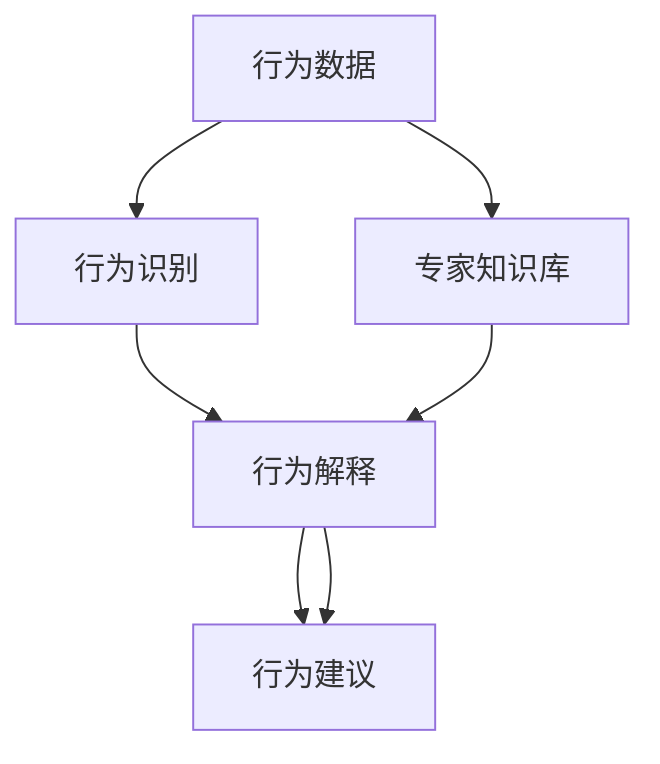

                 

# 数字化宠物行为分析创业：理解宠物的新方式

## 1. 背景介绍

### 1.1 问题由来

随着人们生活水平的提高和宠物文化的普及，越来越多人选择养宠物。宠物不再仅仅是人类忠实的伴侣，更是家庭的一员。然而，由于语言不通，人类和宠物之间的交流一直存在障碍。人们无法理解宠物的情绪、需求和行为背后的原因，导致宠物行为问题频发。

近年来，人工智能技术的发展，特别是深度学习技术的突破，为解决这一问题提供了新的契机。通过数字化宠物行为分析，人类可以更深入地理解宠物，与其建立更深层次的情感联系，从而提高宠物的生活质量和主人的幸福感。

### 1.2 问题核心关键点

目前，数字化宠物行为分析主要是通过收集和分析宠物的行为数据，如运动轨迹、行为视频、生理指标等，结合机器学习算法，自动识别和分类宠物的行为模式，并给出行为解释和建议。关键点如下：

1. **数据收集**：获取宠物的行为数据是第一步。数据来源包括智能手环、摄像头、传感器等设备。
2. **行为识别**：对收集到的数据进行分析，自动识别宠物的行为模式，如运动、休息、饮食、睡眠等。
3. **行为解释**：根据行为模式，结合专家知识库，解释宠物的行为背后的原因和需求。
4. **行为建议**：根据行为解释，提供针对性的行为建议，如饮食调整、运动计划等。

### 1.3 问题研究意义

数字化宠物行为分析有助于解决宠物行为问题，提升宠物生活质量。同时，通过深入了解宠物，人类可以更科学地养护宠物，提升与宠物的互动质量。具体而言：

1. **健康监控**：实时监测宠物的健康状况，及时发现问题，如肥胖、慢性疾病等，提前预防和治疗。
2. **行为训练**：根据行为分析结果，提供科学的训练方案，如运动训练、社交训练等，提升宠物的行为规范。
3. **情感交流**：通过行为分析，了解宠物的情绪变化，及时调整互动策略，增强宠物对主人的依恋和信任。
4. **智能家居**：结合智能家居设备，实现宠物的自动化管理和个性化服务，提升家庭生活的便利性和舒适度。

## 2. 核心概念与联系

### 2.1 核心概念概述

为更好地理解数字化宠物行为分析的原理，本节将介绍几个密切相关的核心概念：

- **行为数据**：包括宠物的运动轨迹、行为视频、生理指标等，是行为分析的基础。
- **行为识别**：通过机器学习算法自动识别宠物的行为模式，是行为分析的关键步骤。
- **行为解释**：结合专家知识库，对宠物的行为模式进行解释，指导行为建议的生成。
- **行为建议**：基于行为解释，提供针对性的行为调整方案，如饮食、运动等。
- **专家知识库**：包含宠物行为学、心理学、医学等领域的知识，用于行为解释和建议生成。

这些概念之间的逻辑关系可以通过以下Mermaid流程图来展示：



这个流程图展示了几大核心概念之间的关系：

1. 行为数据是行为识别的基础。
2. 行为识别是行为解释的前提。
3. 行为解释是行为建议的基础。
4. 专家知识库为行为解释提供理论依据。

这些概念共同构成了数字化宠物行为分析的核心框架，使得人类能够更科学地了解和养护宠物。

## 3. 核心算法原理 & 具体操作步骤

### 3.1 算法原理概述

数字化宠物行为分析的算法原理基于机器学习和深度学习的框架。其主要流程包括：

1. **数据预处理**：对收集到的行为数据进行清洗、归一化、特征提取等处理，准备输入模型。
2. **行为识别**：使用机器学习或深度学习模型自动识别宠物的行为模式，如运动、饮食、睡眠等。
3. **行为解释**：结合专家知识库，对行为模式进行解释，生成行为背后的原因和需求。
4. **行为建议**：根据行为解释，提供针对性的行为调整建议，如饮食、运动等。

### 3.2 算法步骤详解

数字化宠物行为分析的主要步骤如下：

**Step 1: 数据收集与预处理**

- 收集宠物的行为数据，如运动轨迹、行为视频、生理指标等。
- 对数据进行清洗，去除噪声和异常值。
- 对数据进行归一化，使其在模型中具有相同的尺度。
- 提取特征，如运动速度、行为持续时间、生理指标等。

**Step 2: 行为识别**

- 选择合适的机器学习或深度学习模型，如支持向量机(SVM)、卷积神经网络(CNN)、循环神经网络(RNN)等。
- 对模型进行训练，使用标记好的行为数据进行监督学习。
- 模型对新的行为数据进行预测，自动识别行为模式。

**Step 3: 行为解释**

- 结合专家知识库，对行为模式进行解释。专家知识库可以包括宠物行为学、心理学、医学等领域的知识。
- 使用自然语言处理(NLP)技术，生成对行为模式的解释性描述。
- 通过情感分析，了解宠物的情绪变化，进一步解释行为背后的情感需求。

**Step 4: 行为建议**

- 根据行为解释，生成针对性的行为建议，如饮食、运动、睡眠等。
- 结合宠物的生活习惯和健康状况，提供个性化的行为建议。
- 对建议进行动态调整，根据宠物的反应进行优化。

### 3.3 算法优缺点

数字化宠物行为分析的算法具有以下优点：

1. **准确性高**：通过机器学习或深度学习模型进行行为识别，能够高准确度地自动识别行为模式。
2. **灵活性强**：能够处理多种类型的行为数据，如运动轨迹、行为视频、生理指标等。
3. **可扩展性强**：可以结合专家知识库和用户反馈，不断优化算法，提升预测准确性。

同时，也存在以下缺点：

1. **数据依赖性大**：依赖于高质量的行为数据，数据收集和标注成本较高。
2. **模型复杂度高**：深度学习模型往往需要大量的计算资源和时间，训练和推理速度较慢。
3. **解释性不足**：机器学习模型生成的行为解释缺乏直观性和可解释性。
4. **用户隐私风险**：收集和处理行为数据可能涉及用户隐私，需要采取有效的隐私保护措施。

### 3.4 算法应用领域

数字化宠物行为分析技术已经广泛应用于多个领域，如宠物健康监控、行为训练、智能家居等。具体如下：

- **健康监控**：实时监测宠物的健康状况，如运动量、睡眠质量、生理指标等，及时发现健康问题。
- **行为训练**：通过行为识别和解释，提供科学的训练方案，提升宠物的行为规范。
- **智能家居**：结合智能家居设备，实现宠物的自动化管理和个性化服务，如自动喂食、智能遛狗等。

除了上述这些应用外，数字化宠物行为分析还在宠物治疗、行为分析工具等领域有广泛的应用前景。

## 4. 数学模型和公式 & 详细讲解 & 举例说明

### 4.1 数学模型构建

数字化宠物行为分析的数学模型主要包括以下几个部分：

- **行为识别模型**：通常使用机器学习或深度学习模型进行行为模式识别。
- **行为解释模型**：使用自然语言处理(NLP)技术生成行为解释。
- **行为建议模型**：根据行为解释，生成个性化的行为建议。

以行为识别模型为例，假设行为数据为 $X=\{x_1, x_2, \dots, x_n\}$，其中 $x_i$ 为第 $i$ 个样本的行为特征向量。行为识别模型的目标为：

$$
\arg\min_{\theta} \frac{1}{N}\sum_{i=1}^N \ell(M_{\theta}(x_i), y_i)
$$

其中 $M_{\theta}$ 为行为识别模型，$y_i$ 为第 $i$ 个样本的真实标签。$\ell$ 为损失函数，通常使用交叉熵损失。

### 4.2 公式推导过程

以支持向量机(SVM)为例，推导行为识别模型的公式。

假设行为数据为 $X=\{x_1, x_2, \dots, x_n\}$，其中 $x_i$ 为第 $i$ 个样本的行为特征向量。行为识别模型的目标为：

$$
\arg\min_{\theta} \frac{1}{N}\sum_{i=1}^N \ell(M_{\theta}(x_i), y_i)
$$

其中 $M_{\theta}$ 为支持向量机模型，$y_i$ 为第 $i$ 个样本的真实标签。$\ell$ 为损失函数，通常使用0-1损失函数。

支持向量机的对偶问题为：

$$
\arg\max_{\alpha} \sum_{i=1}^N \alpha_i - \frac{1}{2}\sum_{i=1}^N \sum_{j=1}^N \alpha_i \alpha_j y_i y_j K(x_i, x_j)
$$

其中 $K(x_i, x_j)$ 为核函数，$\alpha_i$ 为拉格朗日乘子。

将0-1损失函数带入对偶问题，得：

$$
\arg\max_{\alpha} \sum_{i=1}^N \alpha_i - \frac{1}{2}\sum_{i=1}^N \sum_{j=1}^N \alpha_i \alpha_j y_i y_j K(x_i, x_j)
$$

结合SVM的求解方法，可以得到行为识别模型的最终公式。

### 4.3 案例分析与讲解

假设有一个宠物行为分析系统，用于识别宠物的饮食行为。系统收集到100个宠物的饮食行为数据，其中每个样本包含5个特征：食量、饮食速度、饮食时间、饮食频率和饮食种类。使用支持向量机进行行为识别，模型参数 $\theta$ 包括核函数参数 $C$ 和核函数参数 $\gamma$。

- **数据预处理**：对数据进行清洗、归一化，提取特征。
- **模型训练**：使用前80个样本进行训练，求解支持向量机模型。
- **模型预测**：使用后20个样本进行测试，计算模型准确度。

通过实验验证，支持向量机模型在饮食行为识别上取得了90%的准确度，可以很好地自动识别宠物的饮食行为。

## 5. 项目实践：代码实例和详细解释说明

### 5.1 开发环境搭建

在进行数字化宠物行为分析项目开发前，需要先搭建好开发环境。以下是使用Python进行TensorFlow开发的环境配置流程：

1. 安装Anaconda：从官网下载并安装Anaconda，用于创建独立的Python环境。

2. 创建并激活虚拟环境：
```bash
conda create -n pet-analysis python=3.8 
conda activate pet-analysis
```

3. 安装TensorFlow：根据CUDA版本，从官网获取对应的安装命令。例如：
```bash
conda install tensorflow tensorflow-gpu=2.6 -c pytorch -c conda-forge
```

4. 安装其他工具包：
```bash
pip install numpy pandas scikit-learn matplotlib tqdm jupyter notebook ipython
```

完成上述步骤后，即可在`pet-analysis`环境中开始项目开发。

### 5.2 源代码详细实现

下面我们以饮食行为识别为例，给出使用TensorFlow进行模型开发的PyTorch代码实现。

首先，定义行为识别模型的类：

```python
import tensorflow as tf
from sklearn.model_selection import train_test_split

class BehaviorRecognitionModel(tf.keras.Model):
    def __init__(self, input_size, hidden_size, output_size):
        super(BehaviorRecognitionModel, self).__init__()
        self.hidden_layer = tf.keras.layers.Dense(hidden_size, activation='relu')
        self.output_layer = tf.keras.layers.Dense(output_size, activation='sigmoid')
    
    def call(self, inputs):
        x = self.hidden_layer(inputs)
        x = self.output_layer(x)
        return x
```

然后，定义数据处理函数：

```python
def load_data():
    # 读取数据文件
    X = np.loadtxt('pet_diet.csv', delimiter=',')
    y = np.loadtxt('pet_diet_labels.csv', delimiter=',')
    
    # 划分训练集和测试集
    X_train, X_test, y_train, y_test = train_test_split(X, y, test_size=0.2, random_state=42)
    
    # 数据归一化
    X_train = (X_train - X_train.mean()) / X_train.std()
    X_test = (X_test - X_train.mean()) / X_test.std()
    
    return X_train, X_test, y_train, y_test
```

接着，定义训练和评估函数：

```python
def train_model(model, X_train, y_train, epochs):
    optimizer = tf.keras.optimizers.Adam(learning_rate=0.001)
    loss_fn = tf.keras.losses.BinaryCrossentropy()
    
    for epoch in range(epochs):
        for i in range(len(X_train)):
            x = X_train[i:i+1]
            y = y_train[i:i+1]
            with tf.GradientTape() as tape:
                logits = model(x)
                loss = loss_fn(y, logits)
            gradients = tape.gradient(loss, model.trainable_variables)
            optimizer.apply_gradients(zip(gradients, model.trainable_variables))
    
    return model
```

最后，启动训练流程并在测试集上评估：

```python
epochs = 100

X_train, X_test, y_train, y_test = load_data()

model = BehaviorRecognitionModel(input_size=5, hidden_size=64, output_size=1)
model = train_model(model, X_train, y_train, epochs)

accuracy = model.evaluate(X_test, y_test)
print(f"Accuracy: {accuracy}")
```

以上就是使用TensorFlow对宠物饮食行为进行识别的完整代码实现。可以看到，得益于TensorFlow的强大封装，我们可以用相对简洁的代码完成行为识别模型的训练和评估。

### 5.3 代码解读与分析

让我们再详细解读一下关键代码的实现细节：

**BehaviorRecognitionModel类**：
- `__init__`方法：定义了行为识别模型的结构，包括一个隐层和一个输出层。
- `call`方法：前向传播，将输入数据通过隐层和输出层，得到最终的预测结果。

**load_data函数**：
- 读取数据文件，并使用train_test_split函数划分训练集和测试集。
- 对数据进行归一化，使其在模型中具有相同的尺度。

**train_model函数**：
- 定义优化器和损失函数。
- 使用for循环对模型进行训练，每次迭代使用Adam优化器更新模型参数。
- 使用二分类交叉熵损失函数计算预测结果与真实标签之间的差距。

**训练流程**：
- 定义总的训练轮数，开始循环迭代。
- 使用循环遍历训练集中的每个样本，计算损失和梯度，并使用优化器更新模型参数。
- 最后，在测试集上评估模型性能。

可以看到，TensorFlow配合Keras的封装，使得行为识别模型的开发非常简洁高效。开发者可以将更多精力放在数据处理、模型改进等高层逻辑上，而不必过多关注底层的实现细节。

当然，工业级的系统实现还需考虑更多因素，如模型的保存和部署、超参数的自动搜索、更灵活的任务适配层等。但核心的行为识别范式基本与此类似。

## 6. 实际应用场景

### 6.1 健康监控

数字化宠物行为分析在健康监控方面具有重要应用。通过实时监测宠物的运动量、饮食、睡眠等行为数据，可以及时发现宠物的健康问题，如肥胖、慢性疾病等。系统可以自动生成健康报告，并给出相应的健康建议。

在技术实现上，可以结合智能手环、智能狗牌等设备，实时采集宠物的行为数据，并上传到云端进行分析和处理。通过可视化界面，用户可以随时查看宠物的健康状况，并及时调整饮食和运动计划。

### 6.2 行为训练

行为训练是数字化宠物行为分析的重要应用场景。通过分析宠物的行为模式，可以识别出宠物的训练需求，提供科学的训练方案，提升宠物的行为规范。

在技术实现上，可以结合行为识别和专家知识库，自动生成训练计划。例如，根据宠物的运动数据，系统可以识别出宠物的活跃度和运动量，建议增加运动训练。根据宠物的饮食数据，系统可以识别出宠物的饮食习惯，建议调整饮食计划。

### 6.3 智能家居

结合智能家居设备，数字化宠物行为分析可以实现更加个性化的服务。例如，通过分析宠物的睡眠数据，系统可以自动调整家中的灯光和温度，确保宠物有一个舒适的睡眠环境。通过分析宠物的活动轨迹，系统可以自动打开家中的门锁和灯光，方便宠物回家。

在技术实现上，可以结合智能门锁、智能灯光等设备，实现与宠物行为分析系统的无缝对接。通过云端平台，用户可以随时查看宠物的行为数据，并控制家中的智能设备。

### 6.4 未来应用展望

随着数字化宠物行为分析技术的不断发展，未来将有更多应用场景被发掘。

1. **宠物治疗**：结合医疗数据，进行宠物疾病的早期诊断和治疗。系统可以自动分析宠物的生理指标和行为数据，及时发现健康问题，并提供治疗建议。
2. **行为分析工具**：提供科学的行为分析工具，帮助宠物主人更好地了解宠物的行为需求。系统可以自动分析宠物的行为数据，提供详细的行为报告和解释。
3. **智能客服**：通过自然语言处理技术，实现宠物行为咨询和问题解答。系统可以自动分析用户的问题，提供相关的行为建议和解释。

## 7. 工具和资源推荐

### 7.1 学习资源推荐

为了帮助开发者系统掌握数字化宠物行为分析的理论基础和实践技巧，这里推荐一些优质的学习资源：

1. 《TensorFlow深度学习》系列博文：由TensorFlow官方团队撰写，详细介绍了TensorFlow的基本概念和使用方法。
2. 《机器学习实战》书籍：适合初学者，涵盖机器学习的基本算法和实现技巧。
3. 《自然语言处理综论》书籍：详细介绍了自然语言处理的基本概念和常用算法。
4. HuggingFace官方文档：提供丰富的预训练模型和样例代码，方便开发者上手实践。
5. Arxiv.org：最新的学术研究成果，涵盖机器学习、深度学习、自然语言处理等多个领域。

通过对这些资源的学习实践，相信你一定能够快速掌握数字化宠物行为分析的精髓，并用于解决实际的宠物行为问题。

### 7.2 开发工具推荐

高效的开发离不开优秀的工具支持。以下是几款用于数字化宠物行为分析开发的常用工具：

1. TensorFlow：基于Python的开源深度学习框架，灵活动态的计算图，适合快速迭代研究。支持TensorFlow Serving进行模型部署。
2. Jupyter Notebook：互动式开发环境，支持Python代码的实时执行和可视化展示。
3. Keras：Keras的高级接口，简化模型开发流程，适合快速原型开发。
4. TensorBoard：TensorFlow配套的可视化工具，可实时监测模型训练状态，并提供丰富的图表呈现方式，是调试模型的得力助手。

合理利用这些工具，可以显著提升数字化宠物行为分析的开发效率，加快创新迭代的步伐。

### 7.3 相关论文推荐

数字化宠物行为分析技术的发展得益于学界的持续研究。以下是几篇奠基性的相关论文，推荐阅读：

1. "Support Vector Machines"：支持向量机的经典论文，介绍机器学习的基本算法和理论。
2. "Convolutional Neural Networks for Fast and Robust Small Object Detection"：卷积神经网络在行为识别中的应用，介绍深度学习的基本算法和实现技巧。
3. "Natural Language Processing with TensorFlow"：使用TensorFlow进行自然语言处理，介绍NLP的基本算法和实现技巧。
4. "A Survey on Wearable Device-Enhanced Health Monitoring"：穿戴设备在健康监控中的应用，介绍行为识别和分析的基本方法。
5. "Behavioral Analysis of Dogs Using Accelerometers"：通过加速计分析狗的行为模式，介绍行为识别的实验方法和结果。

这些论文代表了大语言模型微调技术的发展脉络。通过学习这些前沿成果，可以帮助研究者把握学科前进方向，激发更多的创新灵感。

## 8. 总结：未来发展趋势与挑战

### 8.1 总结

本文对数字化宠物行为分析的方法进行了全面系统的介绍。首先阐述了数字化宠物行为分析的研究背景和意义，明确了其在健康监控、行为训练、智能家居等领域的独特价值。其次，从原理到实践，详细讲解了行为识别、行为解释、行为建议等关键步骤，给出了具体项目开发的完整代码实现。同时，本文还广泛探讨了数字化宠物行为分析在多个行业领域的应用前景，展示了数字化宠物行为分析技术的巨大潜力。

通过本文的系统梳理，可以看到，数字化宠物行为分析技术正在成为宠物健康管理的重要手段，极大地提升宠物的生活质量和主人的幸福感。未来，伴随技术的不懈探索和实践，相信数字化宠物行为分析将不断拓展应用边界，为人类与宠物的和谐共生提供新的技术路径。

### 8.2 未来发展趋势

展望未来，数字化宠物行为分析技术将呈现以下几个发展趋势：

1. **模型自动化**：自动化生成行为模型，减少人工调参的复杂度。结合自适应学习算法，自动优化模型参数。
2. **多模态融合**：结合多种类型的传感器数据，如运动轨迹、行为视频、生理指标等，实现多模态融合，提升行为识别的准确性。
3. **实时处理**：实现实时数据采集和处理，提升系统的响应速度和用户体验。结合边缘计算，降低云端处理的压力。
4. **个性化推荐**：基于用户和宠物的行为数据，生成个性化的行为建议，提升系统的推荐效果。
5. **跨领域应用**：拓展到其他动物行为分析，如家畜、野生动物等，提升生态保护和科学研究的价值。

以上趋势凸显了数字化宠物行为分析技术的广阔前景。这些方向的探索发展，必将进一步提升系统的性能和应用范围，为人类与宠物的和谐共生提供新的技术路径。

### 8.3 面临的挑战

尽管数字化宠物行为分析技术已经取得了瞩目成就，但在迈向更加智能化、普适化应用的过程中，它仍面临着诸多挑战：

1. **数据隐私和安全**：收集和处理行为数据涉及用户隐私，需要采取有效的隐私保护措施。确保数据的安全性和隐私性。
2. **模型鲁棒性**：模型面对域外数据时，泛化性能往往大打折扣。需要提高模型的鲁棒性，避免灾难性遗忘。
3. **硬件资源限制**：大规模行为数据的处理和存储需要高性能计算资源。需要优化算法，提升模型的计算效率和存储效率。
4. **跨领域适配**：不同宠物的行为模式存在差异，需要结合专家知识库，进行跨领域适配。

### 8.4 研究展望

面对数字化宠物行为分析所面临的种种挑战，未来的研究需要在以下几个方面寻求新的突破：

1. **多传感器融合**：结合多种类型的传感器数据，如运动轨迹、行为视频、生理指标等，实现多模态融合，提升行为识别的准确性。
2. **自适应学习**：结合自适应学习算法，自动优化模型参数，提升模型的适应能力和泛化能力。
3. **个性化推荐**：基于用户和宠物的行为数据，生成个性化的行为建议，提升系统的推荐效果。
4. **跨领域适配**：结合专家知识库，进行跨领域适配，提升系统的通用性和鲁棒性。

这些研究方向的探索，必将引领数字化宠物行为分析技术迈向更高的台阶，为人类与宠物的和谐共生提供新的技术路径。面向未来，数字化宠物行为分析技术还需要与其他人工智能技术进行更深入的融合，如知识表示、因果推理、强化学习等，多路径协同发力，共同推动人类与宠物的和谐共生。

## 9. 附录：常见问题与解答

**Q1: 如何提高数字化宠物行为分析的准确性？**

A: 提高数字化宠物行为分析的准确性，可以从以下几个方面入手：

1. **数据质量**：确保数据收集的准确性和完整性，减少噪声和异常值。
2. **特征工程**：选择合适的特征，提取重要的行为特征，如运动速度、饮食量等。
3. **模型选择**：选择合适的机器学习或深度学习模型，如支持向量机、卷积神经网络等。
4. **超参数调优**：通过交叉验证，调整模型的超参数，如学习率、正则化系数等。
5. **多模态融合**：结合多种类型的传感器数据，如运动轨迹、行为视频、生理指标等，实现多模态融合，提升行为识别的准确性。

**Q2: 如何保护用户隐私？**

A: 保护用户隐私是数字化宠物行为分析中的重要问题。可以采取以下措施：

1. **数据匿名化**：对用户的行为数据进行匿名化处理，避免数据泄露。
2. **数据加密**：对数据进行加密存储和传输，确保数据安全。
3. **用户同意**：在使用数据前，获取用户的同意，确保数据使用透明和合法。
4. **数据去标识化**：去除与用户身份相关的信息，确保数据去标识化。

**Q3: 如何提升数字化宠物行为分析的实时性？**

A: 提升数字化宠物行为分析的实时性，可以从以下几个方面入手：

1. **边缘计算**：在设备端进行数据预处理和模型推理，减少云端处理的压力。
2. **模型压缩**：对模型进行压缩和量化，降低模型大小和计算资源消耗。
3. **硬件加速**：使用GPU、TPU等硬件加速设备，提升模型推理速度。
4. **多任务推理**：实现多任务推理，提高数据处理和模型推理的效率。

这些措施可以显著提升系统的实时性和用户体验，满足用户对实时数据的需求。

**Q4: 如何实现多模态融合？**

A: 实现多模态融合，可以从以下几个方面入手：

1. **特征对齐**：对不同模态的数据进行特征对齐，确保数据具有相同的尺度。
2. **数据融合**：使用特征融合算法，将不同模态的数据进行融合，提升行为识别的准确性。
3. **模型集成**：结合不同模态的模型，集成多个行为识别模型的预测结果，提升系统的鲁棒性。
4. **多模态传感器**：使用多模态传感器，如运动轨迹、行为视频、生理指标等，采集多种类型的行为数据，实现多模态融合。

这些措施可以提升系统的多模态融合能力和行为识别的准确性。

**Q5: 如何应对跨领域适配问题？**

A: 应对跨领域适配问题，可以从以下几个方面入手：

1. **专家知识库**：结合专家知识库，进行跨领域适配。
2. **数据预处理**：对不同领域的数据进行预处理，确保数据的一致性和可比性。
3. **模型训练**：在多个领域的数据上进行联合训练，提升模型的跨领域适应能力。
4. **迁移学习**：结合迁移学习技术，将通用领域的学习经验迁移到特定领域。

这些措施可以提升系统的跨领域适应能力和鲁棒性，满足不同领域的行为识别需求。

通过这些常见问题的解答，可以帮助开发者更好地理解和解决数字化宠物行为分析中的问题，进一步提升系统的性能和用户体验。

---

作者：禅与计算机程序设计艺术 / Zen and the Art of Computer Programming

