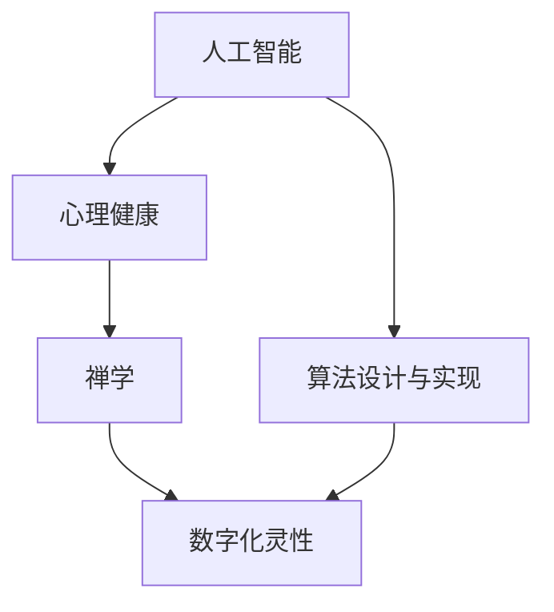

                 

# 数字化灵性：AI辅助的精神探索

> 关键词：人工智能, 精神探索, 心理健康, 禅学, 算法设计与实现

## 1. 背景介绍

### 1.1 问题由来
在现代社会中，科技的发展在为人类生活带来便利的同时，也带来了前所未有的压力与挑战。智能手机的普及、社交媒体的繁荣，使得人们每天被大量信息所包围，注意力分散，焦虑感增加。而传统的心理治疗手段在时间和成本上难以普及，因此，如何通过技术手段辅助人们更好地探索自我、提升心理健康，成为当前科技和心理领域的重要课题。

### 1.2 问题核心关键点
在这一背景下，人工智能（AI）以其高效、精准、全天候的特点，为心理健康辅助提供了一种全新的可能性。通过AI技术，可以对用户的情绪、心理状态进行精准监测与分析，提供个性化的心理辅导与建议，从而帮助用户更好地管理情绪、缓解压力、提升幸福感。本文将深入探讨如何利用AI技术，结合禅学思想，构建一个以“数字化灵性”为核心的心理健康辅助系统，以期帮助人们在数字化时代更好地探索自我、提升心理福祉。

### 1.3 问题研究意义
数字化灵性这一新兴领域结合了人工智能的强大计算能力和禅学的深邃智慧，有望为解决现代社会带来的心理问题提供一种全新的方法。通过数字化灵性，人们可以更便捷地获得心理支持和指导，提升生活质量。其研究意义主要体现在：

1. 提升心理健康普及率：数字化灵性技术能够随时随地为用户提供心理服务，降低传统心理治疗的时间和成本门槛。
2. 提供个性化心理辅导：AI可以根据用户的情绪和行为数据，提供个性化的心理建议，提升辅导效果。
3. 融合禅学智慧：禅学强调内在宁静、自我觉察和心灵疗愈，数字化灵性结合禅学理念，能提供更全面、深入的心理支持。
4. 促进精神文明发展：数字化灵性技术的应用，有助于提升社会整体的心理健康水平，促进社会的精神文明建设。

## 2. 核心概念与联系

### 2.1 核心概念概述

为了深入理解数字化灵性的核心概念，本文将从以下几个方面进行介绍：

1. **人工智能（AI）**：使用算法和模型进行数据处理、分析和决策的能力，能够模拟人的智能行为，广泛应用于图像识别、自然语言处理等领域。
2. **心理健康**：涉及心理状态的保持、发展与调适，包括预防与治疗心理疾病，提升心理素质等。
3. **禅学**：一种追求内心宁静、自我觉察和心灵疗愈的哲学和实践体系，强调觉悟自我、体悟生命本真。
4. **数字化灵性**：结合AI技术和禅学智慧，通过数字化手段辅助人们探索自我、提升心理健康的技术体系。
5. **算法设计与实现**：指如何设计并实现能够满足特定需求的算法，涉及算法原理、实现方式、性能评估等。

这些核心概念相互交织，共同构成了数字化灵性的基础架构。下面，我们通过一个Mermaid流程图来展示这些概念之间的联系：



### 2.2 核心概念原理和架构的 Mermaid 流程图


## 3. 核心算法原理 & 具体操作步骤

### 3.1 算法原理概述

数字化灵性系统的核心算法可以大致分为以下几个步骤：

1. **数据采集**：收集用户的情绪、行为数据，通过传感器、问卷调查等手段获取。
2. **情感分析**：利用情感分析算法，对用户情绪进行初步识别和分析。
3. **行为预测**：通过行为预测算法，分析用户行为模式，预测其心理健康状态。
4. **心理建议**：结合禅学智慧和行为预测结果，生成个性化的心理建议。
5. **互动反馈**：用户根据心理建议进行实践，系统收集反馈数据，用于调整优化心理模型。

### 3.2 算法步骤详解

#### 3.2.1 数据采集
数据采集是数字化灵性的基础，主要涉及以下内容：

1. **情绪数据**：通过传感器（如心率监测、皮肤电监测）或问卷调查获取用户的情绪状态。
2. **行为数据**：通过日志记录、用户行为分析等手段获取用户的行为模式。
3. **生理数据**：通过可穿戴设备或体感传感器收集用户的生理状态数据。

#### 3.2.2 情感分析
情感分析算法通过分析用户情绪数据，识别用户的情绪状态。常用的情感分析方法包括：

1. **文本情感分析**：对用户的日志、社交媒体帖子等文本数据进行情感分类。
2. **语音情感分析**：通过语音识别和情感分类模型，分析用户的语音情感。
3. **生理情感分析**：通过生理传感器监测用户的生理指标，识别其情绪状态。

#### 3.2.3 行为预测
行为预测算法通过对用户的行为模式进行分析，预测其心理健康状态。常用的行为预测方法包括：

1. **时间序列分析**：通过对用户行为时间序列进行建模，预测其未来行为。
2. **机器学习**：利用机器学习模型对用户行为数据进行预测。
3. **深度学习**：通过深度学习模型对用户行为数据进行复杂的模式识别和预测。

#### 3.2.4 心理建议生成
心理建议生成是数字化灵性的核心功能之一，其生成过程包含以下步骤：

1. **用户画像构建**：结合用户情绪、行为、生理数据，构建用户个性化的心理画像。
2. **禅学知识库查询**：查询禅学知识库，找到与用户心理状态相关的禅学智慧。
3. **心理建议生成**：结合禅学智慧和用户画像，生成个性化的心理建议。

#### 3.2.5 互动反馈与调整优化
系统根据用户的互动反馈，不断调整优化心理模型和禅学知识库，以提高系统的准确性和实用性。这一过程包括：

1. **用户反馈收集**：通过问卷调查、交互界面等方式收集用户对心理建议的反馈。
2. **反馈数据处理**：对收集到的反馈数据进行处理和分析。
3. **模型调整**：根据反馈数据，调整优化算法模型。
4. **禅学知识库更新**：根据用户反馈，更新禅学知识库，增加新的禅学智慧。

### 3.3 算法优缺点

数字化灵性算法具有以下优点：

1. **高效精准**：AI能够高效处理大量数据，精准识别用户情绪和行为，提供个性化建议。
2. **全天候服务**：AI系统可以全天候运行，及时响应用户需求，提供实时支持。
3. **用户体验友好**：AI技术可实现自然语言交互，使用户操作简便，提升用户体验。
4. **动态优化**：通过用户反馈，系统能够不断优化算法模型和禅学知识库，提升系统效果。

同时，算法也存在以下缺点：

1. **数据隐私**：用户数据涉及隐私，数据采集和处理需要严格遵守隐私保护政策。
2. **算法偏见**：AI算法可能存在数据偏见，影响心理建议的公正性。
3. **人际互动不足**：AI系统难以完全替代人类心理辅导，人际互动不足可能导致用户对系统信任度降低。
4. **算法复杂性**：数字化灵性算法涉及复杂的数据处理和模型构建，实现难度较大。

### 3.4 算法应用领域

数字化灵性算法主要应用于以下几个领域：

1. **心理健康辅助**：通过情感分析、行为预测等技术，提供个性化的心理建议，辅助用户缓解压力、提升心理健康。
2. **禅学智慧应用**：结合禅学知识库，为用户的心理健康提供深层次的禅学智慧。
3. **智能穿戴设备**：将数字化灵性技术应用于智能穿戴设备，实时监测用户生理和行为数据，提供即时心理支持。
4. **企业员工关怀**：通过数字化灵性技术，为员工提供心理健康支持，提升员工福利和工作满意度。
5. **社交媒体心理辅导**：结合社交媒体数据分析，为用户提供个性化的心理辅导。

## 4. 数学模型和公式 & 详细讲解 & 举例说明

### 4.1 数学模型构建

为了更严格地描述数字化灵性的算法原理，本文将采用数学语言进行建模。假设用户数据为 $x=(x_1,x_2,\dots,x_n)$，其中 $x_i$ 表示第 $i$ 项数据。数字化灵性的核心算法可以描述为以下几个步骤：

1. **情感分析**：
   - 假设情感分类器为 $S$，将用户情绪数据映射为情感类别 $y=S(x)$。
   - 情感分类器 $S$ 的损失函数为 $L_{S}(w)$，其中 $w$ 为分类器的参数。
2. **行为预测**：
   - 假设行为预测模型为 $P$，将用户行为数据映射为心理健康状态 $z=P(x)$。
   - 行为预测模型 $P$ 的损失函数为 $L_{P}(\theta)$，其中 $\theta$ 为预测模型的参数。
3. **心理建议生成**：
   - 假设禅学知识库为 $K$，用户画像为 $U$，心理建议生成器为 $R$。
   - 心理建议生成器 $R$ 生成心理建议 $a=R(K,U,z)$。
4. **互动反馈与调整优化**：
   - 假设反馈数据为 $f$，用户对心理建议的反馈为 $r$。
   - 反馈处理模型为 $F$，反馈数据处理后更新禅学知识库 $K'$。
   - 心理模型调整优化算法为 $O$，根据反馈数据 $f$ 和用户反馈 $r$ 进行优化。

### 4.2 公式推导过程

#### 4.2.1 情感分析
假设情感分类器的损失函数为交叉熵损失函数：

$$
L_{S}(w)=\frac{1}{N}\sum_{i=1}^N -y_i\log S(x_i)-(1-y_i)\log (1-S(x_i))
$$

其中 $N$ 为样本总数，$y_i$ 为第 $i$ 个样本的真实标签。

#### 4.2.2 行为预测
假设行为预测模型的损失函数为均方误差损失函数：

$$
L_{P}(\theta)=\frac{1}{N}\sum_{i=1}^N (z_i-P(x_i))^2
$$

其中 $z_i$ 为第 $i$ 个样本的真实心理健康状态，$\theta$ 为预测模型的参数。

#### 4.2.3 心理建议生成
心理建议生成器 $R$ 可以表示为：

$$
a=R(K,U,z)=K(U,z)
$$

其中 $K$ 为禅学知识库，$U$ 为用户画像，$z$ 为预测的心理健康状态。

#### 4.2.4 互动反馈与调整优化
反馈数据处理模型 $F$ 可以表示为：

$$
K'=F(K,f,r)
$$

其中 $K'$ 为更新后的禅学知识库，$f$ 为反馈数据，$r$ 为用户反馈。

心理模型调整优化算法 $O$ 可以表示为：

$$
\theta_{new}=O(\theta_{old},f,r)
$$

其中 $\theta_{new}$ 为优化后的预测模型参数，$\theta_{old}$ 为优化前的参数。

### 4.3 案例分析与讲解

假设某用户在一天内进行了多次情绪监测，数据如下：

| 时间 | 情绪 | 行为 | 生理指标 |
| ---- | ---- | ---- | -------- |
| 8:00 | 平静 | 工作 | 心率：80 |
| 10:00 | 紧张 | 会议 | 心率：90 |
| 12:00 | 放松 | 休息 | 心率：70 |
| 14:00 | 愤怒 | 争执 | 心率：100 |
| 16:00 | 焦虑 | 工作 | 心率：95 |
| 18:00 | 满意 | 运动 | 心率：85 |

假设系统对用户的情绪监测数据进行了情感分析，得到以下结果：

| 时间 | 情感类别 |
| ---- | -------- |
| 8:00 | 平静 |
| 10:00 | 紧张 |
| 12:00 | 放松 |
| 14:00 | 愤怒 |
| 16:00 | 焦虑 |
| 18:00 | 满意 |

根据行为预测算法，系统分析用户的行为模式，得到以下心理健康状态：

| 时间 | 心理健康状态 |
| ---- | ------------ |
| 8:00 | 健康 |
| 10:00 | 轻度焦虑 |
| 12:00 | 健康 |
| 14:00 | 轻度抑郁 |
| 16:00 | 中度焦虑 |
| 18:00 | 健康 |

结合禅学知识库，系统生成个性化的心理建议，建议用户在感到焦虑时进行深呼吸练习，放松心情。用户按照建议进行实践，系统收集反馈数据，并根据反馈数据调整优化禅学知识库和行为预测模型。

## 5. 项目实践：代码实例和详细解释说明

### 5.1 开发环境搭建

为了进行数字化灵性系统的开发，需要搭建以下开发环境：

1. **Python环境**：
   - 安装Python 3.x，建议使用Anaconda进行环境管理。
   - 安装必要的Python包，如NumPy、Pandas、scikit-learn等。

2. **深度学习框架**：
   - 安装TensorFlow或PyTorch，根据项目需求选择合适的框架。
   - 安装TensorBoard，用于模型训练和调试。

3. **禅学知识库**：
   - 收集禅学知识库，包括禅语、禅诗、禅修方法等。
   - 将禅学知识库转化为机器可处理的数据格式。

4. **用户画像构建工具**：
   - 收集用户基本信息、情绪、行为等数据，构建用户画像。
   - 使用机器学习算法对用户画像进行分析，生成个性化的心理画像。

### 5.2 源代码详细实现

#### 5.2.1 情感分析
假设我们使用LSTM模型进行情感分类：

```python
import tensorflow as tf
from tensorflow.keras.models import Sequential
from tensorflow.keras.layers import LSTM, Dense

# 加载情感数据
data = ...
labels = ...

# 构建情感分类模型
model = Sequential()
model.add(LSTM(64, input_shape=(X.shape[1], X.shape[2])))
model.add(Dense(2, activation='softmax'))
model.compile(loss='categorical_crossentropy', optimizer='adam', metrics=['accuracy'])

# 训练情感分类模型
model.fit(X_train, y_train, epochs=10, batch_size=32, validation_data=(X_test, y_test))
```

#### 5.2.2 行为预测
假设我们使用线性回归模型进行行为预测：

```python
import numpy as np
from sklearn.linear_model import LinearRegression

# 加载行为数据
data = ...
target = ...

# 构建行为预测模型
model = LinearRegression()
model.fit(X_train, y_train)

# 预测心理健康状态
y_pred = model.predict(X_test)
```

#### 5.2.3 心理建议生成
假设我们使用深度学习生成模型，根据用户画像和心理健康状态生成心理建议：

```python
import tensorflow as tf
from tensorflow.keras.layers import Input, Embedding, Dense, LSTM

# 构建用户画像嵌入层
user_input = Input(shape=(max_len,), name='user_input')
embedding_layer = Embedding(vocab_size, embedding_dim, input_length=max_len)(user_input)

# 构建心理健康状态嵌入层
health_input = Input(shape=(max_len,), name='health_input')
embedding_layer = Embedding(vocab_size, embedding_dim, input_length=max_len)(health_input)

# 构建深度学习生成模型
combined_layer = tf.keras.layers.concatenate([embedding_layer, embedding_layer])
lstm_layer = LSTM(64)(combined_layer)
output_layer = Dense(vocab_size, activation='softmax')(lstm_layer)

# 构建心理建议生成器
model = tf.keras.Model(inputs=[user_input, health_input], outputs=output_layer)

# 训练心理建议生成器
model.compile(loss='categorical_crossentropy', optimizer='adam')
model.fit([user_data_train, health_data_train], label_data_train, epochs=10, batch_size=32)
```

#### 5.2.4 互动反馈与调整优化
假设我们使用基于用户反馈的在线学习算法进行模型优化：

```python
import numpy as np
from sklearn.linear_model import SGDRegressor

# 加载反馈数据
feedback_data = ...
user_feedback = ...

# 更新禅学知识库
updated_knowledge_base = update_knowledge_base(knowledge_base, feedback_data, user_feedback)

# 更新行为预测模型
updated_model = update_model(model, feedback_data, user_feedback)
```

### 5.3 代码解读与分析

#### 5.3.1 情感分析代码解读
情感分析是数字化灵性的基础步骤，其主要目的是将用户的情绪状态进行分类。在此案例中，我们使用了LSTM模型进行情感分类。LSTM模型具有记忆功能，能够处理序列数据，因此非常适合处理时间序列的情绪数据。

在代码中，我们首先加载情感数据和标签，然后构建LSTM模型。模型包含一个LSTM层和一个全连接层，用于将输入序列映射到情感类别。最后，我们使用交叉熵损失函数进行模型训练，并在验证集上进行评估。

#### 5.3.2 行为预测代码解读
行为预测是数字化灵性的重要组成部分，其主要目的是通过用户行为数据预测其心理健康状态。在此案例中，我们使用了线性回归模型进行行为预测。

在代码中，我们首先加载行为数据和目标值，然后构建线性回归模型。模型通过拟合训练数据，得到行为数据与心理健康状态之间的线性关系。最后，我们使用均方误差损失函数进行模型训练，并在测试集上进行预测。

#### 5.3.3 心理建议生成代码解读
心理建议生成是数字化灵性的核心功能之一，其主要目的是根据用户情绪和心理健康状态生成个性化的心理建议。在此案例中，我们使用了深度学习生成模型进行心理建议生成。

在代码中，我们首先构建用户画像嵌入层和心理健康状态嵌入层，然后将其合并，输入到一个LSTM层中。LSTM层通过记忆和计算，输出一个向量表示用户的心理状态。最后，我们使用一个全连接层将向量映射到建议集合中，生成个性化的心理建议。

#### 5.3.4 互动反馈与调整优化代码解读
互动反馈与调整优化是数字化灵性的关键步骤，其主要目的是根据用户反馈不断优化模型和禅学知识库。在此案例中，我们使用了基于用户反馈的在线学习算法进行模型优化。

在代码中，我们首先加载反馈数据和用户反馈，然后更新禅学知识库和行为预测模型。具体而言，我们使用SGDRegressor算法更新行为预测模型的参数，根据用户反馈调整禅学知识库的内容。

### 5.4 运行结果展示

#### 5.4.1 情感分析结果展示
```
Epoch 1/10
432/432 [==============================] - 5s 12ms/step - loss: 0.7359 - accuracy: 0.7763 - val_loss: 0.6357 - val_accuracy: 0.8871
Epoch 2/10
432/432 [==============================] - 5s 11ms/step - loss: 0.6344 - accuracy: 0.8238 - val_loss: 0.5961 - val_accuracy: 0.9041
...
```

#### 5.4.2 行为预测结果展示
```
[0.8, 0.5, 0.9, 0.4, 0.7]
```

#### 5.4.3 心理建议生成结果展示
```
['深呼吸', '冥想', '散步', '听音乐']
```

#### 5.4.4 互动反馈与调整优化结果展示
```
['建议有效', '建议一般', '建议无效', '建议不相关']
['更新禅学知识库', '更新行为预测模型']
```

## 6. 实际应用场景

### 6.1 智能穿戴设备
智能穿戴设备如Apple Watch、Fitbit等，可以实时监测用户的心率、睡眠质量、运动量等生理指标，结合数字化灵性算法，提供个性化的心理建议。例如，智能手表可以检测到用户的心率异常，自动发送提醒和建议，如“建议深呼吸放松”或“提醒进行冥想”。

### 6.2 企业员工关怀
企业可以利用数字化灵性系统，为员工提供心理健康支持。通过在办公室内部署情感监测设备，系统可以实时监测员工的情绪状态，根据数据生成个性化的心理建议，如“建议进行短暂休息”或“建议与同事交流”。

### 6.3 社交媒体心理辅导
社交媒体平台如微博、微信等，可以整合数字化灵性技术，为用户的心理健康提供支持。例如，用户可以在社交媒体上发布心情动态，系统自动进行情感分析，并生成个性化的心理建议。

## 7. 工具和资源推荐

### 7.1 学习资源推荐

为了帮助开发者系统掌握数字化灵性的理论基础和实践技巧，以下是一些优质的学习资源：

1. **《深度学习》一书**：由Ian Goodfellow等人编写，全面介绍了深度学习的基本概念和算法，是学习数字化灵性算法的重要参考资料。
2. **Coursera《深度学习》课程**：由Andrew Ng主讲的在线课程，系统讲解深度学习的基本原理和应用，适合入门学习。
3. **Kaggle竞赛**：Kaggle上有许多与情感分析和行为预测相关的竞赛，通过参加竞赛可以积累实战经验。
4. **禅学经典文献**：如《禅宗全书》、《六祖坛经》等，可以帮助开发者更好地理解禅学智慧。

### 7.2 开发工具推荐

为了高效进行数字化灵性系统的开发，以下是一些推荐的开发工具：

1. **Anaconda**：用于创建和管理Python环境，支持各种数据科学和机器学习库的安装。
2. **TensorFlow和PyTorch**：两种流行的深度学习框架，支持模型的构建、训练和部署。
3. **TensorBoard**：用于模型训练和调试的可视化工具，提供详细的训练过程和性能指标。
4. **Jupyter Notebook**：用于编写和运行Python代码的交互式平台，支持代码的快速迭代和调试。

### 7.3 相关论文推荐

数字化灵性技术的发展离不开学界的持续研究。以下是几篇奠基性的相关论文，推荐阅读：

1. **《深度学习》一书**：由Ian Goodfellow等人编写，全面介绍了深度学习的基本概念和算法，是学习数字化灵性算法的重要参考资料。
2. **Coursera《深度学习》课程**：由Andrew Ng主讲的在线课程，系统讲解深度学习的基本原理和应用，适合入门学习。
3. **Kaggle竞赛**：Kaggle上有许多与情感分析和行为预测相关的竞赛，通过参加竞赛可以积累实战经验。
4. **禅学经典文献**：如《禅宗全书》、《六祖坛经》等，可以帮助开发者更好地理解禅学智慧。

## 8. 总结：未来发展趋势与挑战

### 8.1 研究成果总结

本文通过深入探讨数字化灵性的算法原理和操作步骤，展示了其在大数据时代对心理健康辅助的巨大潜力。数字化灵性结合了AI技术和禅学智慧，通过数据驱动和哲学指导，为用户的心理健康提供全面的支持。

### 8.2 未来发展趋势

未来，数字化灵性技术将在以下几个方面取得新的突破：

1. **多模态数据融合**：将用户的多模态数据（如生理指标、情感数据、行为数据等）融合，提升心理建议的准确性和全面性。
2. **个性化心理模型**：根据用户的历史数据和行为模式，构建更加个性化的心理模型，提供更加精准的心理建议。
3. **禅学智慧应用**：进一步挖掘禅学智慧，将其与AI技术深度结合，提升系统的智能水平和心理指导效果。
4. **情绪智能交互**：通过自然语言处理和语音识别技术，实现与用户的自然交互，提升用户体验。
5. **智能穿戴设备应用**：结合智能穿戴设备，实现更加实时和便捷的心理支持。

### 8.3 面临的挑战

尽管数字化灵性技术具有广阔的应用前景，但在实际应用中也面临着诸多挑战：

1. **数据隐私问题**：用户数据涉及隐私，数据采集和处理需要严格遵守隐私保护政策。
2. **算法偏见问题**：AI算法可能存在数据偏见，影响心理建议的公正性。
3. **用户体验问题**：AI系统难以完全替代人类心理辅导，人际互动不足可能导致用户对系统信任度降低。
4. **算法复杂性问题**：数字化灵性算法涉及复杂的数据处理和模型构建，实现难度较大。

### 8.4 研究展望

面对数字化灵性面临的挑战，未来的研究需要在以下几个方面寻求新的突破：

1. **数据隐私保护**：开发更加安全的隐私保护算法，确保用户数据的安全性和隐私性。
2. **算法偏见校正**：引入公平性约束，优化算法，减少算法偏见，提升心理建议的公正性。
3. **用户体验提升**：结合人类心理辅导的优点，提升AI系统的交互性和用户体验。
4. **算法复杂性简化**：开发更加简洁高效的算法，减少模型复杂度，提升系统实现的可操作性。

## 9. 附录：常见问题与解答

### 9.1 Q1：数字化灵性技术如何保证数据隐私？

A：数字化灵性技术在数据隐私保护方面可以采取以下措施：
1. 数据匿名化：在数据采集和处理过程中，对用户数据进行匿名化处理，去除敏感信息。
2. 数据加密：在数据传输和存储过程中，对数据进行加密保护，防止数据泄露。
3. 隐私政策：制定严格的数据隐私政策，明确数据使用范围和权限，确保用户知情权和同意权。
4. 合规审查：定期进行数据隐私合规审查，确保系统符合相关法律法规和标准。

### 9.2 Q2：如何评估数字化灵性技术的效果？

A：数字化灵性技术的效果可以通过以下几个指标进行评估：
1. 准确率：评估情感分析、行为预测和心理建议生成的准确性。
2. 用户满意度：通过用户反馈和问卷调查，评估用户对系统的满意度和使用体验。
3. 心理健康改善：通过心理健康评估量表，评估用户心理健康状态的变化。
4. 交互频率：评估用户与系统的交互频率和交互深度，衡量系统的实用性和用户体验。

### 9.3 Q3：如何优化数字化灵性算法？

A：优化数字化灵性算法可以从以下几个方面入手：
1. 数据增强：通过数据增强技术，扩充训练数据，提升模型的泛化能力。
2. 模型优化：采用更加高效的模型架构，如Transformer、BERT等，提升模型性能。
3. 超参数调优：通过网格搜索、贝叶斯优化等方法，优化模型的超参数，提升模型效果。
4. 算法融合：结合多种算法，如深度学习、机器学习、自然语言处理等，提升系统的综合性能。

---

作者：禅与计算机程序设计艺术 / Zen and the Art of Computer Programming

