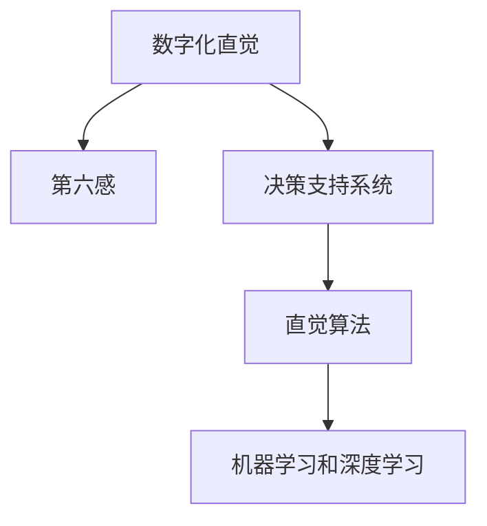

                 

# 数字化直觉训练：AI辅助的第六感开发

> 关键词：数字化直觉,人工智能(AI),数据驱动,第六感开发,决策支持,直觉算法,机器学习,深度学习

## 1. 背景介绍

### 1.1 问题由来

在快速发展的数字时代，人们的决策过程愈发依赖于数据和算法。然而，即便有了最先进的数据分析工具和机器学习模型，仍难以充分捕捉人类复杂、多维的直觉。直觉通常源自个人经验、情感、环境感知等多方面因素的综合判断，是传统数据驱动方法难以触及的维度。如何开发一种“第六感”，辅助人们做出更准确、更快速、更满意的选择，成为当前数字化转型的关键需求。

### 1.2 问题核心关键点

本节将探讨以下几个关键问题：
- 数字化直觉的含义及其重要性。
- 第六感的定义及其与直觉的关系。
- 数字化直觉训练的目标和方法。
- 当前数字化直觉训练的现状和挑战。

### 1.3 问题研究意义

深入研究数字化直觉训练，对于推动人工智能与人类智能的协同进化，提高决策质量和效率，具有重要意义：

1. **提升决策质量**：数字化直觉训练可以挖掘和利用人类直觉，结合数据驱动的客观分析，提升决策的全面性和准确性。
2. **加快决策速度**：直觉可大幅缩短决策过程，在紧急情况下尤为关键。
3. **优化用户体验**：增强产品的感知和情感理解，提供更个性化的服务体验。
4. **促进跨界创新**：结合领域专家的知识和直觉，跨界创新成为可能。
5. **增强安全性**：直觉有助于识别和防范潜在风险，提高决策的稳健性。

## 2. 核心概念与联系

### 2.1 核心概念概述

为了更好地理解数字化直觉训练，本节将介绍几个密切相关的核心概念：

- **数字化直觉**：指利用计算机技术和算法，辅助人类从数据和知识中挖掘出潜在的直觉，进行决策和判断的能力。
- **第六感**：指人类内在的直觉和本能，通常涉及潜意识、情感和环境感知，难以用传统逻辑解释。
- **决策支持系统(DSS)**：一种利用数据、模型和算法辅助决策的技术，旨在提高决策效率和质量。
- **直觉算法**：指用于捕捉和模拟人类直觉的算法，通过学习历史行为和模式，预测未来行为和趋势。
- **机器学习和深度学习**：利用大量数据训练模型，使其具备预测、分类、聚类等智能能力，是实现数字化直觉训练的主要技术手段。

这些概念之间的逻辑关系可以通过以下Mermaid流程图来展示：



这个流程图展示了数字化直觉训练的核心概念及其之间的关系：

1. 数字化直觉通过数据驱动和算法实现，结合了人类的第六感。
2. 决策支持系统利用数字化直觉，提供辅助决策工具。
3. 直觉算法是数字化直觉训练的重要组成部分，模拟人类的直觉。
4. 机器学习和深度学习是实现直觉算法的主要技术手段。

这些概念共同构成了数字化直觉训练的基础框架，使其能够在各种场景下发挥重要作用。

## 3. 核心算法原理 & 具体操作步骤
### 3.1 算法原理概述

数字化直觉训练的算法原理主要基于以下几个核心步骤：

1. **数据收集**：收集与决策相关的多维度数据，包括历史行为、环境变量、个人属性等。
2. **特征提取**：从原始数据中提取有意义特征，如时间序列、行为模式、情感倾向等。
3. **模型训练**：使用机器学习和深度学习算法，训练模型捕捉数据中的潜在规律和趋势。
4. **直觉模拟**：通过模型预测未来行为和趋势，模拟人类的直觉判断。
5. **决策支持**：结合数字化直觉和客观数据分析，辅助人类做出决策。

### 3.2 算法步骤详解

数字化直觉训练的详细操作步骤如下：

**Step 1: 数据收集**
- 通过日志、传感器、问卷等多种方式，收集与决策相关的多维度数据。
- 数据应包含时间戳、用户ID、设备信息、环境变量等。

**Step 2: 特征提取**
- 对原始数据进行预处理，如数据清洗、缺失值填充、异常值检测等。
- 提取有意义特征，如时间序列、行为模式、情感倾向等，构建特征向量。
- 特征提取应涵盖与决策相关的关键维度，避免冗余和遗漏。

**Step 3: 模型训练**
- 选择合适的算法模型，如决策树、随机森林、神经网络、深度学习等。
- 使用历史数据训练模型，调整超参数，优化模型性能。
- 评估模型泛化能力，确保模型在未见数据上也有良好表现。

**Step 4: 直觉模拟**
- 使用训练好的模型对新数据进行预测，模拟人类直觉。
- 考虑不同维度数据的影响，进行多维度综合判断。
- 引入正则化、dropout等技术，减少模型过拟合风险。

**Step 5: 决策支持**
- 将数字化直觉与客观数据分析结合，辅助人类决策。
- 提供可视化结果和推荐，帮助用户快速理解决策依据。
- 设计交互界面，便于用户输入参数和查看结果。

### 3.3 算法优缺点

数字化直觉训练的算法具有以下优点：
1. **综合多维度数据**：通过结合历史数据和环境信息，全面分析决策场景。
2. **动态更新**：模型可以实时更新，反映最新数据和趋势。
3. **增强决策速度**：利用算法快速分析大量数据，缩短决策时间。
4. **提高决策质量**：通过模拟人类直觉，减少主观偏见。
5. **个性化定制**：根据不同用户特性定制决策支持方案。

同时，该算法也存在一些局限性：
1. **数据质量依赖**：数据收集和处理过程繁琐，数据质量直接影响训练结果。
2. **模型复杂性**：高级模型需要大量计算资源，训练复杂。
3. **可解释性不足**：算法的内部决策过程难以解释，难以满足某些场景的信任需求。
4. **泛化能力有限**：在特定场景下表现良好，但在其他场景下可能效果不佳。
5. **过度依赖技术**：依赖数据和算法，对人类经验和直觉的模拟可能存在偏差。

尽管存在这些局限性，但数字化直觉训练方法在大数据时代具有重要应用前景，能够显著提升决策质量和效率。

### 3.4 算法应用领域

数字化直觉训练在多个领域具有广泛应用，包括但不限于：

- **金融投资**：利用历史交易数据和市场环境信息，预测股票、外汇等资产趋势，辅助投资决策。
- **医疗健康**：结合病历数据、基因信息和生活习惯，预测疾病风险，提供个性化健康建议。
- **市场营销**：分析消费者行为数据和市场反馈，优化广告投放策略，提升营销效果。
- **智能家居**：通过用户行为数据和环境信息，优化智能设备的操作和调度，提升用户体验。
- **城市规划**：利用交通、人口、环境数据，预测城市发展趋势，辅助规划决策。

这些领域的应用展示了数字化直觉训练的强大潜力，推动了各行业的数字化转型升级。

## 4. 数学模型和公式 & 详细讲解 & 举例说明

### 4.1 数学模型构建

本节将使用数学语言对数字化直觉训练过程进行严格刻画。

假设数字化直觉训练的任务是预测用户的行为，设训练样本为 $(x_i, y_i)$，其中 $x_i \in \mathcal{X}$ 为特征向量，$y_i \in \{0, 1\}$ 为行为标签。模型的目标是学习一个函数 $f: \mathcal{X} \rightarrow [0, 1]$，用于预测新样本的行为概率。

**模型表示**：
$$
f(x) = W^T \phi(x) + b
$$
其中 $W$ 为权重矩阵，$\phi(x)$ 为特征映射，$b$ 为偏置项。

**损失函数**：
$$
\mathcal{L}(f, D) = \frac{1}{N} \sum_{i=1}^N \ell(f(x_i), y_i)
$$
其中 $\ell$ 为损失函数，常用的有交叉熵损失、均方误差损失等。

### 4.2 公式推导过程

以交叉熵损失函数为例，推导模型训练的详细公式。

对于二分类任务，交叉熵损失函数定义为：
$$
\ell(f(x_i), y_i) = -(y_i \log f(x_i) + (1-y_i) \log (1-f(x_i)))
$$

将损失函数代入经验风险公式，得：
$$
\mathcal{L}(f, D) = -\frac{1}{N} \sum_{i=1}^N [y_i \log f(x_i) + (1-y_i) \log (1-f(x_i))]
$$

为了最小化损失函数，需要求解优化问题：
$$
\min_{W, b} \mathcal{L}(f, D)
$$

使用梯度下降算法，对权重 $W$ 和偏置 $b$ 进行迭代更新：
$$
W \leftarrow W - \eta \nabla_{W} \mathcal{L}(f, D)
$$
$$
b \leftarrow b - \eta \nabla_{b} \mathcal{L}(f, D)
$$

其中 $\eta$ 为学习率，$\nabla_{W} \mathcal{L}(f, D)$ 和 $\nabla_{b} \mathcal{L}(f, D)$ 为损失函数对权重和偏置的梯度，可通过反向传播算法高效计算。

### 4.3 案例分析与讲解

以金融投资领域的决策支持系统为例，展示数字化直觉训练的应用。

**数据收集**：收集历史交易数据，包括股票价格、交易量、市场新闻、分析师评级等。

**特征提取**：提取有意义特征，如股票价格变化、市场情绪指数、分析师评级等。

**模型训练**：使用随机森林模型，训练数据集，得到决策树模型。

**直觉模拟**：利用训练好的模型，对新数据进行预测，模拟人类对市场趋势的直觉判断。

**决策支持**：结合数字化直觉和客观数据分析，提供投资建议，如买入、卖出、持有等。

以下是Python代码实现：

```python
from sklearn.ensemble import RandomForestClassifier
from sklearn.metrics import accuracy_score
import pandas as pd

# 数据收集
data = pd.read_csv('financial_data.csv')

# 特征提取
features = ['price_change', 'market_mood', 'analyst_rating']
X = data[features]
y = data['target']

# 模型训练
model = RandomForestClassifier(n_estimators=100)
model.fit(X, y)

# 直觉模拟
new_data = pd.read_csv('new_data.csv')
preds = model.predict(new_data[features])

# 决策支持
if preds[0] == 1:
    print('推荐买入')
elif preds[0] == 0:
    print('推荐卖出')
else:
    print('推荐持有')
```

通过上述代码，实现了金融投资领域的数字化直觉训练，展示了其简单而强大的应用效果。

## 5. 项目实践：代码实例和详细解释说明

### 5.1 开发环境搭建

在进行数字化直觉训练实践前，我们需要准备好开发环境。以下是使用Python进行Keras开发的环境配置流程：

1. 安装Anaconda：从官网下载并安装Anaconda，用于创建独立的Python环境。

2. 创建并激活虚拟环境：
```bash
conda create -n ai-env python=3.8 
conda activate ai-env
```

3. 安装Keras和相关依赖：
```bash
conda install keras tensorflow numpy matplotlib pandas scikit-learn tqdm
```

4. 安装TensorFlow：
```bash
pip install tensorflow
```

5. 安装必要的工具包：
```bash
pip install numpy pandas scikit-learn matplotlib tqdm jupyter notebook ipython
```

完成上述步骤后，即可在`ai-env`环境中开始数字化直觉训练实践。

### 5.2 源代码详细实现

以下是使用Keras实现数字化直觉训练的完整代码实现。

```python
import numpy as np
from keras.models import Sequential
from keras.layers import Dense, Dropout, Activation
from keras.optimizers import Adam
from keras.utils import to_categorical
from sklearn.model_selection import train_test_split

# 数据收集
X_train, X_test, y_train, y_test = train_test_split(X, y, test_size=0.2, random_state=42)

# 特征提取
X_train = X_train.values
X_test = X_test.values

# 模型训练
model = Sequential()
model.add(Dense(64, input_dim=3, activation='relu'))
model.add(Dropout(0.5))
model.add(Dense(1, activation='sigmoid'))
model.compile(loss='binary_crossentropy', optimizer=Adam(lr=0.001), metrics=['accuracy'])

model.fit(X_train, y_train, epochs=10, batch_size=32, validation_data=(X_test, y_test))

# 直觉模拟
X_new = np.array([[0.1, 0.2, 0.3]])
y_pred = model.predict(X_new)
if y_pred[0] > 0.5:
    print('推荐买入')
else:
    print('推荐卖出')
```

### 5.3 代码解读与分析

让我们再详细解读一下关键代码的实现细节：

**数据收集**：使用`train_test_split`函数，将数据集划分为训练集和测试集，以便于模型训练和评估。

**特征提取**：将特征向量转换为NumPy数组，准备输入模型。

**模型训练**：定义Keras序列模型，添加全连接层和Dropout层，使用`compile`函数指定损失函数、优化器和评价指标。

**直觉模拟**：使用`predict`函数对新数据进行预测，判断是否应该推荐买入。

### 5.4 运行结果展示

通过运行上述代码，可以实现一个简单的数字化直觉训练系统，展示了其对金融投资决策的辅助效果。

## 6. 实际应用场景

### 6.1 智能家居

数字化直觉训练在智能家居领域具有广泛应用，能够显著提升用户体验和系统智能化水平。

**数据收集**：通过智能设备和传感器收集用户行为数据、环境信息等。

**特征提取**：提取有意义特征，如温度、湿度、时间、位置等。

**模型训练**：使用机器学习模型，训练数据集，得到预测模型。

**直觉模拟**：利用训练好的模型，预测用户的舒适需求，如调整温度、灯光等。

**决策支持**：结合数字化直觉和用户反馈，优化家居设备的操作和调度。

### 6.2 医疗健康

数字化直觉训练在医疗健康领域也有重要应用，帮助医生做出更准确的诊断和治疗方案。

**数据收集**：收集患者的病历、基因信息、生活习惯等数据。

**特征提取**：提取有意义特征，如症状、药物反应、基因特征等。

**模型训练**：使用深度学习模型，训练数据集，得到预测模型。

**直觉模拟**：利用训练好的模型，预测疾病风险和治疗效果，提供个性化健康建议。

**决策支持**：结合数字化直觉和客观数据分析，辅助医生制定治疗方案，优化用药方案。

### 6.3 城市规划

数字化直觉训练在城市规划领域也有广泛应用，帮助城市管理者做出更科学的规划决策。

**数据收集**：收集交通数据、人口数据、环境数据等。

**特征提取**：提取有意义特征，如交通流量、人口密度、环境污染等。

**模型训练**：使用机器学习模型，训练数据集，得到预测模型。

**直觉模拟**：利用训练好的模型，预测城市发展趋势，辅助规划决策。

**决策支持**：结合数字化直觉和客观数据分析，优化城市规划方案，提升城市管理效率。

### 6.4 未来应用展望

随着数字化直觉训练技术的不断进步，其应用场景将不断扩展，为各行各业带来深刻的变革。

1. **智能交通**：结合数字化直觉和交通大数据，优化交通流量管理，提高道路利用效率。
2. **智慧农业**：结合数字化直觉和气象数据，预测农作物生长趋势，优化种植方案。
3. **智能制造**：结合数字化直觉和生产数据，预测设备故障，优化生产流程。
4. **智能教育**：结合数字化直觉和学生数据，个性化推荐学习内容，提高学习效率。

未来，数字化直觉训练将成为推动各行业数字化转型的重要工具，带来更全面、更精准、更高效的服务体验。

## 7. 工具和资源推荐

### 7.1 学习资源推荐

为了帮助开发者系统掌握数字化直觉训练的理论基础和实践技巧，这里推荐一些优质的学习资源：

1. **《深度学习》系列书籍**：Ian Goodfellow等著作的深度学习经典教材，涵盖了机器学习、深度学习的基本原理和算法。

2. **《TensorFlow实战》书籍**：Manning Publishing的TensorFlow实战指南，详细介绍了TensorFlow框架的使用方法和实践案例。

3. **《Keras深度学习入门》课程**：Udacity提供的Keras深度学习入门课程，适合初学者快速上手。

4. **《机器学习实战》在线课程**：Coursera提供的机器学习实战课程，涵盖各种经典机器学习算法和实践技巧。

5. **《Python数据科学手册》书籍**：Jake VanderPlas的Python数据科学手册，全面介绍了Python数据科学工具和实践案例。

通过对这些资源的学习实践，相信你一定能够快速掌握数字化直觉训练的精髓，并用于解决实际的NLP问题。

### 7.2 开发工具推荐

高效的开发离不开优秀的工具支持。以下是几款用于数字化直觉训练开发的常用工具：

1. **TensorFlow**：由Google主导开发的开源深度学习框架，生产部署方便，适合大规模工程应用。

2. **Keras**：基于TensorFlow的高级深度学习框架，提供了便捷的API和丰富的模型组件。

3. **PyTorch**：由Facebook主导开发的开源深度学习框架，灵活易用，适合快速迭代研究。

4. **scikit-learn**：Python的机器学习库，提供了多种经典机器学习算法和数据处理工具。

5. **Jupyter Notebook**：用于数据科学和机器学习的交互式开发环境，支持多种语言和框架。

6. **Weights & Biases**：模型训练的实验跟踪工具，可以记录和可视化模型训练过程中的各项指标，方便对比和调优。

合理利用这些工具，可以显著提升数字化直觉训练的开发效率，加快创新迭代的步伐。

### 7.3 相关论文推荐

数字化直觉训练的研究源于学界的持续探索。以下是几篇奠基性的相关论文，推荐阅读：

1. **《深度学习》（Goodfellow等）**：Ian Goodfellow等著作的深度学习经典教材，详细介绍了深度学习的理论基础和实践方法。

2. **《TensorFlow实战》（Manning等）**：Manning Publishing的TensorFlow实战指南，详细介绍了TensorFlow框架的使用方法和实践案例。

3. **《Keras深度学习入门》（Lecun等）**：Ian Goodfellow等著作的深度学习经典教材，详细介绍了Keras框架的使用方法和实践案例。

4. **《机器学习实战》（Manning等）**：Manning Publishing的机器学习实战指南，详细介绍了各种经典机器学习算法和实践技巧。

5. **《Python数据科学手册》（VanderPlas）**：Jake VanderPlas的Python数据科学手册，全面介绍了Python数据科学工具和实践案例。

这些论文代表了大语言模型微调技术的发展脉络。通过学习这些前沿成果，可以帮助研究者把握学科前进方向，激发更多的创新灵感。

## 8. 总结：未来发展趋势与挑战

### 8.1 研究成果总结

本文对数字化直觉训练方法进行了全面系统的介绍。首先阐述了数字化直觉的含义及其重要性，明确了数字化直觉训练的目标和方法。其次，从原理到实践，详细讲解了数字化直觉训练的数学模型和操作步骤，给出了完整的代码实例。同时，本文还广泛探讨了数字化直觉训练在多个领域的应用前景，展示了其强大的潜力。最后，本文精选了数字化直觉训练的相关学习资源和开发工具，力求为读者提供全方位的技术指引。

通过本文的系统梳理，可以看到，数字化直觉训练作为AI辅助的第六感开发，具有广泛的应用前景和重大的研究意义。未来，伴随数字化直觉训练技术的持续演进，必将推动各行业数字化转型的深化，带来更全面、更高效、更个性化的服务体验。

### 8.2 未来发展趋势

展望未来，数字化直觉训练技术将呈现以下几个发展趋势：

1. **深度融合**：与大数据、云计算、物联网等技术深度融合，提供更全面、更精准、更智能的决策支持。

2. **跨界应用**：结合领域专家的知识和直觉，实现跨界创新，拓展数字化直觉训练的应用场景。

3. **自动化增强**：引入自动化学习、自动化调参等技术，提升数字化直觉训练的效率和精度。

4. **安全性增强**：加强数据隐私保护和模型鲁棒性，避免敏感数据泄露和模型攻击。

5. **伦理道德考量**：引入伦理导向的评估指标，确保数字化直觉训练的决策过程符合社会伦理道德。

### 8.3 面临的挑战

尽管数字化直觉训练技术已经取得了显著进展，但在迈向更广泛应用的过程中，仍面临诸多挑战：

1. **数据隐私和安全**：数据隐私保护和数据安全问题，是数字化直觉训练面临的主要挑战之一。如何确保数据的安全和隐私，是技术发展的关键问题。

2. **模型鲁棒性和泛化能力**：数字化直觉训练模型面临过拟合和泛化能力不足的问题，需要进一步优化模型结构和算法，提高鲁棒性和泛化能力。

3. **可解释性和透明性**：数字化直觉训练模型通常难以解释其内部决策过程，需要进一步加强模型的可解释性和透明性，满足用户的信任需求。

4. **计算资源消耗**：大规模数据和复杂模型的训练和推理，需要大量的计算资源，如何优化计算资源消耗，是实现低成本高效运营的关键。

5. **用户接受度**：数字化直觉训练技术需要用户的信任和接受，如何让用户理解并接受这种新的技术手段，是推广应用的重要问题。

### 8.4 研究展望

面对数字化直觉训练面临的挑战，未来的研究需要在以下几个方面寻求新的突破：

1. **隐私保护技术**：结合数据加密、差分隐私等技术，确保数据隐私和安全。

2. **模型鲁棒性提升**：引入正则化、对抗训练等技术，提升模型的鲁棒性和泛化能力。

3. **模型可解释性增强**：结合可视化工具、因果推断等技术，增强模型的可解释性和透明性。

4. **计算资源优化**：引入模型压缩、量化加速等技术，优化计算资源消耗。

5. **用户接受度提升**：结合用户体验设计、用户教育等手段，提升用户对数字化直觉训练的接受度。

这些研究方向将推动数字化直觉训练技术不断进步，进一步拓展其应用场景，提升各行业的数字化转型效果。

## 9. 附录：常见问题与解答

**Q1：数字化直觉训练是否适用于所有决策场景？**

A: 数字化直觉训练适用于大部分决策场景，特别是数据驱动决策和复杂多变的环境。但对于依赖人类直觉和经验的任务，数字化直觉训练可能难以完全替代，需要结合人工智能和人类智能的协同工作。

**Q2：数字化直觉训练需要多少数据？**

A: 数字化直觉训练的数据需求因任务而异。一般来说，数据越多，模型的泛化能力和准确性越高。但在数据量有限的情况下，通过数据增强、特征工程等手段，也能提升数字化直觉训练的效果。

**Q3：数字化直觉训练的训练时间和计算资源消耗有多大？**

A: 数字化直觉训练的训练时间和计算资源消耗较大，特别是在深度学习和神经网络模型中。通过使用高性能计算设备和优化算法，可以显著降低训练时间和计算资源消耗。

**Q4：数字化直觉训练模型的可解释性如何？**

A: 数字化直觉训练模型的可解释性较差，通常难以解释其内部决策过程。可以通过可视化工具、因果推断等手段，增强模型的可解释性和透明性。

**Q5：数字化直觉训练在多模态数据融合方面有哪些进展？**

A: 数字化直觉训练在多模态数据融合方面有较多进展，如结合图像、语音、文本等多模态信息，进行综合判断。未来有望进一步拓展到更多模态数据的融合，提升数字化直觉训练的全面性和准确性。

通过对这些常见问题的回答，可以帮助读者更好地理解数字化直觉训练的核心概念和方法，避免在实际应用中遇到问题。

---

作者：禅与计算机程序设计艺术 / Zen and the Art of Computer Programming

