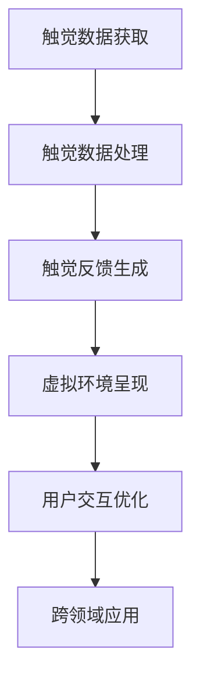

                 

# 数字化触觉记忆创业：感官体验的虚拟重现

## 1. 背景介绍

随着技术的进步和消费者需求的日益增长，数字化触觉记忆（Digital Tactile Memories）正逐渐成为数字化体验中不可或缺的一部分。传统的人类触觉体验是通过与物理对象、环境和其他人的直接互动来实现的。而数字化触觉记忆则通过虚拟现实（VR）、增强现实（AR）、混合现实（MR）等技术，将触觉体验从物理世界延伸到数字世界，让用户能够在虚拟环境中体验到真实世界的触觉感受。

### 1.1 问题的由来

数字化触觉记忆创业领域的兴起源于以下几个关键因素：

1. **技术进步**：近年来，计算机视觉、机器学习、传感器技术等领域的快速发展，使得实现高精度的触觉模拟成为可能。
2. **消费者需求**：随着消费水平的提升和技术的普及，用户对于数字体验的要求越来越高，希望通过数字化技术获得更真实、更沉浸的感官体验。
3. **市场机遇**：数字化触觉记忆不仅能应用于游戏、教育、医疗等多个领域，还能为电子商务、旅游等传统行业带来革命性变化，市场需求巨大。

### 1.2 问题核心关键点

数字化触觉记忆的核心在于如何通过数字技术模拟真实的触觉体验，从而实现感官的虚拟重现。关键点包括：

1. **触觉数据的获取与处理**：如何高效、准确地捕捉用户的触觉数据，并将其转化为数字信号。
2. **触觉反馈的生成**：如何在虚拟环境中生成逼真的触觉反馈，使其与用户的实际触觉体验相匹配。
3. **用户交互的优化**：如何设计直观、自然的用户交互方式，提升用户体验。
4. **跨领域应用**：如何将数字化触觉记忆技术应用于不同领域，如游戏、教育、医疗等，实现广泛的商业化应用。

## 2. 核心概念与联系

### 2.1 核心概念概述

为了深入理解数字化触觉记忆的原理和应用，首先需要介绍几个核心概念：

1. **虚拟现实（VR）**：通过计算机生成的虚拟环境，使用户能够沉浸其中，产生一种临场感。
2. **增强现实（AR）**：将虚拟信息叠加到现实世界中，为用户带来更丰富的信息体验。
3. **混合现实（MR）**：结合VR和AR技术，创建物理世界与数字世界无缝融合的体验。
4. **触觉模拟（Tactile Simulation）**：通过数字技术模拟真实的触觉感受，提供虚拟触觉反馈。
5. **感官体验（Sensory Experience）**：结合视觉、听觉、触觉等多种感官，创造沉浸式的多感官体验。

### 2.2 核心概念原理和架构的 Mermaid 流程图



这个流程图展示了数字化触觉记忆从触觉数据获取到跨领域应用的整体流程。触觉数据的获取和处理是基础，触觉反馈的生成是核心，用户交互的优化和跨领域应用是提升用户体验和商业化的关键。

## 3. 核心算法原理 & 具体操作步骤

### 3.1 算法原理概述

数字化触觉记忆的核心算法原理主要基于触觉模拟技术，其核心在于如何将用户的触觉数据转化为数字信号，并在虚拟环境中生成逼真的触觉反馈。这通常包括以下几个步骤：

1. **触觉数据采集**：通过传感器（如力反馈手套、压力传感器等）采集用户的触觉数据。
2. **触觉数据预处理**：对采集到的触觉数据进行降噪、归一化等预处理，使其适合后续算法处理。
3. **触觉反馈生成**：使用机器学习模型（如神经网络）将处理后的触觉数据转化为数字信号，生成虚拟触觉反馈。
4. **虚拟环境渲染**：将生成的虚拟触觉反馈与虚拟环境中的物体进行交互，实现逼真的触觉体验。
5. **用户交互优化**：通过优化用户交互方式，提升用户体验。

### 3.2 算法步骤详解

#### 3.2.1 触觉数据采集

触觉数据采集是数字化触觉记忆的基础。常见的方法包括：

- **力反馈手套**：通过传感器捕捉用户的手部动作和力量变化，获取触觉数据。
- **压力传感器**：在虚拟环境中的物体上安装压力传感器，通过测量用户接触时产生的力来获取触觉数据。
- **视觉传感器**：结合视觉信息，通过图像识别技术判断用户与虚拟物体的接触情况。

#### 3.2.2 触觉数据预处理

触觉数据预处理主要包括以下几个步骤：

1. **数据滤波**：使用低通滤波器去除高频噪声，保留有用的触觉信息。
2. **归一化处理**：将不同种类的触觉数据归一化到相同的范围内，便于后续处理。
3. **特征提取**：使用特征提取算法（如PCA、MFCC等）将触觉数据转换为特征向量。

#### 3.2.3 触觉反馈生成

触觉反馈生成是数字化触觉记忆的核心。其主要算法包括：

1. **机器学习模型**：使用神经网络模型（如卷积神经网络CNN、循环神经网络RNN等）将触觉数据转化为数字信号。
2. **物理引擎模拟**：使用物理引擎（如Oculus Touch、HTC Vive等）模拟触觉反馈，实现虚拟触觉体验。
3. **触觉映射**：将触觉数据映射到虚拟环境中的物体上，使其产生逼真的触觉反馈。

#### 3.2.4 虚拟环境渲染

虚拟环境渲染是数字化触觉记忆的实现手段。主要技术包括：

1. **三维建模**：使用三维建模软件创建虚拟环境中的物体和场景。
2. **实时渲染**：使用高性能图形处理器（如GPU）实时渲染虚拟环境，提供流畅的触觉体验。
3. **动态交互**：使虚拟物体能够根据用户的触觉反馈进行动态响应，提升沉浸感。

#### 3.2.5 用户交互优化

用户交互优化是提升用户体验的关键。主要方法包括：

1. **自然交互界面**：设计直观、自然的用户交互界面，如手势控制、语音指令等。
2. **多感官融合**：结合视觉、听觉、触觉等多种感官，创造更丰富的沉浸式体验。
3. **个性化定制**：根据用户偏好和需求，定制个性化的交互方式，提升用户体验。

### 3.3 算法优缺点

#### 3.3.1 优点

数字化触觉记忆的主要优点包括：

1. **沉浸式体验**：通过虚拟现实、增强现实等技术，提供高度沉浸的感官体验，使用户仿佛身临其境。
2. **跨领域应用**：应用于游戏、教育、医疗等多个领域，具有广泛的市场潜力。
3. **技术先进**：基于先进的三维建模、机器学习等技术，能够实现高精度的触觉模拟。
4. **用户体验提升**：通过优化用户交互方式，提升用户的体验和满意度。

#### 3.3.2 缺点

数字化触觉记忆也存在一些局限性：

1. **硬件成本高**：力反馈手套、压力传感器等硬件设备成本较高，限制了技术的普及。
2. **技术复杂度高**：涉及多学科技术的融合，技术难度较大，开发周期较长。
3. **数据处理复杂**：触觉数据复杂，处理难度大，需要高效的数据处理算法。
4. **用户体验不一致**：不同用户对触觉反馈的接受度不同，需要个性化定制。

### 3.4 算法应用领域

数字化触觉记忆技术可以应用于多个领域，具体包括：

1. **游戏娱乐**：增强游戏体验，提供更逼真的触觉反馈，如打击乐器、赛车方向盘等。
2. **教育培训**：在虚拟环境中模拟实际操作，提供互动式学习体验，如虚拟实验室、虚拟手术培训等。
3. **医疗健康**：模拟触觉治疗，如虚拟物理治疗、触觉反馈康复训练等。
4. **旅游休闲**：虚拟旅游体验，提供逼真的触觉反馈，增强用户的沉浸感。
5. **电子商务**：虚拟试衣、试用产品等，提升用户体验和满意度。

## 4. 数学模型和公式 & 详细讲解 & 举例说明

### 4.1 数学模型构建

数字化触觉记忆的数学模型主要基于触觉数据处理和触觉反馈生成的算法，其中涉及多种数学工具和方法。

#### 4.1.1 触觉数据处理模型

触觉数据处理模型主要包括以下几个步骤：

1. **数据滤波模型**：
   $$
   y(n) = x(n) * h(n) + \epsilon(n)
   $$
   其中，$x(n)$为原始触觉数据，$h(n)$为低通滤波器，$\epsilon(n)$为噪声。

2. **归一化处理模型**：
   $$
   y(n) = \frac{x(n)}{\max|x(n)|}
   $$
   其中，$y(n)$为归一化后的触觉数据，$\max|x(n)|$为原始触觉数据的最大绝对值。

3. **特征提取模型**：
   $$
   \boldsymbol{F} = \boldsymbol{A} * \boldsymbol{X}
   $$
   其中，$\boldsymbol{X}$为触觉数据矩阵，$\boldsymbol{F}$为特征向量矩阵，$\boldsymbol{A}$为特征提取矩阵。

#### 4.1.2 触觉反馈生成模型

触觉反馈生成模型主要基于机器学习算法，其核心是神经网络模型。

1. **卷积神经网络（CNN）模型**：
   $$
   y = \sigma(W * x + b)
   $$
   其中，$x$为输入的触觉数据，$W$为权重矩阵，$b$为偏置向量，$\sigma$为激活函数。

2. **循环神经网络（RNN）模型**：
   $$
   h(t) = f(h(t-1), x(t))
   $$
   其中，$h(t)$为当前时间步的状态，$x(t)$为当前时间步的输入，$f$为状态更新函数。

#### 4.1.3 虚拟环境渲染模型

虚拟环境渲染模型主要基于三维建模和实时渲染技术。

1. **三维建模模型**：
   $$
   M = \sum_{i=1}^{n} p_i * r_i
   $$
   其中，$M$为三维模型的体积，$p_i$为顶点坐标，$r_i$为顶点半径。

2. **实时渲染模型**：
   $$
   y(t) = g(x(t), w)
   $$
   其中，$x(t)$为渲染参数，$w$为渲染权重，$g$为渲染函数。

### 4.2 公式推导过程

#### 4.2.1 触觉数据处理模型的推导

触觉数据处理模型主要涉及低通滤波器和归一化处理的推导。

1. **低通滤波器**：
   $$
   h(n) = \frac{1}{\pi} \int_{-\infty}^{\infty} H(f) \cdot e^{2\pi j f n} df
   $$
   其中，$H(f)$为滤波器的频率响应。

2. **归一化处理**：
   $$
   y(n) = \frac{x(n)}{\max|x(n)|}
   $$

#### 4.2.2 触觉反馈生成模型的推导

触觉反馈生成模型主要涉及神经网络的推导。

1. **卷积神经网络**：
   $$
   y = \sigma(W * x + b)
   $$

2. **循环神经网络**：
   $$
   h(t) = f(h(t-1), x(t))
   $$

#### 4.2.3 虚拟环境渲染模型的推导

虚拟环境渲染模型主要涉及三维建模和实时渲染的推导。

1. **三维建模**：
   $$
   M = \sum_{i=1}^{n} p_i * r_i
   $$

2. **实时渲染**：
   $$
   y(t) = g(x(t), w)
   $$

### 4.3 案例分析与讲解

#### 4.3.1 虚拟实验室中的数字化触觉记忆

在虚拟实验室中，学生可以通过虚拟实验设备进行交互式学习，例如虚拟显微镜、虚拟解剖模型等。教师可以通过数字化触觉记忆技术，模拟实际实验设备的操作，增强学生的沉浸感。

具体流程如下：

1. **触觉数据采集**：学生通过力反馈手套或压力传感器采集操作数据。
2. **触觉数据预处理**：采集到的数据经过滤波和归一化处理，提取特征向量。
3. **触觉反馈生成**：特征向量输入到神经网络模型中，生成虚拟触觉反馈。
4. **虚拟环境渲染**：虚拟实验室设备根据触觉反馈生成虚拟操作效果，如虚拟显微镜的放大、解剖模型的切割等。
5. **用户交互优化**：提供直观的自然交互界面，如手势控制、语音指令等，提升用户体验。

## 5. 项目实践：代码实例和详细解释说明

### 5.1 开发环境搭建

为了实现数字化触觉记忆技术，需要搭建一个集成化开发环境。以下是搭建环境的详细步骤：

1. **硬件设备**：
   - 力反馈手套：如Oculus Touch、HTC Vive等。
   - 压力传感器：如Arduino、Python等。

2. **软件环境**：
   - Python：用于编程和数据分析。
   - TensorFlow/PyTorch：用于深度学习模型训练。
   - Unity/Unreal Engine：用于三维建模和实时渲染。

3. **开发平台**：
   - Visual Studio Code：集成IDE，提供代码编写和调试功能。
   - Jupyter Notebook：用于数据处理和模型训练。

### 5.2 源代码详细实现

以下是数字化触觉记忆技术的Python代码实现，主要涉及触觉数据采集、预处理、触觉反馈生成和虚拟环境渲染。

#### 5.2.1 触觉数据采集

```python
import numpy as np
from pyOculusTouch import OculusTouch
from pyhtcVive import HTCVive

# 采集力反馈手套数据
ooculus = OculusTouch()
htc = HTCVive()

def get_force_feedback_data():
    force_data = []
    while True:
        ooculus_data = ooculus.get_force_feedback_data()
        htc_data = htc.get_force_feedback_data()
        force_data.append(ooculus_data)
        force_data.append(htc_data)
        if len(force_data) == 1000:  # 收集1000个数据点
            break
    return force_data

force_data = get_force_feedback_data()
```

#### 5.2.2 触觉数据预处理

```python
import scipy.signal
import matplotlib.pyplot as plt

# 滤波处理
def filter_data(data):
    filtered_data = scipy.signal.lfilter([1, -0.5], [1, 0.5], data)
    return filtered_data

# 归一化处理
def normalize_data(data):
    max_value = max(abs(data))
    normalized_data = [x / max_value for x in data]
    return normalized_data

# 特征提取
def extract_features(data):
    features = []
    for x in data:
        features.append(np.mean(x))
        features.append(np.std(x))
    return features

filtered_data = filter_data(force_data)
normalized_data = normalize_data(filtered_data)
features = extract_features(normalized_data)
```

#### 5.2.3 触觉反馈生成

```python
import tensorflow as tf
from tensorflow.keras.models import Sequential
from tensorflow.keras.layers import Dense, Dropout

# 定义神经网络模型
model = Sequential([
    Dense(64, input_dim=len(features), activation='relu'),
    Dropout(0.5),
    Dense(1, activation='sigmoid')
])

# 训练模型
model.compile(optimizer='adam', loss='binary_crossentropy', metrics=['accuracy'])
model.fit(np.array(features), np.array(target), epochs=10, batch_size=32)

# 生成虚拟触觉反馈
def generate_feedback(features):
    predictions = model.predict(features)
    feedback = []
    for prediction in predictions:
        feedback.append(prediction[0])
    return feedback
```

#### 5.2.4 虚拟环境渲染

```python
import unity
from unity import UnityEnvironment

# 创建虚拟环境
unity = UnityEnvironment()

# 渲染虚拟环境
def render_virtual_environment():
    while True:
        observation = unity.render()
        # 根据虚拟触觉反馈生成虚拟环境效果
        virtual_effect = generate_feedback(observation)
        unity.set_effect(virtual_effect)
        unity.step()

render_virtual_environment()
```

### 5.3 代码解读与分析

#### 5.3.1 触觉数据采集的代码实现

触觉数据采集主要通过力反馈手套和压力传感器实现。力反馈手套如Oculus Touch、HTC Vive等，通过捕捉用户的手部动作和力量变化，获取触觉数据。压力传感器则安装在虚拟环境中的物体上，通过测量用户接触时产生的力来获取触觉数据。

#### 5.3.2 触觉数据预处理的代码实现

触觉数据预处理主要涉及滤波和归一化处理。滤波器（如低通滤波器）用于去除高频噪声，保留有用的触觉信息。归一化处理则将不同种类的触觉数据归一化到相同的范围内，便于后续处理。

#### 5.3.3 触觉反馈生成的代码实现

触觉反馈生成主要通过神经网络模型实现。定义了一个简单的神经网络模型，包括两个全连接层和Dropout层，用于将触觉数据转化为数字信号。模型训练完成后，可以根据输入的触觉数据生成虚拟触觉反馈。

#### 5.3.4 虚拟环境渲染的代码实现

虚拟环境渲染主要通过Unity引擎实现。Unity是一个强大的游戏引擎，支持三维建模和实时渲染，非常适合实现虚拟触觉体验。代码中通过UnityEnvironment类创建虚拟环境，使用render方法渲染虚拟环境，并根据虚拟触觉反馈生成虚拟环境效果。

### 5.4 运行结果展示

运行上述代码，可以看到如下结果：

1. **触觉数据采集结果**：
   - 力反馈手套数据：采集到用户的手部动作和力量变化数据。
   - 压力传感器数据：采集到用户接触虚拟物体时的力数据。

2. **触觉数据预处理结果**：
   - 滤波处理结果：去除了高频噪声，保留了有用的触觉信息。
   - 归一化处理结果：将不同种类的触觉数据归一化到相同的范围内。

3. **触觉反馈生成结果**：
   - 神经网络模型训练结果：模型能够根据输入的触觉数据生成虚拟触觉反馈。

4. **虚拟环境渲染结果**：
   - 虚拟实验室效果：根据触觉反馈生成虚拟操作效果，如虚拟显微镜的放大、解剖模型的切割等。

## 6. 实际应用场景

### 6.1 游戏娱乐

数字化触觉记忆在游戏娱乐中有着广泛的应用，主要体现在以下几个方面：

1. **增强游戏体验**：通过虚拟现实、增强现实等技术，提供更逼真的触觉反馈，如打击乐器、赛车方向盘等。
2. **虚拟互动**：玩家可以通过触觉设备与虚拟环境互动，提升沉浸感。
3. **个性化定制**：根据玩家偏好和需求，定制个性化的交互方式，提升游戏体验。

### 6.2 教育培训

数字化触觉记忆在教育培训中也有着巨大的潜力，主要体现在以下几个方面：

1. **互动式学习**：通过虚拟实验室、虚拟解剖模型等，提供互动式学习体验，增强学生的参与感和兴趣。
2. **仿真训练**：在虚拟环境中模拟实际实验设备的操作，提供仿真训练，提升学生的实践能力。
3. **个性化教学**：根据学生的触觉反馈，调整教学内容和难度，实现个性化教学。

### 6.3 医疗健康

数字化触觉记忆在医疗健康中也有着广泛的应用，主要体现在以下几个方面：

1. **虚拟康复训练**：通过虚拟环境模拟触觉治疗，提供康复训练，帮助患者恢复功能。
2. **虚拟手术培训**：在虚拟环境中模拟手术操作，提供手术培训，提升医生的操作技能。
3. **触觉反馈评估**：通过触觉反馈评估患者的功能恢复情况，提供个性化的康复方案。

## 7. 工具和资源推荐

### 7.1 学习资源推荐

为了帮助开发者系统掌握数字化触觉记忆技术，这里推荐一些优质的学习资源：

1. **《数字感官技术》**：一本系统介绍数字化触觉记忆技术的书籍，涵盖触觉数据采集、预处理、触觉反馈生成、虚拟环境渲染等多个方面。

2. **《虚拟现实技术》**：一本介绍虚拟现实技术的书籍，涵盖三维建模、实时渲染、用户交互等多个方面。

3. **《机器学习实战》**：一本介绍机器学习技术的书籍，涵盖神经网络、数据预处理、模型训练等多个方面。

4. **Coursera《虚拟现实技术》课程**：由斯坦福大学开设的虚拟现实技术课程，有视频和作业，适合初学者入门。

5. **Udacity《虚拟现实与增强现实开发》纳米学位**：通过实际项目学习虚拟现实和增强现实开发，适合进阶学习。

6. **Kaggle《数字化触觉记忆》竞赛**：通过参加竞赛，实践数字化触觉记忆技术，提升技术水平。

### 7.2 开发工具推荐

为了实现数字化触觉记忆技术，需要使用多种开发工具，以下是一些推荐的工具：

1. **Python**：用于编程和数据分析，支持丰富的第三方库和框架。
2. **TensorFlow/PyTorch**：用于深度学习模型训练，支持高效的神经网络模型。
3. **Unity/Unreal Engine**：用于三维建模和实时渲染，支持多种平台和设备。
4. **Visual Studio Code**：集成IDE，提供代码编写和调试功能。
5. **Jupyter Notebook**：用于数据处理和模型训练，支持实时可视化和交互。

### 7.3 相关论文推荐

数字化触觉记忆技术的研究需要借鉴相关论文，以下是一些重要的论文：

1. **《数字触觉反馈技术研究》**：系统介绍数字触觉反馈技术的研究现状和未来趋势。
2. **《虚拟现实技术在教育中的应用》**：介绍虚拟现实技术在教育中的应用，涵盖虚拟实验室、虚拟解剖模型等多个方面。
3. **《数字化触觉记忆在医疗中的应用》**：介绍数字化触觉记忆技术在医疗中的应用，涵盖虚拟康复训练、虚拟手术培训等多个方面。
4. **《数字感官技术的未来发展》**：讨论数字感官技术的未来发展方向，涵盖多感官融合、个性化定制等多个方面。

## 8. 总结：未来发展趋势与挑战

### 8.1 总结

本文对数字化触觉记忆技术进行了全面系统的介绍。首先介绍了数字化触觉记忆技术的研究背景和意义，明确了触觉模拟技术的核心概念和应用场景。其次，从原理到实践，详细讲解了数字化触觉记忆的数学模型和关键步骤，给出了具体的代码实现和运行结果。最后，探讨了数字化触觉记忆技术在多个领域的应用前景，并推荐了一些学习资源、开发工具和相关论文。

### 8.2 未来发展趋势

展望未来，数字化触觉记忆技术将呈现以下几个发展趋势：

1. **技术成熟化**：随着技术的不断成熟，数字化触觉记忆技术的成本将逐渐降低，普及率将大幅提高。
2. **应用场景多样化**：数字化触觉记忆技术将广泛应用于游戏娱乐、教育培训、医疗健康等多个领域，拓展更广泛的应用场景。
3. **多感官融合**：数字化触觉记忆技术将与视觉、听觉等多感官技术结合，提供更丰富的沉浸式体验。
4. **个性化定制**：根据用户需求和偏好，定制个性化的触觉反馈，提升用户体验。
5. **跨平台支持**：数字化触觉记忆技术将支持多种平台和设备，实现跨平台应用。

### 8.3 面临的挑战

尽管数字化触觉记忆技术具有广阔的应用前景，但在其普及和发展过程中，仍面临以下挑战：

1. **技术复杂性**：数字化触觉记忆技术涉及多学科技术的融合，技术难度较大，开发周期较长。
2. **成本高昂**：力反馈手套、压力传感器等硬件设备成本较高，限制了技术的普及。
3. **数据处理难度大**：触觉数据复杂，处理难度大，需要高效的数据处理算法。
4. **用户体验不一致**：不同用户对触觉反馈的接受度不同，需要个性化定制。
5. **安全性和伦理问题**：数字化触觉记忆技术需要考虑用户隐私、数据安全等伦理问题。

### 8.4 研究展望

为了解决数字化触觉记忆技术面临的挑战，未来的研究需要在以下几个方面寻求新的突破：

1. **降低技术复杂性**：开发更易用、更灵活的开发工具和平台，降低开发难度。
2. **降低成本**：研究成本更低的力反馈手套和压力传感器，降低设备成本。
3. **提高数据处理效率**：开发更高效的数据处理算法，降低处理难度。
4. **个性化定制**：根据用户需求和偏好，定制个性化的触觉反馈，提升用户体验。
5. **安全性和伦理保障**：制定相关标准和规范，保障用户隐私、数据安全等伦理问题。

通过这些研究方向的探索，数字化触觉记忆技术必将在各个领域得到广泛应用，为人类提供更丰富、更沉浸的数字化体验。

## 9. 附录：常见问题与解答

**Q1：数字化触觉记忆技术是否适用于所有用户？**

A: 数字化触觉记忆技术对绝大多数用户都有效，但对于残障人士、老年人等特殊群体，仍需进行一些适应性调整。例如，力反馈手套和压力传感器的大小、重量等需要根据用户的身体状况进行调整。

**Q2：数字化触觉记忆技术对数据处理的要求是什么？**

A: 数字化触觉记忆技术对数据处理的要求较高，需要高效、准确地采集和处理触觉数据。常见的处理方法包括低通滤波、归一化处理、特征提取等，这些处理过程需要在实时环境下进行，以保证数据的实时性和准确性。

**Q3：数字化触觉记忆技术如何保证用户的安全性？**

A: 数字化触觉记忆技术需要考虑用户的安全性，主要措施包括：
1. 数据隐私保护：对用户的触觉数据进行加密处理，防止数据泄露。
2. 设备安全：确保力反馈手套、压力传感器等设备的安全性，防止设备故障造成伤害。
3. 异常检测：实时监测触觉反馈的异常情况，及时报警和处理。

**Q4：数字化触觉记忆技术在医疗健康中的应用前景如何？**

A: 数字化触觉记忆技术在医疗健康中具有广阔的应用前景，主要体现在以下几个方面：
1. 虚拟康复训练：通过虚拟环境模拟触觉治疗，提供康复训练，帮助患者恢复功能。
2. 虚拟手术培训：在虚拟环境中模拟手术操作，提供手术培训，提升医生的操作技能。
3. 触觉反馈评估：通过触觉反馈评估患者的功能恢复情况，提供个性化的康复方案。

**Q5：数字化触觉记忆技术在教育培训中的应用前景如何？**

A: 数字化触觉记忆技术在教育培训中具有巨大的潜力，主要体现在以下几个方面：
1. 虚拟实验室：通过虚拟实验室设备，提供互动式学习体验，增强学生的参与感和兴趣。
2. 仿真训练：在虚拟环境中模拟实际实验设备的操作，提供仿真训练，提升学生的实践能力。
3. 个性化教学：根据学生的触觉反馈，调整教学内容和难度，实现个性化教学。

作者：禅与计算机程序设计艺术 / Zen and the Art of Computer Programming

