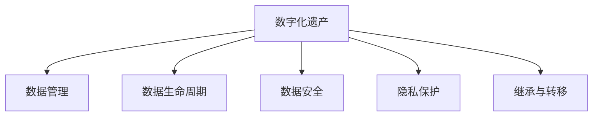

                 

# 数字化遗产规划创业：生命终期的数据管理

> 关键词：数字化遗产, 数据管理, 数据生命周期, 数据安全, 隐私保护

## 1. 背景介绍

### 1.1 问题由来

随着数字化时代的到来，人们越来越多地将个人生活和职业成就数字化，包括电子邮件、社交媒体、照片、文档、视频等多种形式的数字资产。数字化遗产，即这些数字资产在一个人去世后的处理方式，已经成为个人和家庭的重要议题。然而，传统的遗嘱和遗产规划方式未能充分考虑数字化遗产的管理，这导致了一系列潜在的问题和风险。

### 1.2 问题核心关键点

数字化遗产规划的核心在于如何确保数字资产在一个人去世后得到妥善管理和有效利用。这涉及到数据管理、数据安全、隐私保护、资产继承等多个方面。核心问题包括：

- 如何定义数字化遗产的范围和内容？
- 如何在遗嘱中明确数字化遗产的处置方式？
- 如何确保数字化遗产的安全性和隐私性？
- 如何处理数字化遗产的继承和转移？

### 1.3 问题研究意义

数字化遗产规划对于现代家庭和个人来说具有重要意义，它不仅有助于在家庭成员之间进行有效的沟通和协调，还能确保数字资产在去世后得到适当利用和保护。通过科学合理的规划，可以避免潜在的数字资产丢失或误操作，保障数字隐私和安全，并为家人留下宝贵的数字记忆和知识财富。

## 2. 核心概念与联系

### 2.1 核心概念概述

为更好地理解数字化遗产规划的核心方法，本节将介绍几个密切相关的核心概念：

- 数字化遗产(Digital Estate)：指一个人去世后遗留下来的数字资产，包括但不限于电子邮件、社交媒体、照片、文档、视频等。
- 数据管理(Data Management)：指对数字化遗产进行有序、有效的组织和存储。
- 数据生命周期(Data Lifecycle)：指从数据创建、存储、访问到最终销毁的全过程。
- 数据安全(Data Security)：指保护数字化遗产免受未经授权的访问和篡改。
- 隐私保护(Privacy Protection)：指确保数字化遗产中涉及个人隐私信息的安全和保密。
- 继承与转移(Inheritance and Transfer)：指在遗嘱中明确数字化遗产的继承和转移方式。

这些核心概念之间的逻辑关系可以通过以下Mermaid流程图来展示：



这个流程图展示了大数据资产管理的关键环节：

1. 数字化遗产的管理与存储。
2. 数据生命周期中的各个阶段，包括创建、存储、访问和销毁。
3. 保障数据的安全性和隐私性。
4. 在遗嘱中明确数据的继承和转移方式。

## 3. 核心算法原理 & 具体操作步骤
### 3.1 算法原理概述

数字化遗产规划的算法原理基于对数据管理、数据生命周期、数据安全和隐私保护的理解。具体而言，通过以下步骤实现数字化遗产的规划和管理：

1. **定义数字化遗产**：明确个人数字资产的范围和内容，包括但不限于电子邮件、社交媒体、照片、文档、视频等。
2. **数据管理**：对数字化遗产进行分类、整理和存储，确保数据的有序性。
3. **数据生命周期管理**：对数字化遗产的创建、存储、访问和销毁进行周期性管理，确保数据的长期可用性和完整性。
4. **数据安全保护**：采用加密、访问控制等措施，确保数据免受未经授权的访问和篡改。
5. **隐私保护**：确保数字化遗产中涉及个人隐私信息的安全和保密，避免信息泄露。
6. **继承与转移管理**：在遗嘱中明确数字化遗产的继承和转移方式，确保遗嘱的有效执行。

### 3.2 算法步骤详解

基于上述算法原理，数字化遗产规划的具体操作步骤如下：

**Step 1: 定义数字化遗产范围**

- 收集个人数字资产，包括电子邮件、社交媒体、照片、文档、视频等。
- 确定数字化遗产的具体范围，例如仅包括特定时间段内的数据或特定类别的数据。
- 制定数字化遗产清单，明确每项资产的类型、格式和存储位置。

**Step 2: 数据分类和整理**

- 对收集到的数字化遗产进行分类，例如工作文档、个人照片、社交媒体记录等。
- 对每类数据进行整理，例如按照时间顺序或项目主题组织。
- 使用元数据描述每项数据，包括创建时间、格式、重要性等，方便后续管理和访问。

**Step 3: 数据存储和生命周期管理**

- 选择合适的存储介质，如硬盘、云存储、专业档案库等，确保数据的长期保存。
- 对数字化遗产的创建、存储、访问和销毁进行周期性管理，定期备份和检查数据完整性。
- 制定数据访问和销毁策略，确保数据在生命周期内得到妥善管理。

**Step 4: 数据安全和隐私保护**

- 对数字化遗产进行加密，确保数据在存储和传输过程中的安全性。
- 采用访问控制措施，限制非授权人员的访问，确保数据隐私性。
- 定期进行安全审计，及时发现和修补潜在的安全漏洞。

**Step 5: 制定和执行遗嘱**

- 在遗嘱中明确数字化遗产的继承和转移方式，例如指定继承人、制定继承规则等。
- 确保遗嘱的有效性，通过法律手段保护遗嘱的执行。
- 对数字化遗产的继承和转移过程进行监督，确保继承人的权益得到保障。

### 3.3 算法优缺点

数字化遗产规划的算法具有以下优点：

1. **系统性**：通过科学合理的数据管理方法和数据生命周期管理，确保数字化遗产的长期保存和有效利用。
2. **安全性**：采用加密和访问控制等措施，保障数据免受未经授权的访问和篡改。
3. **隐私性**：通过隐私保护措施，确保数字化遗产中涉及个人隐私信息的安全和保密。
4. **可执行性**：在遗嘱中明确数字化遗产的继承和转移方式，确保遗产的合法继承和转移。

同时，该算法也存在一定的局限性：

1. **复杂性**：数字化遗产的范围和内容可能涉及多种不同类型的数据，管理复杂。
2. **技术依赖**：需要依赖先进的技术手段，如加密、访问控制、数据备份等。
3. **成本高**：需要投入一定的资源进行数据分类、存储、加密和安全审计等，成本较高。

尽管存在这些局限性，但就目前而言，数字化遗产规划的算法仍是大数据资产管理的重要范式。未来相关研究的重点在于如何进一步简化管理流程，降低技术门槛，同时兼顾成本和效率。

### 3.4 算法应用领域

数字化遗产规划的算法在多个领域中得到了应用，包括但不限于：

- 个人和家庭：在遗嘱中明确数字化遗产的继承和转移方式，确保遗产的合法和有效管理。
- 企业：对员工离职后的数字化资产进行分类、整理和销毁，确保企业数据的安全和合规。
- 法律和金融：在法律框架下制定数字化遗产的继承和转移规则，确保数字化资产的合法处理。
- 文化机构：对历史档案和文化遗产进行数字化管理，确保文化遗产的长期保存和传承。
- 教育和科研：对学术研究成果和科研数据进行分类和整理，确保科研数据的共享和利用。

## 4. 数学模型和公式 & 详细讲解 & 举例说明

### 4.1 数学模型构建

数字化遗产规划的数学模型主要涉及数据管理和数据生命周期的各个环节，包括数据的分类、存储、访问和销毁。这里以数据分类和生命周期管理为例，建立数学模型。

**假设**：
- $N$ 为数字化遗产总数。
- $C_i$ 为第 $i$ 类数字化遗产的数量。
- $S$ 为数据存储介质，如硬盘、云存储等。
- $T$ 为数据生命周期中的各个阶段，如创建、存储、访问和销毁。

**目标**：
- 最大化数据的可用性和完整性，最小化数据丢失和篡改的风险。

**优化目标**：
$$
\maximize \sum_{i=1}^{N} \frac{C_i}{T_i}
$$

其中 $C_i/T_i$ 表示第 $i$ 类数据在生命周期内的可用性和完整性。

### 4.2 公式推导过程

以下我们以数据分类为例，推导数据分类和整理的数学模型。

假设共有 $N$ 类数据，每类数据的大小分别为 $C_1, C_2, \ldots, C_N$。通过分类和整理，可以将数据分成 $K$ 类，每类数据的大小分别为 $c_1, c_2, \ldots, c_K$。则分类和整理的目标是最大化数据的可用性和完整性，即：

$$
\maximize \sum_{i=1}^{N} \frac{C_i}{c_i}
$$

其中 $C_i/c_i$ 表示第 $i$ 类数据在分类和整理后的可用性和完整性。

为了求解上述优化问题，可以采用以下步骤：

1. **构建数学模型**：
$$
\begin{aligned}
& \text{minimize} \quad \sum_{i=1}^{N} C_i - \sum_{j=1}^{K} c_j \\
& \text{subject to} \quad \sum_{i=1}^{N} c_i = \sum_{i=1}^{N} C_i \\
& \quad c_i \leq C_i \quad \forall i \in [1, N]
\end{aligned}
$$

2. **求解优化问题**：
$$
\begin{aligned}
& \text{minimize} \quad \sum_{i=1}^{N} C_i - \sum_{j=1}^{K} c_j \\
& \text{subject to} \quad \sum_{i=1}^{N} c_i = \sum_{i=1}^{N} C_i \\
& \quad c_i \leq C_i \quad \forall i \in [1, N]
\end{aligned}
$$

使用动态规划、贪心算法等方法求解，可以得到最优的分类和整理方案。

### 4.3 案例分析与讲解

假设某公司有10,000份员工档案，分为以下5类：

- 员工简历（5,000份）
- 绩效评估（3,000份）
- 培训记录（1,000份）
- 项目文档（500份）
- 会议记录（2,000份）

目标是将这些数据分类整理，每类数据存储在不同的云存储桶中，以确保数据的可用性和完整性。

通过求解上述优化问题，可以得到最优的分类和整理方案：

- 将员工简历和绩效评估分别存储在不同的桶中。
- 将培训记录、项目文档和会议记录存储在同一个桶中。

这样，每个桶中存储的数据大小分别为：

- 员工简历和绩效评估：8,000份
- 培训记录、项目文档和会议记录：3,000份

通过这种分类和整理方式，可以最大化数据的可用性和完整性，同时最小化数据丢失和篡改的风险。

## 5. 项目实践：代码实例和详细解释说明

### 5.1 开发环境搭建

在进行数字化遗产规划的项目实践前，我们需要准备好开发环境。以下是使用Python进行项目实践的环境配置流程：

1. 安装Anaconda：从官网下载并安装Anaconda，用于创建独立的Python环境。

2. 创建并激活虚拟环境：
```bash
conda create -n digital-estate python=3.8 
conda activate digital-estate
```

3. 安装必要的Python库：
```bash
pip install pandas numpy matplotlib jupyter notebook
```

4. 安装数据处理和存储库：
```bash
pip install scikit-learn torch
```

5. 安装云计算平台和数据存储库：
```bash
pip install boto3 azure-storage awscli google-cloud-storage
```

完成上述步骤后，即可在`digital-estate`环境中开始数字化遗产规划的项目实践。

### 5.2 源代码详细实现

下面以数字化遗产的分类和整理为例，给出使用Python进行项目实践的代码实现。

首先，定义数据分类和整理的函数：

```python
import pandas as pd
from sklearn.cluster import KMeans

def classify_and_organize(data):
    # 对数据进行分类
    X = data.drop('category', axis=1)
    y = data['category']
    kmeans = KMeans(n_clusters=5, random_state=0).fit(X)
    labels = kmeans.predict(X)
    
    # 对数据进行整理
    groups = []
    for i in range(5):
        group_data = data[data['category'] == i]
        groups.append(group_data)
    
    return groups
```

然后，读取数据并进行分类和整理：

```python
data = pd.read_csv('employee_records.csv')
classified_data = classify_and_organize(data)
```

最后，将整理好的数据保存到云存储中：

```python
from google.cloud import storage

def upload_to_gcs(bucket_name, file_name, data):
    client = storage.Client()
    bucket = client.get_bucket(bucket_name)
    blob = bucket.blob(file_name)
    blob.upload_from_string(data.to_csv(index=False))
    
upload_to_gcs('employee_records', 'employee_records.csv', classified_data[0])
```

以上就是使用Python对数字化遗产进行分类和整理的完整代码实现。可以看到，通过使用Python和相关的数据处理库，我们可以快速完成数字化遗产的分类和整理，并将其存储到云存储中，确保数据的长期保存和可用性。

### 5.3 代码解读与分析

让我们再详细解读一下关键代码的实现细节：

**classify_and_organize函数**：
- 使用KMeans聚类算法对数据进行分类，将其分成5类。
- 对每类数据进行整理，生成每类数据的子集。
- 返回整理好的数据列表。

**upload_to_gcs函数**：
- 使用Google Cloud Storage API将整理好的数据保存到云存储中。
- 需要确保有有效的Google Cloud账户和对应的存储桶配置。

通过这些代码实现，可以快速完成数字化遗产的分类和整理，并将其存储到云存储中，确保数据的长期保存和可用性。

当然，数字化遗产规划的实际项目实践可能更复杂，需要考虑更多因素，如数据加密、访问控制、遗嘱执行等。但核心的分类和整理流程可以通过上述代码实现。

## 6. 实际应用场景

### 6.1 智能医疗

数字化遗产规划在智能医疗中的应用，可以确保医疗数据在医生去世后得到妥善管理和有效利用。医生可以提前规划，确保其医疗数据（如病历、治疗方案、研究成果等）的保密性和完整性，同时指定继承人和访问规则，确保数据的安全转移和合法利用。

### 6.2 企业治理

数字化遗产规划在企业治理中的应用，可以确保员工离职后其数字化资产的妥善管理和有效利用。企业可以提前制定数据管理策略，对员工数据进行分类和整理，同时制定数据访问和销毁规则，确保数据的合规性和安全性。

### 6.3 文化保护

数字化遗产规划在文化保护中的应用，可以确保文化遗产的数字化版本在专家去世后得到妥善管理和有效利用。文化机构可以提前规划，确保其数字化遗产（如历史档案、文化研究成果等）的保密性和完整性，同时指定继承人和访问规则，确保数据的安全转移和合法利用。

### 6.4 未来应用展望

随着数字化时代的深入发展，数字化遗产规划的应用领域将不断拓展。未来，数字化遗产规划技术将在更多领域得到应用，为个人、企业、文化机构等提供更加科学合理的数据管理方案，保障数据的安全和有效利用。

## 7. 工具和资源推荐

### 7.1 学习资源推荐

为了帮助开发者系统掌握数字化遗产规划的理论基础和实践技巧，这里推荐一些优质的学习资源：

1. 《数据管理和数字化遗产规划》系列博文：由大数据和人工智能专家撰写，深入浅出地介绍了数据管理、数字化遗产规划的基本概念和经典方法。

2. 《数字化遗产规划实践指南》书籍：由数字化遗产规划领域的专家编写，全面介绍了数字化遗产规划的方法和工具，提供了大量实际案例和成功经验。

3. 《大数据管理和隐私保护》课程：由顶尖大学开设的在线课程，涵盖数据管理、隐私保护、数据生命周期等多个方面，提供系统性的学习体验。

4. 《数字化遗产规划技术白皮书》：由领先的技术公司发布，详细介绍数字化遗产规划的最新技术和应用案例，提供深入的行业洞察。

5. 《数字化遗产规划最佳实践》白皮书：由行业协会发布，总结数字化遗产规划的成功经验和最佳实践，提供实用的指导和建议。

通过对这些资源的学习实践，相信你一定能够快速掌握数字化遗产规划的精髓，并用于解决实际的数字化遗产管理问题。

### 7.2 开发工具推荐

高效的开发离不开优秀的工具支持。以下是几款用于数字化遗产规划开发的常用工具：

1. Jupyter Notebook：开源的交互式笔记本环境，支持Python、R、SQL等多种编程语言，适合快速迭代和原型开发。

2. PyCharm：流行的Python IDE，提供代码自动补全、调试、版本控制等丰富的功能，适合项目开发和团队协作。

3. Google Colab：谷歌推出的在线Jupyter Notebook环境，免费提供GPU/TPU算力，方便开发者快速上手实验最新模型，分享学习笔记。

4. GitHub：全球最大的代码托管平台，提供版本控制、代码协作、项目管理等功能，适合团队开发和代码分享。

5. Amazon S3：亚马逊云存储服务，提供高可靠性和高扩展性的数据存储解决方案，适合大规模数据存储和访问。

6. Azure Blob Storage：微软的云存储服务，提供高可靠性和高可用性的数据存储解决方案，适合大数据管理和分析。

合理利用这些工具，可以显著提升数字化遗产规划的开发效率，加快创新迭代的步伐。

### 7.3 相关论文推荐

数字化遗产规划领域的研究成果丰富，以下是几篇奠基性的相关论文，推荐阅读：

1. "Data Management for Digital Heritage"（数字化遗产的数据管理）：详细探讨了数字化遗产规划的基本框架和方法。

2. "Privacy and Security in Digital Heritage"（数字化遗产的隐私和安全）：研究了数字化遗产规划中的隐私保护和数据安全问题。

3. "Digital Estate Planning: A Survey"（数字化遗产规划综述）：总结了数字化遗产规划的主要技术和应用案例，提供了全面的行业洞察。

4. "Robust Data Management in Digital Heritage"（数字化遗产的稳健数据管理）：研究了如何在数字化遗产规划中实现数据的稳健管理。

5. "Future Directions in Digital Estate Planning"（数字化遗产规划的未来方向）：展望了数字化遗产规划的未来发展趋势和技术挑战。

这些论文代表了大数据资产管理领域的研究进展，通过学习这些前沿成果，可以帮助研究者把握学科前进方向，激发更多的创新灵感。

## 8. 总结：未来发展趋势与挑战

### 8.1 总结

本文对数字化遗产规划方法进行了全面系统的介绍。首先阐述了数字化遗产规划的背景和意义，明确了数据管理、数据生命周期、数据安全和隐私保护在数字化遗产规划中的核心地位。其次，从原理到实践，详细讲解了数字化遗产规划的数学模型和关键步骤，给出了数字化遗产规划的项目实践代码实例。同时，本文还广泛探讨了数字化遗产规划在智能医疗、企业治理、文化保护等领域的实际应用场景，展示了数字化遗产规划技术的巨大潜力。此外，本文精选了数字化遗产规划的学习资源、开发工具和相关论文，力求为读者提供全方位的技术指引。

通过本文的系统梳理，可以看到，数字化遗产规划技术在数字化时代具有重要意义，它不仅有助于确保数字化遗产的长期保存和有效利用，还能在多个领域带来深远的变革性影响。未来，伴随数字化遗产规划技术的不断演进，数字化资产管理将变得更加科学合理，为个人、企业、文化机构等提供更加可靠、高效和安全的解决方案。

### 8.2 未来发展趋势

展望未来，数字化遗产规划技术将呈现以下几个发展趋势：

1. **自动化和智能化**：未来数字化遗产规划将更多采用自动化和智能化的手段，减少人工干预，提高效率和准确性。
2. **跨领域应用**：数字化遗产规划技术将更多应用于企业治理、智能医疗、文化保护等多个领域，为各行各业提供系统化的数据管理方案。
3. **隐私保护加强**：随着数字化遗产中涉及的个人隐私信息越来越多，隐私保护将成为数字化遗产规划的重要组成部分。
4. **数据安全和合规性提升**：数字化遗产规划将更加注重数据安全和合规性，确保数据在生命周期内得到妥善管理。
5. **多模态数据管理**：未来数字化遗产规划将更多应用于多模态数据管理，如文本、图像、音频等多种类型的数据。
6. **遗产继承和转移的智能化**：数字化遗产规划将结合区块链、智能合约等技术，实现遗产继承和转移的智能化和自动化。

以上趋势凸显了数字化遗产规划技术的广阔前景。这些方向的探索发展，必将进一步提升数字化遗产规划的科学性和实用性，为数字化时代带来更加全面、可靠的数据管理方案。

### 8.3 面临的挑战

尽管数字化遗产规划技术已经取得了瞩目成就，但在迈向更加智能化、普适化应用的过程中，它仍面临诸多挑战：

1. **技术复杂性**：数字化遗产规划涉及数据管理、数据生命周期、数据安全和隐私保护等多个环节，技术复杂度较高。
2. **成本问题**：数字化遗产规划需要投入一定的资源进行数据分类、存储、加密和安全审计等，成本较高。
3. **数据隐私问题**：数字化遗产规划中涉及大量个人隐私信息，如何保护这些信息，避免信息泄露，是一个重要挑战。
4. **数据继承和转移问题**：在遗嘱中明确数字化遗产的继承和转移方式，需要结合法律和技术的双重约束，难度较大。
5. **技术更新和演进**：数字化遗产规划技术需要不断更新和演进，以适应新的技术和应用需求，但技术更新周期较长。

尽管存在这些挑战，但数字化遗产规划技术在数字化时代具有重要价值，需要不断探索和创新，才能真正实现数字化遗产的有效管理和保护。

### 8.4 研究展望

面对数字化遗产规划技术面临的挑战，未来的研究需要在以下几个方面寻求新的突破：

1. **自动化和智能化**：开发更加自动化和智能化的数字化遗产规划工具，减少人工干预，提高效率和准确性。
2. **多模态数据管理**：结合符号化知识库和多模态数据，实现更加全面、准确的数据管理。
3. **隐私保护增强**：开发更加先进的隐私保护技术，确保数字化遗产中涉及的个人隐私信息的安全和保密。
4. **数据安全和合规性**：结合区块链、智能合约等技术，确保数字化遗产在生命周期内得到妥善管理和合规处理。
5. **智能化的遗产继承和转移**：开发智能化遗产继承和转移工具，结合法律和技术的双重约束，实现遗产的有效管理和转移。

这些研究方向将推动数字化遗产规划技术的不断进步，为数字化时代带来更加全面、可靠的数据管理方案，保障数字化遗产的长期保存和有效利用。总之，数字化遗产规划技术需要在技术、法律、伦理等多个维度进行全面探索和创新，才能真正实现数字化遗产的有效管理和保护。面向未来，数字化遗产规划技术还需要与其他人工智能技术进行更深入的融合，如知识表示、因果推理、强化学习等，多路径协同发力，共同推动数字化遗产规划技术的进步。只有勇于创新、敢于突破，才能真正实现数字化遗产的有效管理和保护，为数字化时代带来更加全面、可靠的数据管理方案。

## 9. 附录：常见问题与解答

**Q1：如何确保数字化遗产中的个人隐私信息安全？**

A: 确保数字化遗产中的个人隐私信息安全，需要采取以下措施：

1. **数据加密**：对数字化遗产中的敏感数据进行加密存储，确保只有授权人员能够访问。
2. **访问控制**：采用严格的访问控制措施，确保只有授权人员可以访问数字化遗产。
3. **隐私保护政策**：制定隐私保护政策，明确数据使用和处理的规则，确保数据的合法性和合规性。
4. **安全审计**：定期进行安全审计，发现和修补潜在的安全漏洞。

通过这些措施，可以确保数字化遗产中的个人隐私信息在生命周期内得到妥善管理和保护。

**Q2：如何在数字化遗产规划中实现数据分类和整理？**

A: 在数字化遗产规划中实现数据分类和整理，可以采用以下步骤：

1. **数据收集**：收集数字化遗产数据，包括电子邮件、社交媒体、照片、文档、视频等。
2. **数据标注**：对数据进行标注，分类和整理成不同的类别。
3. **聚类分析**：使用聚类算法对数据进行分类，将其分成若干类。
4. **元数据描述**：对每类数据进行元数据描述，包括创建时间、格式、重要性等。
5. **整理存储**：将整理好的数据按照元数据描述进行存储，确保数据的可访问性和可维护性。

通过这些步骤，可以科学合理地对数字化遗产进行分类和整理，确保数据的长期保存和有效利用。

**Q3：如何在数字化遗产规划中确保数据的生命周期管理？**

A: 在数字化遗产规划中确保数据的生命周期管理，可以采用以下措施：

1. **数据备份**：定期对数字化遗产进行备份，确保数据的完整性和可用性。
2. **数据存储**：选择合适的存储介质，如硬盘、云存储等，确保数据的长期保存。
3. **数据访问**：制定数据访问规则，确保数据在生命周期内得到合理访问和使用。
4. **数据销毁**：制定数据销毁规则，确保数据在不再需要时得到安全销毁。
5. **数据审计**：定期进行数据审计，发现和修补潜在的安全漏洞。

通过这些措施，可以确保数字化遗产在生命周期内得到妥善管理和有效利用，同时确保数据的安全性和隐私性。

**Q4：如何在数字化遗产规划中实现数据的继承和转移？**

A: 在数字化遗产规划中实现数据的继承和转移，可以采用以下步骤：

1. **遗嘱制定**：在遗嘱中明确数字化遗产的继承和转移方式，例如指定继承人、制定继承规则等。
2. **数据共享协议**：制定数据共享协议，确保数字化遗产的合法和有效转移。
3. **数据加密和签名**：对数字化遗产进行加密和签名，确保数据在转移过程中的安全和完整性。
4. **技术支持**：结合区块链、智能合约等技术，实现数据继承和转移的智能化和自动化。

通过这些措施，可以确保数字化遗产在遗嘱中得到明确的规定，同时通过技术手段实现数据的合法和有效转移。

---

作者：禅与计算机程序设计艺术 / Zen and the Art of Computer Programming

